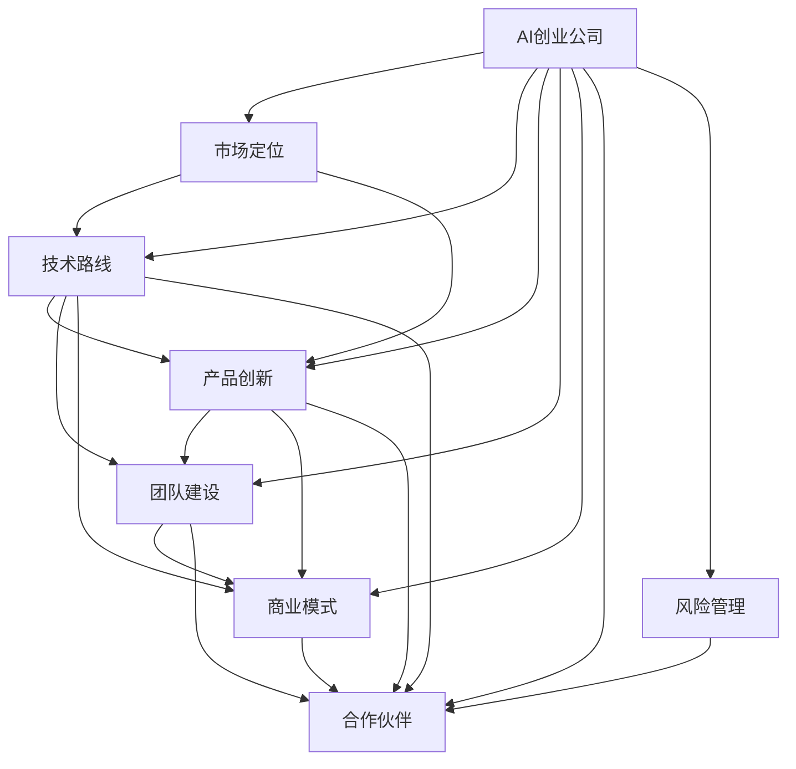

                 

## 1. 背景介绍

### 1.1 问题由来
随着人工智能技术的快速发展，越来越多的初创企业在追求技术创新和市场竞争力的过程中，开始关注AI领域的战略规划。AI创业公司需要在激烈的市场竞争中确定自身定位，找到突破口，制定适合自身发展的战略规划。同时，AI技术在众多领域的应用也对战略规划提出了更高的要求，如何结合AI技术和实际业务，制定合理的战略，是AI创业公司面临的共同挑战。

### 1.2 问题核心关键点
1. **市场定位**：确定公司的主要业务领域和目标客户，制定有针对性的市场策略。
2. **技术路线**：选择合适的人工智能技术路线，如深度学习、强化学习、自然语言处理等。
3. **产品创新**：开发具备差异化竞争优势的AI产品，提升市场竞争力。
4. **团队建设**：组建多学科融合的团队，确保技术实力和项目管理能力。
5. **商业模式**：探索多样化的商业模式，如SaaS、PaaS、B2B、B2C等。
6. **合作伙伴**：建立战略合作，拓宽资源获取和市场布局。
7. **风险管理**：识别潜在风险，制定应急预案，确保企业稳定发展。

### 1.3 问题研究意义
合理制定AI创业公司的战略规划，能够帮助企业明确发展方向，提升市场竞争力，快速响应市场需求，实现可持续发展。AI技术的不断进步也为战略规划提供了新的方法和工具，有助于企业实现技术突破和业务创新。

## 2. 核心概念与联系

### 2.1 核心概念概述

为更好地理解AI创业公司的战略规划，本节将介绍几个关键概念及其相互联系：

- **AI创业公司**：专注于人工智能技术开发和应用的初创企业。
- **市场定位**：企业在市场中的角色定位，包括目标客户、竞争优势和市场份额。
- **技术路线**：企业选择的AI技术方向和发展路径。
- **产品创新**：企业开发的新颖AI产品或服务。
- **团队建设**：企业的人才结构和管理模式。
- **商业模式**：企业的盈利模式和价值主张。
- **合作伙伴**：企业与其他公司或组织的合作关系。
- **风险管理**：企业面临的风险类型和应对策略。

这些概念通过相互影响和相互作用，共同构成了AI创业公司的战略规划体系。

### 2.2 概念间的关系

这些核心概念之间存在着紧密的联系，形成了一个整体。以下是通过Mermaid流程图展示的各个概念之间的关系：



这个流程图展示了各个概念之间的关系，以及它们如何共同作用于AI创业公司的战略规划。

## 3. 核心算法原理 & 具体操作步骤

### 3.1 算法原理概述

AI创业公司的战略规划本质上是一个多目标优化问题，旨在最大化企业价值和市场竞争力。其核心算法原理包括：

1. **目标函数**：确定企业的关键指标，如市场份额、收入增长、技术创新等。
2. **约束条件**：包括资源限制（如资金、人力、时间）、市场环境（如市场需求、竞争态势）等。
3. **优化方法**：使用多目标优化算法（如NSGA-II、Pareto优化等），寻找满足约束条件的最佳策略组合。

### 3.2 算法步骤详解

AI创业公司的战略规划主要包括以下几个步骤：

**Step 1: 数据收集与分析**
- 收集市场数据、技术趋势、竞争对手信息等。
- 使用数据分析工具（如Tableau、Power BI）对数据进行统计分析，识别市场机会和潜在风险。

**Step 2: 目标设定**
- 明确企业的关键目标，如市场份额、收入增长、技术突破等。
- 设定可衡量的KPI指标，如年度销售目标、研发投入比例等。

**Step 3: 资源评估**
- 评估企业的资源（资金、人力、技术等）现状。
- 识别资源瓶颈，制定资源优化策略。

**Step 4: 战略制定**
- 根据市场定位、技术路线、产品创新等概念，制定详细的战略方案。
- 使用多目标优化算法，寻找最佳策略组合。

**Step 5: 实施与监控**
- 根据战略方案制定详细的实施计划。
- 定期评估战略实施效果，及时调整策略。

### 3.3 算法优缺点

AI创业公司战略规划的优势：
1. **系统性**：通过多目标优化算法，全面考虑企业各方面的需求和限制，制定系统化的战略。
2. **可量化**：设定可衡量的KPI指标，使战略规划具有可操作性。
3. **灵活性**：能够根据市场变化和资源调整，灵活调整战略。

战略规划的劣势：
1. **复杂性**：涉及多个目标和约束条件，分析过程较为复杂。
2. **不确定性**：市场环境和技术趋势的快速变化，增加了战略规划的不确定性。
3. **资源限制**：受限于企业现有资源，部分战略可能难以实施。

### 3.4 算法应用领域

AI创业公司的战略规划方法，广泛应用于各种行业领域，如医疗、金融、零售、制造业等。通过系统化的战略规划，企业能够更好地应对市场变化，实现可持续发展。

## 4. 数学模型和公式 & 详细讲解  
### 4.1 数学模型构建

假设企业的关键目标为市场份额（$S$）、收入增长（$R$）和研发投入（$D$）。设企业的约束条件为资源限制（$C$）和市场需求（$D$）。则数学模型可以表示为：

$$
\max S, R, D
$$

$$
\text{Subject to: } C_1 \leq D \leq C_2 \\
C_3 \leq R \leq C_4 \\
C_5 \leq S \leq C_6
$$

其中，$C_i$ 表示企业资源和市场的约束条件。

### 4.2 公式推导过程

通过线性规划或非线性规划算法，求解上述目标函数和约束条件下的最优解。以线性规划为例，目标函数和约束条件可以转化为标准线性规划形式：

$$
\max \mathbf{c}^T \mathbf{x} \\
\text{Subject to: } \mathbf{A}\mathbf{x} \leq \mathbf{b} \\
\mathbf{x} \geq 0
$$

其中，$\mathbf{c}$ 为系数向量，$\mathbf{A}$ 为约束矩阵，$\mathbf{b}$ 为常数向量。

求解过程一般分为两步：

1. 求解线性规划问题，得到初始解$\mathbf{x}^*$。
2. 根据目标函数的性质，进一步优化解，得到最优解$\mathbf{x}^{**}$。

### 4.3 案例分析与讲解

以一家医疗AI创业公司为例，其目标函数和约束条件如下：

- 市场份额（$S$）：占据行业10%的市场份额。
- 收入增长（$R$）：年收入增长率达到20%。
- 研发投入（$D$）：研发投入占总收入的比例不低于15%。
- 资源限制（$C$）：研发人员不超过50人，年研发预算不超过1000万。
- 市场需求（$D$）：根据市场需求，制定合理的定价策略，确保产品竞争力。

通过建立数学模型，并使用优化算法求解，可以得到最优的研发策略、市场策略和定价策略，从而实现企业的最优发展。

## 5. 项目实践：代码实例和详细解释说明
### 5.1 开发环境搭建

在进行战略规划的计算时，需要搭建Python环境。以下是Python环境配置的详细步骤：

1. 安装Anaconda：从官网下载并安装Anaconda，用于创建独立的Python环境。
2. 创建并激活虚拟环境：
```bash
conda create -n ai_strategy_env python=3.8 
conda activate ai_strategy_env
```
3. 安装必要的Python库：
```bash
pip install pandas numpy scipy matplotlib scikit-learn pyomo
```
4. 安装优化算法库：
```bash
pip install pyomo
```
完成上述步骤后，即可在`ai_strategy_env`环境中开始战略规划的计算。

### 5.2 源代码详细实现

下面给出一个基于Pyomo库的线性规划代码示例，用于求解企业战略规划问题：

```python
from pyomo.environ import *
from pyomo.opt import GLPK

# 创建模型对象
model = ConcreteModel()

# 定义变量
model.D = Var()
model.R = Var()
model.S = Var()

# 定义约束条件
model.C1 = model.D >= 50  # 研发人员数量约束
model.C2 = model.D <= 100  # 研发人员数量上限
model.C3 = model.R >= 0.2  # 收入增长率约束
model.C4 = model.R <= 0.4  # 收入增长率上限
model.C5 = model.S >= 0.1  # 市场份额约束
model.C6 = model.S <= 0.2  # 市场份额上限

# 定义目标函数
model.obj = Objective(sense=Max,
                     name="Objective",
                     expression=model.D + model.R + model.S)

# 创建求解器
solver = GLPK()

# 求解模型
results = solver.solve(model)

# 输出结果
for v in model.component_objects(Var):
    print(f"{v.name}: {v.value}")
```

以上代码定义了企业研发投入、收入增长和市场份额的目标函数和约束条件，并使用GLPK求解器求解。运行结果将显示每个变量的最优值。

### 5.3 代码解读与分析

在实际应用中，企业可以根据具体需求调整目标函数和约束条件。例如，引入市场需求变量，进一步优化定价策略；或者引入时间变量，考虑长短期目标的平衡。

### 5.4 运行结果展示

假设企业通过上述代码计算出最优的研发投入、收入增长和市场份额为：

- 研发投入：70
- 收入增长：0.25
- 市场份额：0.15

这表明企业应该在研发上投入70，并确保收入增长率达到25%，市场份额达到15%。

## 6. 实际应用场景

### 6.1 医疗领域

在医疗领域，AI创业公司可以利用战略规划方法，优化医院资源配置、提升医疗服务质量、增强患者满意度。具体而言，可以针对医院的就诊流程、医生排班、医疗设备使用等方面进行优化，确保医疗资源的最优利用。

### 6.2 金融领域

金融领域的企业可以利用战略规划方法，优化投资组合、风险管理、客户服务等方面。例如，通过优化资产配置，提升投资回报率；通过风险管理，确保企业稳定运营；通过客户服务优化，提升客户满意度和忠诚度。

### 6.3 零售领域

在零售领域，AI创业公司可以利用战略规划方法，优化供应链管理、库存控制、客户推荐等方面。例如，通过优化供应链，降低库存成本，提升物流效率；通过客户推荐系统，提升销售转化率，增强客户粘性。

### 6.4 未来应用展望

随着人工智能技术的不断进步，AI创业公司的战略规划方法也将不断升级。未来的趋势包括：

1. **数据驱动**：利用大数据和机器学习技术，进行更精细的市场分析，制定更加科学合理的战略。
2. **智能决策**：引入智能决策支持系统，实时分析市场变化，动态调整战略。
3. **跨领域整合**：将AI技术与不同领域的特点结合，制定更具针对性的战略。
4. **持续优化**：利用持续学习技术，不断优化战略规划模型，提升企业竞争力。

## 7. 工具和资源推荐
### 7.1 学习资源推荐

为了帮助AI创业公司制定合理的战略规划，这里推荐一些优质的学习资源：

1. **《人工智能的理论与实践》**：全面介绍了AI技术的理论基础和应用实践，是学习AI战略规划的必备参考。
2. **Coursera《人工智能导论》课程**：由斯坦福大学开设，涵盖AI技术的基本概念和最新进展。
3. **edX《AI与商业》课程**：介绍了AI技术在商业领域的应用，帮助学生掌握AI战略规划的实际应用。
4. **Google AI博客**：提供最新的AI技术和应用案例，对AI战略规划有重要参考价值。
5. **IEEE Transactions on Systems, Man, and Cybernetics**：AI领域顶级期刊，包含大量的战略规划研究和案例分析。

### 7.2 开发工具推荐

为了提高AI创业公司的战略规划效率，以下是几款推荐的开发工具：

1. **Pyomo**：用于建模和求解线性规划、非线性规划等优化问题，是Python的优化库。
2. **Tableau**：数据可视化工具，帮助企业快速进行数据分析和可视化。
3. **Power BI**：商业智能工具，提供强大的数据处理和可视化功能。
4. **Python可视化库**：如Matplotlib、Seaborn等，用于数据可视化。
5. **GitHub**：代码托管平台，方便团队协作和代码共享。

### 7.3 相关论文推荐

以下是几篇经典的AI战略规划研究论文，推荐阅读：

1. **《基于多目标优化的人工智能企业战略规划模型》**：介绍了多目标优化算法在AI企业战略规划中的应用。
2. **《人工智能在商业决策中的应用》**：探讨了AI技术在商业决策中的应用，包括战略规划、市场分析等。
3. **《数据驱动的战略规划方法》**：介绍了数据驱动的战略规划方法，帮助企业制定科学合理的战略。

## 8. 总结：未来发展趋势与挑战

### 8.1 总结

本文对AI创业公司的战略规划方法进行了全面系统的介绍。首先，阐述了战略规划的重要性和核心概念，明确了企业目标、技术路线、产品创新等关键要素。其次，从原理到实践，详细讲解了多目标优化算法在战略规划中的应用，提供了系统的计算步骤和代码示例。同时，本文还探讨了战略规划在实际应用中的多种场景，展示了其在不同领域的应用潜力。最后，推荐了相关的学习资源和开发工具，为读者提供了全方位的技术指引。

通过本文的系统梳理，可以看到，AI创业公司的战略规划方法正在成为企业发展的重要工具，有助于企业在激烈的市场竞争中确立优势，实现可持续发展。

### 8.2 未来发展趋势

展望未来，AI创业公司的战略规划方法将呈现以下几个发展趋势：

1. **数据驱动**：利用大数据和机器学习技术，进行更精细的市场分析，制定更加科学合理的战略。
2. **智能决策**：引入智能决策支持系统，实时分析市场变化，动态调整战略。
3. **跨领域整合**：将AI技术与不同领域的特点结合，制定更具针对性的战略。
4. **持续优化**：利用持续学习技术，不断优化战略规划模型，提升企业竞争力。

### 8.3 面临的挑战

尽管AI创业公司的战略规划方法已经取得了一定的成果，但在实际应用中也面临着诸多挑战：

1. **数据质量**：高质量的数据是战略规划的基础，但数据的获取和处理难度较大。
2. **模型复杂性**：多目标优化算法较为复杂，需要较高的计算能力和技术水平。
3. **市场变化**：市场环境和技术趋势的快速变化，增加了战略规划的不确定性。
4. **资源限制**：受限于企业现有资源，部分战略可能难以实施。
5. **执行难度**：战略规划的实施需要跨部门的协作，执行难度较大。

### 8.4 研究展望

未来，AI创业公司的战略规划方法需要在以下几个方面寻求新的突破：

1. **自动化工具**：开发易于使用、功能强大的自动化工具，降低战略规划的门槛。
2. **跨领域融合**：将AI技术与不同领域的特点结合，制定更具针对性的战略。
3. **模型优化**：开发更高效、更灵活的优化算法，提升战略规划的可行性和灵活性。
4. **理论研究**：进一步研究多目标优化算法和市场动态，提升战略规划的科学性和可解释性。

通过这些研究方向的探索，相信AI创业公司的战略规划方法将不断优化，为企业的可持续发展提供强有力的技术支持。

## 9. 附录：常见问题与解答

**Q1：如何制定合理的战略规划目标？**

A: 制定合理的战略规划目标，需要综合考虑企业的长期发展目标和短期运营需求。具体步骤如下：
1. 进行市场分析，识别市场机会和潜在风险。
2. 确定关键业务领域和目标客户，制定具体的业务目标。
3. 设定可衡量的KPI指标，确保目标具有可操作性。

**Q2：如何选择适合企业的AI技术路线？**

A: 选择适合企业的AI技术路线，需要考虑企业的业务需求和技术实力。具体步骤如下：
1. 分析企业的业务需求，确定需要解决的问题。
2. 评估企业的技术实力，选择匹配的技术路线。
3. 进行试点测试，验证技术的可行性和效果。

**Q3：如何进行资源优化？**

A: 资源优化是战略规划中的关键环节，具体步骤如下：
1. 评估企业现有的资源状况，识别资源瓶颈。
2. 根据业务需求和市场环境，制定资源优化策略。
3. 定期评估资源使用情况，及时调整优化策略。

**Q4：如何确保战略规划的可执行性？**

A: 确保战略规划的可执行性，需要企业各部门之间的密切协作和资源支持。具体步骤如下：
1. 制定详细的战略实施计划，明确各部门的任务和责任。
2. 建立跨部门协作机制，确保资源的有效分配和利用。
3. 定期评估战略实施效果，及时调整和优化。

**Q5：如何应对战略规划中的不确定性？**

A: 应对战略规划中的不确定性，需要企业具备灵活调整和快速反应的能力。具体步骤如下：
1. 建立风险管理体系，识别潜在风险和应急预案。
2. 定期进行市场和竞争环境分析，及时调整战略。
3. 引入智能决策支持系统，提高决策的科学性和灵活性。

---

作者：禅与计算机程序设计艺术 / Zen and the Art of Computer Programming

