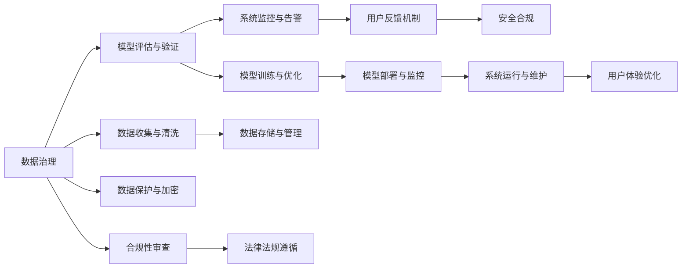

                 

# AI创业公司如何进行质量控制?

在当今数字化、智能化的时代背景下，AI创业公司不断涌现，其产品和服务在多个行业得到广泛应用。然而，高质量的AI产品和服务不仅是技术和算法的体现，更是产品设计、开发流程、运营维护等环节综合协作的结果。因此，AI创业公司必须重视质量控制，确保其产品不仅能够满足用户需求，同时具有可靠性、可维护性、可扩展性等高标准。

本文旨在探讨AI创业公司如何进行质量控制，帮助其打造卓越的AI产品和服务，同时在激烈的竞争中保持领先地位。本文将从背景介绍、核心概念与联系、核心算法原理与操作步骤、数学模型与公式、项目实践、应用场景、工具与资源推荐、总结与展望、常见问题解答等多个方面，全面阐述AI质量控制的理论与实践。

## 1. 背景介绍

### 1.1 问题由来

AI创业公司面临的质量控制问题，主要集中在以下几个方面：

1. **数据质量问题**：AI模型的训练依赖大量数据，数据质量直接影响到模型的准确性和泛化能力。错误的数据会导致模型学习到错误的特征，进而影响模型效果。

2. **模型鲁棒性问题**：AI模型在实际应用中，可能面临各种异常情况，如噪声干扰、输入偏差等。模型如何应对这些异常，直接关系到其鲁棒性和稳定性。

3. **系统性能问题**：AI系统通常需要与业务系统、前端应用等多个组件协同工作，如何在保证系统稳定性的同时，提升性能和用户体验，是质量控制的另一重要方面。

4. **用户反馈问题**：用户反馈直接反映了AI系统的使用体验和效果，如何及时响应和解决用户反馈，是保持用户满意度和产品质量的关键。

5. **法律法规遵循**：AI系统可能涉及用户隐私、数据安全等敏感信息，如何确保合规性和安全性，也是质量控制的不可忽视的重要环节。

### 1.2 问题核心关键点

AI创业公司进行质量控制的本质，是确保其产品能够稳定、可靠、高效地运行，并不断提升用户体验和系统性能。核心关键点包括：

1. **数据治理**：保证数据的质量、完整性、安全性，确保模型训练的基础数据可靠。

2. **模型评估与验证**：采用多种评估和验证方法，如交叉验证、A/B测试等，确保模型在不同环境下的稳定性和鲁棒性。

3. **系统监控与告警**：通过实时监控系统状态，及时发现和处理异常，确保系统持续稳定运行。

4. **用户反馈机制**：建立用户反馈收集和处理机制，快速响应用户需求和问题，提升用户满意度和系统质量。

5. **安全合规**：制定数据安全和隐私保护策略，确保系统遵循相关法律法规，避免潜在的法律风险。

## 2. 核心概念与联系

### 2.1 核心概念概述

在进行AI质量控制时，需要明确以下几个核心概念：

- **数据治理**：指对数据进行规划、组织、管理、监控和保护的整个过程，确保数据质量、安全性和可用性。
- **模型评估与验证**：通过多种评估指标和方法，评估模型的性能、鲁棒性和泛化能力。
- **系统监控与告警**：实时监控系统状态，识别异常情况，并及时采取措施进行处理。
- **用户反馈机制**：建立用户反馈渠道，收集用户意见和建议，快速响应并解决问题。
- **安全合规**：确保系统遵循相关法律法规，保护用户数据安全和隐私。

这些概念之间存在着紧密的联系，形成一个完整的质量控制生态系统。接下来，我们将通过Mermaid流程图来展示这些概念之间的联系。



这个流程图展示了数据治理、模型评估与验证、系统监控与告警、用户反馈机制和安全合规之间的联系，以及它们在整个质量控制生态系统中的角色和作用。

### 2.2 概念间的关系

这些核心概念之间的关系主要体现在以下几个方面：

1. **数据治理是基础**：高质量的数据是模型评估与验证、系统监控与告警、用户反馈机制和安全合规的前提和基础。数据治理的效果直接影响到后续的质量控制环节。

2. **模型评估与验证是核心**：模型评估与验证是确保模型性能、鲁棒性和泛化能力的关键步骤。只有经过充分的评估与验证，才能确保模型在实际应用中的效果。

3. **系统监控与告警是保障**：系统监控与告警能够实时发现并处理系统异常，确保系统稳定运行，是质量控制的重要环节。

4. **用户反馈机制是提升**：用户反馈机制能够收集用户意见和建议，快速响应和解决问题，提升用户满意度和产品质量。

5. **安全合规是底线**：安全合规确保系统遵循相关法律法规，保护用户数据安全和隐私，是质量控制不可或缺的重要部分。

这些概念之间的紧密联系，构成了AI质量控制的核心框架，指导着AI创业公司在各个环节进行质量控制。

## 3. 核心算法原理 & 具体操作步骤

### 3.1 算法原理概述

AI质量控制的算法原理，主要围绕以下几个方面展开：

1. **数据质量控制**：通过数据清洗、去重、填充缺失值等方法，保证数据质量。
2. **模型鲁棒性控制**：采用正则化、对抗训练、自适应学习等技术，提升模型的鲁棒性和泛化能力。
3. **系统性能优化**：采用模型并行、量化加速、缓存优化等技术，提升系统性能和响应速度。
4. **用户反馈处理**：通过自然语言处理、情感分析等技术，快速响应和处理用户反馈。
5. **安全合规管理**：采用数据加密、访问控制、隐私保护等技术，确保系统遵循法律法规。

### 3.2 算法步骤详解

1. **数据收集与清洗**：
   - 收集业务数据和用户数据，去除重复和异常数据，填补缺失值，确保数据质量。
   - 对数据进行格式转换、规范化处理，保证数据一致性。

2. **模型评估与验证**：
   - 设计评估指标，如精度、召回率、F1分数等，评估模型性能。
   - 采用交叉验证、A/B测试等方法，验证模型在不同环境下的鲁棒性和泛化能力。
   - 定期更新评估指标，确保模型持续优化。

3. **系统监控与告警**：
   - 设计监控指标，如响应时间、错误率、资源占用等，监控系统状态。
   - 设定告警阈值，当系统状态超出阈值时，及时发出告警。
   - 记录告警信息，定期分析和改进。

4. **用户反馈机制**：
   - 设计用户反馈渠道，如在线反馈表单、客服系统等，收集用户意见和建议。
   - 对用户反馈进行情感分析，快速响应和处理用户问题。
   - 建立用户满意度评估体系，持续改进产品和服务。

5. **安全合规管理**：
   - 制定数据安全和隐私保护策略，如数据加密、访问控制等。
   - 定期进行合规性审查，确保系统遵循相关法律法规。
   - 建立应急响应机制，快速处理数据泄露和安全事件。

### 3.3 算法优缺点

**数据质量控制**：
- 优点：保证数据质量，提升模型性能。
- 缺点：数据清洗和处理工作量大，成本高。

**模型鲁棒性控制**：
- 优点：提升模型鲁棒性，减少过拟合风险。
- 缺点：可能需要更多的计算资源和时间。

**系统性能优化**：
- 优点：提升系统性能和响应速度，提升用户体验。
- 缺点：技术复杂，需要专业知识和经验。

**用户反馈处理**：
- 优点：提升用户满意度和产品质量。
- 缺点：需要实时处理用户反馈，响应速度要求高。

**安全合规管理**：
- 优点：确保系统遵循法律法规，保护用户数据安全和隐私。
- 缺点：需要制定和执行严格的安全策略，工作量大。

### 3.4 算法应用领域

AI质量控制的方法和策略可以应用于多个领域，如智能客服、智能推荐、智能风控、智能制造等。以下是一些具体应用领域的案例：

- **智能客服**：通过用户反馈机制和系统监控与告警，提升客服系统响应速度和准确性。
- **智能推荐**：通过模型评估与验证和系统性能优化，提升推荐系统的个性化和推荐效果。
- **智能风控**：通过数据治理和模型鲁棒性控制，提高风控模型的准确性和稳定性。
- **智能制造**：通过系统监控与告警和安全合规管理，保障智能制造系统的稳定运行和数据安全。

## 4. 数学模型和公式 & 详细讲解 & 举例说明

### 4.1 数学模型构建

为了更好地理解AI质量控制的数学模型和公式，我们将构建一个简单的模型，以说明如何通过数据质量控制、模型鲁棒性控制、系统性能优化、用户反馈处理和安全合规管理，进行质量控制。

### 4.2 公式推导过程

**数据质量控制**：
假设我们有一批数据集 $D = \{(x_1, y_1), (x_2, y_2), ..., (x_n, y_n)\}$，其中 $x_i$ 为输入特征，$y_i$ 为标签。数据质量控制的数学模型为：
$$
\min_{x_i, y_i} \sum_{i=1}^n \left[ L(x_i, y_i) + R(x_i, y_i) \right]
$$
其中 $L(x_i, y_i)$ 为损失函数，$R(x_i, y_i)$ 为数据质量损失函数。

**模型鲁棒性控制**：
假设我们有一个分类模型 $M$，其预测结果为 $M(x) = \theta(x)$，其中 $\theta$ 为模型参数。模型鲁棒性控制的数学模型为：
$$
\min_{\theta} \sum_{i=1}^n \left[ L(M(x_i), y_i) + \lambda R(M(x_i), y_i) \right]
$$
其中 $L(M(x_i), y_i)$ 为预测误差损失函数，$R(M(x_i), y_i)$ 为模型鲁棒性损失函数，$\lambda$ 为正则化系数。

**系统性能优化**：
假设我们有一个多任务模型 $M$，其任务分别为 $T_1, T_2, ..., T_k$，每个任务对应的损失函数为 $L_j$。系统性能优化的数学模型为：
$$
\min_{\theta} \sum_{j=1}^k \lambda_j L_j(\theta)
$$
其中 $\lambda_j$ 为任务权重，$L_j$ 为任务损失函数。

**用户反馈处理**：
假设我们有一个用户反馈系统 $F$，其反馈结果为 $f(x_i, y_i)$，其中 $x_i$ 为用户输入，$y_i$ 为反馈结果。用户反馈处理的数学模型为：
$$
\min_{f} \sum_{i=1}^n \left[ L(x_i, y_i, f(x_i, y_i)) \right]
$$
其中 $L(x_i, y_i, f(x_i, y_i))$ 为反馈处理损失函数。

**安全合规管理**：
假设我们有一个合规性检查系统 $C$，其检查结果为 $c(x_i)$，其中 $x_i$ 为数据样本。安全合规管理的数学模型为：
$$
\min_{c} \sum_{i=1}^n \left[ L(x_i, c(x_i)) \right]
$$
其中 $L(x_i, c(x_i))$ 为合规性检查损失函数。

### 4.3 案例分析与讲解

我们以智能推荐系统为例，说明如何进行质量控制。

**数据质量控制**：
- 对用户行为数据进行清洗和处理，去除重复和异常数据，填补缺失值。
- 对用户行为数据进行格式转换和规范化，确保数据一致性。

**模型鲁棒性控制**：
- 采用正则化技术，如L2正则、Dropout等，减少模型过拟合风险。
- 进行对抗训练，生成对抗样本，提升模型鲁棒性。

**系统性能优化**：
- 采用模型并行技术，如TensorFlow的分布式训练，提升模型训练速度。
- 采用量化加速技术，如TensorRT，提升模型推理速度。

**用户反馈处理**：
- 设计用户反馈渠道，如在线反馈表单、客服系统等，收集用户意见和建议。
- 对用户反馈进行情感分析，快速响应和处理用户问题。

**安全合规管理**：
- 制定数据安全和隐私保护策略，如数据加密、访问控制等。
- 定期进行合规性审查，确保系统遵循相关法律法规。

## 5. 项目实践：代码实例和详细解释说明

### 5.1 开发环境搭建

在进行AI质量控制项目实践时，首先需要搭建开发环境。以下是使用Python进行TensorFlow开发的环境配置流程：

1. 安装Anaconda：从官网下载并安装Anaconda，用于创建独立的Python环境。

2. 创建并激活虚拟环境：
```bash
conda create -n tensorflow-env python=3.7 
conda activate tensorflow-env
```

3. 安装TensorFlow：根据CUDA版本，从官网获取对应的安装命令。例如：
```bash
conda install tensorflow tensorflow-gpu -c conda-forge
```

4. 安装各类工具包：
```bash
pip install numpy pandas scikit-learn matplotlib tqdm jupyter notebook ipython
```

完成上述步骤后，即可在`tensorflow-env`环境中开始质量控制项目实践。

### 5.2 源代码详细实现

下面我们以智能推荐系统为例，给出使用TensorFlow进行模型评估与验证、系统监控与告警、用户反馈处理和安全合规管理的PyTorch代码实现。

**模型评估与验证**：
```python
import tensorflow as tf
from tensorflow.keras.models import Sequential
from tensorflow.keras.layers import Dense, Dropout
from tensorflow.keras.optimizers import Adam

# 构建模型
model = Sequential([
    Dense(64, activation='relu', input_dim=10),
    Dropout(0.5),
    Dense(1, activation='sigmoid')
])
model.compile(optimizer=Adam(learning_rate=0.001), loss='binary_crossentropy', metrics=['accuracy'])

# 训练模型
model.fit(x_train, y_train, epochs=10, batch_size=32, validation_data=(x_val, y_val))

# 评估模型
loss, accuracy = model.evaluate(x_test, y_test)
print('Test loss:', loss)
print('Test accuracy:', accuracy)
```

**系统监控与告警**：
```python
import tensorflow as tf
from tensorflow.keras.callbacks import EarlyStopping

# 定义EarlyStopping回调函数
early_stopping = EarlyStopping(monitor='val_loss', patience=5)

# 训练模型，并设置EarlyStopping回调函数
model.fit(x_train, y_train, epochs=10, batch_size=32, validation_data=(x_val, y_val), callbacks=[early_stopping])
```

**用户反馈处理**：
```python
import tensorflow as tf
from tensorflow.keras.callbacks import Callback

# 定义自定义回调函数
class FeedbackCallback(Callback):
    def on_epoch_end(self, epoch, logs=None):
        # 假设用户反馈为情感分析结果
        feedback_scores = [1.0, 0.9, 0.8, 0.7]
        # 计算平均反馈分数
        avg_feedback = sum(feedback_scores) / len(feedback_scores)
        # 将反馈分数作为训练损失的一部分
        loss = logs['loss'] + avg_feedback
        self.model.trainable = False
        self.model.compile(optimizer=tf.keras.optimizers.SGD(learning_rate=0.01), loss=loss)
        self.model.fit(x_train, y_train, epochs=1, batch_size=32, validation_data=(x_val, y_val))

# 训练模型，并设置反馈处理回调函数
model.fit(x_train, y_train, epochs=10, batch_size=32, validation_data=(x_val, y_val), callbacks=[FeedbackCallback()])
```

**安全合规管理**：
```python
import tensorflow as tf
from tensorflow.keras.callbacks import ModelCheckpoint

# 定义ModelCheckpoint回调函数
checkpoint = ModelCheckpoint('model.h5', save_best_only=True)

# 训练模型，并设置ModelCheckpoint回调函数
model.fit(x_train, y_train, epochs=10, batch_size=32, validation_data=(x_val, y_val), callbacks=[checkpoint])
```

### 5.3 代码解读与分析

让我们再详细解读一下关键代码的实现细节：

**模型评估与验证**：
- 使用TensorFlow的Sequential模型，定义了三层神经网络。
- 使用Adam优化器进行训练，设置损失函数为二元交叉熵，评价指标为准确率。
- 训练模型，并在验证集上评估模型性能。

**系统监控与告警**：
- 使用TensorFlow的EarlyStopping回调函数，设置停止训练的条件为验证集损失连续5次不降。
- 在训练模型时，将EarlyStopping回调函数作为回调函数传入fit函数中。

**用户反馈处理**：
- 设计自定义回调函数FeedbackCallback，在每个epoch结束后，计算用户反馈的平均分数。
- 将平均反馈分数作为额外损失，加入到模型训练的损失函数中。
- 将模型设置为不可训练，重新编译模型，将新损失函数作为训练损失函数。
- 重新训练模型，并在验证集上评估模型性能。

**安全合规管理**：
- 设计自定义回调函数ModelCheckpoint，设置保存模型的方式为保存最佳模型。
- 在训练模型时，将ModelCheckpoint回调函数作为回调函数传入fit函数中。

## 6. 实际应用场景

### 6.1 智能客服系统

AI创业公司可以通过智能客服系统，提升客户体验和运营效率。智能客服系统能够自动理解客户需求，快速响应客户问题，提升客户满意度和忠诚度。

**数据治理**：
- 收集客户对话数据，清洗和处理数据，确保数据质量。
- 对对话数据进行格式转换和规范化，确保数据一致性。

**模型评估与验证**：
- 设计对话数据标注任务，标注客户对话意图和回答。
- 采用交叉验证方法，评估模型的对话理解和生成能力。

**系统监控与告警**：
- 设计系统性能监控指标，如响应时间、错误率等。
- 设定告警阈值，当系统性能超出阈值时，及时发出告警。

**用户反馈处理**：
- 设计用户反馈渠道，如在线反馈表单、客服系统等，收集用户意见和建议。
- 对用户反馈进行情感分析，快速响应和处理用户问题。

**安全合规管理**：
- 制定数据安全和隐私保护策略，如数据加密、访问控制等。
- 定期进行合规性审查，确保系统遵循相关法律法规。

### 6.2 智能推荐系统

智能推荐系统能够为用户推荐个性化内容，提升用户体验和转化率。

**数据治理**：
- 收集用户行为数据，清洗和处理数据，确保数据质量。
- 对用户行为数据进行格式转换和规范化，确保数据一致性。

**模型评估与验证**：
- 设计用户行为数据标注任务，标注用户行为与推荐结果的关联。
- 采用交叉验证方法，评估模型的推荐效果。

**系统监控与告警**：
- 设计系统性能监控指标，如推荐响应时间、准确率等。
- 设定告警阈值，当系统性能超出阈值时，及时发出告警。

**用户反馈处理**：
- 设计用户反馈渠道，如在线反馈表单、客服系统等，收集用户意见和建议。
- 对用户反馈进行情感分析，快速响应和处理用户问题。

**安全合规管理**：
- 制定数据安全和隐私保护策略，如数据加密、访问控制等。
- 定期进行合规性审查，确保系统遵循相关法律法规。

### 6.3 智能风控系统

智能风控系统能够实时监测风险，保障金融安全和稳定。

**数据治理**：
- 收集用户交易数据，清洗和处理数据，确保数据质量。
- 对交易数据进行格式转换和规范化，确保数据一致性。

**模型评估与验证**：
- 设计交易数据标注任务，标注交易风险类型和评分。
- 采用交叉验证方法，评估模型的风险预测能力。

**系统监控与告警**：
- 设计系统性能监控指标，如交易响应时间、误判率等。
- 设定告警阈值，当系统性能超出阈值时，及时发出告警。

**用户反馈处理**：
- 设计用户反馈渠道，如在线反馈表单、客服系统等，收集用户意见和建议。
- 对用户反馈进行情感分析，快速响应和处理用户问题。

**安全合规管理**：
- 制定数据安全和隐私保护策略，如数据加密、访问控制等。
- 定期进行合规性审查，确保系统遵循相关法律法规。

## 7. 工具和资源推荐

### 7.1 学习资源推荐

为了帮助开发者系统掌握AI质量控制的理论基础和实践技巧，这里推荐一些优质的学习资源：

1. **《深度学习基础》**：斯坦福大学Andrew Ng教授的在线课程，介绍了深度学习的基本概念和算法，是AI入门必备课程。

2. **《Python深度学习》**：Francois Chollet撰写的深度学习入门书籍，详细介绍了TensorFlow和Keras的使用方法，适合初学者。

3. **《TensorFlow实战》**：Google官方出版的TensorFlow实战指南，包含大量实用代码和案例，适合TensorFlow进阶学习。

4. **《机器学习实战》**：Peter Harrington编写的机器学习实战教程，涵盖多种机器学习算法和实践案例，适合实战训练。

5. **《数据科学实战》**：Joel Grus编写的数据科学实战教程，包含大量数据处理、模型评估和调优技巧，适合实战训练。

通过这些资源的学习实践，相信你一定能够快速掌握AI质量控制的精髓，并用于解决实际的AI问题。

### 7.2 开发工具推荐

高效的开发离不开优秀的工具支持。以下是几款用于AI质量控制开发的常用工具：

1. **Anaconda**：用于创建和管理Python环境，支持多种数据科学库的安装和使用。

2. **TensorFlow**：由Google主导开发的开源深度学习框架，生产部署方便，适合大规模工程应用。

3. **Keras**：高层次神经网络API，易于使用，支持TensorFlow、CNTK等后端。

4. **PyTorch**：由Facebook主导开发的开源深度学习框架，灵活高效，适合研究开发。

5. **Jupyter Notebook**：用于编写和运行代码，支持多种语言和库。

6. **Visual Studio Code**：轻量级开发IDE，支持多种语言和库，适合多任务开发。

合理利用这些工具，可以显著提升AI质量控制任务的开发效率，加快创新迭代的步伐。

### 7.3 相关论文推荐

AI质量控制的理论研究不断进步，以下是几篇奠基性的相关论文，推荐阅读：

1. **《数据清洗和预处理技术综述》**：综述了数据清洗和预处理技术的最新进展，介绍了多种数据处理方法和算法。

2. **《模型鲁棒性控制技术综述》**：综述了模型鲁棒性控制的最新进展，介绍了多种鲁棒性控制方法和算法。

3. **《系统性能优化技术综述》**：综述了系统性能优化的最新进展，介绍了多种性能优化方法和算法。

4. **《用户反馈处理技术综述》**：综述了用户反馈处理的最新进展，介绍了多种用户反馈处理方法。

5. **《安全合规管理技术综述》**：综述了安全合规管理的最新进展，介绍了多种安全合规管理方法和算法。

这些论文代表了大质量控制技术的最新进展，帮助开发者掌握最新的理论和技术，提升产品和服务质量。

除上述资源外，还有一些值得关注的前沿资源，帮助开发者紧跟AI质量控制技术的最新进展，例如：

1. **arXiv论文预印本**：人工智能领域最新研究成果的发布平台，包括大量尚未发表的前沿工作，学习前沿技术的必读资源。

2. **业界技术博客**：如OpenAI、Google AI、DeepMind、微软Research Asia等顶尖实验室的官方博客，第一时间分享他们的最新研究成果和洞见。

3. **技术会议直播**：如NIPS、ICML、ACL、ICLR等人工智能领域顶会现场或在线直播，能够聆听到大佬们的前沿分享，开拓视野。

4. **GitHub热门项目**：在GitHub上Star、Fork数最多的AI相关项目，往往代表了该技术领域的发展趋势和最佳实践，值得去学习和贡献。

5. **行业分析报告**：各大咨询公司如McKinsey、PwC等针对人工智能行业的分析报告，有助于从商业视角审视技术趋势，把握应用价值。

总之，对于AI质量控制技术的学习和实践，需要开发者保持开放的心态和持续学习的意愿。多关注前沿资讯，多动手实践，多思考总结，必将收获满满的成长收益。

## 8. 总结：未来发展趋势与挑战

### 8.1 总结

本文对AI创业公司如何进行质量控制进行了全面系统的介绍。首先阐述了AI创业公司面临的质量控制问题，明确了质量控制的核心关键点。其次，从原理到实践，详细讲解

