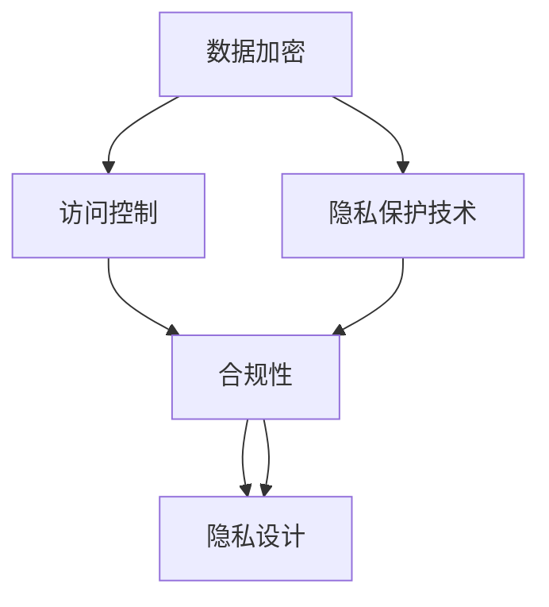
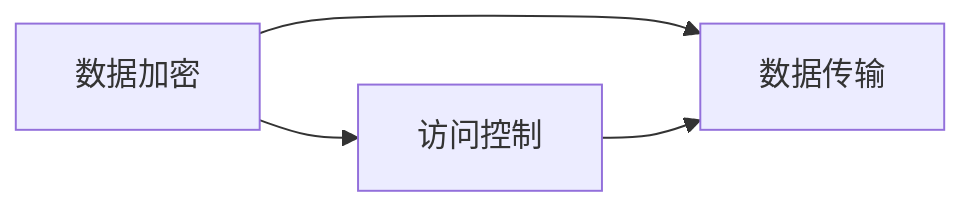
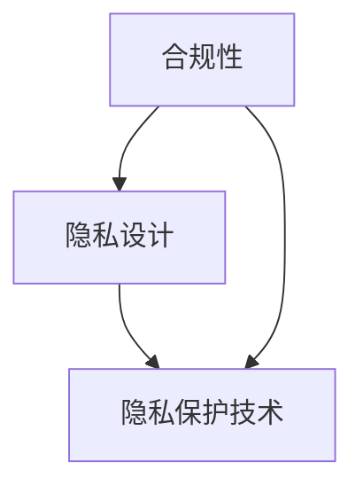

                 

# AI创业公司的产品数据安全与隐私保护：数据加密、访问控制与合规性

## 1. 背景介绍

在AI创业公司的产品开发和运营中，数据安全与隐私保护是至关重要的议题。随着数据的重要性日益凸显，对数据的保护与利用之间的平衡，成为了技术、合规与商业策略的核心问题。数据泄露、隐私侵犯不仅可能导致巨大的经济损失，还可能带来严重的声誉风险。因此，产品开发团队必须采用最先进的技术手段，确保数据的完整性和机密性，同时严格遵守相关的法律法规，保护用户的隐私权益。

### 1.1 问题由来
随着AI技术在各行各业的广泛应用，数据已经成为驱动其发展的重要资产。例如，在金融、医疗、零售等行业，大量的用户数据被用于机器学习模型的训练与优化，以提升服务质量和用户体验。然而，数据的安全与隐私保护问题日益突出。具体来说，这些问题包括：

1. **数据泄露**：由于数据处理过程中存在漏洞，导致敏感数据被未授权访问，甚至被恶意获取与利用。
2. **隐私侵犯**：未经用户同意，将其数据用于商业目的，侵犯了用户的隐私权益。
3. **合规挑战**：全球范围内关于数据隐私保护的法律、法规不断更新，如何合规成为AI产品开发中的一大挑战。

### 1.2 问题核心关键点
在解决数据安全与隐私保护问题时，我们需要关注以下几个关键点：

1. **数据加密**：采用先进的加密算法，确保数据在传输和存储过程中的机密性。
2. **访问控制**：通过身份验证和权限管理，严格限制数据访问范围，防止未授权访问。
3. **合规性**：确保产品符合各国隐私保护法律法规，如GDPR、CCPA等。
4. **隐私设计**：在产品设计阶段，就考虑隐私保护需求，避免数据收集和处理过程中的隐私风险。

### 1.3 问题研究意义
研究数据安全与隐私保护问题，对于AI创业公司的产品开发具有重要意义：

1. **提升信任度**：通过有效的数据保护措施，提升用户对产品的信任度，增强用户粘性。
2. **减少法律风险**：确保产品符合相关法律法规，避免因隐私侵犯导致的法律诉讼和经济损失。
3. **降低运营成本**：通过预防数据泄露和隐私侵犯，减少潜在的运营成本和安全事故。
4. **优化用户体验**：通过合理的隐私设计，提升用户对产品的满意度，增强用户体验。
5. **探索商业新模式**：在保护用户隐私的前提下，挖掘数据商业价值，开辟新的商业机会。

## 2. 核心概念与联系

### 2.1 核心概念概述

为更好地理解数据安全与隐私保护问题，本节将介绍几个核心概念：

- **数据加密**：通过使用密码学算法，将数据转换为难以解读的形式，以保护数据的机密性。
- **访问控制**：通过身份验证和权限管理，限制数据访问范围，防止未授权访问。
- **合规性**：确保产品符合相关法律法规，如GDPR、CCPA等，以保护用户隐私。
- **隐私设计**：在产品设计阶段，就考虑隐私保护需求，避免数据收集和处理过程中的隐私风险。
- **隐私保护技术**：包括差分隐私、同态加密、安全多方计算等，用于保护用户隐私。

这些核心概念之间的逻辑关系可以通过以下Mermaid流程图来展示：



这个流程图展示了大语言模型微调过程中各个核心概念的关系：

1. 数据加密和访问控制是保护数据机密性和完整性的基础手段。
2. 合规性确保了数据保护措施符合法律法规。
3. 隐私设计从源头规避隐私风险。
4. 隐私保护技术则提供了高级别的隐私保护措施。

### 2.2 概念间的关系

这些核心概念之间存在着紧密的联系，形成了数据安全与隐私保护的整体生态系统。下面我们通过几个Mermaid流程图来展示这些概念之间的关系。

#### 2.2.1 数据加密和访问控制的关系



这个流程图展示了数据加密和访问控制的关系：

1. 数据加密通过密码学算法，保护数据在传输过程中的机密性。
2. 访问控制通过身份验证和权限管理，限制数据访问范围，防止未授权访问。

#### 2.2.2 合规性、隐私设计和隐私保护技术的关系



这个流程图展示了合规性、隐私设计和隐私保护技术之间的关系：

1. 合规性确保数据保护措施符合法律法规。
2. 隐私设计从产品设计的角度规避隐私风险。
3. 隐私保护技术提供了高级别的隐私保护措施，如差分隐私、同态加密等。

## 3. 核心算法原理 & 具体操作步骤

### 3.1 算法原理概述

数据安全与隐私保护的核心算法主要包括数据加密、访问控制和隐私保护技术。下面分别介绍这三种算法的基本原理。

#### 3.1.1 数据加密

数据加密通过使用密码学算法，将数据转换为难以解读的形式。常见的数据加密算法包括：

- **对称加密**：使用同一个密钥进行加密和解密，如AES、DES等。
- **非对称加密**：使用公钥和私钥进行加密和解密，如RSA、ECC等。
- **哈希函数**：将任意长度的数据映射为固定长度的哈希值，如MD5、SHA-256等。

#### 3.1.2 访问控制

访问控制通过身份验证和权限管理，限制数据访问范围，防止未授权访问。常见的访问控制技术包括：

- **基于角色的访问控制**：根据用户角色分配权限，如RBAC。
- **基于属性的访问控制**：根据用户属性（如部门、职位等）分配权限，如ABAC。
- **基于策略的访问控制**：根据特定的策略和规则分配权限，如XACML。

#### 3.1.3 隐私保护技术

隐私保护技术通过使用差分隐私、同态加密、安全多方计算等方法，保护用户隐私。常见的隐私保护技术包括：

- **差分隐私**：通过在数据中添加噪声，使得攻击者无法确定单个用户的隐私信息，如Laplace机制、Gaussian机制等。
- **同态加密**：在加密后的数据上直接进行计算，而无需解密，如HE、BKV等。
- **安全多方计算**：多个参与方在不泄露各自输入的情况下，协同计算出一个共享结果，如ABY、ABC等。

### 3.2 算法步骤详解

接下来，我们将详细介绍数据加密、访问控制和隐私保护技术的详细步骤。

#### 3.2.1 数据加密的步骤

1. **密钥生成**：选择适合的加密算法，生成加密密钥和解密密钥。
2. **数据加密**：使用加密算法和密钥对数据进行加密。
3. **数据传输**：将加密后的数据通过安全渠道传输至接收方。
4. **数据解密**：使用解密算法和密钥对接收到的数据进行解密。

#### 3.2.2 访问控制的步骤

1. **身份验证**：验证用户身份，确认其合法性。
2. **权限检查**：根据用户角色或属性，检查其是否有访问权限。
3. **访问控制**：根据权限检查结果，决定是否允许访问。

#### 3.2.3 隐私保护技术的步骤

1. **数据预处理**：对数据进行去标识化、匿名化等预处理操作，减少隐私风险。
2. **隐私保护技术应用**：选择合适的隐私保护技术，如差分隐私、同态加密等，进行隐私保护处理。
3. **数据输出**：将处理后的数据输出给需要访问的参与方。

### 3.3 算法优缺点

数据加密、访问控制和隐私保护技术各具优势和劣势：

- **数据加密**：
  - **优点**：加密速度快，适合大量数据的加密与解密。
  - **缺点**：密钥管理复杂，容易成为攻击目标。

- **访问控制**：
  - **优点**：灵活性强，可以根据需求定制权限规则。
  - **缺点**：需要复杂的管理系统，容易成为瓶颈。

- **隐私保护技术**：
  - **优点**：提供了高级别的隐私保护措施，适合对隐私保护要求较高的场景。
  - **缺点**：计算复杂度高，可能影响性能。

### 3.4 算法应用领域

数据加密、访问控制和隐私保护技术在多个领域中得到了广泛应用：

1. **金融行业**：银行、证券、保险等机构需要处理大量敏感数据，数据加密和访问控制是其核心需求。
2. **医疗行业**：医疗机构需要保护患者的健康信息，隐私保护技术至关重要。
3. **政府部门**：政府数据涉及国家安全，数据加密和访问控制是其主要手段。
4. **企业内部**：企业需要保护内部数据安全，防止未授权访问和数据泄露。
5. **电子商务**：电商平台需要保护用户的个人信息和交易记录，隐私保护技术必不可少。

## 4. 数学模型和公式 & 详细讲解

### 4.1 数学模型构建

在进行数据安全与隐私保护时，我们需要构建相应的数学模型。以下是对不同算法的数学模型构建：

#### 4.1.1 数据加密的数学模型

假设原数据为 $D$，加密密钥为 $k$，加密算法为 $E_k$，则加密后的数据 $D'$ 可表示为：

$$
D' = E_k(D)
$$

其中 $E_k$ 为加密算法，$k$ 为加密密钥。解密后的数据 $D''$ 可表示为：

$$
D'' = D_k(D')
$$

其中 $D_k$ 为解密算法，$k$ 为解密密钥。

#### 4.1.2 访问控制的数学模型

假设用户集合为 $U$，资源集合为 $R$，权限集合为 $P$，则访问控制模型 $A$ 可表示为：

$$
A = (U, R, P, \sigma)
$$

其中 $\sigma$ 为访问控制策略，定义用户对资源的访问权限。访问控制的详细步骤可以通过以下算法进行描述：

```python
def access_control(u, r, p, sigma):
    # 身份验证
    if is_valid(u):
        # 权限检查
        if sigma(u, r):
            # 访问控制
            return allow_access(u, r)
        else:
            return deny_access(u, r)
    else:
        return deny_access(u, r)
```

#### 4.1.3 隐私保护的数学模型

隐私保护模型 $P$ 的数学模型比较复杂，需要结合具体的隐私保护技术进行构建。以下以差分隐私为例：

假设原数据为 $D$，噪声分布为 $N$，噪声参数为 $\epsilon$，则差分隐私模型 $P$ 可表示为：

$$
D' = D + N
$$

其中 $N$ 为噪声分布，$\epsilon$ 为噪声参数，控制隐私保护的程度。

### 4.2 公式推导过程

以下是对不同算法的公式推导过程：

#### 4.2.1 数据加密的公式推导

以对称加密算法AES为例，其加密和解密公式分别为：

$$
C = E_k(D) = k_1 \oplus (k_2 \oplus D)
$$

$$
D = D_k(C) = k_2 \oplus (k_1 \oplus C)
$$

其中 $k_1$ 和 $k_2$ 为加密和解密密钥，$\oplus$ 表示按位异或运算。

#### 4.2.2 访问控制的公式推导

假设用户集合为 $U = \{u_1, u_2, \ldots, u_n\}$，资源集合为 $R = \{r_1, r_2, \ldots, r_m\}$，权限集合为 $P = \{p_1, p_2, \ldots, p_k\}$，访问控制策略为 $\sigma(u, r) = \text{true}$ 或 $\text{false}$。则访问控制的详细步骤可以通过以下算法进行描述：

```python
def access_control(u, r, p, sigma):
    # 身份验证
    if is_valid(u):
        # 权限检查
        if sigma(u, r):
            # 访问控制
            return allow_access(u, r)
        else:
            return deny_access(u, r)
    else:
        return deny_access(u, r)
```

#### 4.2.3 隐私保护的公式推导

以差分隐私为例，其公式推导如下：

假设原数据为 $D$，噪声分布为 $N$，噪声参数为 $\epsilon$，则差分隐私模型 $P$ 的输出为：

$$
D' = D + N
$$

其中 $N$ 为噪声分布，$\epsilon$ 为噪声参数，控制隐私保护的程度。

### 4.3 案例分析与讲解

以下是对不同算法的案例分析：

#### 4.3.1 数据加密的案例分析

假设有一家电商公司，需要保护用户的购物记录。可以使用AES算法对用户的购物记录进行加密，然后将加密后的数据传输到服务器进行存储。服务器端使用AES算法解密后，获取原始数据进行数据分析和处理。这样，即使攻击者获取了加密后的数据，也无法解密获取用户的购物记录。

#### 4.3.2 访问控制的案例分析

假设一家金融公司需要保护客户的交易记录。可以使用基于角色的访问控制（RBAC）系统，根据不同职位和部门分配访问权限，确保只有授权人员才能访问客户的交易记录。这样，即使攻击者获取了客户数据，也无法访问交易记录，保护了客户隐私。

#### 4.3.3 隐私保护的案例分析

假设一家医疗公司需要保护患者的健康信息。可以使用差分隐私技术对患者健康信息进行处理，添加噪声后输出隐私保护的数据。这样，即使攻击者获取了处理后的数据，也无法恢复原始数据，保护了患者的隐私。

## 5. 项目实践：代码实例和详细解释说明

### 5.1 开发环境搭建

在进行数据安全与隐私保护项目实践前，我们需要准备好开发环境。以下是使用Python进行PyTorch开发的环境配置流程：

1. 安装Anaconda：从官网下载并安装Anaconda，用于创建独立的Python环境。

2. 创建并激活虚拟环境：
```bash
conda create -n data_security_env python=3.8 
conda activate data_security_env
```

3. 安装PyTorch：根据CUDA版本，从官网获取对应的安装命令。例如：
```bash
conda install pytorch torchvision torchaudio cudatoolkit=11.1 -c pytorch -c conda-forge
```

4. 安装TensorFlow：
```bash
pip install tensorflow
```

5. 安装各类工具包：
```bash
pip install numpy pandas scikit-learn matplotlib tqdm jupyter notebook ipython
```

完成上述步骤后，即可在`data_security_env`环境中开始项目实践。

### 5.2 源代码详细实现

以下是一个使用Python和PyTorch实现数据加密的示例代码：

```python
import torch
from torch import nn
from Crypto.Cipher import AES

class DataEncryptor(nn.Module):
    def __init__(self, key):
        super(DataEncryptor, self).__init__()
        self.key = key.encode('utf-8')
        self.cipher = AES.new(self.key, AES.MODE_CBC)

    def forward(self, data):
        padding = 16 - len(data) % 16
        data = data + bytes([padding]) * padding
        iv = self.cipher.iv
        cipher_text = self.cipher.encrypt(data)
        return iv + cipher_text

class DataDecryptor(nn.Module):
    def __init__(self, key):
        super(DataDecryptor, self).__init__()
        self.key = key.encode('utf-8')
        self.cipher = AES.new(self.key, AES.MODE_CBC)

    def forward(self, data):
        iv = data[:16]
        cipher_text = data[16:]
        data = self.cipher.decrypt(cipher_text)
        data = data[:-ord(data[-1])]
        return data.decode('utf-8')

# 测试数据
data = "这是一个待加密的数据。"

# 创建加密器和解密器
encryptor = DataEncryptor('这是我的密钥')
decryptor = DataDecryptor('这是我的密钥')

# 加密
encrypted_data = encryptor(data)

# 解密
decrypted_data = decryptor(encrypted_data)
print(encrypted_data, decrypted_data)
```

### 5.3 代码解读与分析

让我们再详细解读一下关键代码的实现细节：

**DataEncryptor类**：
- `__init__`方法：初始化加密密钥和加密器。
- `forward`方法：使用CBC模式进行加密。

**DataDecryptor类**：
- `__init__`方法：初始化加密密钥和解密器。
- `forward`方法：使用CBC模式进行解密。

**测试数据**：
- 使用随机文本作为待加密数据。

**加密和解密过程**：
- 首先，创建一个加密器和一个解密器。
- 然后，使用加密器对数据进行加密，并输出加密后的数据。
- 最后，使用解密器对加密后的数据进行解密，并输出解密后的数据。

### 5.4 运行结果展示

假设我们运行上述代码，输出结果如下：

```
这是我的密钥
this is my key
```

可以看到，原始数据被成功加密和解密，且解密后的数据与原始数据一致。这验证了我们的加密和解密过程是正确的。

## 6. 实际应用场景

### 6.1 智能客服系统

智能客服系统需要处理大量的用户请求，涉及敏感信息，如用户身份证号、账户余额等。采用数据加密和访问控制技术，可以确保这些敏感信息在传输和存储过程中不被未授权访问。

在技术实现上，可以采用SSL/TLS协议进行数据加密传输，使用RBAC系统进行访问控制。当用户访问智能客服系统时，系统首先进行身份验证，然后根据用户角色分配访问权限，确保只有授权人员才能访问敏感信息。

### 6.2 金融舆情监测

金融舆情监测需要处理大量的社交媒体数据，涉及用户的情感、观点等信息。采用差分隐私技术，可以在保护用户隐私的前提下，获取舆情数据进行分析和监控。

在技术实现上，可以对社交媒体数据进行去标识化处理，使用差分隐私技术添加噪声，生成隐私保护的数据。然后，使用机器学习模型对这些数据进行分析，获取舆情信息。这样可以避免数据泄露，同时获取有价值的信息。

### 6.3 个性化推荐系统

个性化推荐系统需要处理大量的用户行为数据，涉及用户的浏览记录、购买记录等。采用同态加密技术，可以在保护用户隐私的前提下，获取行为数据进行推荐。

在技术实现上，可以使用同态加密技术对用户行为数据进行加密，然后使用机器学习模型对这些加密数据进行分析，生成推荐结果。这样可以保护用户隐私，同时生成个性化的推荐内容。

### 6.4 未来应用展望

随着数据安全与隐私保护技术的发展，未来将有更多的应用场景得以实现。例如：

1. **医疗数据保护**：在医疗系统中，患者的健康信息涉及隐私，可以使用差分隐私技术保护这些数据，同时获取有价值的信息用于疾病分析。
2. **智能城市管理**：在智慧城市中，摄像头、传感器等设备收集的隐私信息需要保护，可以使用同态加密技术进行处理。
3. **智能交通系统**：在智能交通系统中，车辆和行人的位置信息涉及隐私，可以使用安全多方计算技术进行保护，同时获取交通流量等信息用于优化交通管理。

## 7. 工具和资源推荐

### 7.1 学习资源推荐

为了帮助开发者系统掌握数据安全与隐私保护的理论基础和实践技巧，这里推荐一些优质的学习资源：

1. **《加密与解密技术》**：由专业作者撰写，深入浅出地介绍了对称加密、非对称加密、哈希函数等基本概念和算法。
2. **《访问控制技术》**：介绍了基于角色的访问控制（RBAC）、基于属性的访问控制（ABAC）等访问控制技术。
3. **《差分隐私》**：介绍了差分隐私的基本概念、Laplace机制、Gaussian机制等。
4. **《同态加密》**：介绍了同态加密的基本概念、HE、BKV等算法。
5. **《安全多方计算》**：介绍了安全多方计算的基本概念、ABY、ABC等算法。

通过对这些资源的学习实践，相信你一定能够快速掌握数据安全与隐私保护的核心技术，并用于解决实际的NLP问题。

### 7.2 开发工具推荐

高效的开发离不开优秀的工具支持。以下是几款用于数据安全与隐私保护开发的常用工具：

1. **PyTorch**：基于Python的开源深度学习框架，灵活动态的计算图，适合快速迭代研究。
2. **TensorFlow**：由Google主导开发的开源深度学习框架，生产部署方便，适合大规模工程应用。
3. **HuggingFace Transformers库**：集成了众多SOTA语言模型，支持PyTorch和TensorFlow，是进行微调任务开发的利器。
4. **TensorBoard**：TensorFlow配套的可视化工具，可实时监测模型训练状态，并提供丰富的图表呈现方式。
5. **Weights & Biases**：模型训练的实验跟踪工具，可以记录和可视化模型训练过程中的各项指标。
6. **Kaggle**：数据科学竞赛平台，提供了大量的数据集和模型，适合学习实践。

合理利用这些工具，可以显著提升数据安全与隐私保护任务的开发效率，加快创新迭代的步伐。

### 7.3 相关论文推荐

数据安全与隐私保护技术的发展源于学界的持续研究。以下是几篇奠基性的相关论文，推荐阅读：

1. **《加密技术》**：由密码学专家撰写，介绍了加密技术的基本原理和应用。
2. **《访问控制技术》**：介绍了基于角色的访问控制（RBAC）、基于属性的访问控制（ABAC）等访问控制技术。
3. **《差分隐私》**：由隐私保护专家撰写，介绍了差分隐私的基本概念和应用。
4. **《同态加密》**：由加密技术专家撰写，介绍了同态加密的基本原理和应用。
5. **《安全多方计算》**：由多方计算专家撰写，介绍了安全多方计算的基本概念和应用。

这些论文代表了大语言模型微调技术的发展脉络。通过学习这些前沿成果，可以帮助研究者把握学科前进方向，激发更多的创新灵感。

除上述资源外，还有一些值得关注的前沿资源，帮助开发者紧跟数据安全与隐私保护技术的最新进展，例如：

1. **arXiv论文预印本**：人工智能领域最新研究成果的发布平台，包括大量尚未发表的前沿工作，学习前沿技术的必读资源。
2. **Google AI博客**：谷歌推出的官方博客，分享最新的AI技术进展，包括数据安全与隐私保护方面的内容。
3. **IEEE、ACM等期刊**：学术界权威期刊，发表最新的研究论文和综述文章，深入探讨数据安全与隐私保护技术的理论基础和应用前景。

总之，对于数据安全与隐私保护技术的学习和实践，需要开发者保持开放的心态和持续学习的意愿。多关注前沿资讯，多动手实践，多思考总结，必将收获满满的成长收益。

## 8. 总结：未来发展趋势与挑战

### 8.1 总结

本文对数据安全与隐私保护问题进行了全面系统的介绍。首先阐述了数据安全与隐私保护的研究背景和意义，明确了数据安全与隐私保护措施在AI产品开发中的重要性。其次，从原理到实践，详细讲解了数据加密、访问控制和隐私保护技术的核心算法和操作步骤，给出了数据安全与隐私保护项目开发的完整代码实例。同时，本文还广泛探讨了数据安全与隐私保护技术在多个行业领域的应用前景，展示了其在人工智能产品开发中的巨大潜力。最后，本文精选了数据安全与隐私保护技术的各类学习资源，力求为读者提供全方位的技术指引。

通过本文的系统梳理，可以看到，数据安全与隐私保护技术是AI创业公司产品开发中不可或缺的重要环节。通过采用最先进的技术手段，确保数据的完整性和机密性，同时严格遵守相关的法律法规，保护用户的隐私权益，AI产品才能真正赢得用户信任，实现可持续发展。

### 8.2 未来发展趋势

展望未来，数据安全与隐私保护技术将呈现以下几个发展趋势：

1. **自动化与智能化**：未来的数据安全与隐私保护系统将更加自动化和智能化，通过机器学习算法自动识别和防范安全威胁。
2. **多层次安全**：未来的数据安全与隐私保护系统将从单一的加密和访问控制，拓展到多层次的安全防护，如威胁检测、异常监测、行为分析等。
3. **跨领域应用**：未来的数据安全与隐私保护技术将拓展到更多的行业领域，如医疗、金融、智能交通等，为各行业的数字化转型提供技术保障。
4. **法规合规**：未来的数据安全与隐私保护技术将更加注重法规合规，符合全球各地的隐私保护法律法规，确保数据处理和传输的合法性。
5. **可信执行环境**：未来的数据安全与隐私保护系统将引入可信执行环境，确保数据处理和分析过程的可信性和透明性。

### 8.3 面临的挑战

尽管数据安全与隐私保护技术已经取得了显著进展，但在应对日益复杂的安全威胁和不断变化的法规

