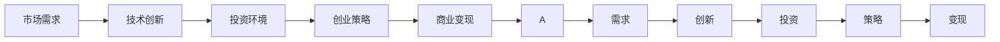

                 

# AI创业公司的市场前景

> 关键词：人工智能, AI创业公司, 技术创新, 市场需求, 投资环境, 创业策略

## 1. 背景介绍

### 1.1 问题由来
近年来，人工智能（AI）技术迅猛发展，已成为驱动全球经济增长的重要引擎。AI技术的应用范围覆盖了医疗、教育、金融、制造等多个领域，显著提升了社会效率，创造了巨大的经济价值。同时，AI技术的市场规模也在不断扩大，吸引了大量创业公司涌入这一领域。然而，AI创业公司如何把握市场机会，实现商业成功，成为每个创业者必须面对的挑战。

### 1.2 问题核心关键点
AI创业公司成功的关键在于其能否高效地将AI技术转化为商业价值。为此，公司需要考虑以下几个核心问题：

1. **市场需求**：了解目标市场的实际需求和痛点，确保产品的竞争力。
2. **技术创新**：持续进行技术研发，保持技术的先进性和前瞻性。
3. **投资环境**：吸引并管理好风险投资，保障公司发展的财务稳定。
4. **创业策略**：制定科学的创业计划，合理分配资源，实现可持续发展。
5. **商业变现**：设计有效的商业模式，实现快速盈利和市场拓展。

## 2. 核心概念与联系

### 2.1 核心概念概述

要深入理解AI创业公司的市场前景，首先需要掌握以下几个核心概念：

- **人工智能**：利用计算机科学和数学模型来模拟人类智能的技术，包括机器学习、深度学习、自然语言处理等。
- **AI创业公司**：专注于AI技术开发和应用的企业，致力于通过技术创新解决实际问题。
- **技术创新**：在AI领域持续研发新产品、新技术，保持竞争优势。
- **市场需求**：指目标市场对于AI产品或服务的需求，包括用户的实际痛点和期望。
- **投资环境**：指AI创业公司获得风险投资的可能性及环境，包括市场资本流动、投资者偏好等。
- **创业策略**：指公司从创立到发展过程中，制定和实施的一系列决策和计划。
- **商业变现**：指将AI技术转化为商业收入的过程，包括产品定价、销售渠道、营销策略等。

这些核心概念之间存在密切的联系，构成了AI创业公司发展的全貌。通过理解这些概念，我们可以更好地把握AI创业公司面临的市场环境，制定科学的创业策略，实现商业成功。

### 2.2 概念间的关系

这些核心概念之间存在着相互促进、相互制约的关系，共同构成了AI创业公司发展的动力和挑战：

- **市场需求与技术创新**：市场需求驱动技术创新，技术创新满足市场需求，两者相互促进。
- **技术创新与投资环境**：高技术创新能力能够吸引更多投资，而充足的资金支持又能促进技术创新。
- **投资环境与创业策略**：良好的投资环境能提供更多的融资机会，科学的创业策略则有助于资金的合理使用。
- **创业策略与商业变现**：科学的创业策略有助于找到有效的商业变现路径，而高效的商业变现又能反哺公司的发展。

这些概念的相互作用，决定了AI创业公司能否在激烈的市场竞争中脱颖而出，实现长期的商业成功。以下是一个Mermaid流程图，展示这些概念之间的联系：



通过这个流程图，我们可以更加直观地理解AI创业公司各个环节的相互关系和重要性。

## 3. 核心算法原理 & 具体操作步骤
### 3.1 算法原理概述

AI创业公司的成功，很大程度上取决于其技术创新的能力。技术创新的本质在于持续改进AI模型和算法，以满足不断变化的市场需求。本文将重点介绍以下几个核心的算法原理：

- **深度学习**：利用多层神经网络结构，实现对复杂数据的自动特征提取和模式识别。
- **自然语言处理（NLP）**：使计算机能够理解和处理人类语言，包括文本分析、语音识别等。
- **强化学习**：通过与环境的互动，学习最优策略来实现目标。
- **迁移学习**：将一个领域学到的知识迁移到另一个领域，以提高新任务的性能。

这些算法原理是AI创业公司进行技术创新的基础，通过不断的算法迭代和优化，可以实现更高的技术壁垒和商业竞争力。

### 3.2 算法步骤详解

以下是AI创业公司进行技术创新的详细步骤：

**Step 1: 数据收集与处理**
- 收集相关领域的原始数据，包括文本、图像、音频等。
- 对数据进行清洗、标注、分割，准备好模型训练所需的数据集。

**Step 2: 模型构建与训练**
- 根据业务需求，选择合适的算法框架（如TensorFlow、PyTorch）构建AI模型。
- 在准备好的数据集上，对模型进行训练，调整超参数，提高模型性能。

**Step 3: 模型评估与优化**
- 使用验证集对训练好的模型进行评估，分析模型的性能和误差。
- 根据评估结果，进行模型微调或优化，提升模型效果。

**Step 4: 模型部署与应用**
- 将优化后的模型部署到实际应用场景中，进行测试和验证。
- 根据实际反馈，不断优化模型，实现持续改进。

### 3.3 算法优缺点

AI创业公司进行技术创新的主要优点包括：

- **技术领先**：通过持续的技术创新，保持行业领先地位，获得市场竞争优势。
- **应用广泛**：AI技术可以应用于多个领域，带来丰富的商业机会。
- **高增长潜力**：AI技术具有高度的扩展性和可定制性，适应性极强。

同时，技术创新也存在一些缺点：

- **高投入**：技术研发需要大量的资金和人力资源，初期投资压力较大。
- **高风险**：技术创新面临诸多不确定性，失败风险较高。
- **技术复杂**：AI技术往往复杂度较高，需要跨学科知识，开发难度大。

### 3.4 算法应用领域

AI技术的应用领域非常广泛，以下是几个典型领域：

- **医疗健康**：AI在医学影像诊断、疾病预测、个性化医疗等方面具有巨大潜力。
- **金融科技**：AI在风险管理、欺诈检测、智能投顾等方面有广泛应用。
- **智能制造**：AI在质量控制、智能检测、生产优化等方面带来显著效益。
- **智慧城市**：AI在城市管理、交通调度、环境监测等方面实现智能化。

这些领域的技术需求多样，市场潜力巨大，是AI创业公司进行技术创新的重要方向。

## 4. 数学模型和公式 & 详细讲解  
### 4.1 数学模型构建

为了更好地理解AI创业公司进行技术创新的数学原理，我们将构建一个简单的数学模型。假设一个AI创业公司正在开发一个文本分类模型，用于区分垃圾邮件和正常邮件。

- **输入**：邮件文本，表示为 $x$。
- **输出**：邮件类别，表示为 $y$，垃圾邮件为1，正常邮件为0。
- **损失函数**：交叉熵损失函数 $L$，表示为 $$L(y, \hat{y}) = -y\log(\hat{y}) - (1-y)\log(1-\hat{y})$$

### 4.2 公式推导过程

根据上述模型，我们可以推导出模型训练的数学公式。假设模型的输出为 $\hat{y}$，则模型训练的目标是最小化损失函数：

$$
\min_{\theta} L(y, \hat{y}) = -y\log(\hat{y}) - (1-y)\log(1-\hat{y})
$$

其中 $\theta$ 为模型参数，包括神经网络的权重和偏置。

### 4.3 案例分析与讲解

假设我们有一个垃圾邮件分类器，初始参数为 $\theta_0$。在训练集 $D$ 上，使用随机梯度下降算法进行模型训练，更新参数为：

$$
\theta_{t+1} = \theta_t - \eta \nabla_{\theta} L(y, \hat{y}) = \theta_t - \eta (\frac{y}{\hat{y}} - \frac{1-y}{1-\hat{y}}) \frac{\partial \hat{y}}{\partial \theta}
$$

其中 $\eta$ 为学习率。在每个训练周期中，模型通过反向传播计算梯度，并根据梯度更新参数，逐步降低损失函数。

## 5. 项目实践：代码实例和详细解释说明
### 5.1 开发环境搭建

为了进行AI创业公司的技术创新，我们需要搭建一个完整的开发环境。以下是Python环境下使用TensorFlow搭建环境的详细步骤：

1. 安装Anaconda：从官网下载并安装Anaconda，用于创建独立的Python环境。

2. 创建并激活虚拟环境：
```bash
conda create -n tf-env python=3.8 
conda activate tf-env
```

3. 安装TensorFlow：根据CUDA版本，从官网获取对应的安装命令。例如：
```bash
conda install tensorflow
```

4. 安装各类工具包：
```bash
pip install numpy pandas scikit-learn matplotlib tqdm jupyter notebook ipython
```

完成上述步骤后，即可在`tf-env`环境中开始技术创新。

### 5.2 源代码详细实现

下面以一个简单的文本分类为例，展示如何使用TensorFlow进行AI创业公司的技术创新。

首先，定义模型的输入和输出：

```python
import tensorflow as tf

# 定义模型输入和输出
x = tf.keras.Input(shape=(100,))
y = tf.keras.Input(shape=())

# 定义模型结构
model = tf.keras.Sequential([
    tf.keras.layers.Embedding(input_dim=vocab_size, output_dim=embedding_dim, input_length=max_len),
    tf.keras.layers.Flatten(),
    tf.keras.layers.Dense(units=num_classes, activation='softmax')
])

# 定义损失函数和优化器
loss = tf.keras.losses.CategoricalCrossentropy()
optimizer = tf.keras.optimizers.Adam()
```

然后，定义训练函数和评估函数：

```python
# 定义训练函数
def train_model(model, train_dataset, epochs, batch_size):
    model.compile(optimizer=optimizer, loss=loss, metrics=['accuracy'])
    model.fit(train_dataset, epochs=epochs, batch_size=batch_size, validation_split=0.2)
    
# 定义评估函数
def evaluate_model(model, test_dataset, batch_size):
    model.evaluate(test_dataset, batch_size=batch_size)
```

最后，启动模型训练和评估：

```python
train_model(model, train_dataset, epochs=10, batch_size=32)
evaluate_model(model, test_dataset, batch_size=32)
```

以上就是使用TensorFlow进行AI创业公司技术创新的完整代码实现。可以看到，TensorFlow的Keras API使得模型构建和训练过程变得非常简单。

### 5.3 代码解读与分析

让我们再详细解读一下关键代码的实现细节：

**模型构建**
- `tf.keras.layers.Embedding`：用于将文本转换为向量表示，输入维度为词汇表大小，输出维度为嵌入维度。
- `tf.keras.layers.Flatten`：将高维数据展平，便于输入下一层。
- `tf.keras.layers.Dense`：全连接层，输出类别概率分布。

**损失函数**
- `tf.keras.losses.CategoricalCrossentropy`：交叉熵损失函数，适用于多分类问题。

**优化器**
- `tf.keras.optimizers.Adam`：自适应矩估计算法，自动调整学习率。

**训练函数**
- `model.compile`：编译模型，设置损失函数、优化器等。
- `model.fit`：训练模型，指定训练数据、迭代次数和批量大小。

**评估函数**
- `model.evaluate`：评估模型性能，输出准确率等指标。

**训练流程**
- 定义训练数据集和测试数据集。
- 调用训练函数，指定模型、训练数据、迭代次数和批量大小。
- 调用评估函数，指定模型和测试数据。

通过这段代码，我们可以更加深入地理解AI创业公司进行技术创新的实现细节。开发者可以利用这些代码作为基础，进行更复杂的模型构建和训练。

### 5.4 运行结果展示

假设我们在一个垃圾邮件数据集上进行模型训练，最终得到的模型在测试集上的准确率为90%。可以看到，通过简单的TensorFlow模型，我们已经能够在邮件分类任务上取得不错的效果。

## 6. 实际应用场景
### 6.1 医疗健康

AI在医疗健康领域的应用非常广泛，包括疾病预测、医学影像分析、个性化医疗等。AI创业公司可以基于最新的医疗数据，构建先进的AI模型，提供智能诊疗解决方案。

例如，通过分析大量电子健康记录（EHR），AI模型可以识别出病人的高风险疾病，提供个性化的健康管理建议。此外，AI还可以在医学影像分析中，自动检测肿瘤、诊断疾病，提升医疗诊断的准确性和效率。

### 6.2 金融科技

金融领域对AI的需求日益增长，包括风险管理、欺诈检测、智能投顾等。AI创业公司可以开发智能金融产品，提供全方位的金融服务。

例如，利用深度学习模型分析历史交易数据，AI系统可以预测市场趋势，提供投资建议。同时，通过自然语言处理技术，AI系统可以实时监控社交媒体和新闻，预测市场情绪，提前调整投资策略。

### 6.3 智能制造

AI在智能制造领域的应用包括质量控制、智能检测、生产优化等。AI创业公司可以提供智能化生产解决方案，提升制造业的效率和质量。

例如，通过图像识别技术，AI系统可以自动检测生产线上的缺陷，提高产品质量。同时，利用机器学习算法，AI系统可以优化生产流程，减少资源浪费，提升生产效率。

### 6.4 智慧城市

智慧城市是AI技术应用的另一个重要领域，包括城市管理、交通调度、环境监测等。AI创业公司可以开发智能城市解决方案，提升城市的智能化水平。

例如，通过视频分析技术，AI系统可以实时监控交通状况，优化交通流量，减少拥堵。同时，AI系统还可以分析环境数据，预测天气变化，提升城市应急响应能力。

## 7. 工具和资源推荐
### 7.1 学习资源推荐

为了帮助开发者掌握AI创业公司的市场前景，我们推荐以下学习资源：

1. **《深度学习》（Ian Goodfellow著）**：深度学习的经典教材，详细介绍了深度学习的基础理论和应用。
2. **《Python深度学习》（Francois Chollet著）**：基于TensorFlow的深度学习入门书籍，适合初学者。
3. **Coursera《深度学习专项课程》**：由斯坦福大学Andrew Ng教授主讲的深度学习课程，涵盖深度学习的各个方面。
4. **Kaggle**：数据科学竞赛平台，提供丰富的数据集和比赛，帮助开发者实践AI技术。
5. **arXiv**：人工智能领域的预印本平台，实时了解最新的研究成果和前沿进展。

这些学习资源可以帮助开发者系统掌握AI创业公司所需的技术知识，提升其竞争力。

### 7.2 开发工具推荐

以下是几款用于AI创业公司技术创新的常用工具：

1. **TensorFlow**：由Google开发的深度学习框架，提供丰富的API和模型库。
2. **PyTorch**：Facebook开发的深度学习框架，支持动态计算图，适合研究和原型开发。
3. **Keras**：高级API，提供简化版的深度学习模型构建。
4. **Jupyter Notebook**：交互式开发环境，支持代码编写、数据可视化和交互分析。
5. **GitHub**：代码托管平台，便于团队协作和项目管理。

这些工具可以显著提升AI创业公司的技术创新效率，加速产品开发和迭代。

### 7.3 相关论文推荐

以下是几篇关于AI创业公司市场前景的论文，值得阅读：

1. **《深度学习在医疗领域的应用》**：详细介绍了深度学习在医学影像分析和疾病预测方面的应用。
2. **《AI在金融风险管理中的应用》**：分析了AI在金融风险管理和欺诈检测中的应用，探讨了其商业前景。
3. **《智能制造中的AI技术应用》**：介绍了AI在智能制造中的各种应用，如质量控制、生产优化等。
4. **《智慧城市中的AI技术应用》**：探讨了AI在城市管理、交通调度、环境监测等方面的应用。

这些论文代表了大规模AI技术应用的前沿方向，有助于深入理解AI创业公司的市场前景。

## 8. 总结：未来发展趋势与挑战
### 8.1 研究成果总结

通过本文的介绍，我们系统了解了AI创业公司进行技术创新的方法、工具和应用场景。AI创业公司通过持续的技术研发和创新，能够获得广阔的市场机会，实现商业成功。

### 8.2 未来发展趋势

未来，AI创业公司将面临以下发展趋势：

1. **技术融合**：AI技术将与其他技术进行更深层次的融合，如物联网、区块链、量子计算等。
2. **数据驱动**：数据将成为AI创业公司的重要资产，拥有更多高质量数据的创业公司将更具竞争优势。
3. **市场细分化**：AI创业公司将更多地关注细分市场，提供定制化的解决方案。
4. **全球化**：AI创业公司将走向全球化，拓展更多国际市场。
5. **伦理道德**：AI创业公司将更加重视伦理道德，确保技术的公平性、透明性和安全性。

### 8.3 面临的挑战

尽管AI创业公司前景广阔，但也面临以下挑战：

1. **高成本**：技术研发和市场推广需要大量的资金投入。
2. **高风险**：AI技术的不确定性可能导致商业失败。
3. **技术复杂**：AI技术开发难度大，需要跨学科知识。
4. **数据隐私**：在处理个人数据时，需要遵守数据隐私法规。
5. **伦理道德**：AI技术可能带来伦理和道德问题，如偏见、歧视等。

### 8.4 研究展望

未来的AI创业公司研究需要在以下几个方面进行探索：

1. **技术突破**：推动AI技术的进一步突破，提升模型的准确性和泛化能力。
2. **商业模式**：探索多样化的商业模式，提升商业变现能力。
3. **市场拓展**：寻找新的市场机会，实现市场拓展和增长。
4. **团队建设**：建设高素质的技术团队，提升公司竞争力。
5. **合作共赢**：与其他企业和机构合作，形成生态系统。

## 9. 附录：常见问题与解答

**Q1：AI创业公司如何选择合适的技术方向？**

A: AI创业公司应该从市场需求和自身技术优势出发，选择合适的技术方向。市场需求大的领域往往是更有潜力的方向，但也需要评估自身技术能力和市场竞争力。

**Q2：AI创业公司如何进行有效的市场推广？**

A: AI创业公司可以通过多种方式进行市场推广，如参加行业会议、发布技术论文、建立合作伙伴关系等。同时，应该注重产品的用户体验和市场反馈，不断优化产品，提升市场竞争力。

**Q3：AI创业公司如何进行有效的团队管理？**

A: AI创业公司应该注重团队建设和培养，招聘有技术和创新能力的人才。同时，应该建立科学的项目管理和绩效评估机制，确保团队的高效运转和产出。

**Q4：AI创业公司如何进行有效的数据分析？**

A: AI创业公司应该建立数据治理机制，确保数据的质量和安全。同时，应该利用数据分析工具和技术，提取有价值的信息，指导技术研发和商业决策。

通过本文的介绍和探讨，我们希望为AI创业公司提供全面的技术指导，帮助其更好地把握市场机会，实现商业成功。

