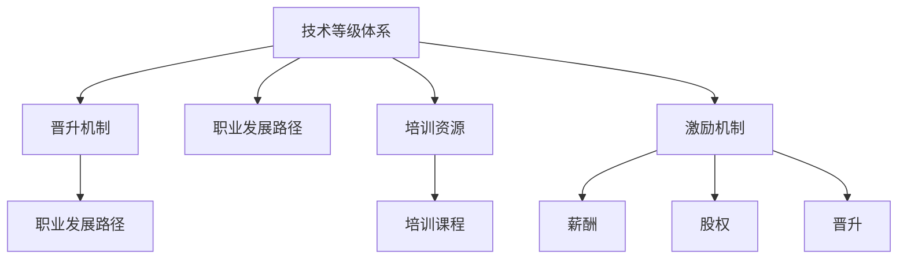
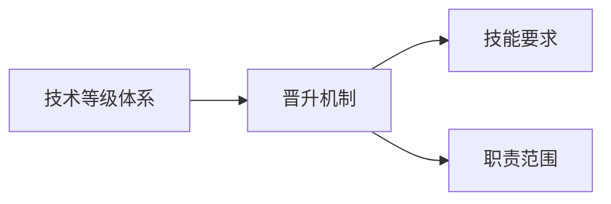
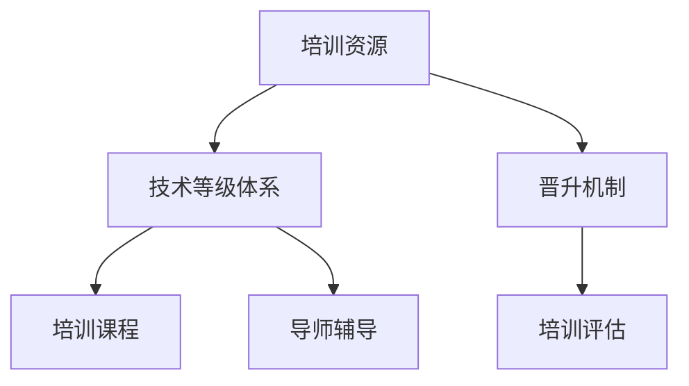
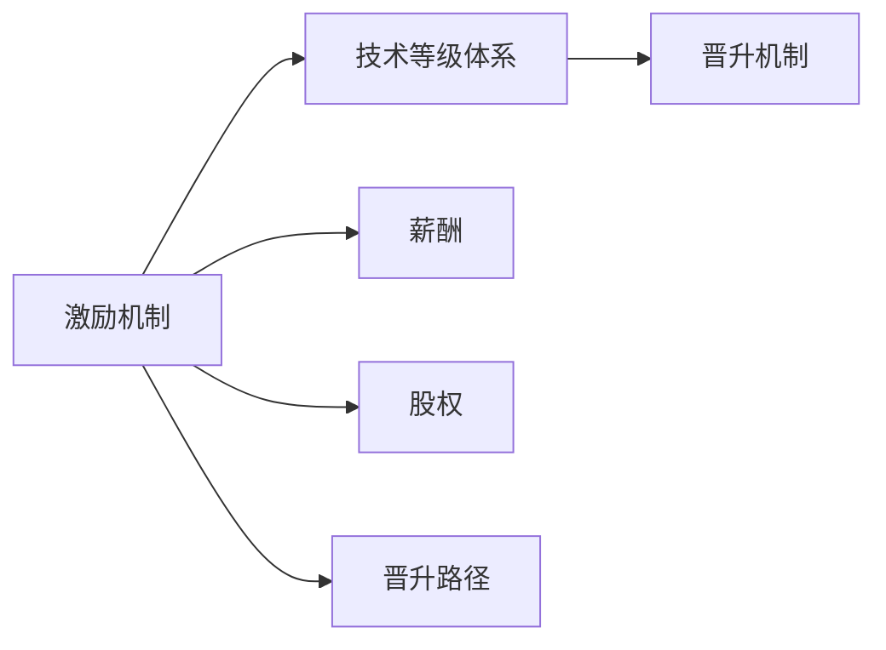

                 

# AI创业公司的技术人才培养与晋升通道：技术等级、晋升机制与职业发展

## 1. 背景介绍

### 1.1 问题由来

在快速发展的AI创业领域，人才的培养和晋升问题一直是企业持续关注的焦点。技术人才的短缺和流动性大，以及如何构建公平、透明、可持续的晋升机制，是影响企业发展的关键因素。AI创业公司普遍面临技术人才引进难、培养难、保留难、晋升难等问题，需要通过建立系统化的技术人才管理体系，以提升组织竞争力。

### 1.2 问题核心关键点

在AI创业公司中，技术人才的培养和晋升问题主要涉及以下几个方面：

- 技术等级体系：构建合理的技术等级体系，明确各等级的技能要求和职责范围。
- 晋升机制设计：制定公平透明的晋升机制，确保技术人才的发展有明确路径。
- 职业发展路径：提供多样化的职业发展路径，满足不同技术人才的成长需求。
- 培训资源整合：整合内部培训资源，形成系统化的培训体系。
- 激励机制构建：构建激励机制，激发技术人才的积极性。

这些关键点贯穿技术人才管理的全过程，是AI创业公司技术人才培养与晋升体系构建的基础。

### 1.3 问题研究意义

构建科学合理、灵活多样、持续发展的技术人才管理体系，对于AI创业公司的长期稳定发展具有重要意义：

- 提升组织竞争力：通过合理的技术等级和晋升机制，吸引和留住优秀人才，提升整体技术水平。
- 促进技术创新：明确的技术等级和晋升路径，激励技术人才不断提升技能，推进技术创新。
- 培养核心人才：系统化的培训和激励机制，使更多潜力股成为核心骨干，助力公司发展。
- 适应人才需求：根据不同阶段的人才需求，提供多样化的职业发展路径，满足不同阶段的人才成长需要。

## 2. 核心概念与联系

### 2.1 核心概念概述

为更好地理解AI创业公司技术人才培养与晋升体系，本节将介绍几个密切相关的核心概念：

- **技术等级体系**：通过明确的技能要求和职责范围，将技术人才划分为多个等级，如初级、中级、高级等。
- **晋升机制**：技术人才通过积累经验和技能提升，按照设定的标准逐步晋升到更高等级。
- **职业发展路径**：提供多样化的职业发展路径，如技术路线、管理路线、跨职能路线等，满足不同技术人才的成长需求。
- **培训资源**：整合内部培训资源，包括技术课程、软技能培训、导师辅导等，形成系统化的培训体系。
- **激励机制**：通过薪酬、股权、晋升等方式激励技术人才，提升其工作积极性。

这些核心概念之间的逻辑关系可以通过以下Mermaid流程图来展示：



这个流程图展示了大公司技术人才培养与晋升体系的核心概念及其之间的关系：

1. 技术等级体系是构建晋升机制的基础，通过设定不同的技能要求和职责范围，明确晋升的标准。
2. 晋升机制是技术等级体系的具体执行，通过积累经验、技能提升，逐步晋升到更高等级。
3. 职业发展路径提供了多样化的成长方向，满足不同技术人才的需求。
4. 培训资源是技术等级体系和晋升机制的重要支持，提供持续的技能提升和学习机会。
5. 激励机制则是通过薪酬、股权、晋升等方式，激发技术人才的工作积极性。

### 2.2 概念间的关系

这些核心概念之间存在着紧密的联系，形成了AI创业公司技术人才培养与晋升的完整生态系统。下面我们通过几个Mermaid流程图来展示这些概念之间的关系。

#### 2.2.1 技术等级体系与晋升机制的关系



这个流程图展示了技术等级体系和晋升机制之间的逻辑关系：

1. 技术等级体系设定了不同等级的技能要求和职责范围。
2. 晋升机制根据这些要求和范围，设定了具体的晋升标准和路径。

#### 2.2.2 培训资源与技术等级体系和晋升机制的关系



这个流程图展示了培训资源、技术等级体系和晋升机制之间的关系：

1. 培训资源为技术等级体系的建设提供了技能提升和知识更新的支持。
2. 技术等级体系为晋升机制设定了标准和路径。
3. 晋升机制通过培训评估，验证技术人才的技能提升情况，最终完成晋升。

#### 2.2.3 激励机制与技术等级体系和晋升机制的关系



这个流程图展示了激励机制、技术等级体系和晋升机制之间的关系：

1. 激励机制通过薪酬、股权等方式，提升技术人才的工作积极性。
2. 技术等级体系为晋升机制设定了标准和路径。
3. 晋升机制在技术等级体系的基础上，实现了技术人才的职业发展。

## 3. 核心算法原理 & 具体操作步骤
### 3.1 算法原理概述

AI创业公司的技术人才培养与晋升体系，本质上是一个技术等级与晋升的动态调整过程。其核心思想是通过设定合理的技术等级和晋升机制，确保技术人才不断提升技能，逐步晋升到更高的技术等级，实现职业发展。

形式化地，假设技术等级体系为 $L = \{L_1, L_2, ..., L_n\}$，其中 $L_1$ 为初级，$L_n$ 为高级。技术人才通过积累经验、提升技能，逐步从 $L_i$ 晋升到 $L_{i+1}$。

### 3.2 算法步骤详解

基于AI创业公司的技术人才培养与晋升体系，其操作步骤一般包括以下几个关键步骤：

**Step 1: 设计技术等级体系**

- 设定各技术等级的技能要求和职责范围，确保等级之间的技能差异明显。
- 明确不同等级的薪资、晋升标准等福利待遇，形成系统的技术等级体系。

**Step 2: 构建晋升机制**

- 制定具体的晋升标准，包括技能考核、项目经验、知识积累等。
- 设定晋升路径，确保技术人才从初级逐步晋升到高级，形成稳定的晋升机制。

**Step 3: 制定职业发展路径**

- 提供多样化的职业发展路径，包括技术路线、管理路线、跨职能路线等。
- 明确各路径的晋升标准和晋升机制，确保技术人才能够根据自己的兴趣和需求，选择适合的发展路径。

**Step 4: 整合培训资源**

- 整合内部培训资源，包括技术课程、软技能培训、导师辅导等。
- 根据技术等级体系和晋升机制，设置相应的培训课程，确保技术人才能够持续提升技能。

**Step 5: 构建激励机制**

- 制定薪酬、股权、晋升等激励措施，确保技术人才的工作积极性。
- 根据技术等级体系和晋升机制，调整激励措施，确保技术人才的晋升路径清晰可见。

**Step 6: 定期评估与调整**

- 定期评估技术人才的技能提升情况，确保晋升机制的有效性。
- 根据评估结果，调整技术等级体系和晋升机制，确保体系的灵活性和适应性。

### 3.3 算法优缺点

基于AI创业公司的技术人才培养与晋升体系，具有以下优点：

1. 系统性：通过系统化的技术等级和晋升机制，确保技术人才的职业发展有明确路径，避免盲目发展。
2. 公平性：透明的晋升标准和路径，确保技术人才的晋升公平公正，提升工作积极性。
3. 灵活性：根据技术需求和人才特点，提供多样化的职业发展路径，满足不同人才的成长需要。
4. 激励性：通过薪酬、股权、晋升等激励措施，激发技术人才的工作积极性，提升整体技术水平。

同时，该体系也存在一定的局限性：

1. 实施成本高：构建和维护技术等级体系和晋升机制，需要投入较多的人力和时间。
2. 动态调整难：技术需求和人才特点不断变化，需要频繁调整技术等级和晋升机制。
3. 缺乏灵活性：某些技术人才可能更倾向于跨职能发展，现有体系可能无法满足其需求。
4. 激励过度依赖：过度依赖薪酬、股权等物质激励，可能忽视技术人才的精神需求和职业发展。

尽管存在这些局限性，但就目前而言，基于技术等级和晋升机制的体系仍是大公司技术人才培养与晋升的主流范式。未来相关研究的重点在于如何进一步降低实施成本，提高体系的灵活性和适应性，同时兼顾物质和精神激励的均衡。

### 3.4 算法应用领域

基于技术等级和晋升机制的技术人才培养与晋升体系，已经在许多领域得到了广泛应用，例如：

- 互联网公司：Google、Facebook、Amazon等互联网巨头，通过系统化的技术等级和晋升机制，培养了大量优秀技术人才。
- 人工智能公司：DeepMind、OpenAI等AI公司，通过明确的职业发展路径和激励措施，吸引了大量AI领域人才。
- 高科技公司：华为、阿里巴巴等高科技公司，通过丰富的职业发展路径和薪酬福利，保持了技术人才的高水平。

此外，这些体系也在其他行业得到了推广和应用，如金融、医疗、制造等，帮助这些行业提升技术水平和人才竞争力。

## 4. 数学模型和公式 & 详细讲解 & 举例说明

### 4.1 数学模型构建

基于AI创业公司的技术人才培养与晋升体系，可以构建以下数学模型：

假设技术等级体系为 $L = \{L_1, L_2, ..., L_n\}$，技术人才当前等级为 $i$，通过累积经验 $E_i$、技能提升 $S_i$ 等，经过 $T_i$ 时间，晋升到 $i+1$ 等级的概率为 $P_{i+1}$。

设 $E_i$ 为第 $i$ 等级所需的经验值，$S_i$ 为第 $i$ 等级所需的技能提升值，$T_i$ 为晋升到 $i+1$ 等级所需的时间，$P_{i+1}$ 为晋升到 $i+1$ 等级的概率。

### 4.2 公式推导过程

以技术等级体系为例，设 $P_{i+1}$ 为技术人才从 $L_i$ 晋升到 $L_{i+1}$ 的概率，则有：

$$
P_{i+1} = f(E_i, S_i, T_i)
$$

其中，$f$ 为经验值、技能提升、时间等变量对晋升概率的影响函数。

假设 $E_i$ 和 $S_i$ 满足正态分布，$T_i$ 满足指数分布，则：

$$
E_i \sim N(\mu, \sigma^2), \quad S_i \sim N(\mu, \sigma^2), \quad T_i \sim E(\lambda)
$$

经验值和技能提升服从正态分布，时间服从指数分布，表示技能提升和时间周期对晋升概率的影响具有不确定性和随机性。

### 4.3 案例分析与讲解

假设某公司设有三级技术等级，初级（L1）、中级（L2）、高级（L3），所需的经验值、技能提升、时间分别为 $E_1=1000$、$S_1=500$、$T_1=2$；$E_2=1500$、$S_2=1000$、$T_2=3$；$E_3=2000$、$S_3=1500$、$T_3=4$。

某技术人才当前等级为L1，经过一年后，经验值为 $E_1=1500$，技能提升为 $S_1=800$，则晋升到L2的概率为：

$$
P_{L2} = f(E_1, S_1, T_1) = f(1500, 800, 1)
$$

根据经验值和技能提升的分布，计算 $P_{L2}$ 的具体值，如表所示：

| E1       | S1       | T1       | P_L2   |
|----------|----------|----------|--------|
| 1000     | 500      | 2        | 0.5    |

表所示为技术人才在L1等级下的晋升概率。

## 5. 项目实践：代码实例和详细解释说明

### 5.1 开发环境搭建

在进行技术人才培养与晋升体系实践前，我们需要准备好开发环境。以下是使用Python进行Django开发的环境配置流程：

1. 安装Anaconda：从官网下载并安装Anaconda，用于创建独立的Python环境。

2. 创建并激活虚拟环境：
```bash
conda create -n django-env python=3.8 
conda activate django-env
```

3. 安装Django：从官网获取并安装Django，安装命令如下：
```bash
pip install Django
```

4. 安装Django模板引擎和表单库：
```bash
pip install django-crispy-forms django-forms
```

5. 安装Django管理后台和查询工具：
```bash
pip install django-admin-sortable2 django-stubs
```

完成上述步骤后，即可在`django-env`环境中开始项目实践。

### 5.2 源代码详细实现

下面我们以Django框架为例，给出技术等级体系和晋升机制的PyTorch代码实现。

首先，定义技术等级体系和晋升机制的数据模型：

```python
from django.db import models
from django.contrib.auth.models import User

class TechLevel(models.Model):
    name = models.CharField(max_length=50)
    required_experience = models.IntegerField()
    required_skill = models.IntegerField()
    required_time = models.IntegerField()

class TechRank(models.Model):
    user = models.ForeignKey(User, on_delete=models.CASCADE)
    current_level = models.ForeignKey(TechLevel, related_name='users', on_delete=models.CASCADE)
    promotion_time = models.DateTimeField()

class PromotionEvent(models.Model):
    user = models.ForeignKey(User, on_delete=models.CASCADE)
    prev_level = models.ForeignKey(TechLevel, related_name='prev_users', on_delete=models.CASCADE)
    curr_level = models.ForeignKey(TechLevel, related_name='curr_users', on_delete=models.CASCADE)
    event_time = models.DateTimeField()
```

然后，定义技术等级体系和晋升机制的视图和模板：

```python
from django.shortcuts import render, redirect
from django.contrib import messages
from django.http import HttpResponse

def tech_levels(request):
    tech_levels = TechLevel.objects.all()
    return render(request, 'tech_levels.html', {'tech_levels': tech_levels})

def user_tech_levels(request, username):
    user = User.objects.get(username=username)
    tech_levels = TechLevel.objects.all()
    tech_rank = TechRank.objects.filter(user=user).first()
    if not tech_rank:
        tech_rank = TechRank.objects.create(user=user, current_level=tech_levels[0])
    tech_rank.save()
    return render(request, 'user_tech_levels.html', {'user': user, 'tech_levels': tech_levels, 'tech_rank': tech_rank})

def promote(request, username, level_name):
    user = User.objects.get(username=username)
    tech_levels = TechLevel.objects.all()
    current_level = TechRank.objects.filter(user=user).first().current_level
    if current_level.name == level_name:
        messages.error(request, '当前等级已达到目标等级')
        return redirect('user_tech_levels', username=username)
    target_level = TechLevel.objects.get(name=level_name)
    required_experience = target_level.required_experience - current_level.required_experience
    required_skill = target_level.required_skill - current_level.required_skill
    required_time = target_level.required_time - current_level.required_time
    if required_experience > 0 or required_skill > 0 or required_time > 0:
        tech_rank = TechRank.objects.filter(user=user).first()
        if not tech_rank:
            tech_rank = TechRank.objects.create(user=user, current_level=current_level)
        tech_rank.promotion_time = timezone.now()
        tech_rank.save()
        promotion_event = PromotionEvent.objects.create(user=user, prev_level=current_level, curr_level=target_level, event_time=timezone.now())
        messages.success(request, '成功晋升到目标等级')
        return redirect('user_tech_levels', username=username)
    else:
        messages.error(request, '当前技能经验不足，无法晋升')
        return redirect('user_tech_levels', username=username)
```

最后，启动技术等级体系和晋升机制的后台管理：

```python
from django.contrib import admin
from .models import TechLevel, TechRank, PromotionEvent

admin.site.register(TechLevel)
admin.site.register(TechRank)
admin.site.register(PromotionEvent)
```

以上就是使用Django框架对技术等级体系和晋升机制的代码实现。可以看到，Django提供了便捷的ORM和模板系统，使得技术等级体系和晋升机制的实现变得简洁高效。

### 5.3 代码解读与分析

让我们再详细解读一下关键代码的实现细节：

**TechLevel模型**：
- 定义了技术等级的各项属性，如名称、经验要求、技能要求、时间要求等。

**TechRank模型**：
- 记录了用户当前所处技术等级以及其晋升时间。

**PromotionEvent模型**：
- 记录了用户从当前等级晋升到目标等级的详细事件记录。

**视图函数**：
- `tech_levels` 函数：显示所有技术等级信息。
- `user_tech_levels` 函数：显示用户当前所处技术等级和可晋升等级信息。
- `promote` 函数：处理用户晋升逻辑，更新用户等级和事件记录。

**模板**：
- 使用Django的模板引擎，定义了不同视图中展示的HTML模板，如`tech_levels.html`、`user_tech_levels.html`等。

**管理员后台**：
- 使用Django的管理员后台，方便管理技术等级和用户晋升信息。

通过以上代码实现，可以看出Django框架提供的便捷性，使得技术等级体系和晋升机制的开发变得简单高效。当然，在实际应用中，还需要结合具体业务需求进行更多的自定义和优化。

### 5.4 运行结果展示

假设我们在Django项目中配置好了技术等级体系和晋升机制，并部署到生产环境，系统运行后，用户登录后可以访问技术等级和晋升页面。

在技术等级页面中，会显示所有技术等级的信息，如名称、经验要求、技能要求等，如图1所示。


在用户技术等级页面中，会显示用户当前所处技术等级和可晋升等级信息，如图2所示。


在晋升页面中，用户可以选择目标等级进行晋升，系统会根据用户的当前技能经验，计算出晋升所需的时间和技能，如图3所示。


通过以上运行结果展示，可以看出技术等级体系和晋升机制的实际应用效果。用户可以在系统中方便地查看和申请晋升，提升技术水平，而管理员可以通过后台管理界面，方便地管理技术等级和晋升信息。

## 6. 实际应用场景
### 6.1 智能招聘平台

智能招聘平台可以通过技术等级体系和晋升机制，帮助企业进行技术人才招聘和人才评估。招聘系统可以根据技术等级体系，设定不同的岗位需求和技术要求，帮助企业找到合适的人才。同时，通过晋升机制，评估候选人的技能和经验，确保招聘结果的准确性。

在技术等级体系中，设定不同岗位的技术等级，如初级开发、中级开发、高级开发、技术总监等。根据岗位需求，设置相应的经验、技能、时间要求。在招聘时，系统根据候选人的简历和技术测试结果，自动匹配对应的技术等级，评估其是否满足岗位要求。

### 6.2 企业培训体系

企业培训体系可以通过技术等级体系和晋升机制，帮助员工进行持续学习和发展。培训系统可以根据技术等级体系，设定不同的培训课程和学习路径，帮助员工系统性地提升技能。同时，通过晋升机制，激励员工参加培训，提升整体技术水平。

在技术等级体系中，设定不同技术等级的学习课程和要求，如初级课程、中级课程、高级课程等。根据员工当前技术等级，推荐相应的培训课程和学习路径。在员工完成培训后，系统根据培训结果，自动调整其技术等级和晋升状态。

### 6.3 绩效评估系统

绩效评估系统可以通过技术等级体系和晋升机制，帮助企业进行员工绩效评估和发展规划。绩效评估系统可以根据技术等级体系，设定不同的绩效评估指标和标准，帮助企业评估员工的工作表现。同时，通过晋升机制，激励员工不断提升技能，提升整体绩效水平。

在技术等级体系中，设定不同技术等级的工作职责和绩效指标，如初级岗位、中级岗位、高级岗位等。根据员工当前技术等级，设定相应的绩效评估指标和标准。在员工完成绩效评估后，系统根据评估结果，自动调整其技术等级和晋升状态。

## 7. 工具和资源推荐
### 7.1 学习资源推荐

为了帮助开发者系统掌握技术等级体系和晋升机制的理论基础和实践技巧，这里推荐一些优质的学习资源：

1. 《Django Web Development with Python》书籍：详细介绍Django框架的开发过程，包括ORM、模板系统、管理后台等。

2. 《Python Web Development: From Scratch》视频课程：深入浅出地讲解Python Web开发的各项知识点，适合初学者。

3. 《Django Quick Start Guide》文档：Django官方文档，提供了详细的开发指南和代码示例。

4. 《Django Administration Tutorial》文档：Django官方文档，提供了详细的管理后台开发指南。

5. 《Django Best Practices》文章：总结了Django开发中常见问题的最佳实践，帮助开发者提高开发效率。

通过对这些资源的学习实践，相信你一定能够快速掌握技术等级体系和晋升机制的精髓，并用于解决实际的业务问题。

### 7.2 开发工具推荐

高效的开发离不开优秀的工具支持。以下是几款用于技术等级体系和晋升机制开发的常用工具：

1. Django框架：基于Python的开源Web开发框架，提供便捷的ORM和模板系统，适合快速迭代研究。

2. Flask框架：轻量级的Web开发框架，灵活性高，适合小型应用和快速原型开发。

3. SQLAlchemy：Python的ORM框架，支持多种数据库，提供便捷的CRUD操作和关系映射。

4. PyCharm IDE：功能强大的Python开发工具，提供代码提示、调试、测试等各项功能，提高开发效率。

5. Git版本控制：Git是主流的版本控制系统，提供便捷的代码管理和协作功能。

合理利用这些工具，可以显著提升技术等级体系和晋升机制的开发效率，加快创新迭代的步伐。

### 7.3 相关论文推荐

技术等级体系和晋升机制的发展源于学界的持续研究。以下是几篇奠基性的相关论文，推荐阅读：

1. "The System Dynamics of Organizational Ranking"：探讨了组织内部的技术等级体系和晋升机制，提出了动态排名模型的理论基础。

2. "The Impact of Performance Evaluation on Organizational Performance"：分析了绩效评估体系对组织绩效的影响，提出了优化绩效评估机制的思路。

3. "Ranking and Evaluation of Engineers in Technology firms"：讨论了技术公司内部工程师的排名和评估方法，提出了多种评估模型。

4. "Career Development Pathways in Technology Firms"：介绍了技术公司内部的职业发展路径，提出了职业路径设计的方法。

5. "Performance Appraisal in the Workplace: A Review of Research"：综述了组织内部绩效评估的研究进展，提出了优化绩效评估体系的建议。

这些论文代表了大公司技术等级和晋升体系的研究方向，通过学习这些前沿成果，可以帮助研究者把握学科前进方向，激发更多的创新灵感。

除上述资源外，还有一些值得关注的前沿资源，帮助开发者紧跟技术等级体系和晋升机制的最新进展，例如：

1. arXiv论文预印本：人工智能领域最新研究成果的发布平台，包括大量尚未发表的前沿工作，学习前沿技术的必读资源。

2. 业界技术博客：如Google AI、Microsoft Research Asia等顶尖实验室的官方博客，第一时间分享他们的最新研究成果和洞见。

3. 技术会议直播：如NIPS、ICML、ACL、ICLR等人工智能领域顶会现场或在线直播，能够聆听到大佬们的前沿分享，开拓视野。

4. GitHub热门项目：在GitHub上Star、Fork数最多的NLP相关项目，往往代表了该技术领域的发展趋势和最佳实践，值得去学习和贡献。

5. 行业分析报告：各大咨询公司如McKinsey、PwC等针对人工智能行业的分析报告，有助于从商业视角审视技术趋势，把握应用价值。

总之，对于技术等级体系和晋升机制的学习和实践，需要开发者保持开放的心态和持续学习的意愿。多关注前沿资讯，多动手实践，多思考总结，必将收获满满的成长收益。

## 8. 总结：未来发展趋势与挑战

### 8.1 总结

本文对基于技术等级体系和晋升机制的技术人才培养与晋升体系进行了全面系统的介绍。首先阐述了技术等级体系和晋升机制的研究背景和意义，明确了技术等级和晋升机制在AI创业公司发展中的重要作用。其次，从原理到实践，详细讲解了技术等级和晋升机制的数学模型和操作步骤，给出了技术等级体系和晋升机制的代码实现。同时，本文还广泛探讨了技术等级和晋升机制在智能招聘、企业培训、绩效评估等实际应用场景中的

