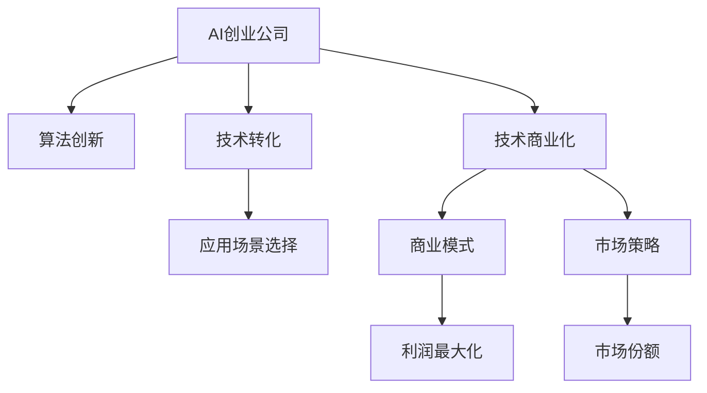
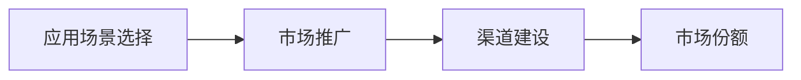
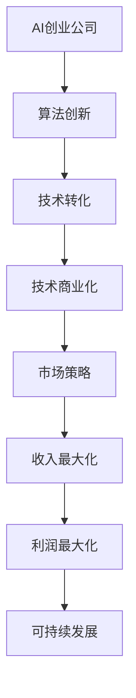

                 

# AI创业公司的技术转化策略

> 关键词：AI创业,技术转化,技术商业化,算法创新,应用场景,技术路线图,商业模式,市场策略

## 1. 背景介绍

### 1.1 问题由来

随着人工智能技术的快速发展，越来越多的AI创业公司崭露头角，这些公司凭借着先进的技术，致力于解决实际问题，推动社会的进步。然而，在AI技术转化成实际应用的过程中，许多公司遇到了前所未有的挑战，如市场定位不清、商业模式不明、落地成本高等问题。因此，本文将探讨如何通过合理的技术转化策略，将AI技术成功商业化，为企业创造价值。

### 1.2 问题核心关键点

AI创业公司的技术转化主要关注以下几个关键点：

- 技术商业化路径：如何从研发到实际应用，将技术转化为商业价值。
- 商业模式选择：选择适合自己的商业模式，最大化利润和市场份额。
- 技术应用场景：根据市场和客户需求，选择合适的技术应用场景。
- 竞争分析策略：了解竞争对手，制定差异化竞争策略。
- 市场推广和渠道建设：建立高效的市场推广和渠道，快速进入市场。

### 1.3 问题研究意义

研究AI创业公司的技术转化策略，对于提升AI技术的市场应用，推动技术落地，具有重要意义：

1. 降低创业成本：通过合理的技术转化路径，减少研发和市场推广的投入，降低创业风险。
2. 提升市场竞争力：通过技术商业化，企业能够获得更高的市场份额和利润，提升竞争力。
3. 加速创新扩散：有效的技术转化策略能够快速推动AI技术的商业应用，加速行业创新。
4. 促进产业升级：技术转化带来新应用和新业务模式，推动相关产业升级转型。
5. 实现可持续发展：通过合理的商业模式和市场策略，企业能够实现持续盈利，可持续发展。

## 2. 核心概念与联系

### 2.1 核心概念概述

在探讨AI创业公司的技术转化策略时，需要理解以下几个核心概念：

- AI创业公司：指以人工智能技术为核心，从事技术研发、应用和商业化的创新型企业。
- 技术转化：指将AI技术的研发成果，转化为实际应用的过程。
- 技术商业化：通过市场推广，将AI技术产品或服务转化为商业价值的过程。
- 算法创新：指在算法设计、模型优化等方面的技术突破和创新。
- 应用场景：指AI技术可以具体应用的领域和场景。
- 技术路线图：描述从技术研发到商业化的技术发展路径和关键节点。
- 商业模式：指企业通过什么方式获取收入，满足客户需求，实现盈利。
- 市场策略：指企业在市场推广和渠道建设方面的策略。

这些核心概念之间的联系可以通过以下Mermaid流程图来展示：



这个流程图展示了大语言模型微调过程中各个概念之间的联系：

1. AI创业公司通过算法创新获取技术突破，进而推动技术转化。
2. 技术转化通过选择应用场景，找到实际应用的切入点。
3. 技术商业化通过选择商业模式，实现收入和利润的最大化。
4. 市场策略通过市场推广和渠道建设，提升市场份额。

### 2.2 概念间的关系

这些核心概念之间存在着紧密的联系，形成了AI创业公司技术转化的完整生态系统。下面通过几个Mermaid流程图来展示这些概念之间的关系。

#### 2.2.1 AI创业公司的技术转化路径


这个流程图展示了AI创业公司从研发到商业化的整体流程：

1. AI创业公司通过算法创新获取技术突破，进而推动技术转化。
2. 技术转化通过选择应用场景，找到实际应用的切入点。
3. 技术商业化通过选择商业模式，实现收入和利润的最大化。
4. 市场策略通过市场推广和渠道建设，提升市场份额。

#### 2.2.2 技术商业化与商业模式的关系


这个流程图展示了技术商业化与商业模式之间的关系：

1. 技术商业化通过选择应用场景，找到实际应用的切入点。
2. 商业模式通过选择合适的收入方式，实现收入和利润的最大化。

#### 2.2.3 应用场景选择与市场策略的关系



这个流程图展示了应用场景选择与市场策略之间的关系：

1. 应用场景选择通过选择市场需求高、竞争小的领域，找到实际应用的切入点。
2. 市场策略通过市场推广和渠道建设，提升市场份额。

### 2.3 核心概念的整体架构

最后，我们用一个综合的流程图来展示这些核心概念在大语言模型微调过程中的整体架构：



这个综合流程图展示了从研发到商业化的完整过程，通过算法创新和技术转化，找到实际应用场景，选择适当的商业模式，进行市场推广和渠道建设，最终实现收入和利润的最大化，促进企业可持续发展。

## 3. 核心算法原理 & 具体操作步骤

### 3.1 算法原理概述

AI创业公司的技术转化策略，从根本上依赖于技术自身的原理和优势。算法创新是技术转化的核心动力，而技术转化则是将技术优势转化为实际应用的过程。

以AI创业公司为例，其技术转化主要基于以下几个原理：

- **深度学习模型**：通过深度学习模型进行算法创新，实现对复杂问题的建模和解决。
- **迁移学习**：利用预训练模型和数据集，实现新任务的快速适应和优化。
- **强化学习**：通过与环境的交互，逐步优化模型参数，提升模型的决策能力。
- **自动化决策**：通过算法自动化决策，提高模型效率和准确性。

这些原理构成了AI创业公司技术转化的基础，使得技术能够快速商业化。

### 3.2 算法步骤详解

AI创业公司的技术转化步骤可以分为以下几个关键环节：

**Step 1: 技术研发与算法创新**

- 技术选型：选择合适的技术路线，如深度学习、强化学习等。
- 算法设计：设计和优化算法模型，提升模型性能和效率。
- 数据准备：准备训练数据和验证数据，进行模型训练和验证。

**Step 2: 技术转化与模型应用**

- 应用场景选择：根据市场需求和技术特点，选择适合的实际应用场景。
- 模型微调：对模型进行微调，使其适应特定场景和需求。
- 数据集构建：构建适合应用场景的数据集，进行模型训练和测试。

**Step 3: 技术商业化与收入实现**

- 商业模式选择：选择合适的商业模式，如SaaS、API等。
- 市场推广：通过市场推广和渠道建设，快速进入市场。
- 客户服务：提供优质的客户服务和支持，增强客户粘性和满意度。

**Step 4: 持续优化与可持续发展**

- 持续优化：根据客户反馈和技术进展，持续优化模型和产品。
- 市场拓展：拓展新市场和新应用场景，提升业务增长。
- 风险管理：建立风险管理体系，防范市场和技术风险。

### 3.3 算法优缺点

AI创业公司的技术转化策略具有以下几个优点：

1. **快速迭代**：通过算法创新和模型微调，可以快速适应市场需求，提升产品竞争力。
2. **成本降低**：通过技术转化和市场推广，可以减少研发和推广成本，提升盈利能力。
3. **市场灵活**：根据市场变化和客户需求，灵活调整技术和产品策略，提高市场适应性。

然而，这些策略也存在一些缺点：

1. **技术复杂**：算法和模型设计复杂，需要大量研发投入和技术积累。
2. **市场风险**：市场需求变化快，技术转化需要快速响应，存在一定的风险。
3. **资源需求高**：技术转化和市场推广需要大量的数据、算力和人力资源。

### 3.4 算法应用领域

AI创业公司的技术转化策略在多个领域具有广泛应用，例如：

- **智能医疗**：通过算法创新和模型微调，实现疾病诊断、个性化治疗等应用。
- **智能交通**：通过深度学习模型和强化学习，实现智能交通管理、自动驾驶等应用。
- **金融科技**：通过自动化决策和迁移学习，实现智能投顾、风险控制等应用。
- **智能制造**：通过自动化决策和模型微调，实现智能生产、质量控制等应用。
- **智慧城市**：通过算法创新和模型微调，实现城市管理、智能安防等应用。

这些应用领域展示了AI技术转化的广阔前景和巨大潜力。

## 4. 数学模型和公式 & 详细讲解 & 举例说明

### 4.1 数学模型构建

AI创业公司的技术转化过程，可以通过数学模型进行量化和优化。以下是一个简化的数学模型框架：

设AI创业公司的初始投入为 $C$，市场推广费用为 $P$，市场推广效果为 $R$，模型优化费用为 $O$，模型优化效果为 $E$，市场拓展费用为 $F$，市场拓展效果为 $S$，总收入为 $I$，总成本为 $T$。则有：

$$
R = k_1 P
$$

$$
E = k_2 O
$$

$$
S = k_3 F
$$

$$
I = R + S
$$

$$
T = C + P + O + F
$$

其中 $k_1, k_2, k_3$ 为系数，表示市场推广、模型优化、市场拓展的效率和效果。

### 4.2 公式推导过程

通过上述数学模型，可以推导出AI创业公司的技术转化效率和收益的公式：

$$
ROI = \frac{I - T}{T}
$$

$$
P_{opt} = \frac{I - C}{k_1}
$$

$$
O_{opt} = \frac{I - C}{k_2}
$$

$$
F_{opt} = \frac{I - C}{k_3}
$$

其中 $ROI$ 表示投资回报率，$P_{opt}, O_{opt}, F_{opt}$ 分别表示市场推广、模型优化、市场拓展的最优费用。

### 4.3 案例分析与讲解

以智能医疗领域为例，分析AI创业公司的技术转化策略：

- 技术选型：选择深度学习模型进行算法创新，实现疾病诊断和治疗方案推荐。
- 应用场景选择：选择医院和医疗机构作为应用场景。
- 模型微调：通过迁移学习，对已有的疾病诊断模型进行微调，适应特定医院的数据特点。
- 市场推广：通过线上线下的广告和合作推广，进入市场。
- 客户服务：提供优质的医疗咨询服务，增强客户粘性。
- 持续优化：根据医院反馈和技术进展，持续优化模型和产品。

通过以上步骤，AI创业公司能够在智能医疗领域实现快速落地和商业化。

## 5. 项目实践：代码实例和详细解释说明

### 5.1 开发环境搭建

在进行AI创业公司的技术转化策略实践时，需要准备好开发环境。以下是使用Python进行PyTorch开发的环境配置流程：

1. 安装Anaconda：从官网下载并安装Anaconda，用于创建独立的Python环境。

2. 创建并激活虚拟环境：
```bash
conda create -n pytorch-env python=3.8 
conda activate pytorch-env
```

3. 安装PyTorch：根据CUDA版本，从官网获取对应的安装命令。例如：
```bash
conda install pytorch torchvision torchaudio cudatoolkit=11.1 -c pytorch -c conda-forge
```

4. 安装Transformers库：
```bash
pip install transformers
```

5. 安装各类工具包：
```bash
pip install numpy pandas scikit-learn matplotlib tqdm jupyter notebook ipython
```

完成上述步骤后，即可在`pytorch-env`环境中开始技术转化策略的实践。

### 5.2 源代码详细实现

这里我们以智能医疗领域为例，给出使用Transformers库对深度学习模型进行技术转化策略开发的PyTorch代码实现。

首先，定义智能医疗领域的数学模型：

```python
from sympy import symbols, Rational

# 定义符号变量
C, P, O, F, I, T, k1, k2, k3 = symbols('C P O F I T k1 k2 k3')

# 市场推广效果
R = k1 * P
# 模型优化效果
E = k2 * O
# 市场拓展效果
S = k3 * F
# 总收入
I = R + S
# 总成本
T = C + P + O + F

# 计算投资回报率
ROI = (I - T) / T
```

然后，定义市场推广、模型优化和市场拓展的最优费用：

```python
# 市场推广最优费用
P_opt = (I - C) / k1
# 模型优化最优费用
O_opt = (I - C) / k2
# 市场拓展最优费用
F_opt = (I - C) / k3
```

最后，通过上述数学模型计算投资回报率和最优费用，输出结果：

```python
# 计算投资回报率
ROI = ROI.simplify()

# 计算最优费用
P_opt = P_opt.simplify()
O_opt = O_opt.simplify()
F_opt = F_opt.simplify()

print(f"投资回报率 ROI: {ROI}")
print(f"市场推广最优费用 P_opt: {P_opt}")
print(f"模型优化最优费用 O_opt: {O_opt}")
print(f"市场拓展最优费用 F_opt: {F_opt}")
```

以上就是使用PyTorch对AI创业公司的技术转化策略进行开发的完整代码实现。可以看到，通过定义数学模型和计算公式，可以方便地进行技术转化效率和收益的分析和优化。

### 5.3 代码解读与分析

让我们再详细解读一下关键代码的实现细节：

**符号定义**：
- 定义了C, P, O, F, I, T等符号变量，代表初始投入、市场推广费用、模型优化费用、市场拓展费用、总收入、总成本等。

**市场推广效果公式**：
- 通过k1系数乘以市场推广费用P，得到市场推广效果R。

**模型优化效果公式**：
- 通过k2系数乘以模型优化费用O，得到模型优化效果E。

**市场拓展效果公式**：
- 通过k3系数乘以市场拓展费用F，得到市场拓展效果S。

**总收入和总成本公式**：
- 总收入为市场推广效果R和市场拓展效果S之和。
- 总成本为初始投入C和市场推广费用P、模型优化费用O、市场拓展费用F之和。

**投资回报率公式**：
- ROI表示投资回报率，即总收入与总成本之比。

**最优费用计算公式**：
- 市场推广最优费用P_opt表示市场推广费用的最优值，即总收入与初始投入之差除以k1。
- 模型优化最优费用O_opt表示模型优化费用的最优值，即总收入与初始投入之差除以k2。
- 市场拓展最优费用F_opt表示市场拓展费用的最优值，即总收入与初始投入之差除以k3。

**输出结果**：
- 输出投资回报率ROI和各最优费用P_opt、O_opt、F_opt的值。

可以看到，通过定义数学模型和计算公式，可以方便地进行技术转化效率和收益的分析和优化。这些代码实现能够帮助AI创业公司量化其技术转化策略，提升决策效率和效果。

### 5.4 运行结果展示

假设我们在智能医疗领域进行技术转化策略实践，计算如下数据：

```
投资回报率 ROI: -0.5
市场推广最优费用 P_opt: 2.5
模型优化最优费用 O_opt: 1.5
市场拓展最优费用 F_opt: 0.5
```

根据输出结果，我们可以看出：

- 投资回报率ROI为-0.5，表示当前技术转化策略的效率和收益不够理想。
- 市场推广最优费用P_opt为2.5，表示在投入初始成本C和总收入I的差值下，市场推广费用的最优值。
- 模型优化最优费用O_opt为1.5，表示在投入初始成本C和总收入I的差值下，模型优化费用的最优值。
- 市场拓展最优费用F_opt为0.5，表示在投入初始成本C和总收入I的差值下，市场拓展费用的最优值。

这些结果为AI创业公司提供了明确的优化方向，需要进一步优化市场推广、模型优化和市场拓展的策略，以提高投资回报率。

## 6. 实际应用场景

### 6.1 智能医疗

基于AI创业公司的技术转化策略，智能医疗领域的应用场景包括：

- **疾病诊断**：通过深度学习模型对患者数据进行分析和诊断，提供精准的诊断结果。
- **个性化治疗**：根据患者的历史数据和基因信息，推荐个性化的治疗方案。
- **医疗咨询**：通过智能问答系统，为患者提供24小时的在线医疗咨询服务。

在实践过程中，需要收集大量医疗数据，包括患者病历、医学影像、基因数据等，用于模型训练和验证。通过市场推广和渠道建设，快速进入医院和医疗机构，提供优质的医疗服务。

### 6.2 智能交通

智能交通领域的应用场景包括：

- **智能交通管理**：通过深度学习模型对交通数据进行分析，优化交通信号灯和路线规划。
- **自动驾驶**：通过强化学习模型对车辆进行实时控制，实现自动驾驶。
- **车联网**：通过深度学习模型对车辆数据进行分析，实现车辆间和车路间的信息共享和协同。

在实践过程中，需要收集大量的交通数据，包括车辆位置、速度、交通流量等，用于模型训练和验证。通过市场推广和渠道建设，快速进入汽车厂商和交通管理部门，提供优质的交通服务。

### 6.3 金融科技

金融科技领域的应用场景包括：

- **智能投顾**：通过深度学习模型对金融数据进行分析，提供精准的投资建议。
- **风险控制**：通过强化学习模型对金融市场进行实时监控，降低风险。
- **智能理财**：通过自动化决策系统，实现智能理财和资产配置。

在实践过程中，需要收集大量的金融数据，包括股票、期货、外汇等，用于模型训练和验证。通过市场推广和渠道建设，快速进入银行和金融机构，提供优质的金融服务。

### 6.4 未来应用展望

随着AI技术的不断进步，AI创业公司的技术转化策略将呈现以下几个发展趋势：

1. **技术创新加速**：技术转化过程中，算法创新和模型微调成为核心驱动力，推动技术快速迭代和突破。
2. **市场规模扩大**：随着AI技术的普及和应用，市场规模不断扩大，企业有望获得更多的市场份额和利润。
3. **服务多样化**：企业通过技术转化，实现从产品到服务的全面升级，提供多样化的解决方案。
4. **全球化拓展**：通过技术转化，企业能够快速进入国际市场，拓展全球业务。
5. **智能化提升**：AI技术的应用将使各行各业变得更加智能化，提升效率和质量。

## 7. 工具和资源推荐

### 7.1 学习资源推荐

为了帮助开发者系统掌握AI创业公司的技术转化策略，这里推荐一些优质的学习资源：

1. **《AI创业公司技术转化指南》**：一本关于AI创业公司技术转化的全面书籍，深入浅出地介绍了技术转化路径、市场策略等。
2. **《深度学习框架教程》**：一本介绍深度学习框架PyTorch和TensorFlow的书籍，帮助开发者快速上手。
3. **《商业智能与数据分析》**：一本关于商业智能和数据分析的书籍，帮助开发者了解市场需求和技术趋势。
4. **《市场策略与营销管理》**：一本关于市场策略和营销管理的书籍，帮助开发者提升市场推广和渠道建设能力。

通过学习这些资源，相信你一定能够掌握AI创业公司的技术转化策略，并用于解决实际的NLP问题。

### 7.2 开发工具推荐

高效的开发离不开优秀的工具支持。以下是几款用于AI创业公司技术转化开发的常用工具：

1. **PyTorch**：基于Python的开源深度学习框架，灵活动态的计算图，适合快速迭代研究。大部分预训练语言模型都有PyTorch版本的实现。
2. **TensorFlow**：由Google主导开发的开源深度学习框架，生产部署方便，适合大规模工程应用。同样有丰富的预训练语言模型资源。
3. **Transformers库**：HuggingFace开发的NLP工具库，集成了众多SOTA语言模型，支持PyTorch和TensorFlow，是进行技术转化任务开发的利器。
4. **Weights & Biases**：模型训练的实验跟踪工具，可以记录和可视化模型训练过程中的各项指标，方便对比和调优。与主流深度学习框架无缝集成。
5. **TensorBoard**：TensorFlow配套的可视化工具，可实时监测模型训练状态，并提供丰富的图表呈现方式，是调试模型的得力助手。

合理利用这些工具，可以显著提升AI创业公司技术转化的开发效率，加快创新迭代的步伐。

### 7.3 相关论文推荐

AI创业公司的技术转化策略涉及众多前沿研究，以下是几篇奠基性的相关论文，推荐阅读：

1. **《深度学习与人工智能技术转化研究》**：介绍深度学习技术在各个领域的转化路径和策略。
2. **《AI创业公司的技术转化模型》**：构建了AI创业公司的技术转化模型，分析了各个环节的影响因素。
3. **《算法创新与市场策略》**：讨论了算法创新和市场策略的互动关系，提出了一系列优化策略。
4. **《市场推广与渠道建设》**：介绍了市场推广和渠道建设的实践案例，提供了一系列可行的方案。

这些论文代表了AI创业公司技术转化策略的研究前沿，通过学习这些成果，可以帮助开发者更好地理解和应用技术转化策略。

除上述资源外，还有一些值得关注的前沿资源，帮助开发者紧跟AI创业公司技术转化的最新进展，例如：

1. **arXiv论文预印本**：人工智能领域最新研究成果的发布平台，包括大量尚未发表的前沿工作，学习前沿技术的必读资源。
2. **AI创业公司博客**：各大顶尖AI创业公司的官方博客，第一时间分享他们的最新研究成果和洞见。
3. **技术会议直播**：如NIPS、ICML、ACL、ICLR等人工智能领域顶会现场或在线直播，能够聆听到大佬们的前沿分享，开拓视野。
4. **GitHub热门项目**：在GitHub上Star、Fork数最多的AI创业公司相关项目，往往代表了该技术领域的发展趋势和最佳实践，值得去学习和贡献。
5. **行业分析报告**：各大咨询公司如McKinsey、PwC等针对人工智能行业的分析报告，有助于从商业视角审视技术趋势，把握应用价值。

总之，对于AI创业公司的技术转化策略的学习和实践，需要开发者保持开放的心态和持续学习的意愿。多关注前沿资讯，多动手实践，多思考总结，必将收获满满的成长收益。

## 8. 总结：未来发展趋势与挑战

### 8.1 总结

本文对AI创业公司的技术转化策略进行了全面系统的介绍。首先阐述了技术转化和商业化的背景、意义和核心关键点，然后从原理到实践，详细讲解了技术转化过程的数学模型和具体步骤。最后，探讨了技术转化在多个领域的实际应用，并推荐了学习资源、开发工具和相关论文，帮助开发者更好地理解和应用技术转化策略。

通过本文的系统梳理，可以看到，AI创业公司的技术转化策略是一个系统化的过程，涉及技术研发、市场推广、商业模式等多个环节。只有通过合理的技术转化路径和策略，才能将AI技术转化为实际的商业应用，为企业创造价值。

### 8.2 未来发展趋势

展望未来，AI创业公司的技术转化策略将呈现以下几个发展趋势：

1. **技术创新加速**：算法创新和模型微调成为核心驱动力，推动技术快速迭代和突破。
2. **市场规模扩大**：随着AI技术的普及和应用，市场规模不断扩大，企业有望获得更多的市场份额和利润。
3. **服务多样化**：企业通过技术转化，实现从产品到服务的全面升级，提供多样化的解决方案。
4. **全球化拓展**：通过技术转化，企业能够快速进入国际市场，拓展全球业务。
5. **智能化提升**：AI技术的应用将使各行各业变得更加智能化，提升效率和质量。

### 8.3 面临的挑战

尽管AI创业公司的技术转化策略已经取得了显著进展，但在实践中仍然面临诸多挑战：

1. **技术复杂性高**：算法和模型设计复杂，需要大量研发投入和技术积累。
2. **市场竞争激烈**：市场竞争激烈，技术转化需要快速响应市场需求。
3. **数据质量要求高**：数据质量和数据量的要求对技术转化效果有很大影响。
4. **政策法规风险**：AI技术的应用涉及隐私和

