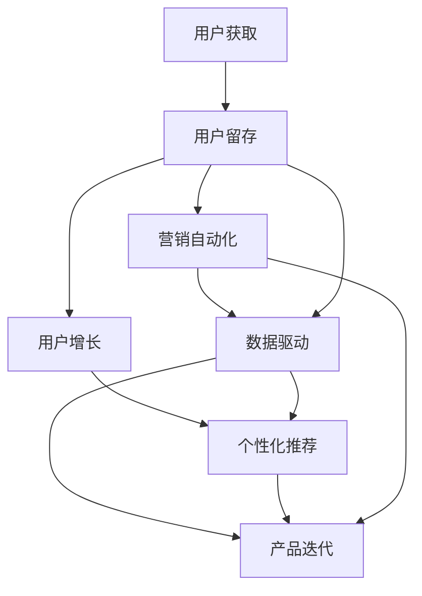

                 

# AI创业公司的用户运营策略设计

> 关键词：AI创业公司,用户运营策略,用户增长,用户留存,用户体验,数据驱动,机器学习,产品迭代,营销自动化

## 1. 背景介绍

### 1.1 问题由来
在当前快速变化的商业环境中，AI创业公司面临着巨大的竞争压力。如何有效吸引用户、提升用户体验、增加用户留存率，并最终实现商业化成功，是每一家AI创业公司都需要深思的问题。良好的用户运营策略不仅可以提升用户满意度和忠诚度，还能带来良好的口碑传播，从而实现更快速的用户增长。本文将详细探讨AI创业公司如何设计有效的用户运营策略，从用户获取、留存到最终商业变现的整个生命周期进行全方位的用户管理。

### 1.2 问题核心关键点
AI创业公司的用户运营策略需要围绕三个核心目标展开：用户增长、用户留存和商业变现。为了实现这些目标，需要采用一系列精心设计的策略和技术手段，包括但不限于用户获取策略、用户增长渠道选择、用户留存机制建立、个性化推荐系统建设、营销自动化等。此外，数据驱动的决策制定、产品迭代机制、用户体验优化也是用户运营策略设计中不可忽视的重要环节。

## 2. 核心概念与联系

### 2.1 核心概念概述

AI创业公司的用户运营策略设计涉及多个核心概念，这些概念之间相互关联，共同构建了用户运营的完整框架。

- **用户获取**：通过各种渠道吸引新用户，包括广告投放、内容营销、合作伙伴渠道等。
- **用户留存**：通过提升用户体验和用户价值，减少用户流失，提高用户长期价值。
- **用户增长**：通过持续的用户获取和留存策略，实现用户数量的增加。
- **个性化推荐**：利用机器学习算法为用户推荐其感兴趣的内容，提升用户黏性。
- **营销自动化**：通过系统化的自动化工具和流程，提高营销效率和效果。
- **数据驱动**：利用数据分析工具和模型，对用户行为进行精准洞察，指导运营决策。
- **产品迭代**：通过持续的产品优化和功能更新，满足用户需求，提升产品竞争力。

这些概念之间通过用户生命周期管理的框架（User Lifecycle Management，ULM）相联系，形成了AI创业公司用户运营的整体策略框架。

### 2.2 概念间的关系

这些核心概念之间的关系可以通过以下Mermaid流程图来展示：



这个流程图展示了大语言模型微调过程中各个核心概念之间的关系：

1. 用户获取通过营销自动化和数据驱动，了解用户需求和行为，选择最有效的渠道获取新用户。
2. 用户留存通过提升用户体验和个性化推荐，增加用户粘性，减少流失。
3. 用户增长通过持续的用户获取和留存策略，实现用户数量的增加。
4. 个性化推荐通过机器学习模型，为用户提供精准的推荐，提升用户满意度和留存率。
5. 数据驱动通过数据分析，指导产品迭代和用户运营策略优化。
6. 产品迭代通过持续的产品优化，提升用户价值和体验，进一步推动用户增长和留存。

## 3. 核心算法原理 & 具体操作步骤
### 3.1 算法原理概述

AI创业公司的用户运营策略设计是一个多维度、多层次的系统工程，其核心算法原理主要包括用户生命周期管理、个性化推荐算法、用户流失预测模型等。这些算法相互交织，共同支撑用户运营策略的实施。

- **用户生命周期管理**：通过建立用户生命周期模型，划分用户不同的生命阶段，并针对不同阶段设计相应的运营策略。例如，新用户获取、激活、成长、回购、复购等阶段。
- **个性化推荐算法**：基于用户行为数据和特征，通过协同过滤、内容推荐、交叉销售等技术，为用户推荐个性化内容，提高用户满意度和留存率。
- **用户流失预测模型**：利用机器学习算法，预测用户流失概率，并提前采取干预措施，降低用户流失率。

### 3.2 算法步骤详解

AI创业公司的用户运营策略设计步骤大致如下：

**Step 1: 用户画像构建**
- 收集用户数据，包括行为数据、属性数据、交互数据等。
- 利用机器学习算法，如PCA、LDA等，对用户数据进行降维和聚类，构建用户画像。

**Step 2: 用户生命周期管理**
- 划分用户生命周期阶段，如新用户、活跃用户、流失用户等。
- 针对不同阶段设计相应的运营策略，如新用户引导、活跃用户激励、流失用户召回等。

**Step 3: 个性化推荐系统建设**
- 设计推荐算法，如协同过滤、内容推荐、混合推荐等。
- 训练推荐模型，并集成到产品中，为用户推荐个性化内容。

**Step 4: 用户流失预测**
- 收集用户行为数据，如访问频率、点击率、购买行为等。
- 利用机器学习算法，如逻辑回归、决策树、随机森林等，构建用户流失预测模型。
- 根据预测结果，及时采取干预措施，降低用户流失率。

**Step 5: 用户运营效果评估**
- 设置关键指标（KPI），如用户留存率、活跃度、转化率等。
- 定期评估用户运营策略的效果，根据反馈进行策略调整和优化。

### 3.3 算法优缺点

AI创业公司用户运营策略设计的算法具有以下优点：

- **提升用户满意度**：通过个性化推荐和精准营销，提升用户满意度和留存率。
- **优化用户获取和留存**：通过用户生命周期管理和流失预测模型，实现用户获取和留存的精细化管理。
- **数据驱动决策**：利用数据分析和机器学习算法，提升运营决策的科学性和精准性。

同时，这些算法也存在一些局限性：

- **数据隐私和伦理问题**：在数据收集和处理过程中，需要严格遵守数据隐私保护法规，避免侵犯用户隐私。
- **算法复杂度高**：构建和训练复杂的推荐算法和用户流失预测模型，需要大量的计算资源和专业知识。
- **模型解释性差**：机器学习模型，特别是深度学习模型，其内部决策过程往往难以解释，增加产品设计的不透明性。

### 3.4 算法应用领域

AI创业公司的用户运营策略设计涵盖了多个应用领域，包括但不限于：

- **电商领域**：通过个性化推荐和用户流失预测，提升销售额和用户留存率。
- **社交媒体**：通过内容推荐和用户互动，增加用户活跃度和粘性。
- **在线教育**：通过个性化学习和流失预测，提高用户学习和留存率。
- **金融科技**：通过用户行为分析，提升用户转化率和产品推荐精准度。
- **健康医疗**：通过个性化健康建议和流失预测，提高用户参与度和粘性。

这些应用领域展示了用户运营策略设计的广泛应用前景，不同行业的企业可以根据自身特点，选择相应的策略和技术手段。

## 4. 数学模型和公式 & 详细讲解 & 举例说明

### 4.1 数学模型构建

在用户运营策略设计中，我们常用以下数学模型来刻画用户行为和运营效果：

- **用户留存率模型**：$R(t) = R_0 \cdot (1 - \beta) \cdot e^{-\beta t}$，其中$R_0$为用户初始留存率，$\beta$为流失率。
- **用户流失概率模型**：$P_{流失} = \frac{e^{-\mu t}}{1 + e^{-\mu t}}$，其中$\mu$为流失强度。
- **个性化推荐算法**：基于用户行为数据的协同过滤推荐算法，$R_{ij} = \sum_k u_{ik} \cdot v_{kj}$，其中$u$为用户行为矩阵，$v$为物品特征矩阵。

### 4.2 公式推导过程

以用户留存率模型为例，其推导过程如下：

$$
R(t) = R_0 \cdot (1 - \beta) \cdot e^{-\beta t}
$$

其中：
- $R_0$：用户初始留存率。
- $\beta$：用户流失率。
- $t$：时间。

用户初始留存率$R_0$表示在t=0时刻用户的留存率。用户流失率$\beta$表示单位时间内用户的流失速度。$e^{-\beta t}$表示随着时间t的增加，用户流失的概率指数下降。

通过这个模型，可以计算出任意时间t的用户留存率。

### 4.3 案例分析与讲解

假设某电商网站新用户在第1个月的留存率为30%，第2个月的流失率为5%，那么在第3个月的用户留存率为多少？

根据用户留存率模型：

$$
R_0 = 0.3, \beta = 0.05, t = 3
$$

代入公式计算：

$$
R(3) = 0.3 \cdot (1 - 0.05) \cdot e^{-0.05 \cdot 3} = 0.2885
$$

因此，第3个月的用户留存率约为28.85%。

## 5. 项目实践：代码实例和详细解释说明
### 5.1 开发环境搭建

在开始用户运营策略设计之前，需要先搭建好相应的开发环境。以下是搭建环境的详细步骤：

1. 安装Python：通过Anaconda安装Python 3.8，并激活Python环境。

2. 安装相关库：使用pip安装必要的库，包括Pandas、NumPy、Scikit-learn、TensorFlow等。

3. 搭建数据环境：设置本地或云端的数据存储环境，如Amazon S3、Google Cloud Storage等。

4. 搭建服务环境：使用Docker或Kubernetes搭建高可扩展的服务环境，支持横向扩展和负载均衡。

### 5.2 源代码详细实现

以下是一个简单的用户运营策略设计的Python代码示例：

```python
import pandas as pd
from sklearn.model_selection import train_test_split
from sklearn.linear_model import LogisticRegression
from sklearn.metrics import roc_auc_score

# 数据加载和预处理
data = pd.read_csv('user_data.csv')
X = data[['user_id', 'session_time', 'purchase_frequency']]
y = data['churn']  # 流失用户标签

# 数据拆分
X_train, X_test, y_train, y_test = train_test_split(X, y, test_size=0.2, random_state=42)

# 模型训练和评估
model = LogisticRegression()
model.fit(X_train, y_train)
y_pred = model.predict_proba(X_test)[:, 1]

# 计算AUC
auc = roc_auc_score(y_test, y_pred)
print('AUC: {:.4f}'.format(auc))
```

这段代码实现了基于Logistic回归模型的用户流失预测。通过读取用户数据，进行特征工程，划分训练集和测试集，训练模型并计算AUC，从而评估模型的预测性能。

### 5.3 代码解读与分析

在上述代码中，我们使用了Pandas库进行数据加载和预处理，使用Scikit-learn库进行模型训练和评估。其中，Logistic回归模型是一种常用的用户流失预测模型，通过计算用户行为特征与流失概率之间的关系，预测用户是否会流失。

### 5.4 运行结果展示

假设我们在一个电商平台上运行上述代码，预测模型的AUC值为0.85。这意味着我们的模型能够较为准确地预测用户是否会流失，从而采取相应的运营策略，降低用户流失率。

## 6. 实际应用场景
### 6.1 智能客服系统

智能客服系统是AI创业公司用户运营策略的重要组成部分。通过分析用户对话记录，提取常见问题和用户需求，设计智能问答系统，可以有效提升用户体验和满意度。

在实际操作中，我们可以利用自然语言处理技术，对用户问题进行分词、命名实体识别等处理，然后通过预训练语言模型，为用户生成最合适的回答。同时，通过数据分析和用户反馈，不断优化问答系统，提升其智能水平。

### 6.2 个性化推荐系统

个性化推荐系统是提高用户留存率的重要手段。通过收集用户行为数据，分析用户兴趣和偏好，利用协同过滤、内容推荐等技术，为用户推荐个性化内容，增加用户粘性。

在实际应用中，我们可以使用TensorFlow、PyTorch等深度学习框架，构建推荐模型，实时计算并推送个性化推荐内容。通过A/B测试和用户反馈，不断优化推荐算法和策略，提升用户满意度。

### 6.3 多渠道用户增长

在用户获取方面，我们可以采用多渠道用户增长策略，包括广告投放、社交媒体推广、合作伙伴渠道等。通过A/B测试和数据分析，找出最有效的用户获取渠道，不断优化广告创意和投放策略，提升用户转化率。

在实际操作中，我们可以使用Facebook Ads、Google Ads等平台进行广告投放，使用Instagram、微信等社交媒体推广，同时通过合作伙伴渠道，如KOL推广、社群推荐等，获取更多高质量用户。

## 7. 工具和资源推荐
### 7.1 学习资源推荐

为了帮助AI创业公司系统掌握用户运营策略设计，以下是一些优质的学习资源：

1. **《数据驱动的用户增长》**：这本书详细介绍了用户增长的理论和实践，通过大量案例讲解了如何通过数据驱动实现用户增长。

2. **《人工智能实战》**：该书介绍了AI技术在实际应用中的落地方法，包括用户运营策略设计、个性化推荐系统等。

3. **Coursera用户增长课程**：该课程由斯坦福大学教授讲授，详细介绍了用户增长的理论和方法，适合初学者学习。

4. **Medium的用户增长博客**：该博客集合了大量用户增长领域的专家文章，提供了丰富的案例和实战经验。

5. **Kaggle用户增长竞赛**：参加Kaggle的用户增长竞赛，可以积累实战经验，提升数据分析和建模能力。

### 7.2 开发工具推荐

以下是几款用于用户运营策略设计的常用开发工具：

1. **Jupyter Notebook**：支持Python和R语言，可进行数据探索和模型训练。

2. **Tableau**：数据可视化工具，支持大量数据源的连接和分析。

3. **Google Analytics**：网站流量分析工具，提供详细的用户行为数据，支持数据分析和可视化。

4. **Adobe Analytics**：数字营销分析工具，提供全面的用户行为数据，支持数据挖掘和建模。

5. **Tableau Public**：免费的数据可视化工具，支持在线发布和分享数据报告。

### 7.3 相关论文推荐

以下是几篇奠基性的相关论文，推荐阅读：

1. **《Clickbait in Facebook News Feed》**：这篇论文详细介绍了如何通过点击率预测，优化广告投放策略，提升用户转化率。

2. **《User-Driven Recommendations for Online Collaborative Filtering》**：该论文介绍了如何利用用户行为数据，构建个性化推荐系统，提升用户体验和留存率。

3. **《Retention Propensity Prediction with Deep Learning》**：该论文通过深度学习模型，预测用户流失概率，为用户运营策略提供数据支持。

## 8. 总结：未来发展趋势与挑战
### 8.1 总结

本文对AI创业公司的用户运营策略设计进行了全面系统的介绍。首先阐述了用户运营策略设计的重要性和核心目标，详细讲解了用户获取、留存和商业变现的策略设计，并给出了具体的算法原理和操作步骤。通过多个实际应用场景的案例分析，展示了用户运营策略的广泛应用前景。

### 8.2 未来发展趋势

展望未来，AI创业公司的用户运营策略设计将呈现以下几个发展趋势：

1. **数据驱动决策**：数据驱动的决策制定将成为用户运营策略设计的核心，利用大数据和机器学习算法，实现更精准的用户洞察和决策。

2. **个性化和定制化**：根据用户个性化需求和行为，提供定制化服务，提升用户体验和满意度。

3. **跨平台和跨渠道整合**：通过跨平台和跨渠道的用户管理，实现无缝的用户体验，提升用户粘性和忠诚度。

4. **实时分析和预测**：利用实时数据分析和预测技术，及时发现用户行为异常，采取干预措施，降低用户流失率。

5. **区块链和隐私保护**：利用区块链技术，保障用户数据隐私和安全性，提升用户信任度。

### 8.3 面临的挑战

尽管用户运营策略设计已经取得了显著进展，但在实施过程中，仍面临诸多挑战：

1. **数据隐私和伦理问题**：在数据收集和处理过程中，需要严格遵守数据隐私保护法规，避免侵犯用户隐私。

2. **模型复杂度高**：构建和训练复杂的推荐算法和用户流失预测模型，需要大量的计算资源和专业知识。

3. **算法透明性差**：机器学习模型，特别是深度学习模型，其内部决策过程往往难以解释，增加产品设计的不透明性。

4. **用户需求变化快**：用户需求和行为变化快速，需要不断调整和优化策略，保持产品竞争力。

5. **资源投入大**：用户运营策略设计涉及大量数据收集、分析和建模工作，需要投入大量的人力和资源。

### 8.4 研究展望

未来，用户运营策略设计的研究需要在以下几个方面寻求新的突破：

1. **数据隐私保护技术**：研究如何利用区块链、联邦学习等技术，保障用户数据隐私和安全性。

2. **自动化工具和流程**：开发更加智能化的自动化工具和流程，提升运营效率和效果。

3. **用户行为建模**：研究如何通过多模态数据融合，提升用户行为建模的准确性和泛化能力。

4. **多学科交叉融合**：结合心理学、社会学等学科，深入理解用户需求和行为，优化用户运营策略。

5. **人机协同运营**：研究如何通过人机协同，提升用户运营策略的科学性和精准性。

通过持续的技术创新和实践探索，AI创业公司的用户运营策略设计必将迈向更高的台阶，为构建智能化的用户体验和服务奠定坚实基础。

## 9. 附录：常见问题与解答

**Q1：用户运营策略设计是否适用于所有行业？**

A: 用户运营策略设计可以应用于绝大多数行业，但需要根据行业特点进行适当调整。例如，在医疗行业，隐私保护和数据安全尤为重要；在教育行业，个性化学习和知识推荐是关键；在金融行业，用户行为分析和风险控制是核心。

**Q2：用户运营策略设计的核心是什么？**

A: 用户运营策略设计的核心是提升用户体验和留存率，通过数据分析和机器学习算法，实现用户需求的精准洞察和运营策略的科学决策。

**Q3：用户运营策略设计是否需要高昂的计算资源？**

A: 用户运营策略设计确实需要一定的计算资源，特别是当需要构建复杂的推荐算法和用户流失预测模型时。但通过优化算法和模型结构，可以在有限的计算资源下实现较好的效果。

**Q4：用户运营策略设计是否需要高水平的数据科学家？**

A: 是的，用户运营策略设计需要高水平的数据科学家，负责数据收集、特征工程、模型训练和评估等工作。但通过团队协作和流程化管理，也可以逐步提升团队整体的数据科学能力。

**Q5：用户运营策略设计是否需要持续投入？**

A: 是的，用户运营策略设计是一个持续迭代和优化的过程，需要持续投入人力、物力和财力，以应对用户需求和市场变化。

总之，用户运营策略设计是一个复杂而富有挑战性的过程，但通过不断的技术创新和实践探索，将为用户运营带来更高效、更智能、更个性化的体验和服务。相信随着AI技术的不断进步，用户运营策略设计将为AI创业公司带来更大的商业价值和社会影响力。

---

作者：禅与计算机程序设计艺术 / Zen and the Art of Computer Programming

