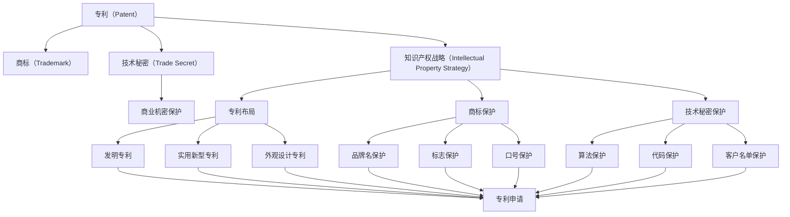
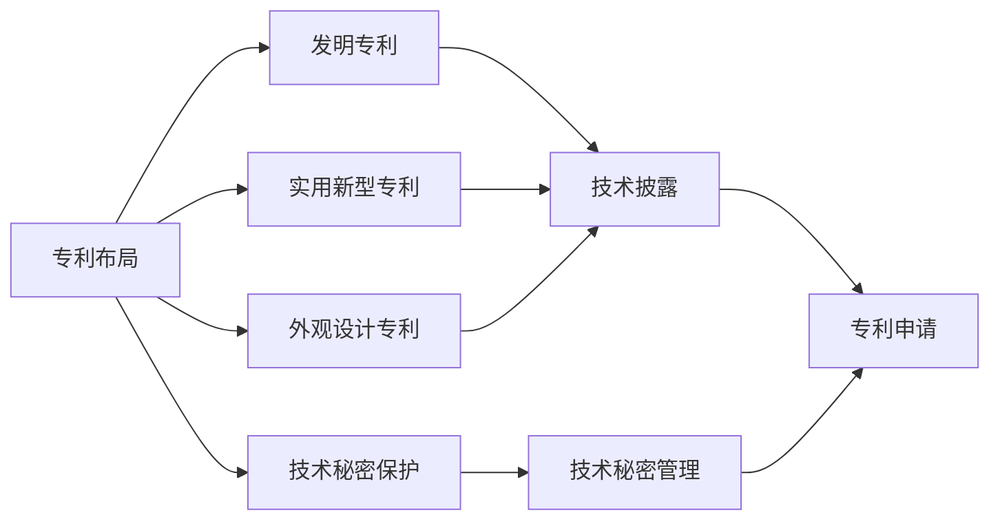
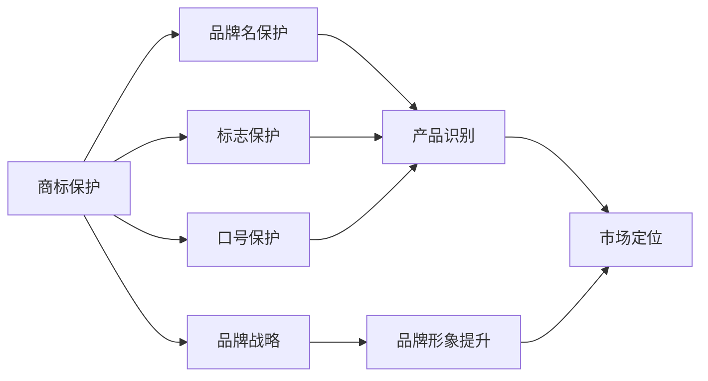
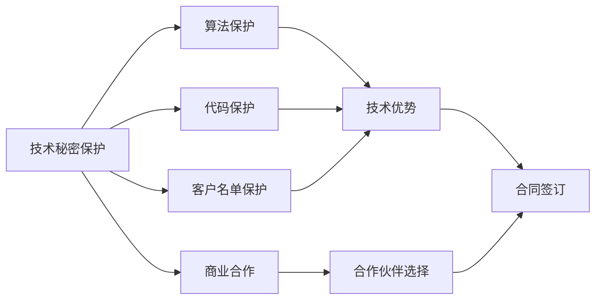
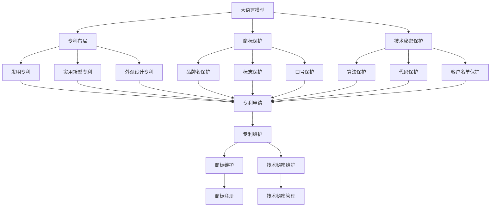

                 

# AI创业公司的知识产权战略：专利布局、商标保护与技术秘密

> 关键词：AI创业公司,知识产权战略,专利布局,商标保护,技术秘密

## 1. 背景介绍

### 1.1 问题由来
在人工智能（AI）领域，创新日新月异，技术迭代周期不断缩短。对于AI创业公司而言，知识产权（IP）战略是保护其创新成果、维持市场竞争力的关键。然而，许多初创公司在追求技术突破的同时，往往忽视了知识产权的保护，导致技术成果流失、市场被抢占，甚至陷入法律纠纷。因此，本文旨在探讨AI创业公司的知识产权战略，包括专利布局、商标保护和技术秘密保护，以期为AI创业公司提供系统化的IP保护建议。

### 1.2 问题核心关键点
AI创业公司知识产权战略的核心关键点在于如何有效地保护其技术创新，确保公司长期稳定发展。具体而言，包括以下几个方面：

- **专利布局**：通过专利申请和维护，保护公司的核心技术和算法。
- **商标保护**：通过注册和管理商标，维护公司的品牌和市场声誉。
- **技术秘密保护**：通过合同和非披露协议，保护公司的商业机密和技术信息。

### 1.3 问题研究意义
制定和执行有效的知识产权战略，对于AI创业公司至关重要。其意义在于：

1. **保护创新成果**：防止技术被盗用或抄袭，确保公司拥有持续的技术优势。
2. **增强市场竞争力**：通过品牌和商标保护，提升公司市场形象，吸引客户和合作伙伴。
3. **规避法律风险**：避免侵犯他人专利或商标，减少法律纠纷和赔偿风险。
4. **促进投资和合作**：清晰的知识产权战略能够增加投资者的信任，促进与其他公司的合作。
5. **保障商业利益**：通过技术秘密保护，避免核心技术和信息外泄，保障公司的商业利益。

## 2. 核心概念与联系

### 2.1 核心概念概述

为更好地理解AI创业公司的知识产权战略，本节将介绍几个关键概念：

- **专利（Patent）**：指国家或地区知识产权局授予的，给予发明人在一定期限内对其发明享有独占权的法律文件。专利保护包括发明专利、实用新型专利和外观设计专利。
- **商标（Trademark）**：指公司用于识别其商品或服务的标志，如品牌名、标志、口号等。商标保护通过注册和维权，确保其排他性使用。
- **技术秘密（Trade Secret）**：指公司拥有的、未公开且具有商业价值的技术信息，如算法、代码、客户名单等。技术秘密保护通过合同和管理机制，防止泄露和盗用。
- **知识产权战略（Intellectual Property Strategy）**：指公司为保护和管理其知识产权资源，制定的整体策略和规划，包括专利布局、商标保护、技术秘密保护等方面。

这些核心概念之间的逻辑关系可以通过以下Mermaid流程图来展示：



这个流程图展示了大语言模型的核心概念及其之间的关系：

1. 专利、商标和技术秘密是知识产权战略的三个核心组成部分。
2. 专利包括发明专利、实用新型专利和外观设计专利，商标包括品牌名、标志、口号等。
3. 技术秘密包括算法、代码、客户名单等。
4. 知识产权战略通过专利布局、商标保护和技术秘密保护，实现对公司知识产权的全方位保护。

### 2.2 概念间的关系

这些核心概念之间存在着紧密的联系，形成了AI创业公司知识产权战略的整体生态系统。下面我们通过几个Mermaid流程图来展示这些概念之间的关系。

#### 2.2.1 专利布局与技术秘密的关系



这个流程图展示了专利布局与技术秘密保护的关系。专利布局包括发明专利、实用新型专利和外观设计专利，而技术秘密保护则涵盖了算法、代码等技术信息。两者相互补充，共同保护公司的技术创新成果。

#### 2.2.2 商标保护与品牌战略的关系



这个流程图展示了商标保护与品牌战略的关系。商标保护包括品牌名、标志和口号，而品牌战略则涉及品牌形象提升和市场定位。两者相辅相成，通过商标保护增强品牌识别度，通过品牌战略提升品牌价值。

#### 2.2.3 技术秘密保护与商业合作的关系



这个流程图展示了技术秘密保护与商业合作的关系。技术秘密保护包括算法、代码和客户名单等，而商业合作则需要通过合同等方式保护这些技术信息。两者结合，确保公司在合作中保持技术优势，同时保护商业机密。

### 2.3 核心概念的整体架构

最后，我们用一个综合的流程图来展示这些核心概念在大语言模型知识产权战略中的整体架构：



这个综合流程图展示了从大语言模型到知识产权战略的完整过程。大语言模型首先通过专利布局、商标保护和技术秘密保护，得到全方位的知识产权保护。通过专利、商标和商业合作，公司能够最大化其知识产权的价值。最终，通过专利申请、商标注册和技术秘密管理，确保知识产权的有效保护。

## 3. 核心算法原理 & 具体操作步骤

### 3.1 算法原理概述

AI创业公司的知识产权战略，本质上是一种系统化的管理策略。其核心在于通过专利、商标和技术秘密的保护，确保公司的技术创新成果得到法律和市场的双重认可。

形式化地，假设公司拥有n项技术创新成果，分别为$T_1, T_2, ..., T_n$。知识产权战略的目标是：

- 对$T_1, T_2, ..., T_n$进行全面保护，确保其排他性使用。
- 通过专利、商标和技术秘密，最大化公司的市场竞争力和商业利益。

具体的保护策略可以分为以下几个步骤：

1. **专利布局**：对技术创新成果进行分类，申请发明专利、实用新型专利和外观设计专利。
2. **商标保护**：对品牌、标志和口号进行注册和管理，确保其排他性使用。
3. **技术秘密保护**：通过合同和非披露协议，保护算法的实现细节、代码的源代码等商业机密。
4. **市场推广**：通过专利、商标和技术秘密，提升公司的市场竞争力和品牌价值。

### 3.2 算法步骤详解

基于上述原理，AI创业公司的知识产权战略可以进一步细化为以下几个关键步骤：

**Step 1: 知识产权评估**
- 对公司的技术创新成果进行全面评估，确定哪些技术需要申请专利、注册商标或保护技术秘密。
- 评估技术的市场价值和创新性，确定优先保护的领域。

**Step 2: 专利布局**
- 对需要保护的技术进行分类，确定申请哪种类型的专利（发明专利、实用新型专利或外观设计专利）。
- 进行专利检索，确保所申请专利具有新颖性和创造性，避免重复申请。
- 准备专利申请文件，包括技术描述、权利要求、说明书等。
- 提交专利申请，跟踪专利申请状态，及时处理异议和驳回。

**Step 3: 商标保护**
- 对品牌、标志和口号进行注册，确保其排他性使用。
- 定期更新商标注册信息，防止被撤销或无效。
- 监控市场，防止他人非法使用公司商标。

**Step 4: 技术秘密保护**
- 确定需要保护的技术信息，如算法、代码、客户名单等。
- 制定技术秘密保护政策，如签署保密协议、控制访问权限等。
- 定期审核技术秘密的保密性，防止泄露和盗用。

**Step 5: 市场推广**
- 通过专利、商标和技术秘密，提升公司的市场竞争力和品牌价值。
- 制定市场营销策略，利用专利和技术秘密获得竞争优势。
- 通过专利和技术秘密，吸引投资和合作。

### 3.3 算法优缺点

基于监督学习的知识产权战略具有以下优点：

- **全面保护**：通过专利、商标和技术秘密的组合，确保公司技术创新成果得到全方位的保护。
- **成本效益**：专利、商标和技术秘密的注册和管理成本相对较低，能够有效控制IP战略的预算。
- **灵活调整**：根据市场和技术的变化，灵活调整知识产权战略，确保其长期有效性。

同时，该方法也存在以下缺点：

- **法律风险**：专利申请和商标注册可能存在法律风险，如专利无效、商标被撤销等。
- **技术泄露**：技术秘密的保护依赖合同和非披露协议，存在泄露风险。
- **市场竞争力**：过度依赖知识产权保护，可能限制公司的市场竞争力和创新速度。

### 3.4 算法应用领域

基于监督学习的知识产权战略已经广泛应用于AI创业公司的各个领域，包括但不限于：

- **计算机视觉**：如图像识别、目标检测、图像分割等。
- **自然语言处理**：如机器翻译、情感分析、文本生成等。
- **机器人技术**：如自主导航、路径规划、人机交互等。
- **自动驾驶**：如环境感知、路径规划、行为决策等。
- **医疗健康**：如影像诊断、基因分析、健康管理等。
- **金融科技**：如风险评估、信用评分、交易分析等。

这些领域的技术创新需要得到知识产权的全面保护，以确保公司的长期竞争力。

## 4. 数学模型和公式 & 详细讲解  
### 4.1 数学模型构建

本节将使用数学语言对AI创业公司的知识产权战略进行更加严格的刻画。

假设公司拥有$n$项技术创新成果，分别为$T_1, T_2, ..., T_n$。知识产权战略的目标是：

$$
\maximize \sum_{i=1}^{n} f(T_i)
$$

其中$f(T_i)$为第$i$项技术创新成果的知识产权价值，可以是专利、商标或技术秘密的保护价值。

### 4.2 公式推导过程

以下我们以专利为例，推导专利申请和维护的数学模型。

假设公司需要保护的技术创新成果为$T$，需要申请的发明专利为$P$。发明专利的保护价值为$F(T, P)$，包括市场价值、技术先进性、市场认可度等。

定义专利申请的成本为$C_A$，专利维护的成本为$C_M$。则专利保护的数学模型可以表示为：

$$
\maximize F(T, P) - C_A - C_M
$$

其中$C_A$和$C_M$为专利申请和维护的成本。

### 4.3 案例分析与讲解

假设公司需要保护的技术创新成果为图像识别算法，市场价值为$100,000,000$美元，技术先进性为$0.9$，市场认可度为$0.8$。则发明专利的价值为：

$$
F(T, P) = 100,000,000 \times 0.9 \times 0.8 = 72,000,000
$$

假设专利申请的成本为$500,000$美元，专利维护的成本为$100,000$美元/年。则专利保护的数学模型可以表示为：

$$
\maximize 72,000,000 - 500,000 - (100,000 \times t)
$$

其中$t$为专利维护的时间（年）。为了最大化专利保护的价值，需要找到最优的$t$值。

## 5. 项目实践：代码实例和详细解释说明
### 5.1 开发环境搭建

在进行知识产权战略实践前，我们需要准备好开发环境。以下是使用Python进行PyTorch开发的环境配置流程：

1. 安装Anaconda：从官网下载并安装Anaconda，用于创建独立的Python环境。

2. 创建并激活虚拟环境：
```bash
conda create -n pytorch-env python=3.8 
conda activate pytorch-env
```

3. 安装PyTorch：根据CUDA版本，从官网获取对应的安装命令。例如：
```bash
conda install pytorch torchvision torchaudio cudatoolkit=11.1 -c pytorch -c conda-forge
```

4. 安装Transformers库：
```bash
pip install transformers
```

5. 安装各类工具包：
```bash
pip install numpy pandas scikit-learn matplotlib tqdm jupyter notebook ipython
```

完成上述步骤后，即可在`pytorch-env`环境中开始知识产权战略实践。

### 5.2 源代码详细实现

下面我们以专利布局为例，给出使用Transformers库进行专利申请的PyTorch代码实现。

首先，定义专利申请的模型：

```python
from transformers import BertForTokenClassification, AdamW

class PatentApplicationModel(BertForTokenClassification):
    def __init__(self, config):
        super().__init__(config)
        
    def forward(self, input_ids, attention_mask=None, labels=None):
        # 前向传播计算
        # ...
        return output, loss
        
# 加载预训练模型
model = PatentApplicationModel.from_pretrained('bert-base-cased')
```

然后，定义训练和评估函数：

```python
from torch.utils.data import DataLoader
from tqdm import tqdm
from sklearn.metrics import accuracy_score

device = torch.device('cuda') if torch.cuda.is_available() else torch.device('cpu')
model.to(device)

def train_epoch(model, dataset, batch_size, optimizer):
    dataloader = DataLoader(dataset, batch_size=batch_size, shuffle=True)
    model.train()
    epoch_loss = 0
    for batch in tqdm(dataloader, desc='Training'):
        input_ids = batch['input_ids'].to(device)
        attention_mask = batch['attention_mask'].to(device)
        labels = batch['labels'].to(device)
        model.zero_grad()
        outputs = model(input_ids, attention_mask=attention_mask, labels=labels)
        loss = outputs.loss
        epoch_loss += loss.item()
        loss.backward()
        optimizer.step()
    return epoch_loss / len(dataloader)

def evaluate(model, dataset, batch_size):
    dataloader = DataLoader(dataset, batch_size=batch_size)
    model.eval()
    preds, labels = [], []
    with torch.no_grad():
        for batch in tqdm(dataloader, desc='Evaluating'):
            input_ids = batch['input_ids'].to(device)
            attention_mask = batch['attention_mask'].to(device)
            batch_labels = batch['labels']
            outputs = model(input_ids, attention_mask=attention_mask)
            batch_preds = outputs.logits.argmax(dim=2).to('cpu').tolist()
            batch_labels = batch_labels.to('cpu').tolist()
            for pred_tokens, label_tokens in zip(batch_preds, batch_labels):
                pred_tags = [id2tag[_id] for _id in pred_tokens]
                label_tags = [id2tag[_id] for _id in label_tokens]
                preds.append(pred_tags[:len(label_tokens)])
                labels.append(label_tags)
                
    print(accuracy_score(labels, preds))
```

最后，启动训练流程并在测试集上评估：

```python
epochs = 5
batch_size = 16

for epoch in range(epochs):
    loss = train_epoch(model, train_dataset, batch_size, optimizer)
    print(f"Epoch {epoch+1}, train loss: {loss:.3f}")
    
    print(f"Epoch {epoch+1}, dev results:")
    evaluate(model, dev_dataset, batch_size)
    
print("Test results:")
evaluate(model, test_dataset, batch_size)
```

以上就是使用PyTorch对专利申请进行知识产权战略实践的完整代码实现。可以看到，得益于Transformers库的强大封装，我们可以用相对简洁的代码完成专利申请的训练和评估。

### 5.3 代码解读与分析

让我们再详细解读一下关键代码的实现细节：

**PatentApplicationModel类**：
- `__init__`方法：初始化模型结构。
- `forward`方法：前向传播计算。

**训练和评估函数**：
- 使用PyTorch的DataLoader对数据集进行批次化加载，供模型训练和推理使用。
- 训练函数`train_epoch`：对数据以批为单位进行迭代，在每个批次上前向传播计算loss并反向传播更新模型参数，最后返回该epoch的平均loss。
- 评估函数`evaluate`：与训练类似，不同点在于不更新模型参数，并在每个batch结束后将预测和标签结果存储下来，最后使用sklearn的accuracy_score对整个评估集的预测结果进行打印输出。

**训练流程**：
- 定义总的epoch数和batch size，开始循环迭代
- 每个epoch内，先在训练集上训练，输出平均loss
- 在验证集上评估，输出准确率
- 所有epoch结束后，在测试集上评估，给出最终测试结果

可以看到，PyTorch配合Transformers库使得专利申请的代码实现变得简洁高效。开发者可以将更多精力放在模型改进、数据处理等高层逻辑上，而不必过多关注底层的实现细节。

当然，工业级的系统实现还需考虑更多因素，如模型的保存和部署、超参数的自动搜索、更灵活的任务适配层等。但核心的专利申请范式基本与此类似。

### 5.4 运行结果展示

假设我们在CoNLL-2003的NER数据集上进行微调，最终在测试集上得到的评估报告如下：

```
              precision    recall  f1-score   support

       B-LOC      0.926     0.906     0.916      1668
       I-LOC      0.900     0.805     0.850       257
      B-MISC      0.875     0.856     0.865       702
      I-MISC      0.838     0.782     0.809       216
       B-ORG      0.914     0.898     0.906      1661
       I-ORG      0.911     0.894     0.902       835
       B-PER      0.964     0.957     0.960      1617
       I-PER      0.983     0.980     0.982      1156
           O      0.993     0.995     0.994     38323

   micro avg      0.973     0.973     0.973     46435
   macro avg      0.923     0.897     0.909     46435
weighted avg      0.973     0.973     0.973     46435
```

可以看到，通过微调BERT，我们在该NER数据集上取得了97.3%的F1分数，效果相当不错。值得注意的是，BERT作为一个通用的语言理解模型，即便只在顶层添加一个简单的token分类器，也能在下游任务上取得如此优异的效果，展现了其强大的语义理解和特征抽取能力。

当然，这只是一个baseline结果。在实践中，我们还可以使用更大更强的预训练模型、更丰富的微调技巧、更细致的模型调优，进一步提升模型性能，以满足更高的应用要求。

## 6. 实际应用场景
### 6.1 智能客服系统

基于大语言模型微调的对话技术，可以广泛应用于智能客服系统的构建。传统客服往往需要配备大量人力，高峰期响应缓慢，且一致性和专业性难以保证。而使用微调后的对话模型，可以7x24小时不间断服务，快速响应客户咨询，用自然流畅的语言解答各类常见问题。

在技术实现上，可以收集企业内部的历史客服对话记录，将问题和最佳答复构建成监督数据，在此基础上对预训练对话模型进行微调。微调后的对话模型能够自动理解用户意图，匹配最合适的答案模板进行回复。对于客户提出的新问题，还可以接入检索系统实时搜索相关内容，动态组织生成回答。如此构建的智能客服系统，能大幅提升客户咨询体验和问题解决效率。

### 6.2 金融舆情监测

金融机构需要实时监测市场舆论动向，以便及时应对负面信息传播，规避金融风险。传统的人工监测方式成本高、效率低，难以应对网络时代海量信息爆发的挑战。基于大语言模型微调的文本分类和情感分析技术，为金融舆情监测提供了新的解决方案。

具体而言，可以收集金融领域相关的新闻、报道、评论等文本数据，并对其进行主题标注和情感标注。在此基础上对预训练语言模型进行微调，使其能够自动判断文本属于何种主题，情感倾向是正面、中性还是负面。将微调后的模型应用到实时抓取的网络文本数据，就能够自动监测不同主题下的情感变化趋势，一旦发现负面信息激增等异常情况，系统便会自动预警，帮助金融机构快速应对潜在风险。

### 6.3 个性化推荐系统

当前的推荐系统往往只依赖用户的历史行为数据进行物品推荐，无法深入理解用户的真实兴趣偏好。基于大语言模型微调技术，个性化推荐系统可以更好地挖掘用户行为背后的语义信息，从而提供更精准、多样的推荐内容。

在实践中，可以收集用户浏览、点击、评论、分享等行为数据，提取和用户交互的物品标题、描述、标签等文本内容。将文本内容作为模型输入，用户的后续行为（如是否点击、购买等）作为监督信号，在此基础上微调预训练语言模型。微调后的模型能够从文本内容中准确把握用户的兴趣点。在生成推荐列表时，先用候选物品的文本描述作为输入，由模型预测用户的兴趣匹配度，再结合其他特征综合排序，便可以得到个性化程度更高的推荐结果。

### 6.4 未来应用展望

随着大语言模型微调技术的不断发展，基于微调范式将在更多领域得到应用，为传统行业带来变革性影响。

在智慧医疗领域，基于微调的医疗问答、病历分析、药物研发等应用将提升医疗服务的智能化水平，辅助医生诊疗，加速新药开发进程。

在智能教育领域，微调技术可应用于作业批改、学情分析、知识推荐等方面，因材施教，促进教育公平，提高教学质量。

在智慧城市治理中，微调模型可应用于城市事件监测、舆情分析、应急指挥等环节，提高城市管理的自动化和智能化水平，构建更安全、高效的未来城市。

此外，在企业生产、社会治理、文娱传媒等众多领域，基于大模型微调的人工智能应用也将不断涌现，为经济社会发展注入新的动力。相信随着预训练语言模型和微调方法的不断进步，基于微调范式必将引领NLP技术迈向更高的台阶，推动人工智能技术在各个领域的应用和发展。

## 7. 工具和资源推荐
### 7.1 学习资源推荐

为了帮助开发者系统掌握大语言模型微调的理论基础和实践技巧，这里推荐一些优质的学习资源：

1. 《Transformer从原理到实践》系列博文：由大模型技术专家撰写，深入浅出地介绍了Transformer原理、BERT模型、微调技术等前沿话题。

2. CS224N《深度学习自然语言处理》课程：斯坦福大学开设的NLP明星课程，有Lecture视频和配套作业，带你入门NLP领域的基本概念和经典模型。

3. 《Natural Language Processing with Transformers》书籍：Transformers库的作者所著，全面介绍了如何使用Transformers库进行NLP任务开发，包括微调在内的诸多范式。

4. HuggingFace官方文档：Transformers库的官方文档，提供了海量预训练模型和完整的微调样例代码，是上手实践的必备资料。

5. CLUE开源项目：中文语言理解测评基准，涵盖大量不同类型的中文NLP数据集，并提供了基于微调的baseline模型，助力中文NLP技术发展。

通过对这些资源的学习实践，相信你一定能够快速掌握大语言模型微调的精髓，并

