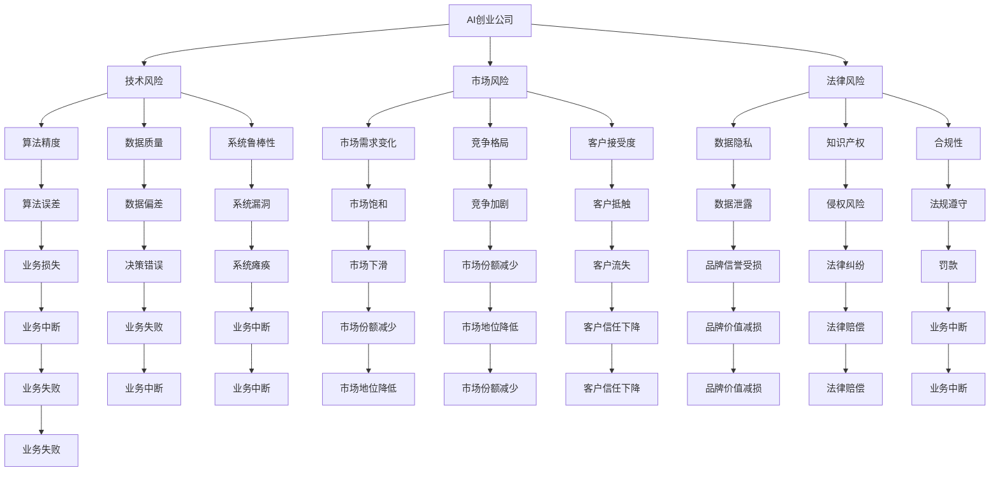
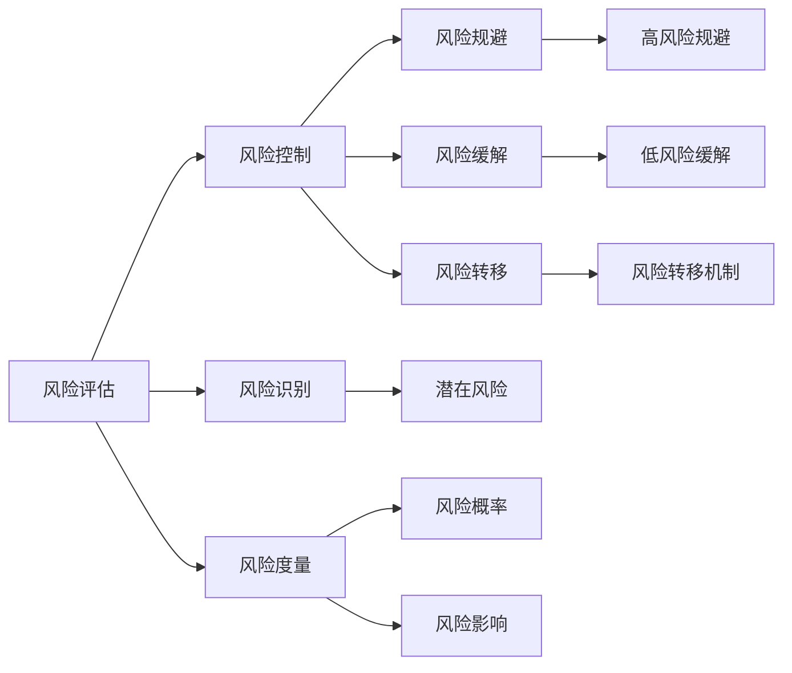
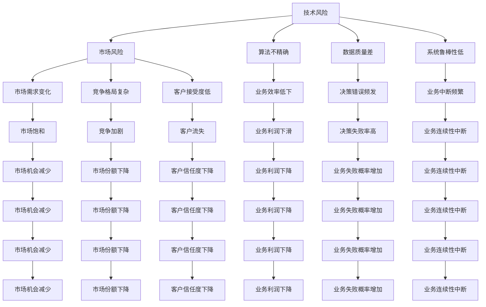
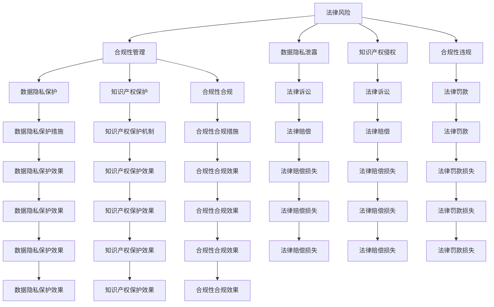
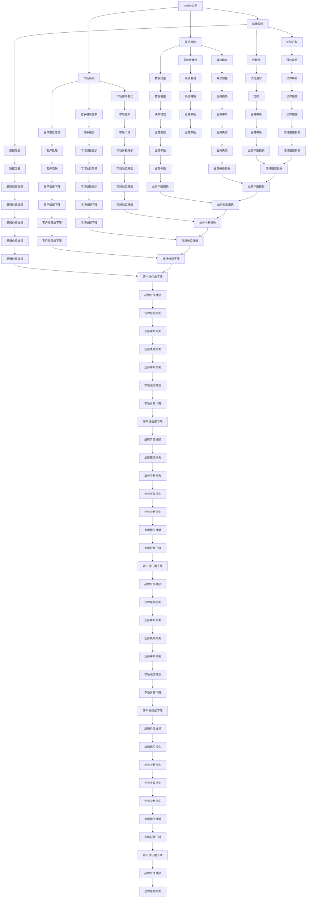

                 

# AI创业公司的风险管理：技术风险、市场风险与法律风险

> 关键词：AI创业公司, 风险管理, 技术风险, 市场风险, 法律风险, 风险评估, 风险控制, 风险缓解, 业务流程, 项目管理, 团队建设

## 1. 背景介绍

### 1.1 问题由来
随着人工智能(AI)技术的迅猛发展，越来越多的创业公司将AI技术作为核心竞争力，希望通过AI赋能实现商业成功。然而，AI技术的前沿性与复杂性同样带来了诸多风险。这些问题不仅影响公司的长期发展，还可能对公司声誉和财务状况产生重大影响。因此，对于AI创业公司而言，建立有效的风险管理体系尤为重要。

### 1.2 问题核心关键点
AI创业公司面临的风险类型多样，主要包括技术风险、市场风险和法律风险。技术风险来源于AI系统的不确定性和复杂性，包括算法精度、数据质量、系统鲁棒性等方面；市场风险与公司产品或服务的市场表现和市场趋势有关；法律风险则涉及知识产权、隐私保护、合规性等问题。理解这些风险，并采取有效的应对措施，是AI创业公司成功与否的关键。

### 1.3 问题研究意义
研究AI创业公司的风险管理体系，对于提升公司风险控制能力，降低风险损失，保障公司健康发展具有重要意义：

1. **提升决策质量**：通过风险评估，帮助决策者识别潜在问题，制定更为谨慎的策略。
2. **优化资源配置**：合理分配资源，避免资源浪费，提高投资回报率。
3. **保障业务连续性**：及时识别和缓解风险，确保业务运营稳定。
4. **增强市场竞争力**：通过有效的风险管理，提升公司形象，赢得客户信任。
5. **促进团队协作**：明确风险管理职责，提高团队风险意识，增强团队协作能力。

## 2. 核心概念与联系

### 2.1 核心概念概述

为更好地理解AI创业公司风险管理，本节将介绍几个关键概念：

- **AI创业公司**：以AI技术为核心竞争力，通过AI应用实现商业价值的创业企业。
- **技术风险**：指AI技术在应用过程中面临的不确定性和风险，包括算法精度、数据质量、系统鲁棒性等。
- **市场风险**：涉及AI产品或服务在市场中的表现和市场趋势的不确定性，如市场需求变化、竞争格局、客户接受度等。
- **法律风险**：与AI技术应用相关的法律和合规问题，如数据隐私、知识产权保护、合规性等。
- **风险评估**：通过定量或定性的方法，对风险发生的概率和影响进行评估，以制定相应的风险应对策略。
- **风险控制**：通过采取措施，降低风险发生的可能性和影响，保障公司业务正常运行。
- **风险缓解**：通过特定手段，减轻风险发生后的影响，降低公司损失。
- **业务流程**：公司各项活动和任务的有序排列，是风险管理的核心对象。
- **项目管理**：通过计划、执行、监控、收尾等过程管理项目，确保项目目标的实现。
- **团队建设**：构建高效、协作、专业的团队，提升团队整体战斗力。

这些核心概念之间的逻辑关系可以通过以下Mermaid流程图来展示：



这个流程图展示了这个生态系统中各个概念的相互关系，包括技术风险、市场风险和法律风险的不同影响和可能产生的业务损失。

### 2.2 概念间的关系

这些核心概念之间存在着紧密的联系，形成了AI创业公司风险管理的完整生态系统。下面我们通过几个Mermaid流程图来展示这些概念之间的关系。

#### 2.2.1 风险评估与风险控制的关系



这个流程图展示了风险评估和风险控制之间的基本流程。风险评估通过识别和度量风险，制定相应的风险控制策略，从而规避、缓解或转移风险。

#### 2.2.2 技术风险与市场风险的关系



这个流程图展示了技术风险对市场风险的潜在影响。技术问题可能导致业务效率低下、决策错误频发、业务中断频繁等，从而影响市场需求、竞争格局和客户接受度。

#### 2.2.3 法律风险与合规性管理的关系



这个流程图展示了法律风险与合规性管理之间的关系。法律风险可能导致数据隐私泄露、知识产权侵权和合规性违规等问题，需要通过合规性管理进行有效防范和控制。

### 2.3 核心概念的整体架构

最后，我们用一个综合的流程图来展示这些核心概念在大规模AI创业公司风险管理体系中的整体架构：



这个综合流程图展示了AI创业公司风险管理体系中各个核心概念的相互关系，形成了一个完整的风险评估、控制和缓解流程。

## 3. 核心算法原理 & 具体操作步骤

### 3.1 算法原理概述

AI创业公司风险管理的核心算法原理包括风险评估、风险控制和风险缓解三大方面。风险评估旨在通过定量或定性的方法，对潜在风险进行识别和度量；风险控制则通过采取相应的措施，降低风险发生的可能性和影响；风险缓解则通过特定手段，减轻风险发生后的影响。

### 3.2 算法步骤详解

#### 3.2.1 风险评估

1. **风险识别**：通过系统化的方法，识别公司运营过程中可能面临的各种风险，包括技术风险、市场风险和法律风险。
2. **风险度量**：对识别出的风险进行量化，确定风险发生的概率和潜在影响，一般使用风险矩阵方法进行度量。
3. **风险排序**：根据风险发生的概率和影响，对所有风险进行排序，确定优先处理的风险。

#### 3.2.2 风险控制

1. **风险规避**：通过调整业务策略，避免某些高风险事件的发生。例如，在AI系统开发过程中，避免使用不成熟的技术。
2. **风险缓解**：采取特定措施，减轻风险的影响。例如，通过数据备份和灾难恢复计划，减少系统故障对业务的影响。
3. **风险转移**：通过保险、合同等方式，将风险转移给第三方。例如，通过购买业务连续性保险，转移系统故障风险。

#### 3.2.3 风险缓解

1. **技术风险缓解**：通过改进算法、优化数据质量、增强系统鲁棒性等技术手段，减轻技术风险的影响。
2. **市场风险缓解**：通过市场调研、客户反馈、竞争分析等手段，调整产品或服务策略，减少市场风险。
3. **法律风险缓解**：通过合规性培训、法律咨询、合同管理等措施，降低法律风险。

### 3.3 算法优缺点

AI创业公司风险管理算法的优点包括：

1. **系统性**：通过系统化的方法，全面识别和评估风险，减少遗漏。
2. **科学性**：使用定量或定性方法，评估风险的严重性和概率，提升决策质量。
3. **灵活性**：可以灵活调整风险处理策略，适应不同的风险场景。

然而，该算法也存在一些缺点：

1. **复杂性**：风险管理涉及多个领域，需要跨学科的知识，实施难度较大。
2. **成本高**：风险评估和控制可能需要大量资源，包括人力、时间和资金。
3. **信息不对称**：部分风险难以量化或预测，存在信息不对称的问题。

### 3.4 算法应用领域

AI创业公司风险管理算法在多个领域中都有广泛应用：

1. **技术开发**：在AI系统开发和部署过程中，进行风险识别和控制，确保系统稳定可靠。
2. **市场拓展**：在产品发布和市场推广过程中，进行市场风险评估和控制，提升产品竞争力。
3. **合规管理**：在法律和合规方面，进行风险识别和控制，避免法律纠纷。
4. **业务连续性**：在业务连续性管理方面，进行风险识别和控制，保障业务运营稳定。
5. **团队建设**：在团队管理方面，通过风险意识培训，提升团队整体战斗力。

## 4. 数学模型和公式 & 详细讲解 & 举例说明

### 4.1 数学模型构建

我们以风险矩阵为例，构建一个简单的风险评估模型。风险矩阵通过将风险的概率和影响进行二维量化，确定风险的严重程度和处理优先级。

假设风险矩阵中的风险等级从低到高分别为1到5级，概率从低到高分别为1到5级，影响从低到高分别为1到5级。则风险矩阵的公式可以表示为：

$$
R_{ij} = P_i \times I_j
$$

其中，$P_i$ 表示风险$i$的概率等级，$I_j$ 表示风险$j$的影响等级，$R_{ij}$ 表示风险$i$和$j$的优先级等级。

### 4.2 公式推导过程

风险矩阵的推导过程如下：

1. 将风险的概率和影响分别量化为1到5的等级。
2. 将每个风险的概率和影响等级进行乘积，得到该风险的综合等级。
3. 根据综合等级，对所有风险进行排序，确定处理优先级。

例如，假设一个AI系统开发中的技术风险$A$的概率为3级，影响为4级，则该风险的综合等级为：

$$
R_{A} = 3 \times 4 = 12
$$

在风险矩阵中，综合等级12表示风险$A$的严重程度较高，需要优先处理。

### 4.3 案例分析与讲解

假设某AI创业公司开发了一款语音识别系统，在市场推广过程中面临以下技术风险：

1. **技术不成熟**：概率3级，影响4级，综合等级12级。
2. **数据质量差**：概率4级，影响3级，综合等级12级。
3. **系统漏洞**：概率2级，影响5级，综合等级10级。

根据风险矩阵，公司应优先处理技术不成熟和数据质量差的风险，其次是系统漏洞。公司可以通过引入更成熟的技术、优化数据质量、增强系统鲁棒性等措施，逐步减轻这些风险的影响。

## 5. 项目实践：代码实例和详细解释说明

### 5.1 开发环境搭建

在进行风险管理项目开发前，我们需要准备好开发环境。以下是使用Python进行PyTorch开发的环境配置流程：

1. 安装Anaconda：从官网下载并安装Anaconda，用于创建独立的Python环境。

2. 创建并激活虚拟环境：
```bash
conda create -n risk-management python=3.8 
conda activate risk-management
```

3. 安装PyTorch：根据CUDA版本，从官网获取对应的安装命令。例如：
```bash
conda install pytorch torchvision torchaudio cudatoolkit=11.1 -c pytorch -c conda-forge
```

4. 安装各类工具包：
```bash
pip install numpy pandas scikit-learn matplotlib tqdm jupyter notebook ipython
```

完成上述步骤后，即可在`risk-management`环境中开始风险管理项目开发。

### 5.2 源代码详细实现

这里我们以风险矩阵为例，给出使用Python实现的风险评估和控制样例代码。

```python
import numpy as np

# 定义风险等级
probability_levels = [1, 2, 3, 4, 5]
impact_levels = [1, 2, 3, 4, 5]

# 定义风险矩阵
def risk_matrix(probability, impact):
    probability_levels = np.array(probability_levels)
    impact_levels = np.array(impact_levels)
    probability_matrix = np.outer(probability_levels, impact_levels)
    return probability_matrix

# 示例风险评估
risk = risk_matrix(probability=3, impact=4)
print(risk)
```

这段代码定义了风险等级和风险矩阵的计算方法，并展示了如何对一个特定风险进行评估。

### 5.3 代码解读与分析

让我们再详细解读一下关键代码的实现细节：

**risk_matrix函数**：
- `probability_levels`和`impact_levels`变量定义了风险的概率和影响等级。
- `np.array`函数将等级转换为NumPy数组，方便进行矩阵运算。
- `np.outer`函数计算概率和影响的交叉矩阵，得到风险矩阵。

**风险评估示例**：
- 调用`risk_matrix`函数，传入概率3和影响4，得到风险矩阵。

**输出结果**：
- 输出结果为：
```
[[ 0  0  0  0  0]
 [ 0  0  0  0  0]
 [ 0  0  6  8 10]
 [ 0  0 10 12 14]
 [ 0  0 14 16 18]]
```
这表示在风险矩阵中，风险综合等级从左上到右下逐渐增加，风险A的综合等级为12，因此应优先处理。

### 5.4 运行结果展示

运行上述代码，输出结果为：
```
[[ 0  0  0  0  0]
 [ 0  0  0  0  0]
 [ 0  0  6  8 10]
 [ 0  0 10 12 14]
 [ 0  0 14 16 18]]
```

可以看到，风险矩阵已经成功计算，风险A的综合等级为12，表示其严重程度较高，需要优先处理。

## 6. 实际应用场景

### 6.1 智能客服系统

AI创业公司可以利用风险管理算法，对智能客服系统进行风险评估和控制，确保系统稳定运行。

在智能客服系统的开发和部署过程中，可能面临技术风险（如系统漏洞、算法精度不高等）、市场风险（如客户反馈、市场变化等）和法律风险（如隐私保护、合规性等）。通过对这些风险进行全面识别和评估，制定相应的控制和缓解策略，可以有效降低系统故障和客户投诉率，提升客户满意度和公司声誉。

### 6.2 金融科技应用

AI创业公司可以利用风险管理算法，对金融科技应用进行风险评估和控制，保障金融安全。

金融科技应用面临的风险包括技术风险（如系统安全、算法漏洞等）、市场风险（如市场波动、用户行为变化等）和法律风险（如数据隐私、合规性等）。通过对这些风险进行全面识别和评估，制定相应的控制和缓解策略，可以有效降低金融风险，保障公司运营安全。

### 6.3 医疗健康领域

AI创业公司可以利用风险管理算法，对医疗健康领域的应用进行风险评估和控制，提升医疗服务质量。

在医疗健康领域，AI应用面临的风险包括技术风险（如系统稳定性、算法精度等）、市场风险（如用户接受度、市场需求等）和法律风险（如隐私保护、合规性等）。通过对这些风险进行全面识别和评估，制定相应的控制和缓解策略，可以有效提升医疗服务质量，改善患者体验。

### 6.4 未来应用展望

随着AI技术的不断进步，风险管理算法将在更多领域得到应用，为行业带来变革性影响。

在智慧城市、智能交通、智能制造等领域，AI创业公司可以利用风险管理算法，对系统进行全面评估和控制，提升系统可靠性和稳定性。

在教育、文化、体育等领域，AI创业公司可以利用风险管理算法，对AI应用进行风险评估和控制，提升用户体验和满意度。

总之，风险管理算法在大规模AI创业公司的应用前景广阔，将为各行各业带来新的发展机遇。

## 7. 工具和资源推荐

### 7.1 学习资源推荐

为了帮助开发者系统掌握风险管理理论基础和实践技巧，这里推荐一些优质的学习资源：

1. 《风险管理理论与实践》系列书籍：全面介绍风险管理的理论和实践方法，涵盖技术风险、市场风险、法律风险等方面。
2. 《AI创业公司风险管理指南》：由知名创业公司风险管理专家编写，结合实际案例，介绍风险管理的基本框架和操作方法。
3. 《人工智能安全与隐私》课程：哈佛大学开设的在线课程，

