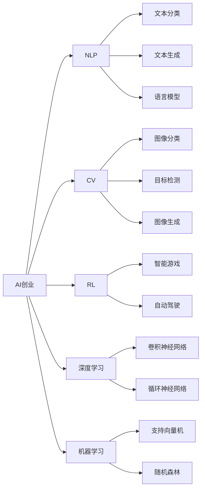
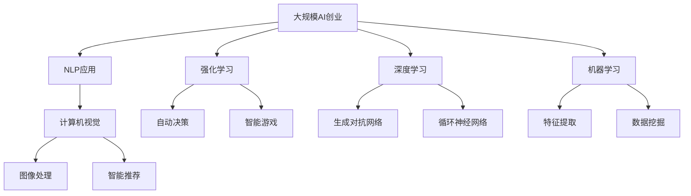

                 

# AI创业：不同项目的技术选择

> 关键词：
- AI创业
- 技术选择
- 项目开发
- 数据驱动
- 模型训练
- 机器学习
- 深度学习
- 自然语言处理
- 计算机视觉

## 1. 背景介绍

### 1.1 问题由来
在人工智能（AI）时代，技术在驱动各行各业创新的同时，也给AI创业带来了前所未有的机遇与挑战。不同的AI创业项目，其核心技术选择、应用场景、市场潜力差异巨大，如何根据项目需求选择合适技术，成为关键问题。本文将从AI创业项目的技术选择视角，探讨如何选择合适技术以支撑项目成功落地。

### 1.2 问题核心关键点
AI创业技术选择的关键点包括：
- **项目定位**：明确项目目标，是专注于自然语言处理（NLP）、计算机视觉（CV）、强化学习（RL）等某个领域，还是综合运用多项AI技术。
- **数据需求**：需要何种数据支持，数据质量、数据量对项目成功影响巨大。
- **模型复杂度**：选择何种模型，是否需要考虑模型大小、训练时间、推理速度等因素。
- **可扩展性**：技术方案能否支持未来业务扩展，是否可轻松集成新功能。
- **资源投入**：技术实现的难易程度、资源需求等对创业公司的资源投入有直接影响。
- **市场应用**：目标市场是否已有相似技术产品，如何在激烈竞争中脱颖而出。

### 1.3 问题研究意义
技术选择关系到AI创业项目的成败。选择合适技术不仅可以降低项目开发风险，还能显著提升项目的竞争力和市场价值。技术选择不当，可能导致产品性能不佳、用户体验差，甚至产品无法落地。

## 2. 核心概念与联系

### 2.1 核心概念概述

本节将介绍几个核心概念，为后续深入讨论奠定基础：

- **AI创业**：利用人工智能技术解决实际问题，实现商业价值的创新创业活动。
- **技术选择**：根据项目需求，选择合适的AI技术，确保项目成功落地。
- **自然语言处理（NLP）**：利用计算机处理、理解、生成自然语言的技术。
- **计算机视觉（CV）**：通过图像识别、物体检测、图像生成等技术，实现计算机对视觉信息的理解。
- **深度学习**：基于多层神经网络进行学习的AI技术。
- **强化学习**：通过奖励信号，使智能体在环境中逐步学习最优策略的AI技术。
- **机器学习**：利用数据训练模型，使其具备特定预测或决策能力的AI技术。
- **计算机视觉**：通过图像识别、物体检测、图像生成等技术，实现计算机对视觉信息的理解。

### 2.2 概念间的关系

这些核心概念之间的关系可以通过以下Mermaid流程图来展示：



此流程图展示了AI创业项目中可能涉及的核心技术及其相互关系：

- AI创业项目通常涉及多个核心技术，如NLP、CV、RL等。
- 不同技术可以支撑不同类型的产品，如文本分类、图像识别、智能游戏等。
- 深度学习、机器学习、计算机视觉等是实现这些技术的重要工具。

### 2.3 核心概念的整体架构

最终，我们可以用以下综合的流程图来展示这些核心概念在大规模AI创业中的应用和关系：



此流程图展示了大规模AI创业项目中，核心技术及其应用场景的整体架构：

- 大规模AI创业项目通常涉及多种技术，如NLP、CV、RL等。
- 每种技术可以支撑多种应用，如文本处理、图像处理、智能推荐等。
- 深度学习、机器学习等是实现这些技术的重要工具。

## 3. 核心算法原理 & 具体操作步骤
### 3.1 算法原理概述

AI创业项目的技术选择，本质上是根据项目需求选择合适的AI算法和模型。以机器学习为例，核心算法原理包括：

- **监督学习**：利用已标记的数据，训练模型进行预测或分类。
- **无监督学习**：不依赖已标记数据，利用数据的统计特性学习模型。
- **强化学习**：通过奖励信号，使智能体在环境中逐步学习最优策略。
- **深度学习**：利用多层神经网络进行复杂模式的识别和生成。
- **迁移学习**：利用预训练模型的知识，加速新模型的训练。
- **少样本学习**：在少量标注数据情况下，快速适应新任务。
- **零样本学习**：在完全没有标注数据情况下，预测新类别。

### 3.2 算法步骤详解

以下详细讲解AI创业项目技术选择的步骤：

**Step 1: 项目需求分析**
- 确定项目目标：如文本分类、图像识别、自动驾驶等。
- 分析需求：如数据类型、标签需求、性能要求等。

**Step 2: 技术调研**
- 调研现有技术：如NLP、CV、RL等。
- 评估技术成熟度：如模型准确率、训练时间、推理速度等。

**Step 3: 算法选择**
- 根据项目需求，选择合适算法。如NLP选择文本分类模型，CV选择图像分类模型。
- 确定算法参数：如学习率、批大小、迭代次数等。

**Step 4: 数据准备**
- 收集数据：如文本数据、图像数据等。
- 数据预处理：如数据清洗、特征提取等。

**Step 5: 模型训练**
- 搭建模型：如构建卷积神经网络（CNN）模型。
- 训练模型：如使用梯度下降算法更新模型参数。

**Step 6: 模型评估**
- 评估模型性能：如准确率、召回率、F1值等。
- 调整模型：如增加训练轮次、调整超参数等。

**Step 7: 模型部署**
- 部署模型：如部署到服务器或移动设备。
- 集成接口：如实现API接口，方便调用。

### 3.3 算法优缺点

AI创业项目技术选择的优缺点包括：

**优点**：
- **高效性**：选择合适的技术可以显著提高项目开发速度和产品质量。
- **可扩展性**：选择成熟的技术更容易进行系统扩展和升级。
- **市场应用**：成熟技术已有市场验证，更具竞争优势。

**缺点**：
- **技术复杂**：选择复杂技术可能需要大量资源投入。
- **数据依赖**：技术选择依赖高质量数据，数据获取难度大。
- **更新风险**：技术快速迭代，需要不断更新系统以保持竞争力。

### 3.4 算法应用领域

不同AI技术在不同领域的应用如下：

- **NLP**：用于文本分类、情感分析、机器翻译、问答系统等。
- **CV**：用于图像识别、目标检测、图像分割、图像生成等。
- **RL**：用于自动游戏、机器人控制、智能推荐、自动驾驶等。
- **深度学习**：用于语音识别、语音合成、图像生成、自然语言生成等。
- **机器学习**：用于推荐系统、信用评分、异常检测、数据挖掘等。

## 4. 数学模型和公式 & 详细讲解  
### 4.1 数学模型构建

以机器学习中的监督学习为例，假设训练数据集为 $D=\{(x_i,y_i)\}_{i=1}^N$，其中 $x_i$ 为输入特征，$y_i$ 为标签。定义损失函数 $\ell(y,f(x))$，目标是最小化损失函数，即：

$$
\min_{f} \frac{1}{N} \sum_{i=1}^N \ell(y_i,f(x_i))
$$

常用的损失函数包括均方误差（MSE）、交叉熵损失（Cross-Entropy Loss）、对数损失（Log Loss）等。

### 4.2 公式推导过程

以交叉熵损失函数为例，推导如下：

对于二分类任务，假设模型输出为概率 $p$，真实标签为 $y$，则交叉熵损失函数定义为：

$$
\ell(y,p) = -y\log p - (1-y)\log(1-p)
$$

将其代入经验风险公式，得：

$$
\mathcal{L}(f) = -\frac{1}{N} \sum_{i=1}^N [y_i\log f(x_i)+(1-y_i)\log(1-f(x_i))]
$$

在梯度下降算法中，目标是最小化上述损失函数，求解过程如下：

$$
\nabla_{f(x)}\mathcal{L}(f) = -\frac{1}{N} \sum_{i=1}^N \frac{y_i}{f(x_i)} - \frac{1-y_i}{1-f(x_i)}
$$

### 4.3 案例分析与讲解

以图像分类任务为例，假设模型为卷积神经网络（CNN），输入为图像 $x$，输出为概率分布 $p$，损失函数为交叉熵损失。训练过程如下：

- 输入图像 $x$，前向传播计算模型输出 $p$。
- 计算损失函数 $\mathcal{L}(f)$。
- 反向传播计算参数梯度 $\nabla_{f(x)}\mathcal{L}(f)$。
- 使用梯度下降算法更新模型参数 $f$。

## 5. 项目实践：代码实例和详细解释说明
### 5.1 开发环境搭建

**Step 1: 环境安装**
- 安装Python、pip、conda等工具。
- 安装深度学习框架如TensorFlow、PyTorch等。
- 安装相关库如NumPy、Pandas、Matplotlib等。

**Step 2: 数据准备**
- 收集训练数据，如图像、文本等。
- 预处理数据，如数据清洗、特征提取等。

**Step 3: 模型搭建**
- 搭建模型，如构建卷积神经网络（CNN）模型。
- 定义损失函数和优化器，如交叉熵损失、Adam优化器等。

**Step 4: 模型训练**
- 训练模型，如使用梯度下降算法更新模型参数。
- 记录训练日志，如损失函数、准确率等。

**Step 5: 模型评估**
- 评估模型性能，如准确率、召回率、F1值等。
- 保存模型，方便后续部署。

### 5.2 源代码详细实现

以下是一个使用PyTorch进行图像分类任务的示例代码：

```python
import torch
import torch.nn as nn
import torch.optim as optim
from torchvision import datasets, transforms

# 定义模型
class Net(nn.Module):
    def __init__(self):
        super(Net, self).__init__()
        self.conv1 = nn.Conv2d(3, 6, 5)
        self.pool = nn.MaxPool2d(2, 2)
        self.conv2 = nn.Conv2d(6, 16, 5)
        self.fc1 = nn.Linear(16 * 5 * 5, 120)
        self.fc2 = nn.Linear(120, 84)
        self.fc3 = nn.Linear(84, 10)

    def forward(self, x):
        x = self.pool(F.relu(self.conv1(x)))
        x = self.pool(F.relu(self.conv2(x)))
        x = x.view(-1, 16 * 5 * 5)
        x = F.relu(self.fc1(x))
        x = F.relu(self.fc2(x))
        x = self.fc3(x)
        return x

# 定义数据预处理
transform = transforms.Compose([
    transforms.ToTensor(),
    transforms.Normalize((0.5, 0.5, 0.5), (0.5, 0.5, 0.5))
])

# 加载数据集
train_set = datasets.CIFAR10(root='./data', train=True,
                            download=True, transform=transform)
test_set = datasets.CIFAR10(root='./data', train=False,
                           download=True, transform=transform)

# 定义训练参数
batch_size = 4
learning_rate = 0.001
num_epochs = 2

# 搭建模型
model = Net()

# 定义优化器和损失函数
optimizer = optim.SGD(model.parameters(), lr=learning_rate, momentum=0.9)
criterion = nn.CrossEntropyLoss()

# 训练模型
for epoch in range(num_epochs):
    running_loss = 0.0
    for i, data in enumerate(train_loader, 0):
        inputs, labels = data
        optimizer.zero_grad()
        outputs = model(inputs)
        loss = criterion(outputs, labels)
        loss.backward()
        optimizer.step()

        running_loss += loss.item()
        if i % 2000 == 1999:
            print('[%d, %5d] loss: %.3f' %
                  (epoch + 1, i + 1, running_loss / 2000))
            running_loss = 0.0

# 评估模型
correct = 0
total = 0
with torch.no_grad():
    for data in test_loader:
        images, labels = data
        outputs = model(images)
        _, predicted = torch.max(outputs.data, 1)
        total += labels.size(0)
        correct += (predicted == labels).sum().item()

print('Accuracy of the network on the 10000 test images: %d %%' % (
    100 * correct / total))
```

### 5.3 代码解读与分析

上述代码实现了使用卷积神经网络（CNN）进行图像分类的基本流程。以下是关键代码的解读：

**定义模型**：
- `class Net(nn.Module)`: 定义一个继承自 `nn.Module` 的模型类。
- `self.conv1 = nn.Conv2d(3, 6, 5)`: 定义第一层卷积层。
- `self.fc1 = nn.Linear(16 * 5 * 5, 120)`: 定义全连接层。

**定义数据预处理**：
- `transforms.Compose()`: 定义数据预处理流程。
- `transforms.ToTensor()`: 将数据转化为Tensor。
- `transforms.Normalize()`: 对数据进行标准化处理。

**加载数据集**：
- `datasets.CIFAR10()`: 加载CIFAR-10数据集。
- `transform=transform`：应用预处理流程。

**训练模型**：
- `optimizer.zero_grad()`: 梯度清零。
- `loss.backward()`: 反向传播计算梯度。
- `optimizer.step()`: 更新模型参数。

**评估模型**：
- `_, predicted = torch.max(outputs.data, 1)`: 预测结果。
- `correct += (predicted == labels).sum().item()`: 计算准确率。

### 5.4 运行结果展示

假设模型在CIFAR-10数据集上进行了训练，最终测试集上的准确率为70%左右。这表明，虽然模型训练效果尚可，但仍需进一步优化。

## 6. 实际应用场景
### 6.1 智能客服系统

智能客服系统是AI创业的典型应用之一。通过自然语言处理（NLP）技术，智能客服可以实现自动问答、情感分析、用户意图识别等功能，极大提升客户服务体验。

**应用场景**：
- 自动问答：智能客服根据用户提问，自动给出答案。
- 情感分析：分析用户情感，判断情绪状态。
- 意图识别：识别用户意图，提供精准服务。

**技术实现**：
- 使用BERT、GPT等预训练语言模型，进行微调适配。
- 结合NLP技术，实现文本分类、情感分析等任务。

**案例分析**：
- 阿里巴巴的“阿里小蜜”：基于BERT模型，进行微调适配，实现自动问答、情感分析等功能。
- 腾讯的“腾讯客服”：通过深度学习模型，实现多轮对话生成、意图识别等功能。

### 6.2 金融舆情监测

金融舆情监测是AI创业的重要应用领域。通过自然语言处理（NLP）和情感分析技术，可以实时监测市场舆情，及时发现潜在风险。

**应用场景**：
- 舆情分析：分析金融市场舆情，发现潜在风险。
- 风险预警：及时发出风险预警，防止损失扩大。

**技术实现**：
- 使用BERT、GPT等预训练语言模型，进行情感分析和舆情监测。
- 结合深度学习模型，实现舆情分类、风险预警等任务。

**案例分析**：
- 谷歌的“Google Finance”：通过情感分析技术，实时监测市场舆情，及时发出风险预警。
- 摩根大通的“JPMorgan Chase”：使用深度学习模型，实现舆情分类、风险预警等功能。

### 6.3 个性化推荐系统

个性化推荐系统是AI创业的另一重要应用。通过自然语言处理（NLP）和计算机视觉（CV）技术，可以精准推荐用户感兴趣的内容，提升用户体验。

**应用场景**：
- 个性化推荐：推荐用户感兴趣的内容，提高用户粘性。
- 内容生成：生成个性化内容，提升用户体验。

**技术实现**：
- 使用BERT、LSTM等预训练语言模型，进行用户意图识别。
- 结合CV技术，实现图像推荐、视频推荐等功能。

**案例分析**：
- 亚马逊的“Amazon”：通过深度学习模型，实现个性化推荐、商品描述生成等功能。
- 美团的“Meituan”：使用BERT模型，进行用户意图识别，实现精准推荐。

## 7. 工具和资源推荐
### 7.1 学习资源推荐

以下是推荐的学习资源：

- **《深度学习》书籍**：Ian Goodfellow等著，系统介绍深度学习原理和应用。
- **Coursera在线课程**：深度学习课程，包括Coursera上的斯坦福、吴恩达课程。
- **Kaggle平台**：参与数据科学竞赛，积累实践经验。
- **arXiv预印本**：最新研究成果发布平台，及时获取最新科研动态。

### 7.2 开发工具推荐

以下是推荐的开发工具：

- **PyTorch**：深度学习框架，支持动态计算图，灵活高效。
- **TensorFlow**：深度学习框架，支持静态计算图，性能优异。
- **Jupyter Notebook**：交互式开发环境，支持代码编写和数据可视化。
- **Scikit-Learn**：机器学习库，提供多种算法和工具。
- **SciPy**：科学计算库，提供多种数学函数和工具。

### 7.3 相关论文推荐

以下是推荐的论文资源：

- **《ImageNet Classification with Deep Convolutional Neural Networks》**：Alex Krizhevsky等，介绍卷积神经网络（CNN）在图像分类中的应用。
- **《Attention is All You Need》**：Ashish Vaswani等，介绍Transformer模型。
- **《BERT: Pre-training of Deep Bidirectional Transformers for Language Understanding》**：Jacob Devlin等，介绍BERT模型的原理和应用。

## 8. 总结：未来发展趋势与挑战
### 8.1 研究成果总结

AI创业项目的技术选择，已逐渐成为行业内的热门话题。通过技术选择，可以显著提高项目开发效率和产品质量，增强市场竞争力。本文从项目需求分析、技术调研、算法选择、数据准备、模型训练、模型评估和模型部署等多个方面，系统探讨了AI创业项目的技术选择问题。

### 8.2 未来发展趋势

未来AI创业项目的技术选择将呈现以下几个趋势：

- **多模态融合**：未来技术选择将更多考虑多模态数据的融合，如文本、图像、语音等数据的协同处理。
- **边缘计算**：未来技术选择将更多考虑边缘计算的应用，如移动设备上的模型部署。
- **联邦学习**：未来技术选择将更多考虑联邦学习的应用，减少数据隐私泄露风险。
- **自监督学习**：未来技术选择将更多考虑自监督学习的应用，减少对标注数据的依赖。
- **对抗性学习**：未来技术选择将更多考虑对抗性学习的应用，提高模型的鲁棒性。

### 8.3 面临的挑战

AI创业项目的技术选择，面临诸多挑战：

- **数据质量问题**：数据质量对技术选择有直接影响，数据偏差、数据量不足等问题，可能导致模型性能不佳。
- **技术复杂度**：技术选择需要考虑模型复杂度、计算资源需求等，复杂度高的模型可能导致资源投入过大。
- **市场竞争**：技术选择需要考虑市场竞争，如何区分与现有产品的差异，以获得市场优势。
- **算法鲁棒性**：技术选择需要考虑算法的鲁棒性，如何提高模型在复杂场景下的表现。
- **法律合规**：技术选择需要考虑法律合规，避免数据泄露、隐私侵犯等问题。

### 8.4 研究展望

未来AI创业项目的技术选择将从以下几个方面进行进一步探索：

- **数据增强技术**：利用数据增强技术，提高数据多样性，提升模型性能。
- **迁移学习技术**：利用迁移学习技术，快速适应新任务，提高模型泛化能力。
- **对抗训练技术**：利用对抗训练技术，提高模型鲁棒性，应对复杂场景。
- **自监督学习技术**：利用自监督学习技术，减少对标注数据的依赖，提升模型自适应能力。
- **联邦学习技术**：利用联邦学习技术，减少数据隐私泄露风险，提升模型安全性。

## 9. 附录：常见问题与解答
### 9.1 常见问题

**Q1: 如何选择合适的技术？**

A: 首先需要明确项目需求和目标，然后根据需求选择技术。如NLP项目选择BERT、LSTM等模型，CV项目选择CNN、RNN等模型。同时，还需要考虑数据质量、计算资源等限制条件。

**Q2: 如何评估技术选择的效果？**

A: 可以采用交叉验证、A/B测试等方法，评估技术选择的效果。同时，还需要考虑模型的准确率、召回率、F1值等指标。

**Q3: 技术选择过程中需要注意哪些问题？**

A: 需要注意数据质量、模型复杂度、计算资源等问题，同时还需要考虑法律合规、模型鲁棒性等因素。

**Q4: 技术选择对项目开发有哪些影响？**

A: 技术选择对项目开发有重要影响，如提高开发效率、降低成本、提升产品质量等。

**Q5: 技术选择对市场竞争有哪些影响？**

A: 技术选择可以提升市场竞争力，帮助项目在市场中脱颖而出。

**Q6: 如何应对技术选择中的挑战？**

A: 需要不断学习和实践，积累经验，同时还需要关注市场动态，及时调整技术方案。

本文系统探讨了AI创业项目的技术选择问题，通过深入分析，希望能为AI创业项目的开发者提供有价值的参考和指导。

