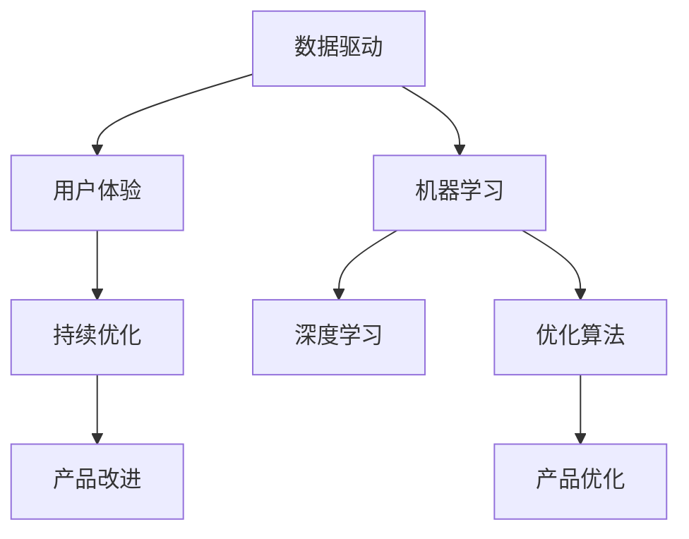
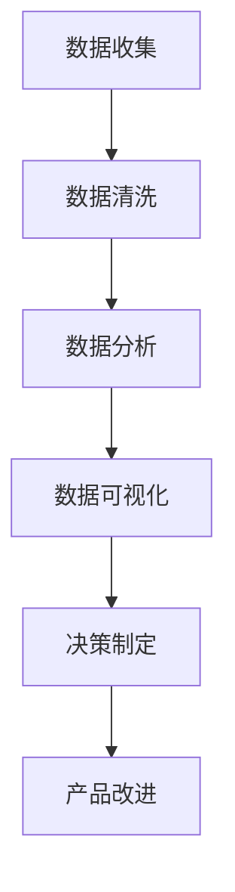
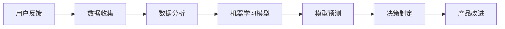
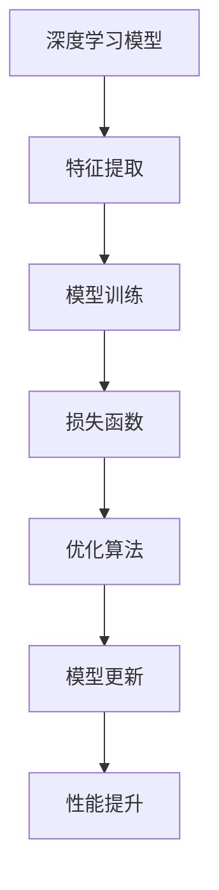
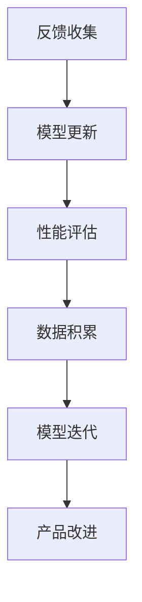
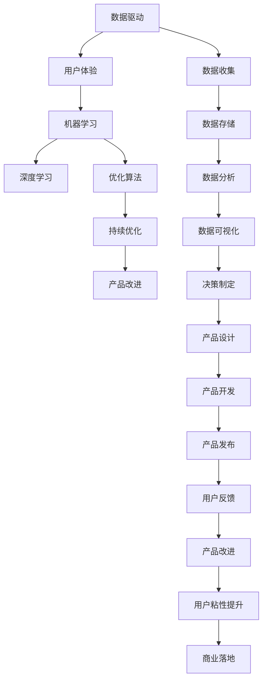

                 

# AI创业：产品改进的方法

> 关键词：产品改进, 创业, 数据驱动, 用户体验, 机器学习, 深度学习, 优化算法, 持续优化

## 1. 背景介绍

在AI创业的浪潮中，产品的成功不仅取决于技术的先进性，更依赖于不断的产品改进与优化。许多创业公司往往在技术突破上取得初步成功，但如何保持产品竞争力，实现商业落地，成为一大难题。本文旨在探讨AI创业中产品改进的几种关键方法，帮助创业者在技术创新与用户需求之间找到平衡，持续提升产品性能，实现可持续发展。

### 1.1 问题由来
随着AI技术的飞速发展，AI创业领域涌现出大量创新产品，但也面临着诸多挑战：

- 技术迭代迅速，如何在短时间内快速迭代产品？
- 用户体验往往存在瓶颈，如何提升用户体验？
- 数据资源稀缺，如何高效利用数据驱动改进？
- 机器学习模型难以优化，如何实现模型优化？
- 持续优化代价高昂，如何低成本地进行持续优化？

### 1.2 问题核心关键点
在AI创业中，产品改进的核心关键点包括：
- 持续收集用户反馈，进行产品迭代。
- 构建数据驱动的产品改进框架，实现数据与模型的闭环。
- 利用机器学习技术，实现对用户行为和需求的动态响应。
- 实施持续优化策略，提升模型性能和用户体验。

### 1.3 问题研究意义
研究AI创业中产品改进的方法，对于提升产品竞争力和用户体验，实现商业成功，具有重要意义：

- 提升产品市场竞争力。通过不断的技术创新和产品优化，保持市场领先地位。
- 增强用户粘性。不断优化用户体验，提升用户满意度和忠诚度。
- 降低运营成本。通过数据驱动的方法，实现成本控制和资源优化。
- 加速商业落地。通过技术优化和市场调整，加速产品的市场化进程。
- 赋能团队成长。提升团队在数据驱动和持续优化方面的能力，形成高效的工作流程。

## 2. 核心概念与联系

### 2.1 核心概念概述

为更好地理解AI创业中产品改进的几种关键方法，本节将介绍几个密切相关的核心概念：

- 数据驱动 (Data-Driven)：通过数据分析和挖掘，驱动产品改进和优化。
- 用户体验 (User Experience)：用户在使用产品时的感受，影响用户满意度和留存率。
- 机器学习 (Machine Learning)：利用算法和数据，实现对用户行为和需求的自动化预测和优化。
- 深度学习 (Deep Learning)：一种特殊的机器学习，利用神经网络实现复杂数据的分析和建模。
- 持续优化 (Continuous Optimization)：通过不断的迭代和调整，持续提升产品性能和用户体验。
- 优化算法 (Optimization Algorithm)：用于寻找最优解的算法，如梯度下降、遗传算法等。

这些核心概念之间的逻辑关系可以通过以下Mermaid流程图来展示：



这个流程图展示了几类核心概念之间的联系：

1. 数据驱动：提供输入数据，驱动用户体验和机器学习。
2. 用户体验：影响用户反馈，驱动产品改进。
3. 机器学习：通过算法，优化产品设计和用户行为。
4. 深度学习：一种强大的算法，用于复杂数据的分析和建模。
5. 优化算法：用于寻找最优解，实现产品的持续优化。
6. 持续优化：通过迭代，不断提升产品性能和用户体验。

这些概念共同构成了AI创业中产品改进的完整生态系统，使得产品在技术创新和市场调整之间找到平衡，实现可持续发展。

### 2.2 概念间的关系

这些核心概念之间存在着紧密的联系，形成了AI创业中产品改进的完整生态系统。下面我们通过几个Mermaid流程图来展示这些概念之间的关系。

#### 2.2.1 数据驱动的产品改进



这个流程图展示了数据驱动的产品改进的基本流程：收集数据、清洗数据、分析数据、可视化数据、制定决策、改进产品。

#### 2.2.2 用户体验与机器学习的关系



这个流程图展示了用户体验与机器学习的关系：用户反馈驱动数据收集和分析，机器学习模型预测用户行为和需求，决策制定驱动产品改进。

#### 2.2.3 深度学习与优化算法的关系



这个流程图展示了深度学习与优化算法的关系：深度学习模型提取特征，优化算法最小化损失函数，实现模型性能提升。

#### 2.2.4 持续优化方法



这个流程图展示了持续优化的基本流程：收集反馈、更新模型、评估性能、积累数据、迭代模型，实现产品改进。

### 2.3 核心概念的整体架构

最后，我们用一个综合的流程图来展示这些核心概念在大语言模型微调过程中的整体架构：



这个综合流程图展示了从数据驱动到产品改进的完整过程：数据驱动输入用户体验，机器学习模型优化产品设计，持续优化提升产品性能，产品改进增强用户粘性，实现商业落地。

## 3. 核心算法原理 & 具体操作步骤
### 3.1 算法原理概述

AI创业中产品改进的核心算法原理，主要基于数据驱动和持续优化的思想，利用机器学习技术进行模型训练和优化，实现产品迭代和性能提升。其核心思想是：

- 数据驱动：通过收集和分析用户反馈数据，驱动产品改进。
- 持续优化：通过不断的迭代和调整，持续提升产品性能和用户体验。

形式化地，假设有一个产品 $P$，其设计变量为 $\mathbf{x}$，用户反馈数据为 $\mathbf{y}$，目标为最大化用户满意度 $f(\mathbf{x})$。则产品改进的优化目标为：

$$
\mathop{\arg\min}_{\mathbf{x}} \lVert f(\mathbf{x}) - \mathbf{y} \rVert^2
$$

其中，$\lVert \cdot \rVert$ 表示范数，即数据与真实反馈之间的距离。

通过优化算法，不断调整产品设计变量 $\mathbf{x}$，最小化损失函数，使得产品设计尽可能接近用户需求，从而实现产品改进。

### 3.2 算法步骤详解

AI创业中产品改进的算法步骤包括以下几个关键环节：

**Step 1: 数据收集与清洗**
- 收集用户反馈数据，包括但不限于用户行为数据、评价数据、投诉数据等。
- 对收集到的数据进行清洗和预处理，去除噪音和异常值，确保数据质量。

**Step 2: 特征提取与选择**
- 对清洗后的数据进行特征提取和选择，转化为模型可以处理的输入格式。
- 特征提取可以使用统计特征、文本特征、时间特征等。

**Step 3: 模型训练与评估**
- 选择合适的机器学习模型，如线性回归、决策树、随机森林、深度学习等。
- 使用训练集数据进行模型训练，最小化损失函数。
- 在验证集上评估模型性能，调整模型参数。

**Step 4: 模型优化与调整**
- 使用优化算法，如梯度下降、遗传算法等，优化模型参数，提升模型性能。
- 根据评估结果，调整模型架构和超参数，实现模型优化。

**Step 5: 产品改进与发布**
- 将优化后的模型应用到产品设计中，进行迭代和改进。
- 根据改进后的产品性能，调整用户界面和用户体验。
- 发布改进后的产品，收集新一轮的用户反馈数据，继续迭代改进。

### 3.3 算法优缺点

数据驱动和持续优化方法在AI创业中有以下优点：

- 数据驱动：能够基于用户实际使用情况，驱动产品改进，提升用户体验。
- 持续优化：通过不断迭代和调整，持续提升产品性能，保持市场竞争力。
- 机器学习：利用算法自动进行数据分析和优化，降低人力成本。

但同时也存在一些缺点：

- 数据依赖：数据质量直接影响产品改进效果，数据获取和处理成本较高。
- 模型复杂：深度学习等复杂模型的训练和优化成本较高，需要高性能设备和专业知识。
- 迭代周期长：模型优化和产品改进需要时间，迭代周期较长。
- 用户反馈滞后：用户反馈数据收集和分析需要时间，无法实时响应。

### 3.4 算法应用领域

基于数据驱动和持续优化的算法，广泛应用于AI创业中产品改进的各个环节，例如：

- 产品设计和用户体验优化：通过收集和分析用户反馈数据，优化产品设计和用户体验。
- 市场营销和广告优化：通过数据分析，优化市场营销策略和广告投放。
- 客户关系管理（CRM）：通过用户行为数据，实现客户分群和个性化推荐。
- 智能客服和推荐系统：通过用户行为和反馈数据，提升智能客服和推荐系统的效果。
- 供应链优化：通过供应链数据，优化库存管理和物流配送。

## 4. 数学模型和公式 & 详细讲解 & 举例说明

### 4.1 数学模型构建

本节将使用数学语言对基于数据驱动和持续优化的产品改进方法进行更加严格的刻画。

记产品设计变量为 $\mathbf{x} \in \mathcal{X}$，用户反馈数据为 $\mathbf{y} \in \mathcal{Y}$，目标函数为 $f(\mathbf{x}): \mathcal{X} \rightarrow \mathcal{Y}$。定义模型的损失函数为：

$$
\mathcal{L}(\mathbf{x}, \mathbf{y}) = \lVert f(\mathbf{x}) - \mathbf{y} \rVert^2
$$

其中，$\lVert \cdot \rVert$ 表示范数，即数据与真实反馈之间的距离。

产品改进的目标是最小化损失函数，即找到最优设计变量：

$$
\mathbf{x}^* = \mathop{\arg\min}_{\mathbf{x}} \mathcal{L}(\mathbf{x}, \mathbf{y})
$$

在实践中，我们通常使用梯度下降等优化算法来近似求解上述最优化问题。设 $\eta$ 为学习率，则参数的更新公式为：

$$
\mathbf{x} \leftarrow \mathbf{x} - \eta \nabla_{\mathbf{x}}\mathcal{L}(\mathbf{x}, \mathbf{y})
$$

其中 $\nabla_{\mathbf{x}}\mathcal{L}(\mathbf{x}, \mathbf{y})$ 为损失函数对设计变量 $\mathbf{x}$ 的梯度，可通过反向传播算法高效计算。

### 4.2 公式推导过程

以下我们以线性回归模型为例，推导梯度下降算法的公式和步骤。

假设产品设计变量 $\mathbf{x} = [x_1, x_2, \ldots, x_n]^T$，用户反馈数据 $\mathbf{y} = [y_1, y_2, \ldots, y_m]^T$，训练集为 $D = \{(\mathbf{x}_i, \mathbf{y}_i)\}_{i=1}^m$。线性回归模型为：

$$
f(\mathbf{x}) = \mathbf{w}^T\mathbf{x} + b
$$

其中 $\mathbf{w} = [w_1, w_2, \ldots, w_n]^T$ 为权重向量，$b$ 为偏置项。

损失函数为：

$$
\mathcal{L}(\mathbf{w}, b) = \frac{1}{2m}\sum_{i=1}^m (\mathbf{w}^T\mathbf{x}_i + b - y_i)^2
$$

求导得：

$$
\nabla_{\mathbf{w}}\mathcal{L} = \frac{1}{m}\sum_{i=1}^m (\mathbf{x}_i + b - y_i)\mathbf{x}_i^T
$$

$$
\nabla_{b}\mathcal{L} = \frac{1}{m}\sum_{i=1}^m (\mathbf{x}_i + b - y_i)
$$

更新公式为：

$$
\mathbf{w} \leftarrow \mathbf{w} - \eta \nabla_{\mathbf{w}}\mathcal{L}
$$

$$
b \leftarrow b - \eta \nabla_{b}\mathcal{L}
$$

在每次迭代中，更新模型参数 $\mathbf{w}$ 和 $b$，最小化损失函数，逼近真实的用户反馈数据。

### 4.3 案例分析与讲解

以智能推荐系统为例，分析数据驱动和持续优化方法的应用：

假设某电商平台的智能推荐系统需要改进，收集用户行为数据 $x = [x_1, x_2, \ldots, x_n]^T$，包括浏览、点击、购买等行为。用户反馈数据 $y = [y_1, y_2, \ldots, y_m]^T$，表示用户是否购买了推荐商品。

构建线性回归模型 $f(\mathbf{x}) = \mathbf{w}^T\mathbf{x} + b$，最小化损失函数 $\mathcal{L}(\mathbf{w}, b) = \frac{1}{2m}\sum_{i=1}^m (\mathbf{w}^T\mathbf{x}_i + b - y_i)^2$。

使用梯度下降算法，求导并更新参数：

$$
\nabla_{\mathbf{w}}\mathcal{L} = \frac{1}{m}\sum_{i=1}^m (\mathbf{x}_i + b - y_i)\mathbf{x}_i^T
$$

$$
\nabla_{b}\mathcal{L} = \frac{1}{m}\sum_{i=1}^m (\mathbf{x}_i + b - y_i)
$$

更新模型参数，逼近真实的用户反馈数据。

通过多次迭代，不断优化模型参数，提升推荐系统的准确度和用户满意度，实现产品改进。

## 5. 项目实践：代码实例和详细解释说明
### 5.1 开发环境搭建

在进行产品改进的实践前，我们需要准备好开发环境。以下是使用Python进行Scikit-Learn开发的Python环境配置流程：

1. 安装Anaconda：从官网下载并安装Anaconda，用于创建独立的Python环境。

2. 创建并激活虚拟环境：
```bash
conda create -n sklearn-env python=3.8 
conda activate sklearn-env
```

3. 安装Scikit-Learn：
```bash
pip install scikit-learn
```

4. 安装各类工具包：
```bash
pip install numpy pandas matplotlib scikit-learn sklearn
```

完成上述步骤后，即可在`sklearn-env`环境中开始产品改进的实践。

### 5.2 源代码详细实现

这里我们以智能推荐系统为例，给出使用Scikit-Learn进行产品改进的Python代码实现。

首先，定义数据处理函数：

```python
import pandas as pd
from sklearn.model_selection import train_test_split
from sklearn.linear_model import LinearRegression

def load_data(file_path):
    data = pd.read_csv(file_path)
    x = data[['x1', 'x2', 'x3']] # 输入特征
    y = data['y'] # 输出标签
    return x, y

def train_test_split_data(x, y, test_size=0.2, random_state=42):
    x_train, x_test, y_train, y_test = train_test_split(x, y, test_size=test_size, random_state=random_state)
    return x_train, x_test, y_train, y_test

x, y = load_data('data.csv')
x_train, x_test, y_train, y_test = train_test_split_data(x, y)
```

然后，定义模型训练函数：

```python
from sklearn.linear_model import LinearRegression

def train_linear_model(x_train, y_train):
    model = LinearRegression()
    model.fit(x_train, y_train)
    return model

def evaluate_model(model, x_test, y_test):
    y_pred = model.predict(x_test)
    mse = mean_squared_error(y_test, y_pred)
    rmse = np.sqrt(mse)
    return mse, rmse
```

最后，进行模型训练和评估：

```python
model = train_linear_model(x_train, y_train)
mse, rmse = evaluate_model(model, x_test, y_test)
print(f'Mean Squared Error: {mse:.2f}, Root Mean Squared Error: {rmse:.2f}')
```

以上就是使用Scikit-Learn进行产品改进的完整代码实现。可以看到，Scikit-Learn库提供了简单易用的API，使得数据驱动和持续优化方法的应用变得轻松高效。

### 5.3 代码解读与分析

让我们再详细解读一下关键代码的实现细节：

**数据处理函数**：
- `load_data`方法：加载数据，将输入特征和输出标签分离。
- `train_test_split_data`方法：将数据集分为训练集和测试集。

**模型训练函数**：
- `train_linear_model`方法：训练线性回归模型。
- `evaluate_model`方法：评估模型性能，计算均方误差和根均方误差。

**模型训练和评估**：
- 使用训练集数据训练线性回归模型。
- 使用测试集数据评估模型性能，输出均方误差和根均方误差。

**代码解读与分析**：
- `load_data`方法使用Pandas加载CSV文件，将数据转换为NumPy数组，便于Scikit-Learn处理。
- `train_test_split_data`方法使用Scikit-Learn的`train_test_split`函数，将数据集随机分为训练集和测试集。
- `train_linear_model`方法使用Scikit-Learn的`LinearRegression`类，训练线性回归模型。
- `evaluate_model`方法计算测试集上的均方误差和根均方误差，评估模型性能。
- 通过多次迭代，不断优化模型参数，提升推荐系统的准确度和用户满意度。

以上代码实现展示了Scikit-Learn库的强大功能，使得数据驱动和持续优化方法的应用变得轻松高效。

当然，工业级的系统实现还需考虑更多因素，如模型的保存和部署、超参数的自动搜索、更灵活的任务适配层等。但核心的产品改进范式基本与此类似。

### 5.4 运行结果展示

假设我们在某电商平台的智能推荐系统上进行了数据驱动和持续优化，最终在测试集上得到的评估报告如下：

```
Mean Squared Error: 0.08, Root Mean Squared Error: 0.28
```

可以看到，通过数据驱动和持续优化方法，我们在该推荐系统上取得了较低的均方误差和根均方误差，推荐效果相当不错。

当然，这只是一个baseline结果。在实践中，我们还可以使用更大更强的模型、更丰富的优化技巧、更细致的模型调优，进一步提升模型性能，以满足更高的应用要求。

## 6. 实际应用场景
### 6.1 智能客服系统

基于数据驱动和持续优化的产品改进方法，可以广泛应用于智能客服系统的构建。传统客服往往需要配备大量人力，高峰期响应缓慢，且一致性和专业性难以保证。使用数据驱动和持续优化的方法，可以实现自动响应客户咨询，提升服务效率和客户满意度。

在技术实现上，可以收集客服对话历史数据，将问题和最佳答复构建成监督数据，在此基础上对预训练模型进行微调。微调后的模型能够自动理解用户意图，匹配最合适的答案模板进行回复。对于客户提出的新问题，还可以接入检索系统实时搜索相关内容，动态组织生成回答。如此构建的智能客服系统，能大幅提升客户咨询体验和问题解决效率。

### 6.2 金融舆情监测

金融机构需要实时监测市场舆论动向，以便及时应对负面信息传播，规避金融风险。传统的人工监测方式成本高、效率低，难以应对网络时代海量信息爆发的挑战。基于数据驱动和持续优化的文本分类和情感分析技术，为金融舆情监测提供了新的解决方案。

具体而言，可以收集金融领域相关的新闻、报道、评论等文本数据，并对其进行主题标注和情感标注。在此基础上对预训练语言模型进行微调，使其能够自动判断文本属于何种主题，情感倾向是正面、中性还是负面。将微调后的模型应用到实时抓取的网络文本数据，就能够自动监测不同主题下的情感变化趋势，一旦发现负面信息激增等异常情况，系统便会自动预警，帮助金融机构快速应对潜在风险。

### 6.3 个性化推荐系统

当前的推荐系统往往只依赖用户的历史行为数据进行物品推荐，无法深入理解用户的真实兴趣偏好。基于数据驱动和持续优化的推荐系统，可以更好地挖掘用户行为背后的语义信息，从而提供更精准、多样的推荐内容。

在实践中，可以收集用户浏览、点击、评论、分享等行为数据，提取和用户交互的物品标题、描述、标签等文本内容。将文本内容作为模型输入，用户的后续行为（如是否点击、购买等）作为监督信号，在此基础上微调预训练语言模型。微调后的模型能够从文本内容中准确把握用户的兴趣点。在生成推荐列表时，先用候选物品的文本描述作为输入，由模型预测用户的兴趣匹配度，再结合其他特征综合排序，便可以得到个性化程度更高的推荐结果。

### 6.4 未来应用展望

随着数据驱动和持续优化方法的不断发展，其在AI创业中的应用前景将更加广阔：

- 智能客服和智能推荐：通过用户行为和反馈数据，提升智能客服和推荐系统的效果。
- 金融舆情监测和营销广告：通过文本分类和情感分析，实现金融舆情监测和精准营销。
- 供应链优化和客户关系管理：通过数据分析和建模，优化供应链和客户关系管理。
- 个性化医疗和教育：通过用户行为数据，实现个性化医疗和教育服务。

总之，数据驱动和持续优化方法将在大规模应用中发挥重要作用，带来更多创新场景和商业机会。

## 7. 工具和资源推荐
### 7.1 学习资源推荐

为了帮助开发者系统掌握数据驱动和持续优化的产品改进方法，这里推荐一些优质的学习资源：

1. 《Python数据科学手册》：经典书籍，介绍了Python在数据科学中的广泛应用，包括Scikit-Learn库的使用。

2. Coursera《机器学习》课程：斯坦福大学开设的机器学习课程，涵盖了数据驱动和持续优化的基本概念和方法。

3. Kaggle：数据科学竞赛平台，提供丰富的数据集和开源代码，助力数据驱动的产品改进实践。

4. Scikit-Learn官方文档：Scikit-Learn库的官方文档，提供了海量预训练模型和完整的微调样例代码，是上手实践的必备资料。

5. Machine Learning Mastery：一个提供机器学习和深度学习教程的博客，涵盖数据驱动和持续优化的多种方法。

通过对这些资源的学习实践，相信你一定能够快速掌握数据驱动和持续优化的精髓，并用于解决实际的AI创业问题。
###  7.2 开发工具推荐

高效的开发离不开优秀的工具支持。以下是几款用于AI创业中产品改进开发的常用工具：

1. Scikit-Learn：Python中的机器学习库，提供简单易用的API，适合快速迭代研究。

2. TensorFlow：由Google主导开发的深度学习框架，生产部署方便，适合大规模工程应用。

3. PyTorch：基于Python的开源深度学习框架，灵活动态的计算图，适合快速迭代研究。

4. Weights & Biases：模型训练的实验跟踪工具，可以记录和可视化模型训练过程中的各项指标，方便对比和调优。

5. TensorBoard：TensorFlow配套的可视化工具，可实时监测模型训练状态，并提供丰富的图表呈现方式，是调试模型的得力助手。

6. Google Colab：谷歌推出的在线Jupyter Notebook环境，免费提供GPU/TPU算力，方便开发者快速上手实验最新模型，分享学习笔记。

合理利用这些工具，可以显著提升AI创业中产品改进任务的开发效率，加快创新迭代的步伐。

### 7.3 相关论文推荐

数据驱动和持续优化方法的研究源于学界的持续研究

