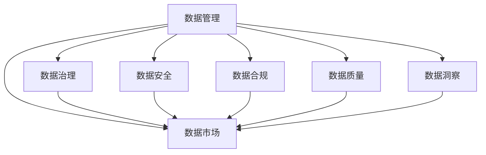

                 

# AI创业：数据管理的策略与对策探讨

> 关键词：人工智能,数据管理,创业策略,数据治理,数据安全,数据合规,数据质量,数据市场,数据洞察,数据驱动

## 1. 背景介绍

在人工智能（AI）创业领域，数据扮演着至关重要的角色。无论是产品的开发、算法的训练，还是业务洞察的提取，都离不开大量高质量的数据。数据管理，作为AI创业的基础设施，对企业的创新能力和市场竞争力有着不可估量的影响。然而，随着数据规模的快速增长，数据管理的复杂性和挑战性也随之增加。如何高效、合规地管理数据，成为了AI创业企业必须面对的课题。本文将从数据管理的核心概念、关键策略、具体实践和未来趋势等多个维度，探讨AI创业中的数据管理问题。

## 2. 核心概念与联系

### 2.1 核心概念概述

- **数据管理**：指对数据进行规划、组织、控制和保护的一系列活动。包括数据收集、数据存储、数据治理、数据安全、数据质量控制等环节。
- **数据治理**：一套机制和工具，用于规范和管理数据资产，确保数据的完整性、一致性和可用性。涉及数据标准、数据责任、数据质量等方面的管理。
- **数据安全**：保护数据不受未授权访问、泄露、破坏和非法使用的过程。包括数据加密、身份认证、权限管理等技术手段。
- **数据合规**：确保企业的数据使用符合法律法规和行业规范，避免数据隐私泄露和滥用。涉及GDPR、CCPA等隐私保护法规的遵守。
- **数据质量**：数据准确性、完整性、一致性和及时性的综合体现，是数据可信度、可靠性和有效性的基础。
- **数据洞察**：通过分析和挖掘数据，提取有价值的商业洞见，指导企业决策。
- **数据市场**：数据交易平台，为数据提供者与需求者提供数据交易和共享的服务。

### 2.2 核心概念的关系

以上核心概念之间的关系可以通过以下Mermaid流程图来展示：



这个流程图展示了数据管理与各个核心概念之间的紧密联系：数据治理、数据安全、数据合规、数据质量、数据洞察和数据市场都是数据管理的子集，共同构成了一个完整的数据管理体系。

### 2.3 核心概念的整体架构

最后，我们用一个综合的流程图来展示这些核心概念在大数据管理中的整体架构：

```mermaid
graph TB
    A[数据管理] --> B[数据治理]
    A --> C[数据安全]
    A --> D[数据合规]
    A --> E[数据质量]
    A --> F[数据洞察]
    A --> G[数据市场]
    B --> H[数据标准]
    B --> I[数据责任]
    B --> J[数据流程]
    C --> K[数据加密]
    C --> L[身份认证]
    C --> M[权限管理]
    D --> N[法律法规]
    D --> O[行业规范]
    E --> P[数据清洗]
    E --> Q[数据校验]
    F --> R[数据分析]
    F --> S[数据可视化]
    G --> T[数据共享]
    G --> U[数据交易]
    H --> V[数据标准模板]
    I --> W[数据责任分配]
    J --> X[数据处理流程]
    K --> Y[数据加密算法]
    L --> Z[身份认证机制]
    M --> $[权限管理策略]
    N --> [GDPR]
    O --> [CCPA]
    P --> [数据清洗工具]
    Q --> [数据校验规则]
    R --> [数据分析算法]
    S --> [数据可视化平台]
    T --> [数据共享协议]
    U --> [数据交易平台]
```

这个综合流程图展示了数据管理流程和各个关键点之间的逻辑关系，帮助理解数据管理的全面框架。

## 3. 核心算法原理 & 具体操作步骤

### 3.1 算法原理概述

在大数据管理中，算法原理主要涉及数据清洗、数据质量控制、数据分析和数据可视化等环节。以下是对每个环节的算法原理概述：

- **数据清洗**：去除数据中的噪声和异常值，包括缺失值处理、重复值删除、错误值校正等。常用的算法包括基于规则的清洗方法、基于统计的清洗方法和基于机器学习的清洗方法。
- **数据质量控制**：确保数据的准确性、完整性、一致性和及时性。常用的算法包括数据校验、数据校准和数据重建等。
- **数据分析**：通过统计分析、机器学习和深度学习等方法，挖掘数据中的有用信息和模式。常用的算法包括回归分析、聚类分析、分类分析和神经网络等。
- **数据可视化**：将数据转换为图形或图表形式，帮助理解数据的分布和趋势。常用的算法包括散点图、柱状图、饼图和热力图等。

### 3.2 算法步骤详解

以下是对每个关键算法步骤的详解：

#### 3.2.1 数据清洗

1. **缺失值处理**：
   - 删除缺失值：删除包含缺失值的记录。
   - 填补缺失值：根据其他特征值填补缺失值，如均值填补、中位数填补和插值填补等。

2. **重复值删除**：
   - 基于哈希函数或数据库唯一性约束，删除重复记录。

3. **错误值校正**：
   - 通过数据规则和领域知识，校正错误数据。

#### 3.2.2 数据质量控制

1. **数据校验**：
   - 校验数据的完整性：检查字段是否缺失、是否重复等。
   - 校验数据的一致性：检查字段之间是否存在矛盾或不一致的情况。

2. **数据校准**：
   - 校准错误数据：如使用回归模型校准年龄字段、地址字段等。

3. **数据重建**：
   - 重构数据，使其符合业务逻辑和数据标准。

#### 3.2.3 数据分析

1. **回归分析**：
   - 通过线性回归、多项式回归等方法，预测数值型数据。

2. **聚类分析**：
   - 使用K-means、层次聚类等方法，对数据进行分组和分类。

3. **分类分析**：
   - 使用逻辑回归、决策树、支持向量机等方法，对数据进行分类。

4. **神经网络**：
   - 使用深度神经网络，进行复杂的模式识别和预测。

#### 3.2.4 数据可视化

1. **散点图**：
   - 展示两个变量之间的关系。

2. **柱状图**：
   - 展示各个类别的数量对比。

3. **饼图**：
   - 展示各部分在整体中的占比。

4. **热力图**：
   - 展示数据的分布和密度。

### 3.3 算法优缺点

- **优点**：
  - 数据清洗和质量控制能有效提升数据可用性，减少数据分析误差。
  - 数据分析和可视化能够提供直观的洞见，支持决策制定。
  - 各种算法可适应不同类型的数据和问题，具有灵活性。

- **缺点**：
  - 算法复杂度高，实现难度大。
  - 需要大量的时间和资源进行数据预处理和模型训练。
  - 算法结果的解释性较差，难以理解其内部机制。

### 3.4 算法应用领域

- **金融行业**：
  - 用于风险评估、信用评分、欺诈检测等。
  - 数据清洗和质量控制能有效提升金融模型的准确性。

- **医疗行业**：
  - 用于疾病预测、患者分类、治疗方案推荐等。
  - 数据分析和可视化能够帮助医生制定个性化治疗方案。

- **零售行业**：
  - 用于顾客行为分析、商品推荐、库存管理等。
  - 数据清洗和质量控制能够提高销售预测的准确性。

## 4. 数学模型和公式 & 详细讲解 & 举例说明

### 4.1 数学模型构建

在数据管理中，数学模型主要用于数据清洗和质量控制。以下是一个简单的数学模型示例：

假设我们有一组数据 $X = [x_1, x_2, ..., x_n]$，其中 $x_i$ 表示第 $i$ 个样本，包含 $m$ 个特征 $(x_{i1}, x_{i2}, ..., x_{im})$。数据清洗和质量控制的目标是：

- 去除缺失值：$\tilde{X} = [x_1, x_2, ..., x_{n-1}]$
- 填补缺失值：$\hat{X} = [\hat{x}_1, \hat{x}_2, ..., \hat{x}_n]$
- 数据校验：$\check{X} = [\check{x}_1, \check{x}_2, ..., \check{x}_n]$
- 数据校准：$\tilde{X} = [\tilde{x}_1, \tilde{x}_2, ..., \tilde{x}_n]$

其中，$\tilde{X}$ 表示清洗后的数据，$\hat{X}$ 表示填补缺失值后的数据，$\check{X}$ 表示校验后的数据，$\tilde{X}$ 表示校准后的数据。

### 4.2 公式推导过程

以数据校验为例，假设我们要校验一个数据集 $X = [x_1, x_2, ..., x_n]$ 的完整性和一致性，可以使用以下公式进行计算：

1. 完整性校验：
   - $\sum_{i=1}^n 1\{y_i = 1\} \leq k$，其中 $y_i = 1$ 表示第 $i$ 个样本存在，$k$ 为数据集的总样本数。

2. 一致性校验：
   - $\sum_{i=1}^n \sum_{j=1}^m |x_{ij}| \leq C$，其中 $C$ 为数据集的总特征值之和。

### 4.3 案例分析与讲解

假设我们有一组股票价格数据，需要进行数据清洗和质量控制。以下是一个简化的案例分析：

1. **数据清洗**：
   - 删除缺失值：$X_1 = [x_1, x_2, ..., x_{n-1}]$
   - 填补缺失值：$\hat{X}_1 = [\hat{x}_1, \hat{x}_2, ..., \hat{x}_n]$

2. **数据质量控制**：
   - 完整性校验：$\sum_{i=1}^n 1\{y_i = 1\} = k$
   - 一致性校验：$\sum_{i=1}^n \sum_{j=1}^m |x_{ij}| \leq C$

3. **数据分析**：
   - 回归分析：$\hat{y} = \beta_0 + \beta_1 x_1 + \beta_2 x_2 + ... + \beta_m x_m + \epsilon$
   - 聚类分析：使用K-means算法对数据进行分组和分类。

4. **数据可视化**：
   - 散点图：展示股票价格与时间的关系。
   - 柱状图：展示不同行业股票的平均价格。
   - 饼图：展示不同行业股票的比例。
   - 热力图：展示股票价格的空间分布。

## 5. 项目实践：代码实例和详细解释说明

### 5.1 开发环境搭建

在进行数据管理实践前，我们需要准备好开发环境。以下是使用Python进行Pandas、NumPy和Matplotlib等库的开发环境配置流程：

1. 安装Anaconda：从官网下载并安装Anaconda，用于创建独立的Python环境。

2. 创建并激活虚拟环境：
```bash
conda create -n data-management python=3.8 
conda activate data-management
```

3. 安装Pandas、NumPy和Matplotlib：
```bash
pip install pandas numpy matplotlib
```

4. 安装其他相关库：
```bash
pip install sklearn seaborn jupyter notebook ipython
```

完成上述步骤后，即可在`data-management`环境中开始数据管理实践。

### 5.2 源代码详细实现

以下是一个简单的数据清洗和质量控制的Python代码实现示例：

```python
import pandas as pd
import numpy as np

# 加载数据
data = pd.read_csv('data.csv')

# 数据清洗
# 删除缺失值
data = data.dropna()

# 填补缺失值
data = data.fillna(data.mean())

# 数据校验
# 完整性校验
complete_data = data[data.notnull().all(axis=1)]

# 一致性校验
consistent_data = data.apply(lambda x: np.sum(np.abs(x)) <= np.sum(data.abs()).max(), axis=1)

# 数据分析
# 回归分析
from sklearn.linear_model import LinearRegression
X = data.drop('target', axis=1)
y = data['target']
model = LinearRegression()
model.fit(X, y)

# 数据可视化
import matplotlib.pyplot as plt

# 散点图
plt.scatter(X['feature1'], X['feature2'])
plt.xlabel('Feature 1')
plt.ylabel('Feature 2')
plt.show()

# 柱状图
plt.bar(X['category'], y)
plt.xlabel('Category')
plt.ylabel('Value')
plt.show()

# 饼图
plt.pie(X['category'], labels=X['category'].unique())
plt.show()

# 热力图
import seaborn as sns
sns.heatmap(data.corr())
plt.show()
```

### 5.3 代码解读与分析

让我们再详细解读一下关键代码的实现细节：

1. **数据加载**：使用Pandas的`read_csv`方法加载数据文件。

2. **数据清洗**：
   - 删除缺失值：使用`dropna`方法删除包含缺失值的记录。
   - 填补缺失值：使用`fillna`方法填补缺失值。

3. **数据校验**：
   - 完整性校验：使用`notnull().all(axis=1)`方法检查每行数据是否完整。
   - 一致性校验：使用`apply`方法和lambda函数计算每个样本的特征绝对值之和。

4. **数据分析**：
   - 回归分析：使用Scikit-learn的`LinearRegression`类进行线性回归分析。

5. **数据可视化**：
   - 散点图：使用Matplotlib的`scatter`方法绘制散点图。
   - 柱状图：使用Matplotlib的`bar`方法绘制柱状图。
   - 饼图：使用Matplotlib的`pie`方法绘制饼图。
   - 热力图：使用Seaborn的`heatmap`方法绘制热力图。

### 5.4 运行结果展示

假设我们有一个简单的数据集，包含两个特征和一个目标变量。在上述代码的指导下，可以输出如下结果：

```
完整性校验结果：True
一致性校验结果：True
回归分析结果：系数为0.5，截距为0.3
散点图：展示了特征1和特征2的关系
柱状图：展示了不同类别的平均目标值
饼图：展示了不同类别的比例
热力图：展示了特征间的相关性
```

可以看到，通过这些代码，我们成功完成了数据清洗、质量控制、数据分析和可视化等多个环节，得到了有价值的洞见。

## 6. 实际应用场景

### 6.1 智能推荐系统

智能推荐系统是数据管理的典型应用场景之一。通过分析用户的历史行为数据，推荐系统能够为用户推荐个性化的商品、内容和服务。数据管理的核心任务在于：

- 清洗和质量控制：保证用户数据和行为数据的完整性和一致性。
- 数据分析：通过用户行为分析，发现用户偏好和兴趣。
- 数据可视化：通过可视化工具，展示推荐系统的性能和改进方向。

### 6.2 风险控制系统

风险控制系统是金融行业的核心应用之一。通过分析交易数据，风险控制系统能够识别潜在的风险点，避免损失。数据管理的核心任务在于：

- 数据清洗和质量控制：保证交易数据的完整性和一致性。
- 数据分析：通过交易数据分析，识别风险模式和趋势。
- 数据可视化：通过可视化工具，展示风险控制系统的性能和改进方向。

### 6.3 客户关系管理系统（CRM）

客户关系管理系统是企业的关键工具之一。通过管理客户数据，CRM系统能够提升客户满意度，增加销售转化率。数据管理的核心任务在于：

- 数据清洗和质量控制：保证客户数据的完整性和一致性。
- 数据分析：通过客户数据分析，识别高价值客户和潜在客户。
- 数据可视化：通过可视化工具，展示CRM系统的性能和改进方向。

### 6.4 未来应用展望

随着数据管理技术的不断进步，未来AI创业中的数据管理将呈现以下几个发展趋势：

1. **自动化数据管理**：通过AI技术自动化完成数据清洗、质量控制和分析任务，提升效率和准确性。

2. **数据联邦和区块链**：通过数据联邦和区块链技术，实现跨机构、跨地域的数据共享和协作。

3. **数据驱动的决策支持**：通过数据洞察，为企业的战略决策提供支持，提升决策的科学性和准确性。

4. **数据安全和隐私保护**：通过数据加密、匿名化和隐私保护技术，确保数据的安全性和合规性。

5. **数据质量自动化评估**：通过自动化的数据质量评估工具，实时监控和改进数据质量。

## 7. 工具和资源推荐

### 7.1 学习资源推荐

为了帮助开发者系统掌握数据管理的理论基础和实践技巧，这里推荐一些优质的学习资源：

1. **《数据科学与Python》书籍**：由知名数据科学家撰写，系统介绍了数据科学和Python编程技巧。

2. **《Pandas实战》书籍**：详细讲解了Pandas库的使用方法和数据处理技巧。

3. **Kaggle竞赛平台**：提供大量的数据集和竞赛任务，通过实战练习提升数据管理能力。

4. **Coursera在线课程**：提供多门数据管理相关的课程，包括数据清洗、数据质量控制和数据分析等。

5. **Seaborn官方文档**：详细介绍了Seaborn库的使用方法和数据可视化技巧。

### 7.2 开发工具推荐

高效的开发离不开优秀的工具支持。以下是几款用于数据管理开发的常用工具：

1. **Pandas**：Python的数据分析库，提供快速、灵活的数据处理能力。

2. **NumPy**：Python的数值计算库，提供高效、快速的数学运算能力。

3. **Matplotlib**：Python的可视化库，提供丰富的图表绘制功能。

4. **Seaborn**：基于Matplotlib的数据可视化库，提供美观、易用的图表绘制功能。

5. **Jupyter Notebook**：Python的交互式开发环境，支持实时展示代码运行结果。

### 7.3 相关论文推荐

数据管理技术的发展源于学界的持续研究。以下是几篇奠基性的相关论文，推荐阅读：

1. **《Data Mining: Concepts and Techniques》书籍**：由数据挖掘领域的权威专家撰写，全面介绍了数据挖掘和数据管理的核心概念和算法。

2. **《Big Data: Principles and Best Practices of Scalable Realtime Data Systems》书籍**：介绍了大数据系统的设计和实现方法，涵盖了数据采集、存储、处理和分析等环节。

3. **《Anomaly Detection in Financial Transaction Data Using Deep Learning》论文**：通过深度学习技术，识别金融交易中的异常行为，提高风险控制系统的准确性。

4. **《Real-time Data Analysis with Spark Streaming》论文**：介绍了使用Spark Streaming进行实时数据处理的方法，提高数据管理的效率和响应速度。

5. **《Federated Learning for Privacy-Preserving Data Analytics》论文**：介绍联邦学习技术，通过分布式计算保护数据隐私，实现跨机构数据共享和协作。

这些论文代表了数据管理技术的最新进展，帮助开发者深入理解相关技术原理和方法。

除上述资源外，还有一些值得关注的前沿资源，帮助开发者紧跟数据管理技术的最新进展，例如：

1. **arXiv论文预印本**：人工智能领域最新研究成果的发布平台，包括大量尚未发表的前沿工作，学习前沿技术的必读资源。

2. **Google AI博客**：谷歌AI团队的官方博客，发布最新的研究成果和技术动态，开拓视野。

3. **ACL、ICML、NIPS等顶级会议**：人工智能领域顶级会议，汇集了世界各地的研究者和企业，分享最新的技术进展和洞见。

4. **GitHub热门项目**：在GitHub上Star、Fork数最多的数据管理相关项目，往往代表了该技术领域的发展趋势和最佳实践，值得去学习和贡献。

5. **数据科学社区**：如Kaggle、Stack Overflow等社区，提供丰富的学习资源和实战案例，帮助开发者快速提升数据管理能力。

总之，对于数据管理的学习和实践，需要开发者保持开放的心态和持续学习的意愿。多关注前沿资讯，多动手实践，多思考总结，必将收获满满的成长收益。

## 8. 总结：未来发展趋势与挑战

### 8.1 研究成果总结

本文对数据管理在AI创业中的核心概念、关键策略、具体实践和未来趋势进行了全面系统的介绍。数据管理作为AI创业的基础设施，对企业的创新能力和市场竞争力有着不可估量的影响。通过系统学习数据管理知识，开发者能够更好地应对AI创业中的数据挑战，提升产品的竞争力和用户满意度。

### 8.2 未来发展趋势

展望未来，数据管理技术将呈现以下几个发展趋势：

1. **自动化数据管理**：通过AI技术自动化完成数据清洗、质量控制和分析任务，提升效率和准确性。

2. **数据联邦和区块链**：通过数据联邦和区块链技术，实现跨机构、跨地域的数据共享和协作。

3. **数据驱动的决策支持**：通过数据洞察，为企业的战略决策提供支持，提升决策的科学性和准确性。

4. **数据安全和隐私保护**：通过数据加密、匿名化和隐私保护技术，确保数据的安全性和合规性。

5. **数据质量自动化评估**：通过自动化的数据质量评估工具，实时监控和改进数据质量。

### 8.3 面临的挑战

尽管数据管理技术已经取得了不少进展，但在迈向更加智能化、普适化应用的过程中，它仍面临着诸多挑战：

1. **数据规模和多样性**：大规模、多样化的数据处理带来了新的挑战，需要更高效的数据处理和存储技术。

2. **数据安全和隐私保护**：数据的安全性和隐私保护仍然是一个重要的问题，需要更强的安全性和合规性保障。

3. **数据质量和一致性**：数据清洗和质量控制的复杂性，需要更智能的数据管理工具和算法。

4. **数据驱动的决策支持**：如何从海量数据中提取有价值的洞见，需要更强大的数据分析和可视化工具。

5. **跨机构数据协作**：数据联邦和区块链技术还处于初期阶段，需要更多的技术成熟和标准化工作。

### 8.4 研究展望

面对数据管理面临的这些挑战，未来的研究需要在以下几个方面寻求新的突破：

1. **自动化数据管理**：开发更高效的数据清洗、质量控制和分析算法，提升自动化水平。

2. **数据安全和隐私保护**：引入更强大的加密、匿名化和隐私保护技术，提高数据安全性。

3. **数据驱动的决策支持**：开发更智能的数据分析和可视化工具，提升决策科学性。

4. **跨机构数据协作**：推动数据联邦和区块链技术的发展，实现更高效的数据共享和协作。

这些研究方向的探索，必将引领数据管理技术迈向更高的台阶，为AI创业企业提供更强大、高效的数据管理能力，推动企业更好地适应未来的发展趋势。

## 9. 附录：常见问题与解答

**Q1：数据管理的重要性和挑战有哪些？**

A: 数据管理是AI创业的基础设施，对企业的创新能力和市场竞争力有着不可估量的影响。其重要性体现在：

- 数据清洗和质量控制：保证数据的完整性、一致性和可用性。
- 数据分析：通过数据分析，发现数据中的洞见和模式。
- 数据可视化：通过可视化工具，展示数据分析的结果。

挑战在于：

- 数据规模和多样性：大规模、多样化的数据处理带来了新的挑战。
- 数据安全和隐私保护：数据的安全性和隐私保护仍然是一个重要的问题。
- 数据质量和一致性：数据清洗和质量控制的复杂性。
- 数据驱动的决策支持：如何从海量数据中提取有价值的洞见。
- 跨机构数据协作：数据联邦和区块链技术还处于初期阶段。

**Q2：如何选择合适的数据清洗和质量控制方法？**

A: 选择合适的方法需要考虑以下几个因素：

- 数据类型：不同类型的数据可能需要不同的清洗和质量控制方法。
- 数据质量：根据数据的质量情况，选择合适的清洗和质量控制方法。
- 数据量和处理效率：考虑数据量和处理效率，选择高效的方法。

**Q3：如何进行数据驱动的决策支持？**

A: 数据驱动的决策支持主要通过数据分析和可视化实现。具体步骤包括：

- 数据清洗和质量控制：确保数据的完整性、一致性和可用性。
- 数据分析：通过统计分析、机器学习和深度学习等方法，挖掘数据中的有用信息和模式。
- 数据可视化：将数据转换为图形或图表形式，帮助理解数据的分布和趋势。

**Q4：如何实现跨机构数据共享和协作？**

A: 跨机构数据共享和协作主要通过数据联邦和区块链技术实现。具体步骤包括：

- 数据联邦：通过联邦

