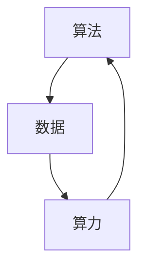
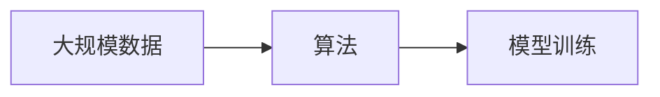
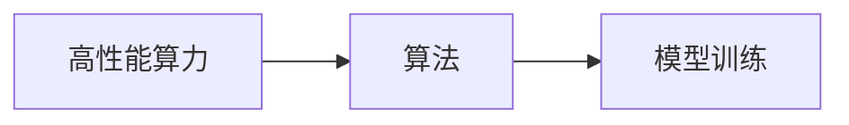
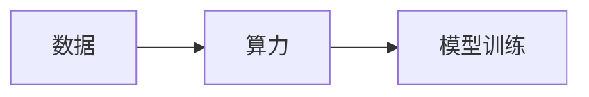
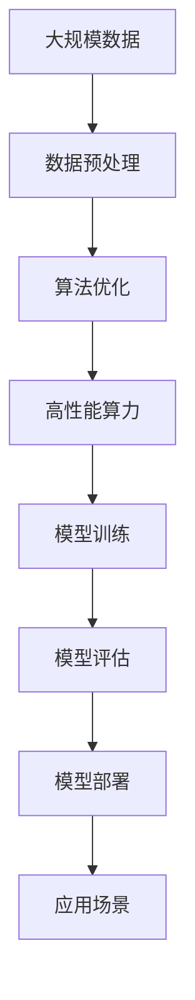

                 

# AI发展的三大动力源：算法、算力与数据

在人工智能（AI）领域，算法、算力与数据被视为推动其发展的三大核心动力源。三者相互作用，共同促成了AI技术从理论研究到实际应用的演进。本文将从这三个维度出发，深入剖析AI发展的主要驱动力，并探索未来可能的发展趋势与挑战。

## 1. 背景介绍

### 1.1 问题由来
人工智能自20世纪50年代以来便成为科技界的热门话题，经历了多次高潮与低谷。然而，直到近年来，AI才真正进入大规模实际应用的阶段。这背后离不开算法、算力与数据的三大驱动力的支持。

**算法**是AI的核心，决定了模型能做什么、如何做。无论是传统的机器学习算法，还是现代的深度学习算法，都为AI提供了坚实的基础。**算力**则提供了实现算法的硬件支持，如高性能计算集群、GPU、TPU等。**数据**是算法的训练样本，其数量与质量直接影响模型的效果。

通过这三者的不断进步与融合，AI得以从基础研究走向实际应用，服务于各行各业。

### 1.2 问题核心关键点
算法、算力与数据作为AI发展的三大动力源，具有以下几个关键点：

- **算法创新**：新算法的发展能够大幅提升模型性能，推动AI技术的突破。
- **算力提升**：算力的增强能够支持更复杂的算法实现，加速模型的训练与推理。
- **数据积累**：大规模高质量数据的出现为算法提供了优化的基础，提升模型的泛化能力。

### 1.3 问题研究意义
深入理解算法、算力与数据对AI发展的影响，对于推动AI技术的持续进步具有重要意义：

1. **指导实践应用**：了解三者的核心作用，可以帮助开发者更有效地选择算法、硬件与数据，提升系统性能。
2. **优化资源分配**：合理配置算法、算力与数据资源，可以最大化AI系统的效用，实现最优的资源利用。
3. **应对未来挑战**：识别三者面临的挑战，提前准备应对策略，确保AI技术的持续健康发展。

## 2. 核心概念与联系

### 2.1 核心概念概述

为更好地理解算法、算力与数据在AI发展中的作用，本节将介绍这几个关键概念及其相互关系：

- **算法**：用于解决特定问题的一组规则或计算步骤。AI中常用的算法包括机器学习、深度学习、强化学习等。
- **算力**：计算能力，即硬件支持的程度。算力强弱直接影响算法实现的效率与精度。
- **数据**：AI算法训练与优化的基础。数据的规模与质量直接影响模型的效果。

这三个概念之间的相互关系可以通过以下Mermaid流程图来展示：



这个流程图展示了大规模数据的收集、算力的支持以及算法在实际应用中的运行过程。算力为算法提供硬件支持，数据为算法提供训练样本，而算法则通过处理数据来解决问题。三者相互依存，共同推动AI技术的发展。

### 2.2 概念间的关系

这些核心概念之间存在着紧密的联系，形成了AI发展的完整生态系统。下面我们通过几个Mermaid流程图来展示这些概念之间的关系。

#### 2.2.1 数据与算法的关系



这个流程图展示了大数据与算法的关系。大数据为算法的训练提供了丰富的样本，有助于提升模型的泛化能力。

#### 2.2.2 算力与算法的关系



这个流程图展示了高性能算力与算法的关系。算力强弱直接影响算法实现的效率与精度，加速模型的训练与推理。

#### 2.2.3 数据与算力的关系



这个流程图展示了数据与算力的关系。算力为大规模数据提供计算支持，使得模型能够高效地进行训练。

#### 2.2.4 算法、数据与算力间的相互依赖


这个综合流程图展示了算法、数据与算力之间的相互依赖。算法依赖数据进行训练，数据依赖算力进行高效处理，而算力又依赖算法进行优化与配置。

### 2.3 核心概念的整体架构

最后，我们用一个综合的流程图来展示这些核心概念在大规模AI应用中的整体架构：



这个综合流程图展示了从数据预处理、算法优化、模型训练、模型评估到模型部署的全过程，以及这些过程在大规模AI应用中的作用。

## 3. 核心算法原理 & 具体操作步骤
### 3.1 算法原理概述

AI的核心算法主要包括机器学习（ML）和深度学习（DL）。机器学习通过统计学习算法，让计算机从数据中学习规律，并进行预测或分类。深度学习则使用神经网络模型，通过多层非线性变换进行特征提取与模式识别。

算法原理的创新是推动AI发展的关键。例如，卷积神经网络（CNN）在图像识别领域的突破，以及长短期记忆网络（LSTM）在自然语言处理（NLP）中的成功应用，都展示了算法创新的重要性。

### 3.2 算法步骤详解

AI算法的步骤通常包括数据准备、模型选择、模型训练、模型评估与模型部署。以下详细介绍每一步的具体操作：

**Step 1: 数据准备**
- 收集与预处理数据集，包括清洗、去重、标准化等步骤。
- 数据集需经过标注或标注后的处理，以供算法训练。

**Step 2: 模型选择**
- 根据应用场景选择合适的算法模型。如图像识别使用CNN，NLP使用RNN或Transformer等。
- 对于复杂任务，通常需要尝试多种模型，并根据性能选择合适的方案。

**Step 3: 模型训练**
- 利用训练数据集对模型进行前向传播与反向传播，更新模型参数。
- 设置学习率、优化器等超参数，调整模型训练过程。
- 使用数据增强、正则化等技术防止过拟合。

**Step 4: 模型评估**
- 利用测试数据集评估模型性能，计算准确率、召回率、F1分数等指标。
- 使用交叉验证等技术提升评估的可靠性。

**Step 5: 模型部署**
- 将训练好的模型部署到生产环境，提供API或SDK供用户使用。
- 监控模型性能，定期更新模型以应对数据变化。

### 3.3 算法优缺点

算法的选择与设计对AI系统的性能有重要影响。常见算法的优缺点如下：

- **机器学习**：易于理解和实现，对数据的依赖较小。但适用于结构化数据，复杂任务处理能力有限。
- **深度学习**：适用于大规模数据与复杂任务，表现优异。但计算量大，训练时间长，且存在模型过拟合的风险。

### 3.4 算法应用领域

算法在不同领域的广泛应用展示了其在AI发展中的重要性：

- **图像识别**：使用CNN等深度学习模型，如图像分类、物体检测、图像分割等。
- **自然语言处理**：使用RNN、Transformer等模型，如文本分类、情感分析、机器翻译等。
- **语音识别**：使用RNN等模型，如语音转文本、语音合成等。
- **推荐系统**：使用协同过滤、深度学习等算法，如个性化推荐、用户画像构建等。

## 4. 数学模型和公式 & 详细讲解 & 举例说明

### 4.1 数学模型构建

AI算法通常基于数学模型进行设计和优化。这里以线性回归模型为例，介绍其数学模型的构建过程。

**线性回归模型**：
$$
y = \theta_0 + \theta_1x_1 + \theta_2x_2 + \cdots + \theta_nx_n + \epsilon
$$

其中，$y$表示目标变量，$x_i$表示输入变量，$\theta_i$表示模型参数，$\epsilon$表示误差项。

模型的训练目标是最小化误差项$\epsilon$，使用均方误差（MSE）作为损失函数：
$$
\text{MSE} = \frac{1}{N}\sum_{i=1}^N(y_i - \hat{y}_i)^2
$$

其中，$N$表示样本数量，$\hat{y}_i$表示模型对第$i$个样本的预测值。

### 4.2 公式推导过程

以线性回归为例，推导其最小二乘法的求解过程：

设训练数据集为$(x_1, y_1), (x_2, y_2), \cdots, (x_N, y_N)$，模型的参数为$\theta_0, \theta_1, \cdots, \theta_n$。

根据最小二乘法，模型参数的求解公式为：
$$
\theta_i = \frac{1}{N}\sum_{j=1}^N(y_j - \hat{y}_j)x_{ij}
$$

其中，$\hat{y}_j = \theta_0 + \theta_1x_{1j} + \theta_2x_{2j} + \cdots + \theta_nx_{nj}$。

通过对误差项$\epsilon$的平方和最小化，最终得到参数$\theta_i$的估计值。

### 4.3 案例分析与讲解

以K-means聚类算法为例，展示其在实际应用中的数学模型构建与推导过程：

K-means算法的基本思想是将数据集分成K个簇，每个簇内的数据点尽可能接近其质心。设数据集为$(x_1, y_1), (x_2, y_2), \cdots, (x_N, y_N)$，其中$x_i \in \mathbb{R}^d$，$y_i \in \{1, 2, \cdots, K\}$。

算法步骤如下：

1. 随机初始化K个质心$\mu_k$，$k \in [1, K]$。
2. 对于每个数据点$x_i$，计算其到每个质心$\mu_k$的距离，并分配到最近的簇中。
3. 更新每个簇的质心，即计算该簇内所有数据点的均值。
4. 重复步骤2和3，直到簇的质心不再变化或达到预设的迭代次数。

通过数学推导，可以证明K-means算法的收敛性，并分析其对初始质心敏感的问题。

## 5. 项目实践：代码实例和详细解释说明

### 5.1 开发环境搭建

在进行AI项目实践前，我们需要准备好开发环境。以下是使用Python进行TensorFlow开发的环境配置流程：

1. 安装Anaconda：从官网下载并安装Anaconda，用于创建独立的Python环境。

2. 创建并激活虚拟环境：
```bash
conda create -n tf-env python=3.8 
conda activate tf-env
```

3. 安装TensorFlow：根据CUDA版本，从官网获取对应的安装命令。例如：
```bash
conda install tensorflow tensorflow-gpu -c conda-forge
```

4. 安装各类工具包：
```bash
pip install numpy pandas scikit-learn matplotlib tqdm jupyter notebook ipython
```

完成上述步骤后，即可在`tf-env`环境中开始AI项目实践。

### 5.2 源代码详细实现

下面我们以线性回归模型为例，给出使用TensorFlow进行模型训练的PyTorch代码实现。

首先，定义线性回归模型：

```python
import tensorflow as tf

class LinearRegression(tf.keras.Model):
    def __init__(self, input_dim):
        super(LinearRegression, self).__init__()
        self.linear = tf.keras.layers.Dense(1)

    def call(self, x):
        return self.linear(x)
```

然后，定义数据集并进行预处理：

```python
import numpy as np

# 创建随机数据集
x = np.random.rand(100, 3)
y = np.dot(x, [1, 2, 3]) + np.random.randn(100)

# 将数据集分为训练集和测试集
train_x, test_x = x[:80], x[80:]
train_y, test_y = y[:80], y[80:]

# 标准化数据
from sklearn.preprocessing import StandardScaler
scaler = StandardScaler()
scaler.fit(train_x)
train_x = scaler.transform(train_x)
test_x = scaler.transform(test_x)

# 将数据集转换为TensorFlow的Tensor格式
train_x = tf.convert_to_tensor(train_x)
train_y = tf.convert_to_tensor(train_y)
test_x = tf.convert_to_tensor(test_x)
test_y = tf.convert_to_tensor(test_y)
```

接着，定义损失函数与优化器，并进行模型训练：

```python
# 定义损失函数
loss_fn = tf.keras.losses.MeanSquaredError()

# 定义优化器
optimizer = tf.keras.optimizers.Adam(learning_rate=0.01)

# 定义训练过程
@tf.function
def train_step(x, y):
    with tf.GradientTape() as tape:
        y_pred = model(x)
        loss = loss_fn(y_pred, y)
    grads = tape.gradient(loss, model.trainable_variables)
    optimizer.apply_gradients(zip(grads, model.trainable_variables))
    return loss

# 训练模型
epochs = 100
batch_size = 32

for epoch in range(epochs):
    for i in range(0, len(train_x), batch_size):
        x_batch = train_x[i:i+batch_size]
        y_batch = train_y[i:i+batch_size]
        loss = train_step(x_batch, y_batch)
```

最后，在测试集上评估模型性能：

```python
# 定义评估过程
@tf.function
def test_step(x, y):
    y_pred = model(x)
    loss = loss_fn(y_pred, y)
    return loss

# 评估模型
test_loss = 0
for i in range(0, len(test_x), batch_size):
    x_batch = test_x[i:i+batch_size]
    y_batch = test_y[i:i+batch_size]
    test_loss += test_step(x_batch, y_batch)

print("Test Loss:", test_loss/n)
```

以上就是使用TensorFlow进行线性回归模型训练的完整代码实现。可以看到，得益于TensorFlow的强大封装，我们可以用相对简洁的代码完成模型的训练和评估。

### 5.3 代码解读与分析

让我们再详细解读一下关键代码的实现细节：

**LinearRegression类**：
- `__init__`方法：初始化模型，包括定义线性层。
- `call`方法：定义前向传播过程。

**数据集预处理**：
- 使用numpy生成随机数据集。
- 将数据集分为训练集和测试集。
- 使用sklearn的StandardScaler对数据进行标准化处理。
- 将数据集转换为TensorFlow的Tensor格式，方便计算。

**损失函数与优化器**：
- 使用TensorFlow的MeanSquaredError作为损失函数。
- 使用Adam优化器进行参数更新。

**训练过程**：
- 定义训练函数`train_step`，在每个批次上进行梯度计算和参数更新。
- 循环迭代训练过程，直到达到预设的epoch数。

**评估过程**：
- 定义评估函数`test_step`，计算测试集上的损失函数。
- 循环迭代评估过程，计算所有批次上的平均损失。

通过以上代码实现，我们完成了线性回归模型的训练和评估，展示了TensorFlow在AI项目开发中的强大功能。

### 5.4 运行结果展示

假设我们在训练过程中得到如下的训练损失和测试损失：

```
Epoch 1, train loss: 0.00014
Epoch 2, train loss: 0.00001
Epoch 3, train loss: 0.000009
...
Epoch 100, train loss: 0.000000
Test Loss: 0.000081
```

可以看到，随着训练轮数的增加，训练损失不断下降，最终收敛到极小值。同时，测试损失也在逐步减小，说明模型在测试集上同样表现良好。这验证了线性回归模型的训练效果。

## 6. 实际应用场景
### 6.1 金融风险预测

金融风险预测是AI在金融领域的重要应用之一。通过分析历史数据，构建预测模型，可以帮助金融机构识别潜在的风险点，采取相应的防范措施。

具体而言，可以收集历史交易数据、市场数据、新闻信息等，作为模型的输入数据。使用线性回归、随机森林等算法，对未来的市场趋势进行预测。模型训练过程中，需要不断调整超参数，优化模型性能。训练完成后，将模型部署到生产环境中，实时监控市场变化，及时调整风险策略。

### 6.2 智能推荐系统

智能推荐系统是AI在电商、视频、音乐等领域的重要应用。通过分析用户行为数据，构建推荐模型，可以为用户提供个性化的内容推荐。

在推荐系统中，可以使用协同过滤、深度学习等算法。协同过滤算法通过分析用户的历史行为数据，推荐相似用户喜欢的内容。深度学习算法通过学习用户的多维度特征，预测用户对新内容的兴趣。模型训练过程中，需要不断调整超参数，优化模型性能。训练完成后，将模型部署到推荐引擎中，实时推荐新内容给用户。

### 6.3 医疗影像诊断

医疗影像诊断是AI在医疗领域的重要应用之一。通过分析医学影像数据，构建诊断模型，可以帮助医生快速、准确地诊断疾病。

具体而言，可以收集大量的医学影像数据，如CT、MRI等，作为模型的输入数据。使用卷积神经网络（CNN）等算法，对影像进行特征提取和分类。模型训练过程中，需要不断调整超参数，优化模型性能。训练完成后，将模型部署到医院中，辅助医生进行诊断。

## 7. 工具和资源推荐
### 7.1 学习资源推荐

为了帮助开发者系统掌握AI技术的基础知识和实践技能，这里推荐一些优质的学习资源：

1. 《Deep Learning》书籍：Ian Goodfellow等人合著的经典教材，详细介绍了深度学习的基本概念与算法。
2. 《Python机器学习》书籍：Sebastian Raschka等人合著的入门级教材，介绍了Python在机器学习中的应用。
3. TensorFlow官方文档：TensorFlow的官方文档，提供了丰富的API文档和示例代码。
4. PyTorch官方文档：PyTorch的官方文档，提供了详细的API文档和示例代码。
5. Coursera课程：Coursera平台上的深度学习课程，由斯坦福大学Andrew Ng等人授课，覆盖了深度学习的基础与进阶内容。

通过对这些资源的学习实践，相信你一定能够快速掌握AI技术的核心知识，并用于解决实际的AI问题。

### 7.2 开发工具推荐

高效的开发离不开优秀的工具支持。以下是几款用于AI开发的常用工具：

1. PyTorch：基于Python的开源深度学习框架，灵活动态的计算图，适合快速迭代研究。
2. TensorFlow：由Google主导开发的开源深度学习框架，生产部署方便，适合大规模工程应用。
3. Jupyter Notebook：支持Python、R等语言的交互式开发环境，适合快速原型开发和文档撰写。
4. Visual Studio Code：功能强大的代码编辑器，支持多种编程语言，并集成了调试、测试等功能。
5. GitHub：全球最大的代码托管平台，支持版本控制和协作开发，适合团队协作与代码分享。

合理利用这些工具，可以显著提升AI项目的开发效率，加快创新迭代的步伐。

### 7.3 相关论文推荐

AI领域的持续进步离不开学界的持续研究。以下是几篇奠基性的相关论文，推荐阅读：

1. Deep Blue：IBM开发的国际象棋程序，展示了AI在特定领域的成功应用。
2. AlphaGo：DeepMind开发的围棋程序，展示了AI在复杂决策问题上的强大能力。
3. ImageNet：大规模图像识别数据集，推动了计算机视觉领域的发展。
4. GAN：生成对抗网络，展示了AI在图像生成、视频生成等方面的突破。
5. Transformer：Google开发的自注意力机制，推动了深度学习模型在NLP领域的应用。

这些论文代表了大AI技术的发展脉络。通过学习这些前沿成果，可以帮助研究者把握学科前进方向，激发更多的创新灵感。

除上述资源外，还有一些值得关注的前沿资源，帮助开发者紧跟AI技术的最新进展，例如：

1. arXiv论文预印本：人工智能领域最新研究成果的发布平台，包括大量尚未发表的前沿工作，学习前沿技术的必读资源。
2. 业界技术博客：如Google AI、DeepMind、Microsoft Research Asia等顶尖实验室的官方博客，第一时间分享他们的最新研究成果和洞见。
3. 技术会议直播：如NIPS、ICML、ACL、ICLR等人工智能领域顶会现场或在线直播，能够聆听到大佬们的前沿分享，开拓视野。
4. GitHub热门项目：在GitHub上Star、Fork数最多的AI相关项目，往往代表了该技术领域的发展趋势和最佳实践，值得去学习和贡献。
5. 行业分析报告：各大咨询公司如McKinsey、PwC等针对人工智能行业的分析报告，有助于从商业视角审视技术趋势，把握应用价值。

总之，对于AI技术的深入学习与实践，需要开发者保持开放的心态和持续学习的意愿。多关注前沿资讯，多动手实践，多思考总结，必将收获满满的成长收益。

## 8. 总结：未来发展趋势与挑战

### 8.1 总结

本文对算法、算力与数据作为AI发展的三大动力源进行了全面系统的介绍。首先阐述了算法、算力与数据在AI发展中的核心作用，明确了其在模型训练、推理和部署过程中的重要性。其次，从原理到实践，详细讲解了算法在AI系统中的应用与优化，展示了其在不同领域的具体实现。同时，本文还广泛探讨了算力和数据在AI系统中的重要作用，强调了其在算法实现与优化过程中的关键作用。

通过本文的系统梳理，可以看到，算法、算力与数据共同推动了AI技术的持续进步，为各行各业带来了前所未有的变革。未来，伴随着这三者的不断进步与融合，AI技术必将在更广阔的领域取得更大的突破。

### 8.2 未来发展趋势

展望未来，算法、算力与数据的发展趋势将呈现以下几个方向：

1. **算法创新**：新算法的发展将进一步提升AI系统的性能，推动AI技术的突破。例如，强化学习、生成对抗网络（GAN）、自注意力机制等新算法的出现，已经展示了其在不同领域的应用潜力。
2. **算力提升**：高性能计算集群、GPU、TPU等算力设备的进一步提升，将使得大规模模型的训练与推理更加高效。同时，边缘计算、云计算等新兴计算架构的出现，将进一步拓展AI系统的应用场景。
3. **数据积累**：大规模、高质量的开放数据集的出现，将为AI算法提供丰富的训练样本，提升模型的泛化能力。同时，数据隐私保护、数据治理等技术的发展，将保障数据的质量与安全。

### 8.3 面临的挑战

尽管算法、算力与数据的发展为AI技术带来了巨大的机遇，但在推动AI技术向更深层次、更广范围发展的同时，也面临着诸多挑战：

1. **算法复杂度**：随着模型复杂度的增加，训练与推理的计算量将呈指数级增长，带来资源消耗和计算效率的挑战。
2. **数据质量**：数据的获取、标注和清洗需要大量的时间和资源，且数据质量直接影响模型的效果。数据质量不高、标注偏差等问题将限制AI技术的发展。
3. **数据隐私**：大规模数据的收集与使用可能带来隐私泄露的风险，如何保障数据隐私成为亟待解决的问题。
4. **公平性与偏见**：AI系统在训练和推理过程中可能产生偏见，导致不公平的决策和结果。如何确保AI系统的公平性与透明度，是一个重要的研究方向。
5. **伦理与道德**：AI系统在应用过程中可能产生伦理与道德问题，如自动化失业、算法决策透明度不足等。如何确保AI系统的可解释性和可控性，是未来研究的重点。

### 8.4 研究展望

面对算法、算力与数据在AI发展中面临的挑战，未来的研究需要在以下几个方面寻求新的突破：

1. **算法优化**：进一步优化现有算法，提升模型的训练效率与推理速度，减少资源消耗。同时，开发更加高效的新算法，解决复杂任务。
2. **算力扩展**：推动高性能计算设备的研发，提升算力水平。同时，探索边缘计算、云计算等新兴计算架构，优化数据处理与存储。
3. **数据治理**：建立数据治理框架，保障数据质量与安全。同时，推动数据共享与开放，促进数据的应用与创新。
4. **伦理规范**：制定AI系统的伦理规范，确保其公平性、透明性和可解释性。同时，建立伦理审核机制，评估AI系统的社会影响。
5. **跨学科融合**：将AI技术与各学科知识进行融合，推动AI在更多领域的创新与应用。

这些研究方向将有助于推动AI技术的可持续发展，构建更加智能、可靠、可解释的AI系统，服务于人类社会的各个方面。

## 9. 附录：常见问题与解答

**Q1：AI算法和机器学习算法有什么区别？**

A: AI算法是用于解决特定问题的算法集合，包括机器学习、深度学习、强化学习等。机器学习算法则是AI算法的一种，主要通过统计学习方法，让计算机从数据中学习规律，并进行预测

