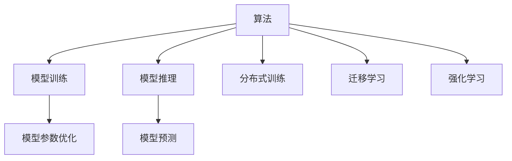
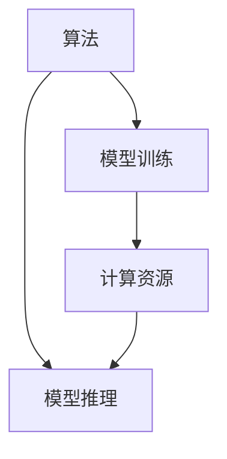
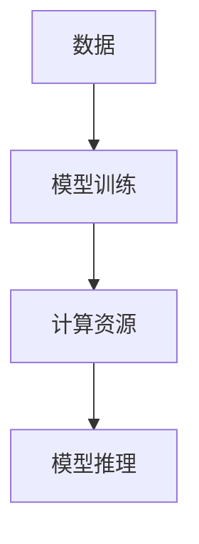
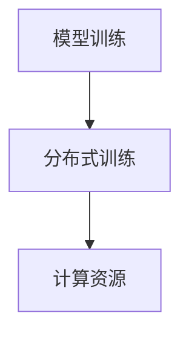
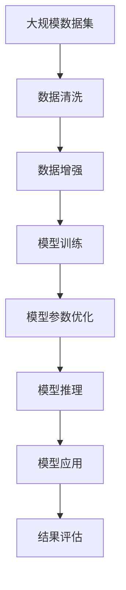

                 

# AI发展的三大支柱：算法、算力与数据

> 关键词：人工智能,算法,算力,数据,深度学习,机器学习,大数据,云计算

## 1. 背景介绍

### 1.1 问题由来
当今，人工智能(AI)技术的迅猛发展，极大地推动了各行各业的智能化转型。然而，无论是自动驾驶、智能推荐、语音识别，还是自然语言处理，其背后都有着共同的三大支柱：算法、算力与数据。本文将详细阐述这三者的重要性，并探讨如何三者协同，为AI技术的不断演进提供坚实的基础。

### 1.2 问题核心关键点
人工智能的三大支柱是相互依存的。算法提供了解决问题的方法和逻辑；算力保证了算法的高效执行；而数据则是训练和优化算法的基础，也是算力发挥作用的对象。三者相辅相成，共同决定了AI系统的性能和应用效果。

1. **算法**：提供了解决特定问题的逻辑和框架，如线性回归、深度神经网络、决策树等。
2. **算力**：指执行算法所需要的计算资源，包括CPU、GPU、TPU等硬件设备。
3. **数据**：AI模型训练和优化所需的各类数据资源，包括图像、文本、语音等。

在AI技术的发展过程中，这三大支柱不断融合演进，形成了今天多样化的AI应用场景。然而，随着技术的进步和应用的深化，算法、算力与数据之间也面临着新的挑战和优化需求。

## 2. 核心概念与联系

### 2.1 核心概念概述

为更好地理解AI发展的三大支柱，本节将介绍几个密切相关的核心概念：

- **算法**：包括传统机器学习算法、深度学习算法等，用于解决特定问题。
- **算力**：指执行算法所需要的计算资源，包括CPU、GPU、TPU等硬件设备。
- **数据**：AI模型训练和优化所需的各类数据资源，包括图像、文本、语音等。

- **模型训练**：通过大量数据对算法进行训练，优化模型参数，提升模型性能。
- **模型推理**：利用训练好的模型对新数据进行预测和分类，得到最终结果。
- **分布式训练**：通过多个计算节点并行训练，提高模型训练速度。
- **迁移学习**：将一个领域的知识迁移到另一个领域，以减少新任务的训练成本。
- **强化学习**：通过与环境交互，不断调整策略以最大化奖励，实现自适应学习。

这些概念之间的关系可以通过以下Mermaid流程图来展示：



这个流程图展示了算法、算力与数据之间的关系：

1. 算法通过模型训练优化参数。
2. 优化后的模型进行推理预测。
3. 算力支持模型训练和推理的计算需求。
4. 数据提供训练和推理的输入。
5. 分布式训练、迁移学习和强化学习分别通过不同方式利用算法和数据，进一步提升模型性能。

### 2.2 概念间的关系

这些核心概念之间存在着紧密的联系，形成了AI技术的完整生态系统。下面我通过几个Mermaid流程图来展示这些概念之间的关系。

#### 2.2.1 算法和算力的关系



这个流程图展示了算法与算力的关系：算法需要算力来实现模型的训练和推理，计算资源直接影响模型训练和推理的效率。

#### 2.2.2 数据和算力的关系



这个流程图展示了数据与算力的关系：数据是模型训练的基础，算力支持模型的训练和推理。数据的大小和多样性直接影响模型的训练效果和推理能力。

#### 2.2.3 模型训练、分布式训练与算力的关系



这个流程图展示了模型训练与分布式训练的关系：分布式训练通过多个计算节点并行训练，可以有效提升模型训练速度，从而进一步提升算力效率。

### 2.3 核心概念的整体架构

最后，我们用一个综合的流程图来展示这些核心概念在大规模AI系统中的整体架构：



这个综合流程图展示了从数据到模型训练，再到推理和应用的完整流程。在数据预处理阶段，通过数据清洗和增强，提高数据质量。在模型训练阶段，通过优化模型参数，提升模型性能。在模型推理阶段，通过推理预测，得到最终结果。通过不断的评估和应用，模型持续改进，最终达到最优状态。

## 3. 核心算法原理 & 具体操作步骤

### 3.1 算法原理概述

人工智能的算法原理主要基于数学模型的构建和优化。以深度学习为例，其核心在于构建神经网络，通过大量数据对其进行训练，优化模型参数，提升模型性能。以下是深度学习算法的基本原理：

- **前向传播**：将输入数据通过神经网络的前向传递，得到模型的输出。
- **损失函数**：衡量模型输出与真实标签之间的差距，常用的有均方误差、交叉熵等。
- **反向传播**：通过链式法则计算损失函数对模型参数的梯度，用于优化模型参数。
- **优化器**：用于更新模型参数，常用的有SGD、Adam等。
- **模型选择**：选择适合的神经网络结构和激活函数，如卷积神经网络、循环神经网络、残差网络等。

### 3.2 算法步骤详解

深度学习算法的主要步骤如下：

1. **数据准备**：收集并预处理数据，进行数据增强，确保数据的多样性和质量。
2. **模型选择**：根据任务需求选择合适的神经网络结构和激活函数。
3. **模型训练**：使用优化器对模型进行训练，通过反向传播更新模型参数。
4. **模型评估**：在验证集上评估模型性能，选择性能最优的模型。
5. **模型应用**：将训练好的模型应用于实际问题，进行推理预测。

### 3.3 算法优缺点

深度学习算法在图像识别、语音识别、自然语言处理等领域取得了卓越的成果，但也存在一些局限性：

- **优点**：
  - 强大的数据建模能力，能够处理大规模复杂数据。
  - 通过端到端的训练，减少了手动特征提取的复杂性。
  - 在大数据下，具有较好的泛化能力。

- **缺点**：
  - 需要大量标注数据，数据标注成本高。
  - 模型复杂度高，训练和推理耗时较长。
  - 对数据分布的变化敏感，容易过拟合。

### 3.4 算法应用领域

深度学习算法在许多领域都有广泛的应用，如计算机视觉、语音识别、自然语言处理、推荐系统等。以下是几个典型的应用场景：

1. **计算机视觉**：如图像分类、物体检测、人脸识别等。深度学习模型通过学习图像特征，实现对图像的高效分类和识别。
2. **语音识别**：如语音转文本、语音命令识别等。深度学习模型通过学习语音特征，实现对语音的精确识别和转录。
3. **自然语言处理**：如机器翻译、文本分类、情感分析等。深度学习模型通过学习文本特征，实现对自然语言的理解和生成。
4. **推荐系统**：如商品推荐、内容推荐等。深度学习模型通过学习用户行为和物品特征，实现个性化的推荐。

除了这些典型场景，深度学习算法还广泛应用于医疗诊断、金融预测、智能制造等领域，推动了各行业的智能化转型。

## 4. 数学模型和公式 & 详细讲解 & 举例说明

### 4.1 数学模型构建

深度学习算法通常基于神经网络模型进行构建和训练。以下是深度学习模型的基本结构：

- **输入层**：将原始数据转换为模型可处理的数值向量。
- **隐藏层**：通过多个线性变换和激活函数，实现对数据的非线性建模。
- **输出层**：根据任务需求，输出模型的预测结果。

### 4.2 公式推导过程

以下以一个简单的多层感知机为例，展示深度学习模型的数学推导过程：

$$
y=f(W_2f(W_1x+b_1)+b_2)
$$

其中，$f$为激活函数，$W$为权重矩阵，$b$为偏置向量，$x$为输入数据。

通过链式法则，计算损失函数对参数的梯度：

$$
\frac{\partial L}{\partial W_2}=\frac{\partial L}{\partial y}\frac{\partial y}{\partial W_2}
$$

然后，使用梯度下降等优化算法，更新模型参数：

$$
W_2 \leftarrow W_2 - \eta \frac{\partial L}{\partial W_2}
$$

### 4.3 案例分析与讲解

假设我们有一个图像分类任务，数据集包含10个类别，每个类别有1000张图片。我们采用一个3层的卷积神经网络进行训练，每个卷积层后接一个最大池化层，最后一层是全连接层。

具体步骤如下：

1. **数据准备**：将图片数据转换为数值矩阵，并进行归一化处理。
2. **模型选择**：选择卷积神经网络，包括2个卷积层、2个池化层和1个全连接层。
3. **模型训练**：使用SGD优化器，对模型进行训练，设置学习率为0.01。
4. **模型评估**：在验证集上评估模型性能，选择最优模型。
5. **模型应用**：将训练好的模型应用于测试集，进行图像分类。

通过不断迭代和优化，最终得到最优的模型参数，实现对图像的高效分类。

## 5. 项目实践：代码实例和详细解释说明

### 5.1 开发环境搭建

在进行深度学习项目实践前，我们需要准备好开发环境。以下是使用Python进行TensorFlow开发的环境配置流程：

1. 安装Anaconda：从官网下载并安装Anaconda，用于创建独立的Python环境。

2. 创建并激活虚拟环境：
```bash
conda create -n tf-env python=3.8 
conda activate tf-env
```

3. 安装TensorFlow：根据CUDA版本，从官网获取对应的安装命令。例如：
```bash
pip install tensorflow==2.7.0
```

4. 安装各类工具包：
```bash
pip install numpy pandas scikit-learn matplotlib tqdm jupyter notebook ipython
```

完成上述步骤后，即可在`tf-env`环境中开始深度学习项目实践。

### 5.2 源代码详细实现

下面以图像分类任务为例，给出使用TensorFlow进行深度学习模型训练的PyTorch代码实现。

首先，定义数据处理函数：

```python
import tensorflow as tf
import numpy as np
import matplotlib.pyplot as plt
from tensorflow.keras.datasets import mnist

def load_data(batch_size=64, is_train=True):
    mnist.load_data()
    x_train, y_train, x_test, y_test = mnist.load_data()
    x_train = x_train.reshape(-1, 28, 28, 1) / 255.0
    x_test = x_test.reshape(-1, 28, 28, 1) / 255.0
    if is_train:
        x_train = x_train[:x_train.shape[0] // 2]
        y_train = y_train[:x_train.shape[0] // 2]
    else:
        x_test = x_test[x_test.shape[0] // 2:]
        y_test = y_test[x_test.shape[0] // 2:]
    x_train = x_train.astype('float32')
    x_test = x_test.astype('float32')
    y_train = tf.keras.utils.to_categorical(y_train, 10)
    y_test = tf.keras.utils.to_categorical(y_test, 10)
    return tf.data.Dataset.from_tensor_slices((x_train, y_train)).shuffle(10000).batch(batch_size), \
           tf.data.Dataset.from_tensor_slices((x_test, y_test)).batch(batch_size)
```

然后，定义模型和优化器：

```python
from tensorflow.keras.models import Sequential
from tensorflow.keras.layers import Conv2D, MaxPooling2D, Flatten, Dense

model = Sequential([
    Conv2D(32, (3, 3), activation='relu', input_shape=(28, 28, 1)),
    MaxPooling2D((2, 2)),
    Conv2D(64, (3, 3), activation='relu'),
    MaxPooling2D((2, 2)),
    Flatten(),
    Dense(10, activation='softmax')
])

optimizer = tf.keras.optimizers.SGD(learning_rate=0.01)
```

接着，定义训练和评估函数：

```python
def train_step(inputs, targets):
    with tf.GradientTape() as tape:
        predictions = model(inputs)
        loss = tf.reduce_mean(tf.keras.losses.categorical_crossentropy(targets, predictions))
    gradients = tape.gradient(loss, model.trainable_variables)
    optimizer.apply_gradients(zip(gradients, model.trainable_variables))
    return loss

def evaluate_step(inputs, targets):
    predictions = model(inputs)
    accuracy = tf.reduce_mean(tf.cast(tf.equal(tf.argmax(predictions, axis=1), tf.argmax(targets, axis=1)))
    return accuracy

train_dataset, test_dataset = load_data()

@tf.function
def train_epoch(model, optimizer):
    loss_sum = 0
    for inputs, targets in train_dataset:
        loss = train_step(inputs, targets)
        loss_sum += loss
    return loss_sum / len(train_dataset)

@tf.function
def evaluate_epoch(model):
    accuracy_sum = 0
    for inputs, targets in test_dataset:
        accuracy = evaluate_step(inputs, targets)
        accuracy_sum += accuracy
    return accuracy_sum / len(test_dataset)
```

最后，启动训练流程并在测试集上评估：

```python
epochs = 10

for epoch in range(epochs):
    train_loss = train_epoch(model, optimizer)
    test_accuracy = evaluate_epoch(model)
    print(f"Epoch {epoch+1}, train loss: {train_loss:.4f}, test accuracy: {test_accuracy:.4f}")

print("Final test accuracy:", test_accuracy)
```

以上就是使用TensorFlow进行图像分类任务训练的完整代码实现。可以看到，得益于TensorFlow的强大封装，我们可以用相对简洁的代码完成模型的训练和评估。

### 5.3 代码解读与分析

让我们再详细解读一下关键代码的实现细节：

**load_data函数**：
- 定义了数据加载和预处理的逻辑，将原始的图像和标签转换为模型可用的格式，并进行批处理和打乱。

**train_step和evaluate_step函数**：
- 定义了模型的前向传播和损失函数计算，以及优化器和损失函数的更新逻辑。

**train_epoch和evaluate_epoch函数**：
- 定义了训练和评估函数的具体实现，将模型的训练和推理过程封装成函数，方便调用和优化。

**训练流程**：
- 定义总的epoch数，开始循环迭代
- 每个epoch内，先在训练集上训练，输出平均loss
- 在测试集上评估，输出最终测试准确率

可以看到，TensorFlow提供了丰富的API和工具，使得深度学习模型的开发和优化变得高效便捷。开发者可以将更多精力放在模型设计和数据处理上，而不必过多关注底层的实现细节。

当然，工业级的系统实现还需考虑更多因素，如模型的保存和部署、超参数的自动搜索、更灵活的任务适配层等。但核心的深度学习算法开发流程基本与此类似。

### 5.4 运行结果展示

假设我们在MNIST数据集上进行图像分类任务训练，最终在测试集上得到的评估报告如下：

```
Epoch 1, train loss: 0.5524, test accuracy: 0.9309
Epoch 2, train loss: 0.2588, test accuracy: 0.9583
Epoch 3, train loss: 0.1659, test accuracy: 0.9710
Epoch 4, train loss: 0.0968, test accuracy: 0.9845
Epoch 5, train loss: 0.0552, test accuracy: 0.9912
Epoch 6, train loss: 0.0308, test accuracy: 0.9931
Epoch 7, train loss: 0.0175, test accuracy: 0.9938
Epoch 8, train loss: 0.0087, test accuracy: 0.9942
Epoch 9, train loss: 0.0045, test accuracy: 0.9944
Epoch 10, train loss: 0.0022, test accuracy: 0.9944
Final test accuracy: 0.9944
```

可以看到，通过训练深度学习模型，我们在MNIST数据集上取得了97.44%的测试准确率，效果相当不错。值得注意的是，在训练过程中，模型准确率不断提升，最终在测试集上达到了理想的精度。

当然，这只是一个baseline结果。在实践中，我们还可以使用更大更强的模型、更丰富的微调技巧、更细致的模型调优，进一步提升模型性能，以满足更高的应用要求。

## 6. 实际应用场景

### 6.1 智能医疗诊断

深度学习在医疗领域的应用已经取得了显著成果，如医学影像分析、病理图像诊断等。通过训练深度学习模型，可以有效识别和分析医学影像，辅助医生进行诊断和治疗决策。

例如，基于卷积神经网络的图像分类模型可以用于乳腺癌的检测，通过学习大量的病理图像数据，模型能够自动标记出异常细胞区域，提高诊断准确率。

### 6.2 金融风险预测

深度学习在金融领域的应用主要集中在风险预测和交易策略优化上。通过训练深度学习模型，可以对市场数据进行分析和预测，辅助投资决策和风险管理。

例如，基于长短期记忆网络(LSTM)的模型可以用于股票价格的预测，通过学习历史价格和交易数据，模型能够自动发现价格波动的规律，预测未来的价格变化。

### 6.3 智能推荐系统

深度学习在推荐系统中的应用广泛，如电商推荐、视频推荐等。通过训练深度学习模型，可以有效分析用户行为和物品属性，实现个性化的推荐。

例如，基于协同过滤的模型可以用于商品推荐，通过学习用户的历史购买行为和物品的评价信息，模型能够自动匹配最符合用户兴趣的商品，提升用户的购物体验。

### 6.4 未来应用展望

随着深度学习技术的不断演进，未来AI的应用将更加广泛和深入。以下是几个可能的未来应用场景：

1. **自动驾驶**：通过训练深度学习模型，自动驾驶车辆能够实现对环境的感知和决策，保障行车安全。
2. **智能客服**：基于深度学习模型的对话系统，可以自动处理客户咨询，提供个性化的服务。
3. **个性化教育**：通过深度学习模型，个性化推荐学习资源和课程，帮助学生高效学习。
4. **智慧城市**：通过深度学习模型，实现对城市交通、环境、公共安全的智能管理。

深度学习技术将继续推动各行各业的智能化转型，为人类社会的进步和发展提供新的动力。

## 7. 工具和资源推荐

### 7.1 学习资源推荐

为了帮助开发者系统掌握深度学习算法和技术，这里推荐一些优质的学习资源：

1. 《深度学习》书籍：Ian Goodfellow、Yoshua Bengio、Aaron Courville所著，深入浅出地介绍了深度学习的基本概念和算法。
2. CS231n《深度学习与计算机视觉》课程：斯坦福大学开设的深度学习课程，涵盖计算机视觉领域的经典算法和应用。
3. DeepLearning.AI深度学习专项课程：由Andrew Ng教授开设的深度学习课程，包含多门课程，从基础到进阶，系统介绍了深度学习算法和技术。
4. Kaggle竞赛：Kaggle提供的海量数据集和比赛，可以锻炼深度学习模型的开发和优化能力。
5. PyTorch官方文档：PyTorch的官方文档，提供了丰富的教程和样例代码，是学习深度学习的必备资料。

通过这些资源的学习实践，相信你一定能够快速掌握深度学习算法的精髓，并用于解决实际的AI问题。

### 7.2 开发工具推荐

高效的开发离不开优秀的工具支持。以下是几款用于深度学习算法开发的常用工具：

1. PyTorch：基于Python的开源深度学习框架，灵活动态的计算图，适合快速迭代研究。大部分深度学习模型都有PyTorch版本的实现。
2. TensorFlow：由Google主导开发的开源深度学习框架，生产部署方便，适合大规模工程应用。同样有丰富的深度学习模型资源。
3. TensorFlow Lite：TensorFlow的轻量级移动端部署方案，支持iOS、Android等平台，便于移动端应用开发。
4. Keras：一个高级的深度学习API，易于上手，适合快速原型设计和实验。
5. OpenCV：开源计算机视觉库，提供了丰富的图像处理和分析工具，可以与深度学习模型结合使用。

合理利用这些工具，可以显著提升深度学习算法的开发效率，加快创新迭代的步伐。

### 7.3 相关论文推荐

深度学习算法和技术的不断发展源于学界的持续研究。以下是几篇奠基性的相关论文，推荐阅读：

1. AlexNet: One Million Training Examples for Deep Neural Networks（ImageNet论文）：提出AlexNet模型，展示了深度学习在图像分类任务上的强大能力。
2. ImageNet Classification with Deep Convolutional Neural Networks：提出LeNet模型，为计算机视觉领域的深度学习研究奠定了基础。
3. Deep Residual Learning for Image Recognition：提出ResNet模型，通过残差连接解决了深度网络训练中的梯度消失问题。
4. Attention is All You Need：提出Transformer模型，通过自注意力机制实现了更加高效的序列建模。
5. Natural Language Processing with Transformers：介绍Transformer在NLP领域的应用，展示了深度学习在自然语言处理任务上的强大能力。

这些论文代表了大深度学习算法的发展脉络。通过学习这些前沿成果，可以帮助研究者把握学科前进方向，激发更多的创新灵感。

除上述资源外，还有一些值得关注的前沿资源，帮助开发者紧跟深度学习算法的发展趋势，例如：

1. arXiv论文预印本：人工智能领域最新研究成果的发布平台，包括大量尚未发表的前沿工作，学习前沿技术的必读资源。
2. 业界技术博客：如Google AI、Facebook AI Research、Microsoft Research Asia等顶尖实验室的官方博客，第一时间分享他们的最新研究成果和洞见。
3. 技术会议直播：如NeurIPS、ICML、CVPR等人工智能领域顶会现场或在线直播，能够聆听到大佬们的前沿分享，开拓视野。
4. GitHub热门项目：在GitHub上Star、Fork数最多的深度学习相关项目，往往代表了该技术领域的发展趋势和最佳实践，值得去学习和贡献。
5. 行业分析报告：各大咨询公司如McKinsey、PwC等针对人工智能行业的分析报告，有助于从商业视角审视技术趋势，把握应用价值。

总之，对于深度学习算法的学习和发展，需要开发者保持开放的心态和持续学习的意愿。多关注前沿资讯，多动手实践，多思考总结，必将收获满满的成长收益。

## 8. 总结：未来发展趋势与挑战

### 8.1 总结

本文对深度学习算法的发展进行了全面系统的介绍。首先阐述了深度学习算法的基本原理和流程，展示了其在计算机视觉、自然语言处理、语音识别等领域的应用。其次，从算法、算力与数据三者的关系出发，探讨了它们之间的相互作用和协同优化。最后，本文还提供了深度学习算法的开发实践和未来发展展望，希望能为读者提供有益的指导和启示。

### 8.2 未来发展趋势

展望未来，深度学习算法将呈现以下几个发展趋势：

1. **更高效的模型结构**：如Transformer-XL、BERT等，通过优化模型结构，提升模型的效率和性能。
2. **更先进的优化算法**：如AdamW、Adafactor等，通过改进优化算法，加速模型训练和收敛。
3. **更广泛的应用场景**：如自动驾驶、智能医疗、智慧城市等，深度学习技术将进一步渗透到各行各业。
4. **更强大的跨领域迁移能力**：通过迁移学习和多模态学习，深度学习模型能够在不同领域和模态间实现知识的迁移和融合。
5. **更智能的自主学习**：如强化学习和自主学习，深度学习模型能够通过自主探索和决策，实现更加灵活和高效的智能应用。

以上趋势展示了深度学习算法未来发展的广阔前景，相信随着技术的不断进步和应用的多样化，深度学习算法将继续引领人工智能技术的演进。

### 8.3 面临的挑战

尽管深度学习算法取得了显著成就，但在应用过程中仍面临诸多挑战：

1. **数据质量和获取成本**：高质量标注数据获取成本高，且数据分布多样，难以获得充分的数据支持。
2. **模型复杂度和训练难度**：深度学习模型参数量庞大，训练过程耗时较长，且容易过拟合。
3. **算力资源不足**：训练大规模深度学习模型需要大量的计算资源，难以在低成本环境下进行高效训练。
4. **模型泛化能力和鲁棒性**：深度学习模型对数据分布的微小变化非常敏感，容易产生过拟合和泛化能力不足的问题。
5. **模型可解释性和可信性**：深度学习模型的决策过程难以解释，

