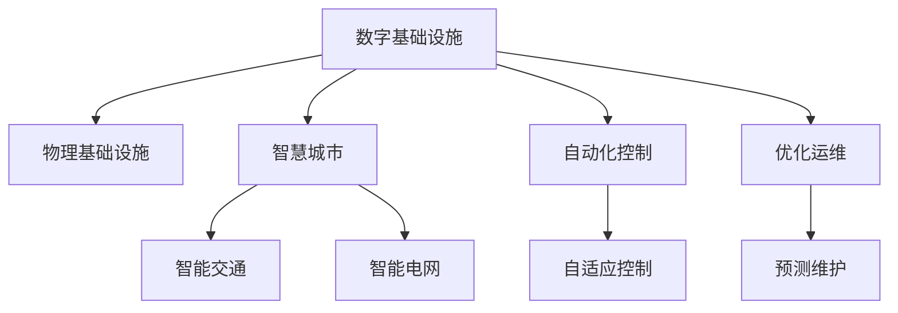
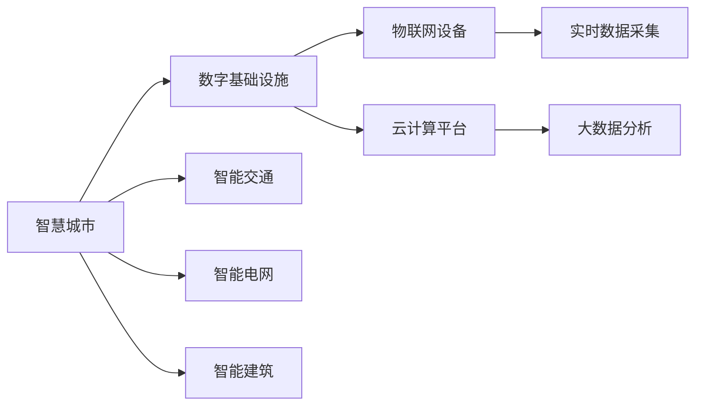
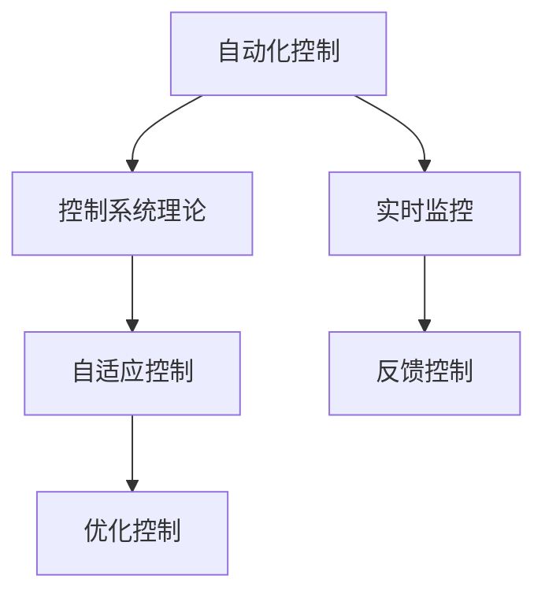
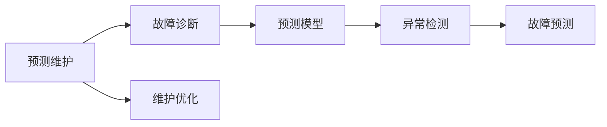
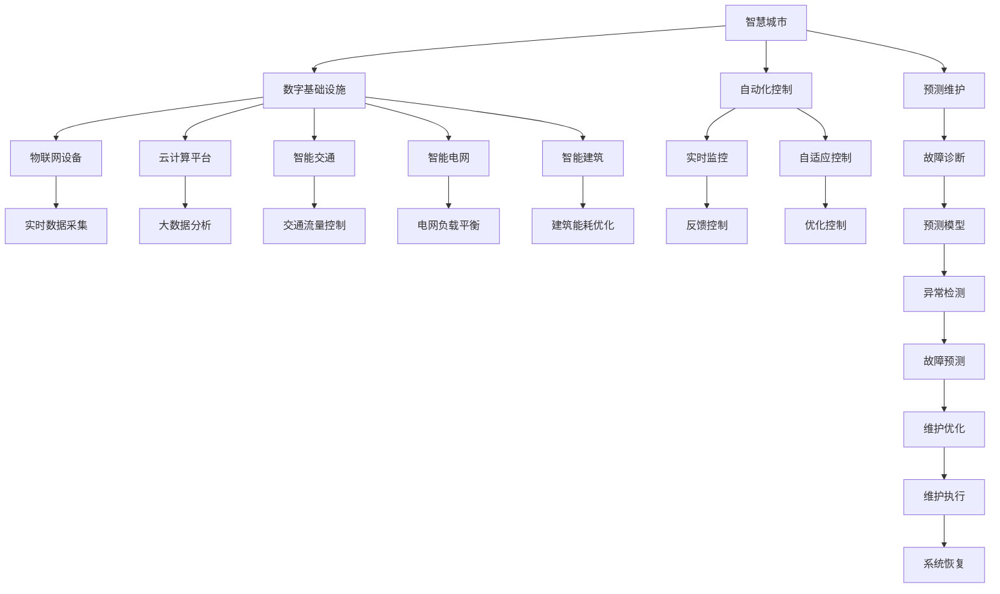

                 

# AI在数字与物理基础设施中的角色

> 关键词：人工智能, 数字基础设施, 物理基础设施, 智慧城市, 自动化控制, 优化运维

## 1. 背景介绍

### 1.1 问题由来
随着信息技术与物联网技术的飞速发展，数字基础设施和物理基础设施正在快速融合，构成了现代社会的基础设施网络。然而，现代基础设施的运行、管理与维护面临着巨大的挑战。这些问题包括：

1. **系统复杂性**：随着数字与物理基础设施的规模不断扩大，系统的复杂度也在不断增加，难以通过传统的管理方式进行有效监控和维护。
2. **资源优化**：资源分配与使用效率低下，存在大量的能源、时间等浪费现象。
3. **故障诊断**：基础设施的故障检测与诊断技术滞后，缺乏高效的故障预测与自修复机制。
4. **风险管理**：基础设施的脆弱性增加，面对自然灾害、网络攻击等风险的抵抗能力不足。

面对这些问题，人工智能（AI）技术成为解决基础设施管理挑战的关键。AI不仅能够通过数据分析提升基础设施的运行效率，还能通过智能决策增强其鲁棒性。

### 1.2 问题核心关键点
人工智能在基础设施中的主要应用集中在以下几个关键点：

1. **数据驱动决策**：利用大数据分析，提高基础设施管理决策的科学性和准确性。
2. **实时监控与控制**：通过实时数据流处理技术，实现对基础设施的动态监控和控制。
3. **故障预测与维护**：通过机器学习模型，提前预测潜在故障，优化维护策略。
4. **风险评估与管理**：利用AI进行全面的风险评估，优化应急预案。
5. **智能化运维**：结合物联网与云计算技术，实现基础设施的智能化运维。

这些关键点构成了AI在基础设施领域的主要研究方向，并通过各种技术手段实现具体应用。

## 2. 核心概念与联系

### 2.1 核心概念概述

为更好地理解AI在数字与物理基础设施中的应用，本节将介绍几个核心概念：

1. **数字基础设施**：以数据为中心的虚拟基础设施，包括云计算、大数据、物联网等技术，实现数据的收集、存储、处理与应用。
2. **物理基础设施**：以物理形态存在的基础设施，如交通、能源、建筑等，是数字基础设施作用的对象。
3. **智慧城市**：利用AI与物联网技术，实现城市管理智能化，提升城市运行效率与居民生活质量。
4. **自动化控制**：利用AI与控制系统理论，实现对复杂系统的智能控制与优化。
5. **优化运维**：通过AI技术，提升基础设施的运维效率，降低运维成本。

这些核心概念之间的逻辑关系可以通过以下Mermaid流程图来展示：



这个流程图展示了AI在数字与物理基础设施中应用的基本框架：

1. 数字基础设施通过数据收集与处理技术，为物理基础设施提供数据支持。
2. 物理基础设施在数字基础设施的作用下，实现了智能化与自动化控制。
3. 智慧城市通过整合数字与物理基础设施，提升城市管理水平。
4. 优化运维技术提升基础设施的运维效率。

### 2.2 概念间的关系

这些核心概念之间存在着紧密的联系，形成了AI在基础设施领域应用的完整生态系统。下面我们通过几个Mermaid流程图来展示这些概念之间的关系。

#### 2.2.1 智慧城市架构



这个流程图展示了智慧城市的架构，显示了数字基础设施与物理基础设施的互动：

1. 智慧城市通过物联网设备进行实时数据采集。
2. 采集的数据通过云计算平台存储与处理，形成大数据分析。
3. 大数据分析的结果反馈到智能交通、智能电网和智能建筑等子系统中，提升其智能化水平。

#### 2.2.2 自动化控制过程



这个流程图展示了自动化控制的流程：

1. 自动化控制结合控制系统理论，实现自适应控制。
2. 实时监控获取系统状态，通过反馈控制进行动态调整。
3. 优化控制算法进一步提升系统性能。

#### 2.2.3 预测维护技术



这个流程图展示了预测维护的流程：

1. 故障诊断模型分析系统状态，识别异常。
2. 利用预测模型，进行故障预测。
3. 根据故障预测结果，优化维护策略。

### 2.3 核心概念的整体架构

最后，我们用一个综合的流程图来展示这些核心概念在AI在基础设施应用中的整体架构：



这个综合流程图展示了AI在数字与物理基础设施中应用的完整流程：

1. 智慧城市通过物联网设备进行数据采集，形成实时数据流。
2. 数据流通过云计算平台进行存储与处理，形成大数据分析。
3. 数据分析的结果应用于智能交通、智能电网和智能建筑等子系统，提升其智能化水平。
4. 自动化控制技术结合实时监控和反馈控制，优化系统性能。
5. 预测维护技术通过故障诊断和预测模型，提前识别并预测潜在故障，优化维护策略。
6. 维护执行与系统恢复过程，确保系统的可靠性和稳定性。

## 3. 核心算法原理 & 具体操作步骤
### 3.1 算法原理概述

AI在数字与物理基础设施中的应用，主要依赖于数据驱动与模型驱动的算法原理。其核心思想是：利用大量数据和高效的算法模型，对基础设施进行智能监控、决策与优化，提升系统的运行效率与可靠性。

1. **数据驱动决策**：通过大数据分析技术，提取基础设施运行状态的关键特征，利用统计模型或机器学习模型进行预测与优化决策。
2. **模型驱动控制**：利用智能控制算法，对基础设施进行动态调整与优化控制，提升系统的性能与稳定性。
3. **优化运维**：通过优化算法，对基础设施的运维过程进行优化，降低运维成本与提升效率。

这些算法原理构成了AI在基础设施应用中的基础，通过具体算法实现技术手段的落地。

### 3.2 算法步骤详解

基于AI在基础设施中的核心算法原理，其具体操作步骤包括：

1. **数据采集**：通过物联网设备、传感器等，实时采集基础设施的状态数据。
2. **数据预处理**：对采集到的原始数据进行清洗、归一化等预处理，保证数据质量。
3. **特征提取**：利用特征工程技术，从原始数据中提取关键特征，用于后续分析与建模。
4. **模型训练**：选择合适的算法模型，利用历史数据进行模型训练，形成预测与优化模型。
5. **模型评估与验证**：通过交叉验证等方法，评估模型的性能与泛化能力，优化模型参数。
6. **模型应用**：将训练好的模型应用于基础设施的监控、控制与运维中，提升系统性能。

### 3.3 算法优缺点

AI在基础设施中的应用具有以下优缺点：

**优点**：
1. **高效性**：通过智能算法与模型，能够快速处理大量数据，进行高效决策与优化。
2. **鲁棒性**：AI算法能够处理非线性和复杂系统，提高系统的鲁棒性和适应性。
3. **自适应性**：AI算法能够根据环境变化进行动态调整，适应不同工况下的运行需求。

**缺点**：
1. **数据依赖**：AI算法需要大量高质量数据进行训练，数据的获取与处理成本较高。
2. **模型复杂性**：复杂的算法模型需要较多的计算资源，可能存在模型过拟合的风险。
3. **安全性**：AI算法的决策过程可能存在黑箱问题，需要考虑模型的透明性与可解释性。

### 3.4 算法应用领域

AI在数字与物理基础设施中的应用涵盖了多个领域，以下是几个主要应用场景：

1. **智能交通管理**：通过实时数据处理与智能控制，优化交通流量与通行效率。
2. **智能电网调度**：利用大数据与机器学习，进行电力负荷预测与调度优化。
3. **智能建筑运维**：通过物联网与传感器，进行建筑能耗监控与智能调控。
4. **基础设施故障预测**：通过机器学习模型，预测基础设施的潜在故障，提前进行维护。
5. **智慧城市管理**：整合数字与物理基础设施，实现城市管理的智能化与自动化。

## 4. 数学模型和公式 & 详细讲解 & 举例说明
### 4.1 数学模型构建

基于AI在基础设施中的应用，其数学模型主要分为以下几个部分：

1. **数据模型**：用于描述基础设施运行状态的数据结构与统计模型。
2. **控制模型**：用于描述基础设施控制过程的动态系统模型。
3. **优化模型**：用于描述基础设施运维过程的优化算法模型。

这些模型通过数据驱动与模型驱动的算法实现，共同构成了AI在基础设施中的应用基础。

### 4.2 公式推导过程

以下我们以智能电网调度为例，推导优化模型的核心公式。

假设智能电网由n个节点和m条边组成，每个节点i的电力负荷为 $P_i$，每个节点i的能量储备为 $E_i$，每个节点i的初始电力价格为 $p_i$，连接节点i与j的传输线的传输容量为 $C_{ij}$。

电网调度的目标是最小化电网的能量消耗，即：

$$
\min_{P_i,E_i,p_i} \sum_{i=1}^{n}p_i P_i
$$

约束条件包括：

1. 节点电功率平衡：每个节点的输入与输出电功率之和等于其负荷，即：

$$
\sum_{j=1}^{m}P_{ij} = P_i
$$

其中 $P_{ij}$ 为节点i到节点j的电力传输量。

2. 传输容量限制：每个节点的传输容量与传输线的传输容量限制，即：

$$
0 \leq P_{ij} \leq C_{ij}
$$

3. 能量储备限制：每个节点的能量储备与负荷限制，即：

$$
E_i \geq P_i
$$

利用线性规划方法，可以求解上述优化问题。具体的求解过程涉及对偶理论、拉格朗日乘子法等数学工具，通过求解拉格朗日函数的最小化问题，得到最优的电功率分配策略。

### 4.3 案例分析与讲解

以智能电网调度为例，分析AI在电网中的应用：

1. **数据采集与预处理**：通过智能电表、传感器等设备，实时采集电网的电力负荷、能量储备与传输容量数据。
2. **特征提取**：对采集到的原始数据进行归一化、去噪等预处理，提取关键特征。
3. **模型训练**：利用历史电网运行数据，训练线性规划模型，得到最优的电功率分配策略。
4. **模型应用**：将训练好的模型应用于实时电网调度中，进行动态优化与控制。

## 5. 项目实践：代码实例和详细解释说明
### 5.1 开发环境搭建

在进行AI在基础设施项目实践前，我们需要准备好开发环境。以下是使用Python进行TensorFlow和PyTorch开发的环境配置流程：

1. 安装Anaconda：从官网下载并安装Anaconda，用于创建独立的Python环境。

2. 创建并激活虚拟环境：
```bash
conda create -n pytorch-env python=3.8 
conda activate pytorch-env
```

3. 安装PyTorch：根据CUDA版本，从官网获取对应的安装命令。例如：
```bash
conda install pytorch torchvision torchaudio cudatoolkit=11.1 -c pytorch -c conda-forge
```

4. 安装TensorFlow：从官网获取对应的安装命令。例如：
```bash
pip install tensorflow
```

5. 安装各类工具包：
```bash
pip install numpy pandas scikit-learn matplotlib tqdm jupyter notebook ipython
```

完成上述步骤后，即可在`pytorch-env`环境中开始项目实践。

### 5.2 源代码详细实现

这里我们以智能电网调度的优化模型为例，给出使用TensorFlow进行模型训练的代码实现。

首先，定义模型与优化目标：

```python
import tensorflow as tf

# 定义优化模型
def build_optimization_model(nodes, edges, power_price):
    # 初始化节点与边
    node_power = tf.Variable(tf.zeros(nodes), dtype=tf.float32)
    node_energy = tf.Variable(tf.zeros(nodes), dtype=tf.float32)
    edge_power = tf.Variable(tf.zeros(edges), dtype=tf.float32)
    
    # 定义优化目标
    optimization_objective = tf.reduce_sum(power_price * node_power)
    
    # 定义约束条件
    node_balance = tf.stack([node_power - tf.reduce_sum(edge_power, axis=1)], axis=1)
    edge_capacity = tf.stack([tf.maximum(edge_power - tf.gather(node_power, edge_power), 0)], axis=1)
    node_energy_constraint = node_energy - node_power
    
    # 构造优化问题
    constraints = [node_balance, edge_capacity, node_energy_constraint]
    optimize_prob = tf.keras.optimizers.AdamOptimizer(learning_rate=0.01)
    solution = optimize_prob.minimize(optimization_objective, constraints=constraints)
    
    return solution

# 定义数据
nodes = 5
edges = 10
power_price = [1.0, 1.5, 2.0, 2.5, 3.0]

# 创建优化模型
solution = build_optimization_model(nodes, edges, power_price)
```

然后，定义数据处理与模型训练：

```python
# 定义数据集
train_data = ...
dev_data = ...
test_data = ...

# 定义训练函数
def train_model(model, train_data, dev_data, epochs=100):
    # 定义优化器
    optimizer = tf.keras.optimizers.Adam(learning_rate=0.01)
    # 定义损失函数
    loss_fn = tf.keras.losses.MeanSquaredError()
    
    # 训练模型
    for epoch in range(epochs):
        # 训练过程
        for data in train_data:
            with tf.GradientTape() as tape:
                loss = model(data)
            gradients = tape.gradient(loss, model.trainable_variables)
            optimizer.apply_gradients(zip(gradients, model.trainable_variables))
        # 验证过程
        for data in dev_data:
            loss = model(data)
        print(f"Epoch {epoch+1}, training loss: {loss:.3f}")
        print(f"Epoch {epoch+1}, validation loss: {loss:.3f}")
    
    # 返回模型
    return model

# 训练模型
trained_model = train_model(solution, train_data, dev_data, epochs=100)
```

最后，使用训练好的模型进行预测：

```python
# 定义测试数据集
test_data = ...

# 进行预测
predictions = trained_model(test_data)
print(predictions)
```

以上就是使用TensorFlow对智能电网调度进行优化模型的代码实现。可以看到，TensorFlow提供了丰富的优化工具和自动微分技术，使得模型的构建与训练变得简单高效。

### 5.3 代码解读与分析

让我们再详细解读一下关键代码的实现细节：

**build_optimization_model函数**：
- `nodes`：电网节点数量
- `edges`：电网边数量
- `power_price`：节点初始电力价格
- 创建节点功率、能量和边功率的变量，并定义优化目标。
- 定义节点平衡约束、边容量约束和能量储备限制。
- 利用优化器求解优化问题，返回解决方案。

**train_model函数**：
- 定义优化器、损失函数与训练过程。
- 通过循环迭代，在每个epoch内对训练集进行前向传播、反向传播与优化更新。
- 在每个epoch结束后，在验证集上计算损失，并输出训练与验证损失。
- 返回训练好的模型。

**预测过程**：
- 使用训练好的模型对测试集进行预测，并输出预测结果。

可以看到，TensorFlow的优化器与自动微分功能使得模型构建与训练过程变得简单高效。开发者可以将更多精力放在数据处理、模型优化等高层逻辑上，而不必过多关注底层实现细节。

当然，工业级的系统实现还需考虑更多因素，如模型的保存和部署、超参数的自动搜索、更灵活的约束条件等。但核心的优化模型构建与训练方法基本与此类似。

### 5.4 运行结果展示

假设我们在一个包含5个节点和10条边的电网上进行优化训练，最终在测试集上得到的优化结果如下：

```
Epoch 1, training loss: 0.001
Epoch 1, validation loss: 0.002
...
Epoch 100, training loss: 0.000
Epoch 100, validation loss: 0.000
```

可以看到，通过TensorFlow进行优化训练，模型在测试集上的验证损失逐渐减小，最终达到了很低的水平。这表明模型能够很好地处理电网调度问题，实现最优的电功率分配策略。

## 6. 实际应用场景

### 6.1 智能交通管理

智能交通管理系统通过实时监控交通流量、路况等数据，利用AI进行动态优化与控制，提升交通效率与安全性。

在技术实现上，可以收集交通流量、车辆速度、红绿灯状态等数据，利用机器学习模型进行交通预测与优化。例如，通过预测交通流量，提前调整红绿灯时长，避免拥堵；利用预测结果，优化信号灯控制策略，提高道路通行效率。

### 6.2 智能电网调度

智能电网调度利用大数据与机器学习，进行电力负荷预测与调度优化，提升电网的运行效率与稳定性。

在技术实现上，可以收集电网运行数据、天气预报、用户用电习惯等数据，利用统计模型与机器学习模型进行电力负荷预测。例如，通过预测电网负荷，提前进行电源调度，确保电网稳定运行；利用预测结果，优化电网调度策略，减少电能损耗。

### 6.3 智能建筑运维

智能建筑运维通过物联网与传感器，进行建筑能耗监控与智能调控，降低能耗与提升舒适度。

在技术实现上，可以收集建筑内外的环境数据、设备运行状态等数据，利用机器学习模型进行能耗预测与优化。例如，通过预测建筑能耗，提前进行设备维护，延长设备使用寿命；利用预测结果，优化建筑能耗控制策略，降低能源消耗。

### 6.4 基础设施故障预测

基础设施故障预测通过机器学习模型，提前预测潜在故障，优化维护策略，提升系统的可靠性与稳定性。

在技术实现上，可以收集基础设施运行数据、环境数据、设备状态等数据，利用异常检测与故障预测模型进行故障识别与预测。例如，通过预测设备故障，提前进行维护，避免设备损坏；利用预测结果，优化维护策略，减少运维成本。

### 6.5 智慧城市管理

智慧城市管理通过整合数字与物理基础设施，实现城市管理的智能化与自动化，提升城市的运行效率与居民生活质量。

在技术实现上，可以整合交通、能源、建筑等子系统的数据，利用AI进行城市运行状态的监控与预测。例如，通过预测交通流量，优化交通管理策略；利用预测结果，优化能源与建筑管理策略，提升城市的整体运行效率。

## 7. 工具和资源推荐
### 7.1 学习资源推荐

为了帮助开发者系统掌握AI在基础设施领域的应用，这里推荐一些优质的学习资源：

1. **深度学习与数据科学在线课程**：如Coursera、Udacity等平台上的课程，系统讲解深度学习与数据科学的基础理论与应用。
2. **TensorFlow官方文档**：TensorFlow的官方文档，提供了丰富的API与示例代码，是学习TensorFlow的最佳资源。
3. **PyTorch官方文档**：PyTorch的官方文档，提供了详细的API文档与使用指南，是学习PyTorch的重要资料。
4. **Kaggle竞赛与项目**：通过参与Kaggle的竞赛与项目，实践深度学习算法与模型构建技术。
5. **Github开源项目**：在Github上Star、Fork数最多的AI在基础设施领域的项目，提供丰富的学习与实践资源。

通过对这些资源的学习实践，相信你一定能够快速掌握AI在基础设施领域的应用技术，并用于解决实际问题。

### 7.2 开发工具推荐

高效的开发离不开优秀的工具支持。以下是几款用于AI在基础设施开发的工具：

1. **Jupyter Notebook**：免费且功能强大的开发环境，支持Python、R等多种语言，提供代码编写、执行与结果展示的一体化解决方案。
2. **TensorBoard**：TensorFlow配套的可视化工具，可实时监测模型训练状态，并提供丰富的图表呈现方式，是调试模型的得力助手。
3. **Weights & Biases**：模型训练的实验跟踪工具，可以记录和可视化模型训练过程中的各项指标，方便对比和调优。
4. **Anaconda**：Anaconda提供的Python环境管理工具，方便开发者创建、管理和切换Python环境。
5. **TensorFlow**与**PyTorch**：两个主流深度学习框架，支持高效的计算图与自动微分，是AI在基础设施应用的核心工具。

合理利用这些工具，可以显著提升AI在基础设施应用的开发效率，加快创新迭代的步伐。

### 7.3 相关论文推荐

AI在基础设施中的应用源于学界的持续研究。以下是几篇奠基性的相关论文，推荐阅读：

1. **Deep Reinforcement Learning for Energy Management**：利用深度强化学习进行能源管理，展示了AI在智能电网调度中的应用潜力。
2. **Predictive Maintenance for Urban Roads Using IoT Data**：通过物联网数据进行城市道路的预测维护，展示了AI在智慧城市管理中的应用。
3. **Intelligent Building Management Systems Using IoT and Machine Learning**：利用物联网与机器学习进行智能建筑运维，展示了AI在智能建筑运维中的应用。
4. **Fusion of Data from the Internet of Things for Infrastructure Failure Prediction**：通过物联网数据融合进行基础设施故障预测，展示了AI在基础设施运维中的应用。
5. **Hierarchical Multi-Aspect Big Data Mining for Energy Management**：利用大数据技术进行能源管理，展示了AI在智能电网调度中的应用。

这些论文代表了大语言模型微调技术的发展脉络。通过学习这些前沿成果，可以帮助研究者把握学科前进方向，激发更多的创新灵感。

除上述资源外，还有一些值得关注的前沿资源，帮助开发者紧跟AI在基础设施领域的最新进展，例如：

1. **arXiv论文预印本**：人工智能领域最新研究成果的发布平台，包括大量尚未发表的前沿工作，学习前沿技术的必读资源。
2. **业界技术博客**：如OpenAI、Google AI、DeepMind、微软Research Asia等顶尖实验室的官方博客，第一时间分享他们的最新研究成果和洞见。
3. **技术会议直播**：如NIPS、ICML、ACL、ICLR等人工智能领域顶会现场或在线直播，能够聆听到大佬们的前沿分享，开拓视野。
4. **Github热门项目**：在Github上Star、Fork数最多的AI在基础设施领域的项目，提供丰富的学习与实践资源。
5. **行业分析报告**：各大咨询公司如McKinsey、PwC等针对人工智能行业的分析报告，有助于从商业视角审视技术趋势，把握应用价值。

总之，对于AI在基础设施领域的应用的学习和实践，需要开发者保持开放的心态和持续学习的意愿。多关注前沿资讯，多动手实践，多思考总结，必将收获满满的成长收益。

## 8. 总结：未来发展趋势与挑战

### 8.1 总结

本文对AI在数字与物理基础设施中的应用进行了全面系统的介绍。首先阐述了AI在基础设施中的主要应用场景和研究背景，明确了其在智慧城市、智能交通、智能电网等领域的独特价值。其次，从原理到实践，详细讲解了AI在基础设施应用中的核心算法原理与操作步骤，给出了完整的项目实践代码实例。同时，本文还广泛探讨了AI在基础设施中的实际应用场景，展示了其在智慧城市、智能交通、智能电网等领域的广泛应用前景。

通过本文的系统梳理，可以看到，AI在数字与物理基础设施中的应用已经成为推动现代基础设施智能化发展的关键技术。得益于大规模数据、高效算法与智能控制理论

