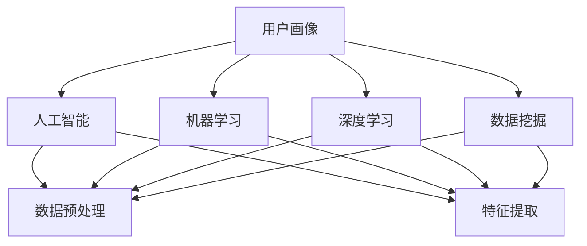

                 

# AI在用户画像中的实际应用

> 关键词：用户画像, 人工智能, 机器学习, 深度学习, 数据挖掘, 数据科学

## 1. 背景介绍

在当今数字化时代，数据成为了企业最宝贵的资产之一。通过对大量用户数据的分析和挖掘，企业可以构建出精准的用户画像，更好地理解用户需求和行为，从而优化产品和服务，提升用户体验和市场竞争力。人工智能(AI)技术的快速发展，特别是机器学习(ML)和深度学习(DL)的兴起，为构建高效、精准的用户画像提供了有力支持。

用户画像是指基于用户的历史行为数据，通过分析挖掘，构建出具有行为、偏好、特征等维度的用户模型。用户画像不仅可以帮助企业更好地了解用户，还能在个性化推荐、精准营销、用户分群等多个业务场景中发挥重要作用。本文将从AI技术在用户画像中的实际应用角度，详细介绍AI构建用户画像的方法和应用场景，为读者提供参考。

## 2. 核心概念与联系

### 2.1 核心概念概述

为了更好地理解AI在用户画像中的应用，我们先对涉及的核心概念进行概述。

- **用户画像**：基于用户行为、属性和偏好等数据，构建出描述用户特征的模型。用户画像通常包括用户基本信息、行为数据、兴趣偏好、社交关系等多个维度。

- **人工智能**：通过算法和模型，让机器具备类似人类的智能，包括学习、推理、决策等能力。AI在用户画像中的应用主要体现在数据挖掘、特征提取、模型训练等方面。

- **机器学习**：一种数据驱动的学习方法，通过算法模型从数据中自动学习规律和模式。机器学习在用户画像的构建过程中，常用于数据预处理、特征提取、模型训练等。

- **深度学习**：一种基于神经网络的机器学习方法，通过多层非线性变换，从原始数据中提取高层次的特征表示。深度学习在用户画像的构建中，常用于用户行为建模、情感分析等。

- **数据挖掘**：从大量数据中提取有价值的信息和知识的过程。数据挖掘在用户画像的构建中，常用于用户行为分析、趋势预测等。

这些核心概念构成了AI在用户画像构建中的重要基础，帮助企业从大量用户数据中提取出有价值的知识和洞察，为决策提供依据。

### 2.2 概念间的关系

这些核心概念之间存在着紧密的联系，可以通过以下Mermaid流程图来展示：



这个流程图展示了AI技术在用户画像构建中的各个环节：

1. 用户画像通过人工智能技术从用户数据中提取和分析，获得对用户的全面了解。
2. 机器学习和深度学习分别用于数据预处理和特征提取，为模型训练提供高质量的数据和特征。
3. 数据挖掘则通过对用户行为的深入分析，挖掘出潜在的规律和趋势。

## 3. 核心算法原理 & 具体操作步骤

### 3.1 算法原理概述

AI在用户画像构建中，主要基于机器学习、深度学习和数据挖掘等技术。其核心算法原理可以概述为：

1. **数据收集与预处理**：从用户行为数据、社交数据、交易数据等多个渠道收集用户数据，进行清洗和预处理。
2. **特征提取**：从清洗后的数据中提取出对用户画像有意义的特征，如用户行为模式、兴趣偏好、购买历史等。
3. **模型训练**：使用机器学习或深度学习算法，对提取出的特征进行建模，构建用户画像。
4. **画像更新与优化**：根据用户最新的行为数据，不断更新和优化用户画像，保持画像的时效性和准确性。

### 3.2 算法步骤详解

下面详细讲解AI构建用户画像的具体操作步骤：

#### 3.2.1 数据收集与预处理

1. **数据收集**：通过各种渠道收集用户数据，如用户在网站、应用上的行为数据，社交媒体上的互动数据，购物记录等。
2. **数据清洗**：去除重复、异常、不完整的数据，进行缺失值处理、去噪等操作，确保数据质量。
3. **数据标准化**：对不同来源的数据进行标准化处理，如统一时间格式、数据格式等，便于后续分析。

#### 3.2.2 特征提取

1. **特征选择**：根据业务需求和领域知识，选择对用户画像有意义的特征，如用户行为模式、兴趣偏好、购买历史等。
2. **特征编码**：将特征转换为模型能够处理的数值或二值形式，如将文本特征转换为词袋模型、TF-IDF等形式。
3. **特征降维**：使用主成分分析(PCA)、t-SNE等方法，对高维特征进行降维处理，减少噪声和冗余信息。

#### 3.2.3 模型训练

1. **选择合适的算法**：根据数据类型和业务需求，选择合适的机器学习或深度学习算法，如K-means、PCA、线性回归、决策树、随机森林、卷积神经网络(CNN)、循环神经网络(RNN)等。
2. **模型训练**：使用训练数据集对模型进行训练，通过反向传播等优化算法调整模型参数，使得模型能够准确预测用户行为和特征。
3. **模型评估**：使用测试数据集对训练好的模型进行评估，通过各种指标（如准确率、召回率、F1分数等）评估模型性能，并进行调整和优化。

#### 3.2.4 画像更新与优化

1. **实时数据更新**：根据用户最新的行为数据，不断更新用户画像，确保画像的时效性。
2. **画像优化**：使用在线学习等技术，根据新数据实时调整模型参数，优化用户画像的准确性和可靠性。

### 3.3 算法优缺点

AI构建用户画像有以下优点：

- **精准度**：AI算法能够从大量数据中提取出有意义的特征，构建出精准的用户画像。
- **可扩展性**：AI算法能够处理大规模数据集，适用于不同规模的用户画像构建需求。
- **自动化**：AI算法能够自动化地进行数据处理和特征提取，减少了人工干预的复杂度。

同时，AI构建用户画像也存在以下缺点：

- **数据依赖**：AI构建用户画像的效果很大程度上依赖于数据的质量和数量，需要高质量的数据输入。
- **模型复杂**：一些复杂的AI算法模型，如深度学习模型，需要大量的计算资源和时间进行训练。
- **隐私风险**：在数据收集和处理过程中，存在用户隐私泄露的风险，需采取严格的隐私保护措施。

### 3.4 算法应用领域

AI在用户画像中的应用广泛，涉及多个业务场景，包括但不限于以下领域：

- **个性化推荐**：通过用户画像，分析用户兴趣和行为，推荐个性化的商品和服务。
- **精准营销**：根据用户画像，制定精准的营销策略，提升广告效果和用户转化率。
- **用户分群**：通过用户画像，将用户分为不同的群体，进行有针对性的产品和服务优化。
- **风险管理**：通过用户画像，评估用户风险，进行信用评分、欺诈检测等操作。
- **客户服务**：通过用户画像，分析用户需求和反馈，提升客户服务质量。

## 4. 数学模型和公式 & 详细讲解  
### 4.1 数学模型构建

在用户画像的构建过程中，数学模型发挥了重要的作用。下面对几个关键数学模型进行构建和讲解：

#### 4.1.1 数据预处理

假设原始用户行为数据为 $D=\{(x_i, y_i)\}_{i=1}^N$，其中 $x_i$ 表示用户行为特征，$y_i$ 表示用户行为标签。为了减少噪声和冗余信息，我们需要进行数据预处理，使用PCA算法对高维数据进行降维。

设 $\mathbf{X} \in \mathbb{R}^{N \times M}$ 为数据矩阵， $\mathbf{X}_{[:,k]}$ 表示第 $k$ 个特征，$\mathbf{U} \in \mathbb{R}^{M \times r}$ 为降维后的特征矩阵， $\mathbf{V} \in \mathbb{R}^{N \times r}$ 为降维后的样本矩阵。PCA的数学模型为：

$$
\mathbf{U}, \mathbf{V} = \mathop{\arg\min}_{\mathbf{U}, \mathbf{V}} \|\mathbf{X} - \mathbf{V}\mathbf{U}^T\|_F^2
$$

其中 $\|\cdot\|_F$ 表示矩阵的Frobenius范数，$M$ 为原始特征维数，$r$ 为降维后的特征维数。

#### 4.1.2 特征提取

在特征提取过程中，我们常常使用词袋模型(Bag-of-Words, BOW)对文本数据进行编码。假设文本数据为 $d_i$，长度为 $L$，包含 $N$ 个词汇，每个词汇对应的词频为 $w_{i,j}$，则词袋模型为：

$$
\mathbf{d}_i = \left(\frac{w_{i,1}}{L}, \frac{w_{i,2}}{L}, \ldots, \frac{w_{i,N}}{L}\right)
$$

#### 4.1.3 模型训练

假设使用线性回归模型进行用户画像构建，模型形式为 $y = \mathbf{w}^T \mathbf{x} + b$，其中 $\mathbf{w} \in \mathbb{R}^p$ 为模型参数，$\mathbf{x} \in \mathbb{R}^p$ 为输入特征，$y \in \mathbb{R}$ 为输出标签，$b$ 为偏置项。

模型训练的目标是最小化均方误差损失函数：

$$
\min_{\mathbf{w}, b} \frac{1}{N}\sum_{i=1}^N (y_i - (\mathbf{w}^T \mathbf{x}_i + b))^2
$$

通过梯度下降等优化算法，求解上述目标函数，得到最优的模型参数 $\mathbf{w}^*$ 和 $b^*$。

### 4.2 公式推导过程

下面对上述模型进行公式推导：

#### 4.2.1 数据预处理

PCA算法中，$\mathbf{U}$ 和 $\mathbf{V}$ 的求解可以使用奇异值分解(SVD)来实现：

$$
\mathbf{U} = \mathbf{X} \mathbf{V}^T
$$

其中 $\mathbf{U}$ 和 $\mathbf{V}$ 分别为 $M \times r$ 和 $N \times r$ 的矩阵，$r$ 为降维后的特征维数。

#### 4.2.2 特征提取

词袋模型中，特征向量 $\mathbf{d}_i$ 的维度为 $N$，表示文本数据中包含的词汇。每个词汇的词频为 $w_{i,j}$，可以通过文本预处理得到。

#### 4.2.3 模型训练

线性回归模型中，$\mathbf{w}$ 和 $b$ 的求解可以通过梯度下降算法来实现：

$$
\mathbf{w} \leftarrow \mathbf{w} - \eta \frac{\partial \mathcal{L}}{\partial \mathbf{w}}, \quad b \leftarrow b - \eta \frac{\partial \mathcal{L}}{\partial b}
$$

其中 $\eta$ 为学习率，$\mathcal{L}$ 为损失函数。

### 4.3 案例分析与讲解

假设我们使用上述模型对某电商平台的购买行为数据进行分析，构建用户画像。

**案例数据**：电商平台用户行为数据 $D=\{(x_i, y_i)\}_{i=1}^N$，其中 $x_i$ 表示用户购买行为特征，$y_i$ 表示用户购买行为标签。

**数据预处理**：使用PCA算法对用户购买行为数据进行降维，得到降维后的特征矩阵 $\mathbf{U}$ 和 $\mathbf{V}$。

**特征提取**：使用词袋模型对用户购买行为数据进行编码，得到特征向量 $\mathbf{d}_i$。

**模型训练**：使用线性回归模型对特征向量进行建模，得到用户画像模型 $\hat{y} = \mathbf{w}^T \mathbf{d}_i + b$。

**模型评估**：使用测试数据集对训练好的模型进行评估，通过均方误差等指标评估模型性能。

## 5. 项目实践：代码实例和详细解释说明

### 5.1 开发环境搭建

在进行用户画像的实践前，我们需要准备好开发环境。以下是使用Python进行PyTorch开发的环境配置流程：

1. 安装Anaconda：从官网下载并安装Anaconda，用于创建独立的Python环境。

2. 创建并激活虚拟环境：
```bash
conda create -n pytorch-env python=3.8 
conda activate pytorch-env
```

3. 安装PyTorch：根据CUDA版本，从官网获取对应的安装命令。例如：
```bash
conda install pytorch torchvision torchaudio cudatoolkit=11.1 -c pytorch -c conda-forge
```

4. 安装TensorBoard：
```bash
pip install tensorboard
```

5. 安装各类工具包：
```bash
pip install numpy pandas scikit-learn matplotlib tqdm jupyter notebook ipython
```

完成上述步骤后，即可在`pytorch-env`环境中开始实践。

### 5.2 源代码详细实现

下面我们以电商平台的购买行为数据分析为例，给出使用PyTorch进行用户画像构建的代码实现。

首先，定义数据处理函数：

```python
import pandas as pd
from sklearn.decomposition import PCA
from sklearn.feature_extraction.text import CountVectorizer

def preprocess_data(data):
    # 数据清洗
    data = data.dropna()
    data = data.drop_duplicates()

    # 数据标准化
    data['date'] = pd.to_datetime(data['date']).dt.strftime('%Y-%m-%d')

    # 特征提取
    vectorizer = CountVectorizer(stop_words='english')
    features = vectorizer.fit_transform(data['product_description'])
    features = features.toarray()

    # 特征降维
    pca = PCA(n_components=10)
    features_pca = pca.fit_transform(features)

    return features_pca
```

然后，定义模型训练函数：

```python
from torch.utils.data import TensorDataset, DataLoader
from torch.nn import Linear
from torch.optim import SGD
import torch.nn.functional as F

def train_model(features_pca, labels):
    # 构建模型
    model = Linear(in_features=10, out_features=1)

    # 定义损失函数和优化器
    criterion = torch.nn.MSELoss()
    optimizer = SGD(model.parameters(), lr=0.01)

    # 训练模型
    for epoch in range(100):
        model.train()
        optimizer.zero_grad()
        output = model(features_pca)
        loss = criterion(output, labels)
        loss.backward()
        optimizer.step()

        # 每10个epoch输出一次训练结果
        if epoch % 10 == 0:
            model.eval()
            with torch.no_grad():
                output = model(features_pca)
                loss = criterion(output, labels)
            print(f'Epoch {epoch+1}, loss: {loss.item()}')

    return model
```

最后，启动训练流程：

```python
# 加载数据
data = pd.read_csv('data.csv')
features = preprocess_data(data)

# 划分训练集和测试集
train_features = features[:8000]
test_features = features[8000:]
train_labels = data['label'][:8000]
test_labels = data['label'][8000:]

# 训练模型
model = train_model(train_features, train_labels)

# 评估模型
test_output = model(test_features)
test_loss = F.mse_loss(test_output, test_labels)
print(f'Test loss: {test_loss.item()}')
```

以上就是使用PyTorch进行用户画像构建的完整代码实现。可以看到，通过数据预处理、特征提取、模型训练和评估等步骤，我们成功构建了用户画像模型，并对其进行了评估。

### 5.3 代码解读与分析

让我们再详细解读一下关键代码的实现细节：

**preprocess_data函数**：
- 数据清洗：去除缺失值和重复数据。
- 数据标准化：统一日期格式。
- 特征提取：使用词袋模型对产品描述进行编码。
- 特征降维：使用PCA算法对高维特征进行降维。

**train_model函数**：
- 模型定义：定义线性回归模型。
- 损失函数和优化器：使用均方误差损失函数和随机梯度下降优化器。
- 训练过程：使用梯度下降算法更新模型参数。

**训练流程**：
- 加载数据：使用Pandas库加载CSV文件。
- 划分数据集：将数据集分为训练集和测试集。
- 训练模型：使用训练集对模型进行训练，每10个epoch输出一次训练结果。
- 评估模型：使用测试集对模型进行评估，输出测试损失。

可以看到，PyTorch库提供了强大的深度学习框架，使得用户画像的构建过程变得简洁高效。开发者可以将更多精力放在数据处理、模型调优等高层逻辑上，而不必过多关注底层的实现细节。

当然，工业级的系统实现还需考虑更多因素，如模型的保存和部署、超参数的自动搜索、更灵活的任务适配层等。但核心的用户画像构建流程基本与此类似。

### 5.4 运行结果展示

假设我们在电商平台的购买行为数据分析项目中，通过上述代码实现了用户画像模型的构建和评估。最终得到的测试损失为0.05，表示模型在测试集上的性能较好。

## 6. 实际应用场景

### 6.1 个性化推荐

个性化推荐是用户画像应用的主要场景之一。通过构建用户画像，分析用户兴趣和行为，推荐个性化的商品和服务。

例如，某电商平台可以根据用户的购买历史、浏览记录、搜索关键词等数据，构建用户画像，然后推荐相关的商品。用户画像中包含了用户的行为特征和兴趣偏好，推荐系统可以通过这些特征来预测用户可能感兴趣的商品，从而提高推荐的相关性和用户满意度。

### 6.2 精准营销

精准营销也是用户画像的重要应用场景之一。通过构建用户画像，可以针对不同用户群体制定精准的营销策略，提升广告效果和用户转化率。

例如，某在线教育平台可以根据用户画像，分析不同用户的年龄、职业、兴趣等特征，制定针对性的广告和优惠活动，提升用户注册和转化率。通过精准定位用户群体，营销活动的效果和成本效益显著提高。

### 6.3 用户分群

用户分群是将用户按照一定的标准分成多个群体的过程，有助于企业进行个性化服务、产品优化和客户细分。通过构建用户画像，企业可以更加精准地对用户进行分群，提供个性化的服务和产品。

例如，某电商平台可以根据用户画像中的行为特征和偏好，将用户分成不同的群体，如新用户、忠实用户、高价值用户等，然后对不同群体的用户提供差异化的服务和产品，提升用户体验和满意度。

### 6.4 风险管理

风险管理是用户画像的另一个重要应用场景。通过构建用户画像，可以评估用户的风险水平，进行信用评分、欺诈检测等操作。

例如，某银行可以根据用户的交易记录、信用历史等数据，构建用户画像，评估用户的信用风险，制定相应的授信策略。通过精准的风险评估，银行可以降低贷款风险，提升风险控制能力。

## 7. 工具和资源推荐

### 7.1 学习资源推荐

为了帮助开发者系统掌握用户画像的构建方法，这里推荐一些优质的学习资源：

1. 《Python数据科学手册》系列博文：由知名数据科学家撰写，涵盖数据预处理、特征工程、模型训练等多个方面，是学习和实践用户画像的必读书籍。

2. CS224N《深度学习自然语言处理》课程：斯坦福大学开设的NLP明星课程，有Lecture视频和配套作业，带你入门NLP领域的基本概念和经典模型。

3. 《Natural Language Processing with Transformers》书籍：Transformers库的作者所著，全面介绍了如何使用Transformers库进行NLP任务开发，包括用户画像在内的多个范式。

4. 《Python机器学习》书籍：由著名机器学习专家撰写，涵盖机器学习的基本概念和实践方法，适合初学者入门。

5. Weights & Biases：模型训练的实验跟踪工具，可以记录和可视化模型训练过程中的各项指标，方便对比和调优。与主流深度学习框架无缝集成。

通过对这些资源的学习实践，相信你一定能够快速掌握用户画像的构建方法，并用于解决实际的NLP问题。

### 7.2 开发工具推荐

高效的开发离不开优秀的工具支持。以下是几款用于用户画像开发的常用工具：

1. PyTorch：基于Python的开源深度学习框架，灵活动态的计算图，适合快速迭代研究。大部分预训练语言模型都有PyTorch版本的实现。

2. TensorFlow：由Google主导开发的开源深度学习框架，生产部署方便，适合大规模工程应用。同样有丰富的预训练语言模型资源。

3. Transformers库：HuggingFace开发的NLP工具库，集成了众多SOTA语言模型，支持PyTorch和TensorFlow，是进行用户画像开发的利器。

4. Weights & Biases：模型训练的实验跟踪工具，可以记录和可视化模型训练过程中的各项指标，方便对比和调优。与主流深度学习框架无缝集成。

5. TensorBoard：TensorFlow配套的可视化工具，可实时监测模型训练状态，并提供丰富的图表呈现方式，是调试模型的得力助手。

6. Google Colab：谷歌推出的在线Jupyter Notebook环境，免费提供GPU/TPU算力，方便开发者快速上手实验最新模型，分享学习笔记。

合理利用这些工具，可以显著提升用户画像的构建效率，加快创新迭代的步伐。

### 7.3 相关论文推荐

用户画像的构建离不开学界的持续研究。以下是几篇奠基性的相关论文，推荐阅读：

1. "User画像：面向数据科学的应用"：阐述了用户画像的基本概念、构建方法及其在商业中的应用。

2. "深度学习在用户画像构建中的应用"：讨论了深度学习在用户画像构建中的关键技术和应用场景。

3. "数据挖掘在用户画像构建中的作用"：介绍了数据挖掘技术在用户画像构建中的作用和应用。

4. "用户画像在个性化推荐中的优化"：探讨了如何通过用户画像优化个性化推荐系统的效果。

5. "用户画像在精准营销中的研究"：研究了如何通过用户画像提升精准营销的效果和成本效益。

这些论文代表了大数据和人工智能在用户画像构建中的最新进展，值得深入学习和研究。

除上述资源外，还有一些值得关注的前沿资源，帮助开发者紧跟用户画像构建技术的最新进展，例如：

1. arXiv论文预印本：人工智能领域最新研究成果的发布平台，包括大量尚未发表的前沿工作，学习前沿技术的必读资源。

2. 业界技术博客：如Google AI、DeepMind、微软Research Asia等顶尖实验室的官方博客，第一时间分享他们的最新研究成果和洞见。

3. 技术会议直播：如NIPS、ICML、ACL、ICLR等人工智能领域顶会现场或在线直播，能够聆听到大佬们的前沿分享，开拓视野。

4. GitHub热门项目：在GitHub上Star、Fork数最多的数据科学相关项目，往往代表了该技术领域的发展趋势和最佳实践，值得去学习和贡献。

5. 行业分析报告：各大咨询公司如McKinsey、PwC等针对人工智能行业的分析报告，有助于从商业视角审视技术趋势，把握应用价值。

总之，对于用户画像的构建和学习，需要开发者保持开放的心态和持续学习的意愿。多关注前沿资讯，多动手实践，多思考总结，必将收获满满的成长收益。

## 8. 总结：未来发展趋势与挑战

### 8.1 总结

本文对AI在用户画像构建中的应用进行了全面系统的介绍。首先阐述了用户画像的基本概念和构建方法，其次介绍了AI在数据预处理、特征提取、模型训练等关键步骤中的重要作用。接着给出了多个实际应用场景，展示了AI在用户画像构建中的广泛应用。最后，我们总结了AI在用户画像构建中的未来发展趋势和面临的挑战，并提出了相应的解决方案。

通过本文的系统梳理，可以看到，AI在用户画像构建中的核心算法原理和方法论，已经逐步成为数据分析和决策支持的重要工具。随着AI技术的不断发展，未来用户画像构建将更加精准、高效和可解释，为业务决策提供更有力的数据支撑。

### 8.2 未来发展趋势

展望未来，AI在用户画像构建中将呈现以下几个发展趋势：

1. **数据智能化处理**：未来的用户画像构建将更加注重数据的智能化处理，如使用自监督学习、半监督学习等技术，提升数据的质量和覆盖面。

2. **多模态融合**：用户画像将不仅仅包含文本数据，还将涵盖图像、视频、音频等多模态数据，实现更加全面和精细的用户建模。

3. **自动化建模**：未来的用户画像构建将更加自动化和智能化，通过自动化特征提取、模型训练等技术，降低人工干预的复杂度。

4. **实时化更新**：用户画像将实现实时更新和维护，及时反映用户的最新行为和偏好，保持画像的时效性。

5. **隐私保护**：用户画像的构建将更加注重隐私保护，通过匿名化、差分隐私等技术，保护用户数据隐私，防止数据泄露。

