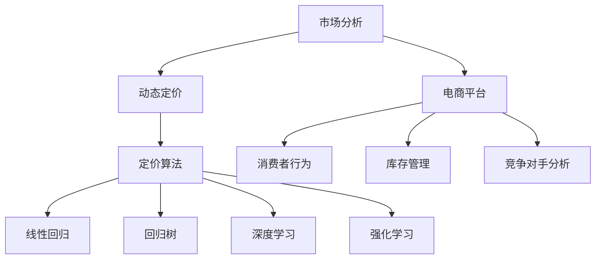
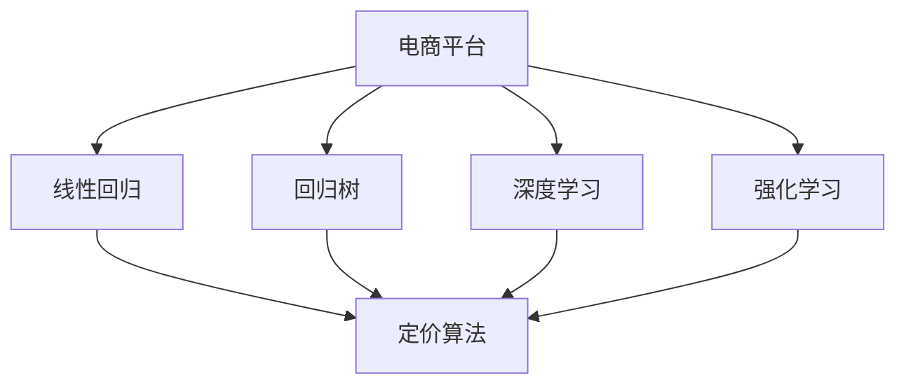
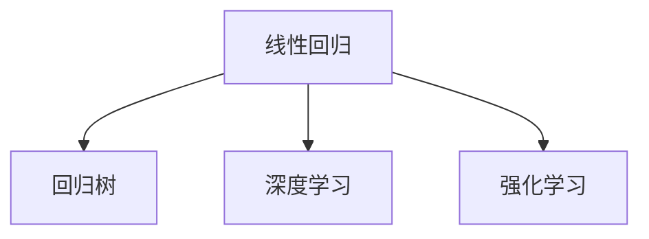
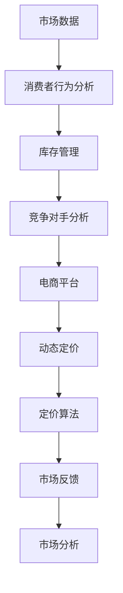

                 

# AI在电商动态定价中的实际应用

> 关键词：动态定价, 人工智能, 机器学习, 电商, 定价策略, 算法优化, 决策支持

## 1. 背景介绍

### 1.1 问题由来
在电商领域，商品定价始终是一个复杂且微妙的问题。传统的静态定价方法依赖于历史数据和经验规则，难以应对市场环境变化带来的动态需求。随着电子商务的快速发展和消费者行为的多样化，商家越来越需要一种灵活且高效的定价策略来保持市场竞争力。

### 1.2 问题核心关键点
动态定价的核心理念是根据市场供需和消费者行为实时调整商品价格。它依赖于对市场数据的准确分析和消费者行为的精确理解，以实现价格的最佳设置。近年来，人工智能（AI）和机器学习（ML）技术的快速发展为动态定价提供了强大的技术支持。

### 1.3 问题研究意义
研究动态定价中的AI应用，对于提升电商企业的盈利能力、优化库存管理和增强市场响应速度具有重要意义：

1. **提升盈利能力**：动态定价能够根据市场需求调整价格，从而最大化销售额和利润。
2. **优化库存管理**：通过精确的预测和定价策略，电商企业可以更好地管理库存，减少库存积压和缺货风险。
3. **增强市场响应速度**：AI技术能够实时监控市场变化，快速调整定价，提高市场反应速度。
4. **改善用户体验**：动态定价能够提供更加个性化的价格和服务，提升消费者满意度。

## 2. 核心概念与联系

### 2.1 核心概念概述

为更好地理解AI在电商动态定价中的应用，本节将介绍几个密切相关的核心概念：

- **动态定价(Dynamic Pricing)**：根据市场需求、库存、竞争状况等实时因素，动态调整商品价格的过程。
- **人工智能(AI) / 机器学习(ML)**：利用数据驱动的算法，从大量历史数据中学习规律，进行预测和决策。
- **深度学习(Deep Learning)**：基于多层神经网络的AI子领域，能够处理复杂的数据结构和任务，如图像识别、语音识别等。
- **强化学习(Reinforcement Learning)**：通过与环境的交互，学习最优策略，以最大化长期回报。
- **电商平台(e-commerce platform)**：提供商品展示、销售、支付、物流等服务，支持动态定价的系统平台。
- **定价算法(Pricing Algorithm)**：用于计算和调整商品价格的算法模型，包括线性回归、回归树、神经网络等。
- **市场分析(Market Analysis)**：分析市场供需、竞争对手、消费者行为等，为动态定价提供依据。

这些核心概念之间的逻辑关系可以通过以下Mermaid流程图来展示：



这个流程图展示了核心概念之间的逻辑关系：市场分析为动态定价提供依据，定价算法实现价格的计算和调整，电商平台支持市场分析和定价算法的运行。

### 2.2 概念间的关系

这些核心概念之间存在着紧密的联系，形成了动态定价的完整生态系统。下面我们通过几个Mermaid流程图来展示这些概念之间的关系。

#### 2.2.1 动态定价的实现过程


这个流程图展示了动态定价的实现过程：市场分析、消费者行为、库存管理和竞争对手分析共同构成市场环境，电商平台基于这些信息，通过动态定价算法实时调整商品价格。

#### 2.2.2 算法与平台的关系



这个流程图展示了算法与电商平台的关系：电商平台支持各种定价算法（如线性回归、回归树、深度学习和强化学习）的运行，以实现动态定价。

#### 2.2.3 定价算法的多样性



这个流程图展示了定价算法的多样性：线性回归、回归树、深度学习和强化学习是电商动态定价中常用的定价算法，每种算法都有其特定的应用场景和优势。

### 2.3 核心概念的整体架构

最后，我们用一个综合的流程图来展示这些核心概念在大规模动态定价中的应用架构：



这个综合流程图展示了从市场数据到最终定价的完整过程：市场数据通过消费者行为分析、库存管理和竞争对手分析，最终在电商平台上经过动态定价算法计算，完成定价过程，并根据市场反馈进行持续优化。

## 3. 核心算法原理 & 具体操作步骤
### 3.1 算法原理概述

AI在电商动态定价中的应用，主要基于以下几个核心算法：

- **线性回归(Linear Regression)**：用于预测商品价格与市场需求之间的关系。
- **回归树(Decision Tree)**：通过划分特征空间，建立价格预测模型。
- **深度学习(Deep Learning)**：使用多层神经网络，处理复杂的数据结构和任务，提高价格预测的精度。
- **强化学习(Reinforcement Learning)**：通过与环境的交互，学习最优的定价策略，实现动态调整。

这些算法通过市场分析和消费者行为数据，构建预测模型，实时调整商品价格，以最大化销售额和利润。

### 3.2 算法步骤详解

动态定价的AI应用主要包括以下几个关键步骤：

**Step 1: 数据收集与预处理**
- 收集市场数据，包括历史销售数据、竞争对手价格、消费者行为数据等。
- 对数据进行清洗和预处理，去除噪声和异常值。

**Step 2: 特征工程**
- 提取有意义的特征，如商品类别、季节性、促销活动等。
- 使用特征选择方法，选择对价格预测影响最大的特征。

**Step 3: 模型训练**
- 选择合适的定价算法，如线性回归、回归树、深度学习或强化学习。
- 使用历史数据进行模型训练，优化模型参数。

**Step 4: 模型评估**
- 在测试集上评估模型性能，计算准确率、均方误差等指标。
- 根据评估结果调整模型参数，提高预测精度。

**Step 5: 实时定价**
- 实时监控市场数据，根据动态定价算法调整商品价格。
- 根据市场反馈，持续优化模型和算法。

**Step 6: 系统部署**
- 将模型和算法部署到电商平台上，实现动态定价。
- 进行性能监控，确保系统稳定运行。

### 3.3 算法优缺点

AI在电商动态定价中的应用具有以下优点：

- **高精度预测**：通过复杂的算法模型，能够准确预测市场需求和价格变化。
- **实时调整**：能够实时监控市场变化，快速调整价格，提高市场反应速度。
- **动态优化**：通过持续优化模型和算法，不断提升价格预测和调整的准确性。

同时，这些算法也存在一些缺点：

- **计算资源消耗大**：复杂的模型和实时计算需要大量的计算资源。
- **数据需求高**：需要大量的历史数据和市场数据支持模型训练。
- **复杂度高**：算法模型的设计和实现相对复杂，需要专业知识。

### 3.4 算法应用领域

AI在电商动态定价中的应用领域广泛，包括但不限于：

- **B2C电商**：通过动态定价提高销售额和利润，优化库存管理。
- **B2B电商**：根据市场需求和竞争状况，优化供应链和定价策略。
- **跨品类定价**：对不同品类商品进行动态定价，实现价格联动。
- **个性化定价**：根据消费者行为和历史数据，提供个性化的价格和优惠。
- **价格促销**：根据市场活动和季节性需求，实施精准的价格促销策略。

此外，AI动态定价技术在零售、旅游、酒店等行业也有广泛应用，能够有效提升企业的市场竞争力和盈利能力。

## 4. 数学模型和公式 & 详细讲解 & 举例说明

### 4.1 数学模型构建

假设电商平台的商品数量为 $N$，市场价格为 $P$，市场需求为 $D$。根据动态定价的原理，我们可以通过以下数学模型来预测和调整商品价格：

$$
P = f(D)
$$

其中，$f$ 为价格预测函数，$D$ 为市场需求数据。我们通常使用回归模型来描述这个函数关系。

### 4.2 公式推导过程

以线性回归模型为例，假设市场需求 $D$ 与价格 $P$ 之间存在线性关系，可以表示为：

$$
P = \alpha + \beta D + \epsilon
$$

其中，$\alpha$ 为截距，$\beta$ 为斜率，$\epsilon$ 为误差项。我们可以通过最小二乘法求解 $\alpha$ 和 $\beta$ 的值。

假设我们有一组训练数据 $\{(P_i, D_i)\}_{i=1}^n$，则线性回归模型的目标函数为：

$$
\min_{\alpha, \beta} \sum_{i=1}^n (P_i - (\alpha + \beta D_i))^2
$$

通过求解上述最小化问题，我们可以得到最优的 $\alpha$ 和 $\beta$，从而建立价格预测模型。

### 4.3 案例分析与讲解

假设我们正在研究一家电商平台的商品价格与市场需求之间的关系。我们收集了100天的市场数据，包括每天的商品价格和市场需求。使用线性回归模型进行训练，得到如下结果：

- 截距 $\alpha = 50$
- 斜率 $\beta = -0.1$
- 均方误差 $RMSE = 5$

这意味着，当市场需求增加1单位时，商品价格下降0.1单位，且预测误差为5单位。

## 5. 项目实践：代码实例和详细解释说明

### 5.1 开发环境搭建

在进行动态定价项目开发前，我们需要准备好开发环境。以下是使用Python进行Scikit-Learn和Pandas开发的环境配置流程：

1. 安装Anaconda：从官网下载并安装Anaconda，用于创建独立的Python环境。

2. 创建并激活虚拟环境：
```bash
conda create -n pricing-env python=3.8 
conda activate pricing-env
```

3. 安装必要的Python包：
```bash
pip install pandas scikit-learn matplotlib numpy
```

完成上述步骤后，即可在`pricing-env`环境中开始开发。

### 5.2 源代码详细实现

下面我们以线性回归模型为例，给出使用Scikit-Learn库进行动态定价的Python代码实现。

首先，定义线性回归模型：

```python
from sklearn.linear_model import LinearRegression

# 定义线性回归模型
model = LinearRegression()
```

然后，定义数据预处理和特征工程函数：

```python
import pandas as pd

def load_data(filename):
    # 加载数据文件
    data = pd.read_csv(filename)
    # 定义需求量为第一列
    D = data['D']
    # 定义价格为第二列
    P = data['P']
    # 删除需求量为0的行
    D = D.dropna()
    P = P.dropna()
    return P, D

def preprocess_data(D):
    # 标准化需求量数据
    D = (D - D.mean()) / D.std()
    return D

# 加载数据并预处理
P, D = load_data('data.csv')
D = preprocess_data(D)
```

接着，进行模型训练和预测：

```python
# 训练模型
model.fit(D, P)

# 进行预测
D_test = [50, 60, 70]
P_pred = model.predict(D_test)
print(P_pred)
```

最后，评估模型性能：

```python
# 计算预测误差
from sklearn.metrics import mean_squared_error

P_pred = model.predict(D_test)
mse = mean_squared_error(P_test, P_pred)
print(f"均方误差: {mse}")
```

以上就是使用Scikit-Learn库对线性回归模型进行动态定价项目开发的完整代码实现。

### 5.3 代码解读与分析

让我们再详细解读一下关键代码的实现细节：

**load_data函数**：
- 加载数据文件，并从文件中读取需求量和价格列。
- 删除需求量为0的行，避免影响模型训练。

**preprocess_data函数**：
- 标准化需求量数据，将数据缩放到均值为0，标准差为1的标准正态分布，便于模型训练。

**模型训练和预测**：
- 使用线性回归模型进行训练，并在测试集上进行预测。

**模型评估**：
- 使用均方误差（MSE）作为模型评估指标，衡量预测精度。

## 6. 实际应用场景

### 6.1 电商平台的定价决策

动态定价在电商平台上有着广泛的应用。以某知名电商平台为例，该平台通过AI技术，实现了以下功能：

- **实时定价**：根据市场需求和库存变化，实时调整商品价格，提升销售额和利润。
- **个性化定价**：根据消费者行为数据，提供个性化的价格和优惠，提高用户满意度。
- **价格促销**：根据市场活动和季节性需求，实施精准的价格促销策略，提升品牌影响力。

### 6.2 旅游行业的价格优化

旅游行业也广泛应用动态定价技术，以应对不同季节和客流量的变化。例如，一家旅游平台通过AI模型预测节假日和淡季的市场需求，动态调整机票、酒店等产品的价格，实现了以下效果：

- **增加收入**：通过精准的价格调整，最大化节假日和旺季的收入。
- **优化库存**：根据需求预测，合理分配旅游资源，减少淡季的库存积压。
- **提升客户满意度**：根据市场反馈，实时调整价格和服务，提高客户体验。

### 6.3 酒店行业的定价策略

酒店行业是动态定价的典型应用场景之一。例如，某酒店平台通过AI技术，实现了以下功能：

- **需求预测**：预测房间需求，动态调整房价，最大化收益。
- **个性化定价**：根据客人历史行为和偏好，提供个性化的价格和优惠。
- **市场动态响应**：实时监控市场变化，快速调整价格，提升市场竞争力。

## 7. 工具和资源推荐
### 7.1 学习资源推荐

为了帮助开发者系统掌握动态定价中的AI应用，这里推荐一些优质的学习资源：

1. **Coursera的《机器学习》课程**：由斯坦福大学教授Andrew Ng讲授，涵盖机器学习的基本概念和算法，适合初学者入门。
2. **Kaggle的动态定价竞赛**：Kaggle是数据科学竞赛平台，每年举行多次动态定价竞赛，可以参加实战练习，提升技能。
3. **Scikit-Learn官方文档**：Scikit-Learn是Python中最流行的机器学习库之一，其官方文档提供了详细的算法介绍和代码示例。
4. **《深度学习》书籍**：Ian Goodfellow、Yoshua Bengio和Aaron Courville合著的《深度学习》，是深度学习领域的经典教材。
5. **《强化学习》书籍**：Richard S. Sutton和Andrew G. Barto合著的《强化学习》，介绍了强化学习的基本原理和应用。

通过对这些资源的学习实践，相信你一定能够快速掌握动态定价中的AI应用，并用于解决实际的电商问题。

### 7.2 开发工具推荐

高效的开发离不开优秀的工具支持。以下是几款用于动态定价开发的常用工具：

1. **Jupyter Notebook**：一个交互式开发环境，方便进行数据处理和模型训练。
2. **TensorBoard**：用于可视化模型的训练过程和性能指标，帮助调试和优化。
3. **PyTorch**：一个深度学习框架，支持动态计算图，适合复杂的模型训练。
4. **Scikit-Learn**：一个简单易用的机器学习库，包含多种经典算法和工具。
5. **Pandas**：一个数据处理库，支持数据清洗、预处理和分析。

合理利用这些工具，可以显著提升动态定价项目的开发效率，加快创新迭代的步伐。

### 7.3 相关论文推荐

动态定价技术的发展源于学界的持续研究。以下是几篇奠基性的相关论文，推荐阅读：

1. **《基于需求预测的动态定价模型》**：研究了动态定价的基本原理和模型构建方法。
2. **《强化学习在动态定价中的应用》**：介绍了强化学习在动态定价中的具体实现和效果。
3. **《深度学习在电商定价中的应用》**：分析了深度学习在电商定价中的优势和挑战。
4. **《动态定价中的特征选择和模型优化》**：研究了特征选择和模型优化在动态定价中的作用。
5. **《大数据时代的电商动态定价》**：探讨了大数据在电商定价中的作用和应用。

这些论文代表了大动态定价技术的发展脉络。通过学习这些前沿成果，可以帮助研究者把握学科前进方向，激发更多的创新灵感。

除上述资源外，还有一些值得关注的前沿资源，帮助开发者紧跟动态定价技术的最新进展，例如：

1. **arXiv论文预印本**：人工智能领域最新研究成果的发布平台，包括动态定价的相关论文。
2. **行业技术博客**：如Amazon、Alibaba、Booking.com等公司的官方博客，第一时间分享他们的最新研究成果和洞见。
3. **技术会议直播**：如KDD、ICML、SIGKDD等人工智能领域顶会现场或在线直播，能够聆听到大佬们的前沿分享，开拓视野。
4. **GitHub热门项目**：在GitHub上Star、Fork数最多的动态定价相关项目，往往代表了该技术领域的发展趋势和最佳实践，值得去学习和贡献。
5. **行业分析报告**：各大咨询公司如McKinsey、PwC等针对电商行业的分析报告，有助于从商业视角审视技术趋势，把握应用价值。

总之，对于动态定价技术的学习和实践，需要开发者保持开放的心态和持续学习的意愿。多关注前沿资讯，多动手实践，多思考总结，必将收获满满的成长收益。

## 8. 总结：未来发展趋势与挑战

### 8.1 总结

本文对动态定价中的AI应用进行了全面系统的介绍。首先阐述了动态定价的研究背景和意义，明确了AI技术在其中的关键作用。其次，从原理到实践，详细讲解了动态定价的数学模型和关键步骤，给出了动态定价项目开发的完整代码实例。同时，本文还广泛探讨了动态定价技术在电商、旅游、酒店等行业的应用前景，展示了AI技术的广泛适用性。

通过本文的系统梳理，可以看到，动态定价中的AI应用正在成为电商企业的核心竞争力，极大地提升了企业的市场反应速度和盈利能力。未来，伴随AI技术的不断进步，动态定价技术将更加智能化、精细化，成为企业应对市场变化的有力工具。

### 8.2 未来发展趋势

展望未来，动态定价中的AI应用将呈现以下几个发展趋势：

1. **智能化程度提升**：随着深度学习、强化学习等技术的进步，动态定价将变得更加智能化，能够实时响应市场变化，提升决策精度。
2. **多模态数据融合**：动态定价将引入更多模态数据，如语音、图像、传感器数据等，以更全面地理解市场环境。
3. **个性化定价普及**：基于消费者行为数据的个性化定价将更加普遍，提高客户满意度和市场竞争力。
4. **实时定价优化**：通过实时数据流处理和模型在线更新，实现动态定价的持续优化，提高定价策略的灵活性和响应速度。
5. **联邦学习的应用**：在保护数据隐私的前提下，通过联邦学习技术，实现跨平台、跨企业的模型共享和优化。

以上趋势凸显了动态定价技术的广阔前景。这些方向的探索发展，必将进一步提升电商企业的市场竞争力和盈利能力，为电子商务带来更大的发展机遇。

### 8.3 面临的挑战

尽管动态定价中的AI应用已经取得了瞩目成就，但在迈向更加智能化、普适化应用的过程中，它仍面临着诸多挑战：

1. **数据质量和完整性**：高质量、完整的数据是动态定价的基础，但在实际应用中，数据采集和清洗往往面临挑战。
2. **模型复杂度和训练成本**：复杂的AI模型需要大量的计算资源和时间，训练成本较高。
3. **模型可解释性**：AI模型通常缺乏可解释性，难以解释其决策过程，给业务应用带来挑战。
4. **市场动态变化**：市场环境复杂多变，动态定价模型需要不断更新和优化，以应对新情况。
5. **隐私和安全问题**：动态定价涉及大量用户数据，如何保护用户隐私和数据安全，是一个重要问题。

### 8.4 研究展望

面对动态定价中的AI应用所面临的挑战，未来的研究需要在以下几个方面寻求新的突破：

1. **数据治理和质量提升**：开发高效的数据采集和清洗工具，提升数据质量和完整性。
2. **模型简化和优化**：简化模型结构，降低计算复杂度，提高训练效率。
3. **可解释性增强**：开发可解释性强的AI模型，提升模型的透明性和可信度。
4. **实时动态优化**：实现实时数据流处理和模型在线更新，提高定价策略的灵活性和响应速度。
5. **隐私保护技术**：引入联邦学习、差分隐私等技术，保护用户数据隐私和安全。

这些研究方向的探索，必将引领动态定价技术迈向更高的台阶，为电商企业带来更智能、更高效、更安全的定价解决方案。面向未来，动态定价中的AI应用还需要与其他AI技术进行更深入的融合，如知识图谱、因果推理、自然语言处理等，共同推动电商行业的数字化转型和智能化升级。

## 9. 附录：常见问题与解答

**Q1：动态定价与静态定价有何区别？**

A: 动态定价与静态定价的主要区别在于价格是否根据市场环境实时调整。静态定价通常依据历史数据和经验规则，价格设定相对固定，难以应对市场变化。而动态定价能够根据市场需求、库存、竞争状况等实时因素，动态调整商品价格，从而实现最优的定价策略。

**Q2：动态定价如何处理需求预测的误差？**

A: 动态定价中的需求预测是一个关键环节。为了处理预测误差，可以采用多种方法，如引入历史数据、市场趋势、季节性因素等，提高预测的准确性。同时，可以通过平滑预测值、使用平滑算法等方法，减少短期波动对定价策略的影响。

**Q3：动态定价是否适用于所有商品？**

A: 动态定价适用于大部分商品，特别是那些需求波动大、季节性强、竞争激烈的商品。但对于一些标准化程度高、需求相对稳定的商品，静态定价可能更合适。

**Q4：动态定价是否需要大量历史数据支持？**

A: 动态定价需要大量的历史数据和市场数据支持模型训练，以确保预测的准确性和模型的可靠性。数据质量越高，模型的预测精度也会越高。

**Q5：动态定价是否需要不断优化？**

A: 是的，动态定价模型需要根据市场变化和反馈，持续优化和调整，以保持其预测的准确性和时效性。

总之，动态定价中的AI应用需要开发者根据具体业务场景，不断迭代和优化模型、数据和算法，方能得到理想的效果。

