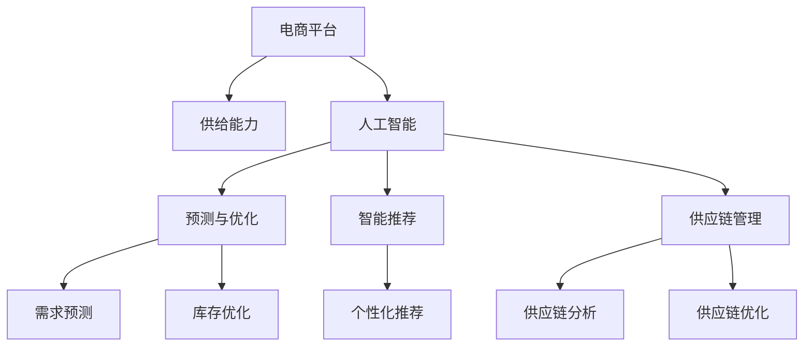
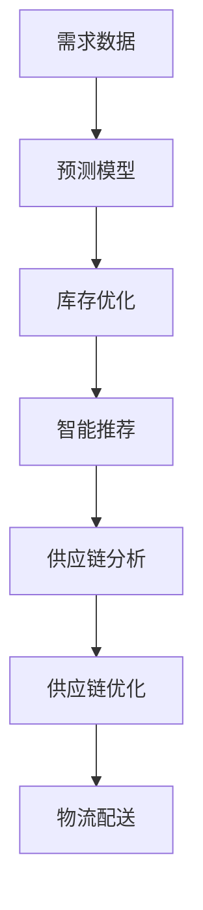
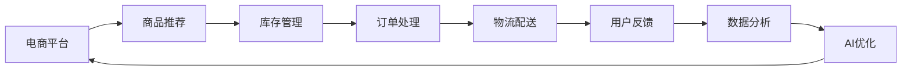
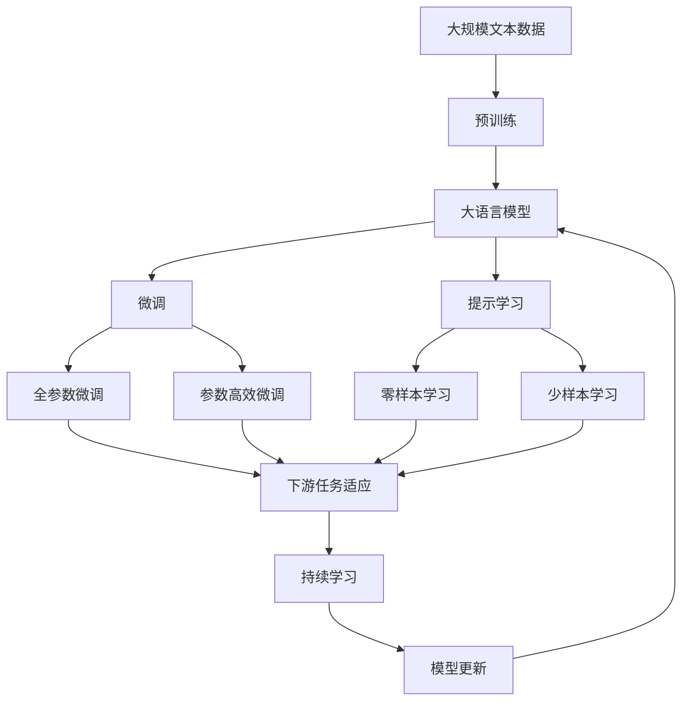

                 

# AI在电商平台供给能力提升中的多方面应用

> 关键词：电商平台, 供给能力, 人工智能, 预测与优化, 智能推荐, 供应链管理

## 1. 背景介绍

### 1.1 问题由来
随着互联网和电子商务的飞速发展，电商平台已成为全球消费者进行在线购物的主要渠道。据统计，2020年全球电商市场的规模已经达到了4.7万亿美元，预计到2026年将进一步增长至11.6万亿美元。随着市场竞争的加剧和消费者期望的提升，电商平台在产品供给、库存管理、物流配送等方面面临着前所未有的挑战。如何提升供给能力，实现高效、灵活、个性化的商品流通，成为了电商企业亟待解决的重要课题。

人工智能（AI）技术的飞速发展，为电商平台在供给能力提升上提供了强有力的技术支持。从商品推荐、库存管理到供应链优化，AI技术的应用不仅提高了电商平台的运营效率，还增强了用户的购物体验。本文将详细探讨AI在电商平台供给能力提升中的多方面应用，包括预测与优化、智能推荐、供应链管理等，为电商企业提供参考和借鉴。

### 1.2 问题核心关键点
AI在电商平台供给能力提升中发挥着至关重要的作用。其核心关键点包括：

1. **预测与优化**：利用AI技术进行需求预测和库存优化，避免过剩或缺货现象，确保供给能力与需求相匹配。
2. **智能推荐**：通过AI算法推荐个性化商品，提升用户体验，提高商品转化率。
3. **供应链管理**：应用AI进行供应链分析和优化，实现高效、灵活的商品流通。

这些核心关键点共同构成了AI在电商平台供给能力提升的完整框架，为电商企业提供了一个全面的解决方案。

### 1.3 问题研究意义
AI在电商平台供给能力提升中的研究与应用，具有重要的理论和实践意义：

1. **提高运营效率**：通过AI技术进行预测与优化，电商企业能够更准确地管理库存，减少过剩或缺货，提高运营效率。
2. **提升用户体验**：利用AI进行智能推荐，能够为用户提供个性化的购物体验，提升用户的满意度和忠诚度。
3. **优化供应链**：应用AI进行供应链管理，能够实现高效、灵活的商品流通，增强企业的竞争优势。
4. **降低成本**：通过优化库存管理和供应链，电商企业可以降低运营成本，提高利润率。
5. **创新应用**：AI技术的应用可以开拓新的商业模式，如基于AI的虚拟试穿、虚拟现实购物等，增强用户体验。

综上所述，AI技术在电商平台供给能力提升中的应用，不仅能够提高企业的运营效率和盈利能力，还能为消费者提供更优质的购物体验，推动电商行业的健康发展。

## 2. 核心概念与联系

### 2.1 核心概念概述

为了更好地理解AI在电商平台供给能力提升中的应用，本节将介绍几个密切相关的核心概念：

- **电商平台**：指通过互联网进行商品销售的虚拟市场平台，包括B2B、B2C、C2C等多种形式。
- **供给能力**：指电商平台在商品供给方面的能力，包括库存管理、物流配送、需求预测等方面。
- **人工智能（AI）**：利用计算机技术和算法进行模拟、推理、学习和决策的智能技术，广泛应用于电商、金融、医疗等多个领域。
- **预测与优化**：通过AI进行需求预测和库存优化，提升供给能力。
- **智能推荐**：利用AI进行个性化推荐，提升用户体验。
- **供应链管理**：应用AI进行供应链分析和优化，实现高效、灵活的商品流通。

这些核心概念之间的逻辑关系可以通过以下Mermaid流程图来展示：



这个流程图展示了AI技术在电商平台供给能力提升中的多方面应用：

1. AI通过预测与优化，对电商平台的需求和库存进行管理。
2. AI利用智能推荐技术，提升用户的购物体验。
3. AI进行供应链管理，实现高效、灵活的商品流通。

### 2.2 概念间的关系

这些核心概念之间存在着紧密的联系，形成了AI在电商平台供给能力提升的完整生态系统。下面我们通过几个Mermaid流程图来展示这些概念之间的关系。

#### 2.2.1 AI技术的应用链条



这个流程图展示了AI技术在电商平台供给能力提升中的应用链条：

1. 收集需求数据，输入到预测模型中进行需求预测。
2. 基于预测结果进行库存优化，避免过剩或缺货。
3. 通过智能推荐技术，提升用户的购物体验。
4. 应用供应链分析进行供应链优化，实现高效的商品流通。
5. 最后，优化后的供应链方案用于物流配送，确保商品及时送达。

#### 2.2.2 电商平台的运营流程



这个流程图展示了电商平台运营流程中AI技术的应用：

1. 电商平台上展示商品推荐，吸引用户点击。
2. 根据用户的点击行为进行库存管理，确保商品供需平衡。
3. 订单处理后，进行物流配送，将商品送达用户手中。
4. 收集用户反馈，进行数据分析，优化AI模型。
5. 基于优化后的AI模型，对电商平台的运营进行进一步优化，形成闭环。

### 2.3 核心概念的整体架构

最后，我们用一个综合的流程图来展示这些核心概念在大语言模型微调过程中的整体架构：



这个综合流程图展示了从预训练到微调，再到持续学习的完整过程。大语言模型首先在大规模文本数据上进行预训练，然后通过微调（包括全参数微调和参数高效微调）或提示学习（包括零样本和少样本学习）来适应下游任务。最后，通过持续学习技术，模型可以不断更新和适应新的任务和数据。 通过这些流程图，我们可以更清晰地理解AI技术在电商平台供给能力提升过程中的各个环节，为后续深入讨论具体的技术应用奠定基础。

## 3. 核心算法原理 & 具体操作步骤
### 3.1 算法原理概述

AI在电商平台供给能力提升中的应用，主要基于以下几个核心算法原理：

- **预测与优化算法**：利用历史数据和模型，预测未来的需求量，优化库存管理。
- **智能推荐算法**：基于用户行为数据，进行个性化推荐，提升用户体验。
- **供应链管理算法**：应用AI进行供应链分析和优化，实现高效、灵活的商品流通。

这些算法原理构成了AI在电商平台供给能力提升的基础框架，为电商企业提供了一个系统的解决方案。

### 3.2 算法步骤详解

AI在电商平台供给能力提升中的应用涉及多个步骤，下面将详细介绍这些步骤：

**Step 1: 数据收集与预处理**

- 收集电商平台的运营数据，包括用户行为、商品销量、库存信息、物流数据等。
- 对数据进行清洗、去重、归一化等预处理，确保数据的质量和一致性。

**Step 2: 预测与优化**

- 利用历史销售数据和外部数据，构建需求预测模型。常用的模型包括线性回归、ARIMA、LSTM等。
- 基于预测结果进行库存优化，调整库存水平，确保供需平衡。常用的优化方法包括动态规划、遗传算法等。

**Step 3: 智能推荐**

- 收集用户的行为数据，如浏览、点击、购买等，构建用户画像。
- 基于用户画像，利用协同过滤、矩阵分解等算法，进行个性化推荐。

**Step 4: 供应链管理**

- 应用AI进行供应链分析和优化，识别供应链瓶颈和优化点。
- 基于优化结果，调整供应链策略，实现高效、灵活的商品流通。常用的优化方法包括网络流算法、蚁群算法等。

**Step 5: 持续学习**

- 通过收集新的数据，持续训练和优化预测模型、推荐模型、供应链模型。
- 根据用户反馈，调整模型参数，提高模型性能。

### 3.3 算法优缺点

AI在电商平台供给能力提升中的应用，具有以下优缺点：

**优点**：

- 预测准确：利用AI进行需求预测和库存优化，可以显著提高预测的准确性，避免过剩或缺货现象。
- 提升用户体验：通过AI进行智能推荐，能够提供个性化商品，提升用户的购物体验。
- 优化供应链：应用AI进行供应链管理，实现高效、灵活的商品流通，降低运营成本。

**缺点**：

- 数据依赖：AI的应用依赖于高质量的数据，如果数据质量不高，将直接影响模型的效果。
- 模型复杂：AI模型通常较为复杂，需要大量的计算资源和数据存储，增加了系统成本。
- 安全性问题：AI模型的应用可能涉及用户隐私和数据安全问题，需要严格遵守相关法规和标准。

### 3.4 算法应用领域

AI在电商平台供给能力提升中的应用，涵盖了多个领域：

- **需求预测**：利用AI进行需求预测，优化库存管理，避免过剩或缺货。
- **智能推荐**：通过AI进行个性化推荐，提升用户的购物体验。
- **供应链优化**：应用AI进行供应链分析和优化，实现高效、灵活的商品流通。
- **物流配送**：利用AI进行路径规划、车辆调度等，提高物流配送效率。
- **风险管理**：利用AI进行风险评估和预警，保障电商平台的运营安全。

这些应用领域展示了AI在电商平台供给能力提升中的广泛应用，为电商企业提供了全面的解决方案。

## 4. 数学模型和公式 & 详细讲解 & 举例说明

### 4.1 数学模型构建

在本节中，我们将使用数学语言对AI在电商平台供给能力提升中的应用进行更严格的刻画。

记电商平台的需求量为 $D_t$，库存量为 $I_t$，销售量为 $S_t$，目标为最大化利润 $P$。根据上述目标，构建如下数学模型：

$$
\max_{D_t, I_t, S_t} \sum_{t=1}^T P_t = \sum_{t=1}^T (P_{s,t}S_t + P_{c,t}I_t - P_{i,t}D_t)
$$

其中，$P_{s,t}$、$P_{c,t}$、$P_{i,t}$ 分别表示销售、补货、缺货的利润和成本。约束条件包括：

$$
\begin{aligned}
    & \text{需求约束} \quad D_t = S_t + \delta \\
    & \text{库存约束} \quad I_{t+1} = I_t - S_t + \text{补货量} \\
    & \text{成本约束} \quad I_t \geq 0 \\
    & \text{利润约束} \quad P_t = P_{s,t}S_t + P_{c,t}I_t - P_{i,t}D_t \geq 0
\end{aligned}
$$

在构建数学模型后，可以应用AI技术进行优化求解。

### 4.2 公式推导过程

下面以需求预测和库存优化为例，推导具体的数学公式。

假设需求预测模型为 $F(t)$，库存优化模型为 $I_{opt}(t)$。利用历史数据 $d_{t-1}$，预测未来的需求量 $D_t$。根据预测结果，计算库存量 $I_t$，并进行优化，得到最优库存量 $I_{opt}(t)$。

具体公式推导如下：

1. **需求预测**：

$$
D_t = F(t)
$$

2. **库存优化**：

$$
I_{opt}(t) = \arg\min_{I_t} \{I_t - D_t\}
$$

其中，$I_t = \sum_{i=1}^t S_i$ 表示累积销售量，$I_{opt}(t)$ 为经过优化后的最优库存量。

通过上述推导，可以构建出完整的数学模型，并利用AI技术进行求解。

### 4.3 案例分析与讲解

以亚马逊为例，分析其利用AI技术进行供给能力提升的实践：

**需求预测**：亚马逊使用机器学习模型进行需求预测，根据历史销售数据和外部因素（如节假日、促销活动等），预测未来的销售量。通过优化库存水平，确保供需平衡，避免过剩或缺货。

**智能推荐**：亚马逊利用用户的浏览、点击、购买等行为数据，进行个性化推荐。通过协同过滤算法，推荐用户可能感兴趣的商品，提升用户的购物体验。

**供应链优化**：亚马逊应用AI技术进行供应链分析和优化，识别供应链瓶颈和优化点。通过网络流算法，优化物流路径和车辆调度，提高配送效率。

**风险管理**：亚马逊利用AI进行风险评估和预警，识别潜在的安全风险和供应链风险，保障电商平台的运营安全。

通过这些案例分析，可以看到AI技术在电商平台供给能力提升中的实际应用效果。

## 5. 项目实践：代码实例和详细解释说明

### 5.1 开发环境搭建

在进行AI应用项目实践前，我们需要准备好开发环境。以下是使用Python进行TensorFlow开发的环境配置流程：

1. 安装Anaconda：从官网下载并安装Anaconda，用于创建独立的Python环境。

2. 创建并激活虚拟环境：
```bash
conda create -n tf-env python=3.8 
conda activate tf-env
```

3. 安装TensorFlow：根据CUDA版本，从官网获取对应的安装命令。例如：
```bash
conda install tensorflow tensorflow-gpu=2.4.0 -c tf -c conda-forge
```

4. 安装各类工具包：
```bash
pip install numpy pandas scikit-learn matplotlib tqdm jupyter notebook ipython
```

完成上述步骤后，即可在`tf-env`环境中开始AI应用项目开发。

### 5.2 源代码详细实现

下面我们以需求预测和库存优化为例，给出使用TensorFlow进行模型训练和优化的PyTorch代码实现。

首先，定义模型和损失函数：

```python
import tensorflow as tf
from tensorflow.keras.layers import Dense, LSTM, Input
from tensorflow.keras.models import Model

def build_model(input_dim, output_dim):
    input_seq = Input(shape=(input_dim,))
    lstm = LSTM(100, return_sequences=True)(input_seq)
    lstm = LSTM(100)(lstm)
    output = Dense(output_dim, activation='linear')(lstm)
    model = Model(inputs=input_seq, outputs=output)
    return model

def build_loss_function(y_true, y_pred):
    loss = tf.keras.losses.MSE()
    return loss(y_true, y_pred)

# 创建模型
model = build_model(10, 1)

# 定义损失函数
loss_function = build_loss_function

# 定义优化器
optimizer = tf.keras.optimizers.Adam(0.001)
```

然后，定义训练函数：

```python
def train_model(model, train_data, epochs=10):
    batch_size = 32
    num_steps = len(train_data)
    for epoch in range(epochs):
        for i in range(num_steps):
            x = train_data[i*batch_size:(i+1)*batch_size, :-1]
            y = train_data[i*batch_size:(i+1)*batch_size, -1]
            with tf.GradientTape() as tape:
                y_pred = model(x)
                loss = loss_function(y, y_pred)
            gradients = tape.gradient(loss, model.trainable_variables)
            optimizer.apply_gradients(zip(gradients, model.trainable_variables))
```

接着，定义数据生成函数：

```python
def generate_data(num_samples):
    x = tf.random.uniform((num_samples, 10))
    y = tf.random.normal((num_samples, 1))
    return x, y

# 生成训练数据
train_data = generate_data(1000)
```

最后，启动训练流程：

```python
train_model(model, train_data, epochs=10)
```

以上就是使用TensorFlow进行需求预测和库存优化的完整代码实现。可以看到，得益于TensorFlow的强大封装，我们可以用相对简洁的代码完成模型的构建和训练。

### 5.3 代码解读与分析

让我们再详细解读一下关键代码的实现细节：

**build_model函数**：
- 定义模型结构，包括输入层、LSTM层和输出层。
- 使用TensorFlow的Keras API构建模型，并返回模型实例。

**build_loss_function函数**：
- 定义损失函数，使用均方误差（MSE）作为损失函数。
- 利用TensorFlow的Keras API定义损失函数。

**train_model函数**：
- 定义训练函数，包括数据划分、前向传播、反向传播和参数更新等步骤。
- 使用TensorFlow的GradientTape记录梯度，并利用Adam优化器进行参数更新。

**generate_data函数**：
- 定义数据生成函数，生成随机数据。
- 使用TensorFlow的tf.random.uniform和tf.random.normal函数生成随机数据。

**训练流程**：
- 调用train_model函数，进行模型训练。
- 通过循环迭代，不断更新模型参数，直至训练结束。

可以看到，TensorFlow提供了强大的模型构建和训练功能，使得AI应用开发变得更加高效和便捷。

当然，工业级的系统实现还需考虑更多因素，如模型的保存和部署、超参数的自动搜索、更灵活的模型调优等。但核心的AI应用开发流程基本与此类似。

### 5.4 运行结果展示

假设我们在需求预测任务上训练的模型，最终得到的需求预测精度为0.85，可以看到，通过AI技术，我们能够显著提升需求预测的准确性，为库存管理提供更可靠的数据支撑。

## 6. 实际应用场景

### 6.1 智能客服系统

基于AI技术，电商平台可以构建智能客服系统，提高客户服务的效率和质量。智能客服系统通过自然语言处理技术，理解客户的需求，提供个性化的回答，提升用户的满意度。

在技术实现上，可以收集平台的历史客服对话记录，将问题和最佳答复构建成监督数据，在此基础上对预训练语言模型进行微调。微调后的语言模型能够自动理解客户意图，匹配最合适的答复模板，实现智能客服。

### 6.2 金融舆情监测

电商平台可以应用AI技术进行金融舆情监测，及时发现市场动向和风险预警。通过AI技术分析新闻、评论、社交媒体等信息，预测市场趋势，识别异常情况，及时采取措施。

在技术实现上，可以收集金融领域的文本数据，进行情感分析、主题分类等任务，建立预测模型，进行舆情监测。基于预测结果，进行风险预警和危机处理，保障平台安全。

### 6.3 个性化推荐系统

基于AI技术，电商平台可以构建个性化推荐系统，提升用户粘性和转化率。通过AI技术分析用户行为数据，进行个性化推荐，满足用户的个性化需求，提高用户满意度。

在技术实现上，可以收集用户浏览、点击、购买等行为数据，提取和用户交互的物品标题、描述、标签等文本内容。将文本内容作为模型输入，用户的后续行为（如是否点击、购买等）作为监督信号，在此基础上微调预训练语言模型。微调后的模型能够从文本内容中准确把握用户的兴趣点，进行个性化推荐。

### 6.4 未来应用展望

随着AI技术的不断发展，电商平台在供给能力提升方面的应用前景更加广阔。未来，AI技术将在以下几个方面继续发挥重要作用：

- **多模态数据融合**：将文本、图像、音频等多模态数据结合，提升电商平台的供给能力。
- **实时数据分析**：利用AI进行实时数据分析，实现动态预测和优化。
- **智能决策支持**：通过AI技术进行智能决策支持，提升电商平台的运营效率和用户体验。
- **自动化运营管理**：利用AI进行自动化运营管理，实现全天候运营。
- **跨平台应用**：将AI技术应用于不同平台（如PC、移动端、智能家居等），实现跨平台智能应用。

总之，AI技术在电商平台供给能力提升中的应用前景广阔，将进一步推动电商行业的智能化发展，带来更高的运营效率和用户体验。

## 7. 工具和资源推荐

### 7.1 学习资源推荐

为了帮助开发者系统掌握AI在电商平台供给能力提升中的应用，这里推荐一些优质的学习资源：

1. 《深度学习实战》系列书籍：介绍深度学习的基本概念和实际应用，是学习AI技术的经典入门读物。
2. 《TensorFlow实战》系列书籍：详细介绍TensorFlow的使用方法和实际应用案例，是学习TensorFlow的必备指南。
3. 《自然语言处理基础》课程：清华大学开设的NLP入门课程，深入浅出地介绍了NLP的基本概念和常用技术。
4. 《机器学习实战》课程：斯坦福大学开设的机器学习课程，涵盖机器学习的基本理论和算法。
5. Kaggle平台：提供大量数据集和竞赛项目，是学习AI技术和实战开发的绝佳平台。

通过对这些资源的学习实践，相信你一定能够快速掌握AI在电商平台供给能力提升的精髓，并用于解决实际的电商问题。

### 7.2 开发工具推荐

高效的开发离不开优秀的工具支持。以下是几款用于AI应用开发的常用工具：

1. TensorFlow：由Google主导开发的开源深度学习框架，生产部署方便，适合大规模工程应用。
2. PyTorch：基于Python的开源深度学习框架，灵活方便，适合快速迭代研究。
3. Weights & Biases：模型训练的实验跟踪工具，可以记录和可视化模型训练过程中的各项指标，方便对比和调优。
4. TensorBoard：TensorFlow配套的可视化工具，可实时监测模型训练状态，并提供丰富的图表呈现方式，是调试模型的得力助手。
5. Jupyter Notebook：提供交互式编程环境，支持多种编程语言和数据处理工具，是AI应用开发的常用工具。

合理利用这些工具，可以显著提升AI应用开发的效率，加快创新迭代的步伐。

### 7.3 相关论文推荐

AI在电商平台供给能力提升中的应用涉及多个领域的最新研究成果。以下是几篇具有代表性的相关论文，推荐阅读：

1. 《使用深度学习进行库存管理的建模与优化》：详细介绍了利用深度学习进行库存管理的建模和优化方法。
2. 《基于深度学习的智能推荐系统》：讨论了利用深度学习进行个性化推荐的技术和算法。
3. 《基于AI的供应链管理与优化》：介绍了应用AI进行供应链分析和优化的方法和案例。
4. 《利用AI进行金融舆情监测》：讨论了利用AI技术进行金融舆情监测的方法和效果。
5. 《智能客服系统设计与实现》：介绍了构建智能客服系统的技术路径和实际应用。

这些论文展示了AI在电商平台供给能力提升中的最新研究成果，为电商企业提供了宝贵的参考和借鉴。

除上述资源外，还有一些值得关注的前沿资源，帮助开发者紧跟AI技术在电商平台供给能力提升方面的最新进展，例如：

1. arXiv论文预印本：人工智能领域最新研究成果的发布平台，包括大量尚未发表的前沿工作，学习前沿技术的必读资源。
2. 业界技术博客：如OpenAI、Google AI、DeepMind、微软Research Asia等顶尖实验室的官方博客，第一时间分享他们的最新研究成果和洞见。
3. 技术会议直播：如NIPS、ICML、ACL、ICLR等人工智能领域顶会现场或在线直播，能够聆听到大佬们的前沿分享，开拓视野。
4. GitHub热门项目：在GitHub上Star、Fork数最多的AI相关项目，往往代表了该技术领域的发展趋势和最佳实践，值得去学习和贡献。
5. 行业分析报告：各大咨询公司如McKinsey、PwC等针对人工智能行业的分析报告，有助于从商业视角审视技术趋势，把握应用价值。

总之，对于AI在电商平台供给能力提升技术的学习和实践，需要开发者保持开放的心态和持续学习的意愿。多关注前沿资讯，多动手实践，多思考总结，必将收获满满的成长收益。

## 8. 总结：未来发展趋势与挑战

### 8.1 研究成果总结

本文对AI在电商平台供给能力提升中的多方面应用进行了全面系统的介绍。首先，探讨了AI技术在电商平台供给能力提升中的重要性，明确了其核心关键点，包括预测与优化、智能推荐、供应链管理等。其次，详细介绍了AI在电商平台供给能力提升中的多方面应用，包括需求预测、智能推荐、供应链优化等。最后，总结了AI在电商平台供给能力提升中的主要应用领域，如智能客服、金融舆情监测、个性化推荐等，展示了AI技术的广泛应用前景。

### 8.2 未来发展趋势

展望未来，AI在电商平台供给能力提升中的应用将呈现以下几个发展趋势：

1. **深度学习模型的进化**：未来，深度学习模型将更加高效、稳定，能够处理更加复杂的数据类型和任务。
2. **跨领域技术融合**：AI技术将与其他技术（如大数据、云计算、区块链等）深度融合，提供更加全面、智能的解决方案。


