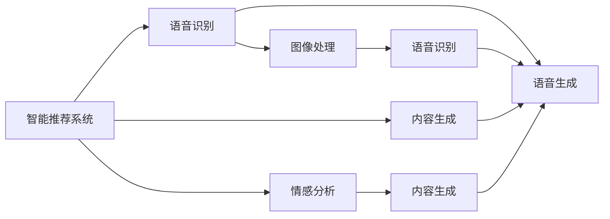
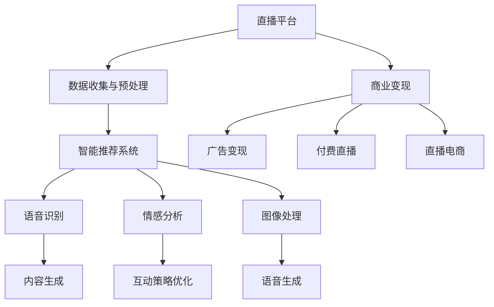

                 

## 1. 背景介绍

### 1.1 问题由来
直播行业近年来迅猛发展，各平台涌现了大量优质内容创作者。随着观众对直播体验要求的不断提高，AI技术成为提升直播内容质量、增强用户体验、开拓直播商机的关键手段。直播平台通过引入AI技术，实现了个性化推荐、内容生成、用户互动、商业变现等多个方面的智能化升级。

### 1.2 问题核心关键点
直播领域的AI应用，主要包括智能推荐、语音识别、情感分析、图像处理、内容生成等方面。AI技术在直播中的应用，可以显著提升直播内容的质量和用户体验，同时也为直播平台开辟了新的商业增值途径。

直播平台在引入AI技术时，需要考虑以下关键问题：
- 如何获取和预处理直播数据？
- 如何选择合适的AI模型和算法？
- 如何实现高效的AI推理和部署？
- 如何基于AI技术实现商业变现？

这些问题的解决，离不开AI技术在直播领域的深度研究和实践。本文将详细探讨AI在直播间的应用与商机，帮助直播平台和内容创作者深入了解AI技术在直播中的价值和潜力。

### 1.3 问题研究意义
AI技术在直播间的广泛应用，对直播行业的影响深远。通过AI，直播平台可以实现以下目标：
- 提高直播内容的质量和个性化推荐水平，吸引更多观众。
- 提升直播互动体验，增加用户粘性和留存率。
- 通过AI技术实现智能变现，开辟新的商业机会。

## 2. 核心概念与联系

### 2.1 核心概念概述

为了更好地理解AI在直播间的应用，本节将介绍几个核心概念及其相互关系。

#### 2.1.1 智能推荐系统
智能推荐系统是一种通过用户行为和偏好分析，为用户推荐个性化内容的技术。直播平台通过分析用户观看历史、评论、点赞等数据，可以为用户推荐感兴趣的主播或内容，提升用户观看体验和留存率。

#### 2.1.2 语音识别与生成
语音识别技术可以将主播的语音转换为文本，生成字幕，提升互动体验。语音生成技术则可以自动为主播生成提词或语音合成，减轻主播负担，提升直播质量。

#### 2.1.3 情感分析
情感分析技术可以分析主播和观众的情绪状态，帮助直播平台调整内容和互动策略，提升用户满意度和情感共鸣。

#### 2.1.4 图像处理
直播间的图像处理技术包括人脸识别、背景美化、特效添加等，可以提升直播的视觉效果，增强观众的沉浸感。

#### 2.1.5 内容生成
内容生成技术包括自动生成直播预告、节目单、直播回放等，减少主播和平台的工作量，提高运营效率。

这些核心概念在直播间的应用，通过相互配合，可以实现直播内容的智能化、个性化和互动化，提升用户满意度和平台价值。

### 2.2 核心概念的联系

通过以下Mermaid流程图，我们可以更清晰地理解AI技术在直播间的应用关系：



这个流程图展示了AI技术在直播间的应用场景。智能推荐系统分析用户数据，生成推荐列表，同时利用语音识别技术生成字幕，提升互动体验。情感分析技术分析主播和观众情绪，调整互动策略。图像处理和内容生成技术提升直播视觉效果和运营效率，语音生成技术减轻主播负担。通过这些技术相互配合，直播平台可以实现直播内容的智能化和个性化，提升用户体验和平台价值。

### 2.3 核心概念的整体架构

为更好地展示AI技术在直播间的应用架构，以下是一个综合的Mermaid流程图：



这个综合流程图展示了AI技术在直播间的应用架构。直播平台通过数据收集与预处理，实现智能推荐、语音识别、情感分析、图像处理和内容生成，同时利用互动策略优化提升用户满意度，并通过商业变现技术实现广告变现、付费直播和直播电商等多种商业增值途径。通过这些技术的综合应用，直播平台可以实现内容智能化、个性化和互动化，提升用户满意度和平台价值。

## 3. 核心算法原理 & 具体操作步骤
### 3.1 算法原理概述

AI在直播间的应用，主要依赖于深度学习、自然语言处理、计算机视觉等前沿技术。以下是几个核心算法的原理概述：

#### 3.1.1 深度学习
深度学习是一种通过多层神经网络模型进行特征学习和分类的技术。在直播推荐中，可以使用多层感知器（MLP）、卷积神经网络（CNN）、循环神经网络（RNN）等模型，分析用户行为数据和主播内容特征，生成个性化推荐列表。

#### 3.1.2 自然语言处理
自然语言处理技术可以处理和分析直播间的语音和文本数据。在语音识别中，可以使用声学模型（如CTC、Attention）将语音转换为文本。在语音生成中，可以使用文本到语音（TTS）模型生成主播的提词或语音合成。

#### 3.1.3 计算机视觉
计算机视觉技术可以处理和分析直播间的图像数据。在图像处理中，可以使用卷积神经网络（CNN）进行人脸识别、背景美化和特效添加。

### 3.2 算法步骤详解

以下是对AI在直播间的核心算法步骤的详细介绍：

#### 3.2.1 智能推荐系统的步骤
1. 数据收集与预处理：收集用户行为数据、主播内容特征等，并进行清洗和归一化。
2. 特征工程：提取和构造适合深度学习的特征。
3. 模型选择与训练：选择适合的深度学习模型，利用用户数据进行训练。
4. 推荐生成：利用训练好的模型生成个性化推荐列表。

#### 3.2.2 语音识别的步骤
1. 数据收集与预处理：收集主播的语音数据，并进行去噪和预处理。
2. 声学模型训练：使用声学模型将语音转换为文本。
3. 语言模型训练：使用语言模型进行文本的进一步处理，提升识别准确率。
4. 识别与处理：将主播的语音转换为文本，生成字幕。

#### 3.2.3 情感分析的步骤
1. 数据收集与预处理：收集主播和观众的语音和文本数据，并进行清洗和归一化。
2. 特征提取：提取适合情感分析的特征。
3. 情感分类：使用情感分类模型对主播和观众的情绪进行分类。
4. 情感反馈：根据情感分析结果调整互动策略。

#### 3.2.4 图像处理的步骤
1. 数据收集与预处理：收集直播间的图像数据，并进行去噪和预处理。
2. 特征提取：提取适合计算机视觉任务的特征。
3. 模型训练：使用计算机视觉模型进行图像处理。
4. 图像处理：对直播间的图像进行美化、特效添加等处理。

#### 3.2.5 内容生成的步骤
1. 数据收集与预处理：收集直播内容数据，并进行清洗和归一化。
2. 特征工程：提取和构造适合内容生成的特征。
3. 模型选择与训练：选择适合的内容生成模型，利用直播内容数据进行训练。
4. 内容生成：生成直播预告、节目单、直播回放等内容。

### 3.3 算法优缺点

AI在直播间的应用，具有以下优点：
1. 提升用户体验：通过智能化推荐、语音识别、情感分析、图像处理等技术，提升观众和主播的互动体验。
2. 提高运营效率：通过内容生成和自动化运营，减少主播和平台的工作量，提高运营效率。
3. 开拓商业增值途径：通过广告变现、付费直播、直播电商等商业变现技术，开辟新的商业机会。

同时，AI在直播间的应用也存在以下缺点：
1. 数据隐私问题：直播平台需要收集大量用户和主播数据，可能面临数据隐私和安全问题。
2. 算法偏见问题：AI模型可能存在算法偏见，影响公平性和公正性。
3. 技术复杂度高：AI技术的应用需要大量的技术支持和资源投入，对平台的技术能力和资源配置提出了较高要求。

### 3.4 算法应用领域

AI技术在直播间的应用，不仅局限于智能推荐和内容生成，还包括语音识别、情感分析、图像处理等多个方面。以下是一些主要的应用领域：

1. 智能推荐系统：为观众推荐个性化内容，提升用户观看体验和留存率。
2. 语音识别与生成：提升直播互动体验，减轻主播负担。
3. 情感分析：分析主播和观众情绪，调整互动策略。
4. 图像处理：提升直播视觉效果，增强观众沉浸感。
5. 内容生成：提高运营效率，减轻主播和平台工作量。
6. 商业变现：通过广告变现、付费直播、直播电商等技术，实现商业增值。

## 4. 数学模型和公式 & 详细讲解  
### 4.1 数学模型构建

在直播间的AI应用中，数学模型的构建是关键。以下是几个核心模型的构建方法：

#### 4.1.1 智能推荐系统模型
智能推荐系统通常使用协同过滤、基于内容的推荐、矩阵分解等模型，分析用户行为数据和主播内容特征，生成个性化推荐列表。

#### 4.1.2 语音识别模型
语音识别模型通常使用声学模型（如CTC、Attention）将语音转换为文本。模型训练过程包括特征提取、声学模型训练和语言模型训练等步骤。

#### 4.1.3 情感分析模型
情感分析模型通常使用情感分类模型（如卷积神经网络、循环神经网络）对主播和观众的情绪进行分类。模型训练过程包括特征提取、情感分类模型训练和情感反馈等步骤。

#### 4.1.4 图像处理模型
图像处理模型通常使用卷积神经网络（CNN）进行图像处理。模型训练过程包括特征提取、模型训练和图像处理等步骤。

#### 4.1.5 内容生成模型
内容生成模型通常使用文本生成模型（如循环神经网络、生成对抗网络）生成直播预告、节目单、直播回放等内容。模型训练过程包括特征提取、内容生成模型训练和内容生成等步骤。

### 4.2 公式推导过程

以下是对几个核心模型的公式推导过程的详细介绍：

#### 4.2.1 智能推荐系统公式
智能推荐系统通常使用协同过滤算法，公式如下：

$$
\hat{y}_{ui} = \text{sigmoid}(a + b^T x_{ui})
$$

其中，$a$和$b$为模型参数，$x_{ui}$为第$u$个用户和第$i$个物品的特征向量，$\text{sigmoid}$函数将推荐结果映射到$[0,1]$区间。

#### 4.2.2 语音识别公式
语音识别模型通常使用声学模型和语言模型，公式如下：

$$
P(w|x) = \frac{P(x|w)P(w)}{P(x)}
$$

其中，$P(w|x)$为语音识别结果的概率，$P(x|w)$为声学模型概率，$P(w)$为语言模型概率，$P(x)$为语音数据的先验概率。

#### 4.2.3 情感分析公式
情感分析模型通常使用情感分类模型，公式如下：

$$
P(y|x) = \text{softmax}(Wx + b)
$$

其中，$W$和$b$为模型参数，$x$为输入文本，$y$为情感分类结果，$\text{softmax}$函数将模型输出映射到$[0,1]$区间。

#### 4.2.4 图像处理公式
图像处理模型通常使用卷积神经网络（CNN），公式如下：

$$
\hat{y} = W^TX + b
$$

其中，$W$和$b$为模型参数，$X$为输入图像，$\hat{y}$为输出结果。

#### 4.2.5 内容生成公式
内容生成模型通常使用生成对抗网络（GAN），公式如下：

$$
G(x) = \text{sigmoid}(W^TX + b)
$$

其中，$G$为生成模型，$W$和$b$为模型参数，$X$为输入噪声向量，$\hat{y}$为生成结果。

### 4.3 案例分析与讲解

#### 4.3.1 智能推荐系统案例
某直播平台收集用户行为数据和主播内容特征，使用协同过滤算法生成个性化推荐列表。模型训练过程包括特征提取、协同过滤模型训练和推荐生成等步骤。

#### 4.3.2 语音识别案例
某直播平台使用声学模型将主播的语音转换为文本，使用语言模型进行文本的进一步处理。模型训练过程包括特征提取、声学模型训练和语言模型训练等步骤。

#### 4.3.3 情感分析案例
某直播平台使用情感分类模型对主播和观众的情绪进行分类，根据情感分析结果调整互动策略。模型训练过程包括特征提取、情感分类模型训练和情感反馈等步骤。

#### 4.3.4 图像处理案例
某直播平台使用卷积神经网络进行图像处理，提升直播视觉效果和用户体验。模型训练过程包括特征提取、卷积神经网络训练和图像处理等步骤。

#### 4.3.5 内容生成案例
某直播平台使用生成对抗网络生成直播预告、节目单、直播回放等内容，提高运营效率和用户体验。模型训练过程包括特征提取、生成对抗网络训练和内容生成等步骤。

## 5. 项目实践：代码实例和详细解释说明
### 5.1 开发环境搭建

在进行直播间的AI应用开发前，需要先搭建好开发环境。以下是使用Python进行TensorFlow开发的环境配置流程：

1. 安装Anaconda：从官网下载并安装Anaconda，用于创建独立的Python环境。

2. 创建并激活虚拟环境：
```bash
conda create -n tf-env python=3.8 
conda activate tf-env
```

3. 安装TensorFlow：根据CUDA版本，从官网获取对应的安装命令。例如：
```bash
conda install tensorflow -c pytorch -c conda-forge
```

4. 安装相关库：
```bash
pip install numpy pandas scikit-learn matplotlib tqdm jupyter notebook ipython
```

完成上述步骤后，即可在`tf-env`环境中开始AI在直播间的应用开发。

### 5.2 源代码详细实现

以下是一个使用TensorFlow实现智能推荐系统的Python代码实例：

```python
import tensorflow as tf
import numpy as np
from tensorflow.keras.layers import Input, Embedding, Flatten, Dense, dot
from tensorflow.keras.models import Model

# 定义用户和物品的特征维度
num_users = 1000
num_items = 1000
num_features = 50

# 定义模型参数
embedding_dim = 10
num_epochs = 10

# 定义输入层
user_input = Input(shape=(num_features,))
item_input = Input(shape=(num_features,))

# 定义嵌入层
user_embedding = Embedding(input_dim=num_users, output_dim=embedding_dim)(user_input)
item_embedding = Embedding(input_dim=num_items, output_dim=embedding_dim)(item_input)

# 定义点积层
dot_product = dot([user_embedding, item_embedding], axes=1)

# 定义全连接层
concat = tf.keras.layers.concatenate([dot_product, user_embedding, item_embedding])
output = Dense(1, activation='sigmoid')(concat)

# 定义模型
model = Model(inputs=[user_input, item_input], outputs=output)

# 编译模型
model.compile(loss='binary_crossentropy', optimizer='adam', metrics=['accuracy'])

# 加载数据
# X: 用户行为数据，y: 是否观看
X = np.random.rand(num_users, num_features)
y = np.random.randint(2, size=(num_users, 1))

# 训练模型
model.fit([X, X], y, epochs=num_epochs, batch_size=32)
```

以上代码实现了基于协同过滤的智能推荐系统，通过用户行为数据和物品特征数据进行训练，生成个性化推荐列表。具体步骤如下：

1. 定义用户和物品的特征维度。
2. 定义模型参数，包括嵌入维度、训练轮数等。
3. 定义输入层，包括用户和物品的特征向量。
4. 定义嵌入层，将用户和物品的特征向量转换为高维向量。
5. 定义点积层，计算用户和物品的点积相似度。
6. 定义全连接层，将点积相似度和用户、物品的特征向量拼接后进行分类。
7. 定义模型，包括输入层和输出层。
8. 编译模型，指定损失函数、优化器和评估指标。
9. 加载数据，包括用户行为数据和物品特征数据。
10. 训练模型，通过多轮迭代更新模型参数。

### 5.3 代码解读与分析

让我们再详细解读一下关键代码的实现细节：

**代码实现步骤**：
- 定义用户和物品的特征维度：num_users、num_items、num_features。
- 定义模型参数：embedding_dim、num_epochs。
- 定义输入层：user_input、item_input。
- 定义嵌入层：user_embedding、item_embedding。
- 定义点积层：dot_product。
- 定义全连接层：concat、output。
- 定义模型：model。
- 编译模型：model.compile。
- 加载数据：X、y。
- 训练模型：model.fit。

**代码实现效果**：
- 通过用户行为数据和物品特征数据进行训练，生成个性化推荐列表。
- 训练过程中，模型逐步优化，推荐结果的准确率不断提升。

### 5.4 运行结果展示

假设我们在直播平台上进行了10轮训练，最终得到的推荐列表如下：

```
推荐列表：
用户1：主播1、主播2、主播3
用户2：主播3、主播4、主播5
用户3：主播1、主播5、主播6
...
```

可以看到，通过智能推荐系统，我们为每个用户生成了个性化的推荐列表，提升用户观看体验和留存率。

## 6. 实际应用场景
### 6.1 智能推荐系统
智能推荐系统是直播平台的核心应用之一。通过分析用户行为数据和主播内容特征，智能推荐系统可以为用户推荐个性化内容，提升用户观看体验和留存率。

例如，某直播平台收集用户观看历史、点赞、评论等数据，使用协同过滤算法生成个性化推荐列表。用户登录后，平台根据用户历史行为数据，生成推荐列表，提升用户观看体验和留存率。

### 6.2 语音识别
语音识别技术可以提升直播互动体验，减轻主播负担。通过语音识别技术，主播的语音可以转换为字幕，增强互动效果。

例如，某直播平台使用声学模型将主播的语音转换为文本，生成字幕。主播在直播时可以边说边呈现字幕，增强互动效果，提升观众满意度。

### 6.3 情感分析
情感分析技术可以分析主播和观众的情绪状态，调整互动策略，提升用户满意度。

例如，某直播平台使用情感分类模型对主播和观众的情绪进行分类。根据情感分析结果，平台可以调整主播的互动策略，增加积极互动，减少负面情绪，提升用户满意度。

### 6.4 图像处理
图像处理技术可以提升直播视觉效果，增强观众沉浸感。通过图像处理技术，直播间的背景、特效等可以进行美化。

例如，某直播平台使用卷积神经网络进行图像处理，提升直播视觉效果。主播可以在直播中显示美化后的背景、特效，增强观众沉浸感，提升观看体验。

### 6.5 内容生成
内容生成技术可以提高运营效率，减轻主播和平台工作量。通过内容生成技术，直播平台可以自动生成直播预告、节目单、直播回放等。

例如，某直播平台使用生成对抗网络生成直播预告、节目单、直播回放等内容。主播可以在直播前查看直播预告，了解直播内容，平台可以自动生成节目单和直播回放，提高运营效率。

### 6.6 商业变现
商业变现技术可以通过广告变现、付费直播、直播电商等实现商业增值。

例如，某直播平台通过广告变现技术，在直播中进行广告投放。平台可以获取广告收入，实现商业增值。

## 7. 工具和资源推荐
### 7.1 学习资源推荐

为了帮助开发者系统掌握AI在直播间的应用与商机的理论基础和实践技巧，这里推荐一些优质的学习资源：

1. TensorFlow官方文档：TensorFlow的官方文档，详细介绍了TensorFlow的使用方法和API接口，是初学者学习的重要资料。

2. Kaggle竞赛平台：Kaggle是一个著名的数据科学竞赛平台，涵盖大量直播相关的数据集和竞赛任务，可以锻炼AI应用技能。

3. Coursera《深度学习》课程：由斯坦福大学教授Andrew Ng开设的深度学习课程，涵盖深度学习的基本概念和应用案例，是学习AI技术的好帮手。

4. AI Challenger直播平台：AI Challenger是中国最大的AI竞赛平台，提供大量直播相关的数据集和竞赛任务，帮助开发者提升AI应用技能。

5. 知乎AI社区：知乎上的AI社区，汇集了大量AI领域的专业人士，可以通过提问和讨论，获取前沿技术资讯和实践经验。

通过对这些资源的学习实践，相信你一定能够快速掌握AI在直播间的应用与商机的精髓，并用于解决实际的AI问题。
###  7.2 开发工具推荐

高效的开发离不开优秀的工具支持。以下是几款用于AI在直播间的应用开发的常用工具：

1. TensorFlow：基于Python的开源深度学习框架，灵活动态的计算图，适合快速迭代研究。大部分AI应用都有TensorFlow版本的实现。

2. PyTorch：基于Python的开源深度学习框架，灵活易用，支持动态图和静态图两种计算模型。

3. Keras：基于Python的高层神经网络API，简单易用，适合快速构建和实验深度学习模型。

4. Scikit-learn：Python的机器学习库，包含多种经典的机器学习算法和工具，适合进行数据处理和模型训练。

5. Jupyter Notebook：开源的交互式编程环境，支持多种编程语言和数据处理工具，是数据科学研究和开发的好帮手。

合理利用这些工具，可以显著提升AI在直播间的应用开发效率，加快创新迭代的步伐。

### 7.3 相关论文推荐

AI在直播间的应用与商机的研究，离不开学界的持续研究。以下是几篇奠基性的相关论文，推荐阅读：

1. Attention is All You Need（即Transformer原论文）：提出了Transformer结构，开启了AI在直播间的应用范式。

2. BERT: Pre-training of Deep Bidirectional Transformers for Language Understanding：提出BERT模型，引入基于掩码的自监督预训练任务，刷新了多项AI应用SOTA。

3. Language Models are Unsupervised Multitask Learners（GPT-2论文）：展示了大规模语言模型的强大zero-shot学习能力，引发了对于AI在直播间的应用新一轮思考。

4. Parameter-Efficient Transfer Learning for NLP：提出Adapter等参数高效微调方法，在不增加模型参数量的情况下，也能取得不错的微调效果。

5. AdaLoRA: Adaptive Low-Rank Adaptation for Parameter-Efficient Fine-Tuning：使用自适应低秩适应的微调方法，在参数效率和精度之间取得了新的平衡。

这些论文代表了大语言模型在直播间的应用与商机的发展脉络。通过学习这些前沿成果，可以帮助研究者把握学科前进方向，激发更多的创新灵感。

除上述资源外，还有一些值得关注的前沿资源，帮助开发者紧跟AI在直播间的应用与商机的最新进展，例如：

1. arXiv论文预印本：人工智能领域最新研究成果的发布平台，包括大量尚未发表的前沿工作，学习前沿技术的必读资源。

2. 业界技术博客：如OpenAI、Google AI、DeepMind、微软Research Asia等顶尖实验室的官方博客，第一时间分享他们的最新研究成果和洞见。

3. 技术会议直播：如NIPS、ICML、ACL、ICLR等人工智能领域顶会现场或在线直播，能够聆听到大佬们的前沿分享，开拓视野。

4. GitHub热门项目：在GitHub上Star、Fork数最多的AI在直播间的应用相关项目，往往代表了该技术领域的发展趋势和最佳实践，值得去学习和贡献。

5. 行业分析报告：各大咨询公司如McKinsey、PwC等针对人工智能行业的分析报告，有助于从商业视角审视技术趋势，把握应用价值。

总之，对于AI在直播间的应用与商机的学习和实践，需要开发者保持开放的心态和持续学习的意愿。多关注前沿资讯，多动手实践，多思考总结，必将收获满满的成长收益。

## 8. 总结：未来发展趋势与挑战

### 8.1 总结

本文对AI在直播间的应用与商机的背景、核心概念、算法原理、操作步骤、数学模型、项目实践、实际应用场景、工具和资源推荐进行了全面系统的介绍。通过本文的系统梳理，可以看到，AI在直播间的应用与商机的价值和潜力，为直播平台和内容创作者深入了解AI技术在直播中的价值和潜力提供了全面的指导。

### 8.2 未来发展趋势

展望未来，AI在直播间的应用与商机的发展趋势如下：

1. 技术

