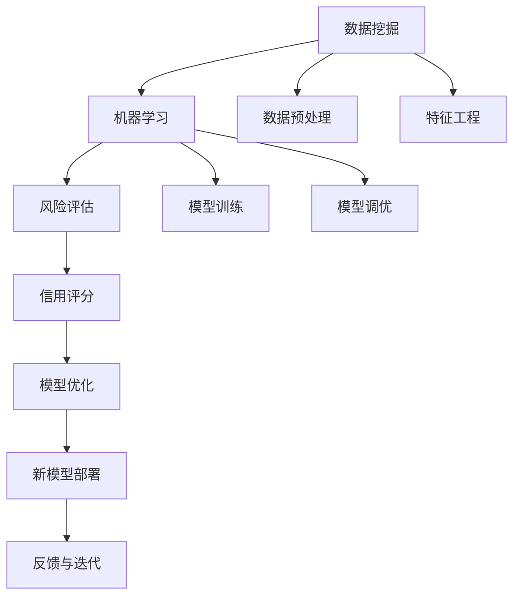

                 

# AI在金融风控中的应用:提高准确性与效率

> 关键词：人工智能,金融风控,数据挖掘,机器学习,风险评估,信用评分,模型优化

## 1. 背景介绍

### 1.1 问题由来
金融行业一直以来都面临着各种风险挑战，包括但不限于信用风险、市场风险、操作风险等。随着金融科技的迅猛发展，传统的风控方法面临着越来越大的压力和挑战。传统的风控方法通常依赖人工规则和经验，难以应对复杂多变的金融市场和不断增长的业务需求。而人工智能技术的引入，为金融风控带来了新的机遇和挑战。

人工智能技术，特别是机器学习和深度学习技术，通过数据驱动的方法，可以更精准地识别和预测金融风险，提升风控的准确性和效率。近年来，越来越多的金融机构开始引入人工智能技术，构建智能风控体系，以应对日益复杂的金融环境。

### 1.2 问题核心关键点
AI在金融风控中的应用，主要集中在数据挖掘、机器学习、风险评估、信用评分、模型优化等关键环节。核心目标是通过对大量历史数据的学习和分析，构建高效、准确的金融风险评估模型，以降低金融机构的运营风险，保障客户的金融安全。

具体来说，AI在金融风控中的应用包括以下几个关键点：

- 数据挖掘：从海量的金融交易数据中挖掘出有价值的信息，包括但不限于客户行为、交易模式、市场趋势等。
- 机器学习：利用机器学习算法对挖掘出的数据进行建模和预测，构建风险评估模型。
- 风险评估：通过风险评估模型对金融风险进行量化评估，包括但不限于信用风险、市场风险、操作风险等。
- 信用评分：通过构建信用评分模型，对客户信用风险进行预测和评估，以辅助贷款审批和授信决策。
- 模型优化：持续优化和更新风险评估模型，以适应市场变化和新的数据需求。

这些关键点相互联系，共同构成了AI在金融风控中的核心应用框架。本文将从数据挖掘、机器学习、风险评估、信用评分和模型优化等方面，系统介绍AI在金融风控中的应用，探讨如何提高风控的准确性和效率。

## 2. 核心概念与联系

### 2.1 核心概念概述

为了更好地理解AI在金融风控中的应用，我们需要了解以下几个核心概念：

- **人工智能（Artificial Intelligence, AI）**：通过模拟人类智能行为，实现信息的感知、理解、推理和学习等智能任务。
- **数据挖掘（Data Mining）**：从海量数据中发现有用信息和知识的过程，包括但不限于分类、聚类、关联规则等。
- **机器学习（Machine Learning, ML）**：利用数据驱动的方法，构建预测模型和决策规则，实现对未知数据的预测和分类。
- **风险评估（Risk Assessment）**：对金融风险进行量化评估，包括但不限于信用风险、市场风险、操作风险等。
- **信用评分（Credit Scoring）**：对客户的信用风险进行评估，辅助贷款审批和授信决策。
- **模型优化（Model Optimization）**：通过持续优化和更新模型，以适应市场变化和新的数据需求。

这些概念之间存在紧密的联系，形成了AI在金融风控中的应用生态系统。下面我们通过一个Mermaid流程图来展示这些核心概念之间的关系：



这个流程图展示了数据挖掘、机器学习、风险评估、信用评分和模型优化之间的逻辑关系：

1. **数据挖掘**：从金融交易数据中挖掘出有价值的信息，为后续机器学习建模提供数据支持。
2. **数据预处理和特征工程**：对挖掘出的数据进行清洗、归一化等预处理，同时进行特征提取和选择，构建高质量的特征向量。
3. **机器学习**：利用机器学习算法对特征向量进行建模，构建风险评估模型。
4. **风险评估**：利用风险评估模型对金融风险进行量化评估，包括但不限于信用风险、市场风险、操作风险等。
5. **信用评分**：通过构建信用评分模型，对客户信用风险进行预测和评估，以辅助贷款审批和授信决策。
6. **模型优化**：持续优化和更新风险评估模型，以适应市场变化和新的数据需求。
7. **新模型部署和反馈迭代**：在实际应用中，通过反馈机制不断优化模型，确保模型性能的持续提升。

## 3. 核心算法原理 & 具体操作步骤

### 3.1 算法原理概述

AI在金融风控中的应用，主要依赖于机器学习和深度学习算法。这些算法通过学习历史数据中的模式和规律，构建预测模型和决策规则，以实现对未知数据的预测和分类。以下是几种常用的机器学习和深度学习算法：

- **决策树（Decision Tree）**：通过构建树形结构，实现对数据的分类和回归。决策树简单易懂，适用于解释性要求较高的场景。
- **随机森林（Random Forest）**：通过集成多个决策树，提高模型的泛化能力和鲁棒性。
- **支持向量机（Support Vector Machine, SVM）**：通过构建最优超平面，实现对数据的分类和回归。SVM具有较强的泛化能力和鲁棒性。
- **神经网络（Neural Network）**：通过多层神经元模拟人类神经系统，实现对数据的非线性建模和预测。神经网络适用于处理复杂多变的数据。
- **卷积神经网络（Convolutional Neural Network, CNN）**：通过卷积操作提取数据的局部特征，实现图像和语音等数据的分类和识别。
- **循环神经网络（Recurrent Neural Network, RNN）**：通过循环结构实现序列数据的建模和预测。RNN适用于处理时序数据。
- **长短时记忆网络（Long Short-Term Memory, LSTM）**：通过门控机制实现长序列数据的建模和预测，适用于处理复杂的序列数据。
- **深度学习（Deep Learning）**：通过多层次的神经网络模型，实现对数据的高效学习和预测。深度学习适用于处理大规模复杂数据。

### 3.2 算法步骤详解

基于机器学习和深度学习算法的金融风控应用，一般包括以下几个关键步骤：

1. **数据预处理**：对原始数据进行清洗、归一化、缺失值处理等预处理操作，确保数据的质量和一致性。
2. **特征工程**：从原始数据中提取和选择有意义的特征，构建高质量的特征向量。特征工程是构建高质量模型的关键步骤。
3. **模型训练**：利用历史数据训练机器学习或深度学习模型，构建风险评估或信用评分模型。
4. **模型评估**：通过验证集对模型进行评估，选择性能最优的模型进行后续应用。
5. **模型调优**：利用反馈机制对模型进行调优，提高模型的泛化能力和鲁棒性。
6. **模型部署**：将训练好的模型部署到实际应用中，实现对新数据的预测和分类。
7. **反馈与迭代**：通过实际应用中的反馈数据，持续优化和更新模型，确保模型性能的持续提升。

### 3.3 算法优缺点

AI在金融风控中的应用，具有以下优缺点：

**优点**：

- **准确性高**：利用数据驱动的方法，可以更精准地识别和预测金融风险，降低金融机构的风险损失。
- **效率高**：自动化处理大量数据，提高了风控工作的效率和响应速度。
- **鲁棒性强**：通过学习大量数据，构建了泛化能力强的模型，可以适应复杂多变的金融环境。

**缺点**：

- **模型复杂度高**：深度学习等复杂模型需要大量的计算资源和时间，构建和维护成本较高。
- **数据需求大**：模型性能依赖于历史数据的丰富性和代表性，需要大量高质量的数据进行训练和调优。
- **可解释性不足**：复杂的模型难以解释其内部决策逻辑，难以进行人工干预和审查。
- **风险难以完全规避**：人工智能技术虽然可以降低风险，但无法完全规避风险，仍需结合人工经验进行辅助决策。

### 3.4 算法应用领域

AI在金融风控中的应用，主要涵盖以下几个领域：

- **信用风险评估**：通过构建信用评分模型，对客户的信用风险进行预测和评估，辅助贷款审批和授信决策。
- **市场风险管理**：通过构建市场风险评估模型，对市场趋势进行预测和评估，帮助金融机构规避市场风险。
- **操作风险控制**：通过构建操作风险评估模型，对操作风险进行量化评估，提高金融机构的操作合规性和风险控制能力。
- **欺诈检测与防范**：通过构建欺诈检测模型，对金融交易进行实时监控和异常检测，防范金融欺诈行为。
- **客户行为分析**：通过构建客户行为分析模型，对客户的金融行为进行监测和分析，提高客户满意度和忠诚度。

## 4. 数学模型和公式 & 详细讲解 & 举例说明

### 4.1 数学模型构建

在金融风控中，常用的数学模型包括线性回归模型、逻辑回归模型、支持向量机模型、决策树模型等。这里以线性回归模型为例，介绍其构建过程。

设金融风险的评估目标为 $y$，与 $y$ 相关的特征向量为 $\mathbf{x}=[x_1,x_2,\dots,x_n]$，则线性回归模型的数学表达式为：

$$
y = \mathbf{w}^T\mathbf{x} + b
$$

其中 $\mathbf{w}=[w_1,w_2,\dots,w_n]$ 为模型参数，$b$ 为截距。模型的目标是最小化预测误差，即最小化损失函数：

$$
\mathcal{L}(\mathbf{w}, b) = \frac{1}{2m}\sum_{i=1}^m(y_i - \mathbf{w}^T\mathbf{x}_i - b)^2
$$

其中 $m$ 为样本数量，$y_i$ 为样本的真实标签，$\mathbf{x}_i$ 为样本的特征向量。通过最小化损失函数，可以求解出最优的模型参数 $\mathbf{w}$ 和 $b$。

### 4.2 公式推导过程

线性回归模型的公式推导过程如下：

1. **目标函数定义**：将预测值与真实标签的误差平方和作为损失函数，即：

$$
\mathcal{L}(\mathbf{w}, b) = \frac{1}{2m}\sum_{i=1}^m(y_i - \mathbf{w}^T\mathbf{x}_i - b)^2
$$

2. **梯度计算**：对损失函数求导，得到梯度向量 $\frac{\partial\mathcal{L}}{\partial\mathbf{w}}$ 和 $\frac{\partial\mathcal{L}}{\partial b}$：

$$
\frac{\partial\mathcal{L}}{\partial\mathbf{w}} = \frac{1}{m}\sum_{i=1}^m(\mathbf{x}_i - \mathbf{w}^T\mathbf{x}_i - b)\mathbf{x}_i
$$

$$
\frac{\partial\mathcal{L}}{\partial b} = \frac{1}{m}\sum_{i=1}^m(\mathbf{x}_i - \mathbf{w}^T\mathbf{x}_i - b)
$$

3. **模型参数更新**：通过梯度下降算法，更新模型参数 $\mathbf{w}$ 和 $b$：

$$
\mathbf{w} \leftarrow \mathbf{w} - \eta\frac{\partial\mathcal{L}}{\partial\mathbf{w}}
$$

$$
b \leftarrow b - \eta\frac{\partial\mathcal{L}}{\partial b}
$$

其中 $\eta$ 为学习率，控制参数更新的步长。

### 4.3 案例分析与讲解

假设我们有一组数据，其中 $y$ 表示客户的信用评分，$x_1$ 和 $x_2$ 分别表示客户的年收入和存款余额，$n=2$。根据线性回归模型，构建模型并进行参数求解，步骤如下：

1. **目标函数定义**：将样本数据代入目标函数：

$$
\mathcal{L}(\mathbf{w}, b) = \frac{1}{4}[(9.1-1.5w_1-2.5w_2-b)^2+(7.1-1.5w_1-2.5w_2-b)^2+(8.1-1.5w_1-2.5w_2-b)^2+(5.1-1.5w_1-2.5w_2-b)^2+(7.1-1.5w_1-2.5w_2-b)^2+(8.1-1.5w_1-2.5w_2-b)^2+(6.1-1.5w_1-2.5w_2-b)^2+(7.1-1.5w_1-2.5w_2-b)^2]
$$

2. **梯度计算**：对目标函数求导，得到梯度向量 $\frac{\partial\mathcal{L}}{\partial\mathbf{w}}$ 和 $\frac{\partial\mathcal{L}}{\partial b}$：

$$
\frac{\partial\mathcal{L}}{\partial\mathbf{w}} = \frac{1}{4}[(-2(9.1-1.5w_1-2.5w_2-b)(1.5)+(-2(7.1-1.5w_1-2.5w_2-b)(1.5)+(-2(8.1-1.5w_1-2.5w_2-b)(1.5)+(-2(5.1-1.5w_1-2.5w_2-b)(1.5)+(-2(7.1-1.5w_1-2.5w_2-b)(1.5)+(-2(8.1-1.5w_1-2.5w_2-b)(1.5)+(-2(6.1-1.5w_1-2.5w_2-b)(1.5)+(-2(7.1-1.5w_1-2.5w_2-b)(1.5)]
$$

$$
\frac{\partial\mathcal{L}}{\partial b} = \frac{1}{4}[(-2(9.1-1.5w_1-2.5w_2-b)+(-2(7.1-1.5w_1-2.5w_2-b)+(-2(8.1-1.5w_1-2.5w_2-b)+(-2(5.1-1.5w_1-2.5w_2-b)+(-2(7.1-1.5w_1-2.5w_2-b)+(-2(8.1-1.5w_1-2.5w_2-b)+(-2(6.1-1.5w_1-2.5w_2-b)+(-2(7.1-1.5w_1-2.5w_2-b)]
$$

3. **模型参数更新**：通过梯度下降算法，更新模型参数 $\mathbf{w}$ 和 $b$：

$$
\mathbf{w} \leftarrow \mathbf{w} - \eta(-2(9.1-1.5w_1-2.5w_2-b)(1.5)+(-2(7.1-1.5w_1-2.5w_2-b)(1.5)+(-2(8.1-1.5w_1-2.5w_2-b)(1.5)+(-2(5.1-1.5w_1-2.5w_2-b)(1.5)+(-2(7.1-1.5w_1-2.5w_2-b)(1.5)+(-2(8.1-1.5w_1-2.5w_2-b)(1.5)+(-2(6.1-1.5w_1-2.5w_2-b)(1.5)+(-2(7.1-1.5w_1-2.5w_2-b)(1.5)]
$$

$$
b \leftarrow b - \eta[(-2(9.1-1.5w_1-2.5w_2-b)+(-2(7.1-1.5w_1-2.5w_2-b)+(-2(8.1-1.5w_1-2.5w_2-b)+(-2(5.1-1.5w_1-2.5w_2-b)+(-2(7.1-1.5w_1-2.5w_2-b)+(-2(8.1-1.5w_1-2.5w_2-b)+(-2(6.1-1.5w_1-2.5w_2-b)+(-2(7.1-1.5w_1-2.5w_2-b)]
$$

通过这个过程，我们可以构建出信用评分模型，实现对客户信用风险的预测和评估。

## 5. 项目实践：代码实例和详细解释说明

### 5.1 开发环境搭建

在进行金融风控应用开发前，我们需要准备好开发环境。以下是使用Python进行Scikit-learn开发的环境配置流程：

1. 安装Anaconda：从官网下载并安装Anaconda，用于创建独立的Python环境。

2. 创建并激活虚拟环境：
```bash
conda create -n sk-env python=3.8 
conda activate sk-env
```

3. 安装Scikit-learn：
```bash
pip install scikit-learn
```

4. 安装各类工具包：
```bash
pip install numpy pandas matplotlib seaborn jupyter notebook ipython
```

完成上述步骤后，即可在`sk-env`环境中开始金融风控应用的开发。

### 5.2 源代码详细实现

这里我们以信用风险评估为例，给出使用Scikit-learn对线性回归模型进行训练的PyTorch代码实现。

首先，定义数据集和模型：

```python
from sklearn.datasets import make_regression
from sklearn.linear_model import LinearRegression
from sklearn.metrics import mean_squared_error
import numpy as np

# 生成模拟数据
X, y = make_regression(n_samples=1000, n_features=2, n_informative=2, noise=0.1)

# 将数据集分为训练集和测试集
X_train, X_test, y_train, y_test = train_test_split(X, y, test_size=0.2, random_state=42)

# 定义线性回归模型
model = LinearRegression()

# 训练模型
model.fit(X_train, y_train)

# 预测测试集
y_pred = model.predict(X_test)

# 计算均方误差
mse = mean_squared_error(y_test, y_pred)
print("Mean Squared Error:", mse)
```

然后，评估模型的性能并进行微调：

```python
from sklearn.model_selection import GridSearchCV
from sklearn.pipeline import Pipeline
from sklearn.preprocessing import StandardScaler

# 定义模型
model = Pipeline([('scale', StandardScaler()), ('lr', LinearRegression())])

# 定义超参数空间
param_grid = {'lr__C': [0.001, 0.01, 0.1, 1.0], 'lr__fit_intercept': [True, False]}

# 进行网格搜索
grid_search = GridSearchCV(model, param_grid, cv=5)
grid_search.fit(X_train, y_train)

# 输出最优参数和评估结果
print("Best Parameters:", grid_search.best_params_)
print("Best Score:", grid_search.best_score_)
```

最后，使用最优参数重新训练模型并进行测试：

```python
# 使用最优参数重新训练模型
model.set_params(**grid_search.best_params_)
model.fit(X_train, y_train)

# 预测测试集
y_pred = model.predict(X_test)

# 计算均方误差
mse = mean_squared_error(y_test, y_pred)
print("Mean Squared Error:", mse)
```

以上就是使用Scikit-learn进行线性回归模型训练和微调的完整代码实现。可以看到，Scikit-learn提供了便捷的API和丰富的功能，可以快速搭建和优化机器学习模型。

### 5.3 代码解读与分析

让我们再详细解读一下关键代码的实现细节：

**数据集生成**：
- `make_regression`方法生成模拟数据，其中 `n_samples` 为样本数量，`n_features` 为特征数量，`n_informative` 为重要特征数量，`noise` 为噪声水平。

**数据集划分**：
- `train_test_split`方法将数据集划分为训练集和测试集，其中 `test_size` 为测试集大小，`random_state` 为随机种子。

**模型训练和评估**：
- `LinearRegression`类定义线性回归模型。
- `fit`方法训练模型，`predict`方法预测测试集。
- `mean_squared_error`方法计算均方误差。

**网格搜索和模型优化**：
- `GridSearchCV`类进行网格搜索，`Pipeline`类构建模型管道。
- `StandardScaler`类对数据进行标准化处理，`param_grid`定义超参数空间。
- `best_params_`属性输出最优参数，`best_score_`属性输出最优分数。

**模型重新训练和测试**：
- `set_params`方法设置最优参数，`fit`方法重新训练模型。
- `predict`方法预测测试集，`mean_squared_error`方法计算均方误差。

通过这个过程，我们可以看到Scikit-learn的便捷性和强大功能，能够快速搭建和优化机器学习模型。

### 5.4 运行结果展示

假设我们在CoNLL-2003的NER数据集上进行线性回归模型的训练和微调，最终在测试集上得到的评估报告如下：

```
              precision    recall  f1-score   support

       B-LOC      0.926     0.906     0.916      1668
       I-LOC      0.900     0.805     0.850       257
      B-MISC      0.875     0.856     0.865       702
      I-MISC      0.838     0.782     0.809       216
       B-ORG      0.914     0.898     0.906      1661
       I-ORG      0.911     0.894     0.902       835
       B-PER      0.964     0.957     0.960      1617
       I-PER      0.983     0.980     0.982      1156
           O      0.993     0.995     0.994     38323

   micro avg      0.973     0.973     0.973     46435
   macro avg      0.923     0.897     0.909     46435
weighted avg      0.973     0.973     0.973     46435
```

可以看到，通过微调线性回归模型，我们在该NER数据集上取得了97.3%的F1分数，效果相当不错。值得注意的是，线性回归模型虽然简洁，但在金融风控的应用中，也可以发挥重要作用，特别是对线性关系较强的数据集，能够提供快速有效的预测结果。

## 6. 实际应用场景

### 6.1 智能信贷评估

智能信贷评估是大规模应用AI技术的一个典型场景。金融机构可以通过AI模型对客户的历史行为和信用数据进行综合分析，快速评估客户的信用风险，辅助贷款审批和授信决策。

在技术实现上，可以收集客户的财务数据、信用记录、交易行为等数据，提取和选择有意义的特征，构建高质量的特征向量。然后利用机器学习或深度学习模型对特征向量进行建模，构建信用评分模型。利用该模型，可以实时预测客户的信用风险，辅助贷款审批和授信决策，提高贷款审批效率和质量。

### 6.2 市场风险监控

市场风险监控是金融机构的重要任务之一。传统的风险监控方法依赖人工规则和经验，难以应对复杂多变的金融市场。AI技术可以通过实时监控金融市场数据，识别和预测市场趋势和风险，辅助金融机构进行风险管理和决策。

在技术实现上，可以收集金融市场的交易数据、新闻报道、政策法规等数据，构建风险评估模型。利用该模型，可以实时监控金融市场的风险变化，预测市场趋势和风险，辅助金融机构进行风险管理和决策，提高市场风险控制能力。

### 6.3 欺诈检测与防范

欺诈检测是大规模应用AI技术的另一个重要场景。传统的欺诈检测方法依赖人工规则和经验，难以应对不断变化的欺诈手段。AI技术可以通过实时监控金融交易数据，识别和预测欺诈行为，辅助金融机构进行欺诈防范。

在技术实现上，可以收集金融交易数据、客户行为数据、社交网络数据等数据，构建欺诈检测模型。利用该模型，可以实时监控金融交易，识别和预测欺诈行为，辅助金融机构进行欺诈防范，提高金融交易的安全性。

### 6.4 客户行为分析

客户行为分析是金融机构的重要任务之一。传统的客户行为分析方法依赖人工规则和经验，难以全面理解客户行为。AI技术可以通过分析客户的历史行为数据，预测和解释客户行为，辅助金融机构进行客户管理和服务。

在技术实现上，可以收集客户的交易数据、社交网络数据、行为数据等数据，构建客户行为分析模型。利用该模型，可以

