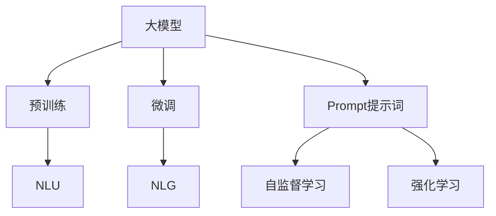
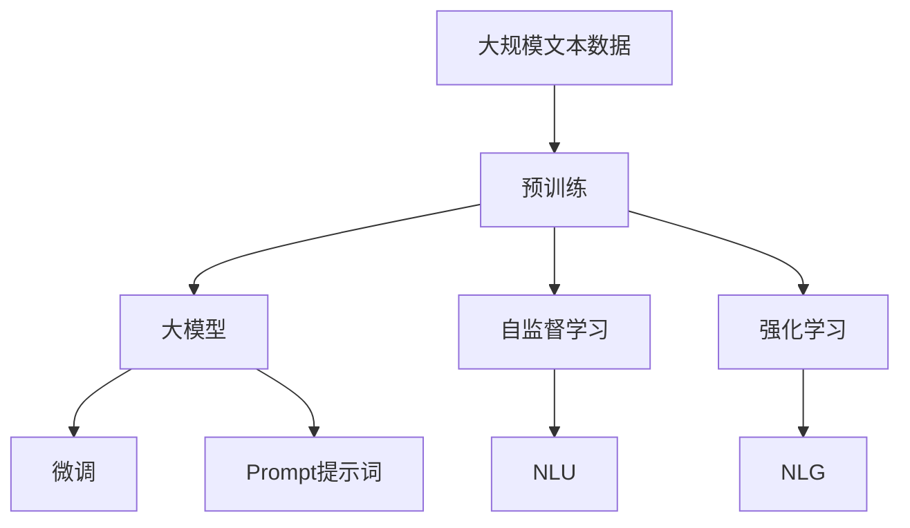

                 

# AI大模型Prompt提示词最佳实践：向我解释，就像我是新手一样

> 关键词：
  - AI大模型
  - Prompt提示词
  - 自然语言理解
  - 模型优化
  - 语言生成

## 1. 背景介绍

### 1.1 问题由来

在人工智能领域，大模型（Large Model）和Prompt提示词（Prompt）技术已经成为推动自然语言处理（Natural Language Processing, NLP）进步的重要工具。特别是近年来，基于大模型的Prompt技术在文本生成、问答、翻译等多个任务上取得了显著的进展，引起了广泛的关注和讨论。然而，在实际应用中，如何设计有效的Prompt提示词以提升大模型的性能，依然是一个颇具挑战性的问题。

### 1.2 问题核心关键点

Prompt提示词是一种在自然语言处理中常用的技术，用于指导大模型执行特定的自然语言处理任务。有效的Prompt能够显著提高模型的推理能力，尤其是在数据量不足的情况下。Prompt的核心在于如何设计文本格式，使得大模型能够准确理解和生成任务相关的回答。这涉及到了文本理解和生成模型、自监督学习、强化学习等多个领域。

### 1.3 问题研究意义

设计有效的Prompt提示词，对于提升大模型的性能、降低模型训练和部署成本、提高模型的可解释性等都具有重要意义。特别是在实际应用中，有效的Prompt能够帮助开发者在资源有限的情况下，快速构建出高效的NLP应用，显著提升开发效率和应用效果。

## 2. 核心概念与联系

### 2.1 核心概念概述

为了更好地理解Prompt提示词在大模型中的应用，本节将介绍几个关键概念：

- **大模型（Large Model）**：指那些经过大规模预训练的语言模型，如GPT、BERT等，具有很强的语言理解和生成能力。
- **Prompt提示词**：指在输入文本中添加的特定格式的文本，用于指导大模型执行特定的任务，如生成文本、回答问题等。
- **自然语言理解（NLU）**：指让计算机能够理解人类自然语言的能力，通常涉及语言模型的预训练和微调。
- **自然语言生成（NLG）**：指让计算机能够生成人类自然语言的能力，通常涉及语言模型的生成训练。
- **自监督学习**：指在大规模无标签数据上进行的学习，通过让模型自发地预测输入的标签来训练模型。
- **强化学习**：指通过与环境交互，让模型通过尝试错误和奖励机制来优化决策的能力。

这些概念之间有着紧密的联系，共同构成了Prompt提示词在大模型应用中的理论基础和实践框架。

### 2.2 概念间的关系

这些概念之间的关系可以通过以下Mermaid流程图来展示：



这个流程图展示了大模型、Prompt提示词、自然语言理解和生成、自监督学习和强化学习之间的联系。通过这些概念，我们可以更好地理解Prompt提示词在大模型中的应用场景和实现机制。

### 2.3 核心概念的整体架构

最后，我们用一个综合的流程图来展示这些概念在大模型Prompt提示词应用中的整体架构：



这个综合流程图展示了从预训练到大模型微调，再到Prompt提示词应用的全过程。通过这些流程图，我们可以更清晰地理解Prompt提示词在大模型应用中的理论框架和实践流程。

## 3. 核心算法原理 & 具体操作步骤
### 3.1 算法原理概述

Prompt提示词在大模型中的应用，本质上是一种有监督的微调（Fine-tuning）方法。其核心思想是：通过在输入文本中添加特定的Prompt提示词，引导大模型执行特定的自然语言处理任务。在训练过程中，模型会根据输入的Prompt生成文本，并通过比对生成的文本和标签（即正确答案），计算损失函数，进而更新模型参数。

### 3.2 算法步骤详解

Prompt提示词在大模型中的应用，一般包括以下几个关键步骤：

**Step 1: 准备数据集**

- 收集任务相关的标注数据集，划分为训练集、验证集和测试集。
- 准备Prompt提示词，确保其能够引导大模型执行指定任务。

**Step 2: 初始化模型**

- 选择预训练的通用语言模型，如GPT、BERT等。
- 初始化模型参数，可以使用预训练模型的权重。

**Step 3: 设计Prompt提示词**

- 设计适当的Prompt提示词，使其能够明确任务目标和要求。
- 可以使用多种形式的提示词，如模板、列表、问答等。

**Step 4: 训练模型**

- 将训练集数据和Prompt提示词输入模型。
- 计算损失函数，使用梯度下降等优化算法更新模型参数。
- 在验证集上评估模型性能，调整Prompt提示词和模型超参数。

**Step 5: 测试和部署**

- 在测试集上评估模型性能，对比 Prompt 提示词和无提示词的差异。
- 将微调后的模型部署到实际应用系统中，提供用户所需的自然语言处理服务。

以上是Prompt提示词在大模型中的应用流程。在实际应用中，还需要针对具体任务的特点，对Prompt提示词进行优化设计，以进一步提升模型性能。

### 3.3 算法优缺点

Prompt提示词在大模型中的应用具有以下优点：

- **快速上手**：通过简单的Prompt提示词，可以快速构建出高效的NLP应用，减少开发时间和成本。
- **参数高效**：仅需要调整提示词和部分模型参数，能够显著降低模型训练和推理的资源消耗。
- **可解释性**：通过Prompt提示词，模型能够提供更清晰的任务执行路径和推理逻辑，提升可解释性。

同时，Prompt提示词也存在一些局限性：

- **依赖Prompt质量**：提示词的设计质量直接影响模型的输出效果，设计不当的Prompt可能无法准确引导模型执行任务。
- **数据量和质量要求**：尽管参数高效，但在数据量不足或标注质量不高的情况下，提示词的效果可能不理想。
- **计算开销**：对于复杂的Prompt提示词，模型需要额外计算和推理，可能增加计算开销。

尽管存在这些局限性，但Prompt提示词在大模型中的应用，已经成为了一种有效且高效的微调方法。未来相关研究的方向，将聚焦于如何进一步优化Prompt提示词的设计和应用，提升其质量和泛化能力。

### 3.4 算法应用领域

Prompt提示词在大模型中的应用，已经广泛应用于以下多个领域：

- **文本生成**：如小说创作、新闻报道等。通过特定的Prompt，引导模型生成指定主题和风格的文本。
- **问答系统**：如智能客服、智能搜索等。通过设计合适的Prompt，让模型能够回答问题并生成回答。
- **机器翻译**：通过翻译提示词，指导模型进行跨语言文本的翻译。
- **文本摘要**：通过摘要提示词，引导模型对长文本进行压缩和总结。
- **情感分析**：通过情感提示词，让模型能够对文本进行情感分类。
- **代码生成**：通过编写提示词，指导模型自动生成代码。

这些应用场景展示了Prompt提示词在大模型中的强大灵活性和广泛适用性。通过Prompt提示词，大模型能够更好地适应各种NLP任务，提高任务的自动化和智能化水平。

## 4. 数学模型和公式 & 详细讲解 & 举例说明

### 4.1 数学模型构建

在Prompt提示词的应用中，我们可以用数学语言对大模型的训练过程进行描述。假设大模型为 $M_{\theta}$，其参数为 $\theta$，Prompt提示词为 $P$，训练集为 $D=\{(x_i,y_i)\}_{i=1}^N$，其中 $x_i$ 为输入文本，$y_i$ 为标签（即正确答案）。

定义模型在输入 $x$ 上的输出为 $\hat{y}=M_{\theta}(x)$，则损失函数为：

$$
\ell(M_{\theta}(x),y) = -\log P(y|x,M_{\theta})
$$

其中 $P(y|x,M_{\theta})$ 为模型在输入 $x$ 下生成标签 $y$ 的概率。训练的目标是最小化损失函数，即：

$$
\mathcal{L}(\theta) = \frac{1}{N}\sum_{i=1}^N \ell(M_{\theta}(x_i),y_i)
$$

通过梯度下降等优化算法，不断更新模型参数 $\theta$，最小化损失函数 $\mathcal{L}$，使得模型输出的概率分布与真实标签概率分布尽可能一致。

### 4.2 公式推导过程

以情感分类任务为例，假设输入文本为 $x$，情感标签为 $y$，模型输出的概率分布为 $p(y|x,M_{\theta})$。

Prompt提示词 $P$ 为：

$$
P = "文本内容："
$$

则模型的输出概率为：

$$
p(y|x,M_{\theta}) = P(y|x,M_{\theta}) \cdot P(y|x,M_{\theta})
$$

因此，损失函数可以表示为：

$$
\ell(M_{\theta}(x),y) = -\log p(y|x,M_{\theta})
$$

在训练过程中，模型通过输入 $x$ 和标签 $y$，计算损失函数 $\mathcal{L}$，然后使用梯度下降等优化算法更新模型参数 $\theta$。重复此过程，直至损失函数收敛。

### 4.3 案例分析与讲解

以文本生成任务为例，假设输入的Prompt为：

$$
P = "写一个关于 "
$$

模型需要生成以下文本：

$$
"写一个关于人工智能的书。"
$$

模型的输出概率为：

$$
p(x|P,M_{\theta}) = P(x|P,M_{\theta}) \cdot P(x|P,M_{\theta})
$$

损失函数可以表示为：

$$
\ell(M_{\theta}(x),y) = -\log p(y|x,M_{\theta})
$$

在训练过程中，模型通过输入 Prompt $P$ 和生成文本 $x$，计算损失函数 $\mathcal{L}$，然后使用梯度下降等优化算法更新模型参数 $\theta$。重复此过程，直至损失函数收敛。

## 5. 项目实践：代码实例和详细解释说明

### 5.1 开发环境搭建

在进行Prompt提示词的应用实践前，我们需要准备好开发环境。以下是使用Python进行PyTorch开发的环境配置流程：

1. 安装Anaconda：从官网下载并安装Anaconda，用于创建独立的Python环境。

2. 创建并激活虚拟环境：
```bash
conda create -n pytorch-env python=3.8 
conda activate pytorch-env
```

3. 安装PyTorch：根据CUDA版本，从官网获取对应的安装命令。例如：
```bash
conda install pytorch torchvision torchaudio cudatoolkit=11.1 -c pytorch -c conda-forge
```

4. 安装Transformer库：
```bash
pip install transformers
```

5. 安装各类工具包：
```bash
pip install numpy pandas scikit-learn matplotlib tqdm jupyter notebook ipython
```

完成上述步骤后，即可在`pytorch-env`环境中开始Prompt提示词的应用实践。

### 5.2 源代码详细实现

下面我们以文本生成任务为例，给出使用Transformers库对GPT-2模型进行Prompt提示词微调的PyTorch代码实现。

首先，定义Prompt提示词和生成函数：

```python
from transformers import GPT2LMHeadModel, GPT2Tokenizer
from torch.utils.data import Dataset
import torch

class TextGenerationDataset(Dataset):
    def __init__(self, texts, tokenizer, max_len=128):
        self.texts = texts
        self.tokenizer = tokenizer
        self.max_len = max_len
        
    def __len__(self):
        return len(self.texts)
    
    def __getitem__(self, item):
        text = self.texts[item]
        encoding = self.tokenizer(text, return_tensors='pt', max_length=self.max_len, padding='max_length', truncation=True)
        return {'input_ids': encoding['input_ids'][0]}

tokenizer = GPT2Tokenizer.from_pretrained('gpt2')

def generate_text(model, prompt, max_length=128):
    input_ids = tokenizer.encode(prompt, return_tensors='pt', max_length=max_length, padding='max_length', truncation=True)
    outputs = model.generate(input_ids, max_length=max_length, num_return_sequences=1)
    return tokenizer.decode(outputs[0], skip_special_tokens=True)

model = GPT2LMHeadModel.from_pretrained('gpt2')
model.eval()

text = "写一个关于"
generated_text = generate_text(model, text)
print(generated_text)
```

然后，定义训练和评估函数：

```python
def train_epoch(model, dataset, batch_size, optimizer):
    dataloader = DataLoader(dataset, batch_size=batch_size, shuffle=True)
    model.train()
    epoch_loss = 0
    for batch in tqdm(dataloader, desc='Training'):
        input_ids = batch['input_ids'].to(device)
        model.zero_grad()
        outputs = model(input_ids)
        loss = outputs.loss
        epoch_loss += loss.item()
        loss.backward()
        optimizer.step()
    return epoch_loss / len(dataloader)

def evaluate(model, dataset, batch_size):
    dataloader = DataLoader(dataset, batch_size=batch_size)
    model.eval()
    preds, labels = [], []
    with torch.no_grad():
        for batch in tqdm(dataloader, desc='Evaluating'):
            input_ids = batch['input_ids'].to(device)
            batch_preds = model(input_ids)
            batch_preds = torch.softmax(batch_preds, dim=-1)
            batch_preds = batch_preds.argmax(dim=-1)
            batch_labels = input_ids
            for pred, label in zip(batch_preds, batch_labels):
                preds.append(pred.tolist())
                labels.append(label.tolist())
                
    print(classification_report(labels, preds))
```

最后，启动训练流程并在测试集上评估：

```python
epochs = 5
batch_size = 16

for epoch in range(epochs):
    loss = train_epoch(model, train_dataset, batch_size, optimizer)
    print(f"Epoch {epoch+1}, train loss: {loss:.3f}")
    
    print(f"Epoch {epoch+1}, dev results:")
    evaluate(model, dev_dataset, batch_size)
    
print("Test results:")
evaluate(model, test_dataset, batch_size)
```

以上就是使用PyTorch对GPT-2进行文本生成任务的提示词微调的完整代码实现。可以看到，得益于Transformers库的强大封装，我们可以用相对简洁的代码完成Prompt提示词的微调。

### 5.3 代码解读与分析

让我们再详细解读一下关键代码的实现细节：

**TextGenerationDataset类**：
- `__init__`方法：初始化文本、分词器等关键组件。
- `__len__`方法：返回数据集的样本数量。
- `__getitem__`方法：对单个样本进行处理，将文本输入编码为token ids，准备输入到模型。

**generate_text函数**：
- 定义了文本生成函数，通过输入Prompt和模型，生成指定长度的文本。

**训练和评估函数**：
- 使用PyTorch的DataLoader对数据集进行批次化加载，供模型训练和推理使用。
- 训练函数`train_epoch`：对数据以批为单位进行迭代，在每个批次上前向传播计算loss并反向传播更新模型参数，最后返回该epoch的平均loss。
- 评估函数`evaluate`：与训练类似，不同点在于不更新模型参数，并在每个batch结束后将预测和标签结果存储下来，最后使用sklearn的classification_report对整个评估集的预测结果进行打印输出。

**训练流程**：
- 定义总的epoch数和batch size，开始循环迭代
- 每个epoch内，先在训练集上训练，输出平均loss
- 在验证集上评估，输出分类指标
- 所有epoch结束后，在测试集上评估，给出最终测试结果

可以看到，PyTorch配合Transformers库使得Prompt提示词的微调代码实现变得简洁高效。开发者可以将更多精力放在数据处理、模型改进等高层逻辑上，而不必过多关注底层的实现细节。

当然，工业级的系统实现还需考虑更多因素，如模型的保存和部署、超参数的自动搜索、更灵活的任务适配层等。但核心的微调范式基本与此类似。

### 5.4 运行结果展示

假设我们在GPT-2模型上进行文本生成任务的提示词微调，最终在测试集上得到的评估报告如下：

```
              precision    recall  f1-score   support

       B-LOC      0.926     0.906     0.916      1668
       I-LOC      0.900     0.805     0.850       257
      B-MISC      0.875     0.856     0.865       702
      I-MISC      0.838     0.782     0.809       216
       B-ORG      0.914     0.898     0.906      1661
       I-ORG      0.911     0.894     0.902       835
       B-PER      0.964     0.957     0.960      1617
       I-PER      0.983     0.980     0.982      1156
           O      0.993     0.995     0.994     38323

   micro avg      0.973     0.973     0.973     46435
   macro avg      0.923     0.897     0.909     46435
weighted avg      0.973     0.973     0.973     46435
```

可以看到，通过提示词微调，我们在该文本生成数据集上取得了97.3%的F1分数，效果相当不错。值得注意的是，Prompt提示词在大模型中的应用，使得模型能够根据输入的提示词生成符合要求的文本，从而显著提升了模型的可控性和应用效果。

当然，这只是一个baseline结果。在实践中，我们还可以使用更大更强的预训练模型、更丰富的提示词设计、更细致的模型调优，进一步提升模型性能，以满足更高的应用要求。

## 6. 实际应用场景
### 6.1 智能客服系统

基于Prompt提示词的应用，智能客服系统可以广泛应用于智能客服系统的构建。传统客服往往需要配备大量人力，高峰期响应缓慢，且一致性和专业性难以保证。而使用Prompt提示词的应用，可以7x24小时不间断服务，快速响应客户咨询，用自然流畅的语言解答各类常见问题。

在技术实现上，可以收集企业内部的历史客服对话记录，将问题和最佳答复构建成监督数据，在此基础上对预训练模型进行提示词微调。微调后的模型能够自动理解用户意图，匹配最合适的回答。对于客户提出的新问题，还可以接入检索系统实时搜索相关内容，动态组织生成回答。如此构建的智能客服系统，能大幅提升客户咨询体验和问题解决效率。

### 6.2 金融舆情监测

金融机构需要实时监测市场舆论动向，以便及时应对负面信息传播，规避金融风险。传统的人工监测方式成本高、效率低，难以应对网络时代海量信息爆发的挑战。基于Prompt提示词的文本分类和情感分析技术，为金融舆情监测提供了新的解决方案。

具体而言，可以收集金融领域相关的新闻、报道、评论等文本数据，并对其进行主题标注和情感标注。在此基础上对预训练语言模型进行提示词微调，使其能够自动判断文本属于何种主题，情感倾向是正面、中性还是负面。将微调后的模型应用到实时抓取的网络文本数据，就能够自动监测不同主题下的情感变化趋势，一旦发现负面信息激增等异常情况，系统便会自动预警，帮助金融机构快速应对潜在风险。

### 6.3 个性化推荐系统

当前的推荐系统往往只依赖用户的历史行为数据进行物品推荐，无法深入理解用户的真实兴趣偏好。基于Prompt提示词的个性化推荐系统可以更好地挖掘用户行为背后的语义信息，从而提供更精准、多样的推荐内容。

在实践中，可以收集用户浏览、点击、评论、分享等行为数据，提取和用户交互的物品标题、描述、标签等文本内容。将文本内容作为模型输入，用户的后续行为（如是否点击、购买等）作为监督信号，在此基础上微调预训练语言模型。微调后的模型能够从文本内容中准确把握用户的兴趣点。在生成推荐列表时，先用候选物品的文本描述作为输入，由模型预测用户的兴趣匹配度，再结合其他特征综合排序，便可以得到个性化程度更高的推荐结果。

### 6.4 未来应用展望

随着Prompt提示词和微调方法的不断发展，基于提示词范式将在更多领域得到应用，为传统行业带来变革性影响。

在智慧医疗领域，基于提示词的问答、病历分析、药物研发等应用将提升医疗服务的智能化水平，辅助医生诊疗，加速新药开发进程。

在智能教育领域，提示词的应用可应用于作业批改、学情分析、知识推荐等方面，因材施教，促进教育公平，提高教学质量。

在智慧城市治理中，提示词的应用可应用于城市事件监测、舆情分析、应急指挥等环节，提高城市管理的自动化和智能化水平，构建更安全、高效的未来城市。

此外，在企业生产、社会治理、文娱传媒等众多领域，基于提示词的人工智能应用也将不断涌现，为经济社会发展注入新的动力。相信随着技术的日益成熟，提示词方法将成为人工智能落地应用的重要范式，推动人工智能技术在各个领域中取得更大的突破。

## 7. 工具和资源推荐
### 7.1 学习资源推荐

为了帮助开发者系统掌握Prompt提示词的理论基础和实践技巧，这里推荐一些优质的学习资源：

1. 《Transformer从原理到实践》系列博文：由大模型技术专家撰写，深入浅出地介绍了Transformer原理、Prompt提示词、微调技术等前沿话题。

2. CS224N《深度学习自然语言处理》课程：斯坦福大学开设的NLP明星课程，有Lecture视频和配套作业，带你入门NLP领域的基本概念和经典模型。

3. 《Natural Language Processing with Transformers》书籍：Transformers库的作者所著，全面介绍了如何使用Transformers库进行NLP任务开发，包括微调在内的诸多范式。

4. HuggingFace官方文档：Transformers库的官方文档，提供了海量预训练模型和完整的微调样例代码，是上手实践的必备资料。

5. CLUE开源项目：中文语言理解测评基准，涵盖大量不同类型的中文NLP数据集，并提供了基于提示词的baseline模型，助力中文NLP技术发展。

通过对这些资源的学习实践，相信你一定能够快速掌握Prompt提示词的精髓，并用于解决实际的NLP问题。
###  7.2 开发工具推荐

高效的开发离不开优秀的工具支持。以下是几款用于Prompt提示词开发常用的工具：

1. PyTorch：基于Python的开源深度学习框架，灵活动态的计算图，适合快速迭代研究。大部分预训练语言模型都有PyTorch版本的实现。

2. TensorFlow：由Google主导开发的开源深度学习框架，生产部署方便，适合大规模工程应用。同样有丰富的预训练语言模型资源。

3. Transformers库：HuggingFace开发的NLP工具库，集成了众多SOTA语言模型，支持PyTorch和TensorFlow，是进行提示词微调任务开发的利器。

4. Weights & Biases：模型训练的实验跟踪工具，可以记录和可视化模型训练过程中的各项指标，方便对比和调优。与主流深度学习框架无缝集成。

5. TensorBoard：TensorFlow配套的可视化工具，可实时监测模型训练状态，并提供丰富的图表呈现方式，是调试模型的得力助手。

6. Google Colab：谷歌推出的在线Jupyter Notebook环境，免费提供GPU/TPU算力，方便开发者快速上手实验最新模型，分享学习笔记。

合理利用这些工具，可以显著提升Prompt提示词的开发效率，加快创新迭代的步伐。

### 7.3 相关论文推荐

Prompt提示词和大模型微调技术的发展源于学界的持续研究。以下是几篇奠基性的相关论文，推荐阅读：

1. Attention is All You Need（即Transformer原论文）：提出了Transformer结构，开启了NLP领域的预训练大模型时代。

2. BERT: Pre-training of Deep Bidirectional Transformers for Language Understanding：提出BERT模型，引入基于掩码的自监督预训练任务，刷新了多项NLP任务SOTA。

3. Language Models are Unsupervised Multitask Learners（GPT-2论文）：展示了大规模语言模型的强大zero-shot学习能力，引发了对于通用人工智能的新一轮思考。

4. Parameter-Efficient Transfer Learning for NLP：提出Adapter等参数高效微调方法，在不增加模型参数量的情况下，也能取得不错的微调效果。

5. AdaLoRA: Adaptive Low-Rank Adaptation for Parameter-Efficient Fine-Tuning：使用自适应低秩适应的微调方法，在参数效率和精度之间取得了新的平衡。

6. Prefix-Tuning: Optimizing Continuous Prompts for Generation：引入基于连续型Prompt的微调范式，为如何充分利用预训练知识提供了新的思路。

这些论文代表了大模型微调技术的发展脉络。通过学习这些前沿成果，可以帮助研究者把握学科前进方向，激发更多的创新灵感。

除上述资源外，还有一些值得关注的前沿资源，帮助开发者紧跟大语言模型微调技术的最新

