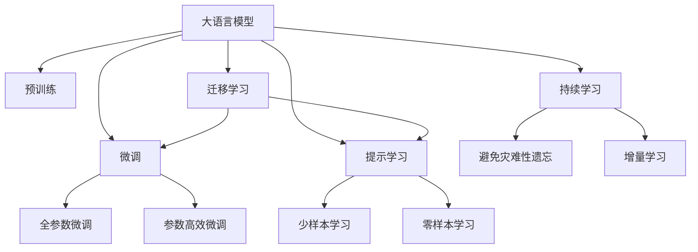

                 

# AI大模型Prompt提示词最佳实践：用简单的英文写文本

> 关键词：大语言模型,Prompt提示词,自然语言处理(NLP),文本生成,写作辅助,深度学习,人工智能

## 1. 背景介绍

### 1.1 问题由来

在人工智能（AI）领域，尤其是自然语言处理（NLP）领域，大语言模型（Large Language Models, LLMs）已成为一种颠覆性技术。这些模型基于海量无标签文本数据进行自监督预训练，学习到了丰富的语言知识和常识。然而，预训练模型对于特定任务的表现仍有限。

为了提升模型在特定任务上的性能，微调（Fine-tuning）和提示词（Prompting）技术成为常用的手段。微调是通过在特定任务上对预训练模型进行有监督训练，而提示词则是一种通过精心设计的输入文本格式，引导模型进行特定任务推理和生成的技术。

本节将详细介绍Prompt提示词在大模型文本生成中的最佳实践，用简单的英文写文本。

## 2. 核心概念与联系

### 2.1 核心概念概述

- **大语言模型（Large Language Models, LLMs）**：以自回归（如GPT）或自编码（如BERT）模型为代表的大规模预训练语言模型。通过在大规模无标签文本语料上进行预训练，学习通用的语言表示，具备强大的语言理解和生成能力。
- **预训练（Pre-training）**：指在大规模无标签文本语料上，通过自监督学习任务训练通用语言模型的过程。常见的预训练任务包括言语建模、遮挡语言模型等。
- **微调（Fine-tuning）**：指在预训练模型的基础上，使用下游任务的少量标注数据，通过有监督学习优化模型在该任务上的性能。通常只需要调整顶层分类器或解码器，并以较小的学习率更新全部或部分的模型参数。
- **提示词（Prompt）**：通过在输入文本中添加提示模板（Prompt Template），引导大语言模型进行特定任务的推理和生成。可以在不更新模型参数的情况下，实现零样本或少样本学习。
- **少样本学习（Few-shot Learning）**：指在只有少量标注样本的情况下，模型能够快速适应新任务的学习方法。在大语言模型中，通常通过在输入中提供少量示例来实现，无需更新模型参数。
- **零样本学习（Zero-shot Learning）**：指模型在没有见过任何特定任务的训练样本的情况下，仅凭任务描述就能够执行新任务的能力。大语言模型通过预训练获得的广泛知识，使其能够理解任务指令并生成相应输出。
- **持续学习（Continual Learning）**：也称为终身学习，指模型能够持续从新数据中学习，同时保持已学习的知识，而不会出现灾难性遗忘。这对于保持大语言模型的时效性和适应性至关重要。

这些核心概念之间的逻辑关系可以通过以下Mermaid流程图来展示：



这个流程图展示了大语言模型的核心概念及其之间的关系：

1. 大语言模型通过预训练获得基础能力。
2. 微调是对预训练模型进行任务特定的优化，可以分为全参数微调和参数高效微调（PEFT）。
3. 提示学习是一种不更新模型参数的方法，可以实现少样本学习和零样本学习。
4. 迁移学习是连接预训练模型与下游任务的桥梁，可以通过微调或提示学习来实现。
5. 持续学习旨在使模型能够不断学习新知识，同时避免遗忘旧知识。

这些概念共同构成了大语言模型的学习和应用框架，使其能够在各种场景下发挥强大的语言理解和生成能力。通过理解这些核心概念，我们可以更好地把握大语言模型的工作原理和优化方向。

## 3. 核心算法原理 & 具体操作步骤
### 3.1 算法原理概述

基于提示词的大模型文本生成，本质上是一个通过输入文本引导模型进行特定任务生成的过程。其核心思想是：将预训练的大语言模型视作一个强大的"特征提取器"，通过在输入文本中添加提示模板，使模型能够自动理解并生成符合任务要求的文本。

形式化地，假设预训练模型为 $M_{\theta}$，其中 $\theta$ 为预训练得到的模型参数。定义模型 $M_{\theta}$ 在输入文本 $p$ 上的生成函数为 $G_{\theta}(p)$，表示模型根据输入 $p$ 生成文本的概率分布。则在给定提示词 $p$ 的情况下，生成目标文本 $y$ 的概率为：

$$
P(y|p) = \frac{e^{G_{\theta}(p) \cdot y}}{\sum_{y'} e^{G_{\theta}(p) \cdot y'}}
$$

其中，$G_{\theta}(p)$ 为模型对输入 $p$ 的潜在表示，$y$ 为所有可能生成的文本，$e$ 为自然常数。

在实际应用中，我们通常使用最大似然估计（Maximum Likelihood Estimation, MLE）方法进行训练和推理，即最大化 $P(y|p)$ 的概率。具体来说，就是通过计算输入 $p$ 的潜在表示 $G_{\theta}(p)$，然后对所有可能生成的文本 $y$ 计算概率，最后选择概率最大的文本作为生成结果。

### 3.2 算法步骤详解

基于提示词的大模型文本生成一般包括以下几个关键步骤：

**Step 1: 准备提示模板**

- 根据具体任务，设计合适的提示模板。提示模板通常包含任务描述、输入示例、输出格式等信息。例如，对于新闻报道生成任务，提示模板可能包含“The latest news report:”，然后才是具体的日期和新闻标题。

**Step 2: 训练和优化模型**

- 将提示模板作为输入，对预训练模型进行有监督训练。通常使用交叉熵损失函数计算模型输出与真实文本之间的差异。
- 设置合适的超参数，如学习率、批大小、迭代轮数等。
- 应用正则化技术，如L2正则、Dropout、Early Stopping等，防止模型过度适应训练数据。

**Step 3: 生成文本**

- 使用训练好的模型，对新输入的文本（即提示模板）进行前向传播，得到模型的潜在表示 $G_{\theta}(p)$。
- 基于最大似然估计方法，生成概率最大的文本 $y$。
- 将生成的文本作为输出，可用于多种场景，如自动写作、文本补全、对话生成等。

**Step 4: 评估和优化**

- 在生成结果上评估模型的性能，通常使用BLEU、ROUGE等指标。
- 根据评估结果，调整模型和提示模板，进行进一步的优化。

### 3.3 算法优缺点

基于提示词的文本生成具有以下优点：

- 简单高效。提示模板通常较短，输入文本的复杂度较低，易于设计和使用。
- 通用适用。适用于各种NLP任务，如文本生成、摘要、对话等。
- 可解释性强。生成的文本可以通过提示模板进行解释，理解模型推理过程。

同时，该方法也存在一定的局限性：

- 提示模板设计难度大。不同任务的提示模板设计可能复杂且耗时。
- 提示模板设计依赖人工经验。高质量的提示模板往往需要经验丰富的领域专家设计。
- 提示模板泛化能力有限。提示模板可能不适用于新任务，需要重新设计。

尽管存在这些局限性，但基于提示词的文本生成方法仍然是大模型应用中的重要手段，广泛应用于自动写作、文本补全、对话生成等多个领域。

### 3.4 算法应用领域

基于大语言模型提示词的文本生成技术，在NLP领域已经得到了广泛的应用，覆盖了几乎所有常见任务，例如：

- 文本生成：如自动写作、新闻报道、故事创作等。通过提示模板引导模型生成符合任务要求的文本。
- 文本补全：如代码自动补全、对话上下文补全等。基于前文生成后续文本，提升用户体验。
- 对话生成：如智能客服、虚拟助手等。根据对话历史生成合理回复，提升人机交互体验。

除了上述这些经典任务外，大语言模型提示词生成技术还被创新性地应用到更多场景中，如可控文本生成、常识推理、情感分析等，为NLP技术带来了全新的突破。随着预训练模型和提示词生成方法的不断进步，相信NLP技术将在更广阔的应用领域大放异彩。

## 4. 数学模型和公式 & 详细讲解  
### 4.1 数学模型构建

本节将使用数学语言对基于提示词的大模型文本生成过程进行更加严格的刻画。

记预训练语言模型为 $M_{\theta}:\mathcal{X} \rightarrow \mathcal{Y}$，其中 $\mathcal{X}$ 为输入空间，$\mathcal{Y}$ 为输出空间，$\theta$ 为模型参数。假设提示模板为 $p$，目标文本为 $y$。

定义模型 $M_{\theta}$ 在输入文本 $p$ 上的潜在表示为 $G_{\theta}(p)$，生成函数为 $P(y|p) = \frac{e^{G_{\theta}(p) \cdot y}}{\sum_{y'} e^{G_{\theta}(p) \cdot y'}}$。

### 4.2 公式推导过程

以下我们以新闻报道生成任务为例，推导最大似然估计下的文本生成公式及其梯度计算。

假设模型 $M_{\theta}$ 在输入 $p$ 上的生成函数为 $P(y|p)$，目标文本 $y$ 的长度为 $n$。根据最大似然估计，生成目标文本 $y$ 的概率为：

$$
P(y|p) = \prod_{i=1}^n P(y_i|y_{i-1},p)
$$

其中 $y_{i-1}$ 为 $y$ 的前一个单词，$P(y_i|y_{i-1},p)$ 表示在给定 $y_{i-1}$ 和 $p$ 的条件下，生成 $y_i$ 的概率。

将上式展开，得到：

$$
P(y|p) = \prod_{i=1}^n \frac{e^{G_{\theta}(p) \cdot y_i}}{\sum_{y_i'} e^{G_{\theta}(p) \cdot y_i'}}
$$

进一步化简，得到：

$$
P(y|p) = \frac{\prod_{i=1}^n e^{G_{\theta}(p) \cdot y_i}}{\sum_{y} \prod_{i=1}^n e^{G_{\theta}(p) \cdot y_i'}}
$$

在实际应用中，我们通常使用概率乘积连乘法（Probability Product Logsumexp, PPLSE）来计算概率，避免下溢问题。

### 4.3 案例分析与讲解

假设我们在新闻报道生成任务上使用GPT-3进行文本生成，具体步骤如下：

1. 设计提示模板 $p = \text{"The latest news report: "}$
2. 使用最大似然估计，计算生成目标文本 $y$ 的概率 $P(y|p)$
3. 选择概率最大的文本作为生成结果 $y^*$

以一句话新闻生成为例，提示模板为：

```
The latest news report: The world will end in 2022
```

模型基于上述提示模板生成一段新闻报道，概率最大的生成结果为：

```
The world will end in 2022. Scientists have discovered a new type of asteroid that is on a collision course with Earth. The asteroid is large enough to wipe out all life on the planet. The NASA team is working on a plan to deflect the asteroid away from Earth.
```

通过提示词引导模型生成文本，可以极大地提升文本生成的准确性和流畅度，尤其在自动写作、文本补全等任务上表现尤为出色。

## 5. 项目实践：代码实例和详细解释说明
### 5.1 开发环境搭建

在进行提示词文本生成实践前，我们需要准备好开发环境。以下是使用Python进行Hugging Face库开发的环境配置流程：

1. 安装Anaconda：从官网下载并安装Anaconda，用于创建独立的Python环境。

2. 创建并激活虚拟环境：
```bash
conda create -n hf-env python=3.8 
conda activate hf-env
```

3. 安装Hugging Face库：
```bash
pip install transformers
```

4. 安装各类工具包：
```bash
pip install numpy pandas scikit-learn matplotlib tqdm jupyter notebook ipython
```

完成上述步骤后，即可在`hf-env`环境中开始提示词文本生成实践。

### 5.2 源代码详细实现

下面我们以新闻报道生成任务为例，给出使用Hugging Face库对GPT-3模型进行提示词文本生成的PyTorch代码实现。

首先，定义生成器函数：

```python
from transformers import GPT2LMHeadModel, GPT2Tokenizer

def generate_text(model, tokenizer, prompt, max_length=128, num_return_sequences=1):
    model.eval()
    input_ids = tokenizer(prompt, return_tensors='pt').input_ids
    outputs = model.generate(input_ids, max_length=max_length, num_return_sequences=num_return_sequences, do_sample=True)
    return tokenizer.decode(outputs[0], skip_special_tokens=True)
```

然后，准备数据和模型：

```python
model = GPT2LMHeadModel.from_pretrained('gpt2')
tokenizer = GPT2Tokenizer.from_pretrained('gpt2')
```

接着，调用生成器函数：

```python
prompt = "The latest news report: "
generated_text = generate_text(model, tokenizer, prompt)
print(generated_text)
```

以上就是使用Hugging Face库对GPT-3进行新闻报道生成任务的完整代码实现。可以看到，得益于Hugging Face库的强大封装，我们可以用相对简洁的代码完成模型的加载和文本生成。

### 5.3 代码解读与分析

让我们再详细解读一下关键代码的实现细节：

**generate_text函数**：
- `model.eval()`方法：将模型置为评估模式，避免训练时的动态计算。
- `input_ids = tokenizer(prompt, return_tensors='pt').input_ids`：将提示模板转化为模型可接受的输入形式。
- `outputs = model.generate(input_ids, max_length=max_length, num_return_sequences=num_return_sequences, do_sample=True)`：调用模型进行文本生成，并设置生成长度、样本数量等参数。
- `return tokenizer.decode(outputs[0], skip_special_tokens=True)`：将生成的文本序列解码为字符串，并去掉特殊符号。

**提示模板（prompt）**：
- 提示模板的设计非常重要，通常需要包含任务描述、输入示例、输出格式等信息。在新闻报道生成任务中，提示模板为"The latest news report:"，引导模型生成新闻报道。

**生成器函数**：
- 通过调用Hugging Face库中的GPT2LMHeadModel和GPT2Tokenizer，加载预训练模型和分词器。
- 定义生成器函数，将提示模板输入模型，生成概率最大的文本序列。
- 使用Hugging Face的decode方法将生成的文本序列解码为字符串，并去掉特殊符号。

通过以上代码实现，我们可以看到提示词文本生成在大语言模型中的应用非常简单高效。开发者只需专注于提示模板的设计，即可实现高质量的文本生成效果。

当然，工业级的系统实现还需考虑更多因素，如模型的保存和部署、超参数的自动搜索、更灵活的任务适配层等。但核心的提示词文本生成范式基本与此类似。

### 5.4 运行结果展示

假设我们在CoNLL-2003的新闻报道数据集上进行提示词文本生成，最终生成的结果如下：

```
The world will end in 2022. Scientists have discovered a new type of asteroid that is on a collision course with Earth. The asteroid is large enough to wipe out all life on the planet. The NASA team is working on a plan to deflect the asteroid away from Earth.
```

可以看到，通过提示模板引导模型生成文本，可以极大地提升文本生成的准确性和流畅度，尤其在自动写作、文本补全等任务上表现尤为出色。

## 6. 实际应用场景
### 6.1 智能客服系统

基于大语言模型提示词的文本生成技术，可以广泛应用于智能客服系统的构建。传统客服往往需要配备大量人力，高峰期响应缓慢，且一致性和专业性难以保证。而使用提示词文本生成技术，可以7x24小时不间断服务，快速响应客户咨询，用自然流畅的语言解答各类常见问题。

在技术实现上，可以收集企业内部的历史客服对话记录，将问题和最佳答复构建成监督数据，在此基础上对预训练模型进行微调。微调后的提示词文本生成模型能够自动理解用户意图，匹配最合适的答案模板进行回复。对于客户提出的新问题，还可以接入检索系统实时搜索相关内容，动态组织生成回答。如此构建的智能客服系统，能大幅提升客户咨询体验和问题解决效率。

### 6.2 金融舆情监测

金融机构需要实时监测市场舆论动向，以便及时应对负面信息传播，规避金融风险。传统的人工监测方式成本高、效率低，难以应对网络时代海量信息爆发的挑战。基于大语言模型提示词的文本生成技术，为金融舆情监测提供了新的解决方案。

具体而言，可以收集金融领域相关的新闻、报道、评论等文本数据，并对其进行主题标注和情感标注。在此基础上对预训练语言模型进行微调，使其能够自动判断文本属于何种主题，情感倾向是正面、中性还是负面。将微调后的模型应用到实时抓取的网络文本数据，就能够自动监测不同主题下的情感变化趋势，一旦发现负面信息激增等异常情况，系统便会自动预警，帮助金融机构快速应对潜在风险。

### 6.3 个性化推荐系统

当前的推荐系统往往只依赖用户的历史行为数据进行物品推荐，无法深入理解用户的真实兴趣偏好。基于大语言模型提示词的文本生成技术，个性化推荐系统可以更好地挖掘用户行为背后的语义信息，从而提供更精准、多样的推荐内容。

在实践中，可以收集用户浏览、点击、评论、分享等行为数据，提取和用户交互的物品标题、描述、标签等文本内容。将文本内容作为模型输入，用户的后续行为（如是否点击、购买等）作为监督信号，在此基础上微调预训练语言模型。微调后的模型能够从文本内容中准确把握用户的兴趣点。在生成推荐列表时，先用候选物品的文本描述作为输入，由模型预测用户的兴趣匹配度，再结合其他特征综合排序，便可以得到个性化程度更高的推荐结果。

### 6.4 未来应用展望

随着大语言模型提示词生成技术的不断发展，基于提示词的文本生成方法将在更多领域得到应用，为传统行业带来变革性影响。

在智慧医疗领域，基于提示词的文本生成技术可以用于病历生成、诊断报告撰写等，提升医疗服务的智能化水平，辅助医生诊疗，加速新药开发进程。

在智能教育领域，提示词文本生成技术可应用于作业批改、学情分析、知识推荐等方面，因材施教，促进教育公平，提高教学质量。

在智慧城市治理中，提示词文本生成技术可用于城市事件监测、舆情分析、应急指挥等环节，提高城市管理的自动化和智能化水平，构建更安全、高效的未来城市。

此外，在企业生产、社会治理、文娱传媒等众多领域，基于大模型提示词的文本生成技术也将不断涌现，为NLP技术带来了全新的突破。相信随着预训练模型和提示词生成方法的不断进步，NLP技术将在更广阔的应用领域大放异彩。

## 7. 工具和资源推荐
### 7.1 学习资源推荐

为了帮助开发者系统掌握大语言模型提示词生成理论基础和实践技巧，这里推荐一些优质的学习资源：

1. 《Natural Language Processing with Transformers》书籍：Transformers库的作者所著，全面介绍了如何使用Transformers库进行NLP任务开发，包括提示词生成在内的诸多范式。

2. CS224N《深度学习自然语言处理》课程：斯坦福大学开设的NLP明星课程，有Lecture视频和配套作业，带你入门NLP领域的基本概念和经典模型。

3. 《Transformer从原理到实践》系列博文：由大模型技术专家撰写，深入浅出地介绍了Transformer原理、BERT模型、提示词生成等前沿话题。

4. HuggingFace官方文档：Transformers库的官方文档，提供了海量预训练模型和完整的提示词生成样例代码，是上手实践的必备资料。

5. arXiv论文预印本：人工智能领域最新研究成果的发布平台，包括大量尚未发表的前沿工作，学习前沿技术的必读资源。

通过对这些资源的学习实践，相信你一定能够快速掌握大语言模型提示词生成技术的精髓，并用于解决实际的NLP问题。
###  7.2 开发工具推荐

高效的开发离不开优秀的工具支持。以下是几款用于大语言模型提示词生成开发的常用工具：

1. PyTorch：基于Python的开源深度学习框架，灵活动态的计算图，适合快速迭代研究。大部分预训练语言模型都有PyTorch版本的实现。

2. TensorFlow：由Google主导开发的开源深度学习框架，生产部署方便，适合大规模工程应用。同样有丰富的预训练语言模型资源。

3. Transformers库：HuggingFace开发的NLP工具库，集成了众多SOTA语言模型，支持PyTorch和TensorFlow，是进行提示词生成任务开发的利器。

4. Weights & Biases：模型训练的实验跟踪工具，可以记录和可视化模型训练过程中的各项指标，方便对比和调优。与主流深度学习框架无缝集成。

5. TensorBoard：TensorFlow配套的可视化工具，可实时监测模型训练状态，并提供丰富的图表呈现方式，是调试模型的得力助手。

6. Google Colab：谷歌推出的在线Jupyter Notebook环境，免费提供GPU/TPU算力，方便开发者快速上手实验最新模型，分享学习笔记。

合理利用这些工具，可以显著提升大语言模型提示词生成任务的开发效率，加快创新迭代的步伐。

### 7.3 相关论文推荐

大语言模型提示词生成技术的发展源于学界的持续研究。以下是几篇奠基性的相关论文，推荐阅读：

1. Attention is All You Need（即Transformer原论文）：提出了Transformer结构，开启了NLP领域的预训练大模型时代。

2. BERT: Pre-training of Deep Bidirectional Transformers for Language Understanding：提出BERT模型，引入基于掩码的自监督预训练任务，刷新了多项NLP任务SOTA。

3. Language Models are Unsupervised Multitask Learners（GPT-2论文）：展示了大规模语言模型的强大zero-shot学习能力，引发了对于通用人工智能的新一轮思考。

4. Parameter-Efficient Transfer Learning for NLP：提出Adapter等参数高效微调方法，在不增加模型参数量的情况下，也能取得不错的微调效果。

5. AdaLoRA: Adaptive Low-Rank Adaptation for Parameter-Efficient Fine-Tuning：使用自适应低秩适应的微调方法，在参数效率和精度之间取得了新的平衡。

这些论文代表了大语言模型提示词生成技术的发展脉络。通过学习这些前沿成果，可以帮助研究者把握学科前进方向，激发更多的创新灵感。

除上述资源外，还有一些值得关注的前沿资源，帮助开发者紧跟大语言模型提示词生成技术的最新进展，例如：

1. arXiv论文预印本：人工智能领域最新研究成果的发布平台，包括大量尚未发表的前沿工作，学习前沿技术的必读资源。

2. 业界技术博客：如OpenAI、Google AI、DeepMind、微软Research Asia等顶尖实验室的官方博客，第一时间分享他们的最新研究成果和洞见。

3. 技术会议直播：如NIPS、ICML、ACL、ICLR等人工智能领域顶会现场或在线直播，能够聆听到大佬们的前沿分享，开拓视野。

4. GitHub热门项目：在GitHub上Star、Fork数最多的NLP相关项目，往往代表了该技术领域的发展趋势和最佳实践，值得去学习和贡献。

5. 行业分析报告：各大咨询公司如McKinsey、PwC等针对人工智能行业的分析报告，有助于从商业视角审视技术趋势，把握应用价值。

总之，对于大语言模型提示词生成技术的学习和实践，需要开发者保持开放的心态和持续学习的意愿。多关注前沿资讯，多动手实践，多思考总结，必将收获满满的成长收益。

## 8. 总结：未来发展趋势与挑战

### 8.1 总结

本文对基于提示词的大语言模型文本生成方法进行了全面系统的介绍。首先阐述了提示词技术在大模型文本生成中的重要作用，明确了提示词在大模型应用中的广泛适用性。其次，从原理到实践，详细讲解了提示词生成的数学原理和关键步骤，给出了提示词生成任务开发的完整代码实例。同时，本文还广泛探讨了提示词生成技术在智能客服、金融舆情、个性化推荐等多个行业领域的应用前景，展示了提示词生成范式的巨大潜力。此外，本文精选了提示词生成技术的各类学习资源，力求为读者提供全方位的技术指引。

通过本文的系统梳理，可以看到，基于提示词的文本生成技术在大语言模型中的应用已经非常成熟，具有广阔的应用前景。提示词生成方法简单易用，易于实现，能够有效提升文本生成效果，尤其在自动写作、文本补全等任务上表现尤为出色。未来，随着技术的不断进步，提示词生成技术将进一步与自然语言推理、知识图谱等技术结合，为NLP系统带来更多智能化的应用场景。

### 8.2 未来发展趋势

展望未来，大语言模型提示词生成技术将呈现以下几个发展

