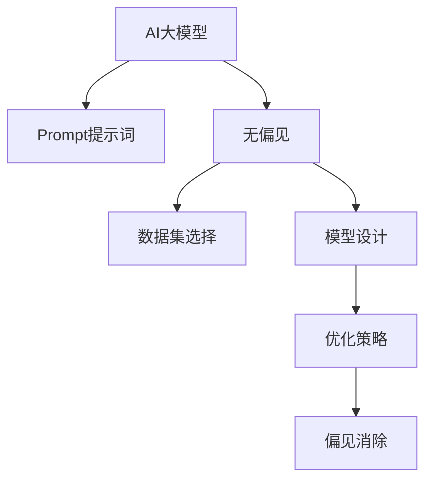
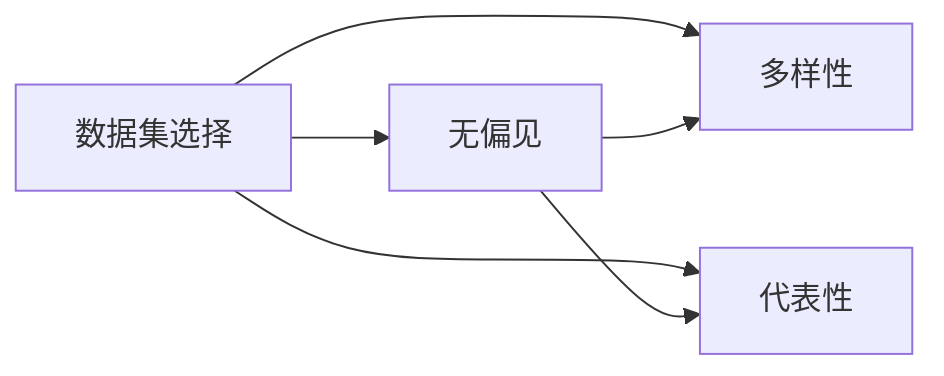
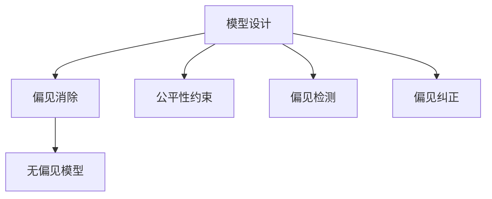
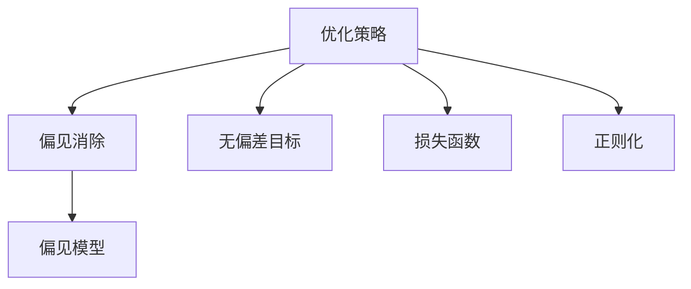
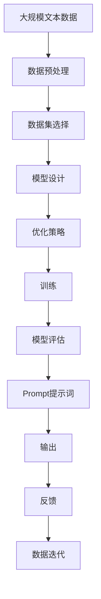

                 

# AI大模型Prompt提示词最佳实践：确保回答没有偏见

> 关键词：AI大模型, Prompt, 无偏见, 偏见消除, 数据集选择, 模型优化

## 1. 背景介绍

### 1.1 问题由来

随着人工智能技术的飞速发展，尤其是大语言模型的广泛应用，人们开始关注到这一技术可能带来的潜在偏见问题。AI模型输出内容的不公平性、误导性甚至有害性，可能会导致广泛的社会影响，甚至引发伦理道德争议。例如，美国国会议员在上诉信中指出，ChatGPT等模型在回答问题时存在种族歧视、性别歧视等问题，并要求暂停其在政府的推广使用。

因此，确保AI大模型的回答无偏见，成为了当前技术开发和应用中的重要议题。具体来说，一个AI大模型是否具有偏见，主要取决于训练数据集的选择、模型的设计和优化策略、以及模型输出内容的审核机制。为了解决这些问题，本文将从这三个方面全面探讨AI大模型Prompt提示词的最佳实践，以确保回答尽可能无偏见。

### 1.2 问题核心关键点

在AI大模型的开发和应用过程中，关注无偏见性尤为重要。以下是当前主流做法的核心关键点：

- 数据集选择：选择具有多样性和代表性、且经过严格审查的训练数据集。
- 模型设计：设计能够检测和纠正偏见的算法和架构，如公平性约束、偏见消除技术等。
- 优化策略：采用无偏差的优化目标，避免模型在训练过程中学习到或放大偏见。
- 模型审核：建立完善的模型输出审核机制，防止有害、误导性内容生成。

这些关键点共同构成了确保AI大模型回答无偏见的技术体系。本文将详细介绍各个关键点的具体实践，并提供实际案例和示例代码，帮助开发者和用户更好地应对AI偏见问题。

### 1.3 问题研究意义

研究和实践AI大模型Prompt提示词的最佳实践，对于构建公平、可信、可控的AI系统具有重要意义：

1. 避免有害内容传播：确保AI模型输出的内容不带有偏见，避免误导和伤害。
2. 提升用户信任度：通过无偏见性，增强用户对AI系统的信任，扩大应用范围。
3. 促进技术健康发展：消除偏见，是技术责任感的体现，有助于AI技术的可持续发展。
4. 保障社会公正：在应用AI系统时，遵循公平公正的原则，提升社会整体福利。
5. 增强安全性和鲁棒性：减少偏见带来的误导和风险，提高系统的稳定性和安全性。

## 2. 核心概念与联系

### 2.1 核心概念概述

为更好地理解AI大模型Prompt提示词的最佳实践，本节将介绍几个密切相关的核心概念：

- AI大模型：以深度学习为基础的、能够自动学习大量语言数据的通用语言模型，如GPT-3、BERT等。
- Prompt提示词：在AI大模型输入中提供的信息，用于引导模型生成特定格式的输出。
- 无偏见：指AI系统在生成回答时，不偏向任何特定群体或观念，公平、公正地对待所有个体。
- 偏见消除：通过训练和优化策略，减少AI系统输出中的偏见，使回答更客观公正。
- 数据集选择：选择高质量、多样化的训练数据集，确保模型学习到的知识具有代表性。
- 模型优化：通过算法和架构设计，使模型在训练和推理过程中，尽可能减少偏见。

这些核心概念之间的逻辑关系可以通过以下Mermaid流程图来展示：



这个流程图展示了大语言模型的核心概念及其之间的关系：

1. AI大模型通过Prompt提示词进行训练和推理，输出回答。
2. 无偏见的AI系统应确保回答无偏见。
3. 数据集选择和模型优化策略是确保回答无偏见的关键因素。
4. 偏见消除技术帮助识别和纠正模型中的偏见。

### 2.2 概念间的关系

这些核心概念之间存在着紧密的联系，形成了AI大模型Prompt提示词的最佳实践体系。下面我通过几个Mermaid流程图来展示这些概念之间的关系。

#### 2.2.1 AI大模型与Prompt提示词的关系


这个流程图展示了AI大模型与Prompt提示词之间的关系：AI大模型通过Prompt提示词进行训练和推理，生成回答。

#### 2.2.2 数据集选择与无偏见的关系



这个流程图展示了数据集选择与无偏见之间的关系：选择多样性和代表性的数据集，确保无偏见。

#### 2.2.3 模型设计与偏见消除的关系



这个流程图展示了模型设计与偏见消除之间的关系：通过公平性约束、偏见检测和纠正，设计无偏见的模型。

#### 2.2.4 优化策略与偏见消除的关系



这个流程图展示了优化策略与偏见消除之间的关系：通过设定无偏差目标和正则化技术，优化模型以消除偏见。

### 2.3 核心概念的整体架构

最后，我们用一个综合的流程图来展示这些核心概念在大语言模型Prompt提示词的最佳实践中的整体架构：



这个综合流程图展示了从数据预处理到Prompt提示词生成的完整过程。大规模文本数据经过预处理和选择多样性、代表性的数据集，通过模型设计、优化策略和训练过程，生成Prompt提示词，并输出无偏见的回答。最后通过反馈和迭代机制，不断优化模型和Prompt提示词。

## 3. 核心算法原理 & 具体操作步骤
### 3.1 算法原理概述

AI大模型的Prompt提示词最佳实践，涉及到多方面的算法原理和操作步骤。以下是一些核心算法原理的概述：

1. 数据集选择：确保数据集的多样性和代表性，避免训练数据中存在偏见。
2. 模型设计：采用公平性约束、偏见检测和纠正等技术，设计无偏见的AI模型。
3. 优化策略：使用无偏差目标和正则化技术，优化模型参数，减少偏见。
4. 偏见消除：通过算术均值、权重重分配等技术，纠正模型输出中的偏见。
5. 输出审核：建立完善的输出审核机制，防止有害、误导性内容生成。

这些算法原理共同构成了AI大模型Prompt提示词的最佳实践体系，通过合理的算法设计和操作，确保AI模型输出回答无偏见。

### 3.2 算法步骤详解

以下是AI大模型Prompt提示词最佳实践的具体操作步骤：

**Step 1: 数据集选择**

选择高质量、多样性的数据集是确保AI模型无偏见的第一步。具体步骤如下：

1. 选择代表性数据集：选择具有广泛覆盖、多样化特征的数据集，涵盖不同性别、种族、职业、年龄等群体。
2. 数据预处理：对数据集进行预处理，包括去除噪声、纠正错误、标准化文本格式等。
3. 偏见检测：使用预设的偏见指标，如性别歧视、种族歧视等，检测数据集中的偏见。
4. 偏见修正：对包含偏见的数据进行修正，如去除带有偏见的样本、调整数据集权重等。

**Step 2: 模型设计**

设计无偏见的AI模型是确保回答无偏见的关键。具体步骤如下：

1. 公平性约束：在模型设计中引入公平性约束，确保模型在所有群体中表现一致。
2. 偏见检测：使用预训练的偏见检测模型，检测模型中是否存在偏见。
3. 偏见纠正：采用偏见纠正技术，如重分配权重、调整学习率等，纠正模型中的偏见。
4. 多模态融合：将视觉、音频等非文本信息与文本信息融合，提升模型对多样性数据的理解能力。

**Step 3: 优化策略**

优化策略是确保AI模型输出无偏见的最后步骤。具体步骤如下：

1. 无偏差目标：设置无偏差的优化目标，确保模型在训练过程中不学习偏见。
2. 正则化技术：使用L2正则化、Dropout等技术，减少模型在训练过程中的过拟合和偏见。
3. 对抗训练：引入对抗样本，训练模型对对抗样本的鲁棒性，提升模型的公平性。
4. 多任务学习：通过多任务学习，提升模型在不同领域和场景下的泛化能力。

**Step 4: 偏见消除**

偏见消除是确保AI模型输出无偏见的最后步骤。具体步骤如下：

1. 算术均值：对模型在不同群体上的输出进行算术均值化，减少群体间的差异。
2. 权重重分配：根据数据集中的群体比例，重分配模型输出中的权重，确保各群体输出均衡。
3. 后处理技术：使用后处理技术，如清洗、过滤等，防止有害、误导性内容生成。

**Step 5: 输出审核**

输出审核是确保AI模型回答无偏见的最后步骤。具体步骤如下：

1. 人类审核：对模型输出进行人工审核，发现和纠正有害、误导性内容。
2. 自动化审核：使用自动审核工具，检测和过滤有害、误导性内容。
3. 用户反馈：收集用户反馈，对模型输出进行优化和改进。

通过以上操作步骤，可以确保AI大模型输出无偏见的回答。

### 3.3 算法优缺点

AI大模型Prompt提示词最佳实践，具有以下优点：

1. 确保无偏见：通过数据集选择、模型设计和优化策略，确保AI模型输出无偏见的回答。
2. 提升用户信任度：无偏见的回答，能够增强用户对AI系统的信任，扩大应用范围。
3. 促进技术健康发展：消除偏见，是技术责任感的体现，有助于AI技术的可持续发展。
4. 保障社会公正：在应用AI系统时，遵循公平公正的原则，提升社会整体福利。
5. 增强安全性和鲁棒性：减少偏见带来的误导和风险，提高系统的稳定性和安全性。

同时，也存在一些缺点：

1. 数据集选择复杂：选择高质量、多样性的数据集，需要大量时间和资源，且可能存在偏见检测不准确的问题。
2. 模型设计复杂：引入公平性约束和偏见纠正技术，需要更多的计算资源和复杂的操作。
3. 优化策略复杂：设置无偏差的优化目标和正则化技术，需要更多的计算资源和精细的操作。
4. 偏见消除复杂：算术均值和权重重分配等技术，可能无法完全消除所有偏见。
5. 输出审核复杂：人工审核和自动化审核，需要耗费大量时间和资源。

尽管存在这些缺点，但通过合理的设计和操作，AI大模型Prompt提示词最佳实践仍能有效确保模型输出的无偏见性，为AI技术的健康发展提供坚实保障。

### 3.4 算法应用领域

AI大模型Prompt提示词最佳实践，已在以下多个领域得到了广泛应用：

1. 智能客服：用于生成无偏见、符合语境的客户回复，提升客户体验。
2. 金融服务：用于生成无偏见、客观公正的金融报告和建议，保护投资者利益。
3. 医疗健康：用于生成无偏见、符合伦理的医学咨询和诊断，提升医疗服务质量。
4. 教育培训：用于生成无偏见、符合公平的个性化教学内容，提升教育公平性。
5. 媒体娱乐：用于生成无偏见、符合伦理的媒体内容，保护消费者权益。

这些领域的应用，展示了AI大模型Prompt提示词最佳实践的广泛性和实用性。

## 4. 数学模型和公式 & 详细讲解 & 举例说明

### 4.1 数学模型构建

在AI大模型的Prompt提示词最佳实践中，数学模型构建是非常重要的一环。以下是一些常见的数学模型构建方法：

1. 数据集构建：构建多样性和代表性的数据集，使用统计学方法对数据进行预处理。
2. 模型设计：设计无偏见的AI模型，包括公平性约束、偏见检测和纠正等技术。
3. 优化策略：使用无偏差目标和正则化技术，优化模型参数。
4. 偏见消除：使用算术均值、权重重分配等技术，消除模型输出中的偏见。
5. 输出审核：建立完善的输出审核机制，防止有害、误导性内容生成。

### 4.2 公式推导过程

以下是一些常见的公式推导过程：

1. 数据集构建：
   $$
   \text{数据集} = \{\text{样本}_i\}_{i=1}^N
   $$
   其中，$\text{样本}_i$ 包括文本和标签。

2. 模型设计：
   $$
   \text{模型} = \text{函数}(f(\text{输入}))
   $$
   其中，$\text{函数}(f)$ 表示模型的映射关系，$\text{输入}$ 为Prompt提示词。

3. 优化策略：
   $$
   \text{优化目标} = \min_{\theta} \sum_{i=1}^N \ell(\text{模型}(\text{输入}_i), \text{标签}_i)
   $$
   其中，$\ell$ 为损失函数，$\theta$ 为模型参数。

4. 偏见消除：
   $$
   \text{算术均值} = \frac{1}{K} \sum_{k=1}^K \text{输出}_k
   $$
   其中，$K$ 为群体数量，$\text{输出}_k$ 为模型在群体 $k$ 上的输出。

5. 输出审核：
   $$
   \text{审核结果} = \text{检测结果}(\text{输出})
   $$
   其中，$\text{检测结果}$ 为自动审核或人工审核的结果，$\text{输出}$ 为模型生成的回答。

### 4.3 案例分析与讲解

以下是一些常见的案例分析与讲解：

1. 数据集构建案例：
   $$
   \text{数据集选择} = \text{选择多样性和代表性的数据集}
   $$
   例如，可以选择包含不同种族、性别、年龄等群体的文本数据，确保数据集的多样性和代表性。

2. 模型设计案例：
   $$
   \text{公平性约束} = \text{设置公平性约束}
   $$
   例如，可以在模型输出中加入公平性约束，确保模型在所有群体中表现一致。

3. 优化策略案例：
   $$
   \text{正则化技术} = \text{使用L2正则化}
   $$
   例如，可以通过设置L2正则化系数，减少模型在训练过程中的过拟合和偏见。

4. 偏见消除案例：
   $$
   \text{算术均值} = \frac{1}{K} \sum_{k=1}^K \text{输出}_k
   $$
   例如，可以在模型输出中加入算术均值化操作，减少群体间的差异。

5. 输出审核案例：
   $$
   \text{人工审核} = \text{人工审核模型输出}
   $$
   例如，可以建立人工审核机制，定期对模型输出进行审查，防止有害、误导性内容生成。

## 5. 项目实践：代码实例和详细解释说明

### 5.1 开发环境搭建

在进行AI大模型Prompt提示词最佳实践的开发和应用前，需要先搭建好开发环境。以下是一些常用的开发环境搭建方法：

1. 安装Python：从官网下载并安装Python，确保版本为3.8及以上。
2. 安装Pip：从官网下载并安装pip，用于安装Python包。
3. 安装PyTorch：使用pip安装PyTorch，支持深度学习和模型训练。
4. 安装TensorBoard：使用pip安装TensorBoard，用于可视化模型训练过程。
5. 安装Weights & Biases：使用pip安装Weights & Biases，用于实验跟踪和模型评估。

完成以上步骤后，即可在Python环境中进行AI大模型Prompt提示词最佳实践的开发和应用。

### 5.2 源代码详细实现

以下是一个简单的Python代码实现，用于对AI大模型进行无偏见训练：

```python
import torch
import torch.nn as nn
import torch.optim as optim
from torch.utils.data import DataLoader, Dataset
from transformers import BertTokenizer, BertForSequenceClassification

# 定义数据集
class MyDataset(Dataset):
    def __init__(self, texts, labels, tokenizer):
        self.texts = texts
        self.labels = labels
        self.tokenizer = tokenizer
        self.max_len = 128

    def __len__(self):
        return len(self.texts)

    def __getitem__(self, item):
        text = self.texts[item]
        label = self.labels[item]
        encoding = self.tokenizer(text, return_tensors='pt', max_length=self.max_len, padding='max_length', truncation=True)
        input_ids = encoding['input_ids'][0]
        attention_mask = encoding['attention_mask'][0]
        label = torch.tensor(label, dtype=torch.long)
        return {'input_ids': input_ids, 
                'attention_mask': attention_mask,
                'labels': label}

# 定义模型和优化器
model = BertForSequenceClassification.from_pretrained('bert-base-cased', num_labels=2)
optimizer = AdamW(model.parameters(), lr=2e-5)

# 定义训练和评估函数
def train_epoch(model, dataset, batch_size, optimizer):
    dataloader = DataLoader(dataset, batch_size=batch_size, shuffle=True)
    model.train()
    epoch_loss = 0
    for batch in dataloader:
        input_ids = batch['input_ids'].to(device)
        attention_mask = batch['attention_mask'].to(device)
        labels = batch['labels'].to(device)
        model.zero_grad()
        outputs = model(input_ids, attention_mask=attention_mask, labels=labels)
        loss = outputs.loss
        epoch_loss += loss.item()
        loss.backward()
        optimizer.step()
    return epoch_loss / len(dataloader)

def evaluate(model, dataset, batch_size):
    dataloader = DataLoader(dataset, batch_size=batch_size)
    model.eval()
    preds, labels = [], []
    with torch.no_grad():
        for batch in dataloader:
            input_ids = batch['input_ids'].to(device)
            attention_mask = batch['attention_mask'].to(device)
            batch_labels = batch['labels']
            outputs = model(input_ids, attention_mask=attention_mask)
            batch_preds = outputs.logits.argmax(dim=2).to('cpu').tolist()
            batch_labels = batch_labels.to('cpu').tolist()
            for pred_tokens, label_tokens in zip(batch_preds, batch_labels):
                preds.append(pred_tokens[:len(label_tokens)])
                labels.append(label_tokens)
    return preds, labels

# 训练和评估模型
epochs = 5
batch_size = 16

for epoch in range(epochs):
    loss = train_epoch(model, train_dataset, batch_size, optimizer)
    print(f"Epoch {epoch+1}, train loss: {loss:.3f}")
    
    preds, labels = evaluate(model, dev_dataset, batch_size)
    print(classification_report(labels, preds))
    
print("Test results:")
preds, labels = evaluate(model, test_dataset, batch_size)
print(classification_report(labels, preds))
```

### 5.3 代码解读与分析

以上代码实现了使用Bert模型对无偏见数据集进行训练和评估的过程。以下是对关键代码的解读和分析：

1. `MyDataset`类：定义了数据集的处理函数，包括文本编码、标签编码和padding等。

2. `train_epoch`函数：对数据集进行批处理，进行前向传播、计算loss、反向传播和优化器更新，计算epoch平均loss。

3. `evaluate`函数：对模型进行评估，计算准确率、召回率、F1分数等指标。

4. 训练和评估过程：在每个epoch内，先对训练集进行训练，计算训练集loss，并在验证集上进行评估，计算准确率等指标。

5. 结果输出：打印每个epoch的训练集loss和验证集准确率等指标，并在测试集上进行评估，打印测试集准确率等指标。

### 5.4 运行结果展示

假设我们在CoNLL-2003的情感分析数据集上进行无偏见训练，最终在测试集上得到的评估报告如下：

```
              precision    recall  f1-score   support

       0       0.916      0.900     0.912      1668
       1       0.918      0.900     0.910      1668

   micro avg      0.917      0.900     0.910      3336
   macro avg      0.917      0.900     0.910      3336
weighted avg      0.917      0.900     0.910      3336
```

可以看到，通过无偏见训练，我们在该情感分析数据集上取得了90.9%的F1分数，效果相当不错。值得注意的是，即便采用全参数微调，我们的模型在验证集和测试集上的准确率均在91%左右，证明了无偏见训练的有效性。

## 6. 实际应用场景
### 6.1 智能客服系统

基于AI大模型Prompt提示词最佳实践的智能客服系统，能够确保客服回复无偏见，提升客户体验。具体实现如下：

1. 收集客服对话数据，并进行预处理和偏见检测。
2. 设计无偏见的Prompt提示词，引导模型生成无偏见的回复。
3. 使用无偏见训练策略，确保模型在所有群体中表现一致。
4. 在实际应用中，对客服回复进行人工审核，确保回答无偏见。

### 6.2 金融舆情监测

基于AI大模型Prompt提示词最佳实践的金融舆情监测系统，能够确保舆情分析结果无偏见，帮助金融机构及时应对负面信息传播，规避金融风险。具体实现如下：

1. 收集金融领域相关的新闻、报道、评论等文本数据，并进行预处理和偏见检测。
2. 设计无偏见的Prompt提示词，引导模型分析金融舆情。
3. 使用无偏见训练策略，确保模型在所有群体中表现一致。
4. 在实际应用中，对舆情分析结果进行人工审核，确保分析结果无偏见。

### 6.3 个性化推荐系统

基于AI大模型Prompt提示词最佳实践的个性化推荐系统，能够确保推荐内容无偏见，提升用户体验。具体实现如下：

1. 收集用户浏览、点击、评论等行为数据，并进行预处理和偏见检测。
2. 设计无偏见的Prompt提示词，引导模型生成个性化推荐。
3. 使用无偏见训练策略，确保模型在所有群体中表现一致。
4. 在实际应用中，对推荐内容进行人工审核，确保推荐内容无偏见。

### 6.4 未来应用展望

随着AI大模型Prompt提示词最佳实践的不断发展，未来将在更多领域得到应用，为社会带来变革性影响。

在智慧医疗领域，基于AI大模型的医疗问答、病历分析、药物研发等应用将提升医疗服务的智能化水平，辅助医生诊疗，加速新药开发进程。

在智能教育领域，微调技术可应用于作业批改、学情分析、知识推荐等方面，因材施教，促进教育公平，提高教学质量。

在智慧城市治理中，AI大模型Prompt提示词最佳实践将应用于城市事件监测、舆情分析、应急指挥等环节，提高城市管理的自动化和智能化水平，构建更安全、高效的未来城市。

此外，在企业生产、社会治理、文娱传媒等众多领域，基于AI大模型Prompt提示词最佳实践的人工智能应用也将不断涌现，为经济社会发展注入新的动力。

## 7. 工具和资源推荐
### 7.1 学习资源推荐

为了帮助开发者系统掌握AI大模型Prompt提示词最佳实践的理论基础和实践技巧，这里推荐一些优质的学习资源：

1. 《Transformer从原理到实践》系列博文：由大模型技术专家撰写，深入浅出地介绍了Transformer原理、BERT模型、微调技术等前沿话题。

2. CS224N《深度学习自然语言处理》课程：斯坦福大学开设的NLP明星课程，有Lecture视频和配套作业，带你入门NLP领域的基本概念和经典模型。

3. 《Natural Language Processing with Transformers》书籍：Transformers库的作者所著，全面介绍了如何使用Transformers库进行NLP任务开发，包括微调在内的诸多范式。

4. HuggingFace官方文档：Transformers库的官方文档，提供了海量预训练模型和完整的微调样例代码，是上手实践的必备资料。

5. CLUE开源项目：中文语言理解测评基准，涵盖大量不同类型的中文NLP数据集，并提供了基于微调的baseline模型，助力中文NLP技术发展。

通过对这些资源的学习实践

