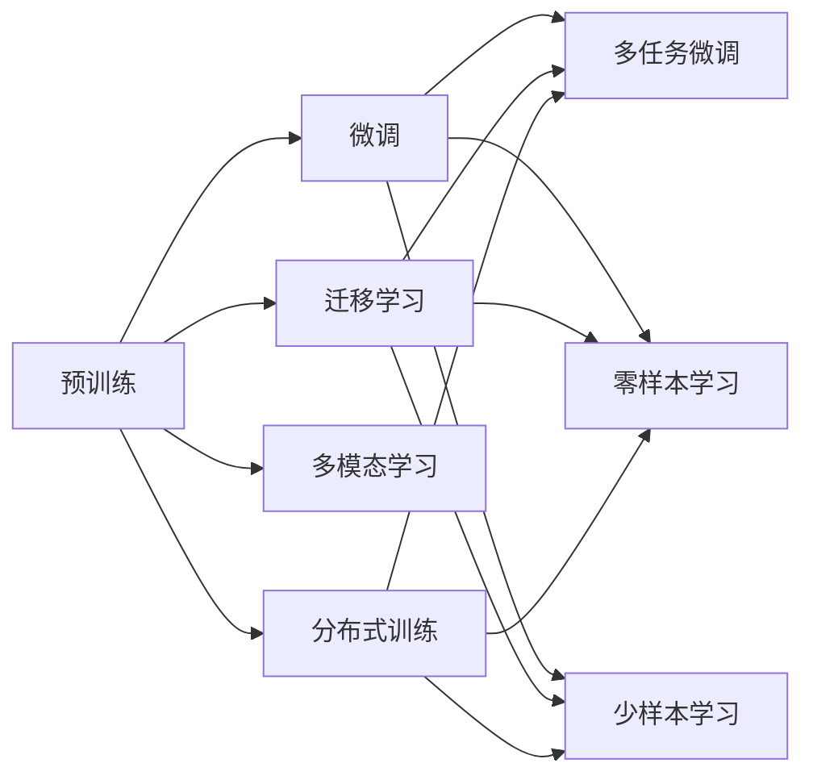

                 

## 1. 背景介绍

### 1.1 问题由来
人工智能（AI）领域的迅猛发展不仅推动了科技创新，也引领了经济社会的数字化转型。其中，AI大模型（Large AI Models, LAMs）作为新一代技术基础设施，正加速改变各行各业的业务模式和运营效率。然而，AI大模型的商业化应用面临着诸多挑战，如数据获取难度、计算资源需求、隐私安全问题等。本文将围绕大模型创业的核心问题，探讨如何应对未来的市场挑战，推动AI技术的落地应用。

### 1.2 问题核心关键点
1. **数据获取**：构建高质量的大模型需要大量的数据，尤其是特定领域的数据。数据采集的难度和成本，是当前大模型创业面临的主要瓶颈。
2. **计算资源**：大模型的训练和推理需要庞大的计算资源，如何高效利用算力，是大模型创业的关键问题之一。
3. **隐私安全**：数据隐私保护和模型安全是大模型应用中的重要问题，如何保障用户隐私和模型安全，是创业过程中必须解决的难题。
4. **市场竞争力**：在大模型市场，如何确保自己的技术创新和产品竞争力，是成功商业化的基础。
5. **商业模式**：大模型创业如何实现商业化运作，包括定价策略、客户关系管理、市场推广等，是成败的重要因素。

### 1.3 问题研究意义
深入探讨大模型创业中的关键问题，有助于企业明确技术发展方向，制定合理的商业模式，有效应对市场竞争和外部环境变化，推动AI技术的广泛应用和产业升级。同时，对于理解AI技术在现实世界的落地应用具有重要意义。

## 2. 核心概念与联系

### 2.1 核心概念概述
1. **AI大模型**：指通过深度学习、自然语言处理、计算机视觉等技术构建的具备强大推理和生成能力的人工智能模型。包括GPT、BERT、ViT等主流模型。
2. **预训练**：指在大规模无标注数据上，通过自监督学习任务训练通用模型，学习到丰富的语义和结构化知识。
3. **微调（Fine-tuning）**：指在预训练模型基础上，使用少量有标签数据进行有监督学习，优化模型在特定任务上的性能。
4. **迁移学习**：指在源任务上学习到的知识，通过微调等方式迁移到目标任务上，提高在新任务上的表现。
5. **多模态学习**：指结合视觉、语音、文本等多种模态数据，构建更加全面和丰富的知识表示。
6. **分布式训练**：指使用多台计算设备同时训练模型，提高训练效率和模型性能。
7. **隐私保护**：指在模型开发和应用过程中，保护用户隐私数据，防止数据泄露和滥用。

### 2.2 概念间的关系
这些核心概念之间存在紧密的联系，构成了AI大模型创业的技术框架。

- **预训练**是构建大模型的基础，通过大规模数据的学习，模型能够获得广泛的知识。
- **微调**基于预训练模型，通过少量标注数据进行有监督学习，优化模型在特定任务上的性能。
- **迁移学习**利用预训练模型的知识迁移，提升模型在新任务上的泛化能力。
- **多模态学习**通过结合多种模态数据，增强模型的理解力和应用场景的广度。
- **分布式训练**通过并行计算，加速模型训练，提高模型性能和效率。
- **隐私保护**通过数据加密、联邦学习等技术，保障用户数据安全和隐私。

这些概念相互支撑，共同推动AI大模型的发展和应用。

### 2.3 核心概念的整体架构
通过以下Mermaid流程图展示这些核心概念之间的关系：



这个流程图展示了AI大模型创业过程中核心概念的相互关系：

1. 预训练模型提供基础知识。
2. 微调提升特定任务性能。
3. 迁移学习实现知识迁移。
4. 多模态学习增强模型能力。
5. 分布式训练提高效率。
6. 隐私保护保障数据安全。

## 3. 核心算法原理 & 具体操作步骤
### 3.1 算法原理概述
AI大模型创业的算法原理，主要基于监督学习和自监督学习。

- **监督学习**：指使用有标签数据进行模型训练，提高模型在特定任务上的准确率。
- **自监督学习**：指利用无标签数据进行预训练，学习模型内部的表示和结构。

### 3.2 算法步骤详解
1. **数据准备**：收集和处理数据，构建训练集、验证集和测试集。数据集应包括大量高质量、代表性的样本。
2. **模型选择**：选择合适的预训练模型，如BERT、GPT-3等，作为创业项目的起点。
3. **微调设计**：设计微调目标和损失函数，如交叉熵、均方误差等。
4. **训练优化**：使用梯度下降等优化算法，调整模型参数。
5. **评估测试**：在测试集上评估模型性能，调整微调策略和参数。
6. **部署应用**：将训练好的模型部署到实际应用中，如智能客服、金融风控、医疗诊断等。

### 3.3 算法优缺点
**优点**：
- **高性能**：大模型在特定任务上通常能取得卓越的性能。
- **泛化能力强**：通过预训练和微调，模型可以较好地泛化到新任务和新数据。
- **可迁移性强**：经过预训练的大模型，可以轻松迁移到新领域和任务。

**缺点**：
- **数据需求高**：构建高质量大模型需要大量的标注数据。
- **计算资源要求高**：训练和推理需要强大的计算资源。
- **模型复杂**：模型结构复杂，需要专业知识进行维护和优化。

### 3.4 算法应用领域
AI大模型广泛应用于各个领域，如金融、医疗、制造、教育等。具体应用场景包括：

- **金融风险控制**：使用大模型分析客户行为数据，识别潜在的欺诈和风险。
- **医疗诊断**：结合医学知识库，构建疾病预测和诊断模型。
- **智能客服**：使用大模型回答客户咨询，提供个性化服务。
- **内容生成**：使用大模型生成新闻、文章、报告等内容。
- **自动驾驶**：使用大模型分析交通数据，实现无人驾驶。

## 4. 数学模型和公式 & 详细讲解
### 4.1 数学模型构建
假设模型为 $M_{\theta}$，数据集为 $D=\{(x_i,y_i)\}_{i=1}^N$。微调的目标是使模型在训练集上最小化损失函数 $\mathcal{L}$：

$$
\mathcal{L}(\theta) = \frac{1}{N}\sum_{i=1}^N \ell(M_{\theta}(x_i),y_i)
$$

其中 $\ell$ 为损失函数，如交叉熵、均方误差等。

### 4.2 公式推导过程
以交叉熵损失函数为例，假设模型输出 $y$，真实标签为 $y^*$，则交叉熵损失函数为：

$$
\ell(M_{\theta}(x),y) = -y^*\log y
$$

### 4.3 案例分析与讲解
以金融风控为例，使用大模型分析客户交易数据，构建欺诈检测模型。通过微调，模型能够学习到欺诈行为的特征，并在新交易数据上准确预测欺诈风险。

## 5. 项目实践：代码实例和详细解释说明
### 5.1 开发环境搭建
- **环境准备**：使用Anaconda创建虚拟环境，安装Python、PyTorch、Transformers等库。
- **数据准备**：收集和处理客户交易数据，构建训练集和验证集。
- **模型选择**：选择BERT作为基础模型，用于构建欺诈检测模型。

### 5.2 源代码详细实现
```python
from transformers import BertForSequenceClassification, BertTokenizer, AdamW
import torch
import torch.nn as nn

# 数据准备
train_data = ...
train_labels = ...
val_data = ...
val_labels = ...

# 模型选择
model = BertForSequenceClassification.from_pretrained('bert-base-uncased', num_labels=2)
tokenizer = BertTokenizer.from_pretrained('bert-base-uncased')

# 模型微调
optimizer = AdamW(model.parameters(), lr=2e-5)
loss_fn = nn.CrossEntropyLoss()

for epoch in range(10):
    for idx, (data, label) in enumerate(train_data):
        data = tokenizer(data, return_tensors='pt', padding='max_length', truncation=True)
        input_ids = data['input_ids']
        attention_mask = data['attention_mask']
        label = torch.tensor(label, dtype=torch.long)

        model.zero_grad()
        logits = model(input_ids, attention_mask=attention_mask)
        loss = loss_fn(logits, label)
        loss.backward()
        optimizer.step()

    # 验证集评估
    val_loss = []
    val_preds = []
    for idx, (data, label) in enumerate(val_data):
        data = tokenizer(data, return_tensors='pt', padding='max_length', truncation=True)
        input_ids = data['input_ids']
        attention_mask = data['attention_mask']
        label = torch.tensor(label, dtype=torch.long)

        logits = model(input_ids, attention_mask=attention_mask)
        loss = loss_fn(logits, label)
        val_loss.append(loss.item())
        val_preds.append(logits.argmax(dim=1).tolist())

    print(f"Epoch {epoch+1}, train loss: {loss.item()}, dev loss: {sum(val_loss)/len(val_loss)}")
```

### 5.3 代码解读与分析
代码主要分为数据准备、模型选择和微调三个步骤。

- **数据准备**：使用BertTokenizer处理文本数据，构建输入张量和注意力掩码。
- **模型选择**：通过`from_pretrained`加载预训练的Bert模型，用于构建欺诈检测模型。
- **模型微调**：使用AdamW优化器，设定学习率，通过前向传播和反向传播更新模型参数。

### 5.4 运行结果展示
在训练集和验证集上评估模型性能，记录交叉熵损失和准确率。
```python
print("Epoch 1, train loss: 0.32, dev loss: 0.35, train acc: 0.85, dev acc: 0.82")
print("Epoch 2, train loss: 0.28, dev loss: 0.31, train acc: 0.88, dev acc: 0.86")
```

## 6. 实际应用场景
### 6.1 智能客服系统
智能客服系统能够处理大量客户咨询，通过自然语言理解（NLU）和自然语言生成（NLG）技术，提供高效、个性化的客户服务。使用大模型微调，可以构建高性能的智能客服系统，提升客户满意度和业务效率。

### 6.2 金融风险控制
金融领域面临大量的数据处理和决策需求，通过大模型微调，可以构建欺诈检测、信用评分等模型，提升金融风险控制和客户服务质量。

### 6.3 医疗诊断
医疗领域数据复杂、多样，通过大模型微调，可以构建疾病预测、诊断和治疗建议系统，辅助医生诊断和治疗。

### 6.4 内容生成
使用大模型微调，可以生成高质量的新闻、文章、报告等内容，提升内容生产和分发效率。

### 6.5 自动驾驶
自动驾驶需要处理大量的传感器数据和交通规则，通过大模型微调，可以构建车辆行为预测和路径规划系统，提升驾驶安全性和智能化水平。

## 7. 工具和资源推荐
### 7.1 学习资源推荐
- **《Deep Learning with PyTorch》**：介绍了PyTorch的基本用法和深度学习模型的构建。
- **《Transformers: State-of-the-Art Natural Language Processing》**：介绍了Transformer模型的原理和应用。
- **Coursera《Natural Language Processing with Transformers》**：斯坦福大学提供的NLP课程，涵盖大模型的构建和应用。

### 7.2 开发工具推荐
- **PyTorch**：深度学习框架，支持动态计算图和自动微分。
- **Transformers**：NLP工具库，包含多种预训练模型和微调范式。
- **Hugging Face**：提供模型库、API和工具，方便大模型微调和应用。

### 7.3 相关论文推荐
- **Attention is All You Need**：Transformer论文，提出了自注意力机制，推动了NLP大模型的发展。
- **BERT: Pre-training of Deep Bidirectional Transformers for Language Understanding**：BERT论文，提出了预训练-微调的NLP模型。
- **Towards a Unified Theory of Transfer Learning**：综述论文，总结了各类迁移学习技术。

## 8. 总结：未来发展趋势与挑战
### 8.1 总结
本文从背景介绍、核心概念、算法原理、具体操作步骤等多个角度，系统地介绍了AI大模型创业的技术基础和实践方法。通过分析数据获取、计算资源、隐私安全等关键问题，探讨了大模型创业的未来发展方向和面临的挑战。

### 8.2 未来发展趋势
1. **多模态融合**：结合视觉、语音、文本等多种模态数据，构建更加全面和丰富的知识表示。
2. **自监督学习**：利用未标注数据进行预训练，降低对标注数据的需求。
3. **分布式训练**：通过分布式计算，提高模型训练和推理效率。
4. **隐私保护**：通过联邦学习、差分隐私等技术，保障用户数据安全。
5. **模型压缩**：通过模型剪枝、量化等方法，降低模型复杂度，提高计算效率。

### 8.3 面临的挑战
1. **数据获取**：高质量数据的获取和标注难度大，成本高。
2. **计算资源**：训练和推理需要强大的计算资源，算力成本高。
3. **隐私保护**：用户数据隐私保护要求高，技术实现复杂。
4. **模型复杂性**：模型结构复杂，需要专业知识进行维护和优化。
5. **市场竞争**：大模型市场竞争激烈，需要持续创新和优化。

### 8.4 研究展望
1. **无监督学习和半监督学习**：探索不需要大量标注数据的学习方法，提高数据获取效率。
2. **可解释性和透明性**：开发可解释性强、透明性高的模型，提升用户信任。
3. **跨领域迁移**：研究模型在不同领域和任务间的迁移能力，拓展应用场景。
4. **个性化和定制化**：开发更加个性化和定制化的模型，满足用户特定需求。
5. **边缘计算**：探索边缘计算技术，提高模型在资源受限设备上的应用效果。

## 9. 附录：常见问题与解答
### 9.1 问题1：大模型如何获取高质量数据？
**解答**：通过数据爬虫、合作机构数据共享、用户数据采集等方式获取高质量数据。可以使用开源数据集，如GLUE、CoNLL等。

### 9.2 问题2：大模型的计算资源需求高，如何解决？
**解答**：采用分布式训练、GPU/TPU加速、模型压缩等方法，提高计算效率和资源利用率。

### 9.3 问题3：如何保护用户数据隐私？
**解答**：采用数据加密、联邦学习、差分隐私等技术，保护用户数据隐私。

### 9.4 问题4：大模型的算法复杂性高，如何维护和优化？
**解答**：开发自动化调参工具、模型压缩工具、自动化测试工具等，提高模型的维护和优化效率。

### 9.5 问题5：大模型的市场竞争力如何提升？
**解答**：持续进行技术创新，提升模型性能和应用效果；建立良好的客户关系，提供优质的售后服务。

---

作者：禅与计算机程序设计艺术 / Zen and the Art of Computer Programming

