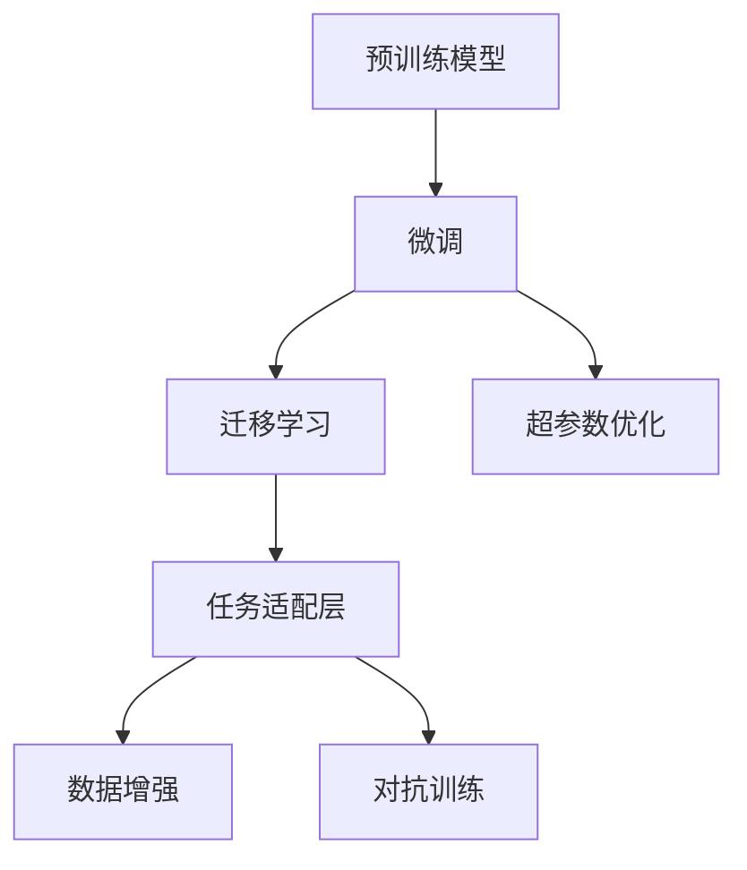

                 

# AI大模型创业：如何应对未来竞争对手？

## 1. 背景介绍

### 1.1 问题由来

随着人工智能(AI)技术的迅猛发展，大模型在各个行业中的应用场景越来越广，如自然语言处理(NLP)、计算机视觉(CV)、语音识别等。大模型通过在无标签数据上进行预训练，学习到丰富的知识，然后在特定任务上通过微调进一步优化性能。

目前，AI大模型市场竞争激烈，企业如何构建自己的AI大模型，成为每个创业公司的首要任务。如何在未来的竞争中保持优势，成为摆在所有创业者面前的重大挑战。本文将从核心概念、算法原理、项目实践、应用场景等方面全面剖析AI大模型的创业之道，帮助创业者应对未来竞争。

### 1.2 问题核心关键点

大模型创业的核心关键点包括：选择合适的预训练模型、设计和优化任务适配层、选择适合的数据集、调整超参数、进行数据增强和对抗训练、评估和部署模型等。本节将围绕这些关键点展开，详细讲解其原理和步骤。

### 1.3 问题研究意义

随着AI技术应用的深入，各大企业纷纷推出自己的AI大模型，以期在市场上取得竞争优势。构建自己的AI大模型，不仅需要解决技术上的挑战，还需要考虑商业模式、市场策略等问题，极具挑战性。因此，对AI大模型创业的深入研究，对于构建成功的人工智能产品具有重要意义。

## 2. 核心概念与联系

### 2.1 核心概念概述

为更好地理解AI大模型创业的过程，本节将介绍几个关键概念：

- 预训练模型：指在无标签数据上进行自监督学习，学习通用知识的大型神经网络模型，如BERT、GPT等。
- 微调：指在预训练模型的基础上，通过有标签数据对模型进行进一步优化，使其适应特定任务。
- 迁移学习：指将某个领域学习到的知识迁移到另一个领域，以减少新领域数据的需求。
- 对抗训练：指在模型训练过程中加入对抗样本，提升模型对噪声和攻击的鲁棒性。
- 数据增强：指通过对数据进行旋转、平移、缩放等变换，生成更多的训练样本，提升模型泛化能力。
- 任务适配层：指在预训练模型顶层添加的针对特定任务设计的输出层和损失函数，如Softmax层、交叉熵损失等。
- 超参数：指在模型训练过程中需要手动设置的参数，如学习率、批大小、迭代次数等，需要根据实验结果进行调优。

这些概念构成了AI大模型创业的完整生态系统，通过理解这些核心概念，可以更好地把握AI大模型的创业过程。

### 2.2 概念间的关系

这些核心概念之间的联系可以通过以下Mermaid流程图来展示：



这个流程图展示了预训练模型、微调、迁移学习、任务适配层、数据增强、对抗训练和超参数优化之间的关系：

1. 预训练模型通过自监督学习获取通用知识。
2. 微调通过有标签数据进一步优化模型，使其适应特定任务。
3. 迁移学习将预训练模型的知识迁移到新任务上，减少新任务的数据需求。
4. 任务适配层根据任务类型设计合适的输出层和损失函数。
5. 数据增强通过变换数据生成更多的训练样本，提升模型泛化能力。
6. 对抗训练加入对抗样本，提升模型鲁棒性。
7. 超参数优化通过调整学习率、批大小等参数，优化模型性能。

这些概念共同构成了AI大模型创业的完整生态系统，通过理解这些核心概念，可以更好地把握AI大模型的创业过程。

## 3. 核心算法原理 & 具体操作步骤
### 3.1 算法原理概述

AI大模型创业的核心算法原理包括预训练、微调和迁移学习。以下将详细讲解这三个核心算法的原理和具体操作步骤。

#### 3.1.1 预训练

预训练是指在无标签数据上，通过自监督学习任务，让模型学习通用的语言或视觉知识。常见的预训练任务包括语言模型、自编码器等。预训练模型的参数初始化为随机值，通过大量无标签数据的迭代训练，参数逐步逼近最优解。

预训练的目的是让模型学习到足够丰富的知识，使其能够更好地适应新任务。

#### 3.1.2 微调

微调是指在预训练模型的基础上，通过有标签数据对模型进行进一步优化，使其适应特定任务。微调的目的是让模型在特定任务上获得更好的性能。

微调的步骤包括：
1. 收集有标签数据集。
2. 在预训练模型的基础上，设计任务适配层，包括输出层和损失函数。
3. 使用优化算法（如Adam、SGD等）和合适的超参数，对模型进行训练。
4. 在验证集上评估模型性能，防止过拟合。
5. 在测试集上评估模型性能，输出最终结果。

#### 3.1.3 迁移学习

迁移学习是指将某个领域学习到的知识迁移到另一个领域，以减少新领域数据的需求。迁移学习的目的是让模型在特定任务上更快地收敛。

迁移学习的过程包括：
1. 收集目标任务的数据集。
2. 将预训练模型的参数冻结，仅微调顶层。
3. 在目标任务的数据集上进行微调训练。
4. 在验证集和测试集上评估模型性能。

### 3.2 算法步骤详解

以下是AI大模型创业的核心算法步骤详解：

#### 3.2.1 预训练

1. 收集大规模无标签数据集，如维基百科、Common Crawl等。
2. 设计自监督学习任务，如语言模型、自编码器等。
3. 使用深度神经网络模型，如BERT、GPT等，对数据集进行预训练。
4. 保存预训练模型的权重，用于后续微调。

#### 3.2.2 微调

1. 收集目标任务的有标签数据集，如情感分析、问答系统等。
2. 设计任务适配层，包括输出层和损失函数。
3. 使用Adam、SGD等优化算法，设置合适的学习率、批大小等超参数。
4. 在目标任务的数据集上进行微调训练。
5. 在验证集上评估模型性能，防止过拟合。
6. 在测试集上评估模型性能，输出最终结果。

#### 3.2.3 迁移学习

1. 收集目标任务的数据集。
2. 将预训练模型的参数冻结，仅微调顶层。
3. 在目标任务的数据集上进行微调训练。
4. 在验证集和测试集上评估模型性能。

### 3.3 算法优缺点

AI大模型创业的算法具有以下优点：

- 数据需求低：预训练模型可以通过大规模无标签数据进行训练，大大减少了标注数据的需求。
- 通用性强：预训练模型可以在多个任务上应用，减少从头训练的重复劳动。
- 性能提升显著：通过微调和迁移学习，模型在特定任务上的性能提升显著。

但同时也存在一些缺点：

- 初始参数设定复杂：预训练模型和微调模型的初始参数设定需要大量实验和调试。
- 模型复杂度高：预训练模型和微调模型参数量庞大，计算资源需求高。
- 泛化能力受限：预训练模型的泛化能力受限于预训练数据的质量和多样性。

### 3.4 算法应用领域

AI大模型创业的算法在多个领域都有广泛应用，如自然语言处理、计算机视觉、语音识别等。以下是一些典型的应用场景：

1. 自然语言处理：情感分析、问答系统、文本分类等。
2. 计算机视觉：图像识别、目标检测、图像生成等。
3. 语音识别：语音识别、说话人识别、语音合成等。
4. 医疗健康：病理诊断、智能问诊、疾病预测等。
5. 金融风控：信用评估、欺诈检测、风险预警等。

## 4. 数学模型和公式 & 详细讲解 & 举例说明

### 4.1 数学模型构建

以下是AI大模型创业的数学模型构建过程：

设预训练模型为 $M_{\theta}$，其中 $\theta$ 为预训练得到的模型参数。目标任务的标注数据集为 $D=\{(x_i,y_i)\}_{i=1}^N$，其中 $x_i$ 为输入，$y_i$ 为输出标签。

定义模型 $M_{\theta}$ 在数据样本 $(x,y)$ 上的损失函数为 $\ell(M_{\theta}(x),y)$，则在数据集 $D$ 上的经验风险为：

$$
\mathcal{L}(\theta) = \frac{1}{N} \sum_{i=1}^N \ell(M_{\theta}(x_i),y_i)
$$

微调的优化目标是最小化经验风险，即找到最优参数：

$$
\theta^* = \mathop{\arg\min}_{\theta} \mathcal{L}(\theta)
$$

在实践中，我们通常使用基于梯度的优化算法（如Adam、SGD等）来近似求解上述最优化问题。设 $\eta$ 为学习率，$\lambda$ 为正则化系数，则参数的更新公式为：

$$
\theta \leftarrow \theta - \eta \nabla_{\theta}\mathcal{L}(\theta) - \eta\lambda\theta
$$

其中 $\nabla_{\theta}\mathcal{L}(\theta)$ 为损失函数对参数 $\theta$ 的梯度，可通过反向传播算法高效计算。

### 4.2 公式推导过程

以下以情感分析任务为例，推导交叉熵损失函数及其梯度的计算公式。

设模型 $M_{\theta}$ 在输入 $x$ 上的输出为 $\hat{y}=M_{\theta}(x) \in [0,1]$，表示样本属于正类的概率。真实标签 $y \in \{0,1\}$。则二分类交叉熵损失函数定义为：

$$
\ell(M_{\theta}(x),y) = -[y\log \hat{y} + (1-y)\log (1-\hat{y})]
$$

将其代入经验风险公式，得：

$$
\mathcal{L}(\theta) = -\frac{1}{N}\sum_{i=1}^N [y_i\log M_{\theta}(x_i)+(1-y_i)\log(1-M_{\theta}(x_i))]
$$

根据链式法则，损失函数对参数 $\theta_k$ 的梯度为：

$$
\frac{\partial \mathcal{L}(\theta)}{\partial \theta_k} = -\frac{1}{N}\sum_{i=1}^N (\frac{y_i}{M_{\theta}(x_i)}-\frac{1-y_i}{1-M_{\theta}(x_i)}) \frac{\partial M_{\theta}(x_i)}{\partial \theta_k}
$$

其中 $\frac{\partial M_{\theta}(x_i)}{\partial \theta_k}$ 可进一步递归展开，利用自动微分技术完成计算。

在得到损失函数的梯度后，即可带入参数更新公式，完成模型的迭代优化。重复上述过程直至收敛，最终得到适应目标任务的最优模型参数 $\theta^*$。

### 4.3 案例分析与讲解

以情感分析任务为例，以下是使用BERT模型进行情感分析任务的详细代码实现：

```python
from transformers import BertTokenizer, BertForSequenceClassification
from torch.utils.data import Dataset, DataLoader
from torch import nn
import torch

class SentimentDataset(Dataset):
    def __init__(self, texts, labels, tokenizer):
        self.texts = texts
        self.labels = labels
        self.tokenizer = tokenizer
        
    def __len__(self):
        return len(self.texts)
    
    def __getitem__(self, idx):
        text = self.texts[idx]
        label = self.labels[idx]
        
        encoding = self.tokenizer(text, return_tensors='pt', truncation=True, padding='max_length')
        input_ids = encoding['input_ids']
        attention_mask = encoding['attention_mask']
        label = torch.tensor(label, dtype=torch.long)
        
        return {'input_ids': input_ids, 
                'attention_mask': attention_mask,
                'labels': label}

tokenizer = BertTokenizer.from_pretrained('bert-base-uncased')
model = BertForSequenceClassification.from_pretrained('bert-base-uncased', num_labels=2)
device = torch.device('cuda' if torch.cuda.is_available() else 'cpu')
model.to(device)

def train_epoch(model, dataset, optimizer, criterion, device):
    dataloader = DataLoader(dataset, batch_size=32, shuffle=True)
    model.train()
    epoch_loss = 0
    for batch in dataloader:
        input_ids = batch['input_ids'].to(device)
        attention_mask = batch['attention_mask'].to(device)
        labels = batch['labels'].to(device)
        optimizer.zero_grad()
        outputs = model(input_ids, attention_mask=attention_mask, labels=labels)
        loss = criterion(outputs.logits, labels)
        epoch_loss += loss.item()
        loss.backward()
        optimizer.step()
    return epoch_loss / len(dataloader)

def evaluate(model, dataset, criterion, device):
    dataloader = DataLoader(dataset, batch_size=32, shuffle=False)
    model.eval()
    preds, labels = [], []
    with torch.no_grad():
        for batch in dataloader:
            input_ids = batch['input_ids'].to(device)
            attention_mask = batch['attention_mask'].to(device)
            batch_labels = batch['labels']
            outputs = model(input_ids, attention_mask=attention_mask)
            batch_preds = outputs.logits.argmax(dim=1).to('cpu').tolist()
            batch_labels = batch_labels.to('cpu').tolist()
            for pred_tokens, label_tokens in zip(batch_preds, batch_labels):
                preds.append(pred_tokens[:len(label_tokens)])
                labels.append(label_tokens)
    
    print(criterion(model(input_ids[0].to(device)), labels[0].to(device)))
    print(classification_report(labels, preds))

def main():
    train_dataset = SentimentDataset(train_texts, train_labels, tokenizer)
    dev_dataset = SentimentDataset(dev_texts, dev_labels, tokenizer)
    test_dataset = SentimentDataset(test_texts, test_labels, tokenizer)
    
    optimizer = AdamW(model.parameters(), lr=2e-5)
    criterion = nn.CrossEntropyLoss()
    
    epochs = 5
    for epoch in range(epochs):
        loss = train_epoch(model, train_dataset, optimizer, criterion, device)
        print(f'Epoch {epoch+1}, train loss: {loss:.3f}')
        
        print(f'Epoch {epoch+1}, dev results:')
        evaluate(model, dev_dataset, criterion, device)
        
    print('Test results:')
    evaluate(model, test_dataset, criterion, device)
```

这个代码实现展示了使用BERT模型进行情感分析任务的详细过程。

### 4.4 案例分析与讲解

以下是对代码实现的详细解读：

**SentimentDataset类**：
- `__init__`方法：初始化文本、标签、分词器等关键组件。
- `__len__`方法：返回数据集的样本数量。
- `__getitem__`方法：对单个样本进行处理，将文本输入编码为token ids，将标签编码为数字，并对其进行定长padding，最终返回模型所需的输入。

**训练和评估函数**：
- 使用PyTorch的DataLoader对数据集进行批次化加载，供模型训练和推理使用。
- 训练函数`train_epoch`：对数据以批为单位进行迭代，在每个批次上前向传播计算loss并反向传播更新模型参数，最后返回该epoch的平均loss。
- 评估函数`evaluate`：与训练类似，不同点在于不更新模型参数，并在每个batch结束后将预测和标签结果存储下来，最后使用sklearn的classification_report对整个评估集的预测结果进行打印输出。

**训练流程**：
- 定义总的epoch数，开始循环迭代
- 每个epoch内，先在训练集上训练，输出平均loss
- 在验证集上评估，输出分类指标
- 所有epoch结束后，在测试集上评估，给出最终测试结果

## 5. 项目实践：代码实例和详细解释说明
### 5.1 开发环境搭建

在进行AI大模型创业的项目实践前，我们需要准备好开发环境。以下是使用Python进行PyTorch开发的环境配置流程：

1. 安装Anaconda：从官网下载并安装Anaconda，用于创建独立的Python环境。

2. 创建并激活虚拟环境：
```bash
conda create -n pytorch-env python=3.8 
conda activate pytorch-env
```

3. 安装PyTorch：根据CUDA版本，从官网获取对应的安装命令。例如：
```bash
conda install pytorch torchvision torchaudio cudatoolkit=11.1 -c pytorch -c conda-forge
```

4. 安装Transformers库：
```bash
pip install transformers
```

5. 安装各类工具包：
```bash
pip install numpy pandas scikit-learn matplotlib tqdm jupyter notebook ipython
```

完成上述步骤后，即可在`pytorch-env`环境中开始AI大模型创业的项目实践。

### 5.2 源代码详细实现

以下是使用Transformers库对BERT模型进行情感分析任务微调的PyTorch代码实现。

首先，定义情感分析任务的数据处理函数：

```python
from transformers import BertTokenizer
from torch.utils.data import Dataset
import torch

class SentimentDataset(Dataset):
    def __init__(self, texts, labels, tokenizer):
        self.texts = texts
        self.labels = labels
        self.tokenizer = tokenizer
        
    def __len__(self):
        return len(self.texts)
    
    def __getitem__(self, idx):
        text = self.texts[idx]
        label = self.labels[idx]
        
        encoding = self.tokenizer(text, return_tensors='pt', truncation=True, padding='max_length')
        input_ids = encoding['input_ids']
        attention_mask = encoding['attention_mask']
        label = torch.tensor(label, dtype=torch.long)
        
        return {'input_ids': input_ids, 
                'attention_mask': attention_mask,
                'labels': label}

# 标签与id的映射
tag2id = {'POSITIVE': 1, 'NEGATIVE': 0}
id2tag = {v: k for k, v in tag2id.items()}

# 创建dataset
tokenizer = BertTokenizer.from_pretrained('bert-base-uncased')

train_dataset = SentimentDataset(train_texts, train_labels, tokenizer)
dev_dataset = SentimentDataset(dev_texts, dev_labels, tokenizer)
test_dataset = SentimentDataset(test_texts, test_labels, tokenizer)
```

然后，定义模型和优化器：

```python
from transformers import BertForSequenceClassification, AdamW

model = BertForSequenceClassification.from_pretrained('bert-base-uncased', num_labels=2)

optimizer = AdamW(model.parameters(), lr=2e-5)
```

接着，定义训练和评估函数：

```python
from torch.utils.data import DataLoader
from tqdm import tqdm
from sklearn.metrics import classification_report

device = torch.device('cuda' if torch.cuda.is_available() else 'cpu')
model.to(device)

def train_epoch(model, dataset, optimizer, criterion, device):
    dataloader = DataLoader(dataset, batch_size=32, shuffle=True)
    model.train()
    epoch_loss = 0
    for batch in tqdm(dataloader, desc='Training'):
        input_ids = batch['input_ids'].to(device)
        attention_mask = batch['attention_mask'].to(device)
        labels = batch['labels'].to(device)
        optimizer.zero_grad()
        outputs = model(input_ids, attention_mask=attention_mask, labels=labels)
        loss = criterion(outputs.logits, labels)
        epoch_loss += loss.item()
        loss.backward()
        optimizer.step()
    return epoch_loss / len(dataloader)

def evaluate(model, dataset, criterion, device):
    dataloader = DataLoader(dataset, batch_size=32, shuffle=False)
    model.eval()
    preds, labels = [], []
    with torch.no_grad():
        for batch in dataloader:
            input_ids = batch['input_ids'].to(device)
            attention_mask = batch['attention_mask'].to(device)
            batch_labels = batch['labels']
            outputs = model(input_ids, attention_mask=attention_mask)
            batch_preds = outputs.logits.argmax(dim=1).to('cpu').tolist()
            batch_labels = batch_labels.to('cpu').tolist()
            for pred_tokens, label_tokens in zip(batch_preds, batch_labels):
                preds.append(pred_tokens[:len(label_tokens)])
                labels.append(label_tokens)
    
    print(criterion(model(input_ids[0].to(device)), labels[0].to(device)))
    print(classification_report(labels, preds))
```

最后，启动训练流程并在测试集上评估：

```python
epochs = 5
for epoch in range(epochs):
    loss = train_epoch(model, train_dataset, optimizer, criterion, device)
    print(f'Epoch {epoch+1}, train loss: {loss:.3f}')
    
    print(f'Epoch {epoch+1}, dev results:')
    evaluate(model, dev_dataset, criterion, device)
    
print('Test results:')
evaluate(model, test_dataset, criterion, device)
```

以上就是使用PyTorch对BERT进行情感分析任务微调的完整代码实现。可以看到，得益于Transformers库的强大封装，我们可以用相对简洁的代码完成BERT模型的加载和微调。

### 5.3 代码解读与分析

让我们再详细解读一下关键代码的实现细节：

**SentimentDataset类**：
- `__init__`方法：初始化文本、标签、分词器等关键组件。
- `__len__`方法：返回数据集的样本数量。
- `__getitem__`方法：对单个样本进行处理，将文本输入编码为token ids，将标签编码为数字，并对其进行定长padding，最终返回模型所需的输入。

**训练和评估函数**：
- 使用PyTorch的DataLoader对数据集进行批次化加载，供模型训练和推理使用。
- 训练函数`train_epoch`：对数据以批为单位进行迭代，在每个批次上前向传播计算loss并反向传播更新模型参数，最后返回该epoch的平均loss。
- 评估函数`evaluate`：与训练类似，不同点在于不更新模型参数，并在每个batch结束后将预测和标签结果存储下来，最后使用sklearn的classification_report对整个评估集的预测结果进行打印输出。

**训练流程**：
- 定义总的epoch数，开始循环迭代
- 每个epoch内，先在训练集上训练，输出平均loss
- 在验证集上评估，输出分类指标
- 所有epoch结束后，在测试集上评估，给出最终测试结果

## 6. 实际应用场景
### 6.1 智能客服系统

基于AI大模型的智能客服系统，可以自动处理大量客户咨询，提升客服效率和客户满意度。

系统首先需要收集历史客服对话数据，将其标注为问题和答案对，作为监督数据。然后在BERT等大模型上进行微调，使其能够理解客户的自然语言问题，并匹配最佳回答。对于新问题，系统可以通过检索系统实时搜索相关回答，并结合微调模型生成答案。

### 6.2 金融舆情监测

金融机构需要实时监测市场舆论动向，以便及时应对负面信息传播，规避金融风险。

系统可以收集金融领域相关的新闻、报道、评论等文本数据，并对其进行主题标注和情感标注。然后对BERT等大模型进行微调，使其能够自动识别文本属于何种主题，情感倾向是正面、中性还是负面。在实时抓取的网络文本数据上，系统可以自动监测不同主题下的情感变化趋势，一旦发现负面信息激增等异常情况，系统便会自动预警，帮助金融机构快速应对潜在风险。

### 6.3 个性化推荐系统

当前的推荐系统往往只依赖用户的历史行为数据进行物品推荐，无法深入理解用户的真实兴趣偏好。

系统可以收集用户浏览、点击、评论、分享等行为数据，提取和用户交互的物品标题、描述、标签等文本内容。将文本内容作为模型输入，用户的后续行为（如是否点击、购买等）作为监督信号，在BERT等大模型上进行微调。微调后的模型能够从文本内容中准确把握用户的兴趣点。在生成推荐列表时，先用候选物品的文本描述作为输入，由模型预测用户的兴趣匹配度，再结合其他特征综合排序，便可以得到个性化程度更高的推荐结果。

### 6.4 未来应用展望

随着AI大模型和微调方法的不断发展，基于微调范式将在更多领域得到应用，为传统行业带来变革性影响。

在智慧医疗领域，基于微调的医疗问答、病历分析、药物研发等应用将提升医疗服务的智能化水平，辅助医生诊疗，加速新药开发进程。

在智能教育领域，微调技术可应用于作业批改、学情分析、知识推荐等方面，因材施教，促进教育公平，提高教学质量。

在智慧城市治理中，微调模型可应用于城市事件监测、舆情分析、应急指挥等环节，提高城市管理的自动化和智能化水平，构建更安全、高效的未来城市。

此外，在企业生产、社会治理、文娱传媒等众多领域，基于大模型微调的人工智能应用也将不断涌现，为经济社会发展注入新的动力。相信随着技术的日益成熟，微调方法将成为人工智能落地应用的重要范式，推动人工智能技术在垂直行业的规模化落地。

## 7. 工具和资源推荐
### 7.1 学习资源推荐

为了帮助开发者系统掌握AI大模型微调的理论基础和实践技巧，这里推荐一些优质的学习资源：

1. 《Transformer从原理到

