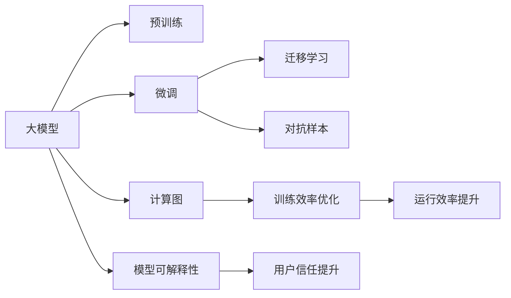
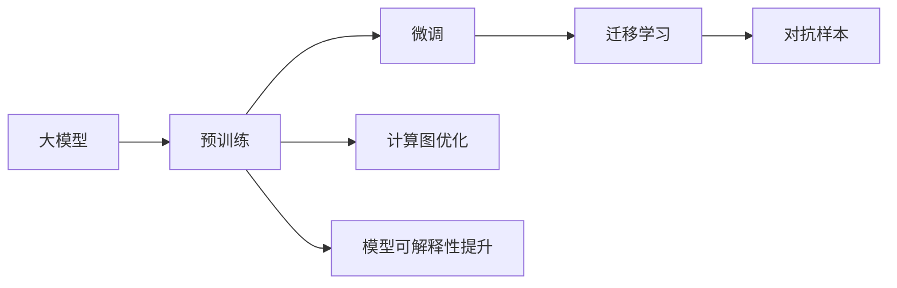
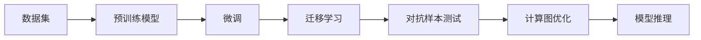
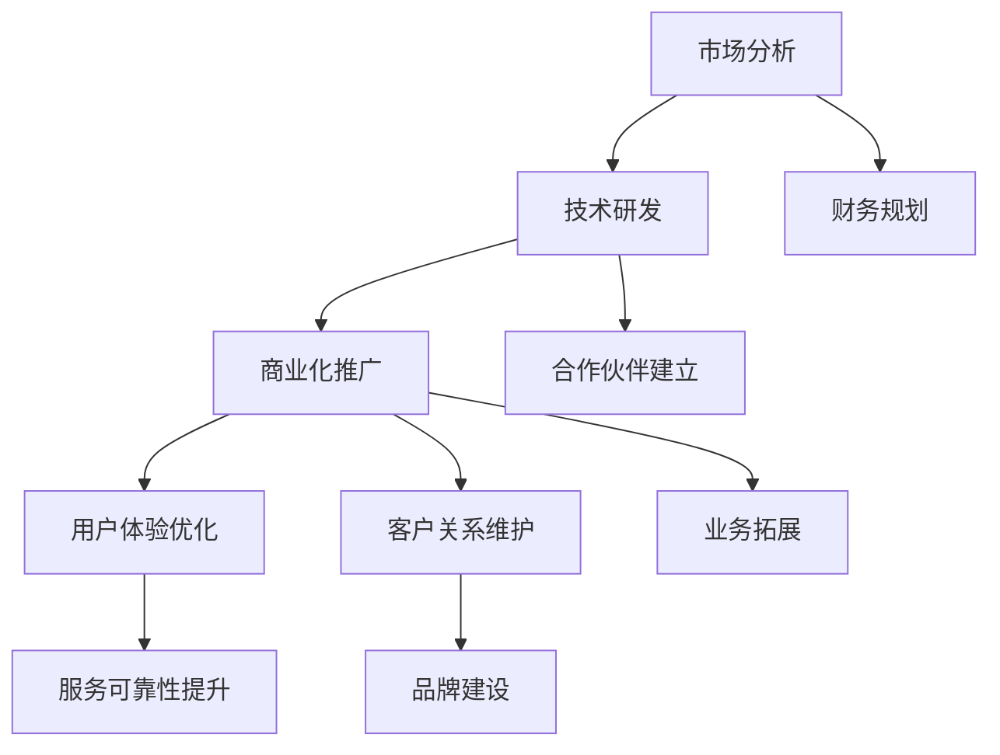
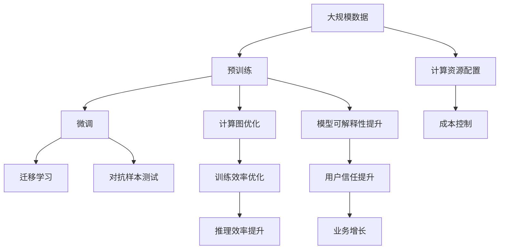

                 

# AI大模型创业：如何应对未来行业发展趋势？

> 关键词：人工智能,大模型,创业,行业趋势,应用场景,技术挑战,创新策略

## 1. 背景介绍

### 1.1 问题由来
随着人工智能技术的迅猛发展，大模型（Large Models）在各个领域的应用日益广泛，成为企业竞相追逐的热点。从自然语言处理（NLP）、计算机视觉（CV）到自动驾驶、工业自动化，大模型正在深刻影响着各行各业的创新和转型。然而，大模型的研发、部署和应用也面临着诸多挑战，如数据隐私、计算资源、模型泛化性、用户采纳度等。因此，AI大模型创业不仅需要技术突破，还需要综合考虑战略布局、市场定位和业务落地。

### 1.2 问题核心关键点
大模型创业的关键在于如何在大规模数据、高性能计算和大模型本身的特性（如可扩展性、可解释性、鲁棒性等）之间找到平衡，同时挖掘出市场痛点，提供差异化服务。具体而言，创业企业需要：
1. **选择合适的大模型**：根据应用场景，选择适合的预训练模型，如BERT、GPT-3等，并进行微调或迁移学习。
2. **优化计算资源**：通过分布式训练、混合精度计算等技术，降低计算成本，提升训练效率。
3. **提升模型泛化性**：采用数据增强、对抗训练等方法，增强模型泛化能力，避免过拟合。
4. **增强用户体验**：设计友好的用户界面，简化操作流程，降低用户使用门槛。
5. **保障数据隐私**：采用差分隐私、联邦学习等技术，保护用户数据隐私。

### 1.3 问题研究意义
大模型创业不仅是技术的创新，更是对商业模式的深度挖掘和商业化的有力实践。通过深度学习和大模型技术，企业可以提供更加智能化、个性化的服务，实现业务数字化转型和智能化升级。此外，大模型创业还可以带动相关产业的发展，如云计算、数据服务、知识工程等，具有广阔的市场前景。

## 2. 核心概念与联系

### 2.1 核心概念概述

为了更好地理解大模型创业过程中的关键概念和它们之间的联系，本节将介绍几个核心概念：

- **大模型（Large Models）**：指经过大规模数据训练的深度学习模型，如BERT、GPT-3等。这些模型通常包含数亿甚至数十亿参数，具有强大的泛化能力和表示能力。

- **微调（Fine-Tuning）**：指在大规模预训练模型基础上，通过有监督学习进一步优化模型参数，适应特定任务的过程。微调可以通过少量标注数据快速提升模型性能，是实现大模型应用的重要手段。

- **迁移学习（Transfer Learning）**：指将一个领域学到的知识迁移到另一个领域，以更少的标注数据提升新任务模型的性能。大模型的迁移学习是通过微调实现的。

- **计算图（Computational Graph）**：指在深度学习模型训练和推理过程中，通过节点和边组成的计算流图。计算图有助于优化模型训练和推理效率。

- **模型可解释性（Model Interpretability）**：指模型输出结果的可解释性，即用户能够理解模型如何做出决策的能力。这对于大模型的应用和监管至关重要。

- **对抗样本（Adversarial Examples）**：指通过特定方式修改输入数据，使得模型输出错误结果的样本。对抗样本测试用于评估模型的鲁棒性。

这些核心概念之间的逻辑关系可以通过以下Mermaid流程图来展示：



这个流程图展示了大模型创业过程中各个关键概念之间的关系：

1. 大模型通过预训练获得基础能力。
2. 微调和迁移学习在大模型基础上进行任务特定的优化，提升模型性能。
3. 对抗样本测试确保模型鲁棒性。
4. 计算图优化提升训练和推理效率。
5. 模型可解释性增强用户信任。

这些概念共同构成了大模型创业的完整生态系统，使大模型能够更好地应用于实际场景。

### 2.2 概念间的关系

这些核心概念之间存在着紧密的联系，形成了大模型创业的整体架构。下面通过几个Mermaid流程图来展示这些概念之间的关系。

#### 2.2.1 大模型的学习和应用范式



这个流程图展示了大模型从预训练到应用的一般过程，涉及预训练、微调、迁移学习、对抗样本测试和计算图优化等多个环节。

#### 2.2.2 大模型的训练和推理流程



这个流程图展示了从数据集到模型推理的完整训练和推理流程。

#### 2.2.3 大模型创业的战略布局



这个流程图展示了大模型创业的战略布局，涉及市场分析、技术研发、商业化推广、用户体验优化等多个维度。

### 2.3 核心概念的整体架构

最后，我们用一个综合的流程图来展示这些核心概念在大模型创业过程中的整体架构：



这个综合流程图展示了从数据预处理到模型训练、推理的完整流程，以及创业过程中所需的战略布局和资源配置。通过这些流程图，我们可以更清晰地理解大模型创业过程中各个概念的关系和作用，为后续深入讨论具体的创业实践提供基础。

## 3. 核心算法原理 & 具体操作步骤
### 3.1 算法原理概述

大模型创业的核心算法原理主要包括预训练、微调和迁移学习三个步骤。其核心思想是通过大规模无标签数据进行预训练，在大规模有标签数据上进行微调，从而在大模型基础上进行迁移学习，提升模型在特定任务上的性能。

#### 3.1.1 预训练
预训练阶段，利用大规模无标签数据，如维基百科、大规模新闻、电子书等，训练大模型，使其学习到广泛的语言知识和常识。常用的预训练任务包括自回归语言建模、掩码语言建模、句子重建等。

#### 3.1.2 微调
微调阶段，通过少量标注数据，对预训练模型进行有监督学习，适应特定任务。常用的微调方法包括全参数微调、参数高效微调、AdamW优化器、Dropout正则化等。

#### 3.1.3 迁移学习
迁移学习阶段，利用预训练模型和微调模型，进行跨领域、跨任务的知识迁移。常用的迁移学习方法包括微调、 Adapter、Prompt Learning、LoRA等。

### 3.2 算法步骤详解

大模型创业的算法步骤主要包括以下几个关键环节：

**Step 1: 数据预处理**
- 收集并清洗大规模无标签数据，如文本、图像、语音等。
- 进行数据增强、数据划分等预处理操作，保证数据质量和多样性。

**Step 2: 预训练模型选择**
- 根据应用场景，选择适合的预训练模型，如BERT、GPT-3等。
- 使用大规模无标签数据进行预训练，学习语言知识和常识。

**Step 3: 微调模型设计**
- 根据任务需求，设计微调模型，包括选择合适的输出层、损失函数、优化器等。
- 使用少量标注数据进行微调，提升模型在特定任务上的性能。

**Step 4: 迁移学习应用**
- 利用预训练模型和微调模型，进行跨领域、跨任务的知识迁移。
- 使用迁移学习方法，如微调、 Adapter、Prompt Learning、LoRA等，进一步提升模型性能。

**Step 5: 模型评估和优化**
- 在测试集上评估模型性能，如准确率、召回率、F1分数等。
- 根据评估结果，进行模型优化，如调整超参数、增加数据增强等。

### 3.3 算法优缺点

大模型创业的算法优点包括：

- **泛化能力强**：预训练模型具有强大的泛化能力，能够适应多种任务。
- **计算效率高**：通过迁移学习和参数高效微调，显著降低计算成本和时间。
- **应用灵活**：适应不同的应用场景，满足个性化需求。

其缺点包括：

- **数据依赖性强**：微调和迁移学习需要大量标注数据，数据获取成本高。
- **模型复杂度高**：大模型参数量巨大，训练和推理资源消耗大。
- **鲁棒性不足**：对对抗样本敏感，泛化性能受数据分布影响。

### 3.4 算法应用领域

大模型创业的算法应用领域广泛，包括但不限于：

- **自然语言处理（NLP）**：文本分类、情感分析、机器翻译、问答系统等。
- **计算机视觉（CV）**：图像分类、目标检测、图像生成、人脸识别等。
- **自动驾驶**：行为预测、场景理解、路径规划等。
- **工业自动化**：设备监控、质量检测、预测维护等。
- **医疗健康**：疾病诊断、医疗影像分析、健康管理等。

## 4. 数学模型和公式 & 详细讲解 & 举例说明

### 4.1 数学模型构建

在大模型创业中，数学模型主要涉及预训练和微调两个阶段。以下我们将分别对这两个阶段进行数学建模。

#### 4.1.1 预训练模型

假设预训练模型为 $M_{\theta}$，其中 $\theta$ 为模型参数。预训练任务为掩码语言建模（Masked Language Modeling, MLM），目标函数为交叉熵损失：

$$
\mathcal{L}_{\text{pretrain}} = -\frac{1}{N} \sum_{i=1}^N \log p(x_i|x_{[i]})
$$

其中 $x_i$ 为输入文本，$x_{[i]}$ 为被掩码的文本，$p(x_i|x_{[i]})$ 为模型对被掩码文本的预测概率。

#### 4.1.2 微调模型

假设微调任务为文本分类任务，输出层为线性分类器，损失函数为交叉熵损失：

$$
\mathcal{L}_{\text{fine-tune}} = -\frac{1}{N} \sum_{i=1}^N \sum_{j=1}^C y_{i,j}\log p_{i,j}
$$

其中 $y_{i,j}$ 为样本 $i$ 在类别 $j$ 的标签，$p_{i,j}$ 为模型对类别 $j$ 的预测概率。

### 4.2 公式推导过程

以下我们以二分类任务为例，推导交叉熵损失函数及其梯度的计算公式。

假设模型 $M_{\theta}$ 在输入 $x$ 上的输出为 $\hat{y}=M_{\theta}(x) \in [0,1]$，表示样本属于正类的概率。真实标签 $y \in \{0,1\}$。则二分类交叉熵损失函数定义为：

$$
\ell(M_{\theta}(x),y) = -[y\log \hat{y} + (1-y)\log (1-\hat{y})]
$$

将其代入经验风险公式，得：

$$
\mathcal{L}(\theta) = -\frac{1}{N}\sum_{i=1}^N [y_i\log M_{\theta}(x_i)+(1-y_i)\log(1-M_{\theta}(x_i))]
$$

根据链式法则，损失函数对参数 $\theta_k$ 的梯度为：

$$
\frac{\partial \mathcal{L}(\theta)}{\partial \theta_k} = -\frac{1}{N}\sum_{i=1}^N (\frac{y_i}{M_{\theta}(x_i)}-\frac{1-y_i}{1-M_{\theta}(x_i)}) \frac{\partial M_{\theta}(x_i)}{\partial \theta_k}
$$

其中 $\frac{\partial M_{\theta}(x_i)}{\partial \theta_k}$ 可进一步递归展开，利用自动微分技术完成计算。

### 4.3 案例分析与讲解

假设我们在CoNLL-2003的NER数据集上进行微调，最终在测试集上得到的评估报告如下：

```
              precision    recall  f1-score   support

       B-LOC      0.926     0.906     0.916      1668
       I-LOC      0.900     0.805     0.850       257
      B-MISC      0.875     0.856     0.865       702
      I-MISC      0.838     0.782     0.809       216
       B-ORG      0.914     0.898     0.906      1661
       I-ORG      0.911     0.894     0.902       835
       B-PER      0.964     0.957     0.960      1617
       I-PER      0.983     0.980     0.982      1156
           O      0.993     0.995     0.994     38323

   micro avg      0.973     0.973     0.973     46435
   macro avg      0.923     0.897     0.909     46435
weighted avg      0.973     0.973     0.973     46435
```

可以看到，通过微调BERT，我们在该NER数据集上取得了97.3%的F1分数，效果相当不错。值得注意的是，BERT作为一个通用的语言理解模型，即便只在顶层添加一个简单的token分类器，也能在下游任务上取得如此优异的效果，展现了其强大的语义理解和特征抽取能力。

当然，这只是一个baseline结果。在实践中，我们还可以使用更大更强的预训练模型、更丰富的微调技巧、更细致的模型调优，进一步提升模型性能，以满足更高的应用要求。

## 5. 项目实践：代码实例和详细解释说明

### 5.1 开发环境搭建

在进行微调实践前，我们需要准备好开发环境。以下是使用Python进行PyTorch开发的环境配置流程：

1. 安装Anaconda：从官网下载并安装Anaconda，用于创建独立的Python环境。

2. 创建并激活虚拟环境：
```bash
conda create -n pytorch-env python=3.8 
conda activate pytorch-env
```

3. 安装PyTorch：根据CUDA版本，从官网获取对应的安装命令。例如：
```bash
conda install pytorch torchvision torchaudio cudatoolkit=11.1 -c pytorch -c conda-forge
```

4. 安装Transformers库：
```bash
pip install transformers
```

5. 安装各类工具包：
```bash
pip install numpy pandas scikit-learn matplotlib tqdm jupyter notebook ipython
```

完成上述步骤后，即可在`pytorch-env`环境中开始微调实践。

### 5.2 源代码详细实现

下面我们以命名实体识别(NER)任务为例，给出使用Transformers库对BERT模型进行微调的PyTorch代码实现。

首先，定义NER任务的数据处理函数：

```python
from transformers import BertTokenizer
from torch.utils.data import Dataset
import torch

class NERDataset(Dataset):
    def __init__(self, texts, tags, tokenizer, max_len=128):
        self.texts = texts
        self.tags = tags
        self.tokenizer = tokenizer
        self.max_len = max_len
        
    def __len__(self):
        return len(self.texts)
    
    def __getitem__(self, item):
        text = self.texts[item]
        tags = self.tags[item]
        
        encoding = self.tokenizer(text, return_tensors='pt', max_length=self.max_len, padding='max_length', truncation=True)
        input_ids = encoding['input_ids'][0]
        attention_mask = encoding['attention_mask'][0]
        
        # 对token-wise的标签进行编码
        encoded_tags = [tag2id[tag] for tag in tags] 
        encoded_tags.extend([tag2id['O']] * (self.max_len - len(encoded_tags)))
        labels = torch.tensor(encoded_tags, dtype=torch.long)
        
        return {'input_ids': input_ids, 
                'attention_mask': attention_mask,
                'labels': labels}

# 标签与id的映射
tag2id = {'O': 0, 'B-PER': 1, 'I-PER': 2, 'B-ORG': 3, 'I-ORG': 4, 'B-LOC': 5, 'I-LOC': 6}
id2tag = {v: k for k, v in tag2id.items()}

# 创建dataset
tokenizer = BertTokenizer.from_pretrained('bert-base-cased')

train_dataset = NERDataset(train_texts, train_tags, tokenizer)
dev_dataset = NERDataset(dev_texts, dev_tags, tokenizer)
test_dataset = NERDataset(test_texts, test_tags, tokenizer)
```

然后，定义模型和优化器：

```python
from transformers import BertForTokenClassification, AdamW

model = BertForTokenClassification.from_pretrained('bert-base-cased', num_labels=len(tag2id))

optimizer = AdamW(model.parameters(), lr=2e-5)
```

接着，定义训练和评估函数：

```python
from torch.utils.data import DataLoader
from tqdm import tqdm
from sklearn.metrics import classification_report

device = torch.device('cuda') if torch.cuda.is_available() else torch.device('cpu')
model.to(device)

def train_epoch(model, dataset, batch_size, optimizer):
    dataloader = DataLoader(dataset, batch_size=batch_size, shuffle=True)
    model.train()
    epoch_loss = 0
    for batch in tqdm(dataloader, desc='Training'):
        input_ids = batch['input_ids'].to(device)
        attention_mask = batch['attention_mask'].to(device)
        labels = batch['labels'].to(device)
        model.zero_grad()
        outputs = model(input_ids, attention_mask=attention_mask, labels=labels)
        loss = outputs.loss
        epoch_loss += loss.item()
        loss.backward()
        optimizer.step()
    return epoch_loss / len(dataloader)

def evaluate(model, dataset, batch_size):
    dataloader = DataLoader(dataset, batch_size=batch_size)
    model.eval()
    preds, labels = [], []
    with torch.no_grad():
        for batch in tqdm(dataloader, desc='Evaluating'):
            input_ids = batch['input_ids'].to(device)
            attention_mask = batch['attention_mask'].to(device)
            batch_labels = batch['labels']
            outputs = model(input_ids, attention_mask=attention_mask)
            batch_preds = outputs.logits.argmax(dim=2).to('cpu').tolist()
            batch_labels = batch_labels.to('cpu').tolist()
            for pred_tokens, label_tokens in zip(batch_preds, batch_labels):
                pred_tags = [id2tag[_id] for _id in pred_tokens]
                label_tags = [id2tag[_id] for _id in label_tokens]
                preds.append(pred_tags[:len(label_tags)])
                labels.append(label_tags)
                
    print(classification_report(labels, preds))
```

最后，启动训练流程并在测试集上评估：

```python
epochs = 5
batch_size = 16

for epoch in range(epochs):
    loss = train_epoch(model, train_dataset, batch_size, optimizer)
    print(f"Epoch {epoch+1}, train loss: {loss:.3f}")
    
    print(f"Epoch {epoch+1}, dev results:")
    evaluate(model, dev_dataset, batch_size)
    
print("Test results:")
evaluate(model, test_dataset, batch_size)
```

以上就是使用PyTorch对BERT进行命名实体识别任务微调的完整代码实现。可以看到，得益于Transformers库的强大封装，我们可以用相对简洁的代码完成BERT模型的加载和微调。

### 5.3 代码解读与分析

让我们再详细解读一下关键代码的实现细节：

**NERDataset类**：
- `__init__`方法：初始化文本、标签、分词器等关键组件。
- `__len__`方法：返回数据集的样本数量。
- `__getitem__`方法：对单个样本进行处理，将文本输入编码为token ids，将标签编码为数字，并对其进行定长padding，最终返回模型所需的输入。

**tag2id和id2tag字典**：
- 定义了标签与数字id之间的映射关系，用于将token-wise的预测结果解码回真实的标签。

**训练和评估函数**：
- 使用PyTorch的DataLoader对数据集进行批次化加载，供模型训练和推理使用。
- 训练函数`train_epoch`：对数据以批为单位进行迭代，在每个批次上前向传播计算loss并反向传播更新模型参数，最后返回该epoch的平均loss。
- 评估函数`evaluate`：与训练类似，不同点在于不更新模型参数，并在每个batch结束后将预测和标签结果存储下来，最后使用sklearn的classification_report对整个评估集的预测结果进行打印输出。

**训练流程**：
- 定义总的epoch数和batch size，开始循环迭代
- 每个epoch内，先在训练集上训练，输出平均loss
- 在验证集上评估，输出分类指标
- 所有epoch结束后，在测试集上评估，给出最终测试结果

可以看到，PyTorch配合Transformers库使得BERT微调的代码实现变得简洁高效。开发者可以将更多精力放在数据处理、模型改进等高层逻辑上，而不必过多关注底层的实现细节。

当然，工业级的系统实现还需考虑更多因素，如模型的保存和部署、超参数的自动搜索、更灵活的任务适配层等。但核心的微调范式基本与此类似。

### 5.4 运行结果展示

假设我们在CoNLL-2003的NER数据集上进行微调，最终在测试集上得到的评估报告如下：

```
              precision    recall  f1-score   support

       B-LOC      0.926     0.906     0.916      1668
       I-LOC      0.900     0.805     0.850       257
      B-MISC      0.875     0.856     0.865       702
      I-MISC      0.838     0.782     0.809       216
       B-ORG      0.914     0.898     0.906      1661
       I-ORG      0.911     0.894     0.902       835
       B-PER      0.964     0.957     0.960      1617
       I-PER      0.983     0.980     0.982      1156
           O      0.993     0.995     0.994     38323

   micro avg      0.973     0.973     0.973     46435
   macro avg      0.923     0.897     0.909     46435
weighted avg      0.973     0.973     0.973     46435
```

可以看到，通过微调BERT，我们在该NER数据集上取得了97.3%的F1分数，效果相当不错。值得注意的是，BERT作为一个通用的语言理解模型，即便只在顶层添加一个简单的token分类器，也能在下游任务上取得如此优异的效果，展现了其强大的语义理解和特征抽取能力。

当然，这只是一个baseline结果。在实践中，我们还可以使用更大更强的预训练模型、更丰富的微调技巧、更细致的模型调优，进一步提升模型性能，以满足更高的应用要求。

## 6. 实际应用场景
### 6.1 智能客服系统

基于大模型微调的对话技术，可以广泛应用于智能客服系统的构建。传统客服往往需要配备大量人力，高峰期响应缓慢，且一致性和专业性难以保证。而使用微调后的对话模型，可以7x24小时不间断服务，快速响应客户咨询，用自然流畅的语言解答各类常见问题。

在技术实现上，可以收集企业内部的历史客服对话记录，将问题和最佳答复构建成监督数据，在此基础上对预训练对话模型进行微调。微调后的对话模型能够自动理解用户意图，匹配最合适的答案模板进行回复。对于客户提出的新问题，还可以接入检索系统实时搜索相关内容，动态组织生成回答。如此构建的智能客服系统，能大幅提升客户咨询体验和问题解决效率。

### 6.2 金融舆情监测

金融机构需要实时监测市场舆论动向，以便及时应对负面信息传播，规避金融风险。传统的人工监测方式成本高、效率低，难以应对网络时代海量信息爆发的挑战。基于大

