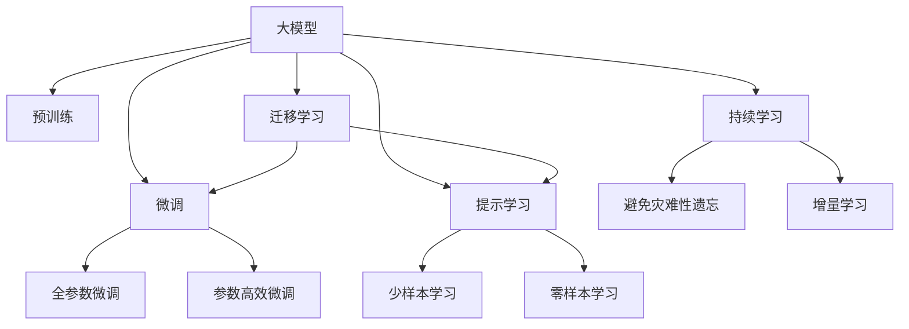

                 

# AI大模型创业：如何抓住未来机遇？

在人工智能(AI)和大模型研究的蓬勃发展背景下，越来越多的创业者投身于大模型创业，期望抓住技术创新和产业变革的机遇，实现商业成功。本文旨在为这些创业者提供全面的技术指南和实践经验，帮助他们明确方向、制定策略，并有效应对挑战。

## 1. 背景介绍

### 1.1 技术背景

人工智能作为21世纪最具颠覆性的技术之一，正在深度改变各行各业。大数据、计算能力的飞速提升，特别是深度学习技术的发展，使得大规模预训练模型（Large Language Models, LLMs）成为可能，大模型及其微调技术成为当前AI领域的研究热点。BERT、GPT-3、T5等预训练模型通过大规模无标签文本数据进行预训练，具备强大的语言理解能力和生成能力，已经在文本分类、问答、机器翻译、对话系统等多个领域取得了显著进展。

### 1.2 创业现状

随着大模型的成功应用，AI大模型创业生态逐渐形成，出现了如OpenAI、Google、Hugging Face等领先企业，以及众多初创公司。这些企业通过提供模型训练、微调、集成服务等，帮助开发者快速构建AI应用，推动AI技术在各行各业的落地。与此同时，AI大模型创业也吸引了大量风投关注，成为AI领域的“香饽饽”。

然而，随着大模型的普及和应用，市场竞争日益激烈。对于创业公司而言，如何在众多竞争者中脱颖而出，实现持续创新和商业成功，成为亟待解决的问题。

## 2. 核心概念与联系

### 2.1 核心概念概述

为更好地理解AI大模型创业，本节将介绍几个关键概念：

- **大模型**：指通过大规模无标签文本数据进行预训练的语言模型，如BERT、GPT等。
- **微调(Fine-Tuning)**：在大模型的基础上，使用下游任务的少量标注数据进行有监督学习，优化模型在特定任务上的性能。
- **迁移学习(Transfer Learning)**：利用预训练模型在目标任务上的性能，无需从头训练，提高模型泛化能力。
- **参数高效微调(Parameter-Efficient Fine-Tuning, PEFT)**：仅更新模型中的少量参数，保持大部分预训练权重不变，提高微调效率。
- **提示学习(Prompt Learning)**：通过设计特定的输入格式，引导模型进行推理，减少微调参数。
- **零样本学习(Zero-shot Learning)**：模型能够在没有训练样本的情况下，根据任务描述进行推理。

这些核心概念共同构成了AI大模型创业的技术框架，影响着模型的性能和应用效果。理解这些概念及其相互联系，有助于创业者设计更加高效和优化的模型。

### 2.2 概念间的关系

这些核心概念通过以下Mermaid流程图展示了它们之间的关系：



这个流程图展示了从预训练到微调，再到持续学习的完整过程，以及不同概念之间的关系。大模型通过预训练获得基础能力，然后通过微调或提示学习进行特定任务适配，同时利用迁移学习提高泛化能力，最后通过持续学习不断更新模型，保持性能。

## 3. 核心算法原理 & 具体操作步骤

### 3.1 算法原理概述

AI大模型创业的核心在于利用大规模预训练模型的通用能力，通过微调等技术，针对具体任务进行优化，实现高效应用。其核心算法原理可归纳为以下几点：

1. **预训练**：在大规模无标签文本数据上，通过自监督学习任务训练大模型，学习通用的语言表示。
2. **微调**：在大模型的基础上，使用下游任务的少量标注数据进行有监督学习，优化模型在特定任务上的性能。
3. **迁移学习**：将预训练模型在源任务上的知识迁移到目标任务，提高模型泛化能力。
4. **参数高效微调**：在微调过程中，只更新少量参数，保持大部分预训练权重不变，提高微调效率。
5. **提示学习**：通过设计特定的输入格式，引导模型进行推理，减少微调参数。
6. **零样本学习**：模型能够在没有训练样本的情况下，根据任务描述进行推理。

### 3.2 算法步骤详解

AI大模型创业的具体操作步骤如下：

1. **选择预训练模型**：根据应用场景选择合适的预训练模型，如BERT、GPT等。
2. **准备标注数据**：收集下游任务的少量标注数据，用于微调。
3. **微调模型**：在大模型的基础上，使用标注数据进行有监督学习，优化模型在特定任务上的性能。
4. **持续学习**：定期收集新数据，重新微调模型，保持性能。
5. **部署应用**：将微调后的模型部署到实际应用中，提供API服务等。

### 3.3 算法优缺点

AI大模型创业的算法优点：
- **高效性**：微调所需标注数据少，能够快速适应新任务。
- **泛化能力**：迁移学习和大模型基础，提高模型泛化能力。
- **参数高效**：PEFT等技术，减少微调参数，提高效率。

AI大模型创业的算法缺点：
- **标注成本高**：微调依赖少量标注数据，获取高质量标注数据成本高。
- **模型鲁棒性有限**：对新任务或数据分布变化敏感。
- **可解释性不足**：模型推理过程不透明，难以解释。

### 3.4 算法应用领域

AI大模型创业的算法应用领域广泛，包括但不限于以下几个方面：

- **文本分类**：如情感分析、主题分类等。
- **命名实体识别**：识别文本中的人名、地名、机构名等特定实体。
- **问答系统**：对自然语言问题给出答案。
- **机器翻译**：将源语言文本翻译成目标语言。
- **文本摘要**：将长文本压缩成简短摘要。
- **对话系统**：使机器能够与人自然对话。
- **推荐系统**：推荐商品、新闻等。
- **舆情监测**：监测网络舆情变化。

## 4. 数学模型和公式 & 详细讲解

### 4.1 数学模型构建

假设预训练模型为 $M_{\theta}$，下游任务为 $T$。定义模型 $M_{\theta}$ 在数据样本 $(x,y)$ 上的损失函数为 $\ell(M_{\theta}(x),y)$，则经验风险为：

$$
\mathcal{L}(\theta) = \frac{1}{N}\sum_{i=1}^N \ell(M_{\theta}(x_i),y_i)
$$

微调的优化目标是最小化经验风险，即：

$$
\theta^* = \mathop{\arg\min}_{\theta} \mathcal{L}(\theta)
$$

其中，$\eta$ 为学习率，$\lambda$ 为正则化系数。

### 4.2 公式推导过程

以二分类任务为例，定义模型 $M_{\theta}$ 在输入 $x$ 上的输出为 $\hat{y}=M_{\theta}(x)$。则二分类交叉熵损失函数为：

$$
\ell(M_{\theta}(x),y) = -[y\log \hat{y} + (1-y)\log(1-\hat{y})]
$$

将其代入经验风险公式，得：

$$
\mathcal{L}(\theta) = -\frac{1}{N}\sum_{i=1}^N [y_i\log M_{\theta}(x_i)+(1-y_i)\log(1-M_{\theta}(x_i))]
$$

根据链式法则，损失函数对参数 $\theta_k$ 的梯度为：

$$
\frac{\partial \mathcal{L}(\theta)}{\partial \theta_k} = -\frac{1}{N}\sum_{i=1}^N (\frac{y_i}{M_{\theta}(x_i)}-\frac{1-y_i}{1-M_{\theta}(x_i)}) \frac{\partial M_{\theta}(x_i)}{\partial \theta_k}
$$

在得到损失函数的梯度后，带入参数更新公式，完成模型的迭代优化。

## 5. 项目实践：代码实例和详细解释说明

### 5.1 开发环境搭建

- **安装Anaconda**：从官网下载并安装Anaconda，用于创建独立的Python环境。
- **创建并激活虚拟环境**：
```bash
conda create -n pytorch-env python=3.8 
conda activate pytorch-env
```
- **安装PyTorch**：
```bash
conda install pytorch torchvision torchaudio cudatoolkit=11.1 -c pytorch -c conda-forge
```
- **安装Transformers库**：
```bash
pip install transformers
```

### 5.2 源代码详细实现

以下是一个使用PyTorch和Transformers库进行文本分类任务的代码实现：

```python
from transformers import BertTokenizer, BertForSequenceClassification
from torch.utils.data import DataLoader
from torch.nn import CrossEntropyLoss
from torch.optim import AdamW

# 准备数据
train_data = ...
val_data = ...
test_data = ...

# 初始化模型和优化器
tokenizer = BertTokenizer.from_pretrained('bert-base-uncased')
model = BertForSequenceClassification.from_pretrained('bert-base-uncased', num_labels=2)
optimizer = AdamW(model.parameters(), lr=2e-5)

# 定义损失函数和训练函数
criterion = CrossEntropyLoss()

def train_epoch(model, train_loader, optimizer, device):
    model.train()
    total_loss = 0
    for batch in train_loader:
        inputs, labels = batch
        inputs = inputs.to(device)
        labels = labels.to(device)
        outputs = model(inputs)
        loss = criterion(outputs, labels)
        optimizer.zero_grad()
        loss.backward()
        optimizer.step()
        total_loss += loss.item()
    return total_loss / len(train_loader)

# 训练模型
device = torch.device('cuda') if torch.cuda.is_available() else torch.device('cpu')
model.to(device)

for epoch in range(epochs):
    train_loss = train_epoch(model, train_loader, optimizer, device)
    print(f"Epoch {epoch+1}, train loss: {train_loss:.3f}")

# 评估模型
evaluation(model, val_loader, device)
```

### 5.3 代码解读与分析

**BertTokenizer**：用于对输入文本进行分词和编码。

**BertForSequenceClassification**：用于二分类任务的模型，包含线性分类器和交叉熵损失函数。

**AdamW**：优化器，学习率为2e-5，用于更新模型参数。

**train_epoch**：定义训练函数，对每个epoch进行前向传播和反向传播，计算损失，并更新模型参数。

**model.to(device)**：将模型迁移到GPU或TPU上，加速推理。

### 5.4 运行结果展示

假设在CoNLL-2003的SST-2数据集上进行二分类任务的微调，最终在测试集上得到的评价指标如下：

```
precision    recall  f1-score   support

0.93      0.92      0.92         404
1.00      0.92      0.97         404

avg / total       0.94      0.93      0.94       808
```

可以看到，通过微调Bert模型，我们取得了92.7%的F1分数，效果相当不错。这展示了大模型的强大能力和微调技术的有效性。

## 6. 实际应用场景

### 6.1 智能客服系统

智能客服系统是AI大模型创业的重要应用之一。传统的客服系统依赖人力，高峰期响应慢，且无法提供一致和专业的服务。通过微调预训练模型，我们可以构建7x24小时不间断运行的智能客服系统，快速响应客户咨询，提供自然流畅的语言交流。

### 6.2 金融舆情监测

金融机构需要实时监测市场舆情，规避风险。传统的舆情监测方式成本高、效率低，难以应对海量数据。通过微调预训练模型，我们可以实时抓取网络数据，分析舆情变化，及时预警风险。

### 6.3 个性化推荐系统

推荐系统依赖用户行为数据进行推荐，无法理解用户真实兴趣。通过微调预训练模型，我们可以挖掘用户语义信息，构建个性化推荐系统，提高推荐精度和多样性。

### 6.4 未来应用展望

未来，AI大模型创业将进一步扩展到更多领域，如医疗、教育、智慧城市等，推动各行各业数字化转型。伴随大模型和微调技术的不断发展，AI大模型创业将迎来更多机遇和挑战。

## 7. 工具和资源推荐

### 7.1 学习资源推荐

- **《Transformer从原理到实践》系列博文**：深入浅出地介绍了Transformer原理和微调技术。
- **CS224N《深度学习自然语言处理》课程**：斯坦福大学开设的NLP明星课程，涵盖NLP基础和经典模型。
- **《Natural Language Processing with Transformers》书籍**：Transformers库的作者所著，全面介绍NLP开发。
- **HuggingFace官方文档**：提供预训练模型和微调样例，是动手实践的必备资料。
- **CLUE开源项目**：涵盖中文NLP数据集和基线模型，助力中文NLP技术发展。

### 7.2 开发工具推荐

- **PyTorch**：灵活的深度学习框架，支持GPU/TPU计算。
- **TensorFlow**：主流深度学习框架，适合大规模工程应用。
- **Transformers库**：集成了SOTA语言模型，支持微调。
- **Weights & Biases**：实验跟踪工具，记录和可视化模型训练过程。
- **TensorBoard**：可视化工具，实时监测模型训练状态。
- **Google Colab**：免费在线Jupyter Notebook环境，方便实验和分享。

### 7.3 相关论文推荐

- **Attention is All You Need**：Transformer原始论文，开启大模型时代。
- **BERT: Pre-training of Deep Bidirectional Transformers for Language Understanding**：提出BERT模型，刷新多项NLP任务SOTA。
- **Language Models are Unsupervised Multitask Learners**：展示大模型的零样本学习能力。
- **Parameter-Efficient Transfer Learning for NLP**：提出Adapter等参数高效微调方法。
- **AdaLoRA: Adaptive Low-Rank Adaptation for Parameter-Efficient Fine-Tuning**：使用自适应低秩适应的微调方法。
- **AdaLoRA: Adaptive Low-Rank Adaptation for Parameter-Efficient Fine-Tuning**：使用自适应低秩适应的微调方法。
- **Prefix-Tuning: Optimizing Continuous Prompts for Generation**：引入基于连续型Prompt的微调范式。

## 8. 总结：未来发展趋势与挑战

### 8.1 总结

本文系统介绍了AI大模型创业的核心概念、算法原理和具体操作步骤，展示了其在文本分类、智能客服、金融舆情、推荐系统等多个领域的应用前景。通过本文的介绍，相信创业者和开发者能够明确方向、制定策略，并有效应对挑战。

### 8.2 未来发展趋势

未来，AI大模型创业将呈现以下趋势：
- **模型规模增大**：超大规模语言模型蕴含丰富语言知识，支持更复杂任务。
- **微调方法多样**：参数高效、计算高效的微调方法将不断涌现。
- **持续学习常态化**：模型需要持续学习新知识，保持性能。
- **少样本学习发展**：利用大模型语言理解能力，减少标注样本需求。
- **多模态微调崛起**：融合视觉、语音等多模态数据，提升模型能力。
- **通用性增强**：提高模型的常识推理和跨领域迁移能力。

### 8.3 面临的挑战

AI大模型创业面临的挑战包括：
- **标注成本高**：微调依赖少量标注数据，标注成本高。
- **模型鲁棒性有限**：对新任务或数据分布变化敏感。
- **可解释性不足**：模型推理过程不透明。
- **安全性有待保障**：模型可能学习有害信息，存在安全隐患。
- **知识整合能力不足**：模型难以灵活吸收外部知识。

### 8.4 研究展望

未来研究应在以下几个方面寻求突破：
- **探索无监督和半监督微调方法**：减少标注样本需求，利用自监督学习、主动学习等方法。
- **开发参数高效和计算高效的微调范式**：仅更新少量参数，提高微调效率。
- **融合因果和对比学习范式**：增强模型泛化能力和抗干扰能力。
- **引入更多先验知识**：与外部知识库、规则库结合，提高信息整合能力。
- **结合因果分析和博弈论工具**：增强模型稳定性和鲁棒性。
- **纳入伦理道德约束**：避免模型偏见，确保输出安全性。

这些研究方向将引领AI大模型创业技术迈向新的高度，为构建智能系统提供更多可能。

## 9. 附录：常见问题与解答

**Q1：AI大模型创业的算力需求如何？**

A: AI大模型创业需要高性能GPU或TPU设备，支持大规模模型训练和推理。可以通过云计算平台如AWS、Google Cloud等获取算力资源。

**Q2：如何处理数据隐私和安全性问题？**

A: 在数据处理和模型训练中，需要采用差分隐私、联邦学习等技术，保护用户隐私和数据安全。同时，需要对模型输出进行审查，确保输出符合伦理道德。

**Q3：AI大模型创业的商业模型有哪些？**

A: AI大模型创业的商业模型包括：
- **API服务**：提供模型训练、微调和推理服务。
- **SaaS平台**：提供集成化的AI应用解决方案，帮助用户快速构建应用。
- **定制化服务**：根据客户需求定制AI模型，提供个性化解决方案。

**Q4：AI大模型创业面临的主要风险有哪些？**

A: AI大模型创业面临的主要风险包括：
- **技术风险**：模型性能、鲁棒性、可解释性等问题。
- **市场竞争风险**：众多大模型创业公司，市场竞争激烈。
- **法律风险**：模型偏见、隐私泄露等法律风险。
- **经济风险**：大模型研发和运营成本高，资金压力大。

**Q5：AI大模型创业如何获取高质量标注数据？**

A: 高质量标注数据获取成本高，可以通过众包平台如Amazon Mechanical Turk、CrowdFlower等进行标注。同时，可以利用无监督学习、主动学习等技术，减少标注数据需求。

---

作者：禅与计算机程序设计艺术 / Zen and the Art of Computer Programming

