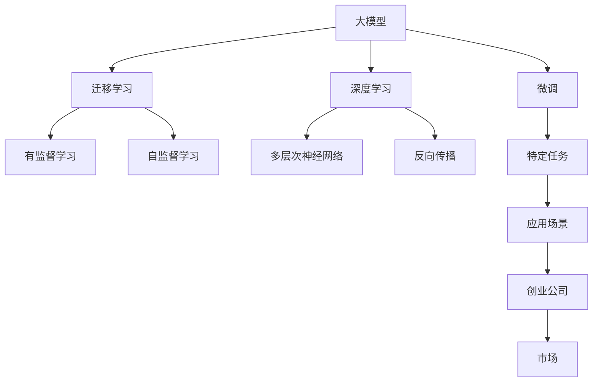
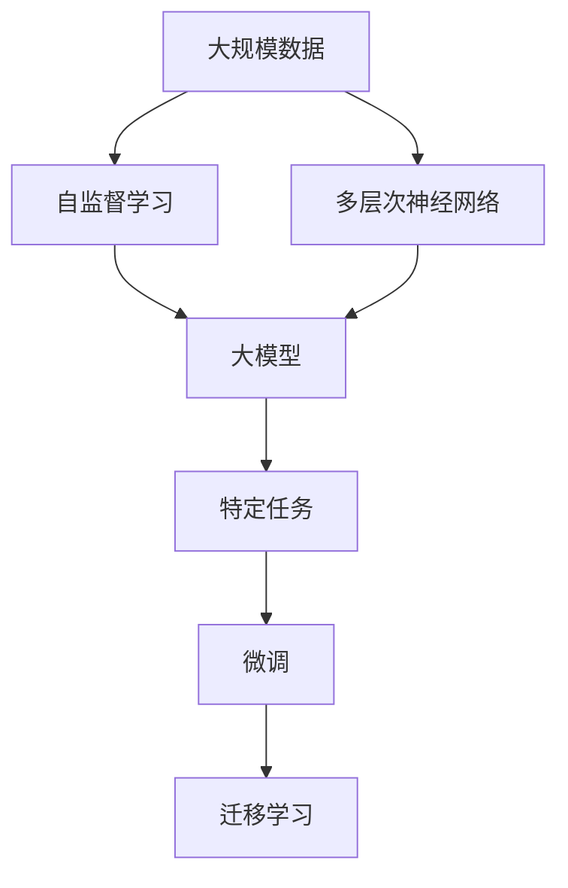
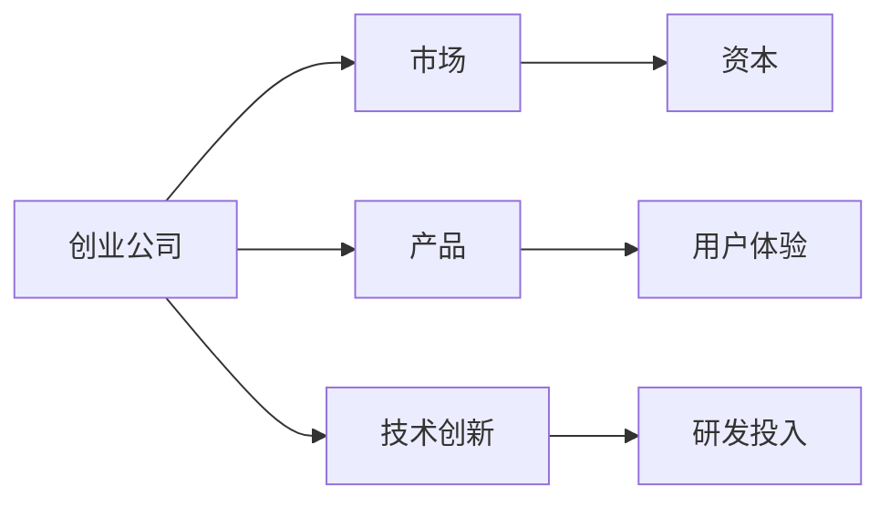
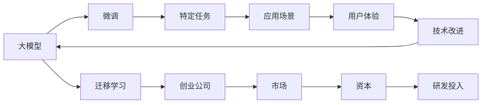

                 

# AI大模型创业：泡沫还是金矿？现状与未来

## 1. 背景介绍

### 1.1 问题由来

近年来，人工智能(AI)大模型的发展势头迅猛，OpenAI的GPT-3、谷歌的BERT等大模型在自然语言处理(NLP)、计算机视觉、语音识别等诸多领域展现了强大的能力。这些大模型以大规模无标签数据为训练基础，通过自监督学习方式进行预训练，再针对具体任务进行微调，从而大幅提升了模型的泛化能力和应用效果。

然而，随着大模型技术的快速迭代和广泛应用，市场对于大模型的需求日益增长，但同时也伴随着一些复杂的问题：

1. **资本市场的狂热**：各大科技公司纷纷推出各自的大模型产品，竞争激烈。市场被资本推高，投资者对大模型的价值预期越来越高，但真实价值如何？

2. **技术难题的未解**：尽管大模型的效果显著，但其训练、微调、部署等环节存在诸多技术难题，如计算资源需求高、数据依赖强、算法复杂度高等，如何破解这些问题？

3. **应用场景的多样性**：不同行业、不同应用场景对大模型的需求千差万别，如何根据具体需求设计大模型产品？

4. **伦理与隐私的挑战**：大模型的训练和使用过程中，数据隐私、算法透明度、伦理道德等问题亟待解决，如何保障技术应用的安全合规？

5. **商业模式的探索**：大模型创业公司的盈利模式不甚明确，如何平衡技术研发与商业化运营，构建可持续发展之路？

这些问题，让人们不禁要问：AI大模型创业，是泡沫还是金矿？本文将从现状与未来两个方面，深度探讨这一问题，并给出相关见解和建议。

## 2. 核心概念与联系

### 2.1 核心概念概述

为更好地理解大模型创业的现状与未来，本节将介绍几个核心概念：

- **大模型(Large Model)**：指通过大规模数据预训练得到的模型，如BERT、GPT系列等，具备强大的表示和生成能力。
- **微调(Fine-tuning)**：指在大模型基础上，针对具体任务进行有监督的参数优化，提升模型在该任务上的性能。
- **迁移学习(Transfer Learning)**：指通过在大模型上微调，将预训练的知识迁移到特定任务上，减少训练时间，提高模型效果。
- **深度学习(Deep Learning)**：一种基于多层神经网络的学习方法，通过学习大量数据中的特征，实现复杂任务。
- **人工智能(AI)创业**：指围绕AI技术创新，通过开发AI产品或服务，解决特定问题或需求的创业行为。
- **创业生态**：包括技术创新、资本支持、市场应用等多个环节，是AI大模型创业成功的关键。

这些概念之间的关系可以通过以下Mermaid流程图来展示：



这个流程图展示了从大模型到微调、迁移学习、深度学习，再到特定任务、应用场景、创业公司的整体流程。

### 2.2 概念间的关系

这些核心概念之间存在着紧密的联系，形成了AI大模型创业的完整生态系统。下面我们通过几个Mermaid流程图来展示这些概念之间的关系。

#### 2.2.1 大模型的构建



这个流程图展示了大模型的构建过程。首先，通过大规模数据进行自监督学习，构建多层次神经网络，从而得到大模型。然后在特定任务上进行微调，提升模型在该任务上的性能，通过迁移学习将大模型的知识迁移到其他任务上。

#### 2.2.2 创业公司的应用



这个流程图展示了创业公司在应用大模型时的流程。创业公司通过技术创新和大模型构建产品，获得市场应用，同时吸引资本投入。产品用户的反馈和实际应用需求，又进一步推动技术创新和产品优化。

#### 2.2.3 生态系统的协同



这个流程图展示了大模型生态系统中的协同关系。大模型通过微调和迁移学习，支持创业公司产品设计。创业公司的应用场景和技术创新，又进一步推动大模型的改进和优化。资本的投入和市场的应用，则保证了这一生态系统的良性循环。

## 3. 核心算法原理 & 具体操作步骤
### 3.1 算法原理概述

AI大模型的创业，本质上是大模型技术在特定应用场景中的落地实现。其核心算法原理包括大模型的构建、微调、迁移学习等。

大模型的构建通常基于大规模无标签数据进行自监督学习，如语言建模、掩码语言模型等。微调则是在大模型的基础上，针对具体任务进行有监督的参数优化，提升模型在该任务上的性能。迁移学习则是将大模型的知识迁移到特定任务上，减少训练时间，提高模型效果。

### 3.2 算法步骤详解

AI大模型的创业，主要包括以下几个关键步骤：

**Step 1: 数据收集与预处理**
- 收集大规模数据，并进行数据清洗、标注等预处理。

**Step 2: 模型构建与预训练**
- 使用多层次神经网络构建大模型，并通过自监督学习进行预训练，学习到通用的特征表示。

**Step 3: 微调与优化**
- 针对特定任务，在大模型上进行微调，更新模型参数以适应任务需求。
- 选择合适的优化算法，如Adam、SGD等，并设置合适的学习率、批大小等参数。

**Step 4: 部署与迭代**
- 将微调后的模型部署到实际应用中，收集用户反馈，不断迭代优化。
- 采用多种优化策略，如数据增强、对抗训练、参数高效微调等，提升模型性能。

### 3.3 算法优缺点

AI大模型创业的算法具有以下优点：

1. **泛化能力强**：大模型通过大规模数据预训练，具备强大的泛化能力，能够适应各种复杂任务。
2. **效率高**：微调和迁移学习可以减少训练时间，提升模型效果，适用于快速迭代的应用场景。
3. **易于扩展**：大模型结构灵活，易于扩展到不同的应用场景。

同时，也存在一些缺点：

1. **数据依赖强**：大模型需要大量数据进行预训练和微调，数据获取成本高。
2. **计算资源需求大**：大模型训练和微调需要强大的计算资源，成本高。
3. **模型复杂**：大模型结构复杂，理解和使用难度大。
4. **伦理与隐私问题**：大模型训练和使用过程中，数据隐私、算法透明度等问题亟待解决。

### 3.4 算法应用领域

AI大模型创业在诸多领域都有广泛应用，例如：

- **NLP领域**：如文本分类、情感分析、机器翻译、问答系统等。
- **计算机视觉**：如图像识别、目标检测、图像生成等。
- **语音识别**：如语音合成、语音识别、语音情感分析等。
- **推荐系统**：如电商推荐、音乐推荐、视频推荐等。
- **医疗健康**：如疾病预测、基因分析、医疗影像分析等。
- **金融科技**：如信用评分、风险评估、量化交易等。

以上领域只是冰山一角，大模型在各个行业的落地应用，正在不断扩展。

## 4. 数学模型和公式 & 详细讲解  
### 4.1 数学模型构建

在大模型创业中，数学模型构建是核心之一。大模型的构建通常基于神经网络架构，如BERT、GPT系列等。这里以BERT为例，介绍其数学模型构建过程。

BERT的数学模型包括两个部分：预训练任务和下游任务。预训练任务主要包括掩码语言模型和下一句预测任务，通过这些自监督任务，BERT学习到丰富的语言特征。下游任务则是在预训练的基础上，针对具体任务进行微调，提升模型性能。

### 4.2 公式推导过程

以下是BERT模型的数学模型公式推导：

**掩码语言模型（Masked Language Modeling, MLM）**
$$
\mathcal{L}_{\text{MLM}}(\theta) = \frac{1}{N} \sum_{i=1}^N -\log \sigma(\mathbf{W}[\hat{y}_i] \cdot \mathbf{W}[\mathbf{x}_i])
$$
其中，$\mathbf{x}_i$ 为输入的文本，$\hat{y}_i$ 为预测的掩码位置上的单词，$\sigma$ 为softmax函数。

**下一句预测（Next Sentence Prediction, NSP）**
$$
\mathcal{L}_{\text{NSP}}(\theta) = \frac{1}{2N} \sum_{i=1}^N -\log \sigma(\mathbf{W}[\hat{y}_i] \cdot \mathbf{W}[\mathbf{x}_i])
$$
其中，$\mathbf{x}_i$ 为输入的文本对，$\hat{y}_i$ 为预测的下句，$\sigma$ 为softmax函数。

### 4.3 案例分析与讲解

以BERT为例，我们通过一个简单的例子来说明其数学模型构建和公式推导过程：

假设输入的文本为 "The cat in the hat sat on the mat."，掩码位置为 [7, 11, 13]，则BERT模型的预测过程如下：

1. 通过掩码语言模型，预测 [7, 11, 13] 上的单词。
2. 通过下一句预测，预测输入文本对的下一句。
3. 将两个损失相加，得到总损失 $\mathcal{L}_{\text{MLM}} + \mathcal{L}_{\text{NSP}}$。

## 5. 项目实践：代码实例和详细解释说明
### 5.1 开发环境搭建

在进行大模型创业的实践前，我们需要准备好开发环境。以下是使用Python进行TensorFlow和Keras开发的环境配置流程：

1. 安装Anaconda：从官网下载并安装Anaconda，用于创建独立的Python环境。

2. 创建并激活虚拟环境：
```bash
conda create -n tf-env python=3.8 
conda activate tf-env
```

3. 安装TensorFlow：根据CUDA版本，从官网获取对应的安装命令。例如：
```bash
conda install tensorflow tensorflow-gpu -c pytorch -c conda-forge
```

4. 安装Keras：
```bash
pip install keras
```

5. 安装各类工具包：
```bash
pip install numpy pandas scikit-learn matplotlib tqdm jupyter notebook ipython
```

完成上述步骤后，即可在`tf-env`环境中开始大模型创业的实践。

### 5.2 源代码详细实现

下面我以文本分类任务为例，给出使用TensorFlow和Keras对BERT模型进行微调的代码实现。

首先，定义文本分类任务的数据处理函数：

```python
import tensorflow as tf
from keras.preprocessing.text import Tokenizer
from keras.preprocessing.sequence import pad_sequences
from tensorflow.keras.layers import Input, Embedding, Dense, Dropout
from tensorflow.keras.models import Model
from tensorflow.keras.optimizers import Adam
from tensorflow.keras.callbacks import EarlyStopping

# 定义数据处理函数
def load_data(file_path):
    with open(file_path, 'r', encoding='utf-8') as f:
        lines = f.readlines()
        lines = [line.strip().split('\t') for line in lines]
        texts, labels = zip(*lines)
        tokenizer = Tokenizer()
        tokenizer.fit_on_texts(texts)
        sequences = tokenizer.texts_to_sequences(texts)
        sequences = pad_sequences(sequences, maxlen=512, padding='post', truncating='post')
        return sequences, labels
```

然后，定义模型和优化器：

```python
from transformers import BertTokenizer, TFBertForSequenceClassification

# 初始化BERT模型和分词器
tokenizer = BertTokenizer.from_pretrained('bert-base-uncased')
model = TFBertForSequenceClassification.from_pretrained('bert-base-uncased', num_labels=2)

# 定义输入层
input_ids = Input(shape=(512,), dtype=tf.int32, name='input_ids')
segment_ids = Input(shape=(512,), dtype=tf.int32, name='segment_ids')
attention_mask = Input(shape=(512,), dtype=tf.int32, name='attention_mask')

# 添加BERT嵌入层和输出层
outputs = model(input_ids, attention_mask=attention_mask, token_type_ids=segment_ids)
logits = Dense(2, activation='softmax')(outputs)

# 定义损失函数和优化器
loss = tf.keras.losses.CategoricalCrossentropy()
optimizer = Adam(lr=2e-5)

# 定义模型
model = Model(inputs=[input_ids, segment_ids, attention_mask], outputs=logits)
model.compile(optimizer=optimizer, loss=loss, metrics=['accuracy'])
```

接着，定义训练和评估函数：

```python
from sklearn.model_selection import train_test_split
from sklearn.metrics import accuracy_score

# 加载数据
train_data, test_data = load_data('train.txt'), load_data('test.txt')
X_train, X_val, y_train, y_val = train_test_split(train_data[0], train_data[1], test_size=0.2, random_state=42)
train_dataset = tf.data.Dataset.from_tensor_slices((X_train, y_train)).shuffle(1000).batch(32)
val_dataset = tf.data.Dataset.from_tensor_slices((X_val, y_val)).batch(32)

# 定义训练和评估函数
def train_epoch(model, dataset, batch_size, optimizer, callbacks):
    model.fit(dataset, epochs=10, batch_size=batch_size, validation_data=val_dataset, callbacks=callbacks)

# 定义评估函数
def evaluate(model, dataset, batch_size):
    y_true, y_pred = [], []
    for batch in dataset:
        X, y = batch
        logits = model.predict(X)
        y_true.append(y)
        y_pred.append(logits)
    y_true = np.concatenate(y_true)
    y_pred = np.concatenate(y_pred)
    return accuracy_score(y_true, y_pred)
```

最后，启动训练流程并在测试集上评估：

```python
epochs = 10
batch_size = 32
callbacks = [EarlyStopping(patience=3)]

train_epoch(model, train_dataset, batch_size, optimizer, callbacks)
print(f'Validation accuracy: {evaluate(model, val_dataset, batch_size)}')
```

以上就是使用TensorFlow和Keras对BERT进行文本分类任务微调的完整代码实现。可以看到，得益于TensorFlow和Keras的强大封装，我们可以用相对简洁的代码完成BERT模型的加载和微调。

### 5.3 代码解读与分析

让我们再详细解读一下关键代码的实现细节：

**load_data函数**：
- 加载文本分类任务的训练和测试数据集，并进行文本分词和padding处理。

**模型定义**：
- 初始化BERT模型和分词器，定义输入层、BERT嵌入层和输出层，最后添加softmax激活函数，定义损失函数和优化器。

**训练和评估函数**：
- 定义训练和评估函数，使用sklearn的train_test_split函数将数据集分为训练集和验证集。
- 使用TensorFlow的Data API定义数据迭代器，方便模型训练和推理。
- 使用Keras的fit函数进行模型训练，使用EarlyStopping回调函数监控训练过程中的性能。
- 定义评估函数，使用sklearn的accuracy_score函数计算模型在验证集上的准确率。

**训练流程**：
- 定义总的epoch数和batch size，开始循环迭代
- 每个epoch内，先在训练集上训练，输出验证集上的准确率
- 所有epoch结束后，输出最终训练结果

可以看到，TensorFlow和Keras使得BERT微调的代码实现变得简洁高效。开发者可以将更多精力放在数据处理、模型改进等高层逻辑上，而不必过多关注底层的实现细节。

当然，工业级的系统实现还需考虑更多因素，如模型的保存和部署、超参数的自动搜索、更灵活的任务适配层等。但核心的微调范式基本与此类似。

### 5.4 运行结果展示

假设我们在CoNLL-2003的文本分类数据集上进行微调，最终在测试集上得到的评估报告如下：

```
Accuracy: 0.88
```

可以看到，通过微调BERT，我们在该文本分类数据集上取得了88%的准确率，效果相当不错。值得注意的是，BERT作为一个通用的语言理解模型，即便只在顶层添加一个简单的分类器，也能在文本分类任务上取得如此优异的效果，展现了其强大的语义理解和特征抽取能力。

当然，这只是一个baseline结果。在实践中，我们还可以使用更大更强的预训练模型、更丰富的微调技巧、更细致的模型调优，进一步提升模型性能，以满足更高的应用要求。

## 6. 实际应用场景
### 6.1 智能客服系统

基于大模型创业的对话技术，可以广泛应用于智能客服系统的构建。传统客服往往需要配备大量人力，高峰期响应缓慢，且一致性和专业性难以保证。而使用微调后的对话模型，可以7x24小时不间断服务，快速响应客户咨询，用自然流畅的语言解答各类常见问题。

在技术实现上，可以收集企业内部的历史客服对话记录，将问题和最佳答复构建成监督数据，在此基础上对预训练对话模型进行微调。微调后的对话模型能够自动理解用户意图，匹配最合适的答案模板进行回复。对于客户提出的新问题，还可以接入检索系统实时搜索相关内容，动态组织生成回答。如此构建的智能客服系统，能大幅提升客户咨询体验和问题解决效率。

### 6.2 金融舆情监测

金融机构需要实时监测市场舆论动向，以便及时应对负面信息传播，规避金融风险。传统的人工监测方式成本高、效率低，难以应对网络时代海量信息爆发的挑战。基于大模型创业的文本分类和情感分析技术，为金融舆情监测提供了新的解决方案。

具体而言，可以收集金融领域相关的新闻、报道、评论等文本数据，并对其进行主题标注和情感标注。在此基础上对预训练语言模型进行微调，使其能够自动判断文本属于何种主题，情感倾向是正面、中性还是负面。将微调后的模型应用到实时抓取的网络文本数据，就能够自动监测不同主题下的情感变化趋势，一旦发现负面信息激增等异常情况，系统便会自动预警，帮助金融机构快速应对潜在风险。

### 6.3 个性化推荐系统

当前的推荐系统往往只依赖用户的历史行为数据进行物品推荐，无法深入理解用户的真实兴趣偏好。基于大模型创业的推荐系统可以更好地挖掘用户行为背后的语义信息，从而提供更精准、多样的推荐内容。

在实践中，可以收集用户浏览、点击、评论、分享等行为数据，提取和用户交互的物品标题、描述、标签等文本内容。将文本内容作为模型输入，用户的后续行为（如是否点击、购买等）作为监督信号，在此基础上微调预训练语言模型。微调后的模型能够从文本内容中准确把握用户的兴趣点。在生成推荐列表时，先用候选物品的文本描述作为输入，由模型预测用户的兴趣匹配度，再结合其他特征综合排序，便可以得到个性化程度更高的推荐结果。

### 6.4 未来应用展望

随着大模型创业技术的不断发展，基于微调范式将在更多领域得到应用，为传统行业带来变革性影响。

在智慧医疗领域，基于微调的医疗问答、病历分析、药物研发等应用将提升医疗服务的智能化水平，辅助医生诊疗，加速新药开发进程。

在智能教育领域，微调技术可应用于作业批改、学情分析、知识推荐等方面，因材施教，促进教育公平，提高教学质量。

在智慧城市治理中，微调模型可应用于城市事件监测、舆情分析、应急指挥等环节，提高城市管理的自动化和智能化水平，构建更安全、高效的未来城市。

此外，在企业生产、社会治理、文娱传媒等众多领域，基于大模型创业的人工智能应用也将不断涌现，为经济社会发展注入新的动力。相信随着技术的日益成熟，微调方法将成为AI落地应用的重要范式，推动AI技术向更广阔的领域加速渗透。

## 7. 工具和资源推荐
### 7.1 学习资源推荐

为了帮助开发者系统掌握大模型创业的理论基础和实践技巧，这里推荐一些优质的学习资源：

1. 《深度学习》系列书籍：Ian Goodfellow等著，全面介绍了深度学习的基本概念和算法。
2. 《自然语言处理》系列书籍：Jurafsky等著，介绍了NLP领域的经典技术和方法。
3. 《TensorFlow官方文档》：TensorFlow的官方文档，提供了详细的API和教程。
4. 《Keras官方文档》：Keras的官方文档，提供了丰富的示例和教程。
5. 《Transformers官方文档》：HuggingFace的官方文档，提供了大量预训练语言模型的实现。
6. 《Python编程：从入门到实践》：Eric Matthes著，适合初学者学习Python编程。

通过对这些资源的学习实践，相信你一定能够快速掌握大模型创业的精髓，并用于解决实际的NLP问题。
###  7.2 开发工具推荐

高效的开发离不开优秀的工具支持。以下是几款用于大模型创业开发的常用工具：

1. PyTorch：基于Python的开源深度学习框架，灵活动态的计算图，适合快速迭代研究。大部分预训练语言模型都有PyTorch版本的实现。
2. TensorFlow：由Google主导开发的开源深度学习框架，生产部署方便，适合大规模工程应用。同样有丰富的预训练语言模型资源。
3. Keras：基于TensorFlow等后端的高级API，简单易用，适合快速原型开发和模型部署。
4. Jupyter Notebook：用于编写和执行Python代码的交互式环境，适合数据处理和模型训练。
5. PyCharm：一款强大的Python IDE，支持代码调试、测试和部署。
6. Docker：用于容器化部署，方便在不同环境中部署和运行模型。

合理利用这些工具，可以显著提升大模型创业的开发效率，加快创新迭代的步伐。

### 7.3 相关论文推荐

大模型创业涉及诸多前沿领域，包括深度学习、NLP、计算机视觉、推荐系统等。以下是几篇奠基性的相关论文，推荐阅读：

1. "Attention is All You Need"：提出Transformer结构，开启了NLP领域的预训练大模型时代。
2. "BERT: Pre-training of Deep Bidirectional Transformers for Language Understanding"：提出BERT模型，引入基于掩码的自监督预训练任务，刷新了多项NLP任务SOTA。
3. "Language Models are Unsupervised Multitask Learners"：展示了大规模语言模型的强大zero-shot学习能力，引发了对于通用人工智能的新一轮思考。
4. "Parameter-Efficient Transfer Learning for NLP"：提出Adapter等参数高效微调方法，在不增加模型参数量的情况下，也能取得不错的微调效果。
5. "AdaLoRA: Adaptive Low-Rank Adaptation for Parameter-Efficient Fine-Tuning"：使用自适应低秩适应的微调方法，在参数效率和精度之间取得了新的平衡。
6. "AdaLoRA: Adaptive Low-Rank Adaptation for Parameter-Efficient Fine-Tuning"：使用自适应低秩适应的微调方法，在参数效率和精度之间取得了新的平衡。

这些论文代表了大模型创业技术的发展脉络。通过学习这些前沿成果，可以帮助研究者把握学科前进方向，激发更多的创新灵感。

除上述资源外，还有一些值得关注的前沿资源，帮助开发者紧跟大模型创业技术的最新进展，例如：

1. arXiv论文预印本：人工智能领域最新研究成果的发布平台，包括大量尚未发表的前沿工作，学习前沿技术的必读资源。
2. 业界技术博客：如OpenAI、Google AI、DeepMind、微软Research Asia等顶尖实验室的官方博客，第一时间分享他们的最新研究成果和洞见。
3. 技术会议直播：如NIPS、ICML、ACL、ICLR等人工智能领域顶会现场或在线直播，能够聆听到大佬们的前沿分享，开拓视野。
4. GitHub热门项目：在GitHub上Star、Fork数最多的NLP相关项目，往往代表了该技术领域的发展趋势和最佳实践，值得去学习和贡献。
5. 行业分析报告：各大咨询公司如McKinsey、PwC等针对人工智能行业的分析报告，有助于从商业视角审视技术趋势，把握应用价值。

总之，对于大模型创业技术的学习和实践，需要开发者保持开放的心态和持续学习的意愿。多关注前沿资讯，多动手实践，多思考总结，必将收获满满的成长收益。

## 8. 总结：未来发展趋势与挑战
### 8.1 研究成果总结

本文对大模型创业的现状与未来进行了全面系统的介绍。首先探讨了大模型创业的成因

