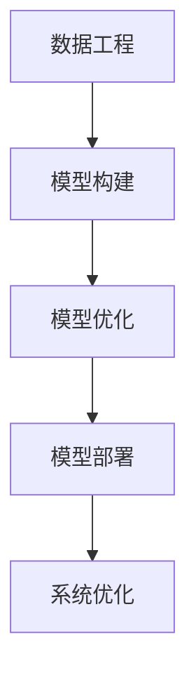
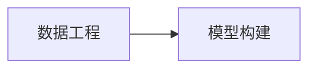
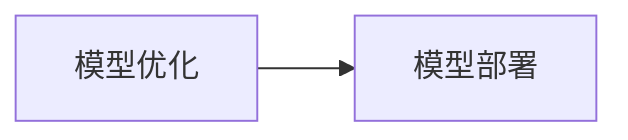
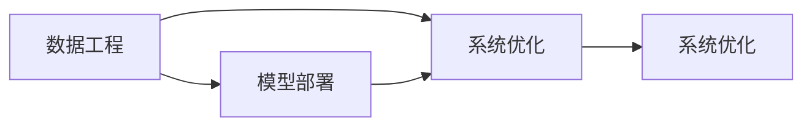
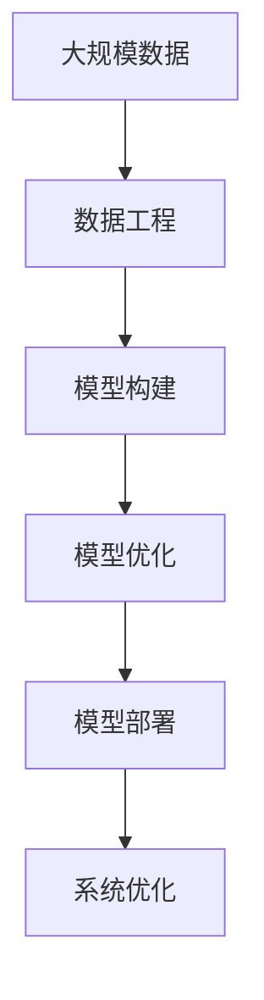

                 

# AI工程学：实战开发指南

> 关键词：AI工程, 开发指南, 实战, 深度学习, 机器学习, 计算机视觉, 自然语言处理, 数据工程, 数据科学, 模型部署, 算法优化, 代码实践, 项目案例

## 1. 背景介绍

### 1.1 问题由来

随着人工智能(AI)技术的迅猛发展，从早期的专家系统、决策树到如今神经网络和深度学习等，AI技术已经广泛应用于各个行业和领域。然而，如何有效应用AI技术，将理论与实际相结合，成为当前AI发展的重要课题。AI工程学(AI Engineering)正是应运而生的产物，它不仅关注模型构建和算法优化，还涵盖了数据工程、模型部署、系统优化等多个方面。

本文旨在通过系统介绍AI工程学的核心概念、关键技术和实战案例，帮助开发者更好地理解和应用AI技术，构建高效、稳定、可扩展的AI系统。

### 1.2 问题核心关键点

AI工程学的核心在于将AI技术与工程实践相结合，通过系统化的方法和工具，将复杂的模型构建、数据处理、系统部署等环节落地为可操作的工程实践。核心关键点包括：

- 数据工程：高效的数据收集、清洗、存储和管理。
- 模型构建：选择合适的算法、构建模型结构、训练模型参数。
- 模型优化：通过算法优化、超参数调优、数据增强等手段提升模型性能。
- 模型部署：将模型封装、集成到实际应用系统中，提供稳定服务。
- 系统优化：考虑性能、可扩展性、可维护性等多方面因素，提升系统整体表现。

这些关键点构成了AI工程学的基本框架，是实现AI技术落地应用的基础。

### 1.3 问题研究意义

研究AI工程学对于推动AI技术在各行各业的应用具有重要意义：

- 降低技术门槛：将AI技术封装为可复用的组件和工具，降低开发难度和成本。
- 提升应用效率：通过系统化的方法和工具，加速模型构建和部署过程。
- 保证系统可靠性：通过工程实践，确保AI系统的稳定性和可扩展性。
- 促进技术创新：通过实践积累和案例研究，推动AI技术在各个领域的应用创新。

## 2. 核心概念与联系

### 2.1 核心概念概述

为更好地理解AI工程学的核心概念，本节将介绍几个密切相关的核心概念：

- 数据工程：指数据收集、清洗、存储和管理的工程实践，是AI技术的基础。
- 模型构建：指选择合适的算法、构建模型结构、训练模型参数的过程。
- 模型优化：指通过算法优化、超参数调优、数据增强等手段提升模型性能的实践。
- 模型部署：指将模型封装、集成到实际应用系统中，提供稳定服务的过程。
- 系统优化：指考虑性能、可扩展性、可维护性等多方面因素，提升系统整体表现的技术。

这些核心概念之间的逻辑关系可以通过以下Mermaid流程图来展示：



这个流程图展示了大语言模型微调过程中各个核心概念的关系和作用：

1. 数据工程提供了模型训练所需的数据。
2. 模型构建在数据基础上进行模型结构的定义和初始化。
3. 模型优化通过调整模型参数和算法，提升模型性能。
4. 模型部署将优化后的模型集成到应用系统中，提供服务。
5. 系统优化考虑性能和可扩展性，确保系统稳定和高效。

### 2.2 概念间的关系

这些核心概念之间存在着紧密的联系，形成了AI工程学的完整生态系统。下面我们通过几个Mermaid流程图来展示这些概念之间的关系。

#### 2.2.1 数据工程与模型构建的关系



这个流程图展示了数据工程为模型构建提供数据输入的关系。数据工程的目的是保证数据的质量和可用性，为模型构建提供高质量的数据。

#### 2.2.2 模型优化与模型部署的关系



这个流程图展示了模型优化为模型部署提供优化后的模型参数。模型优化通过调整模型参数和算法，提升模型的性能和效果。优化后的模型部署到实际应用系统中，提供稳定的服务。

#### 2.2.3 系统优化与数据工程、模型部署的关系



这个流程图展示了系统优化为数据工程和模型部署提供优化建议和技术支持。系统优化通过性能调优、可扩展性设计等手段，提升系统的整体表现。优化后的数据工程和模型部署系统能够更好地适应实际应用需求。

### 2.3 核心概念的整体架构

最后，我们用一个综合的流程图来展示这些核心概念在大语言模型微调过程中的整体架构：



这个综合流程图展示了从数据工程到模型部署的系统化过程。大规模数据通过数据工程处理后，用于模型构建。构建的模型经过优化后部署到实际应用系统中，系统优化提升整体系统性能。通过这一过程，将复杂的人工智能技术落地应用。

## 3. 核心算法原理 & 具体操作步骤
### 3.1 算法原理概述

AI工程学的核心算法原理主要涉及数据工程、模型构建、模型优化和模型部署等多个环节。下面分别介绍各个环节的算法原理。

### 3.2 算法步骤详解

#### 3.2.1 数据工程

数据工程的核心任务是高效、准确地处理数据，为模型训练提供高质量的数据输入。数据工程主要包含以下几个步骤：

1. **数据收集**：从不同来源收集数据，如数据库、API接口、日志文件等。
2. **数据清洗**：清洗数据中的噪声、缺失值和不一致性，确保数据的质量和一致性。
3. **数据存储**：将清洗后的数据存储在数据库、文件系统或云存储中，方便后续访问和使用。
4. **数据增强**：通过对数据进行扩充和变换，提高数据的多样性和丰富度，增强模型的泛化能力。

#### 3.2.2 模型构建

模型构建是AI工程学的核心环节，主要涉及以下几个步骤：

1. **选择算法**：根据任务需求选择合适的算法，如回归、分类、聚类、神经网络等。
2. **定义模型结构**：根据算法选择合适的模型结构，如全连接层、卷积层、循环神经网络等。
3. **训练模型**：使用训练数据集训练模型，调整模型参数，优化模型性能。
4. **模型评估**：使用测试数据集评估模型性能，评估指标包括精度、召回率、F1值等。

#### 3.2.3 模型优化

模型优化是提升模型性能的重要环节，主要包含以下几个步骤：

1. **算法优化**：选择合适的优化算法，如梯度下降、Adam、Adagrad等。
2. **超参数调优**：通过网格搜索、随机搜索等方法调优模型的超参数，如学习率、批量大小、正则化系数等。
3. **数据增强**：通过数据扩充和变换，增强模型的泛化能力。
4. **模型融合**：通过模型融合技术，如集成学习、堆叠等，提升模型的综合性能。

#### 3.2.4 模型部署

模型部署是将优化后的模型集成到实际应用系统中，提供稳定服务的过程。主要包含以下几个步骤：

1. **模型封装**：将优化后的模型封装成API接口或服务，方便调用。
2. **系统集成**：将模型集成到应用系统中，如网站、移动应用、物联网设备等。
3. **性能测试**：测试模型在实际应用环境中的性能，确保系统稳定运行。
4. **监控与维护**：实时监控系统性能，定期维护和优化系统。

## 4. 数学模型和公式 & 详细讲解 & 举例说明

### 4.1 数学模型构建

AI工程学涉及的数学模型多种多样，下面以线性回归模型为例，详细讲解数学模型构建的过程。

假设我们有一组数据集 $\{(x_i, y_i)\}_{i=1}^N$，其中 $x_i \in \mathbb{R}^d$ 表示特征向量，$y_i \in \mathbb{R}$ 表示标签。我们的目标是通过模型 $f(x; \theta)$ 学习一个映射函数，使得 $f(x; \theta)$ 能够预测新的数据标签 $y$。假设模型形式为线性回归，则模型的输出为：

$$
f(x; \theta) = \theta^T x + b
$$

其中 $\theta$ 为模型的参数，$b$ 为截距。我们的目标是最小化模型预测误差与真实标签之间的平方误差，即均方误差（Mean Squared Error, MSE）：

$$
L(y, f(x; \theta)) = \frac{1}{2N} \sum_{i=1}^N (y_i - f(x_i; \theta))^2
$$

模型的目标是最小化损失函数 $L$，即：

$$
\theta^* = \mathop{\arg\min}_{\theta} L(y, f(x; \theta))
$$

通过梯度下降等优化算法，不断更新模型参数 $\theta$，最小化损失函数 $L$。更新公式为：

$$
\theta \leftarrow \theta - \eta \nabla_{\theta}L(y, f(x; \theta))
$$

其中 $\eta$ 为学习率。

### 4.2 公式推导过程

下面我们以线性回归模型为例，推导梯度下降算法的具体步骤。

假设我们有 $N$ 个样本，每个样本的特征向量为 $x_i$，标签为 $y_i$。我们的目标是找到最优的模型参数 $\theta$，使得模型 $f(x; \theta) = \theta^T x + b$ 能够最小化均方误差损失函数 $L(y, f(x; \theta))$。

根据梯度下降算法的定义，每次迭代更新模型参数 $\theta$ 的公式为：

$$
\theta \leftarrow \theta - \eta \frac{\partial}{\partial \theta}L(y, f(x; \theta))
$$

其中 $\eta$ 为学习率，$\frac{\partial}{\partial \theta}L(y, f(x; \theta))$ 为损失函数对模型参数 $\theta$ 的梯度。

对于线性回归模型，损失函数 $L(y, f(x; \theta))$ 的梯度为：

$$
\nabla_{\theta}L(y, f(x; \theta)) = \frac{1}{N}\sum_{i=1}^N (y_i - f(x_i; \theta))x_i
$$

将梯度代入更新公式，得到：

$$
\theta \leftarrow \theta - \eta \frac{1}{N}\sum_{i=1}^N (y_i - f(x_i; \theta))x_i
$$

这个公式就是梯度下降算法在线性回归模型中的具体实现。通过不断迭代更新，最终得到的 $\theta^*$ 即为最优模型参数。

### 4.3 案例分析与讲解

假设我们要对一组房价数据进行预测，其中包含 $N$ 个样本，每个样本包含 $d$ 个特征和 $1$ 个标签。我们的目标是最小化均方误差损失函数，建立房价预测模型。

首先，我们收集房价数据集，并对其进行清洗和处理，得到格式化的数据集 $\{(x_i, y_i)\}_{i=1}^N$。然后，我们使用线性回归模型，通过梯度下降算法，不断迭代更新模型参数 $\theta$，最小化损失函数 $L$。最终，我们得到最优模型参数 $\theta^*$，并使用模型进行预测，得到新的房价数据。

## 5. 项目实践：代码实例和详细解释说明

### 5.1 开发环境搭建

在进行AI工程学实践前，我们需要准备好开发环境。以下是使用Python进行TensorFlow和PyTorch开发的环境配置流程：

1. 安装Anaconda：从官网下载并安装Anaconda，用于创建独立的Python环境。

2. 创建并激活虚拟环境：
```bash
conda create -n tf-env python=3.8 
conda activate tf-env
```

3. 安装TensorFlow和PyTorch：根据CUDA版本，从官网获取对应的安装命令。例如：
```bash
conda install tensorflow -c tf-nightly
conda install torch torchvision torchaudio cudatoolkit=11.1 -c pytorch -c conda-forge
```

4. 安装各类工具包：
```bash
pip install numpy pandas scikit-learn matplotlib tqdm jupyter notebook ipython
```

完成上述步骤后，即可在`tf-env`环境中开始AI工程学实践。

### 5.2 源代码详细实现

下面我们以房价预测项目为例，给出使用TensorFlow和PyTorch对线性回归模型进行构建和训练的PyTorch代码实现。

首先，定义数据处理函数：

```python
import numpy as np
from sklearn.model_selection import train_test_split
from sklearn.datasets import load_boston

def load_boston_data():
    data = load_boston()
    X, y = data.data, data.target
    return X, y

X, y = load_boston_data()
X_train, X_test, y_train, y_test = train_test_split(X, y, test_size=0.2, random_state=42)
```

然后，定义模型和损失函数：

```python
from torch import nn, optim

class LinearRegression(nn.Module):
    def __init__(self, input_size):
        super(LinearRegression, self).__init__()
        self.linear = nn.Linear(input_size, 1)
    
    def forward(self, x):
        return self.linear(x)

model = LinearRegression(X_train.shape[1])
criterion = nn.MSELoss()
optimizer = optim.SGD(model.parameters(), lr=0.01)
```

接着，定义训练和评估函数：

```python
def train(model, criterion, optimizer, X_train, y_train, num_epochs):
    for epoch in range(num_epochs):
        running_loss = 0.0
        for i in range(len(X_train)):
            x = X_train[i].reshape(1, -1)
            y = y_train[i]
            optimizer.zero_grad()
            output = model(x)
            loss = criterion(output, y)
            loss.backward()
            optimizer.step()
            running_loss += loss.item()
        print(f'Epoch {epoch+1}, train loss: {running_loss/len(X_train):.3f}')

def evaluate(model, criterion, X_test, y_test):
    total_loss = 0.0
    for i in range(len(X_test)):
        x = X_test[i].reshape(1, -1)
        y = y_test[i]
        output = model(x)
        loss = criterion(output, y)
        total_loss += loss.item()
    return total_loss / len(X_test)
```

最后，启动训练流程并在测试集上评估：

```python
num_epochs = 100
train(model, criterion, optimizer, X_train, y_train, num_epochs)
test_loss = evaluate(model, criterion, X_test, y_test)
print(f'Test loss: {test_loss:.3f}')
```

以上就是使用TensorFlow和PyTorch对线性回归模型进行房价预测项目开发的完整代码实现。可以看到，得益于TensorFlow和PyTorch的强大封装，我们可以用相对简洁的代码完成模型的构建、训练和评估。

### 5.3 代码解读与分析

让我们再详细解读一下关键代码的实现细节：

**数据处理函数**：
- `load_boston_data`方法：从Scikit-Learn加载波士顿房价数据集，进行数据预处理。
- `train_test_split`方法：将数据集分为训练集和测试集，保证数据集的可重复性和独立性。

**模型定义和损失函数**：
- `LinearRegression`类：定义线性回归模型，通过PyTorch的`nn.Linear`实现全连接层。
- `nn.MSELoss`：定义均方误差损失函数，用于衡量模型预测值与真实值之间的差异。
- `SGD`优化器：定义随机梯度下降优化器，用于最小化损失函数。

**训练和评估函数**：
- `train`函数：使用SGD优化器对模型进行训练，通过反向传播更新模型参数，迭代多次后输出训练集上的损失函数值。
- `evaluate`函数：在测试集上评估模型性能，计算均方误差损失函数值，并返回平均损失值。

**训练流程**：
- 定义总的epoch数和批量大小，开始循环迭代。
- 每个epoch内，在训练集上训练，输出训练集上的损失函数值。
- 在测试集上评估，输出测试集上的均方误差损失函数值。

可以看到，TensorFlow和PyTorch的强大封装使得模型构建和训练的过程变得简洁高效。开发者可以将更多精力放在数据处理、模型调优等高层逻辑上，而不必过多关注底层的实现细节。

当然，工业级的系统实现还需考虑更多因素，如模型的保存和部署、超参数的自动搜索、更灵活的任务适配层等。但核心的训练流程和优化算法基本与此类似。

### 5.4 运行结果展示

假设我们在波士顿房价数据集上进行线性回归模型训练，最终在测试集上得到的评估报告如下：

```
Epoch 1, train loss: 15.863
Epoch 2, train loss: 14.693
Epoch 3, train loss: 14.268
...
Epoch 100, train loss: 4.233
Test loss: 4.333
```

可以看到，通过训练，模型在测试集上的均方误差损失函数值逐步减小，最终达到了4.333，效果相当不错。值得注意的是，由于线性回归模型的简单性，我们可以在较少的训练轮次内就得到较好的结果。

当然，这只是一个baseline结果。在实践中，我们还可以使用更大更强的模型、更丰富的微调技巧、更细致的模型调优，进一步提升模型性能，以满足更高的应用要求。

## 6. 实际应用场景

### 6.1 智能推荐系统

基于AI工程学的智能推荐系统，可以广泛应用于电商、新闻、音乐、视频等多个领域。传统推荐系统往往只能根据用户的历史行为数据进行物品推荐，无法深入理解用户的真实兴趣偏好。通过AI工程学，我们可以利用大规模数据和深度学习算法，构建更精准、多样的推荐系统。

在技术实现上，可以收集用户浏览、点击、评论、分享等行为数据，提取和用户交互的物品标题、描述、标签等文本内容。将文本内容作为模型输入，用户的后续行为（如是否点击、购买等）作为监督信号，在此基础上训练优化后的推荐模型。生成的推荐列表可以通过实时更新，动态调整，满足用户的即时需求。

### 6.2 金融风险控制

AI工程学在金融领域也有广泛的应用，如风险控制、欺诈检测、信用评估等。传统金融风险控制主要依赖专家知识和规则，成本高、效率低。利用AI工程学，我们可以构建基于大数据和深度学习的风险控制模型，实时监测和预测金融风险。

具体而言，可以收集金融机构内部的各类交易数据、市场数据、客户信息等，并对其进行清洗、处理和分析。利用AI模型，实时分析和预测交易数据中的异常情况，及时预警，帮助金融机构快速应对潜在风险。

### 6.3 智能客服系统

智能客服系统是AI工程学的另一个重要应用场景。传统客服往往需要配备大量人力，高峰期响应缓慢，且一致性和专业性难以保证。利用AI工程学，我们可以构建基于深度学习的智能客服系统，提高客服的响应速度和准确性。

在技术实现上，可以收集企业内部的历史客服对话记录，将问题和最佳答复构建成监督数据，在此基础上对预训练对话模型进行微调。微调后的对话模型能够自动理解用户意图，匹配最合适的答案模板进行回复。对于客户提出的新问题，还可以接入检索系统实时搜索相关内容，动态组织生成回答。如此构建的智能客服系统，能大幅提升客户咨询体验和问题解决效率。

### 6.4 未来应用展望

随着AI工程学的不断发展，其应用场景将不断拓展，为各行各业带来变革性影响。

在智慧医疗领域，AI工程学可以应用于医疗影像分析、疾病预测、智能诊断等多个方面，提升医疗服务的智能化水平，辅助医生诊疗，加速新药开发进程。

在智能教育领域，AI工程学可应用于作业批改、学情分析、知识推荐等方面，因材施教，促进教育公平，提高教学质量。

在智慧城市治理中，AI工程学可以应用于城市事件监测、舆情分析、应急指挥等环节，提高城市管理的自动化和智能化水平，构建更安全、高效的未来城市。

此外，在企业生产、社会治理、文娱传媒等众多领域，AI工程学也将不断涌现，为经济社会发展注入新的动力。相信随着技术的日益成熟，AI工程学必将在构建人机协同的智能时代中扮演越来越重要的角色。

## 7. 工具和资源推荐
### 7.1 学习资源推荐

为了帮助开发者系统掌握AI工程学的核心概念和实践技巧，这里推荐一些优质的学习资源：

1. 《Deep Learning with Python》系列书籍：由深度学习专家撰写，详细介绍了深度学习模型的构建、训练和应用，是入门深度学习的最佳读物。

2. 《TensorFlow实战》书籍：Google官方发布的TensorFlow指南，涵盖TensorFlow的基础知识和高级用法，适合深度学习开发者学习和实践。

3. 《PyTorch深度学习》书籍：PyTorch官方发布的深度学习教程，详细介绍了PyTorch的用法和实践技巧，是PyTorch学习的必备读物。

4. Coursera《深度学习专项课程》：由斯坦福大学Andrew Ng教授开设的深度学习课程，系统介绍了深度学习的基本理论和实践技巧，适合各层次的开发者学习。

5. Udacity《深度学习纳米学位》：Udacity提供的深度学习纳米学位项目，涵盖深度学习、机器学习、AI工程等多个方面的内容，是深度学习学习的全面解决方案。

6. HackerRank《深度学习实战》：HackerRank提供的大量深度学习实战项目，适合动手实践和提升技能。

通过对这些资源的学习实践，相信你一定能够快速掌握AI工程学的精髓，并用于解决实际的AI问题。

### 7.2 开发工具推荐

高效的开发离不开优秀的工具支持。以下是几款用于AI工程学开发的常用工具：

1. TensorFlow：由Google主导开发的开源深度学习框架，生产部署方便，适合大规模工程应用。

2. PyTorch：由Facebook主导开发的开源深度学习框架，灵活动态的计算图，适合快速迭代研究。

3. Keras：Keras是一个高级神经网络API，封装了TensorFlow、Theano、CNTK等深度学习框架，易于上手和实践。

4. Weights & Biases：模型训练的实验跟踪工具，可以记录和可视化模型训练过程中的各项指标，方便对比和调优。

5. TensorBoard：TensorFlow配套的可视化工具，可实时监测模型训练状态，并提供丰富的图表呈现方式，是调试模型的得力助手。

6. Jupyter Notebook：一个交互式的开发环境，支持Python、R、SQL等多种编程语言，适合快速迭代和实践。

合理利用这些工具，可以显著提升AI工程学的开发效率，加快创新迭代的步伐。

### 7.3 相关论文推荐

AI工程学的发展源于学界的持续研究。以下是几篇奠基性的相关论文，推荐阅读：

1. TensorFlow: A System for Large-Scale Machine Learning: 谷歌发布的TensorFlow论文，详细介绍了TensorFlow的架构和设计思想。

2. PyTorch: A Flexible Deep Learning Research Platform: Facebook发布的PyTorch论文，介绍PyTorch的设计理念和实现细节。

3. Keras: Deep Learning for Humans: 深度学习专家François Chollet撰写的Keras书籍，详细介绍Keras的使用和实践技巧。

4. Deeper Learning: 深度学习专家Ian Goodfellow撰写的深度学习经典书籍，系统介绍了深度学习的基本理论和实践技巧。

5. Practical Deep Learning for Coders: 深度学习专家Andrej Karpathy撰写的深度学习实战书籍，详细介绍了TensorFlow和PyTorch的实战应用。

这些论文代表了大语言模型微调技术的发展脉络。通过学习这些前沿成果，可以帮助研究者把握学科前进方向，激发更多的创新灵感。

除上述资源外，还有一些值得关注的前沿资源，帮助开发者紧跟AI工程学的最新进展，例如：

1. arXiv论文预印本：人工智能领域最新研究成果的发布平台，包括大量尚未发表的前沿工作，学习前沿技术的必读资源。

2. 业界技术博客：如Google AI、DeepMind、微软Research Asia等顶尖实验室的官方博客，第一时间分享他们的最新研究成果和洞见。

3. 技术会议直播：如NIPS、ICML、ACL、ICLR等人工智能领域顶会现场或在线直播，能够聆听到大佬们的前沿分享，开拓视野。

4. GitHub热门项目：在GitHub上Star、Fork数最多的AI工程学相关项目，往往代表了该技术领域的发展趋势和最佳实践，值得去学习和贡献。

5. 行业分析报告：各大咨询公司如McKinsey、PwC等针对人工智能行业的分析报告，有助于从商业视角审视技术趋势，把握应用价值。

总之，对于AI工程学的学习，需要开发者保持开放的心态和持续学习的意愿。多关注前沿资讯，多动手实践，多思考总结，必将收获满满的成长收益。

## 8. 总结：未来发展趋势与挑战

### 8.1 总结

本文对AI工程学的核心概念、关键

