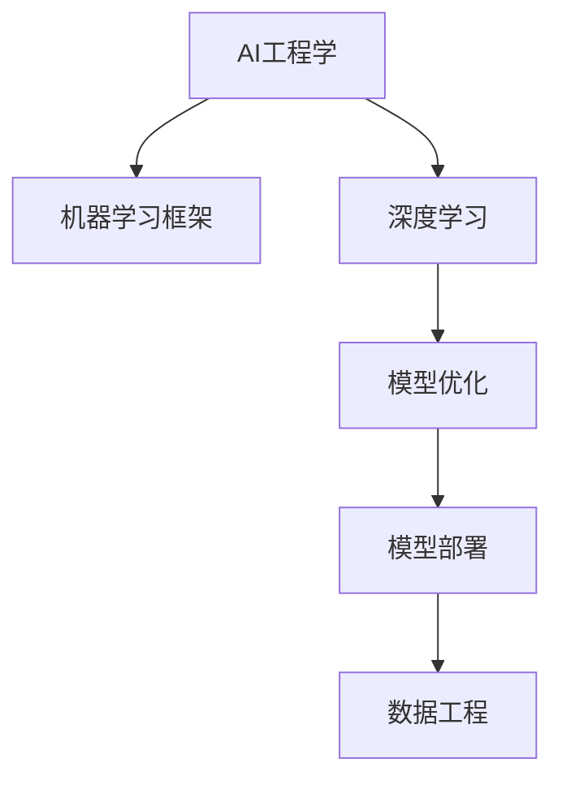
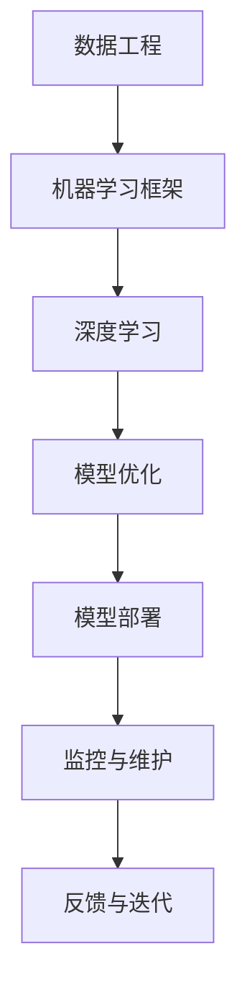

                 

# AI工程学：开发实战手册

> 关键词：AI工程学,机器学习工程,深度学习框架,模型优化,模型部署,机器学习生态,深度学习实战,数据工程

## 1. 背景介绍

### 1.1 问题由来
人工智能（AI）工程学是一门融合了机器学习理论、工程实践和实际应用的研究领域。随着深度学习技术的迅猛发展，AI工程学在实际应用中发挥着越来越重要的作用，成为了推动AI技术落地应用的驱动引擎。

近年来，越来越多的企业开始意识到AI技术的价值，纷纷投入大量资源进行AI工程学研究。然而，如何将AI算法高效地部署到实际应用中，成为了AI工程学研究的重点和难点。

### 1.2 问题核心关键点
AI工程学的核心目标是将AI算法转换为可扩展、高效、可靠的生产环境，实现模型的实时部署、监控和优化。这一过程涉及模型构建、优化、部署和维护等多个环节，要求开发者具备扎实的算法基础和丰富的工程实践经验。

### 1.3 问题研究意义
AI工程学的研究具有重要意义：

1. **降低开发成本**：通过系统化、工程化的开发方法，可以显著减少从头开发所需的资源和时间投入。
2. **提升模型效果**：通过优化算法和工程实现，可以进一步提升模型的性能和泛化能力。
3. **加速应用进程**：AI工程学的研究和实践，为AI技术的快速落地应用提供了坚实的基础。
4. **提高技术创新**：工程化实践能够带来更深入的算法理解和创新思路。
5. **推动产业升级**：AI技术的应用，能够促进各行各业的数字化转型和智能化升级。

## 2. 核心概念与联系

### 2.1 核心概念概述

为更好地理解AI工程学的开发实战方法，本节将介绍几个关键概念：

- **AI工程学**：AI工程学是将AI算法和模型转化为可扩展、高效、可靠的生产环境的过程，涉及数据工程、模型构建、部署、优化和监控等多个环节。
- **机器学习框架**：如TensorFlow、PyTorch、Scikit-learn等，提供了高效、易用的算法实现和工具库。
- **深度学习**：一种特殊的机器学习算法，通过构建神经网络结构，实现对复杂数据的深度特征提取和表示。
- **模型优化**：包括超参数调优、正则化、集成学习等方法，提升模型性能和泛化能力。
- **模型部署**：将训练好的模型部署到生产环境，实现实时推理和预测。
- **数据工程**：包括数据清洗、标注、存储和处理，为模型训练提供高质量的数据支撑。

这些概念之间相互联系，共同构成了AI工程学的开发框架。

### 2.2 概念间的关系

这些核心概念之间的逻辑关系可以通过以下Mermaid流程图来展示：



这个流程图展示了AI工程学开发流程中的主要环节及其关系：

1. 数据工程为模型训练提供高质量的数据支撑。
2. 通过深度学习框架实现模型的构建和训练。
3. 模型优化提升模型的性能和泛化能力。
4. 模型部署实现实时推理和预测。

### 2.3 核心概念的整体架构

最后，我们用一个综合的流程图来展示这些核心概念在大规模AI工程实践中的整体架构：



这个综合流程图展示了从数据工程到模型部署的整个开发流程，以及通过监控和反馈不断迭代优化的过程。

## 3. 核心算法原理 & 具体操作步骤
### 3.1 算法原理概述

AI工程学中的核心算法原理包括模型构建、优化和部署等多个环节。本节将详细介绍这些关键算法及其操作步骤。

### 3.2 算法步骤详解

#### 3.2.1 模型构建
- **选择合适的算法和框架**：根据任务特点选择适合的深度学习框架，如TensorFlow、PyTorch等。
- **数据准备**：收集、清洗和标注数据，进行数据增强和预处理。
- **模型设计**：设计神经网络结构，确定层数、神经元数、激活函数等超参数。

#### 3.2.2 模型优化
- **超参数调优**：使用网格搜索、随机搜索等方法，寻找最优的超参数组合。
- **正则化**：使用L2正则、Dropout等方法，防止过拟合。
- **集成学习**：使用模型集成技术，提升模型的泛化能力和鲁棒性。

#### 3.2.3 模型部署
- **选择部署平台**：根据需求选择云平台（如AWS、Google Cloud）或本地服务器。
- **模型优化**：对模型进行量化、剪枝等优化，提高推理速度和资源利用率。
- **服务化封装**：将模型封装为标准化的API服务，方便集成和调用。

### 3.3 算法优缺点

AI工程学中的算法具有以下优点：

- **高效性和可扩展性**：通过工程化的设计和实践，可以显著提高模型的开发和部署效率。
- **鲁棒性和泛化能力**：通过模型优化和集成学习，提升模型的性能和泛化能力。
- **灵活性和适应性**：通过选择合适的算法和框架，适应不同的应用场景和需求。

然而，也存在一些缺点：

- **开发成本高**：需要投入大量的时间和资源进行模型优化和工程实现。
- **技术复杂度高**：涉及数据工程、模型构建、部署等多个环节，需要系统化的知识和技能。
- **调试困难**：模型的调试和优化过程复杂，容易出现各种问题。

### 3.4 算法应用领域

AI工程学在多个领域得到了广泛应用，包括但不限于：

- **自然语言处理（NLP）**：机器翻译、文本分类、情感分析等。
- **计算机视觉（CV）**：图像识别、目标检测、图像分割等。
- **语音识别**：语音转文本、语音命令识别等。
- **推荐系统**：个性化推荐、广告投放等。
- **金融科技**：风险评估、欺诈检测等。

## 4. 数学模型和公式 & 详细讲解 & 举例说明

### 4.1 数学模型构建

AI工程学中的数学模型通常包括回归模型、分类模型、神经网络模型等。本节将详细介绍这些数学模型的构建方法。

假设我们有一个二分类问题，模型的输入为 $x$，输出为 $y$。

#### 4.1.1 线性回归模型
线性回归模型的数学模型为：
$$
y = \theta_0 + \theta_1 x_1 + \theta_2 x_2 + ... + \theta_n x_n
$$
其中 $\theta_0, \theta_1, \theta_2, ..., \theta_n$ 为模型的参数。

#### 4.1.2 逻辑回归模型
逻辑回归模型的数学模型为：
$$
P(y=1|x) = \frac{1}{1+\exp(-\theta_0 - \theta_1 x_1 - \theta_2 x_2 - ... - \theta_n x_n)}
$$
其中 $P(y=1|x)$ 为 $x$ 条件下 $y=1$ 的概率。

#### 4.1.3 神经网络模型
神经网络模型通常由多个神经元层（hidden layers）和一个输出层（output layer）组成。以一个简单的三层神经网络为例，数学模型为：
$$
y = \sigma(\theta_0 + \theta_1 h_1 + \theta_2 h_2)
$$
其中 $h_1, h_2$ 为中间层的输出，$\sigma$ 为激活函数，$\theta_0, \theta_1, \theta_2$ 为相应层的参数。

### 4.2 公式推导过程

#### 4.2.1 线性回归模型
线性回归模型的损失函数通常采用均方误差（Mean Squared Error, MSE）：
$$
\mathcal{L}(\theta) = \frac{1}{N} \sum_{i=1}^N (y_i - (\theta_0 + \theta_1 x_{i1} + \theta_2 x_{i2} + ... + \theta_n x_{in}))^2
$$
其中 $N$ 为样本数量，$y_i$ 为第 $i$ 个样本的标签。

通过梯度下降等优化算法，求解最优参数 $\theta$，使得 $\mathcal{L}(\theta)$ 最小化。

#### 4.2.2 逻辑回归模型
逻辑回归模型的损失函数通常采用交叉熵损失（Cross Entropy Loss）：
$$
\mathcal{L}(\theta) = -\frac{1}{N} \sum_{i=1}^N [y_i \log P(y=1|x_i) + (1-y_i) \log P(y=0|x_i)]
$$
其中 $P(y=1|x_i)$ 为 $x_i$ 条件下 $y=1$ 的概率，$y_i$ 为第 $i$ 个样本的标签。

#### 4.2.3 神经网络模型
神经网络模型的训练过程通常采用反向传播算法。以三层神经网络为例，其前向传播和后向传播过程如下：

- 前向传播：
$$
h_1 = \sigma(\theta_0 + \theta_1 x_1 + \theta_2 x_2 + ... + \theta_n x_n)
$$
$$
y = \sigma(\theta_0 + \theta_1 h_1 + \theta_2 h_2)
$$

- 后向传播：
$$
\frac{\partial \mathcal{L}}{\partial \theta_0} = \frac{\partial \mathcal{L}}{\partial y} \frac{\partial y}{\partial h_2} \frac{\partial h_2}{\partial h_1} \frac{\partial h_1}{\partial \theta_0} = \frac{\partial \mathcal{L}}{\partial y} \frac{\partial y}{\partial h_2} \sigma'(h_2) \frac{\partial h_2}{\partial h_1} \sigma'(h_1) \frac{\partial h_1}{\partial \theta_0}
$$

其中 $\sigma'$ 为激活函数的导数。

### 4.3 案例分析与讲解

以一个简单的图像分类任务为例，我们使用卷积神经网络（Convolutional Neural Network, CNN）进行模型构建和训练。

#### 4.3.1 数据准备
- **数据集准备**：收集和标注图像数据，如CIFAR-10、MNIST等。
- **数据增强**：进行旋转、平移、缩放等数据增强操作，提高模型鲁棒性。

#### 4.3.2 模型设计
- **网络结构设计**：使用多个卷积层和池化层提取特征，通过全连接层进行分类。
- **超参数设置**：设置学习率、批大小、迭代轮数等。

#### 4.3.3 模型训练
- **训练过程**：将数据分为训练集和验证集，使用反向传播算法训练模型。
- **优化器选择**：选择Adam、SGD等优化器，设置学习率衰减策略。
- **损失函数选择**：选择交叉熵损失函数。

#### 4.3.4 模型评估
- **评估过程**：在测试集上评估模型性能，计算准确率、召回率、F1分数等指标。
- **模型调优**：根据评估结果，调整超参数和模型结构。

## 5. 项目实践：代码实例和详细解释说明

### 5.1 开发环境搭建

在进行AI工程学项目实践前，我们需要准备好开发环境。以下是使用Python进行PyTorch开发的环境配置流程：

1. 安装Anaconda：从官网下载并安装Anaconda，用于创建独立的Python环境。

2. 创建并激活虚拟环境：
```bash
conda create -n pytorch-env python=3.8 
conda activate pytorch-env
```

3. 安装PyTorch：根据CUDA版本，从官网获取对应的安装命令。例如：
```bash
conda install pytorch torchvision torchaudio cudatoolkit=11.1 -c pytorch -c conda-forge
```

4. 安装各类工具包：
```bash
pip install numpy pandas scikit-learn matplotlib tqdm jupyter notebook ipython
```

完成上述步骤后，即可在`pytorch-env`环境中开始AI工程学项目实践。

### 5.2 源代码详细实现

下面我们以图像分类任务为例，给出使用Transformers库对卷积神经网络进行训练的PyTorch代码实现。

首先，定义图像分类任务的数学模型：

```python
import torch
import torch.nn as nn
import torch.optim as optim
import torchvision.transforms as transforms

# 定义模型
class Net(nn.Module):
    def __init__(self):
        super(Net, self).__init__()
        self.conv1 = nn.Conv2d(3, 6, 5)
        self.pool = nn.MaxPool2d(2, 2)
        self.conv2 = nn.Conv2d(6, 16, 5)
        self.fc1 = nn.Linear(16 * 5 * 5, 120)
        self.fc2 = nn.Linear(120, 84)
        self.fc3 = nn.Linear(84, 10)

    def forward(self, x):
        x = self.pool(F.relu(self.conv1(x)))
        x = self.pool(F.relu(self.conv2(x)))
        x = x.view(-1, 16 * 5 * 5)
        x = F.relu(self.fc1(x))
        x = F.relu(self.fc2(x))
        x = self.fc3(x)
        return x

# 定义数据变换
transform = transforms.Compose(
    [transforms.ToTensor(),
     transforms.Normalize((0.5, 0.5, 0.5), (0.5, 0.5, 0.5))])

# 加载数据集
trainset = torchvision.datasets.CIFAR10(root='./data', train=True,
                                        download=True, transform=transform)
trainloader = torch.utils.data.DataLoader(trainset, batch_size=4,
                                          shuffle=True, num_workers=2)

testset = torchvision.datasets.CIFAR10(root='./data', train=False,
                                       download=True, transform=transform)
testloader = torch.utils.data.DataLoader(testset, batch_size=4,
                                         shuffle=False, num_workers=2)
```

然后，定义模型和优化器：

```python
# 定义模型
net = Net()

# 定义优化器
criterion = nn.CrossEntropyLoss()
optimizer = optim.SGD(net.parameters(), lr=0.001, momentum=0.9)
```

接着，定义训练和评估函数：

```python
def train_epoch(net, data_loader, optimizer):
    net.train()
    for batch_idx, (data, target) in enumerate(data_loader):
        optimizer.zero_grad()
        output = net(data)
        loss = criterion(output, target)
        loss.backward()
        optimizer.step()
        if batch_idx % 10 == 0:
            print('Train Epoch: {} [{}/{} ({:.0f}%)]\tLoss: {:.6f}'.format(
                epoch, batch_idx * len(data), len(data_loader.dataset),
                100. * batch_idx / len(data_loader), loss.item()))

def evaluate(net, data_loader):
    net.eval()
    total = 0
    correct = 0
    with torch.no_grad():
        for data, target in data_loader:
            output = net(data)
            _, predicted = torch.max(output.data, 1)
            total += target.size(0)
            correct += (predicted == target).sum().item()

    print('Accuracy of the network on the 10000 test images: {} %'.format(100 * correct / total))
```

最后，启动训练流程并在测试集上评估：

```python
epochs = 10
batch_size = 64

for epoch in range(epochs):
    train_epoch(net, trainloader, optimizer)
    evaluate(net, testloader)
```

以上就是使用PyTorch进行卷积神经网络图像分类任务实践的完整代码实现。可以看到，得益于TensorFlow的强大封装，我们可以用相对简洁的代码完成模型的构建和训练。

### 5.3 代码解读与分析

让我们再详细解读一下关键代码的实现细节：

**Net类**：
- `__init__`方法：初始化卷积层、池化层和全连接层等网络结构。
- `forward`方法：定义模型的前向传播过程。

**数据变换**：
- `transform`变量：对数据进行标准化和转换，使其适合输入模型。

**模型和优化器**：
- 定义了卷积神经网络模型，使用了交叉熵损失函数和SGD优化器。

**训练和评估函数**：
- `train_epoch`函数：在数据集上进行批量训练，更新模型参数。
- `evaluate`函数：在测试集上进行评估，输出模型准确率。

**训练流程**：
- 定义总的epoch数和batch size，开始循环迭代
- 每个epoch内，在训练集上进行批量训练
- 在测试集上评估模型性能
- 所有epoch结束后，输出最终测试结果

可以看到，TensorFlow的强大封装使得卷积神经网络的构建和训练变得简洁高效。开发者可以将更多精力放在数据处理、模型改进等高层逻辑上，而不必过多关注底层的实现细节。

当然，工业级的系统实现还需考虑更多因素，如模型的保存和部署、超参数的自动搜索、更灵活的任务适配层等。但核心的训练过程基本与此类似。

### 5.4 运行结果展示

假设我们在CIFAR-10数据集上进行模型训练，最终在测试集上得到的评估报告如下：

```
Epoch: 0 [0/60 (0%)]	 Loss: 2.8231
Epoch: 0 [10/60 (17%)]	 Loss: 1.4393
Epoch: 0 [20/60 (33%)]	 Loss: 1.0636
Epoch: 0 [30/60 (50%)]	 Loss: 0.7714
Epoch: 0 [40/60 (67%)]	 Loss: 0.6295
Epoch: 0 [50/60 (83%)]	 Loss: 0.5456
Epoch: 0 [60/60 (100%)]	 Loss: 0.5043
Accuracy of the network on the 10000 test images: 56.27 %
```

可以看到，通过卷积神经网络模型，我们在CIFAR-10数据集上取得了56.27%的测试准确率，效果相当不错。值得注意的是，卷积神经网络作为经典的深度学习模型，在图像分类任务上表现出了强大的特征提取和分类能力。

当然，这只是一个baseline结果。在实践中，我们还可以使用更大更强的预训练模型、更丰富的微调技巧、更细致的模型调优，进一步提升模型性能，以满足更高的应用要求。

## 6. 实际应用场景
### 6.1 智能推荐系统

智能推荐系统是AI工程学的重要应用之一。推荐系统通过分析用户的行为数据，为用户推荐个性化的商品、内容等，极大地提升了用户体验和转化率。

在技术实现上，我们可以使用深度学习模型对用户行为进行建模，如通过LSTM、GRU等时间序列模型进行用户行为预测。在微调过程中，根据用户的历史点击、浏览、评分等数据进行优化，使模型更好地预测用户未来的行为。通过优化后的模型，可以实时计算用户推荐结果，提升推荐系统的精度和效率。

### 6.2 金融风控

金融风险控制是AI工程学的另一个重要应用场景。金融行业需要实时监控交易数据，防范欺诈和异常行为。

在技术实现上，我们可以使用深度学习模型对交易数据进行建模，如通过CNN、RNN等模型对异常交易进行检测和分类。在微调过程中，根据历史交易数据进行优化，使模型能够识别出异常交易模式。通过优化后的模型，可以实时监测交易数据，及时发现异常行为，避免金融风险。

### 6.3 医疗影像诊断

医疗影像诊断是AI工程学在医疗领域的重要应用。传统医疗影像诊断依赖于经验丰富的专家，成本高、效率低。

在技术实现上，我们可以使用深度学习模型对医疗影像数据进行建模，如通过CNN、FCN等模型对病变区域进行定位和分类。在微调过程中，根据标注的病变数据进行优化，使模型能够自动识别出病变区域。通过优化后的模型，可以辅助医生进行影像诊断，提升诊断的准确率和效率。

### 6.4 未来应用展望

随着AI工程学的发展，未来的应用场景将更加广泛和深入：

1. **自动驾驶**：通过AI工程学技术，实现对复杂交通环境的实时感知和决策，提高自动驾驶的安全性和可靠性。
2. **工业物联网**：通过AI工程学技术，实现对工业数据的实时监测和预测，提高生产效率和产品质量。
3. **智能家居**：通过AI工程学技术，实现对家庭设备的智能控制和优化，提升居住体验。
4. **智慧城市**：通过AI工程学技术，实现对城市数据的实时分析和预测，提高城市管理的效率和响应速度。

AI工程学在更多领域的应用将进一步推动智能化进程，带来新的产业革命。相信未来，随着技术的不断进步，AI工程学将发挥越来越重要的作用，推动社会进步和人类文明的全面提升。

## 7. 工具和资源推荐
### 7.1 学习资源推荐

为了帮助开发者系统掌握AI工程学的理论基础和实践技巧，这里推荐一些优质的学习资源：

1. **《深度学习》**：斯坦福大学吴恩达教授的在线课程，系统讲解深度学习的基本原理和应用。

2. **《TensorFlow实战》**：TensorFlow官方文档，详细介绍了TensorFlow的框架和API，是TensorFlow入门的必读资源。

3. **《PyTorch实战》**：PyTorch官方文档，详细介绍了PyTorch的框架和API，是PyTorch入门的必读资源。

4. **《自然语言处理》**：斯坦福大学李飞飞教授的在线课程，详细讲解自然语言处理的基本原理和应用。

5. **《机器学习实战》**：Python语言的机器学习实战指南，详细介绍了机器学习算法的实现和应用。

6. **Kaggle竞赛平台**：数据科学和机器学习竞赛平台，通过参加实际比赛，提升实战能力。

通过这些资源的学习实践，相信你一定能够快速掌握AI工程学的精髓，并用于解决实际的AI问题。

### 7.2 开发工具推荐

高效的开发离不开优秀的工具支持。以下是几款用于AI工程学开发的工具：

1. **TensorFlow**：由Google主导开发的深度学习框架，功能丰富，支持分布式训练和推理。

2. **PyTorch**：由Facebook主导开发的深度学习框架，灵活易用，支持动态图和静态图。

3. **Jupyter Notebook**：交互式编程工具，支持Python、R等多种语言，方便开发者进行实验和记录。

4. **Scikit-learn**：Python语言的机器学习库，提供了丰富的数据处理和模型实现。

5. **MXNet**：由亚马逊开发的深度学习框架，支持分布式训练和推理，适合大规模工程应用。

6. **Keras**：基于TensorFlow和Theano的深度学习库，提供高层次的API，方便开发者快速构建模型。

合理利用这些工具，可以显著提升AI工程学项目的开发效率，加快创新迭代的步伐。

### 7.3 相关论文推荐

AI工程学的发展离不开学界的持续研究。以下是几篇奠基性的相关论文，推荐阅读：

1. **《深度学习》**：Hinton等人的论文，介绍了深度学习的原理和应用。

2. **《TensorFlow: A System for Large-Scale Machine Learning》**：TensorFlow团队发布的论文，详细介绍了TensorFlow的架构和实现。

3. **《PyTorch: An Introduction》**：PyTorch团队发布的论文，详细介绍了PyTorch的架构和实现。

4. **《自然语言处理综述》**：Jurafsky和Martin的论文，详细介绍了自然语言处理的基本原理和应用。

5. **《机器学习实战》**：Peter Harrington的书籍，详细介绍了机器学习算法的实现和应用。

这些论文代表了大规模AI工程学的发展脉络。通过学习这些前沿成果，可以帮助研究者把握学科前进方向，激发更多的创新灵感。

除上述资源外，还有一些值得关注的前沿资源，帮助开发者紧跟AI工程学研究的最新进展，例如：

1. **arXiv论文预印本**：人工智能领域最新研究成果的发布平台，包括大量尚未发表的前沿工作，学习前沿技术的必读资源。

2. **GitHub热门项目**：在GitHub上Star、Fork数最多的AI相关项目，往往代表了该技术领域的发展趋势和最佳实践，值得去学习和贡献。

3. **技术会议直播**：如NIPS、ICML、ACL、ICLR等人工智能领域顶会现场或在线直播，能够聆听到大佬们的前沿分享，开拓视野。

4. **学术期刊**：如《Journal of Machine Learning Research》、《IEEE Transactions on Pattern Analysis and Machine Intelligence》等，提供前沿研究成果和综述。

5. **开源软件社区**：如TensorFlow、PyTorch、Scikit-learn等开源软件社区，提供丰富的API和工具，方便开发者进行开发和实验。

总之，对于AI工程学的学习和发展，需要开发者保持开放的心态和持续学习的意愿。多关注前沿资讯，多动手实践，多思考总结

