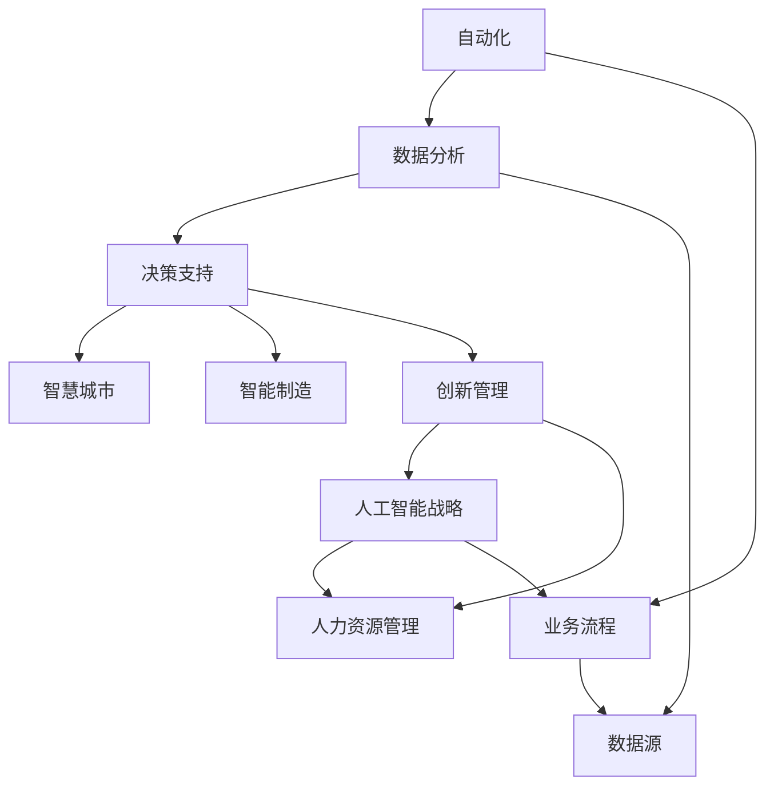

                 

# AI技术在企业中的应用前景

> 关键词：人工智能,企业应用,自动化,数据分析,决策支持,智慧城市,智能制造,创新管理,人工智能战略,人力资源

## 1. 背景介绍

随着人工智能技术的不断成熟和普及，企业正面临着前所未有的数字化转型机遇。AI技术能够帮助企业提升运营效率，优化决策过程，创造新的商业模式，从而在全球竞争中占据优势。本博客将深入探讨AI技术在企业中的应用前景，涵盖自动化、数据分析、决策支持、智慧城市、智能制造、创新管理等多个领域，为企业管理者提供技术洞见和实践指导。

## 2. 核心概念与联系

### 2.1 核心概念概述

AI技术的应用范围广泛，本文将重点介绍以下几个核心概念：

- **自动化**：通过机器学习、计算机视觉等技术，实现自动化流程，减少人力成本，提高生产效率。
- **数据分析**：利用大数据和机器学习技术，挖掘企业内部和外部的数据价值，为决策提供支持。
- **决策支持**：结合AI技术，提供数据分析、预测和优化建议，帮助企业做出更明智的决策。
- **智慧城市**：运用AI技术，提升城市管理、公共服务等方面的智能化水平。
- **智能制造**：通过AI技术，实现工业互联网、智能工厂等高效制造模式。
- **创新管理**：利用AI技术，优化产品创新、市场策略等管理过程。
- **人工智能战略**：制定AI战略，规划AI技术的应用路线，确保企业数字化转型成功。
- **人力资源管理**：通过AI技术，提升人才选拔、培训、绩效管理等水平。

### 2.2 核心概念之间的关系

以下是一个合成的Mermaid流程图，展示上述核心概念之间的关系：



### 2.3 核心概念的整体架构

从上图可以看出，自动化、数据分析、决策支持等AI技术应用，可以支撑企业提升运营效率、优化决策、创新管理等。而智慧城市、智能制造等应用，则代表了AI技术在更广泛的社会和工业领域的深入实践。AI战略和人力资源管理，则从宏观和微观层面，为企业AI技术应用提供指导和支持。这些核心概念共同构成了企业AI技术应用的全局架构。

## 3. 核心算法原理 & 具体操作步骤

### 3.1 算法原理概述

AI技术在企业中的应用，主要依赖于以下算法和原理：

- **机器学习**：通过数据训练模型，使机器具备自主决策能力，广泛应用于自动化、数据分析、决策支持等领域。
- **计算机视觉**：通过图像处理和模式识别，实现自动化和智能化的视觉任务，如质量检测、安全监控等。
- **自然语言处理**：通过文本分析和语义理解，提升企业的沟通和信息处理能力。
- **知识图谱**：利用图结构表示实体间关系，为数据分析、决策支持提供知识基础。

### 3.2 算法步骤详解

以下是一个AI技术在企业中应用的典型步骤：

1. **需求分析**：识别企业的核心业务需求和目标，明确AI技术的应用范围。
2. **数据准备**：收集和处理相关的数据，包括结构化数据和非结构化数据。
3. **模型选择**：根据业务需求选择合适的AI模型，如回归模型、分类模型、深度学习模型等。
4. **模型训练**：利用数据训练模型，优化模型参数，提升模型性能。
5. **模型部署**：将训练好的模型部署到生产环境中，实现业务流程自动化或数据分析。
6. **效果评估**：评估模型的应用效果，持续优化模型和流程。

### 3.3 算法优缺点

AI技术在企业中的应用，具有以下优缺点：

**优点**：
- **效率提升**：自动化流程和智能化决策显著提升业务效率。
- **数据驱动**：基于数据分析的决策更加科学和准确。
- **业务创新**：AI技术催生新业务模式，提升企业竞争力。

**缺点**：
- **成本高**：AI技术的开发和部署需要大量资金投入。
- **数据隐私**：企业需处理大量敏感数据，涉及数据隐私和安全问题。
- **技术复杂**：AI技术的实施需要高水平的专业知识和经验。

### 3.4 算法应用领域

AI技术在企业中的应用广泛，涵盖多个领域，包括：

- **自动化流程**：如生产自动化、客服自动化、财务自动化等。
- **数据分析与预测**：如客户行为分析、市场趋势预测、销售预测等。
- **决策支持**：如风险评估、策略优化、供应链管理等。
- **智慧城市**：如智能交通、智慧医疗、智慧教育等。
- **智能制造**：如智能工厂、工业互联网、工业机器人等。
- **创新管理**：如创新评估、市场分析、产品开发等。

## 4. 数学模型和公式 & 详细讲解

### 4.1 数学模型构建

以预测模型为例，我们可以构建以下数学模型：

$$
y = \sum_{i=1}^{n} w_i x_i + b
$$

其中，$y$ 为预测值，$x_i$ 为输入特征，$w_i$ 为特征系数，$b$ 为偏置项。

### 4.2 公式推导过程

以线性回归模型为例，公式推导过程如下：

1. **假设模型**：
   $$
   y = \sum_{i=1}^{n} w_i x_i + b
   $$

2. **最小化损失函数**：
   $$
   \min_{w,b} \frac{1}{2m} \sum_{i=1}^{m} (y_i - (\sum_{j=1}^{n} w_j x_{ij} + b))^2
   $$

3. **求解最优参数**：
   $$
   \frac{\partial \mathcal{L}}{\partial w} = \frac{1}{m} \sum_{i=1}^{m} (y_i - \sum_{j=1}^{n} w_j x_{ij} - b)x_{ij} = 0
   $$
   $$
   \frac{\partial \mathcal{L}}{\partial b} = \frac{1}{m} \sum_{i=1}^{m} (y_i - \sum_{j=1}^{n} w_j x_{ij} - b) = 0
   $$

解以上方程组，得到最优参数 $w_i$ 和 $b$。

### 4.3 案例分析与讲解

假设企业希望通过AI技术预测下一季度的销售量，可以利用历史销售数据、市场趋势、季节性因素等作为输入特征，构建线性回归模型，预测未来销售趋势。

## 5. 项目实践：代码实例和详细解释说明

### 5.1 开发环境搭建

以下是Python环境下使用TensorFlow进行线性回归模型的开发环境搭建步骤：

1. 安装TensorFlow：
   ```bash
   pip install tensorflow
   ```

2. 安装相关库：
   ```bash
   pip install numpy pandas sklearn matplotlib
   ```

3. 下载数据集：
   ```bash
   wget https://archive.ics.uci.edu/ml/machine-learning-databases/boston/boston.data
   ```

4. 数据预处理：
   ```python
   import pandas as pd
   from sklearn.model_selection import train_test_split
   from sklearn.preprocessing import StandardScaler

   data = pd.read_csv('boston.data', header=None)
   data.columns = ['CRIM', 'ZN', 'INDUS', 'CHAS', 'NOX', 'RM', 'AGE', 'DIS', 'RAD', 'TAX', 'PTRATIO', 'B', 'LSTAT', 'MEDV']
   X = data[['CRIM', 'ZN', 'INDUS', 'CHAS', 'NOX', 'RM', 'AGE', 'DIS', 'RAD', 'TAX', 'PTRATIO', 'B', 'LSTAT']]
   y = data['MEDV']

   X_train, X_test, y_train, y_test = train_test_split(X, y, test_size=0.2, random_state=42)
   scaler = StandardScaler()
   X_train = scaler.fit_transform(X_train)
   X_test = scaler.transform(X_test)
   ```

### 5.2 源代码详细实现

以下是线性回归模型的Python代码实现：

```python
import tensorflow as tf
from tensorflow.keras.models import Sequential
from tensorflow.keras.layers import Dense

# 定义模型
model = Sequential([
    Dense(64, activation='relu', input_shape=(X_train.shape[1],)),
    Dense(1)
])

# 编译模型
model.compile(optimizer='adam', loss='mse')

# 训练模型
model.fit(X_train, y_train, epochs=50, batch_size=32, validation_data=(X_test, y_test))

# 评估模型
mse = model.evaluate(X_test, y_test)
print('Mean Squared Error:', mse)
```

### 5.3 代码解读与分析

以上代码展示了如何使用TensorFlow实现线性回归模型的训练和评估。关键步骤如下：

1. 定义模型结构：包括输入层、隐藏层和输出层。
2. 编译模型：设置优化器和损失函数。
3. 训练模型：使用训练数据集进行模型训练。
4. 评估模型：使用测试数据集评估模型性能。

## 6. 实际应用场景

### 6.1 自动化流程

在制造业中，通过机器视觉和机器学习技术，可以实现产品检测、质量控制、物料搬运等自动化流程。例如，使用计算机视觉技术对产品表面进行缺陷检测，使用机器学习技术对生产线进行预测性维护，提升生产效率和产品质量。

### 6.2 数据分析与预测

数据分析是企业应用AI技术的重要组成部分。通过数据分析，企业可以洞察客户行为、市场趋势、运营效率等关键指标。例如，使用机器学习技术对客户购买行为进行分析，预测客户流失风险，从而制定针对性的客户保留策略。

### 6.3 决策支持

决策支持系统（DSS）结合AI技术，为企业提供数据分析、预测和优化建议。例如，使用AI技术进行销售预测，帮助企业优化库存管理；使用AI技术进行风险评估，提升企业决策的准确性。

### 6.4 智慧城市

智慧城市通过AI技术，提升城市管理和服务水平。例如，使用AI技术进行交通流量分析，优化交通信号灯设置；使用AI技术进行环境监测，提升城市环境治理水平。

### 6.5 智能制造

智能制造是AI技术在工业领域的重要应用。例如，使用AI技术进行供应链优化，提升供应链效率；使用AI技术进行产品设计，提升产品创新能力。

### 6.6 创新管理

AI技术在创新管理中的应用，包括创新评估、市场分析、产品开发等。例如，使用AI技术进行市场趋势分析，帮助企业制定创新策略；使用AI技术进行产品设计优化，提升产品竞争力。

### 6.7 人工智能战略

企业需要制定明确的AI战略，规划AI技术的应用路线。例如，制定AI技术应用优先级，明确AI技术的应用目标和效果指标。

### 6.8 人力资源管理

AI技术在人力资源管理中的应用，包括人才选拔、培训、绩效管理等。例如，使用AI技术进行人才评估，提升人才选拔效率；使用AI技术进行员工培训计划优化，提升员工技能水平。

## 7. 工具和资源推荐

### 7.1 学习资源推荐

1. **机器学习课程**：Coursera、Udacity等在线学习平台提供的机器学习课程，涵盖从基础到高级的机器学习知识。
2. **TensorFlow官方文档**：详细介绍了TensorFlow的使用方法和应用场景。
3. **深度学习书籍**：如《深度学习》（Ian Goodfellow等）、《动手学深度学习》等。
4. **GitHub开源项目**：包含大量实用的机器学习项目和代码示例，可供学习和参考。

### 7.2 开发工具推荐

1. **TensorFlow**：Google开源的深度学习框架，功能强大，应用广泛。
2. **PyTorch**：Facebook开源的深度学习框架，易于使用，具有灵活的动态计算图。
3. **Jupyter Notebook**：开源的交互式笔记本，适合进行数据探索和模型实验。

### 7.3 相关论文推荐

1. **《深度学习》**（Ian Goodfellow等）：深入浅出地介绍了深度学习的基本概念和应用方法。
2. **《神经网络与深度学习》**（Michael Nielsen）：介绍了神经网络和深度学习的基础知识和应用场景。
3. **《机器学习实战》**（Peter Harrington）：通过实践项目，介绍了机器学习的应用方法和工具。

## 8. 总结：未来发展趋势与挑战

### 8.1 研究成果总结

AI技术在企业中的应用，已经取得了显著的成效，提升了企业的运营效率和决策水平。未来，AI技术将继续深入企业各业务环节，推动企业的数字化转型。

### 8.2 未来发展趋势

1. **智能化**：未来的AI技术将更加智能化，具备更高的自主决策能力。
2. **实时化**：未来的AI技术将实现实时数据处理和决策，提升企业的响应速度。
3. **个性化**：未来的AI技术将更加注重个性化需求，提升用户体验。
4. **生态化**：未来的AI技术将更加开放，形成完整的生态系统，推动企业数字化转型。

### 8.3 面临的挑战

1. **技术复杂**：AI技术的应用需要高水平的专业知识和经验。
2. **数据隐私**：企业需处理大量敏感数据，涉及数据隐私和安全问题。
3. **成本高**：AI技术的开发和部署需要大量资金投入。

### 8.4 研究展望

未来的AI技术研究将围绕智能化、实时化、个性化和生态化四个方向展开。通过技术创新和应用实践，实现AI技术的广泛应用和深远影响。

## 9. 附录：常见问题与解答

**Q1：AI技术在企业中应用的成功案例有哪些？**

A: 成功的AI应用案例包括：
- **亚马逊的推荐系统**：使用机器学习技术，根据用户行为和历史数据，推荐商品。
- **谷歌的搜索算法**：使用深度学习技术，提升搜索结果的准确性和相关性。
- **甲骨文的客户关系管理系统（CRM）**：使用机器学习技术，分析客户数据，提升客户满意度。

**Q2：企业如何选择合适的AI技术？**

A: 企业应根据自身业务需求和技术基础，选择合适的AI技术。例如：
- 对于数据驱动型业务，可以选择数据分析和预测技术。
- 对于自动化流程，可以选择自动化技术和机器视觉技术。
- 对于创新管理，可以选择创新评估和市场分析技术。

**Q3：AI技术的实施过程中需要注意哪些问题？**

A: AI技术的实施过程中需要注意以下问题：
- 数据质量：保证数据的质量和完整性，确保模型训练的有效性。
- 模型选择：根据业务需求选择合适的AI模型，避免过拟合和欠拟合。
- 模型部署：确保模型在生产环境中的稳定性和安全性。
- 人员培训：提升员工对AI技术的理解和应用能力，推动技术落地。

**Q4：企业如何应对AI技术的挑战？**

A: 企业应采取以下措施应对AI技术的挑战：
- 制定明确的AI战略，规划AI技术的应用路线。
- 投入资金和技术资源，支持AI技术的开发和部署。
- 加强数据隐私保护，确保数据安全。
- 提升员工技能，培养AI技术人才。

---

作者：禅与计算机程序设计艺术 / Zen and the Art of Computer Programming

