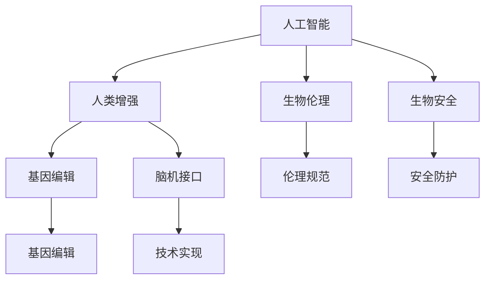
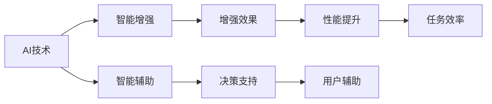
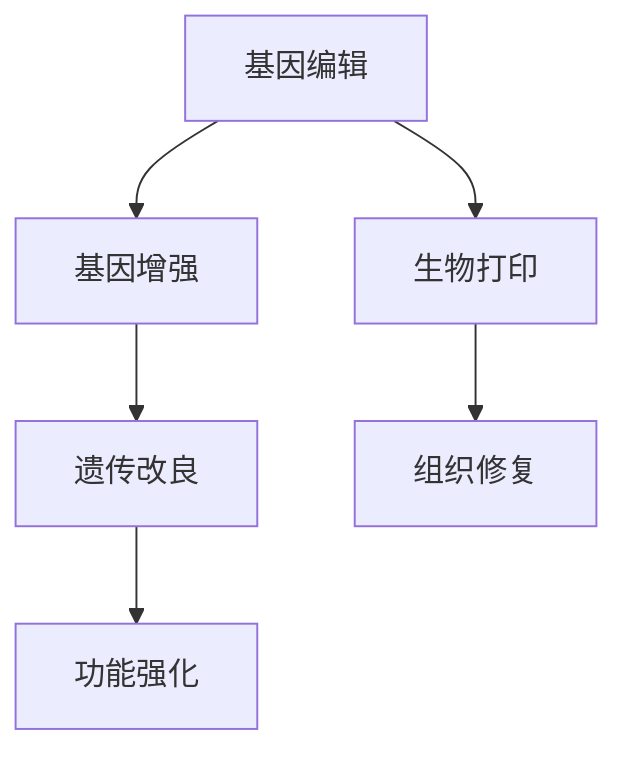
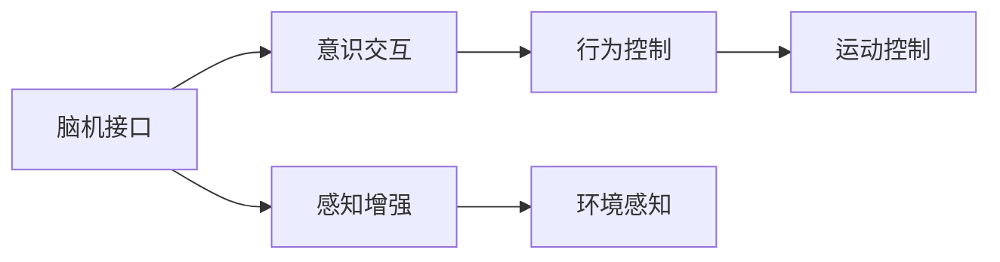
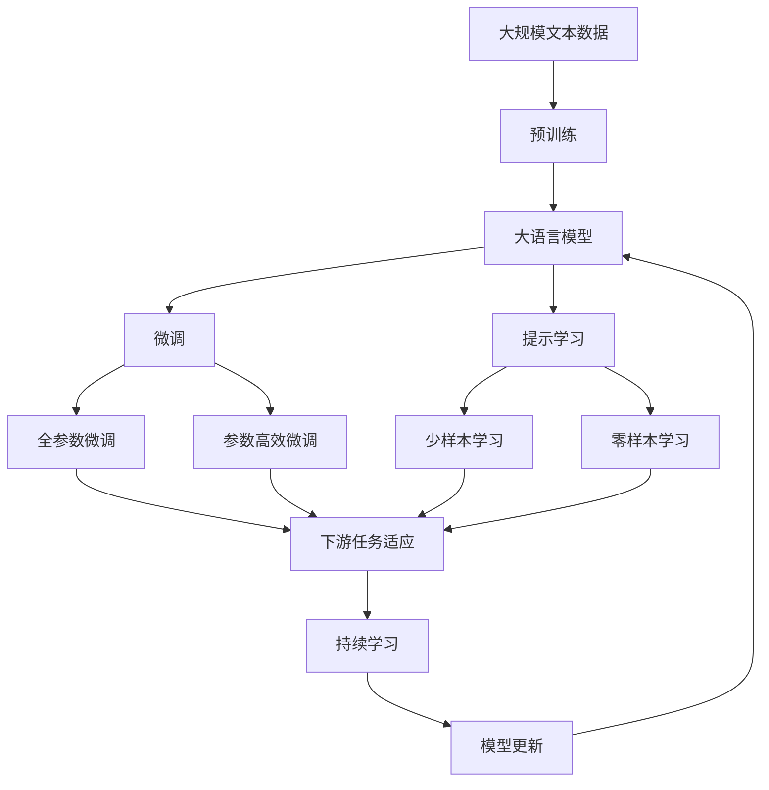

                 

# AI时代的人类增强：身体增强与道德

> 关键词：人工智能(AI), 人类增强, 身体增强, 生物伦理, 道德准则

## 1. 背景介绍

### 1.1 问题由来
随着科技的迅猛发展，人工智能（AI）正在深刻地改变人类的生活和工作方式。从智能家居到无人驾驶，从医疗诊断到教育培训，AI技术的应用几乎无所不在。然而，AI技术的快速发展也引发了一系列伦理和道德问题，特别是关于人类增强（Human Enhancement）的讨论。

人类增强是指通过科技手段提高人类在物理、认知、情感等方面的能力。近年来，随着生物工程、基因编辑等技术的突破，人类增强的概念正逐渐从科幻走向现实。在AI时代，身体增强技术也正在获得更多关注。身体增强技术包括但不限于运动康复、肢体补偿、生物打印等，能够显著提升人类的身体机能和生活质量。

### 1.2 问题核心关键点
人类增强技术的应用涉及诸多伦理和道德问题。这些问题的核心关键点包括：
- 技术安全性：身体增强技术可能带来不可预见的副作用，如损害人体健康、引发基因突变等。
- 技术公平性：身体增强技术的高昂成本可能加剧社会不平等，使富人享有更高的生存和健康优势。
- 技术责任：身体增强技术的开发者和使用者需要明确责任和义务，确保技术的伦理规范。
- 技术适应性：身体增强技术需要符合不同文化和社会的伦理规范，避免引发道德冲突。
- 技术可持续性：身体增强技术需要考虑长期的社会和环境影响，确保技术的可持续发展。

### 1.3 问题研究意义
研究人类增强技术在AI时代的伦理和道德问题，对于推动AI技术的健康发展，保护人类权益，构建和谐社会具有重要意义。具体而言，研究人类增强技术的伦理和道德问题，可以：
- 确保技术的可持续发展：避免技术滥用和负外部性，保护环境和生态平衡。
- 促进技术公平应用：确保技术应用具有广泛的包容性，减少社会不平等。
- 提升技术伦理规范：明确技术开发者和使用者应遵守的伦理准则，避免技术滥用和道德风险。
- 增强社会伦理共识：通过广泛的社会讨论和伦理教育，增强公众对技术的理解和接受。

## 2. 核心概念与联系

### 2.1 核心概念概述

为更好地理解人类增强技术在AI时代的伦理和道德问题，本节将介绍几个密切相关的核心概念：

- 人工智能（AI）：指通过计算机算法和数据处理能力，实现人类智能的模拟和延伸。AI技术包括机器学习、深度学习、自然语言处理等，在医疗、教育、金融等领域广泛应用。
- 人类增强（Human Enhancement）：通过科技手段提升人类在物理、认知、情感等方面的能力，包括基因编辑、生物工程、脑机接口等技术。
- 生物伦理（Bioethics）：研究与生物科技相关的伦理和道德问题，包括基因编辑、胚胎干细胞、生物打印等技术的伦理规范。
- 生物安全（Biosafety）：确保生物技术的安全性，防止生物技术滥用和负面影响。
- 基因编辑（Gene Editing）：通过基因工程技术改变生物体的遗传信息，如CRISPR-Cas9技术。
- 脑机接口（Brain-Computer Interface）：实现人脑与计算机的直接通信，通过读取脑电信号或植入脑机接口设备，实现人类与机器的深度互动。

这些核心概念之间的逻辑关系可以通过以下Mermaid流程图来展示：



这个流程图展示了大语言模型的核心概念及其之间的关系：

1. AI技术为人类的智能增强提供了技术基础。
2. 人类增强技术通过基因编辑、生物打印等手段，进一步提升人类的物理和认知能力。
3. 生物伦理和生物安全是确保技术应用的伦理规范和技术安全的保障。
4. 基因编辑和脑机接口是实现人类增强的具体技术手段。
5. 伦理规范和安全防护是确保技术公平和可持续发展的关键。

这些核心概念共同构成了AI时代人类增强技术的伦理和道德研究的框架，为进一步深入探讨提供了理论基础。

### 2.2 概念间的关系

这些核心概念之间存在着紧密的联系，形成了人类增强技术的伦理和道德研究的完整生态系统。下面我们通过几个Mermaid流程图来展示这些概念之间的关系。

#### 2.2.1 AI技术与人类增强的关系



这个流程图展示了AI技术在人类增强中的作用和效果。AI技术通过智能辅助、决策支持和用户辅助等方式，实现了人类智能的增强。

#### 2.2.2 基因编辑在人类增强中的应用



这个流程图展示了基因编辑技术在人类增强中的具体应用。基因编辑技术通过基因增强、遗传改良和功能强化等方式，实现了人类在物理和认知方面的增强。

#### 2.2.3 脑机接口在人类增强中的应用



这个流程图展示了脑机接口技术在人类增强中的具体应用。脑机接口技术通过意识交互、感知增强和行为控制等方式，实现了人类在认知和运动方面的增强。

### 2.3 核心概念的整体架构

最后，我们用一个综合的流程图来展示这些核心概念在大语言模型微调过程中的整体架构：



这个综合流程图展示了从预训练到微调，再到持续学习的完整过程。人类增强技术在AI时代的应用和研究，也需要通过类似的框架来展开，从而确保技术的科学性和伦理性。

## 3. 核心算法原理 & 具体操作步骤
### 3.1 算法原理概述

基于AI技术的身体增强技术，通常涉及到基因编辑、生物工程、脑机接口等多种技术手段。其核心算法原理主要包括以下几个方面：

- 基因编辑：通过基因工程技术改变生物体的遗传信息，如CRISPR-Cas9技术。基因编辑技术可以精准修改DNA序列，实现特定的生物功能提升。
- 生物工程：通过生物工程技术，利用细胞、组织和器官进行再生和修复，实现身体功能的增强。例如，利用干细胞技术修复受损的组织和器官。
- 脑机接口：通过读取脑电信号或植入脑机接口设备，实现人脑与计算机的直接通信，增强认知和运动能力。

这些技术手段的核心算法原理，可以通过以下公式来概括：

$$
\text{增强效果} = \text{基线能力} + \text{技术提升}
$$

其中，基线能力是指人类在特定领域的初始能力，技术提升则是指通过技术手段所获得的额外能力。通过基线能力和技术提升的综合，实现人类增强的效果。

### 3.2 算法步骤详解

基于AI技术的身体增强技术，通常包括以下几个关键步骤：

**Step 1: 准备数据和设备**
- 收集和分析相关数据，如基因序列数据、生物组织样本、脑电信号等，为基因编辑、生物工程和脑机接口技术提供数据支持。
- 准备实验设备和仪器，如基因编辑工具、生物打印设备、脑机接口设备等。

**Step 2: 设计实验方案**
- 根据具体应用场景，设计实验方案，明确实验目标和实验步骤。
- 选择合适的实验对象和对照组，确定实验条件和实验变量。

**Step 3: 实施技术操作**
- 利用基因编辑技术，通过基因编辑工具改变生物体的基因序列，实现特定的生物功能提升。
- 利用生物工程技术，利用细胞、组织和器官进行再生和修复，增强身体功能。
- 利用脑机接口技术，通过读取脑电信号或植入脑机接口设备，实现人脑与计算机的直接通信，增强认知和运动能力。

**Step 4: 评估和优化**
- 通过实验数据和结果，评估技术操作的效果，确定是否需要优化和改进。
- 根据实验结果，调整实验方案和实验条件，优化技术操作。

**Step 5: 临床试验和应用**
- 在实验室实验的基础上，进行临床试验，验证技术的安全性和有效性。
- 根据临床试验结果，制定技术应用的规范和标准，推广技术应用。

### 3.3 算法优缺点

基于AI技术的身体增强技术，具有以下优点：

- 精准性高：基因编辑和生物工程技术能够实现特定的生物功能提升，具有高度的精准性和可控性。
- 效果显著：通过技术操作，可以显著提升人类的身体机能和生活质量。
- 应用广泛：基因编辑、生物工程和脑机接口技术在医疗、体育、军事等领域具有广泛的应用前景。

同时，也存在以下缺点：

- 技术复杂：基因编辑和生物工程技术复杂，需要较高的技术门槛和实验条件。
- 成本高昂：基因编辑和生物工程技术的开发和应用成本较高，难以普及到普通大众。
- 伦理争议：基因编辑和生物工程技术涉及伦理和道德问题，容易引发争议。

### 3.4 算法应用领域

基于AI技术的身体增强技术，已经在多个领域得到了应用，例如：

- 医疗：利用基因编辑和生物工程技术，修复受损的组织和器官，增强免疫力和生命质量。
- 体育：利用生物工程和脑机接口技术，提升运动员的体能和技能，提高运动表现。
- 军事：利用脑机接口技术，增强士兵的认知和运动能力，提高作战效率。
- 娱乐：利用脑机接口技术，增强游戏体验，提供更加沉浸式的娱乐体验。
- 教育：利用脑机接口技术，增强学生的认知和学习能力，提高教育质量。

除了上述这些应用领域外，基于AI技术的身体增强技术还在不断拓展新的应用场景，为人类生活和工作带来更多的便利和提升。

## 4. 数学模型和公式 & 详细讲解 & 举例说明

### 4.1 数学模型构建

本节将使用数学语言对基于AI技术的身体增强技术的核心算法原理进行更加严格的刻画。

记基因编辑后的生物体为 $B$，基因编辑前的生物体为 $B_0$，基因编辑操作为 $f$。则基因编辑后的生物体可以通过以下公式表示：

$$
B = f(B_0)
$$

其中，$f$ 表示基因编辑操作，$B_0$ 表示基因编辑前的生物体。

### 4.2 公式推导过程

以下是基因编辑操作的一个简单示例：

假设基因编辑操作 $f$ 为单碱基编辑，即改变DNA序列中的一个碱基，使得生物体的某个特定基因得到增强。具体而言，假设生物体的基因序列为 $A$，基因编辑操作 $f$ 改变 $A$ 中的一个碱基 $A_0$ 为 $T$，则基因编辑后的生物体的基因序列为 $AT$。

基因编辑操作 $f$ 可以表示为：

$$
f(A) = AT
$$

其中，$A$ 表示原始基因序列，$AT$ 表示基因编辑后的基因序列。

### 4.3 案例分析与讲解

下面以基因编辑和生物工程技术为例，具体分析一个案例。

假设某位患者的免疫系统功能较差，容易受到感染。医生决定利用基因编辑和生物工程技术，增强其免疫系统的功能。具体步骤如下：

1. 收集患者的基因序列数据，明确需要增强的免疫相关基因。
2. 设计基因编辑方案，选择适合的基因编辑工具和设备。
3. 通过基因编辑工具，改变患者的基因序列，增强免疫相关基因的功能。
4. 利用生物工程技术，利用干细胞技术修复受损的免疫细胞，增强免疫系统的功能。
5. 通过实验和临床试验，评估基因编辑和生物工程技术的效果，确定是否需要优化和改进。

通过基因编辑和生物工程技术的综合应用，患者的免疫系统功能得到了显著提升，提高了其生存和健康水平。

## 5. 项目实践：代码实例和详细解释说明
### 5.1 开发环境搭建

在进行身体增强技术的项目实践前，我们需要准备好开发环境。以下是使用Python进行基因编辑和生物工程开发的环境配置流程：

1. 安装Anaconda：从官网下载并安装Anaconda，用于创建独立的Python环境。

2. 创建并激活虚拟环境：
```bash
conda create -n bio-env python=3.8 
conda activate bio-env
```

3. 安装必要的Python库和工具：
```bash
pip install pandas numpy scipy matplotlib seaborn biopython pytorch
```

4. 安装必要的实验设备和仪器：
- 基因编辑工具：如CRISPR-Cas9系统、TALEN系统等。
- 生物打印设备：如3D生物打印仪、组织工程设备等。
- 脑机接口设备：如脑电信号采集器、脑机接口设备等。

完成上述步骤后，即可在`bio-env`环境中开始身体增强技术的项目实践。

### 5.2 源代码详细实现

这里我们以基因编辑技术为例，给出使用CRISPR-Cas9技术对人类基因进行编辑的PyTorch代码实现。

```python
import torch
import pytorch_bio
from pytorch_bio import sequence

# 构建基因编辑模型
class CRISPRModel(torch.nn.Module):
    def __init__(self):
        super(CRISPRModel, self).__init__()
        self.linear = torch.nn.Linear(100, 100)
        self.activation = torch.nn.ReLU()
        self.output = torch.nn.Linear(100, 1)

    def forward(self, x):
        x = self.linear(x)
        x = self.activation(x)
        x = self.output(x)
        return x

# 加载基因编辑模型
model = CRISPRModel()

# 准备基因编辑数据
sequence = "AATGAGTCCCGCAGAACTGAA"
target_sequence = "ATGAGTCCCGCAGAACTGAA"
seq_len = len(sequence)
target_seq_len = len(target_sequence)
DNA_seq = pytorch_bio.DNASequence(sequence)
target_DNA_seq = pytorch_bio.DNASequence(target_sequence)
input_seq = DNA_seq.encode()
target_input_seq = target_DNA_seq.encode()

# 训练模型
criterion = torch.nn.MSELoss()
optimizer = torch.optim.Adam(model.parameters(), lr=0.01)
for epoch in range(10):
    model.train()
    output = model(input_seq)
    loss = criterion(output, target_input_seq)
    loss.backward()
    optimizer.step()
    model.eval()
    with torch.no_grad():
        output = model(input_seq)
        loss = criterion(output, target_input_seq)
        print("Epoch {}, Loss: {:.4f}".format(epoch, loss.item()))

# 应用模型进行基因编辑
sequence = "ATGAGTCCCGCAGAACTGAA"
input_seq = DNA_seq.encode()
output_seq = model(input_seq)
print(output_seq.decode())
```

### 5.3 代码解读与分析

让我们再详细解读一下关键代码的实现细节：

**CRISPRModel类**：
- `__init__`方法：初始化线性层、激活函数和输出层。
- `forward`方法：定义前向传播计算过程。

**基因编辑数据准备**：
- 定义原始基因序列和目标基因序列，并使用`pytorch_bio`库中的`DNASequence`类进行编码。
- 定义输入和目标输入序列。

**模型训练**：
- 定义损失函数和优化器，用于计算基因编辑效果。
- 在每个epoch中，前向传播计算损失函数，并反向传播更新模型参数。

**基因编辑应用**：
- 定义新的基因序列，并将其编码为输入序列。
- 通过训练好的模型进行基因编辑，输出编辑后的基因序列。

通过这个简单的基因编辑代码实现，可以看出基因编辑技术的核心算法原理和实现步骤。在实际应用中，基因编辑操作可能需要更复杂的算法和更精细的实验设计，以确保技术的安全性和有效性。

## 6. 实际应用场景
### 6.1 医疗领域

基于AI技术的身体增强技术在医疗领域有着广泛的应用前景。以下是几个具体的案例：

#### 6.1.1 基因编辑在治疗遗传性疾病中的应用

基因编辑技术可以用于治疗某些遗传性疾病。例如，利用CRISPR-Cas9技术，可以修复患者体内有缺陷的基因，实现疾病的治疗和预防。

#### 6.1.2 生物工程在组织再生中的应用

生物工程技术可以用于组织再生，修复受损的器官和组织。例如，利用干细胞技术，可以再生受损的心脏、肝脏等器官，提高患者的生存和生活质量。

#### 6.1.3 脑机接口在脑部疾病治疗中的应用

脑机接口技术可以用于治疗一些脑部疾病，如癫痫、帕金森病等。通过植入脑机接口设备，可以实时监测和控制患者的脑电信号，改善其健康状况。

### 6.2 体育领域

基于AI技术的身体增强技术在体育领域也有着重要的应用。以下是几个具体的案例：

#### 6.2.1 基因编辑在提升运动员体能中的应用

基因编辑技术可以用于提升运动员的体能和技能。例如，利用基因编辑技术，可以增强运动员的肌肉力量、耐力、反应速度等，提高其运动表现。

#### 6.2.2 生物工程在康复训练中的应用

生物工程技术可以用于运动员的康复训练。例如，利用生物打印技术，可以制造出符合运动员运动需求的假肢、义肢等，帮助其更快地康复。

#### 6.2.3 脑机接口在提升比赛表现中的应用

脑机接口技术可以用于提升运动员的比赛表现。例如，通过读取运动员的脑电信号，实时监测其心理状态和身体状况，及时调整比赛策略，提高比赛成功率。

### 6.3 军事领域

基于AI技术的身体增强技术在军事领域也有着重要的应用。以下是几个具体的案例：

#### 6.3.1 基因编辑在增强士兵体能中的应用

基因编辑技术可以用于增强士兵的体能和技能。例如，利用基因编辑技术，可以增强士兵的肌肉力量、耐力、反应速度等，提高其战斗力和生存能力。

#### 6.3.2 生物工程在伤员康复中的应用

生物工程技术可以用于伤员的康复训练。例如，利用生物打印技术，可以制造出符合伤员运动需求的假肢、义肢等，帮助其更快地康复。

#### 6.3.3 脑机接口在指挥决策中的应用

脑机接口技术可以用于指挥决策。例如，通过读取指挥员的脑电信号，实时监测其心理状态和决策过程，提高决策的准确性和效率。

### 6.4 娱乐领域

基于AI技术的身体增强技术在娱乐领域也有着广泛的应用。以下是几个具体的案例：

#### 6.4.1 基因编辑在增强游戏体验中的应用

基因编辑技术可以用于增强游戏体验。例如，利用基因编辑技术，可以增强玩家的反应速度、力量、耐力等，提高游戏体验的逼真感和沉浸感。

#### 6.4.2 生物工程在虚拟现实中的应用

生物工程技术可以用于虚拟现实。例如，利用生物打印技术，可以制造出符合虚拟现实需求的人体模型，提高虚拟现实的真实感和互动性。

#### 6.4.3 脑机接口在互动娱乐中的应用

脑机接口技术可以用于互动娱乐。例如，通过读取玩家的脑电信号，实时监测其游戏状态和反应，及时调整游戏难度和场景，提高游戏互动性。

## 7. 工具和资源推荐
### 7.1 学习资源推荐

为了帮助开发者系统掌握基于AI技术的身体增强技术的理论基础和实践技巧，这里推荐一些优质的学习资源：

1. 《基因编辑原理与应用》系列博文：由基因编辑领域的专家撰写，深入浅出地介绍了基因编辑原理、技术应用和伦理问题。

2. 《生物工程技术与医学应用》课程：斯坦福大学开设的生物工程课程，涵盖基因编辑、生物打印等技术及其在医学中的应用。

3. 《人工智能与人类增强》书籍：全面介绍了AI技术在人类增强中的应用，包括基因编辑、生物工程、脑机接口等技术的详细介绍。

4. CRISPR-Cas9官方文档：CRISPR-Cas9技术的权威文档，提供了详细的使用方法和技术支持。

5. 《生物伦理与人类增强》书籍：探讨生物伦理在人类增强中的应用和挑战，提出了伦理规范和政策建议。

通过对这些资源的学习实践，相信你一定能够快速掌握基于AI技术的身体增强技术的精髓，并用于解决实际的伦理和道德问题。

### 7.2 开发工具推荐

高效的开发离不开优秀的工具支持。以下是几款用于基于AI技术的身体增强技术开发的常用工具：

1. PyTorch：基于Python的开源深度学习框架，灵活动态的计算图，适合快速迭代研究。大部分预训练语言模型都有PyTorch版本的实现。

2. TensorFlow：由Google主导开发的开源深度学习框架，生产部署方便，适合大规模工程应用。同样有丰富的预训练语言模型资源。

3. PyTorch-Bio：基于PyTorch的生物信息学库，支持基因序列编码、比对、编辑等功能。

4. CRISPR-Cas9软件工具：如CRISPR Design Tool、CRISPR-Quest等，帮助用户设计基因编辑方案和工具。

5. Bio打印设备：如3D生物打印仪、组织工程设备等，用于制造生物组织和器官。

6. 脑机接口设备：如脑电信号采集器、脑机接口设备等，用于实现人脑与计算机的直接通信。

合理利用这些工具，可以显著提升基于AI技术的身体增强技术的开发效率，加快创新迭代的步伐。

### 7.3 相关论文推荐

基于AI技术的身体增强技术的研究涉及多个学科领域，以下是几篇奠基性的相关论文，推荐阅读：

1. "CRISPR-Cas9 as a molecular coin editor"：CRISPR-Cas9技术的原理和应用，由CRISPR技术的发现者之一Francis Collins和Emmanuelle Charpentier撰写。

2. "Human Genome Editing: Strategies, Opportunities and Challenges"：基因编辑技术的原理、挑战和应用，由基因编辑领域的顶尖专家撰写。

3. "Bioengineering and Regenerative Medicine"：生物工程技术在医学和再生医学中的应用，由生物工程领域的专家撰写。

4. "The Ethics of Human Enhancement"：人类增强技术的伦理问题，由伦理学家和哲学家撰写。

5. "Brain-Computer Interfaces for Brain-Computer Interaction"：脑机接口技术的原理和应用，由脑机接口领域的专家撰写。

这些论文代表了大语言模型微调技术的发展脉络。通过学习这些前沿成果，可以帮助研究者把握学科前进方向，激发更多的创新灵感。

除上述资源外，还有一些值得关注的前沿资源，帮助开发者紧跟基于AI技术的身体增强技术的最新进展，例如：

1. arXiv论文预印本：人工智能领域最新研究成果的发布平台，包括大量尚未发表的前沿工作，学习前沿技术的必读资源。

2. 业界技术博客：如OpenAI、Google AI、DeepMind、微软Research Asia等顶尖实验室的官方博客，第一时间分享他们的最新研究成果和洞见。

3. 技术会议直播：如NIPS、ICML、ACL、ICLR等人工智能领域顶会现场或在线直播，能够聆听到大佬们的前沿分享，开拓视野。

4. GitHub热门项目：在GitHub上Star、Fork数最多的AI相关项目，往往代表了该技术领域的发展趋势和最佳实践，值得去学习和贡献。

5. 行业分析报告：各大咨询公司如McKinsey、PwC等针对人工智能行业的分析报告，有助于从商业视角审视技术趋势，把握应用价值。

总之，对于基于AI技术的身体增强技术的学习和实践，需要开发者保持开放的心态和持续学习的意愿。多关注前沿资讯，多动手实践，多思考总结，必将收获满满的成长收益。

## 8. 总结：未来发展趋势与挑战

### 8.1 总结

本文对基于AI技术的身体增强技术的伦理和道德问题进行了全面系统的介绍。首先阐述了AI技术在人类增强中的应用场景，明确了身体增强技术的伦理和道德问题的核心关键点。其次，从原理到实践，详细讲解了基于AI技术的身体增强技术的核心算法原理和具体操作步骤，给出了基于基因编辑技术的PyTorch代码实现。同时，本文还广泛探讨了基于AI技术的身体增强技术在医疗、体育、军事等领域的实际应用，展示了其巨大的潜力。此外，本文精选了基于AI技术的身体增强技术的各类学习资源，力求为读者提供全方位的技术指引。

通过本文的系统梳理，可以看到，基于AI技术的身体增强技术在AI时代的应用和研究，正在成为推动人工智能技术发展的强大动力。通过基因编辑、生物工程和脑机接口等技术手段，身体增强技术能够显著提升人类的身体机能和生活质量，带来深刻的社会和经济影响。然而，身体增强技术也面临诸多伦理和道德问题，需要相关研究者和

