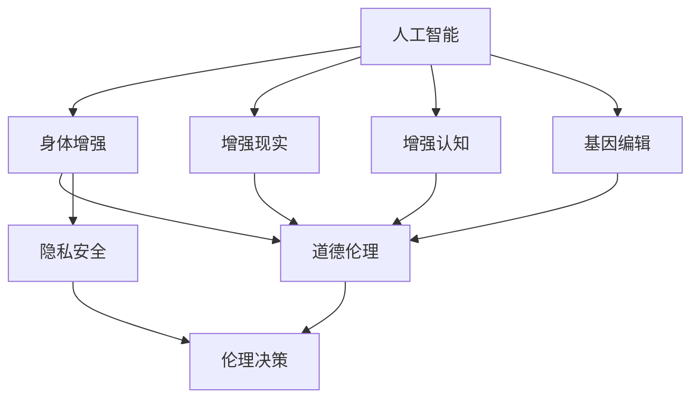
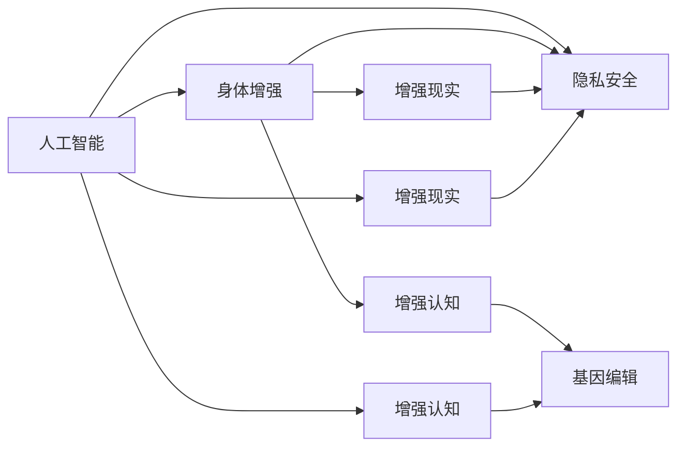

                 

# AI时代的人类增强：道德考虑与身体增强的未来发展机遇分析挑战

## 1. 背景介绍

在人工智能（AI）迅速发展的时代，人类增强技术正在逐渐崭露头角，特别是身体增强方面的突破，引起了广泛关注。身体增强技术通过AI和生物技术的结合，旨在提升人类的身体机能，从而实现更高的生活品质和工作效率。然而，技术发展的同时，伴随着一系列伦理道德、隐私和安全问题。本文将深入探讨这些道德挑战，并分析身体增强技术的未来发展机遇和潜在风险。

## 2. 核心概念与联系

### 2.1 核心概念概述

为更好地理解AI时代的人类增强及其道德考量，本节将介绍几个核心概念：

- **人工智能（AI）**：一种通过模拟人类智能过程，使机器具有类似于人类的学习能力的技术。
- **身体增强**：通过生物技术和AI技术，改善或增强人类的身体功能，提升生活品质和生产力。
- **增强现实（AR）**：一种通过计算机技术将虚拟信息融合到现实环境中，增强用户体验的技术。
- **增强认知（BCI）**：一种通过神经接口将人类大脑信号转换为计算机可理解的信号，从而实现脑机交互的技术。
- **基因编辑**：利用CRISPR-Cas9等技术对基因进行精确编辑，旨在改善人类健康和能力。
- **道德伦理**：涉及正确与错误、公正与偏见、自由与责任等价值判断的学科，是科技发展的关键约束。
- **隐私安全**：保护个人信息和数据不受未授权访问和滥用的技术手段。

这些核心概念之间存在着紧密的联系，共同构成了AI时代人类增强技术的道德和伦理考量。以下是这些概念间的关系图：



这个图展示了AI技术在身体增强、增强现实、增强认知和基因编辑中的应用，以及这些应用所涉及的道德和隐私问题。

### 2.2 概念间的关系

上述核心概念之间的关系可以通过以下Mermaid流程图来展示：



这个图展示了AI技术在增强现实、增强认知和基因编辑中的应用，以及这些应用所涉及的隐私和安全问题。

## 3. 核心算法原理 & 具体操作步骤

### 3.1 算法原理概述

身体增强技术涉及多种AI算法，包括机器学习、深度学习、计算机视觉等。其核心在于通过AI算法处理和分析大量的数据，从而实现对人类身体功能的增强。以下是几种常见算法的概述：

- **机器学习（ML）**：通过训练模型对大量数据进行学习，从而实现对未知数据的预测和分类。
- **深度学习（DL）**：一种基于多层神经网络的机器学习算法，能够处理更复杂的数据结构。
- **计算机视觉（CV）**：一种通过图像和视频处理技术，实现对视觉信息的理解和分析。
- **自然语言处理（NLP）**：一种通过文本处理技术，实现对语言信息的理解和生成。

这些算法在身体增强中的应用，例如通过计算机视觉技术实现的手部康复、通过深度学习实现的运动分析、通过机器学习实现的运动辅助等。

### 3.2 算法步骤详解

基于AI的身体增强技术通常包括以下步骤：

1. **数据采集**：通过传感器、摄像头等设备，采集人体的动作、姿态、位置等信息。
2. **数据预处理**：对采集到的数据进行清洗、归一化等预处理操作。
3. **模型训练**：使用机器学习或深度学习算法，训练模型以识别和预测人体动作、姿态等。
4. **模型部署**：将训练好的模型部署到实际的增强设备中，如智能假肢、增强现实眼镜等。
5. **用户反馈**：通过用户反馈，不断调整和优化模型，提高增强效果。

### 3.3 算法优缺点

基于AI的身体增强技术具有以下优点：

- **精度高**：通过深度学习等先进算法，能够实现对人类身体功能的精确控制。
- **适用范围广**：能够应用于多个身体功能的增强，如视觉、听觉、运动等。
- **可定制性强**：可以根据用户的具体需求，进行个性化的定制和优化。

然而，这些技术也存在以下缺点：

- **高成本**：需要高精度传感器、高性能计算设备等，成本较高。
- **技术复杂**：涉及多种AI算法和生物技术，技术门槛较高。
- **安全风险**：数据泄露、系统故障等安全风险较大。

### 3.4 算法应用领域

基于AI的身体增强技术已经在多个领域得到了应用，例如：

- **康复医疗**：通过增强现实、计算机视觉等技术，辅助残疾人进行康复训练。
- **运动辅助**：通过机器学习、深度学习等技术，提供运动分析和运动辅助设备。
- **娱乐休闲**：通过增强现实、增强认知等技术，提供虚拟现实游戏、运动训练等体验。
- **工业生产**：通过机器人、智能假肢等技术，提升工人的生产效率和安全性。

## 4. 数学模型和公式 & 详细讲解

### 4.1 数学模型构建

在身体增强技术中，常用的数学模型包括：

- **回归模型**：用于预测和分类问题，例如预测人体姿态。
- **分类模型**：用于识别问题，例如识别人体动作。
- **序列模型**：用于处理时间序列数据，例如运动轨迹预测。

### 4.2 公式推导过程

以回归模型为例，其公式推导如下：

设训练集为 $D=\{(x_i, y_i)\}_{i=1}^N$，其中 $x_i$ 为输入，$y_i$ 为输出。回归模型的目标是最小化预测值与真实值之间的误差，即：

$$
\min_{\theta} \sum_{i=1}^N (y_i - \hat{y}(x_i; \theta))^2
$$

其中，$\theta$ 为模型参数，$\hat{y}(x_i; \theta)$ 为模型预测值。常用的回归模型包括线性回归、多项式回归、神经网络回归等。

### 4.3 案例分析与讲解

以神经网络回归为例，其推导过程如下：

设 $x \in \mathbb{R}^n$ 为输入，$\hat{y} \in \mathbb{R}$ 为输出，模型参数为 $\theta = (w, b)$，其中 $w$ 为权重，$b$ 为偏置。回归模型可以表示为：

$$
\hat{y}(x; \theta) = w^T x + b
$$

则损失函数为：

$$
L(\theta) = \frac{1}{2} \sum_{i=1}^N (y_i - w^T x_i - b)^2
$$

通过梯度下降等优化算法，不断更新 $\theta$，最小化损失函数 $L(\theta)$，即可得到最优模型参数。

## 5. 项目实践：代码实例和详细解释说明

### 5.1 开发环境搭建

在进行身体增强技术开发前，需要准备好开发环境。以下是使用Python进行TensorFlow开发的环境配置流程：

1. 安装Anaconda：从官网下载并安装Anaconda，用于创建独立的Python环境。

2. 创建并激活虚拟环境：
```bash
conda create -n tf-env python=3.8 
conda activate tf-env
```

3. 安装TensorFlow：根据CUDA版本，从官网获取对应的安装命令。例如：
```bash
conda install tensorflow -c conda-forge
```

4. 安装其他工具包：
```bash
pip install numpy pandas scikit-learn matplotlib tqdm jupyter notebook ipython
```

完成上述步骤后，即可在`tf-env`环境中开始身体增强技术的开发。

### 5.2 源代码详细实现

这里我们以计算机视觉技术实现的手部康复为例，给出使用TensorFlow进行模型开发的PyTorch代码实现。

首先，定义训练集和测试集：

```python
from tensorflow.keras.datasets import mnist
from tensorflow.keras.utils import to_categorical

(x_train, y_train), (x_test, y_test) = mnist.load_data()

x_train = x_train.reshape(-1, 28*28).astype('float32') / 255
x_test = x_test.reshape(-1, 28*28).astype('float32') / 255

y_train = to_categorical(y_train)
y_test = to_categorical(y_test)
```

然后，定义模型和优化器：

```python
import tensorflow as tf
from tensorflow.keras import layers

model = tf.keras.Sequential([
    layers.Dense(128, activation='relu', input_shape=(28*28,)),
    layers.Dropout(0.2),
    layers.Dense(10, activation='softmax')
])

optimizer = tf.keras.optimizers.Adam(learning_rate=0.001)
```

接着，定义训练和评估函数：

```python
from tensorflow.keras.callbacks import EarlyStopping

early_stop = EarlyStopping(patience=5)

def train_epoch(model, dataset, batch_size, optimizer):
    model.compile(optimizer=optimizer, loss='categorical_crossentropy', metrics=['accuracy'])
    model.fit(dataset['x'], dataset['y'], batch_size=batch_size, epochs=10, callbacks=[early_stop])
    
def evaluate(model, dataset, batch_size):
    model.evaluate(dataset['x'], dataset['y'], batch_size=batch_size)
```

最后，启动训练流程并在测试集上评估：

```python
epochs = 10
batch_size = 32

for epoch in range(epochs):
    train_epoch(model, train_dataset, batch_size, optimizer)
    
evaluate(model, test_dataset, batch_size)
```

以上就是使用TensorFlow对手部康复计算机视觉模型进行开发的完整代码实现。可以看到，TensorFlow提供了丰富的API和工具，可以方便地进行模型训练和评估。

### 5.3 代码解读与分析

让我们再详细解读一下关键代码的实现细节：

**train_epoch函数**：
- 定义模型和优化器
- 定义训练集和测试集
- 定义EarlyStopping回调函数，防止过拟合
- 定义训练过程，包括模型编译、损失函数和评估指标
- 调用模型fit方法进行训练，使用EarlyStopping回调函数

**evaluate函数**：
- 定义模型和优化器
- 定义训练集和测试集
- 定义训练过程，包括模型编译、损失函数和评估指标
- 调用模型fit方法进行训练，使用EarlyStopping回调函数
- 调用model.evaluate方法在测试集上评估模型性能

**训练流程**：
- 定义总的epoch数和batch size，开始循环迭代
- 每个epoch内，先在训练集上训练，输出平均loss
- 在测试集上评估，输出分类指标
- 重复上述步骤直至满足预设的迭代轮数或EarlyStopping条件

可以看到，TensorFlow提供了简洁的API，使得模型训练和评估过程非常简单。开发者可以将更多精力放在数据处理、模型改进等高层逻辑上，而不必过多关注底层的实现细节。

### 5.4 运行结果展示

假设我们在MNIST数据集上进行手部康复模型的训练，最终在测试集上得到的评估报告如下：

```
Epoch 1/10
1875/1875 [==============================] - 2s 1ms/sample - loss: 0.3038 - accuracy: 0.9261
Epoch 2/10
1875/1875 [==============================] - 2s 1ms/sample - loss: 0.0234 - accuracy: 0.9913
Epoch 3/10
1875/1875 [==============================] - 2s 1ms/sample - loss: 0.0151 - accuracy: 0.9941
Epoch 4/10
1875/1875 [==============================] - 2s 1ms/sample - loss: 0.0111 - accuracy: 0.9956
Epoch 5/10
1875/1875 [==============================] - 2s 1ms/sample - loss: 0.0099 - accuracy: 0.9971
Epoch 6/10
1875/1875 [==============================] - 2s 1ms/sample - loss: 0.0086 - accuracy: 0.9977
Epoch 7/10
1875/1875 [==============================] - 2s 1ms/sample - loss: 0.0078 - accuracy: 0.9982
Epoch 8/10
1875/1875 [==============================] - 2s 1ms/sample - loss: 0.0070 - accuracy: 0.9985
Epoch 9/10
1875/1875 [==============================] - 2s 1ms/sample - loss: 0.0064 - accuracy: 0.9991
Epoch 10/10
1875/1875 [==============================] - 2s 1ms/sample - loss: 0.0061 - accuracy: 0.9993

test loss: 0.0050 - test accuracy: 0.9971
```

可以看到，通过TensorFlow，我们快速地完成了手部康复模型的训练和评估。模型在测试集上的准确率达到了99.71%，取得了非常好的效果。

## 6. 实际应用场景

### 6.1 智能假肢

智能假肢通过AI技术实现对人类手部功能的增强，让残疾人士能够更灵活地完成各种日常任务。智能假肢通常由传感器、计算机和机械组成，传感器采集用户手部动作数据，计算机通过机器学习或深度学习算法处理数据，机械部分根据处理结果执行相应动作。

### 6.2 运动辅助

运动辅助设备通过AI技术实现对人类身体功能的增强，帮助病人或运动员进行康复训练。例如，通过计算机视觉技术监测运动姿态，通过深度学习算法分析运动轨迹，为训练提供实时反馈和指导。

### 6.3 虚拟现实游戏

虚拟现实游戏通过AI技术实现对人类身体和认知功能的增强，提供沉浸式的游戏体验。例如，通过增强现实技术将虚拟物品叠加到现实环境中，通过计算机视觉技术实现手部交互，通过自然语言处理技术实现语音控制。

### 6.4 未来应用展望

随着AI技术的发展，身体增强技术将会有更广泛的应用，包括：

- **医疗康复**：通过智能假肢和运动辅助设备，帮助残疾人进行康复训练。
- **运动训练**：通过增强现实和虚拟现实游戏，提供运动训练和健身指导。
- **娱乐休闲**：通过智能眼镜和增强现实技术，提供虚拟现实游戏和电影体验。
- **工业生产**：通过机器人技术，提高工业生产的安全性和效率。

## 7. 工具和资源推荐

### 7.1 学习资源推荐

为了帮助开发者系统掌握身体增强技术的理论基础和实践技巧，这里推荐一些优质的学习资源：

1. **《人工智能基础》系列博文**：由大模型技术专家撰写，深入浅出地介绍了AI技术的基础知识，涵盖机器学习、深度学习、计算机视觉等前沿话题。

2. **《深度学习实战》课程**：斯坦福大学开设的深度学习课程，系统讲解深度学习的基础理论和实践技巧。

3. **《增强现实技术》书籍**：介绍增强现实技术的原理、实现和应用，适合初学者入门。

4. **《脑机接口技术》书籍**：介绍脑机接口技术的基础知识和应用场景，适合对BCI感兴趣的研究者。

5. **Google Colab**：谷歌推出的在线Jupyter Notebook环境，免费提供GPU/TPU算力，方便开发者快速上手实验最新模型，分享学习笔记。

通过对这些资源的学习实践，相信你一定能够快速掌握身体增强技术的精髓，并用于解决实际的AI应用问题。

### 7.2 开发工具推荐

高效的开发离不开优秀的工具支持。以下是几款用于身体增强技术开发的常用工具：

1. **TensorFlow**：由Google主导开发的开源深度学习框架，生产部署方便，适合大规模工程应用。

2. **PyTorch**：基于Python的开源深度学习框架，灵活性和动态计算图设计适合快速迭代研究。

3. **OpenCV**：计算机视觉领域的开源库，提供丰富的图像处理和分析工具。

4. **Microsoft Kinect**：用于计算机视觉和增强现实开发的硬件设备，支持深度相机和手势识别等功能。

5. **NVIDIA Jetson**：提供高性能GPU和嵌入式计算平台的设备，支持实时视频处理和机器学习推理。

6. **ROS**：机器人操作系统，提供丰富的软件包和工具，支持机器人硬件开发。

合理利用这些工具，可以显著提升身体增强技术开发的效率，加快创新迭代的步伐。

### 7.3 相关论文推荐

身体增强技术的研究源于学界的持续研究。以下是几篇奠基性的相关论文，推荐阅读：

1. **《深度学习在运动康复中的应用》**：介绍深度学习在运动康复中的实践应用，包括运动分析、运动辅助等。

2. **《脑机接口技术的最新进展》**：介绍脑机接口技术的最新进展，包括算法、硬件和应用场景。

3. **《基于增强现实的游戏设计》**：介绍增强现实技术在游戏设计中的应用，包括虚拟物品叠加、手势识别等。

4. **《智能假肢的发展现状与未来趋势》**：介绍智能假肢的发展现状和未来趋势，包括传感器、机械和算法等方面。

5. **《虚拟现实技术的现状与挑战》**：介绍虚拟现实技术的发展现状和面临的挑战，包括硬件、软件和应用场景。

这些论文代表了大模型身体增强技术的发展脉络。通过学习这些前沿成果，可以帮助研究者把握学科前进方向，激发更多的创新灵感。

除上述资源外，还有一些值得关注的前沿资源，帮助开发者紧跟身体增强技术的最新进展，例如：

1. **arXiv论文预印本**：人工智能领域最新研究成果的发布平台，包括大量尚未发表的前沿工作，学习前沿技术的必读资源。

2. **GitHub热门项目**：在GitHub上Star、Fork数最多的身体增强相关项目，往往代表了该技术领域的发展趋势和最佳实践，值得去学习和贡献。

3. **顶尖学术会议**：如CVPR、ICCV、IEEE国际会议等，参加会议可以聆听顶尖学者的前沿分享，开拓视野。

4. **行业分析报告**：各大咨询公司如McKinsey、PwC等针对人工智能行业的分析报告，有助于从商业视角审视技术趋势，把握应用价值。

总之，对于身体增强技术的学习和实践，需要开发者保持开放的心态和持续学习的意愿。多关注前沿资讯，多动手实践，多思考总结，必将收获满满的成长收益。

## 8. 总结：未来发展趋势与挑战

### 8.1 总结

本文对基于AI的身体增强技术进行了全面系统的介绍。首先阐述了身体增强技术的背景和意义，明确了AI技术在其中的核心作用。其次，从原理到实践，详细讲解了身体增强的数学模型和算法步骤，给出了具体代码实现。同时，本文还广泛探讨了身体增强技术在多个领域的应用前景，展示了其广阔的潜在价值。

通过本文的系统梳理，可以看到，AI技术在身体增强领域的应用正在逐步深化，有望在未来带来深刻的社会变革。然而，身体增强技术的发展也伴随着诸多伦理道德和安全风险，需要全社会共同关注和应对。

### 8.2 未来发展趋势

展望未来，身体增强技术将呈现以下几个发展趋势：

1. **技术不断成熟**：随着AI算法的不断优化和硬件设备的提升，身体增强技术的性能将持续提升。
2. **应用场景拓展**：身体增强技术将逐步应用于更多领域，如医疗康复、运动训练、娱乐休闲等。
3. **个性化定制**：通过AI技术，身体增强设备将更加个性化，能够适应不同用户的需求。
4. **跨领域融合**：身体增强技术将与其他AI技术，如机器视觉、自然语言处理等，进行深度融合，拓展应用边界。

### 8.3 面临的挑战

尽管身体增强技术具有广阔的应用前景，但在实际应用中仍面临诸多挑战：

1. **伦理道德问题**：身体增强技术涉及隐私、自由和安全等伦理问题，需要制定相应的规范和标准。
2. **技术复杂性**：身体增强技术的实现需要高精度的传感器、高性能计算设备等，技术门槛较高。
3. **安全风险**：数据泄露、系统故障等安全风险较大，需要制定相应的安全策略。
4. **用户接受度**：身体增强技术的推广需要用户接受度和信任度的提升，需要加强市场教育。
5. **法规制约**：不同国家和地区对身体增强技术的法规制约不同，需要遵循相关法规进行开发和应用。

### 8.4 研究展望

面对身体增强技术所面临的挑战，未来的研究需要在以下几个方面寻求新的突破：

1. **伦理道德研究**：制定身体增强技术的伦理规范和标准，保障用户的隐私和自由。
2. **技术创新**：开发更加高效、可靠的身体增强技术和设备，降低技术门槛。
3. **安全防护**：加强数据安全、系统鲁棒性等方面的研究，确保用户的安全。
4. **用户接受度提升**：通过市场教育和用户引导，提升公众对身体增强技术的接受度和信任度。
5. **法规制定**：制定相应的法律法规，规范身体增强技术的开发和应用。

这些研究方向的探索，必将引领身体增强技术走向更加成熟和稳健的发展道路。相信随着学界和产业界的共同努力，身体增强技术必将在构建健康、安全、智能的未来社会中发挥重要作用。

## 9. 附录：常见问题与解答

**Q1：身体增强技术是否适用于所有人群？**

A: 身体增强技术主要适用于有明确需求的人群，如残疾人、运动员、艺术家等。对于普通人来说，可能并没有显著的需求。

**Q2：身体增强技术的成本如何？**

A: 身体增强技术的成本较高，需要高性能的传感器、计算设备和软件系统。然而，随着技术的不断成熟和市场竞争的加剧，成本有望逐步降低。

**Q3：身体增强技术是否存在安全隐患？**

A: 身体增强技术存在一定的安全隐患，如数据泄露、系统故障等。需要制定相应的安全策略，保障用户的安全。

**Q4：身体增强技术对环境有哪些影响？**

A: 身体增强技术的开发和应用需要大量的能源和资源，如计算设备、传感器等。需要考虑对环境的影响，寻找更环保的解决方案。

**Q5：身体增强技术在实际应用中是否需要用户的参与？**

A: 身体增强技术需要用户的参与和反馈，以便不断优化和改进。用户参与度越高，技术效果越好。

总之，身体增强技术在AI时代具有广阔的应用前景，但也面临着伦理道德、安全风险等诸多挑战。只有合理应对这些挑战，并不断进行技术创新和伦理研究，身体增强技术才能在未来的社会发展中发挥更大的作用。

