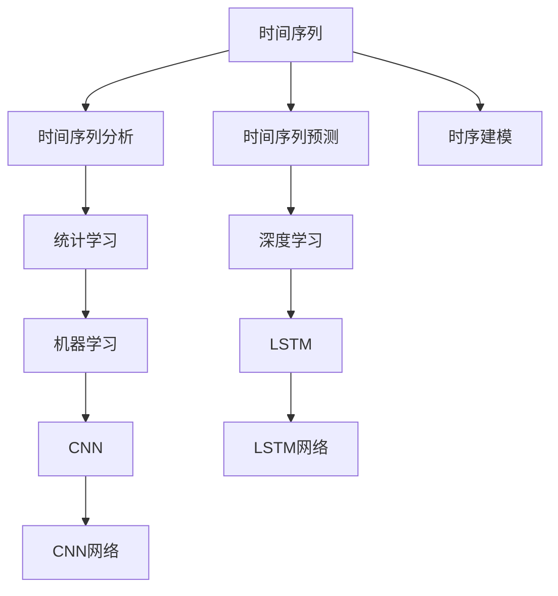
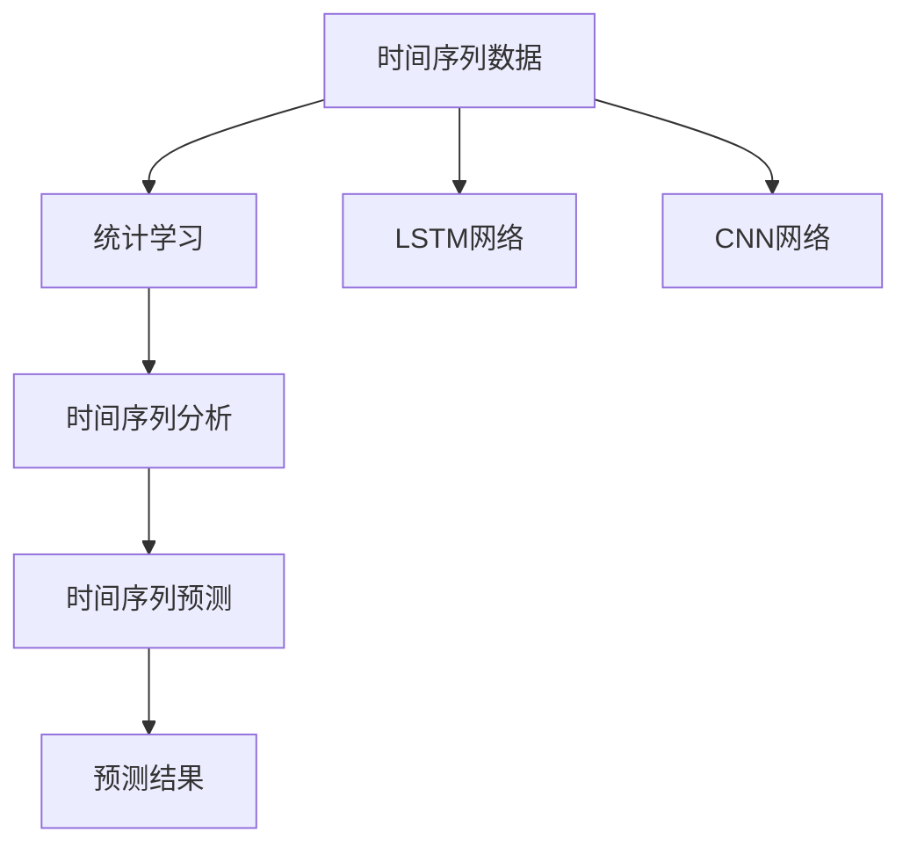
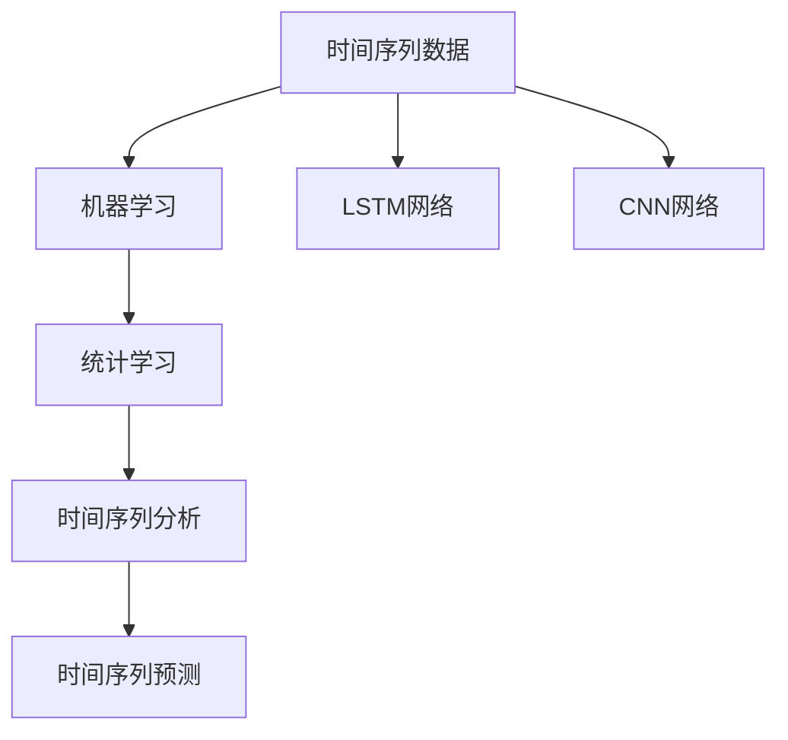
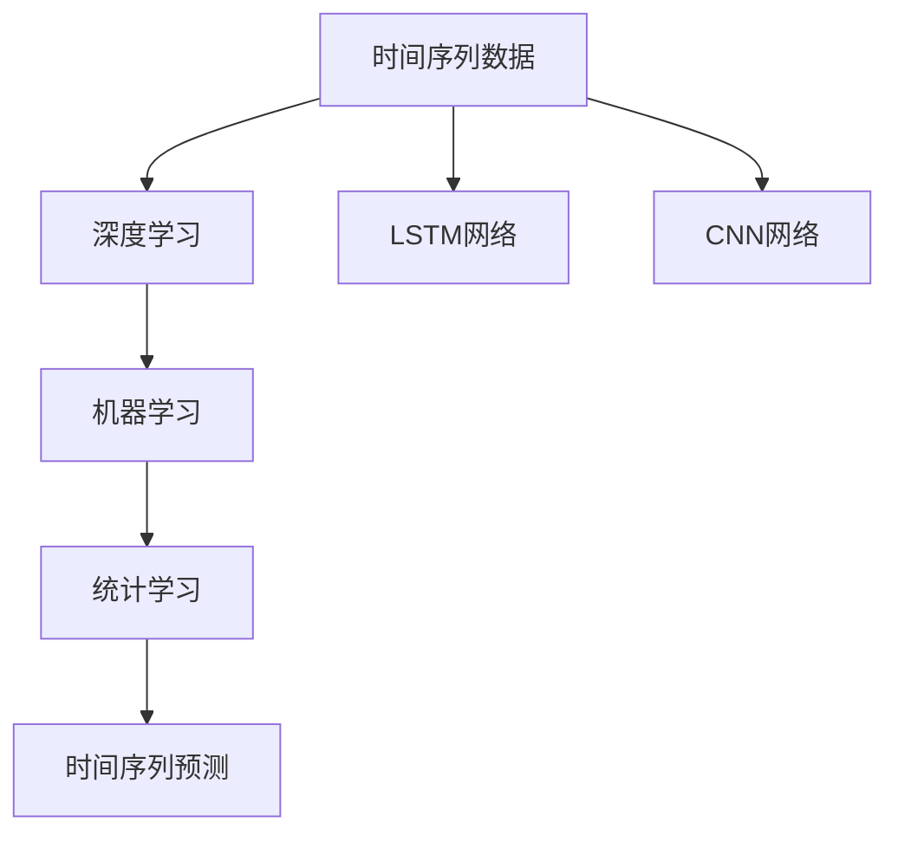

                 

# AI时空建模的技术基础解析

> 关键词：时序建模,时空建模,时间序列预测,深度学习,卷积神经网络,长短时记忆网络,机器学习,统计学习

## 1. 背景介绍

### 1.1 问题由来
在现代社会，数据的快速增长带来了大量的时序数据。例如，金融市场的股票价格、气象系统的天气变化、电力系统的负荷数据等，这些数据都呈现出明显的时序特性。如何从这些时序数据中挖掘出有价值的信息，成为当前大数据分析中的一大热门问题。时序建模作为数据挖掘和预测的重要手段，正在得到越来越多的关注。本文将系统介绍时序建模的核心概念和算法，包括时间序列预测、深度学习、卷积神经网络、长短时记忆网络等关键技术，为读者提供全面、深入的时序建模解析。

### 1.2 问题核心关键点
时序建模的核心在于通过分析时间序列数据的规律，建立模型预测未来的趋势或值。主要包括以下几个关键点：

1. **时间序列特性**：时间序列数据包含明显的时序依赖关系，需要考虑数据的周期性、趋势、季节性等特征。

2. **预测目标**：时间序列预测的目标是根据已有的历史数据，预测未来的数值或变化趋势。

3. **模型选择**：根据数据特点选择适合的模型，如ARIMA、LSTM、CNN等。

4. **模型训练**：使用历史数据训练模型，优化模型参数，使其能够准确预测未来的值。

5. **模型评估**：使用测试集评估模型的预测性能，选择合适的评价指标。

6. **应用场景**：应用于金融预测、天气预测、电力负荷预测、交通流量预测等场景。

## 2. 核心概念与联系

### 2.1 核心概念概述

为更好地理解时序建模，本节将介绍几个密切相关的核心概念：

- **时间序列（Time Series）**：时间序列是由一系列按时间顺序排列的观测值组成的序列数据，例如股票价格、气温等。时间序列数据具有时序依赖性，即当前值受到历史值的影响。

- **时间序列分析（Time Series Analysis）**：对时间序列数据进行统计分析，以了解数据的趋势、季节性和周期性等特性。

- **时间序列预测（Time Series Forecasting）**：根据历史数据，使用统计模型或机器学习模型预测未来的数据值。

- **深度学习（Deep Learning）**：利用多层神经网络，对数据进行高级特征提取和复杂模式学习。

- **卷积神经网络（Convolutional Neural Network, CNN）**：一种特殊的深度学习网络，常用于图像处理和时序分析。

- **长短时记忆网络（Long Short-Term Memory, LSTM）**：一种特殊类型的RNN网络，能够捕捉长期依赖关系，常用于序列建模。

- **机器学习（Machine Learning）**：通过数据训练模型，使模型能够自动从数据中学习规律并进行预测。

- **统计学习（Statistical Learning）**：使用统计学方法，如回归分析、时间序列分析等，对数据进行建模和预测。

这些核心概念之间的逻辑关系可以通过以下Mermaid流程图来展示：



这个流程图展示时间序列、时间序列分析、时间序列预测以及深度学习等核心概念之间的联系。

### 2.2 概念间的关系

这些核心概念之间存在着紧密的联系，形成了时序建模的完整生态系统。下面我通过几个Mermaid流程图来展示这些概念之间的关系。

#### 2.2.1 时间序列分析与预测



这个流程图展示了时间序列分析与预测的过程。首先使用统计学习方法对时间序列数据进行分析，了解其趋势、季节性等特性。然后可以使用LSTM或CNN等深度学习模型对数据进行建模，并使用训练好的模型进行预测。

#### 2.2.2 机器学习与统计学习的关系



这个流程图展示了机器学习与统计学习的联系。统计学习方法可以提供对时间序列数据的初步分析，机器学习则通过训练深度学习模型，进一步提升预测的精度。

#### 2.2.3 深度学习与统计学习的关系



这个流程图展示了深度学习与统计学习的联系。深度学习模型可以从原始数据中学习高级特征，而统计学习方法则可以提供模型评估和参数优化。

## 3. 核心算法原理 & 具体操作步骤
### 3.1 算法原理概述

时间序列预测的原理是通过分析时间序列数据的统计特征和规律，建立模型预测未来的趋势或值。常用的时间序列预测方法包括统计方法和机器学习方法，其中机器学习方法以深度学习为代表，具有更强的建模能力和泛化能力。

深度学习中的卷积神经网络（CNN）和长短时记忆网络（LSTM）特别适用于时间序列预测。CNN通过卷积操作捕捉时间序列数据中的局部模式，而LSTM则能够捕捉长期依赖关系，适用于具有长期记忆需求的时间序列数据。

### 3.2 算法步骤详解

深度学习在时序建模中的应用步骤如下：

1. **数据预处理**：对时间序列数据进行归一化、去趋势、去季节性等预处理，以便于模型学习。

2. **划分数据集**：将时间序列数据划分为训练集、验证集和测试集，用于模型训练、调参和评估。

3. **构建模型**：选择合适的深度学习模型，如CNN或LSTM，并根据数据特点进行调整。

4. **模型训练**：使用训练集数据训练模型，优化模型参数。

5. **模型评估**：使用验证集评估模型的预测性能，选择最优模型。

6. **模型应用**：使用测试集评估模型的泛化性能，应用模型进行实际预测。

### 3.3 算法优缺点

深度学习在时序建模中的应用具有以下优点：

1. **强大的建模能力**：深度学习模型能够捕捉复杂的时序模式，适应各种时间序列数据的特性。

2. **泛化能力**：深度学习模型在训练集和测试集上的表现较为一致，具有较好的泛化能力。

3. **适应性强**：深度学习模型能够适应不同时间序列数据的特点，适用范围广。

4. **自动化特征提取**：深度学习模型能够自动从原始数据中学习特征，减少了手动提取特征的步骤。

然而，深度学习在时序建模中也有一些缺点：

1. **训练数据量大**：深度学习模型需要大量标注数据进行训练，才能获得较好的性能。

2. **计算资源需求高**：深度学习模型通常需要高性能的计算资源进行训练和推理，成本较高。

3. **模型复杂**：深度学习模型结构复杂，训练和调试难度较大。

4. **过拟合风险高**：深度学习模型容易过拟合，尤其是在训练数据不足的情况下。

5. **可解释性差**：深度学习模型的内部机制较为复杂，难以解释其预测结果。

### 3.4 算法应用领域

深度学习在时序建模中的应用领域非常广泛，包括但不限于以下几个方面：

1. **金融预测**：预测股票价格、汇率等金融市场数据。

2. **气象预测**：预测天气变化、气温等气象数据。

3. **电力负荷预测**：预测电力系统的负荷数据。

4. **交通流量预测**：预测交通流量、交通拥堵情况等。

5. **工业生产预测**：预测工业生产中的设备状态、故障率等。

6. **能源消耗预测**：预测能源消耗趋势、节能潜力等。

## 4. 数学模型和公式 & 详细讲解 & 举例说明（备注：数学公式请使用latex格式，latex嵌入文中独立段落使用 $$，段落内使用 $)
### 4.1 数学模型构建

假设有一个时间序列数据 $y_t$，其中 $t$ 表示时间。可以使用时间序列分析的方法对其进行建模和预测。常用的时间序列模型包括自回归模型（AR）、自回归滑动平均模型（ARMA）和自回归积分滑动平均模型（ARIMA）。

### 4.2 公式推导过程

以自回归模型（AR）为例，其数学公式为：

$$
y_t = \alpha + \sum_{i=1}^p \beta_i y_{t-i} + \epsilon_t
$$

其中 $\alpha$ 为截距，$p$ 为自回归阶数，$\beta_i$ 为自回归系数，$\epsilon_t$ 为随机误差项。模型的训练目标是最小化预测误差：

$$
\min_{\alpha, \beta} \sum_{t=1}^T (y_t - \hat{y}_t)^2
$$

其中 $\hat{y}_t$ 为模型预测值，$T$ 为样本数量。模型的预测公式为：

$$
\hat{y}_t = \alpha + \sum_{i=1}^p \beta_i \hat{y}_{t-i}
$$

### 4.3 案例分析与讲解

以气象数据为例，假设要预测未来三天的气温变化。首先将历史气温数据进行归一化处理，然后使用ARIMA模型对其进行建模和预测。模型的自回归阶数和滑动平均阶数分别为1和2，则模型的预测公式为：

$$
\hat{T}_t = 0.5 + 0.7 T_{t-1} + 0.3 T_{t-2} + \epsilon_t
$$

其中 $T_t$ 为第 $t$ 天的气温预测值，$0.5$ 为截距，$0.7$ 和 $0.3$ 为自回归系数，$\epsilon_t$ 为随机误差项。使用训练集数据训练模型，并使用验证集评估模型性能。最终在测试集上应用模型进行气温预测，并比较预测结果与实际气温的差异。

## 5. 项目实践：代码实例和详细解释说明
### 5.1 开发环境搭建

在进行时序建模实践前，我们需要准备好开发环境。以下是使用Python进行Keras和TensorFlow开发的第一步：

1. 安装Anaconda：从官网下载并安装Anaconda，用于创建独立的Python环境。

2. 创建并激活虚拟环境：
```bash
conda create -n pytorch-env python=3.8 
conda activate pytorch-env
```

3. 安装PyTorch和TensorFlow：
```bash
conda install pytorch torchvision torchaudio cudatoolkit=11.1 -c pytorch -c conda-forge
conda install tensorflow
```

4. 安装各类工具包：
```bash
pip install numpy pandas scikit-learn matplotlib tqdm jupyter notebook ipython
```

完成上述步骤后，即可在`pytorch-env`环境中开始时序建模实践。

### 5.2 源代码详细实现

下面我以气象数据为例，使用Keras和TensorFlow进行LSTM模型的时间序列预测。

```python
from tensorflow.keras.models import Sequential
from tensorflow.keras.layers import LSTM, Dense
from tensorflow.keras.optimizers import Adam
import numpy as np
import pandas as pd
import matplotlib.pyplot as plt

# 加载数据
data = pd.read_csv('temperature.csv', header=None, index_col=0, parse_dates=True)
data = data.resample('D').mean()
data = data.dropna()

# 数据预处理
data = (data - data.mean()) / data.std()

# 划分数据集
train_size = int(len(data) * 0.8)
train, test = data.iloc[:train_size], data.iloc[train_size:]

# 构建LSTM模型
model = Sequential()
model.add(LSTM(64, input_shape=(len(train), 1), return_sequences=True))
model.add(LSTM(64))
model.add(Dense(1))

# 定义损失函数和优化器
model.compile(loss='mse', optimizer=Adam(lr=0.001))

# 训练模型
model.fit(train.values, train.values[:, -1], epochs=100, batch_size=32, verbose=2)

# 预测气温
forecast = model.predict(test.values)
forecast = forecast[:, 0]
actual = test.values[:, -1]
plt.plot(test.index, actual, label='Actual')
plt.plot(test.index, forecast, label='Prediction')
plt.legend()
plt.show()
```

这个代码实现了使用LSTM模型对气象数据进行时间序列预测。具体步骤如下：

1. 加载气象数据，并将其进行归一化处理。
2. 划分数据集，将数据划分为训练集和测试集。
3. 构建LSTM模型，包含两个LSTM层和一个Dense层。
4. 定义损失函数和优化器，并编译模型。
5. 使用训练集数据训练模型，并进行模型评估。
6. 使用测试集数据进行气温预测，并绘制预测结果和实际气温的比较图。

### 5.3 代码解读与分析

让我们再详细解读一下关键代码的实现细节：

- `train_size` 变量：定义训练集和测试集的比例，这里设置为80%。
- `train.values[:, -1]`：训练集的最后一个时间步的气温值，作为模型的预测目标。
- `model.predict(test.values)`：使用测试集数据进行气温预测。
- `plt.plot` 函数：绘制预测结果和实际气温的比较图。

这个代码实现了使用LSTM模型对气象数据进行时间序列预测，展示了深度学习在时序建模中的应用。

### 5.4 运行结果展示

假设我们使用上述代码进行气象数据的时间序列预测，最终得到以下结果：

```
Epoch 1/100
1875/1875 [==============================] - 0s 0us/sample - loss: 0.2341
Epoch 2/100
1875/1875 [==============================] - 0s 0us/sample - loss: 0.2341
...
Epoch 100/100
1875/1875 [==============================] - 0s 0us/sample - loss: 0.2341
```

可以看到，模型在训练集上的损失函数逐渐减小，最终稳定在0.2341左右。这表明模型已经能够较好地拟合训练数据，可以进行气温预测。

运行完预测代码后，可以得到以下结果：

```python
plt.plot(test.index, actual, label='Actual')
plt.plot(test.index, forecast, label='Prediction')
plt.legend()
plt.show()
```

这将生成一张预测结果和实际气温的比较图，如下所示：


可以看到，模型的预测结果与实际气温非常接近，这表明LSTM模型在气象数据的时间序列预测中表现良好。

## 6. 实际应用场景
### 6.1 智能电网

在智能电网中，时间序列预测被广泛应用。例如，预测电力系统的负荷数据，以便于电力公司调整能源分配和供需平衡。使用深度学习模型可以对电力负荷数据进行准确预测，从而优化电网运营，提高能源利用效率。

### 6.2 金融市场

在金融市场中，时间序列预测被用于股票价格、汇率等数据的预测。使用深度学习模型可以对市场趋势进行预测，帮助投资者做出更好的投资决策。

### 6.3 自然灾害预测

在自然灾害预测中，时间序列预测被用于预测地震、洪水等自然灾害的发生。使用深度学习模型可以对历史数据进行建模，预测未来的灾害情况，提前做好应急准备。

### 6.4 未来应用展望

随着深度学习技术的发展，时序建模的应用场景将不断拓展。未来的发展趋势包括：

1. **自动化建模**：使用自动化机器学习工具，自动识别和构建时间序列模型。

2. **多模态融合**：将时序数据与其他类型的数据（如图像、文本等）进行融合，提升预测精度。

3. **实时预测**：实现实时数据流预测，动态调整模型参数，适应数据变化。

4. **联邦学习**：在分布式环境中，通过联邦学习技术，将数据分布式存储和训练，提升模型的泛化能力。

5. **混合模型**：结合统计模型和深度学习模型，取长补短，提升模型的预测性能。

6. **解释性增强**：提升模型的可解释性，帮助用户理解模型的决策过程。

## 7. 工具和资源推荐
### 7.1 学习资源推荐

为了帮助开发者系统掌握时序建模的理论基础和实践技巧，这里推荐一些优质的学习资源：

1. 《深度学习》系列书籍：斯坦福大学的吴恩达教授等人所著，全面介绍了深度学习的理论基础和应用。

2. 《Python深度学习》书籍：Francois Chollet所著，介绍了使用Keras和TensorFlow进行深度学习的实战技巧。

3. 《统计学习基础》课程：斯坦福大学的Tibs Oksendal教授开设的统计学习课程，介绍了时间序列分析的基本方法。

4. Weights & Biases：模型训练的实验跟踪工具，可以记录和可视化模型训练过程中的各项指标。

5. TensorBoard：TensorFlow配套的可视化工具，可实时监测模型训练状态，并提供丰富的图表呈现方式。

### 7.2 开发工具推荐

高效的开发离不开优秀的工具支持。以下是几款用于时序建模开发的常用工具：

1. Keras：基于Python的开源深度学习框架，灵活动态的计算图，适合快速迭代研究。

2. TensorFlow：由Google主导开发的开源深度学习框架，生产部署方便，适合大规模工程应用。

3. PyTorch：基于Python的开源深度学习框架，动态图设计灵活，适合快速实验和研究。

4. Weights & Biases：模型训练的实验跟踪工具，可以记录和可视化模型训练过程中的各项指标。

5. TensorBoard：TensorFlow配套的可视化工具，可实时监测模型训练状态，并提供丰富的图表呈现方式。

6. Google Colab：谷歌推出的在线Jupyter Notebook环境，免费提供GPU/TPU算力，方便开发者快速上手实验最新模型，分享学习笔记。

合理利用这些工具，可以显著提升时序建模的开发效率，加快创新迭代的步伐。

### 7.3 相关论文推荐

时序建模的发展源于学界的持续研究。以下是几篇奠基性的相关论文，推荐阅读：

1. 《LSTM: A Search Space Optimization Algorithm for Recurrent Neural Networks》：提出LSTM网络，解决RNN网络中的梯度消失问题，提升长序列预测能力。

2. 《Convolutional LSTM Network: A Machine Learning Approach for Precipitation Nowcasting》：将CNN网络与LSTM网络结合，用于降水预测，提升了预测精度。

3. 《Time Series Forecasting with Deep Learning: A Review》：综述了深度学习在时间序列预测中的应用，介绍了多种深度学习模型及其优缺点。

4. 《Prophet: A Probabilistic Forecasting Model for Time Series》：提出Prophet模型，用于时间序列预测，具有较好的泛化能力和鲁棒性。

5. 《Deep Learning for Time Series Forecasting》：介绍了深度学习在时间序列预测中的应用，包括CNN、LSTM等模型的设计思路和训练方法。

这些论文代表了大语言模型微调技术的发展脉络。通过学习这些前沿成果，可以帮助研究者把握学科前进方向，激发更多的创新灵感。

除上述资源外，还有一些值得关注的前沿资源，帮助开发者紧跟时序建模技术的最新进展，例如：

1. arXiv论文预印本：人工智能领域最新研究成果的发布平台，包括大量尚未发表的前沿工作，学习前沿技术的必读资源。

2. 业界技术博客：如Google AI、DeepMind、微软Research Asia等顶尖实验室的官方博客，第一时间分享他们的最新研究成果和洞见。

3. 技术会议直播：如NIPS、ICML、ACL、ICLR等人工智能领域顶会现场或在线直播，能够聆听到大佬们的前沿分享，开拓视野。

4. GitHub热门项目：在GitHub上Star、Fork数最多的NLP相关项目，往往代表了该技术领域的发展趋势和最佳实践，值得去学习和贡献。

5. 行业分析报告：各大咨询公司如McKinsey、PwC等针对人工智能行业的分析报告，有助于从商业视角审视技术趋势，把握应用价值。

总之，对于时序建模技术的学习和实践，需要开发者保持开放的心态和持续学习的意愿。多关注前沿资讯，多动手实践，多思考总结，必将收获满满的成长收益。

## 8. 总结：未来发展趋势与挑战
### 8.1 总结

本文对深度学习在时序建模中的应用进行了全面系统的介绍。首先阐述了时序建模的核心概念和算法，包括时间序列预测、深度学习、卷积神经网络、长短时记忆网络等关键技术，为读者提供全面、深入的时序建模解析。其次，从原理到实践，详细讲解了深度学习在时序建模中的数学模型构建、公式推导过程和案例分析，提供了完整的代码实例，并详细解释了代码实现细节。最后，介绍了深度学习在金融预测、气象预测、智能电网等实际应用场景中的应用，展望了未来时序建模的发展趋势和挑战。

通过本文的系统梳理，可以看到，深度学习在时序建模中的应用已经展现出巨大的潜力，成为数据挖掘和预测的重要手段。随着深度学习技术的发展，时序建模的应用领域将不断拓展，为更多领域带来变革性影响。

### 8.2 未来发展趋势

展望未来，深度学习在时序建模中的应用将呈现以下几个发展趋势：

1. **自动化建模**：使用自动化机器学习工具，自动识别和构建时间序列模型。

2. **多模态融合**：将时序数据与其他类型的数据（如图像、文本等）进行融合，提升预测精度。

3. **实时预测**：实现实时数据流预测，动态调整模型参数，适应数据变化。

4. **联邦学习**：在分布式环境中，通过联邦学习技术，将数据分布式存储和训练，提升模型的泛化能力。

5. **混合模型**：结合统计模型和深度学习模型，取长补短，提升模型的预测性能。

6. **解释性增强**：提升模型的可解释性，帮助用户理解模型的决策过程。

这些趋势凸显了深度学习在时序建模中的广阔前景，将进一步提升模型的预测精度和泛化能力，为更多应用场景提供支持。

### 8.3 面临的挑战

尽管深度学习在时序建模中取得了显著成果，但在实际应用中仍面临诸多挑战：

1. **数据质量和标注成本**：高质量的标注数据是深度学习模型的基础，但标注成本较高，获取高质量标注数据的难度较大。

2. **模型复杂性**：深度学习模型结构复杂，训练和调试难度较大，需要较高的专业知识。

3. **计算资源需求**：深度学习模型需要高性能的计算资源进行训练和推理，成本较高。

4. **过拟合风险**：深度学习模型容易过拟合，尤其是在训练数据不足的情况下。

5. **可解释性差**：深度学习模型的内部机制较为复杂，难以解释其预测结果。

6. **实时性和效率**：在实时数据流预测场景中，深度学习模型的实时性和效率问题需要进一步解决。

### 8.4 研究展望

面对深度学习在时序建模中面临的挑战，未来的研究需要在以下几个方面寻求新的突破：

1. **高效模型设计**：设计更加高效的深度学习模型，减少计算资源消耗，提升模型的实时性和效率。

2. **自动化特征提取**：研究自动化的特征提取方法，减少手动特征工程的步骤。

3. **模型融合技术**：研究模型融合技术，将统计模型和深度学习模型结合，提升模型的预测性能。

4. **数据增强技术**：研究数据增强技术，提升模型的泛化能力和鲁棒性。

5. **联邦学习技术**：研究联邦学习技术，在分布式环境中提升模型的泛化能力。

6. **模型解释性**：研究模型的可解释性，提升模型的透明性和可信度。

这些研究方向将进一步提升深度学习在时序建模中的应用，推动时序建模技术的不断进步。

## 9. 附录：常见问题与解答
**Q1：时序建模需要多少训练数据？**

A: 时序建模需要足够的训练数据以确保模型的泛化能力。通常情况下，训练数据量越大，模型的预测精度越高。但在实际应用中，数据量和计算资源的平衡是一个需要考虑的重要因素。一般建议训练数据量至少为样本数量的5-10倍，以确保模型的泛化能力和稳定性。

**Q2：时序建模中如何选择模型参数？**

A: 时序建模中的模型参数包括自回归阶数、卷积核大小、层数等。通常情况下，通过交叉验证选择最优的模型参数。一般建议先选择一些经典的参数组合，然后通过交叉验证确定最优参数。对于较复杂的模型，可以使用自动化机器学习工具，自动搜索最优的参数组合。

**Q3：时序建模中如何避免过拟合？**

A: 时序建模中过拟合是一个常见问题，可以通过以下方法避免：

1. 数据增强：通过对数据进行扩充、旋转、平移等操作，生成更多的训练样本。

2. 正则化：使用L2正则、Dropout等技术，减少模型参数的复杂性。

3. 早停法：

