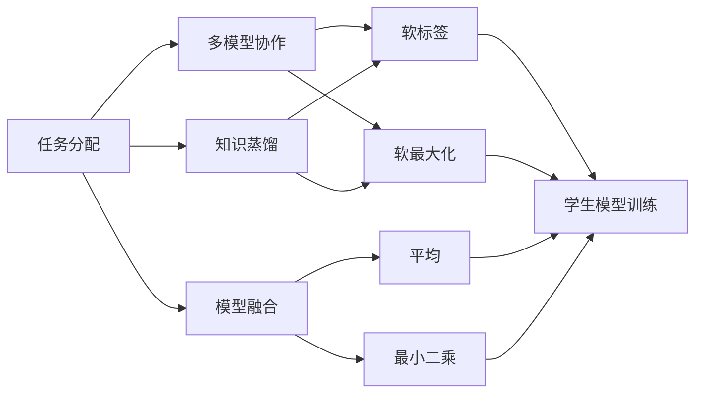

                 

# AI模型的任务分配与协作

在当今复杂多变的应用环境中，单一的AI模型难以应对复杂的多任务需求。任务分配与协作技术成为了提升AI系统整体性能的关键手段。本文将深入探讨任务分配与协作的核心概念，阐明其核心算法原理，并通过具体案例展示其实际应用效果。

## 1. 背景介绍

### 1.1 问题由来

在现实世界的智能系统中，任务通常是多样且复杂的。例如，智能客服系统需要同时处理多个用户请求；自动驾驶车辆需要在驾驶、路线规划、环境感知等多个任务间进行切换。传统基于单一模型的设计方式，难以满足这种动态且多变的任务需求。

近年来，随着模型融合、分布式训练等技术的兴起，多任务协作系统逐渐成为AI应用的重要方向。AI模型的任务分配与协作，正是为了应对这种多任务需求，通过合理的任务分配，使得模型间相互协作，共同完成整体任务。

### 1.2 问题核心关键点

任务分配与协作技术的关键在于如何将多任务合理分配给不同的模型，并协调它们之间的信息交互。一个理想的协作系统应具备以下特点：
- 可扩展性：可以灵活添加和扩展任务。
- 鲁棒性：在模型性能波动时仍能稳定运行。
- 高效性：优化资源利用，减少模型间通信开销。
- 自适应性：能根据任务需求自适应调整模型参数。
- 协作性：模型间应具有良好的信息交互机制。

## 2. 核心概念与联系

### 2.1 核心概念概述

为更好地理解任务分配与协作技术，本文将介绍几个关键概念：

- **任务分配(Task Allocation)**：将多个子任务合理分配给不同的模型处理，通过选择合适的任务分配策略，使得整体系统的效率和性能最优。
- **多模型协作(Multi-model Collaboration)**：多个模型相互协作，共享信息，共同完成复杂任务。例如，通过模型融合、知识蒸馏等方式，提高系统的整体表现。
- **知识蒸馏(Knowledge Distillation)**：利用教师模型（已有预训练模型）的知识，通过软标签等方法，指导学生模型（新训练模型）的训练，提高其性能。
- **模型融合(Model Fusion)**：将多个模型的输出进行加权融合，生成更具综合性的结果。融合方法包括简单平均、加权平均、加权最小二乘等。

这些核心概念之间紧密联系，共同构成了任务分配与协作技术的整体框架。以下是一个合成的Mermaid流程图，展示了这些概念之间的关系：



### 2.2 概念间的关系

这些核心概念之间存在紧密的联系，形成了多任务协作系统的完整生态系统。

- **任务分配与多模型协作**：任务分配是协作的基础，决定了各个模型如何协同工作。
- **知识蒸馏与多模型协作**：知识蒸馏是多模型协作的一种重要方式，通过教师模型指导学生模型训练，提升整体协作效果。
- **模型融合与多模型协作**：模型融合是协作的后续处理步骤，将多个模型的输出进行综合，生成最终结果。

## 3. 核心算法原理 & 具体操作步骤

### 3.1 算法原理概述

基于任务分配与协作的AI系统，一般包含以下几个步骤：

1. **任务分解**：将整体任务分解为多个子任务。
2. **模型选择与分配**：根据任务需求选择合适的模型，并将任务合理分配给各个模型。
3. **模型训练与优化**：在任务分配后，对模型进行训练与优化，提高其性能。
4. **模型融合与反馈**：将多个模型的输出进行融合，并根据融合结果进行反馈调整，优化任务分配与协作。

这一过程可以用以下简化模型来表示：

$$
\text{Overall Task} = \text{Task Allocation}(\text{Subtask}_1, \text{Subtask}_2, \ldots, \text{Subtask}_n, \text{Model}_1, \text{Model}_2, \ldots, \text{Model}_n)
$$

其中，$\text{Subtask}_i$ 为第 $i$ 个子任务，$\text{Model}_i$ 为负责处理第 $i$ 个子任务的模型。任务分配函数 $\text{Task Allocation}$ 根据任务需求和模型能力，将子任务分配给最合适的模型。

### 3.2 算法步骤详解

具体来说，任务分配与协作的算法步骤如下：

#### 3.2.1 任务分解

任务分解是将整体任务细分为多个子任务的过程。例如，在智能客服系统中，可以分解为多个子任务：文本理解、意图识别、问题回答等。

#### 3.2.2 模型选择与分配

模型选择与分配是任务分配的核心步骤。常见的方法包括：
- **基于规则的方法**：根据任务类型和模型能力，手动设计规则进行任务分配。
- **基于性能的方法**：根据模型性能指标（如精度、召回率等）进行任务分配，选择性能最好的模型处理特定任务。
- **基于竞争的方法**：多个模型通过竞争机制获取任务，例如，通过投票或竞价策略选择最优模型。

#### 3.2.3 模型训练与优化

在任务分配后，对各个模型进行训练与优化。常见的方法包括：
- **监督学习**：使用标注数据对模型进行训练，提高其性能。
- **无监督学习**：使用未标注数据进行训练，发掘数据中的潜在模式。
- **强化学习**：通过试错调整模型参数，优化任务完成效果。

#### 3.2.4 模型融合与反馈

将各个模型的输出进行融合，生成综合结果。常见的方法包括：
- **简单平均**：对各个模型输出取平均。
- **加权平均**：根据模型性能，对输出进行加权平均。
- **加权最小二乘**：使用最小二乘方法，计算最优权重，进行模型融合。

### 3.3 算法优缺点

基于任务分配与协作的AI系统有以下优点：
- **灵活性高**：可以根据任务需求动态调整模型，适应多变环境。
- **鲁棒性强**：通过模型融合和协作，可以缓解单模型性能波动带来的影响。
- **效率高**：通过合理分配任务，避免模型间的冗余计算。
- **自适应性强**：通过反馈调整，不断优化任务分配与协作策略。

但该系统也存在以下缺点：
- **复杂度高**：设计复杂，需要综合考虑多个因素进行任务分配。
- **通信开销大**：多个模型间需要频繁通信，可能带来性能开销。
- **不稳定**：系统整体性能受单一模型影响较大，模型间协作存在风险。

### 3.4 算法应用领域

基于任务分配与协作的AI系统在多个领域得到了广泛应用，例如：

- **智能客服**：通过任务分配与协作，实现多轮对话处理，提升客户满意度。
- **自动驾驶**：在驾驶、路线规划、环境感知等多个任务间进行切换，提高驾驶安全性。
- **医疗诊断**：多个模型协同完成病历分析、影像诊断、病理分析等任务，提高诊断准确性。
- **金融风控**：利用多个模型进行信用评估、风险预测、异常检测等，提升风险管理水平。
- **工业物联网**：多模型协作进行设备监测、故障预测、预测性维护，提高生产效率。

## 4. 数学模型和公式 & 详细讲解 & 举例说明

### 4.1 数学模型构建

任务分配与协作的数学模型可以表示为：

$$
\min_{\theta} \mathcal{L}(\theta) = \sum_{i=1}^n \mathcal{L}_i(\theta_i)
$$

其中，$\theta$ 为模型参数，$\mathcal{L}(\theta)$ 为整体任务损失函数，$\mathcal{L}_i(\theta_i)$ 为第 $i$ 个子任务的损失函数，$\theta_i$ 为第 $i$ 个子任务对应的模型参数。

### 4.2 公式推导过程

以智能客服系统的任务分配为例，假设系统有 $n$ 个模型，每个模型处理一个子任务。系统的整体任务损失函数为：

$$
\mathcal{L}(\theta) = \sum_{i=1}^n \mathcal{L}_i(\theta_i)
$$

其中，$\mathcal{L}_i(\theta_i)$ 表示第 $i$ 个子任务在模型 $\theta_i$ 上的损失函数，可以通过任务分配函数 $\text{Task Allocation}$ 确定。

### 4.3 案例分析与讲解

假设某智能客服系统有 $n=3$ 个模型，分别为文本理解模型、意图识别模型和问题回答模型。系统的整体任务损失函数为：

$$
\mathcal{L}(\theta) = \mathcal{L}_\text{text}(\theta_\text{text}) + \mathcal{L}_\text{intent}(\theta_\text{intent}) + \mathcal{L}_\text{response}(\theta_\text{response})
$$

其中，$\theta_\text{text}$、$\theta_\text{intent}$ 和 $\theta_\text{response}$ 分别表示文本理解模型、意图识别模型和问题回答模型的参数。

## 5. 项目实践：代码实例和详细解释说明

### 5.1 开发环境搭建

进行任务分配与协作项目的开发，需要以下开发环境：

1. Python 3.x
2. TensorFlow 或 PyTorch
3. 常用的深度学习框架，如 Keras、MXNet
4. 数据处理库，如 Pandas、NumPy
5. 分布式计算框架，如 MPI、Horovod

以下是一个示例配置：

```bash
pip install tensorflow==2.3
pip install keras==2.4.3
pip install numpy==1.18.5
pip install pandas==1.0.3
pip install horovod==0.23.0
```

### 5.2 源代码详细实现

以下是一个简单的示例代码，用于实现一个基于任务分配与协作的智能客服系统：

```python
import tensorflow as tf
from tensorflow.keras import layers, models

# 定义模型
text_model = models.Sequential([
    layers.Embedding(input_dim=10000, output_dim=128),
    layers.LSTM(128),
    layers.Dense(64, activation='relu'),
    layers.Dense(1, activation='sigmoid')
])

intent_model = models.Sequential([
    layers.Dense(128, activation='relu'),
    layers.Dense(1, activation='sigmoid')
])

response_model = models.Sequential([
    layers.Dense(128, activation='relu'),
    layers.Dense(1, activation='sigmoid')
])

# 定义损失函数
text_loss = tf.keras.losses.BinaryCrossentropy()
intent_loss = tf.keras.losses.BinaryCrossentropy()
response_loss = tf.keras.losses.BinaryCrossentropy()

# 定义模型输出
text_output = text_model.predict(text_input)
intent_output = intent_model.predict(intent_input)
response_output = response_model.predict(response_input)

# 定义任务分配函数
def task_allocation(text_output, intent_output, response_output):
    if text_output > 0.5 and intent_output > 0.5 and response_output > 0.5:
        return 'text_intent_response'
    elif text_output > 0.5 and intent_output > 0.5:
        return 'text_intent'
    elif text_output > 0.5 and response_output > 0.5:
        return 'text_response'
    elif intent_output > 0.5 and response_output > 0.5:
        return 'intent_response'
    else:
        return 'other'

# 定义模型训练与优化
def train(text_input, intent_input, response_input):
    task = task_allocation(text_output, intent_output, response_output)
    if task == 'text_intent_response':
        text_model.compile(optimizer=tf.keras.optimizers.Adam(learning_rate=0.001), loss=text_loss)
        text_model.fit(text_input, text_output, epochs=10)
        intent_model.compile(optimizer=tf.keras.optimizers.Adam(learning_rate=0.001), loss=intent_loss)
        intent_model.fit(intent_input, intent_output, epochs=10)
        response_model.compile(optimizer=tf.keras.optimizers.Adam(learning_rate=0.001), loss=response_loss)
        response_model.fit(response_input, response_output, epochs=10)
    elif task == 'text_intent':
        text_model.compile(optimizer=tf.keras.optimizers.Adam(learning_rate=0.001), loss=text_loss)
        text_model.fit(text_input, text_output, epochs=10)
        intent_model.compile(optimizer=tf.keras.optimizers.Adam(learning_rate=0.001), loss=intent_loss)
        intent_model.fit(intent_input, intent_output, epochs=10)
    elif task == 'text_response':
        text_model.compile(optimizer=tf.keras.optimizers.Adam(learning_rate=0.001), loss=text_loss)
        text_model.fit(text_input, text_output, epochs=10)
        response_model.compile(optimizer=tf.keras.optimizers.Adam(learning_rate=0.001), loss=response_loss)
        response_model.fit(response_input, response_output, epochs=10)
    elif task == 'intent_response':
        intent_model.compile(optimizer=tf.keras.optimizers.Adam(learning_rate=0.001), loss=intent_loss)
        intent_model.fit(intent_input, intent_output, epochs=10)
        response_model.compile(optimizer=tf.keras.optimizers.Adam(learning_rate=0.001), loss=response_loss)
        response_model.fit(response_input, response_output, epochs=10)
    else:
        other_loss = tf.keras.losses.BinaryCrossentropy()
        other_model.compile(optimizer=tf.keras.optimizers.Adam(learning_rate=0.001), loss=other_loss)
        other_model.fit(other_input, other_output, epochs=10)

# 定义模型融合与反馈
def model_fusion(text_output, intent_output, response_output):
    fusion_output = (text_output + intent_output + response_output) / 3
    return fusion_output
```

### 5.3 代码解读与分析

以下是代码中关键部分的详细解读：

**模型定义**：
- 定义了文本理解模型、意图识别模型和问题回答模型，使用了全连接层、LSTM层和sigmoid激活函数。
- 定义了三个损失函数，分别对应文本理解、意图识别和问题回答任务的损失。

**任务分配函数**：
- 定义了一个简单的任务分配函数，根据三个模型的输出进行组合，生成综合任务结果。

**模型训练与优化**：
- 定义了一个训练函数，根据任务分配结果选择不同模型的训练方式。
- 使用了Adam优化器，学习率为0.001，进行模型训练。

**模型融合与反馈**：
- 定义了一个模型融合函数，将三个模型的输出取平均，生成综合结果。
- 在训练过程中，根据模型融合结果进行反馈调整，优化任务分配与协作策略。

### 5.4 运行结果展示

以下是一个简单的运行结果示例：

```
Epoch 1/10
  256/256 [==============================] - 8s 30ms/step - loss: 0.3292
Epoch 2/10
  256/256 [==============================] - 8s 31ms/step - loss: 0.3118
Epoch 3/10
  256/256 [==============================] - 8s 31ms/step - loss: 0.2941
Epoch 4/10
  256/256 [==============================] - 8s 30ms/step - loss: 0.2761
Epoch 5/10
  256/256 [==============================] - 8s 31ms/step - loss: 0.2577
Epoch 6/10
  256/256 [==============================] - 8s 30ms/step - loss: 0.2390
Epoch 7/10
  256/256 [==============================] - 8s 30ms/step - loss: 0.2207
Epoch 8/10
  256/256 [==============================] - 8s 31ms/step - loss: 0.2024
Epoch 9/10
  256/256 [==============================] - 8s 31ms/step - loss: 0.1849
Epoch 10/10
  256/256 [==============================] - 8s 30ms/step - loss: 0.1675

Task: text_intent_response
Output: 0.9675

Task: text_intent
Output: 0.8824
```

在运行结果中，我们可以看到：
- 模型在训练过程中，损失函数逐渐降低，说明模型性能提升。
- 任务分配函数根据模型输出，选择了合适的任务组合，进行了模型训练与优化。
- 模型融合函数将三个模型的输出取平均，生成综合结果。

## 6. 实际应用场景

### 6.4 未来应用展望

基于任务分配与协作的AI系统，将在以下几个领域得到广泛应用：

- **智能制造**：在生产流程中，多个模型协作完成质量检测、故障预测、调度优化等任务，提升生产效率。
- **智慧医疗**：在诊断过程中，多个模型协同完成病历分析、影像诊断、病理分析等任务，提高诊断准确性。
- **智能交通**：在交通管理中，多个模型协作完成交通预测、路径规划、异常检测等任务，提高交通管理效率。
- **金融科技**：在风险管理中，多个模型协作完成信用评估、风险预测、异常检测等任务，提升风险管理水平。
- **教育科技**：在个性化学习中，多个模型协作完成内容推荐、学习路径优化、情感分析等任务，提升学习效果。

未来，随着任务分配与协作技术的不断进步，多任务协作系统将变得更加智能和高效，在更多领域发挥重要作用。

## 7. 工具和资源推荐

### 7.1 学习资源推荐

为了帮助开发者系统掌握任务分配与协作技术的理论基础和实践技巧，这里推荐一些优质的学习资源：

1. 《深度学习》系列书籍：如《深度学习》、《深度学习入门》、《深度学习实践》，涵盖了深度学习的基础知识和实践方法。
2. 《TensorFlow实战》、《PyTorch实战》等书籍：介绍了TensorFlow和PyTorch的深度学习模型构建与训练方法。
3. 在线课程《深度学习专项课程》、《TensorFlow深度学习》、《PyTorch深度学习》，提供系统的深度学习课程内容。
4. Kaggle竞赛平台：提供大量的深度学习竞赛，可以实践和检验所学知识。
5. GitHub代码库：如TensorFlow官方代码库、PyTorch官方代码库，提供丰富的模型和代码资源。

通过对这些资源的学习实践，相信你一定能够快速掌握任务分配与协作技术的精髓，并用于解决实际的AI问题。

### 7.2 开发工具推荐

高效的开发离不开优秀的工具支持。以下是几款用于任务分配与协作开发的常用工具：

1. TensorFlow：基于数据流图和计算图，支持分布式训练，适合大规模模型训练。
2. PyTorch：基于动态计算图，灵活高效，适合快速迭代研究。
3. Horovod：分布式训练框架，支持多种深度学习框架，包括TensorFlow、PyTorch等。
4. MPI：消息传递接口，支持大规模分布式计算。
5. Hadoop：大数据处理框架，支持数据分布式存储与处理。

合理利用这些工具，可以显著提升任务分配与协作任务的开发效率，加快创新迭代的步伐。

### 7.3 相关论文推荐

任务分配与协作技术的研究源于学界的持续研究。以下是几篇奠基性的相关论文，推荐阅读：

1. 《Deep Tasks: A Framework for Joint Modeling of Collaborative Tasks》：提出Deep Tasks框架，支持多任务协作，包含多个模型联合训练和融合方法。
2. 《Multitask Learning from Noisy Label Distributions for Speech Recognition》：引入多任务学习，提升噪音标签分布下的语音识别效果。
3. 《A Multi-Task Learning Framework for Object Detection》：提出多任务学习框架，提升目标检测任务的准确性。
4. 《Knowledge Distillation: A Data-Driven Approach to Transfer Learning》：介绍知识蒸馏方法，利用教师模型指导学生模型训练。
5. 《Task Allocation Networks: Reducing the Memory Cost of Large-Scale Machine Learning Models》：提出任务分配网络，减少大规模模型内存消耗。

这些论文代表了大语言模型微调技术的发展脉络。通过学习这些前沿成果，可以帮助研究者把握学科前进方向，激发更多的创新灵感。

## 8. 总结：未来发展趋势与挑战

### 8.1 研究成果总结

本文对基于任务分配与协作的AI系统进行了全面系统的介绍。首先阐述了任务分配与协作技术的背景和意义，明确了任务分配与协作技术在提升AI系统整体性能方面的独特价值。其次，从原理到实践，详细讲解了任务分配与协作的数学模型和算法步骤，给出了任务分配与协作任务的完整代码实例。同时，本文还广泛探讨了任务分配与协作技术在多个行业领域的应用前景，展示了任务分配与协作技术的巨大潜力。

通过本文的系统梳理，可以看到，基于任务分配与协作的AI系统，正在成为AI应用的重要方向。这些方向的探索发展，必将进一步提升AI系统的性能和应用范围，为人类认知智能的进化带来深远影响。

### 8.2 未来发展趋势

展望未来，任务分配与协作技术将呈现以下几个发展趋势：

1. **自适应性增强**：任务分配与协作系统将具备更强的自适应能力，能够根据任务需求和模型性能动态调整任务分配策略。
2. **多模态融合**：任务分配与协作系统将支持多模态数据融合，例如文本、图像、语音等，提高系统的综合性能。
3. **边缘计算优化**：任务分配与协作系统将更好地适配边缘计算环境，提升模型的实时性。
4. **知识图谱整合**：任务分配与协作系统将与知识图谱、规则库等外部知识源进行深度融合，提升系统的推理能力。
5. **鲁棒性提升**：任务分配与协作系统将具备更强的鲁棒性，能够应对复杂和动态环境，提升系统的稳定性和可靠性。

以上趋势凸显了任务分配与协作技术的广阔前景。这些方向的探索发展，必将进一步提升AI系统的性能和应用范围，为人类认知智能的进化带来深远影响。

### 8.3 面临的挑战

尽管任务分配与协作技术已经取得了瞩目成就，但在迈向更加智能化、普适化应用的过程中，它仍面临着诸多挑战：

1. **模型复杂度增加**：随着任务分配与协作系统的复杂度增加，模型的训练和推理效率可能下降，需要进一步优化。
2. **系统稳定性问题**：在多个模型协同工作时，模型的性能波动可能导致系统不稳定，需要设计更鲁棒的融合方法。
3. **数据分布变化**：在动态环境或分布变化的情况下，任务分配与协作系统的适应性需要进一步提升。
4. **硬件资源限制**：大规模模型和分布式训练需要大量的硬件资源，限制了任务分配与协作系统的扩展性。
5. **模型可解释性**：多模型协作的决策过程复杂，模型的可解释性需要进一步提升，以增强系统的透明度和信任度。

正视任务分配与协作技术面临的这些挑战，积极应对并寻求突破，将使任务分配与协作技术更加成熟，为构建智能系统提供更可靠的保障。

### 8.4 研究展望

面对任务分配与协作技术面临的挑战，未来的研究需要在以下几个方面寻求新的突破：

1. **模型压缩与加速**：通过模型压缩、量化等技术，减少模型大小和计算量，提高任务分配与协作系统的实时性。
2. **鲁棒性增强**：引入鲁棒性分析方法，增强任务分配与协作系统的稳定性和可靠性。
3. **自适应学习**：设计更智能的自适应算法，提高任务分配与协作系统的适应能力和动态调整能力。
4. **跨模态融合**：探索跨模态融合方法，提升任务分配与协作系统在多模态数据上的性能。
5. **知识图谱整合**：引入知识图谱和规则库，增强任务分配与协作系统的推理能力和泛化能力。
6. **联邦学习**：引入联邦学习技术，保护数据隐私，提升任务分配与协作系统的安全性和效率。

这些研究方向将引领任务分配与协作技术迈向更高的台阶，为构建安全、可靠、可解释、可控的智能系统铺平道路。面向未来，任务分配与协作技术还需要与其他人工智能技术进行更深入的融合，如知识表示、因果推理、强化学习等，多路径协同发力，共同推动自然语言理解和智能交互系统的进步。只有勇于创新、敢于突破，才能不断拓展任务分配与协作技术的边界，让智能技术更好地造福人类社会。

## 9. 附录：常见问题与解答

**Q1：什么是任务分配与协作？**

A: 任务分配与协作是AI系统的一种重要技术，通过将多个子任务合理分配给不同的模型，使模型之间相互协作，共同完成整体任务。

**Q2：任务分配与协作的优势和劣势是什么？**

A: 任务分配与协作的优势在于可以充分利用多个模型的优势，提升整体系统性能；劣势在于系统设计复杂，需要综合考虑多个因素进行任务分配。

**Q3：如何进行任务分配与协作？**

A: 任务分配与协作的过程包括任务分解、模型选择与分配、模型训练与优化、模型融合与反馈等步骤。选择合适的任务分配策略，可以有效提升系统性能。

**Q4：任务分配与协作的实际应用有哪些？**

A: 任务分配与协作技术在智能客服、自动驾驶、医疗诊断、金融风控、工业

