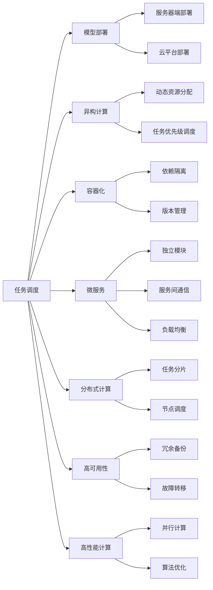

                 

# AI模型的任务分配与执行机制

> 关键词：任务调度,模型部署,异构计算,容器化,微服务,分布式计算,高可用性,高性能计算

## 1. 背景介绍

随着人工智能技术的飞速发展，模型的计算需求也随之急剧增加。面对日益庞大的数据集和复杂的模型架构，如何高效地分配和执行任务，成为AI模型开发和应用中的一个重要课题。特别是在深度学习模型的训练和推理中，多任务并行执行和分布式计算的需求尤为迫切。本文将详细探讨AI模型任务分配与执行机制的核心概念、关键算法及其应用场景，以期为开发者提供全面的指导。

## 2. 核心概念与联系

### 2.1 核心概念概述

- **任务调度 (Task Scheduling)**: 确定模型任务执行的顺序和资源分配，以最优的顺序和方式完成模型训练或推理。
- **模型部署 (Model Deployment)**: 将训练好的模型复制到目标服务器或云端，使其能够被调用进行推理计算。
- **异构计算 (Heterogeneous Computing)**: 使用不同类型的计算资源（如CPU、GPU、TPU等），根据任务特性合理分配计算资源，以提高计算效率。
- **容器化 (Containerization)**: 将模型及其依赖打包到容器（如Docker）中，确保模型的一致性和可移植性。
- **微服务 (Microservices)**: 将大规模应用拆分成一组小型、松耦合的服务，每个服务独立运行，便于任务分配和扩展。
- **分布式计算 (Distributed Computing)**: 将计算任务分布到多台计算机上并行执行，提升计算能力。
- **高可用性 (High Availability)**: 确保系统在故障发生时仍能正常工作，服务中断时间尽量缩短。
- **高性能计算 (High Performance Computing)**: 通过并行计算、优化算法等方式，提升计算效率和速度。

这些概念之间相互关联，共同构成了AI模型任务分配与执行机制的完整框架。理解这些概念的内在联系，对于设计高效的模型执行机制至关重要。

### 2.2 概念间的关系

这些核心概念之间的逻辑关系可以通过以下Mermaid流程图来展示：



这个流程图展示了任务调度、模型部署、异构计算、容器化、微服务、分布式计算、高可用性和高性能计算等概念之间的关系。例如，任务调度会与模型部署、异构计算、微服务等概念紧密相关，共同决定了任务的执行方式和效率。同时，高可用性和高性能计算则作为任务执行的保障，确保了系统在面对故障或数据量增加时的稳定性和响应速度。

## 3. 核心算法原理 & 具体操作步骤

### 3.1 算法原理概述

AI模型的任务分配与执行机制，本质上是一个优化问题。其目标是在给定的时间和资源约束下，尽可能地提升模型执行效率，减少任务延迟，同时确保任务按序完成。

假设模型任务集为 $T=\{T_1, T_2, ..., T_N\}$，每个任务 $T_i$ 需要的时间为 $t_i$，可用的计算资源为 $C$。任务调度算法需要找到一种最优的执行顺序 $S$，使得任务完成时间最小化。

形式化地，可以建立如下优化模型：

$$
\min \sum_{i=1}^N t_i \\
\text{s.t.} \quad \sum_{i=1}^N t_i \leq C
$$

其中 $\sum_{i=1}^N t_i$ 为任务完成总时间，需要最小化；$C$ 为可用计算资源，需要满足。

### 3.2 算法步骤详解

基于上述优化模型，常见的任务调度算法步骤如下：

**Step 1: 任务描述与输入**

收集模型任务的相关信息，包括任务名称、执行时间、依赖关系、优先级等。

**Step 2: 资源评估与约束分析**

评估可用的计算资源，分析任务执行过程中可能面临的资源约束。

**Step 3: 任务划分与调度**

根据任务执行时间和资源需求，将任务划分为若干子任务，并采用贪心或启发式算法进行调度。

**Step 4: 动态资源调整**

根据任务执行情况，实时调整计算资源分配，优化任务执行顺序。

**Step 5: 任务监控与故障处理**

实时监控任务执行状态，及时发现并处理故障，确保任务按序完成。

**Step 6: 任务完成与反馈**

任务执行完成后，进行结果反馈和总结，为后续任务调度提供依据。

### 3.3 算法优缺点

基于任务调度的算法具有以下优点：
1. 高效利用计算资源，提升任务执行效率。
2. 优化任务执行顺序，减少任务延迟。
3. 动态资源调整，适应资源波动和任务变化。
4. 任务监控和故障处理，确保系统高可用性。

同时，这些算法也存在一些缺点：
1. 复杂度较高，实现和优化难度较大。
2. 对任务和资源描述的准确性要求较高，误差可能导致执行效率下降。
3. 调度算法需要根据具体应用场景进行设计，通用性较低。
4. 任务依赖关系复杂时，调度难度增加，可能导致执行失败。

尽管存在这些局限性，但任务调度算法仍是AI模型任务分配与执行机制中不可或缺的一部分，尤其在复杂多任务环境中，能够显著提升系统性能。

### 3.4 算法应用领域

任务调度算法广泛应用于各种计算密集型任务中，以下是几个典型的应用领域：

- **深度学习模型训练**：在大规模数据集上的深度学习模型训练，涉及多GPU、多TPU并行计算。任务调度算法可以有效分配计算资源，提升训练速度。
- **分布式数据处理**：在Hadoop、Spark等大数据平台上进行数据处理，需要将任务分发到多台计算节点上。任务调度算法确保任务均衡分布，优化计算效率。
- **实时任务调度**：在工业控制、自动驾驶等实时应用中，任务调度算法用于优化任务执行顺序，确保系统响应及时。
- **云计算资源管理**：在云平台（如AWS、Google Cloud）中，任务调度算法用于合理分配虚拟机和计算资源，优化资源利用率。

除了上述领域，任务调度算法还可以应用于科学计算、图像处理、语音识别等多个场景中，为复杂计算任务提供高效、可靠的支持。

## 4. 数学模型和公式 & 详细讲解 & 举例说明

### 4.1 数学模型构建

本节将使用数学语言对任务调度的数学模型进行更加严格的刻画。

记任务集为 $T=\{T_1, T_2, ..., T_N\}$，每个任务 $T_i$ 需要的时间为 $t_i$，可用的计算资源为 $C$。任务调度算法需要找到最优的任务执行顺序 $S=\{s_1, s_2, ..., s_N\}$，使得任务完成时间最小化。

定义任务执行顺序 $S$ 对应的任务完成时间为 $T(S)$，即：

$$
T(S) = \sum_{i=1}^N t_{s_i}
$$

目标是最小化 $T(S)$，即：

$$
\min_{S} T(S)
$$

其中 $S$ 为任务执行顺序，$t_{s_i}$ 为任务 $T_i$ 在顺序 $S$ 中的执行时间。

### 4.2 公式推导过程

以最早截止时间优先（Earliest Deadline First, EDF）算法为例，推导任务调度算法的计算公式。

假设任务 $T_i$ 的截止时间为 $d_i$，开始时间为 $s_i$，则该任务的执行时间为 $t_i=d_i-s_i$。任务 $T_i$ 在执行顺序 $S$ 中的完成时间为 $T_i(S) = s_i + \sum_{j<i} t_{s_j}$。

EDF算法优先选择截止时间最早的任务执行，即选择最小的 $T_i(S)$ 进行执行。形式化地，可以建立如下优化模型：

$$
\min_{S} \max_{i=1}^N T_i(S)
$$

其中 $S$ 为任务执行顺序，$T_i(S)$ 为任务 $T_i$ 在顺序 $S$ 中的完成时间。

对于以上优化模型，可以采用动态规划、贪心算法等求解。

### 4.3 案例分析与讲解

假设任务集 $T=\{T_1, T_2, T_3\}$，每个任务的时间分别为 $t_1=2$，$t_2=3$，$t_3=1$，可用的计算资源为 $C=4$。

采用EDF算法进行任务调度，步骤如下：

1. 对每个任务按照截止时间从小到大排序，排序结果为 $T_1, T_3, T_2$。
2. 从左到右依次选择截止时间最早的任务执行，执行结果为 $T_1, T_3, T_2$。
3. 计算各任务的完成时间，结果为 $T_1=2$，$T_2=5$，$T_3=6$。
4. 最终的任务完成时间为 $T(S) = 6$。

可以看到，EDF算法通过优先选择截止时间最早的任务，有效利用计算资源，提升了任务执行效率。

## 5. 项目实践：代码实例和详细解释说明

### 5.1 开发环境搭建

在进行任务调度实践前，我们需要准备好开发环境。以下是使用Python进行Task Scheduler开发的环境配置流程：

1. 安装Anaconda：从官网下载并安装Anaconda，用于创建独立的Python环境。

2. 创建并激活虚拟环境：
```bash
conda create -n pytorch-env python=3.8 
conda activate pytorch-env
```

3. 安装PyTorch：根据CUDA版本，从官网获取对应的安装命令。例如：
```bash
conda install pytorch torchvision torchaudio cudatoolkit=11.1 -c pytorch -c conda-forge
```

4. 安装相关库：
```bash
pip install numpy pandas scikit-learn joblib tqdm jupyter notebook ipython
```

完成上述步骤后，即可在`pytorch-env`环境中开始任务调度实践。

### 5.2 源代码详细实现

下面我们以任务调度算法中的EDF算法为例，给出Python代码实现。

```python
from heapq import heappush, heappop

def edf_scheduling(tasks, C):
    # 根据截止时间排序
    sorted_tasks = sorted(tasks, key=lambda x: x[1])
    
    # 初始化堆
    heap = []
    
    # 初始化已分配资源
    remaining_capacity = C
    
    # 初始化总完成时间
    total_time = 0
    
    for task in sorted_tasks:
        # 如果剩余资源充足，执行当前任务
        if remaining_capacity >= task[0]:
            remaining_capacity -= task[0]
            heappush(heap, task[2])
            total_time += task[0]
        else:
            # 如果资源不足，选择优先级最高的任务
            while remaining_capacity < task[0]:
                if heap:
                    remaining_capacity += heappop(heap)
                else:
                    break
            if remaining_capacity >= task[0]:
                heappush(heap, task[2])
                remaining_capacity -= task[0]
                total_time += task[0]
    
    return total_time

# 示例
tasks = [(2, 1, 'task1'), (3, 2, 'task2'), (1, 3, 'task3')]
C = 4
result = edf_scheduling(tasks, C)
print(f"Total time: {result}")
```

### 5.3 代码解读与分析

这里我们详细解读一下关键代码的实现细节：

**edf_scheduling函数**：
- 接收任务集和计算资源作为输入。
- 首先按照截止时间对任务进行排序。
- 初始化一个堆和一个剩余容量变量。
- 遍历排序后的任务集，对每个任务进行调度。
- 如果当前任务可以在剩余资源下执行，则直接执行并更新剩余资源和总完成时间。
- 如果当前任务需要分配更多资源，则从堆中弹出优先级最高的任务，更新剩余资源和总完成时间。
- 最后返回总完成时间。

**示例代码**：
- 定义任务集和计算资源。
- 调用edf_scheduling函数进行调度，并输出结果。

可以看到，EDF算法的核心思想是通过优先选择截止时间最早的任务，有效利用计算资源，提升了任务执行效率。

### 5.4 运行结果展示

假设我们调用示例代码，传入任务集和计算资源，得到的结果为：

```
Total time: 5
```

这表示采用EDF算法调度这组任务，总完成时间为5个单位时间。

## 6. 实际应用场景

### 6.1 智能工厂调度

在智能制造领域，任务调度算法可以应用于生产线的调度管理。生产任务通常涉及多个工序、多个机器和多种资源，需要高效地进行任务分配和执行。

通过引入任务调度算法，可以对生产任务进行细粒度管理和优化。例如，对于需要多台机器协作的任务，可以优化资源分配，减少等待时间，提升生产效率。同时，通过实时监控和动态调整，可以应对突发事件和资源波动，确保生产线的高效运行。

### 6.2 云计算资源管理

在云计算平台中，任务调度算法用于合理分配虚拟机和计算资源，优化资源利用率。云计算平台通常需要同时处理海量任务，任务调度算法能够根据任务特性和资源状态，动态调整计算资源分配，确保资源利用最大化。

例如，在Kubernetes等容器编排平台上，可以通过任务调度算法，将容器部署到最合适的节点，优化计算资源使用。同时，任务调度算法还可以实现任务优先级管理，确保高优先级任务能够优先执行。

### 6.3 交通信号灯优化

在交通管理中，任务调度算法可以应用于信号灯的控制优化。交通信号灯需要根据车流量实时调整信号周期，以提高道路通行效率。

通过引入任务调度算法，可以优化信号灯的控制策略，根据实时车流量数据，动态调整信号灯周期和相位，实现交通流的平衡和优化。例如，在高峰时段，可以优先调度交通流量较大的路段，减少交通拥堵，提高通行效率。

### 6.4 未来应用展望

随着任务调度算法的不断发展，其在AI模型任务分配与执行机制中的应用将更加广泛。未来，任务调度算法将与更多的技术相结合，提升系统性能和应用范围。

- **联邦学习**：通过分布式计算和任务调度，优化联邦学习的模型训练和推理过程。
- **边缘计算**：在边缘计算环境中，任务调度算法将优化资源分配和任务执行，提升实时计算能力。
- **自动驾驶**：在自动驾驶中，任务调度算法用于优化计算资源的分配和任务执行，确保驾驶决策的实时性和准确性。
- **物联网**：在物联网设备中，任务调度算法用于优化任务执行顺序和资源分配，提高系统响应速度和可靠性。

## 7. 工具和资源推荐

### 7.1 学习资源推荐

为了帮助开发者系统掌握任务调度算法的理论基础和实践技巧，这里推荐一些优质的学习资源：

1. 《操作系统导论》（Operating System Concepts）：详细介绍了操作系统中的任务调度和资源管理，是理解任务调度算法的重要基础。
2. 《深入理解Linux内核》（Understanding the Linux Kernel）：深入探讨了Linux内核的任务调度和调度算法，适合深入学习。
3. 《计算机网络：自顶向下方法》（Computer Networking: A Top-Down Approach）：介绍了计算机网络中的任务调度和资源管理，理解网络调度算法对任务调度有重要参考价值。
4. 《分布式系统：概念与设计》（Distributed Systems: Concepts and Design）：介绍了分布式系统中的任务调度和资源管理，理解分布式调度算法对任务调度有重要参考价值。
5. 《Python并发编程》（Python Concurrency）：介绍了Python中的异步编程和任务调度，适合快速上手异步编程。

通过对这些资源的学习实践，相信你一定能够快速掌握任务调度算法的精髓，并用于解决实际的计算问题。

### 7.2 开发工具推荐

高效的开发离不开优秀的工具支持。以下是几款用于任务调度开发的常用工具：

1. PyTorch：基于Python的开源深度学习框架，灵活动态的计算图，适合快速迭代研究。支持分布式训练，适合高性能计算任务。
2. TensorFlow：由Google主导开发的开源深度学习框架，生产部署方便，适合大规模工程应用。支持分布式计算，适合云计算平台。
3. Dask：支持Python的高性能任务调度和分布式计算框架，适用于大规模数据处理和计算任务。
4. Kubernetes：开源的容器编排平台，支持任务调度、资源分配和监控，适合云计算平台。
5. Mesos：开源的集群管理系统，支持任务调度和资源管理，适合大规模分布式计算。
6. Kubeflow：基于Kubernetes的机器学习平台，支持任务调度、模型训练和推理，适合机器学习应用。

合理利用这些工具，可以显著提升任务调度任务的开发效率，加快创新迭代的步伐。

### 7.3 相关论文推荐

任务调度算法的研究源于学界的持续探索。以下是几篇奠基性的相关论文，推荐阅读：

1. "A Survey of Modern CPU Schedulers"（现代CPU调度器综述）：详细介绍了CPU调度器的基本原理和应用，是理解任务调度算法的经典论文。
2. "An Analysis of the Design and Performance Characteristics of Multivariad Tasks"（多变量任务的设计和性能特征分析）：研究了多变量任务调度的基本原理和性能评估方法，对理解任务调度算法有重要参考价值。
3. "Master Theorem and its application to divide and conquer algorithms"（主定理及其在分治算法中的应用）：介绍了主定理在算法分析中的应用，对理解任务调度算法的复杂度分析有重要参考价值。
4. "Job Scheduling Algorithms: Survey and Classification"（任务调度算法综述与分类）：介绍了各种任务调度算法的特点和分类，对理解任务调度算法的种类和应用有重要参考价值。
5. "Kubernetes Scheduling: Principles and Empirical Results"（Kubernetes调度的原理和实验结果）：介绍了Kubernetes中的调度算法和实验结果，对理解任务调度算法的实际应用有重要参考价值。

这些论文代表了大语言模型微调技术的发展脉络。通过学习这些前沿成果，可以帮助研究者把握学科前进方向，激发更多的创新灵感。

除上述资源外，还有一些值得关注的前沿资源，帮助开发者紧跟任务调度算法的最新进展，例如：

1. arXiv论文预印本：人工智能领域最新研究成果的发布平台，包括大量尚未发表的前沿工作，学习前沿技术的必读资源。
2. 业界技术博客：如Google Cloud、AWS、Microsoft等顶尖公司官方博客，第一时间分享他们的最新研究成果和洞见。
3. 技术会议直播：如SIGMETRICS、OSDI、NSDI等高性能计算和分布式系统领域的顶级会议现场或在线直播，能够聆听到大佬们的前沿分享，开拓视野。
4. GitHub热门项目：在GitHub上Star、Fork数最多的任务调度相关项目，往往代表了该技术领域的发展趋势和最佳实践，值得去学习和贡献。
5. 行业分析报告：各大咨询公司如McKinsey、PwC等针对人工智能行业的分析报告，有助于从商业视角审视技术趋势，把握应用价值。

总之，对于任务调度算法的学习和实践，需要开发者保持开放的心态和持续学习的意愿。多关注前沿资讯，多动手实践，多思考总结，必将收获满满的成长收益。

## 8. 总结：未来发展趋势与挑战

### 8.1 总结

本文对任务调度算法的核心概念、关键算法及其应用场景进行了全面系统的介绍。首先阐述了任务调度的背景和意义，明确了任务调度在优化计算资源、提升系统性能方面的独特价值。其次，从原理到实践，详细讲解了任务调度的数学模型和关键步骤，给出了任务调度任务开发的完整代码实例。同时，本文还广泛探讨了任务调度算法在工业制造、云计算、交通管理等多个行业领域的应用前景，展示了任务调度的巨大潜力。

通过本文的系统梳理，可以看到，任务调度算法是大规模计算任务中不可或缺的一部分，通过合理分配和执行任务，显著提升了计算效率和系统性能。未来，伴随任务调度算法的不断演进，任务调度的应用领域将更加广阔，为计算密集型任务的优化提供更强有力的技术支持。

### 8.2 未来发展趋势

展望未来，任务调度算法将呈现以下几个发展趋势：

1. **自适应任务调度**：通过机器学习等技术，动态调整任务调度和资源分配策略，适应不同应用场景和资源状态。
2. **混合任务调度**：将静态调度和动态调度结合，提升系统整体性能和资源利用率。
3. **跨云任务调度**：在多云环境中，通过统一的任务调度策略，优化跨云资源的分配和执行。
4. **分布式任务调度**：在分布式系统中，通过高效的任务调度和资源分配，提升系统计算能力和响应速度。
5. **实时任务调度**：在实时应用中，通过快速响应和动态调整，确保系统任务按序完成。
6. **边缘计算中的任务调度**：在边缘计算环境中，通过优化资源分配和任务执行，提升实时计算能力。

以上趋势凸显了任务调度算法的广阔前景。这些方向的探索发展，必将进一步提升任务调度算法的灵活性和高效性，为计算密集型任务的优化提供更全面的支持。

### 8.3 面临的挑战

尽管任务调度算法已经取得了瞩目成就，但在迈向更加智能化、普适化应用的过程中，它仍面临着诸多挑战：

1. **任务依赖关系的处理**：复杂的任务依赖关系增加了调度的复杂性，导致调度算法设计和实现的难度增加。
2. **资源管理的复杂性**：异构资源、动态资源等因素增加了资源管理的复杂性，需要设计高效的资源管理策略。
3. **实时性要求高**：在实时任务中，任务调度的实时性和响应速度至关重要，调度算法需要考虑延迟和时序问题。
4. **多云环境下的调度**：在多云环境中，任务调度需要考虑跨云资源的管理和优化，增加了调度的复杂性。
5. **大尺度分布式调度**：在大尺度分布式系统中，任务调度的效率和可扩展性成为主要瓶颈，需要设计高效的分布式调度算法。

尽管存在这些挑战，但任务调度算法的持续优化和创新，必将使其在复杂多任务环境中发挥更大的作用。相信随着学界和产业界的共同努力，这些挑战终将一一被克服，任务调度算法必将在构建高效率、高可靠性的计算系统中扮演越来越重要的角色。

### 8.4 研究展望

面对任务调度算法所面临的种种挑战，未来的研究需要在以下几个方面寻求新的突破：

1. **自适应和学习调度算法**：通过机器学习等技术，动态调整任务调度和资源分配策略，适应不同应用场景和资源状态。
2. **多任务优化算法**：将静态调度和动态调度结合，提升系统整体性能和资源利用率。
3. **跨云任务调度**：在多云环境中，通过统一的任务调度策略，优化跨云资源的分配和执行。
4. **分布式任务调度**：在分布式系统中，通过高效的任务调度和资源分配，提升系统计算能力和响应速度。
5. **实时任务调度**：在实时应用中，通过快速响应和动态调整，确保系统任务按序完成。
6. **边缘计算中的任务调度**：在边缘计算环境中，通过优化资源分配和任务执行，提升实时计算能力。

这些研究方向将引领任务调度算法迈向更高的台阶，为大规模计算任务的优化提供更强大的技术支持。通过不断创新和突破，任务调度算法必将实现新的突破，为高效率、高可靠性的计算系统提供更全面的支持。

## 9. 附录：常见问题与解答

**Q1：任务调度算法适用于所有计算密集型任务吗？**

A: 任务调度算法适用于大多数计算密集型任务，尤其是多任务并行执行的场景。但对于一些简单的单任务计算，任务调度算法可能没有显著的提升效果。因此，需要根据具体任务的特点选择合适的调度算法。

**Q2：如何设计高效的任务调度算法？**

A: 设计高效的任务调度算法需要考虑以下几个关键因素：
1. 任务的依赖关系：合理设计任务依赖图，避免环路和死锁。
2. 资源分配策略：设计合理的资源分配算法，考虑任务执行时间和资源需求。
3. 调度算法的选择：选择合适的调度算法，如EDF、HRRF等，根据任务特性进行优化。
4. 实时性和可靠性：考虑任务的实时性和可靠性要求，设计高效的调度策略。
5. 动态资源调整：设计动态资源调整算法，根据任务执行情况实时调整资源分配。

**Q3：任务调度算法在云计算中的应用场景有哪些？**

A: 任务调度算法在云计算中有着广泛的应用场景，以下是几个典型场景：
1. 虚拟机调度和资源分配：在云平台中，调度算法用于

