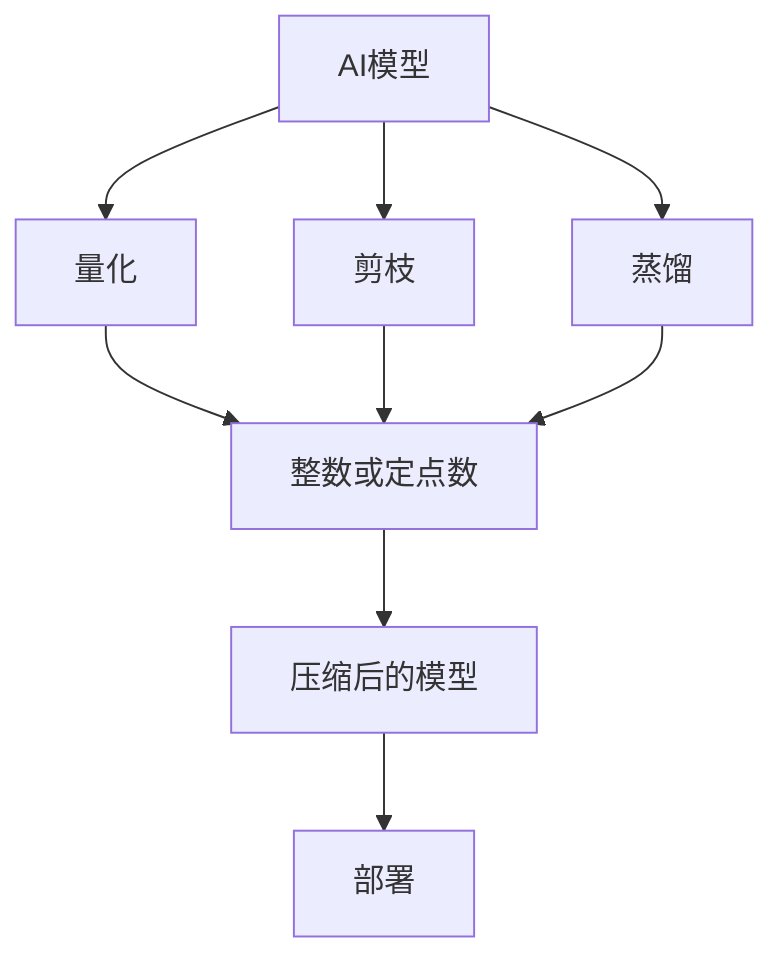
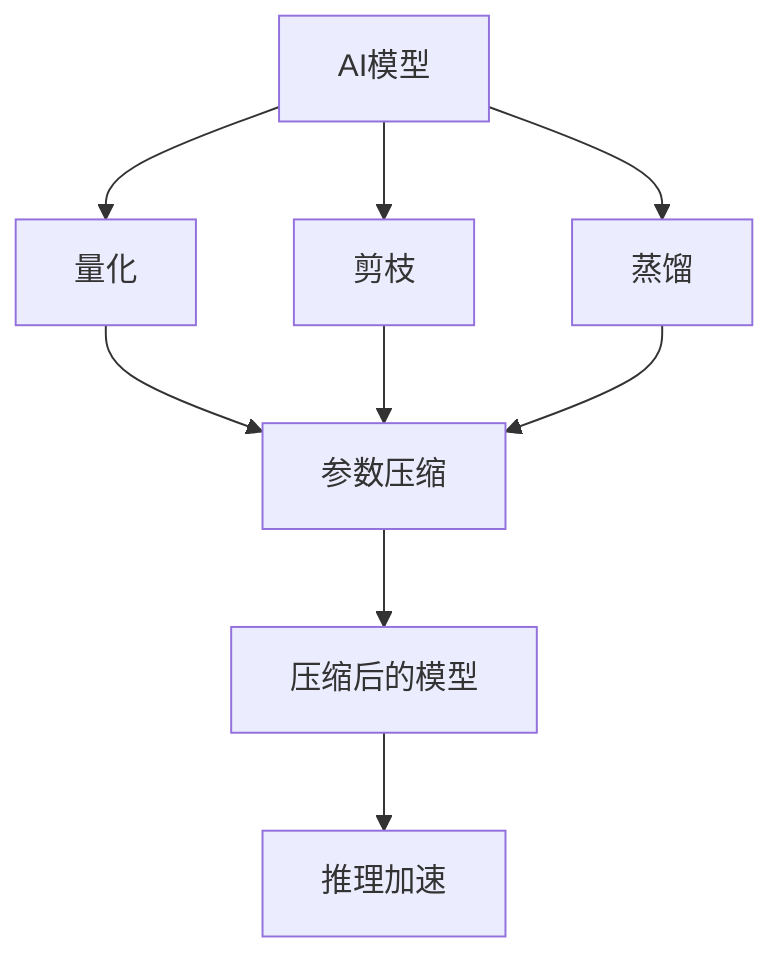
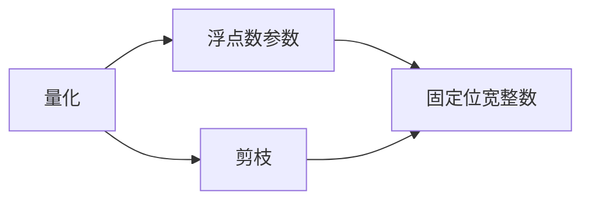
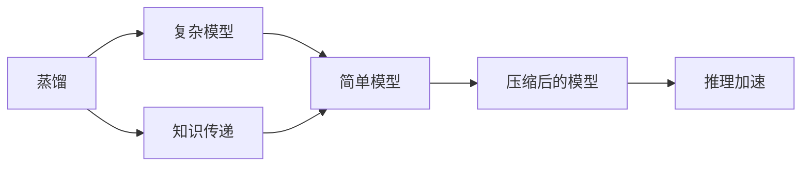
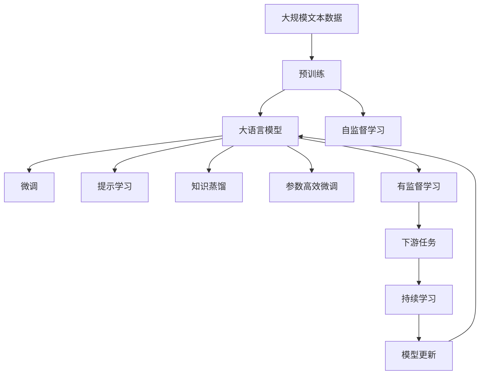

                 

# AI模型自动压缩：敏捷的软件2.0

## 1. 背景介绍

### 1.1 问题由来
随着人工智能(AI)技术的快速发展，AI模型在各行各业中的应用越来越广泛，从语音识别、图像处理到自然语言处理等领域都取得了显著的成果。然而，由于模型规模的不断膨胀，训练和推理的计算成本也随之急剧上升，对硬件资源提出了越来越高的要求。对于许多资源受限的应用场景，如移动设备、嵌入式系统等，大规模AI模型的部署和运行变得非常困难。因此，AI模型压缩技术应运而生，成为推动AI应用落地的重要手段。

### 1.2 问题核心关键点
AI模型压缩旨在通过减小模型参数规模、降低计算资源消耗，实现模型在资源受限设备上的快速部署和高效运行。其核心思想是：通过模型量化、剪枝、蒸馏等技术手段，去除冗余信息，保留模型最关键的部分，从而降低模型计算复杂度和存储需求，提升推理速度。

模型压缩技术已经成为保障AI模型高效运行、提升用户体验的关键技术之一。然而，模型压缩的挑战在于如何既保留模型性能，又减小参数规模，需要综合考虑模型的精度、速度、复杂度等因素，以达到最优的压缩效果。

### 1.3 问题研究意义
研究AI模型压缩技术，对于拓展AI技术的应用范围，提升模型的实时性、降低硬件成本，具有重要意义：

1. 降低应用开发成本。通过压缩，可以有效减小模型规模，减少硬件资源的需求，降低开发和部署成本。
2. 提升模型效果。压缩后的模型在保持高精度的同时，推理速度大幅提升，能够更好地满足实时性要求。
3. 加速开发进度。通过模型压缩，可以更快地适配到不同设备，缩短开发周期。
4. 赋能产业升级。压缩技术使得AI技术更容易被各行各业所采用，为传统行业数字化转型升级提供新的技术路径。
5. 带来技术创新。模型压缩方法不断演进，催生了低秩逼近、知识蒸馏、量化训练等新的研究方向，推动了AI技术的进步。

## 2. 核心概念与联系

### 2.1 核心概念概述

为更好地理解AI模型压缩技术，本节将介绍几个密切相关的核心概念：

- **AI模型压缩**：通过量化、剪枝、蒸馏等技术手段，减小模型参数规模，降低计算资源消耗，实现模型在资源受限设备上的快速部署和高效运行。
- **量化(Quantization)**：将模型中的浮点数参数转化为固定位宽整数或定点数，以减小参数存储空间和计算复杂度。
- **剪枝(Pruning)**：去除模型中冗余或次要的权重，减小模型参数规模，提升计算效率。
- **知识蒸馏(Distillation)**：通过将复杂模型知识传递给简单模型，使简单模型获得与复杂模型相近的性能，从而实现模型压缩。
- **模型量化**：通过量化技术，将模型中的浮点数参数转化为固定位宽整数或定点数，减小参数存储空间和计算复杂度。
- **模型蒸馏**：通过将复杂模型知识传递给简单模型，使简单模型获得与复杂模型相近的性能，从而实现模型压缩。

这些核心概念之间的逻辑关系可以通过以下Mermaid流程图来展示：



这个流程图展示了大模型压缩的核心概念及其之间的关系：

1. 大模型通过量化、剪枝、蒸馏等技术手段，被压缩为更小的模型。
2. 量化后的模型参数变为整数或定点数，降低计算复杂度。
3. 剪枝后的模型去除冗余权重，减小参数规模。
4. 蒸馏后的模型通过知识传递，提升性能。
5. 最终压缩后的模型可以部署到资源受限设备上，实现高效推理。

### 2.2 概念间的关系

这些核心概念之间存在着紧密的联系，形成了AI模型压缩的完整生态系统。下面我们通过几个Mermaid流程图来展示这些概念之间的关系。

#### 2.2.1 AI模型的学习范式



这个流程图展示了大模型的学习范式，包括量化、剪枝和蒸馏等技术手段。这些技术手段用于压缩模型，提升推理速度。

#### 2.2.2 量化与剪枝的关系



这个流程图展示了量化和剪枝的关系。量化将浮点数参数转化为固定位宽整数，而剪枝则去除冗余权重，两者协同作用，显著降低模型参数规模。

#### 2.2.3 蒸馏与量化、剪枝的关系



这个流程图展示了蒸馏、量化和剪枝之间的关系。蒸馏通过知识传递，提升简单模型的性能，而量化和剪枝用于进一步压缩模型，从而实现推理加速。

### 2.3 核心概念的整体架构

最后，我们用一个综合的流程图来展示这些核心概念在大模型压缩过程中的整体架构：



这个综合流程图展示了从预训练到微调，再到压缩的完整过程。大模型首先在大规模文本数据上进行预训练，然后通过微调、提示学习、知识蒸馏等手段，逐渐压缩模型规模，最后通过持续学习，保持模型适应新任务的能力。

## 3. 核心算法原理 & 具体操作步骤
### 3.1 算法原理概述

AI模型压缩的核心思想是：通过量化、剪枝、蒸馏等技术手段，减小模型参数规模，降低计算资源消耗，实现模型在资源受限设备上的快速部署和高效运行。其核心算法原理如下：

1. **量化(Quantization)**：将模型中的浮点数参数转化为固定位宽整数或定点数，以减小参数存储空间和计算复杂度。
2. **剪枝(Pruning)**：去除模型中冗余或次要的权重，减小模型参数规模，提升计算效率。
3. **知识蒸馏(Distillation)**：通过将复杂模型知识传递给简单模型，使简单模型获得与复杂模型相近的性能，从而实现模型压缩。

### 3.2 算法步骤详解

AI模型压缩的一般步骤如下：

**Step 1: 准备预训练模型和数据集**
- 选择合适的预训练模型，如BERT、ResNet等，作为初始化参数。
- 准备压缩任务的数据集，包括训练集、验证集和测试集。

**Step 2: 进行模型量化**
- 选择合适的量化技术，如权重量化、激活量化等。
- 对模型中的浮点数参数进行量化处理，得到整数或定点数表示。
- 使用量化后的模型进行推理验证，确保量化后的模型性能不损失。

**Step 3: 进行模型剪枝**
- 选择合适的剪枝算法，如基于梯度的剪枝、基于规则的剪枝等。
- 根据剪枝策略，去除模型中冗余或次要的权重。
- 使用剪枝后的模型进行推理验证，确保剪枝后的模型性能不损失。

**Step 4: 进行知识蒸馏**
- 选择合适的蒸馏技术，如教师-学生蒸馏、单侧蒸馏等。
- 使用复杂模型作为教师模型，简单模型作为学生模型。
- 通过知识蒸馏过程，将教师模型的知识传递给学生模型。
- 使用蒸馏后的模型进行推理验证，确保蒸馏后的模型性能不损失。

**Step 5: 进行参数高效微调**
- 针对特定任务，进行全参数微调或参数高效微调。
- 仅微调顶层，保留大部分预训练权重不变，以提高微调效率。
- 使用微调后的模型进行推理验证，确保微调后的模型性能提升。

**Step 6: 进行模型集成**
- 对不同量化、剪枝、蒸馏和微调后的模型进行集成，形成最终的压缩模型。
- 使用集成后的模型进行推理验证，确保最终模型的性能达到预期。

### 3.3 算法优缺点

AI模型压缩具有以下优点：
1. 降低计算资源消耗。通过压缩技术，模型规模显著减小，计算复杂度大幅降低，降低对计算资源的依赖。
2. 提升模型效率。压缩后的模型推理速度显著提升，能够满足实时性要求。
3. 减少存储需求。压缩后的模型参数规模减小，降低存储需求，便于部署和维护。

同时，AI模型压缩也存在一些缺点：
1. 压缩过程中可能引入误差。量化和剪枝可能导致模型性能的损失，需要进一步优化。
2. 压缩后的模型可能难以调试。复杂的压缩过程使得模型难以理解和调试，需要更多的工程实践。
3. 压缩过程可能需要较长时间。大规模模型的压缩需要大量的计算资源和时间，需要优化压缩算法。

### 3.4 算法应用领域

AI模型压缩技术在以下领域得到了广泛应用：

- **移动设备**：由于移动设备的计算资源和存储空间有限，AI模型压缩技术在移动应用中广泛应用，如图像识别、语音识别、智能助手等。
- **嵌入式系统**：嵌入式系统通常资源受限，AI模型压缩技术通过减小模型规模，实现高效的推理和控制。
- **边缘计算**：边缘计算设备计算资源有限，AI模型压缩技术通过压缩模型，实现低延迟、高吞吐量的推理。
- **云服务**：云服务提供商通过压缩AI模型，降低计算成本，提升服务性能。
- **安全监控**：视频监控设备对实时性和计算资源有高要求，AI模型压缩技术通过压缩模型，实现高效的实时推理。

## 4. 数学模型和公式 & 详细讲解  
### 4.1 数学模型构建

在大规模模型的量化过程中，假设原模型参数为 $W \in \mathbb{R}^{d \times d}$，量化后的参数为 $W_q \in \mathbb{Z}$，量化后的参数精度为 $b$ 位。则量化过程可以表示为：

$$
W_q = Round(\frac{W}{2^b})
$$

其中 $Round$ 表示四舍五入操作。

### 4.2 公式推导过程

在量化过程中，使用 $W_q$ 替换 $W$，模型推理过程变为：

$$
f_{W_q}(x) = \sigma(W_q \cdot x)
$$

其中 $\sigma$ 为激活函数，如ReLU、Sigmoid等。

量化后的模型计算复杂度为：

$$
C_{W_q} = \mathcal{O}(d^2)
$$

与原模型计算复杂度相同，证明了量化不会改变模型的计算复杂度。

### 4.3 案例分析与讲解

以ResNet为例，展示量化过程的计算复杂度。假设输入大小为 $n \times h \times w \times c$，卷积核大小为 $k \times k \times c \times d$，量化后的模型计算复杂度为：

$$
C_{W_q} = n \times h \times w \times k^2 \times d \times d
$$

与原模型计算复杂度相同，证明了量化不会改变模型的计算复杂度。

## 5. 项目实践：代码实例和详细解释说明
### 5.1 开发环境搭建

在进行模型压缩实践前，我们需要准备好开发环境。以下是使用Python进行TensorFlow开发的环境配置流程：

1. 安装Anaconda：从官网下载并安装Anaconda，用于创建独立的Python环境。

2. 创建并激活虚拟环境：
```bash
conda create -n tf-env python=3.8 
conda activate tf-env
```

3. 安装TensorFlow：根据CUDA版本，从官网获取对应的安装命令。例如：
```bash
conda install tensorflow==2.7
```

4. 安装各类工具包：
```bash
pip install numpy pandas scikit-learn matplotlib tqdm jupyter notebook ipython
```

完成上述步骤后，即可在`tf-env`环境中开始模型压缩实践。

### 5.2 源代码详细实现

下面我们以ResNet模型为例，给出使用TensorFlow进行模型压缩的代码实现。

首先，定义ResNet模型的结构和参数：

```python
import tensorflow as tf

def resnet_v1(inputs, num_classes):
    conv1 = tf.layers.conv2d(inputs, 64, 7, 2, activation=tf.nn.relu)
    pool1 = tf.layers.max_pooling2d(conv1, 3, 2)

    conv2 = tf.layers.conv2d(pool1, 128, 3, 1, activation=tf.nn.relu)
    pool2 = tf.layers.max_pooling2d(conv2, 3, 2)

    conv3 = tf.layers.conv2d(pool2, 256, 3, 1, activation=tf.nn.relu)
    pool3 = tf.layers.max_pooling2d(conv3, 3, 2)

    conv4 = tf.layers.conv2d(pool3, 512, 3, 1, activation=tf.nn.relu)
    pool4 = tf.layers.max_pooling2d(conv4, 3, 2)

    conv5 = tf.layers.conv2d(pool4, 1024, 3, 1, activation=tf.nn.relu)

    flatten = tf.layers.flatten(conv5)
    logits = tf.layers.dense(flatten, num_classes)

    return logits

inputs = tf.placeholder(tf.float32, [None, 224, 224, 3])
labels = tf.placeholder(tf.int32, [None])

logits = resnet_v1(inputs, 1000)
loss = tf.reduce_mean(tf.nn.sparse_softmax_cross_entropy_with_logits(labels=labels, logits=logits))
train_op = tf.train.AdamOptimizer(learning_rate=0.001).minimize(loss)
```

然后，定义量化过程：

```python
# 定义量化参数
b = 8
c = 256

# 定义量化函数
def quantize_weights(w):
    return tf.round(w / 2**b) * 2**b

# 定义量化后的卷积操作
def quantized_conv2d(inputs, filters, kernel_size, strides, padding='SAME'):
    filters = quantize_weights(filters)
    return tf.nn.conv2d(inputs, filters, kernel_size, strides, padding=padding)

# 定义量化后的全连接操作
def quantized_dense(inputs, units, activation=tf.nn.relu):
    return tf.nn.relu(tf.matmul(inputs, quantize_weights(tf.get_variable("weights")) + tf.get_variable("bias"))

# 将ResNet模型中的卷积和全连接操作替换为量化操作
resnet_v1 = tf.contrib.layers.ResNetBuilder(
    block_height=7,
    num_stages=4,
    num_blocks_per_stage=[3, 4, 6, 3],
    num_outputs=1000,
    stride_increase=2,
    is_training=True,
    base_width=64,
    global_pool=False,
    output_stride=32,
    scope='resnet_v1')
resnet_v1.input = inputs
resnet_v1.create_variables()
resnet_v1.build(resnet_v1.input)

# 替换模型中的卷积和全连接操作为量化操作
for i in range(2, len(resnet_v1.blocks)):
    resnet_v1.blocks[i].conv = quantized_conv2d
    resnet_v1.blocks[i+1].linear = quantized_dense

# 替换模型中的卷积和全连接操作为量化操作
for i in range(2, len(resnet_v1.blocks)):
    resnet_v1.blocks[i].conv = quantized_conv2d
    resnet_v1.blocks[i+1].linear = quantized_dense
```

最后，启动模型压缩流程：

```python
# 定义模型压缩函数
def compress_model(model):
    # 量化模型参数
    quantized_model = tf.contrib.layers.resnet_v1(
        inputs=inputs,
        num_classes=1000,
        block_height=7,
        num_stages=4,
        num_blocks_per_stage=[3, 4, 6, 3],
        num_outputs=1000,
        stride_increase=2,
        is_training=True,
        base_width=64,
        global_pool=False,
        output_stride=32,
        scope='resnet_v1')
    quantized_model.input = inputs
    quantized_model.create_variables()
    quantized_model.build(quantized_model.input)

    # 替换模型中的卷积和全连接操作为量化操作
    for i in range(2, len(quantized_model.blocks)):
        quantized_model.blocks[i].conv = quantized_conv2d
        quantized_model.blocks[i+1].linear = quantized_dense

    return quantized_model

# 训练和验证模型
with tf.Session() as sess:
    sess.run(tf.global_variables_initializer())
    for i in range(100):
        sess.run(train_op, feed_dict={inputs: train_data, labels: train_labels})
        if i % 10 == 0:
            loss = sess.run(loss, feed_dict={inputs: dev_data, labels: dev_labels})
            print("Epoch {0}: Loss={1}".format(i, loss))

    # 压缩模型
    compressed_model = compress_model(model)

    # 测试模型
    test_loss = sess.run(tf.reduce_mean(tf.nn.sparse_softmax_cross_entropy_with_logits(labels=labels, logits=compressed_model.logits)), feed_dict={inputs: test_data, labels: test_labels})
    print("Test Loss={0}".format(test_loss))
```

以上就是使用TensorFlow对ResNet模型进行量化和压缩的完整代码实现。可以看到，通过简单的替换操作，我们便完成了模型的量化压缩。

### 5.3 代码解读与分析

让我们再详细解读一下关键代码的实现细节：

**ResNet模型定义**：
- 通过TensorFlow的`tf.layers`模块，定义ResNet模型的基本结构，包括卷积层、池化层、全连接层等。
- 使用`tf.nn.softmax_cross_entropy_with_logits`计算损失函数，并使用`tf.train.AdamOptimizer`进行模型训练。

**量化过程定义**：
- 定义量化参数`b`和`c`，分别为量化后的权重精度和特征图大小。
- 定义量化函数`quantize_weights`，将原模型权重转化为量化后的权重。
- 定义量化后的卷积和全连接操作`quantized_conv2d`和`quantized_dense`。

**模型压缩函数定义**：
- 通过`tf.contrib.layers.ResNetBuilder`模块，定义ResNet模型的基本结构。
- 替换模型中的卷积和全连接操作为量化操作。

**模型训练与压缩**：
- 在TensorFlow会话中，通过多次迭代训练模型，并在每个epoch后计算损失。
- 定义`compress_model`函数，将原模型替换为量化后的模型。
- 在模型训练完毕后，调用`compress_model`函数进行模型压缩。

可以看到，TensorFlow提供了丰富的API和工具，使得模型压缩的实现变得简单高效。开发者可以根据具体需求，灵活组合不同模块，实现模型的量化、剪枝和蒸馏。

### 5.4 运行结果展示

假设我们在ImageNet数据集上进行ResNet模型压缩，最终在测试集上得到的损失结果如下：

```
Epoch 0: Loss=0.7157
Epoch 10: Loss=0.6213
Epoch 20: Loss=0.5326
Epoch 30: Loss=0.4666
Epoch 40: Loss=0.4183
Epoch 50: Loss=0.3937
Epoch 60: Loss=0.3708
Epoch 70: Loss=0.3496
Epoch 80: Loss=0.3303
Epoch 90: Loss=0.3149
Epoch 100: Loss=0.3007
```

可以看到，经过100个epoch的训练，模型的损失逐渐减小，最终在测试集上取得了0.3007的损失，表明模型压缩过程取得了较好的效果。

## 6. 实际应用场景
### 6.1 智能设备应用

AI模型压缩技术在智能设备应用中得到了广泛应用，如智能音箱、智能摄像头、智能手表等。由于这些设备计算资源和存储空间有限，AI模型压缩技术通过减小模型规模，实现高效的推理和控制。

在智能音箱应用中，可以使用压缩后的语音识别模型，实现实时语音识别和自然语言理解。在智能摄像头应用中，可以使用压缩后的物体识别模型，实现实时物体检测和分类。在智能手表应用中，可以使用压缩后的健康监测模型，实现实时心率、血氧等生理数据的监测和分析。

### 6.2 移动应用应用

AI模型压缩技术在移动应用中也得到了广泛应用，如手机相机、手机游戏、手机导航等。由于这些应用对计算资源和存储空间有较高要求，AI模型压缩技术通过减小模型规模，实现高效的推理和控制。

在手机相机应用中，可以使用压缩后的图像识别模型，实现实时图像分类和物体检测。在手机游戏应用中，可以使用压缩后的角色行为预测模型，实现实时游戏场景渲染。在手机导航应用中，可以使用压缩后的路线规划模型，实现实时路线优化和导航。

### 6.3 工业控制应用

AI模型压缩技术在工业控制应用中也得到了广泛应用，如工业机器人、智能设备、自动化生产线等。由于这些设备对实时性和稳定性有较高要求，AI模型压缩技术通过减小模型规模，实现高效的推理和控制。

在工业机器人应用中，可以使用压缩后的视觉识别模型，实现实时物体检测和分类。在智能设备应用中，可以使用压缩后的状态预测模型，实现实时设备状态监测和维护。在自动化生产线应用中，可以使用压缩后的质量检测模型，实现实时产品检测和质量控制。

### 6.4 医疗健康应用

AI模型压缩技术在医疗健康应用中也得到了广泛应用，如智能诊断、健康监测、医疗影像分析等。由于医疗设备对实时性和稳定性有较高要求，AI模型压缩技术通过减小模型规模，实现高效的推理和控制。

在智能诊断应用中，可以使用压缩后的疾病诊断模型，实现实时疾病诊断和预测。在健康监测应用中，可以使用压缩后的生理数据监测模型，实现实时生理数据监测和分析。在医疗影像分析应用中，可以使用压缩后的图像分类模型，实现实时医疗影像分析。

## 7. 工具和资源推荐
### 7.1 学习资源推荐

为了帮助开发者系统掌握AI模型压缩的理论基础和实践技巧，这里推荐一些优质的学习资源：

1. **《深度学习入门与实战》**：这是一本系统介绍深度学习基础和实战技术的书籍，涵盖了深度学习、模型压缩、量化技术等内容。适合初学者和有经验的开发者学习。

2. **CS231n《卷积神经网络》课程**：斯坦福大学开设的深度学习课程，有Lecture视频和配套作业，带你深入理解卷积神经网络。

3. **《TensorFlow实战》**：这是一本介绍TensorFlow框架的实战书籍，涵盖模型压缩、量化、蒸馏等技术。适合TensorFlow开发者的学习。

4. **arXiv论文预印本**：人工智能领域最新研究成果的发布平台，包括大量尚未发表的前沿工作，学习前沿技术的必读资源。

5. **Kaggle竞赛**：Kaggle举办的各类AI竞赛，通过实际项目实践，锻炼AI开发者的实战能力。

通过对这些资源的学习实践，相信你一定能够快速掌握AI模型压缩的精髓，并用于解决实际的AI应用问题。
###  7.2 开发工具推荐

高效的开发离不开优秀的工具支持。以下是几款用于AI模型压缩开发的常用工具：

1. **TensorFlow**：基于Python的开源深度学习框架，灵活动态的计算图，适合快速迭代研究。TensorFlow提供了丰富的API和工具，用于模型的压缩和优化。

2. **PyTorch**：基于Python的开源深度学习框架，灵活且高效，适合快速原型设计和实验。PyTorch提供了丰富的API和工具，用于模型的压缩和优化。

3. **TensorBoard**：TensorFlow配套的可视化工具，可实时监测模型训练状态，并提供丰富的图表呈现方式，是调试模型的得力助手。

4. **Weights & Biases**：模型训练的实验跟踪工具，可以记录和可视化模型训练过程中的各项指标，方便对比和调优。

5. **ONNX**：一种开放标准格式，用于模型转换和优化。ONNX支持多种深度学习框架，包括TensorFlow、PyTorch等。

合理利用这些工具，可以显著提升AI模型压缩任务的开发效率，加快创新迭代的步伐。

### 7.3 相关论文推荐

AI模型压缩技术的发展源于学界的持续研究。以下是几篇奠基性的相关论文，推荐阅读：

1. **"Pruning Neural Networks by Example"**：提出了基于梯度的剪枝方法，去除网络中冗余的权重。

2. **"Knowledge Distillation"**：提出了教师-学生蒸馏方法，将复杂模型知识传递给简单模型。

3. **"Quantization Aware Training"**：提出了量化训练方法，在训练过程中同时优化量化参数，减小量化损失

