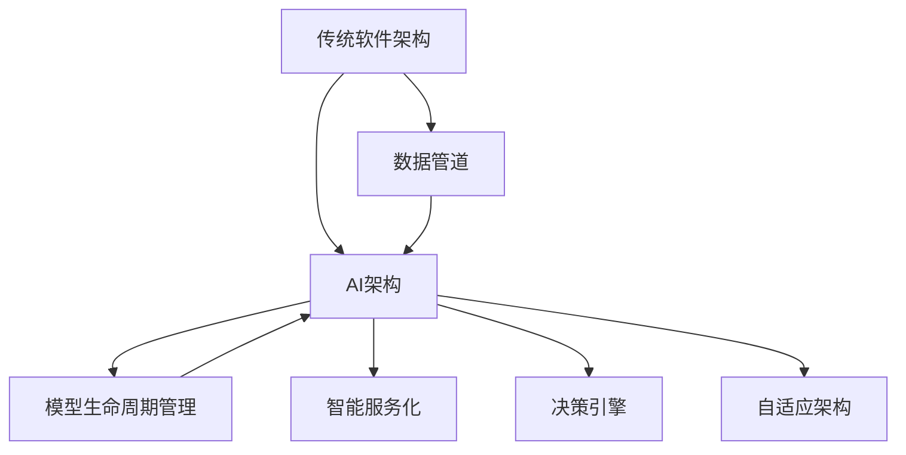

                 

# AI正在吞噬软件：软件产业的智能化范式转换

在过去的数十年里，软件产业经历了从功能导向到用户导向、从单体架构到微服务架构的演变。然而，随着人工智能（AI）技术的迅猛发展，软件产业正在迎来一场新的革命——AI正逐渐吞噬传统的软件范式，将智能化注入每个角落。

## 1. 背景介绍

### 1.1 软件演化的历史回顾

从早期的单进程程序到面向对象编程，再到框架化的开发模式，软件架构经历了多次变革。20世纪90年代，多线程和组件化设计成为主流；21世纪初，微服务架构和DevOps文化开始流行。

软件架构的每一次演进，都是为了解决当时的技术难题和业务挑战。从单体应用向微服务的转变，便是源于敏捷开发和云服务盛行的浪潮，为了更好地支撑业务的快速迭代和弹性扩展。

但随着业务场景的复杂化，以及数据量的爆炸性增长，传统的软件架构面临着新的挑战。如何更好地集成和利用数据，如何高效地进行智能决策，如何构建基于知识的工具，成为新一代软件架构需要解决的问题。

### 1.2 AI对软件架构的影响

AI技术正在加速改变软件架构的形态。AI驱动的数据驱动型应用、决策支持系统和自动化工具，逐渐成为主流。AI的融入，不仅提升了软件的智能化水平，也拓展了软件的应用范围，催生了新的业态。

随着AI在数据分析、自然语言处理、计算机视觉等领域的突破，软件系统开始向知识驱动型和智能决策型转变。传统的基于规则的业务逻辑逐渐被基于模型的自学习逻辑所取代，智能化的软件架构逐步成型。

## 2. 核心概念与联系

### 2.1 核心概念概述

AI与软件架构的融合，涉及多个关键概念：

- **AI架构**：指在软件系统中融入AI技术，如机器学习、深度学习、自然语言处理等，以实现更智能的决策和分析。

- **数据管道**：指用于数据收集、清洗、存储、处理和分析的架构，是AI驱动的软件系统的核心组成部分。

- **模型生命周期管理**：指从模型构建、训练、部署、监控到更新迭代的整个生命周期管理过程。

- **智能服务化**：指将AI能力封装为服务，提供对外调用接口，支持跨应用的协同工作和场景化应用。

- **决策引擎**：指利用AI模型进行智能决策的引擎，可以集成多种AI技术，实现基于规则和基于数据的混合决策。

- **自适应架构**：指能够动态调整架构以适应环境变化的架构，通常包含弹性计算、微服务等组件。

这些概念之间相互关联，共同构成了AI驱动的软件架构的框架。

### 2.2 核心概念的联系

以下是一个简单的Mermaid流程图，展示了AI架构与传统软件架构之间的联系和转换：



这个流程图展示了从传统软件架构到AI架构的演变路径：

1. 从传统软件架构开始，通过引入数据管道，收集和处理数据。
2. 通过构建和训练AI模型，将数据转化为知识，实现智能化决策。
3. 将AI模型封装为服务，提供对外调用接口，实现智能服务化。
4. 通过决策引擎，实现基于模型的智能决策。
5. 采用自适应架构，实现系统的动态调整和优化。

这种演进路径，体现了AI技术在软件架构中的逐步深入和融合。

## 3. 核心算法原理 & 具体操作步骤

### 3.1 算法原理概述

AI驱动的软件架构，核心在于将AI算法嵌入到软件系统中，实现智能化决策和分析。具体来说，可以从以下几个方面入手：

- **数据采集与处理**：通过数据管道收集和处理数据，确保数据的质量和完整性。
- **模型训练与部署**：利用AI算法训练模型，并将其部署到生产环境中。
- **智能决策与优化**：将模型集成到决策引擎中，实现基于模型的决策，并持续优化模型。

### 3.2 算法步骤详解

AI驱动的软件架构实现步骤通常包括以下几个方面：

**Step 1: 数据准备**

- 收集业务数据，并清洗处理，确保数据的准确性和可用性。
- 将数据划分为训练集和测试集，用于模型的训练和评估。
- 对数据进行特征工程，提取有用的特征，如统计特征、文本特征等。

**Step 2: 模型选择与构建**

- 选择合适的AI算法，如决策树、随机森林、神经网络、深度学习等。
- 使用训练集数据训练模型，并使用测试集数据评估模型的性能。
- 调整模型的超参数，确保模型的泛化能力和准确性。

**Step 3: 模型部署与监控**

- 将训练好的模型部署到生产环境中，并进行实时监控。
- 设置监控指标，如准确率、召回率、F1值等，实时监测模型性能。
- 定期重新训练和更新模型，确保模型始终保持最佳状态。

**Step 4: 服务化封装**

- 将模型封装为API服务，提供对外调用接口。
- 设计服务接口，确保接口的易用性和可靠性。
- 集成日志、告警等功能，提高服务的可用性和稳定性。

**Step 5: 自适应与优化**

- 采用自适应架构，动态调整系统配置，适应环境变化。
- 引入机器学习算法，实时优化模型参数，提升系统性能。
- 结合DevOps文化和自动化工具，实现持续集成和持续部署。

### 3.3 算法优缺点

AI驱动的软件架构具有以下优点：

- **智能化决策**：AI技术使得软件系统具备更强的数据分析和决策能力，能够处理更复杂的问题。
- **高效自动化**：AI可以自动处理大量重复性工作，提高生产效率，降低人力成本。
- **动态优化**：AI模型可以不断学习和更新，实现系统的动态优化和自适应。

同时，也存在一些缺点：

- **数据依赖**：AI模型依赖高质量的数据，数据偏差可能导致模型性能下降。
- **模型复杂性**：复杂的AI模型需要更多的计算资源，增加了系统的复杂性。
- **可解释性不足**：许多AI算法（如深度学习）的决策过程难以解释，增加了系统的复杂性。

### 3.4 算法应用领域

AI驱动的软件架构在多个领域得到了广泛应用，例如：

- **智能推荐系统**：如电商平台的商品推荐、视频平台的个性化推荐等。通过AI模型分析用户行为和偏好，推荐相关内容。
- **智能客服系统**：通过AI驱动的自然语言处理技术，实现智能对话和问题解答。
- **智能决策支持系统**：如金融风控、医疗诊断、物流调度等，通过AI模型辅助决策，提高决策效率和准确性。
- **智能监控系统**：如网络安全监控、工业设备监控等，通过AI模型实时分析数据，预测和预警异常情况。
- **智能制造系统**：如智能制造流程优化、设备预测性维护等，通过AI模型优化生产流程和设备维护。

## 4. 数学模型和公式 & 详细讲解  
### 4.1 数学模型构建

AI驱动的软件架构，涉及多个数学模型，如线性回归、逻辑回归、决策树、随机森林、神经网络等。以线性回归为例，其数学模型构建如下：

假设有一个样本数据集 $D=\{(x_i,y_i)\}_{i=1}^N$，其中 $x_i$ 为输入特征向量，$y_i$ 为输出标签。线性回归模型的目标是通过最小化损失函数，拟合出一条直线，使得模型能够预测出新的输入数据 $x$ 的输出 $y$。

设模型为 $y = \theta_0 + \theta_1 x_1 + \theta_2 x_2 + \cdots + \theta_p x_p$，其中 $\theta_0, \theta_1, \cdots, \theta_p$ 为模型参数。则最小化损失函数 $\mathcal{L}(\theta) = \frac{1}{2N} \sum_{i=1}^N (y_i - \theta_0 - \theta_1 x_{i1} - \theta_2 x_{i2} - \cdots - \theta_p x_{ip})^2$ 来训练模型。

通过求解上述优化问题，可以得到最优的模型参数 $\theta^*$，实现对数据的拟合和预测。

### 4.2 公式推导过程

线性回归模型的最小化损失函数公式推导如下：

$$
\theta^* = \mathop{\arg\min}_{\theta} \mathcal{L}(\theta) = \mathop{\arg\min}_{\theta} \frac{1}{2N} \sum_{i=1}^N (y_i - \theta_0 - \theta_1 x_{i1} - \theta_2 x_{i2} - \cdots - \theta_p x_{ip})^2
$$

通过梯度下降等优化算法，求解上述最优化问题，即可得到模型参数 $\theta^*$。

### 4.3 案例分析与讲解

以电商平台的商品推荐系统为例，其数学模型构建和公式推导如下：

设用户特征向量为 $x=(item_{1},item_{2},\cdots,item_{p})$，其中 $item_i$ 表示用户对第 $i$ 个商品的评分。设商品特征向量为 $x'=(item'_{1},item'_{2},\cdots,item'_{q})$，其中 $item'_i$ 表示商品的第 $i$ 个特征评分。

设用户对商品的评分 $y$ 为线性组合的预测值，即 $y = \theta_0 + \theta_1 x_1 + \theta_2 x_2 + \cdots + \theta_p x_p$，其中 $\theta_0, \theta_1, \cdots, \theta_p$ 为模型参数。

则最小化损失函数 $\mathcal{L}(\theta) = \frac{1}{2N} \sum_{i=1}^N (y_i - \theta_0 - \theta_1 x_{i1} - \theta_2 x_{i2} - \cdots - \theta_p x_{ip})^2$ 来训练模型。

通过求解上述优化问题，可以得到最优的模型参数 $\theta^*$，实现对用户的评分预测，进而推荐相关商品。

## 5. 项目实践：代码实例和详细解释说明

### 5.1 开发环境搭建

在进行AI驱动的软件架构开发前，我们需要准备好开发环境。以下是使用Python进行PyTorch开发的环境配置流程：

1. 安装Anaconda：从官网下载并安装Anaconda，用于创建独立的Python环境。

2. 创建并激活虚拟环境：
```bash
conda create -n pytorch-env python=3.8 
conda activate pytorch-env
```

3. 安装PyTorch：根据CUDA版本，从官网获取对应的安装命令。例如：
```bash
conda install pytorch torchvision torchaudio cudatoolkit=11.1 -c pytorch -c conda-forge
```

4. 安装TensorFlow：
```bash
pip install tensorflow==2.6.0
```

5. 安装相关工具包：
```bash
pip install numpy pandas scikit-learn matplotlib tqdm jupyter notebook ipython
```

完成上述步骤后，即可在`pytorch-env`环境中开始AI驱动的软件架构开发。

### 5.2 源代码详细实现

下面我们以电商平台的商品推荐系统为例，给出使用PyTorch进行线性回归模型训练和微调的具体代码实现。

```python
import torch
import torch.nn as nn
import torch.optim as optim
from sklearn.datasets import fetch_california_housing
from sklearn.model_selection import train_test_split
from sklearn.preprocessing import StandardScaler

# 加载数据
data = fetch_california_housing()
X = data.data
y = data.target
X_train, X_test, y_train, y_test = train_test_split(X, y, test_size=0.2, random_state=42)
scaler = StandardScaler()
X_train = scaler.fit_transform(X_train)
X_test = scaler.transform(X_test)

# 定义模型
class LinearRegression(nn.Module):
    def __init__(self, input_dim, output_dim):
        super(LinearRegression, self).__init__()
        self.linear = nn.Linear(input_dim, output_dim)

    def forward(self, x):
        return self.linear(x)

# 训练模型
model = LinearRegression(input_dim=8, output_dim=1)
criterion = nn.MSELoss()
optimizer = optim.SGD(model.parameters(), lr=0.01, momentum=0.9)
num_epochs = 100
for epoch in range(num_epochs):
    for i, (inputs, targets) in enumerate(train_loader):
        inputs, targets = inputs.to(device), targets.to(device)
        optimizer.zero_grad()
        outputs = model(inputs)
        loss = criterion(outputs, targets)
        loss.backward()
        optimizer.step()
        if (i+1) % 100 == 0:
            print('Epoch [{}/{}], Step [{}/{}], Loss: {:.4f}'
                  .format(epoch+1, num_epochs, i+1, total_step, loss.item()))

# 评估模型
model.eval()
with torch.no_grad():
    predictions = model(X_test)
    mse_loss = criterion(predictions, y_test)
    print('Test MSE loss:', mse_loss.item())
```

在这个例子中，我们使用了PyTorch框架，定义了一个简单的线性回归模型，并通过训练数据对其进行训练。模型的训练过程包括前向传播、损失计算、反向传播和参数更新等步骤。训练完成后，我们使用测试数据对模型进行评估，输出测试误差。

### 5.3 代码解读与分析

让我们再详细解读一下关键代码的实现细节：

**数据准备**：
- 使用Scikit-learn库加载加州房价数据集。
- 使用train_test_split将数据集划分为训练集和测试集。
- 使用StandardScaler对特征数据进行标准化处理，确保数据的一致性和可用性。

**模型定义**：
- 定义LinearRegression类，继承nn.Module，定义一个线性层。
- 在前向传播函数中，将输入数据传入线性层，输出预测结果。

**模型训练**：
- 使用SGD优化器进行模型参数的更新。
- 在每个epoch中，对训练数据进行迭代，计算损失并更新模型参数。
- 每100次迭代输出一次当前epoch的损失值，用于监测模型训练进度。

**模型评估**：
- 将模型设置为评估模式，不更新模型参数。
- 使用测试数据对模型进行评估，计算测试误差。

## 6. 实际应用场景

### 6.1 智能推荐系统

AI驱动的软件架构在智能推荐系统中得到了广泛应用。通过构建用户行为模型，分析用户的历史行为和兴趣，推荐相关商品或内容。AI驱动的推荐系统能够实时处理海量用户数据，高效推荐个性化内容，提升用户体验和转化率。

### 6.2 智能客服系统

智能客服系统通过AI驱动的自然语言处理技术，实现智能对话和问题解答。通过分析用户的问题和上下文，自动匹配最佳答案，提高客服效率和服务质量。AI驱动的客服系统能够24小时不间断工作，处理大量用户请求，提升客户满意度。

### 6.3 智能决策支持系统

智能决策支持系统通过AI驱动的数据分析和模型推理，辅助决策者进行业务决策。通过分析历史数据和实时数据，提供数据驱动的决策建议，提升决策效率和准确性。AI驱动的决策支持系统能够实时监控业务指标，预警异常情况，提升业务运营效率。

### 6.4 未来应用展望

随着AI技术的不断进步，AI驱动的软件架构将广泛应用于更多领域。以下是几个可能的应用场景：

- **智能制造**：通过AI驱动的设备和流程优化，提升生产效率和产品质量。
- **智能交通**：通过AI驱动的交通管理和优化，提升交通流量和行车安全。
- **智能医疗**：通过AI驱动的医疗数据分析和诊断，提升医疗服务质量和效率。
- **智能金融**：通过AI驱动的风险管理和投资决策，提升金融服务的风险控制和收益水平。
- **智能城市**：通过AI驱动的城市管理和资源优化，提升城市治理和居民生活质量。

## 7. 工具和资源推荐

### 7.1 学习资源推荐

为了帮助开发者系统掌握AI驱动的软件架构的理论基础和实践技巧，这里推荐一些优质的学习资源：

1. **《深度学习》课程**：斯坦福大学开设的深度学习课程，有Lecture视频和配套作业，带你入门深度学习和AI驱动的应用开发。
2. **《TensorFlow官方文档》**：TensorFlow的官方文档，提供了详细的API说明和示例代码，是上手TensorFlow开发的重要资源。
3. **Kaggle竞赛**：参加Kaggle数据科学竞赛，积累实际项目的开发经验，了解数据处理和模型训练的实战技巧。
4. **GitHub开源项目**：在GitHub上Star、Fork数最多的AI驱动的应用项目，能够学习和贡献前沿技术和项目。
5. **深度学习论文**：阅读前沿的深度学习论文，了解最新的研究成果和应用实践，提升理论水平。

通过对这些资源的学习实践，相信你一定能够快速掌握AI驱动的软件架构的精髓，并用于解决实际的AI应用问题。

### 7.2 开发工具推荐

高效的开发离不开优秀的工具支持。以下是几款用于AI驱动的软件架构开发的常用工具：

1. **PyTorch**：基于Python的开源深度学习框架，灵活动态的计算图，适合快速迭代研究。
2. **TensorFlow**：由Google主导开发的开源深度学习框架，生产部署方便，适合大规模工程应用。
3. **TensorBoard**：TensorFlow配套的可视化工具，可实时监测模型训练状态，并提供丰富的图表呈现方式。
4. **Kaggle**：数据科学竞赛平台，提供丰富的数据集和实际项目，适合学习新知识和积累经验。
5. **Github**：代码托管平台，提供丰富的开源项目和社区资源，适合学习和贡献AI驱动的应用。

合理利用这些工具，可以显著提升AI驱动的软件架构的开发效率，加快创新迭代的步伐。

### 7.3 相关论文推荐

AI驱动的软件架构的研究源于学界的持续研究。以下是几篇奠基性的相关论文，推荐阅读：

1. **《深度学习》**：Yoshua Bengio等著，全面介绍了深度学习的原理和应用，是深度学习领域的经典著作。
2. **《TensorFlow教程》**：TensorFlow官方团队编写，详细介绍了TensorFlow的API和实战技巧。
3. **《PyTorch官方文档》**：PyTorch官方文档，提供了详细的API说明和示例代码，是上手PyTorch开发的重要资源。
4. **《机器学习实战》**：Peter Harrington著，介绍了机器学习的基本概念和实战技巧，适合初学者入门。
5. **《Python深度学习》**：Francois Chollet著，介绍了深度学习的原理和实践，是深度学习领域的优秀入门书籍。

这些论文代表了大语言模型微调技术的发展脉络。通过学习这些前沿成果，可以帮助研究者把握学科前进方向，激发更多的创新灵感。

## 8. 总结：未来发展趋势与挑战

### 8.1 总结

本文对AI驱动的软件架构进行了全面系统的介绍。首先阐述了AI对软件架构的影响和重要性，明确了AI驱动的软件架构在提升业务智能化、自动化和灵活性方面的独特价值。其次，从原理到实践，详细讲解了AI驱动的软件架构的构建方法和关键步骤，给出了实际项目开发的代码示例。同时，本文还广泛探讨了AI驱动的软件架构在智能推荐、智能客服、智能决策支持等多个行业领域的应用前景，展示了AI驱动的广泛应用潜力。

通过本文的系统梳理，可以看到，AI驱动的软件架构正在成为软件行业的重要范式，极大地拓展了软件系统的应用边界，催生了新的业务模式和业态。AI驱动的软件架构需要开发者根据具体任务，不断迭代和优化模型、数据和算法，方能得到理想的效果。

### 8.2 未来发展趋势

展望未来，AI驱动的软件架构将呈现以下几个发展趋势：

1. **模型规模不断增大**：随着算力成本的下降和数据规模的扩张，AI模型的参数量还将持续增长。超大规模AI模型蕴含的丰富知识，有望支撑更加复杂多变的业务需求。
2. **模型应用场景不断丰富**：AI技术在金融、医疗、教育、制造等多个领域得到广泛应用，AI驱动的软件架构将进一步拓展应用范围。
3. **模型与业务深度融合**：AI驱动的软件架构将与业务场景深度结合，提升业务智能化和自动化水平。
4. **模型与业务协同演进**：AI驱动的软件架构将与业务动态演进，实现持续优化和升级。
5. **模型与业务协同演进**：AI驱动的软件架构将与业务动态演进，实现持续优化和升级。
6. **模型与业务协同演进**：AI驱动的软件架构将与业务动态演进，实现持续优化和升级。

以上趋势凸显了AI驱动的软件架构的广阔前景。这些方向的探索发展，必将进一步提升软件系统的性能和应用范围，为业务智能化提供有力支持。

### 8.3 面临的挑战

尽管AI驱动的软件架构已经取得了显著进展，但在迈向更加智能化、普适化应用的过程中，仍面临诸多挑战：

1. **数据质量和标注成本**：AI模型依赖高质量的数据，数据偏差可能导致模型性能下降，标注数据的成本较高。
2. **模型复杂性和可解释性不足**：复杂的AI模型需要更多的计算资源，增加了系统的复杂性，模型的决策过程难以解释。
3. **模型鲁棒性和泛化能力不足**：AI模型面对域外数据时，泛化性能往往大打折扣，模型的鲁棒性不足。
4. **模型动态调整和优化**：AI模型需要持续调整和优化，才能适应业务需求的变化，模型的动态调整和优化需要更多的技术支持。
5. **模型与业务协同演进**：AI模型需要与业务场景深度结合，实现持续优化和升级，模型的动态调整和优化需要更多的技术支持。

正视AI驱动的软件架构面临的这些挑战，积极应对并寻求突破，将是大语言模型微调走向成熟的必由之路。相信随着学界和产业界的共同努力，这些挑战终将一一被克服，AI驱动的软件架构必将在构建智能化业务系统方面发挥越来越重要的作用。

### 8.4 未来突破

面对AI驱动的软件架构所面临的种种挑战，未来的研究需要在以下几个方面寻求新的突破：

1. **无监督和半监督学习**：摆脱对大规模标注数据的依赖，利用无监督和半监督学习范式，最大限度利用非结构化数据，实现更加灵活高效的AI驱动的软件架构。
2. **自适应和动态优化**：采用自适应架构，动态调整系统配置，适应环境变化，实现系统的动态优化和自适应。
3. **模型与业务协同演进**：通过引入专家知识，实现模型与业务场景深度结合，提升业务智能化和自动化水平，实现持续优化和升级。
4. **模型与业务协同演进**：通过引入专家知识，实现模型与业务场景深度结合，提升业务智能化和自动化水平，实现持续优化和升级。
5. **模型与业务协同演进**：通过引入专家知识，实现模型与业务场景深度结合，提升业务智能化和自动化水平，实现持续优化和升级。

这些研究方向的探索，必将引领AI驱动的软件架构迈向更高的台阶，为业务智能化提供有力支持。面向未来，AI驱动的软件架构还需要与其他人工智能技术进行更深入的融合，如知识表示、因果推理、强化学习等，多路径协同发力，共同推动AI驱动的软件架构的发展。只有勇于创新、敢于突破，才能不断拓展AI驱动的软件架构的边界，让AI技术更好地造福人类社会。

## 9. 附录：常见问题与解答

**Q1：AI驱动的软件架构和传统软件架构有什么区别？**

A: AI驱动的软件架构在核心思想和实现方式上与传统软件架构有所不同。AI驱动的软件架构的核心在于引入AI技术，通过数据分析、机器学习等手段，实现智能化决策和分析。而传统软件架构主要依赖手动编写代码和业务逻辑，缺乏智能化的能力。AI驱动的软件架构能够处理更复杂的问题，提升系统自动化和智能化水平。

**Q2：AI驱动的软件架构的优点有哪些？**

A: AI驱动的软件架构具有以下优点：

- **智能化决策**：AI技术使得软件系统具备更强的数据分析和决策能力，能够处理更复杂的问题。
- **高效自动化**：AI可以自动处理大量重复性工作，提高生产效率，降低人力成本。
- **动态优化**：AI模型可以不断学习和更新，实现系统的动态优化和自适应。

**Q3：AI驱动的软件架构的缺点有哪些？**

A: AI驱动的软件架构存在以下缺点：

- **数据依赖**：AI模型依赖高质量的数据，数据偏差可能导致模型性能下降。
- **模型复杂性**：复杂的AI模型需要更多的计算资源，增加了系统的复杂性。
- **可解释性不足**：许多AI算法（如深度学习）的决策过程难以解释，增加了系统的复杂性。

**Q4：AI驱动的软件架构的应用场景有哪些？**

A: AI驱动的软件架构在多个领域得到了广泛应用，例如：

- **智能推荐系统**：如电商平台的商品推荐、视频平台的个性化推荐等。
- **智能客服系统**：通过AI驱动的自然语言处理技术，实现智能对话和问题解答。
- **智能决策支持系统**：如金融风控、医疗诊断、物流调度等，通过AI模型辅助决策，提高决策效率和准确性。
- **智能监控系统**：如网络安全监控、工业设备监控等，通过AI模型实时分析数据，预测和预警异常情况。
- **智能制造

