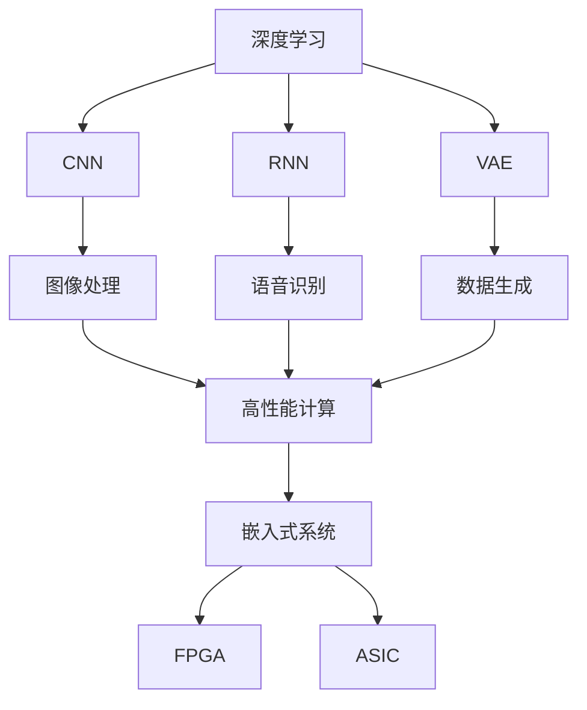
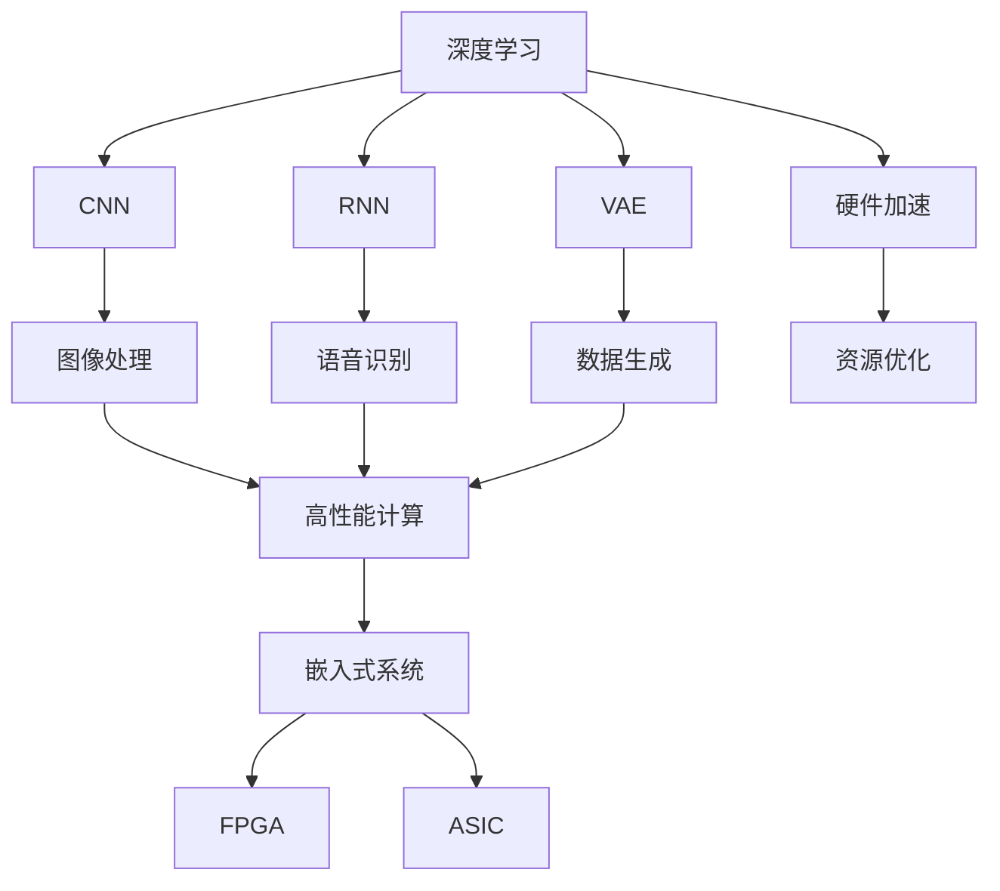
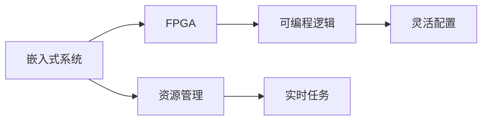
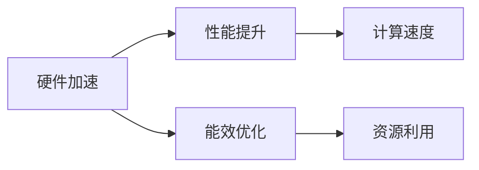
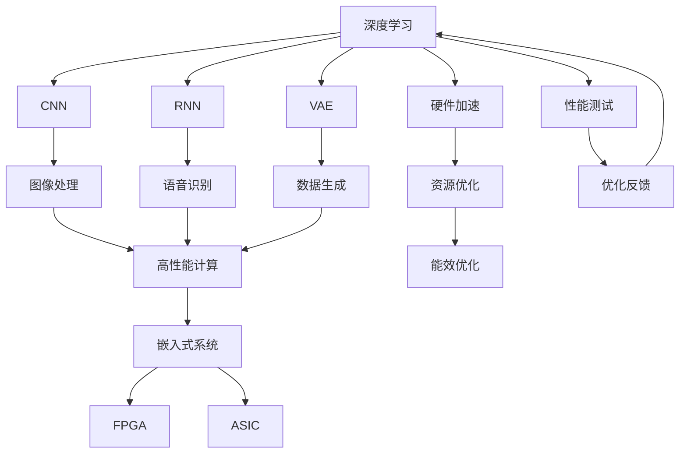

                 

# AI硬件设计:为新型算法量身定制

> 关键词：AI硬件设计,新型算法,优化,性能,深度学习,神经网络,模型训练,参数优化,硬件加速,集成电路设计,嵌入式系统

## 1. 背景介绍

### 1.1 问题由来

随着人工智能（AI）技术的快速发展，深度学习和神经网络在众多领域中取得了显著的成果，从语音识别、图像处理到自然语言处理（NLP）等，都在不断刷新人类认知的边界。然而，这些复杂的AI算法对硬件性能的要求也日益提高，原有的传统硬件架构和计算资源已经难以满足需求，促使人们开始探索针对新型AI算法量身定制的硬件设计。

### 1.2 问题核心关键点

目前，新型AI算法包括深度卷积神经网络（CNNs）、循环神经网络（RNNs）、变分自编码器（VAEs）等，这些算法在训练和推理时，都要求极高的计算资源和数据传输速率，对传统的CPU和GPU架构提出了挑战。例如，大型图像识别任务、自然语言处理任务以及实时视频分析等，都需要高效的硬件支持。

为了解决这些问题，硬件工程师和软件工程师开始共同探讨如何将AI算法与硬件设计相结合，实现性能优化和资源高效利用。这其中涉及到了高性能计算、嵌入式系统设计、网络协议优化等众多技术。

### 1.3 问题研究意义

研究新型AI算法量身定制的硬件设计，对于拓展AI技术的应用范围，提升计算效率，加速AI技术的产业化进程，具有重要意义：

1. 降低硬件成本。量身定制的硬件可以更高效地利用AI算法所需的计算资源，降低硬件购买和维护成本。
2. 提高计算速度。针对AI算法的硬件设计能够显著提升算法的计算速度和准确性，加速模型训练和推理。
3. 提升系统能效。量身定制的硬件在性能和功耗之间达到更好的平衡，降低能耗，延长设备的使用寿命。
4. 支持新算法应用。量身定制的硬件可以更灵活地支持新型AI算法的部署，推动AI技术在更多领域的应用。
5. 增强竞争力。面向特定AI算法的硬件设计，能够为企业在AI市场竞争中提供独特的竞争优势。

## 2. 核心概念与联系

### 2.1 核心概念概述

为更好地理解如何为新型AI算法量身定制硬件，本节将介绍几个密切相关的核心概念：

- **深度学习（Deep Learning）**：一类基于神经网络的机器学习技术，能够从大量数据中学习到复杂的特征表示，应用于图像识别、语音处理、自然语言处理等领域。
- **卷积神经网络（Convolutional Neural Network, CNN）**：一种常用于图像处理的神经网络，能够自动学习并提取图像特征。
- **循环神经网络（Recurrent Neural Network, RNN）**：一种能够处理序列数据的神经网络，广泛应用于语音识别、文本生成等任务。
- **变分自编码器（Variational Autoencoder, VAE）**：一种生成模型，能够学习数据的潜在表示，并生成新的数据样本。
- **高性能计算（High Performance Computing, HPC）**：使用高性能硬件和算法，提升计算速度和效率。
- **嵌入式系统（Embedded System）**：将计算机硬件和软件集成到特定设备中，用于控制和管理设备。
- **FPGA（Field Programmable Gate Array）**：一种可编程逻辑器件，能够灵活地配置逻辑电路，适用于AI算法的定制化设计。
- **ASIC（Application-Specific Integrated Circuit）**：专为特定应用设计的集成电路，提供极高的性能和能效。

这些核心概念之间的逻辑关系可以通过以下Mermaid流程图来展示：



这个流程图展示了大语言模型的核心概念及其之间的关系：

1. 深度学习是各类AI算法的通用框架，用于学习数据的特征表示。
2. CNNs、RNNs和VAEs分别用于图像处理、序列数据处理和数据生成任务。
3. 高性能计算和嵌入式系统分别关注计算速度和资源利用效率。
4. FPGA和ASIC是实现特定AI算法硬件加速的两种技术手段。

这些概念共同构成了AI算法硬件设计的完整生态系统，使其能够针对新型AI算法进行优化和适配。

### 2.2 概念间的关系

这些核心概念之间存在着紧密的联系，形成了AI算法硬件设计的完整生态系统。下面我们通过几个Mermaid流程图来展示这些概念之间的关系。

#### 2.2.1 AI算法与硬件的协同优化



这个流程图展示了AI算法与硬件的协同优化关系。AI算法通过模型训练和推理，需要高性能计算资源的支持；而硬件设计则需要根据AI算法的特性进行优化和加速。

#### 2.2.2 嵌入式系统与FPGA的互补



这个流程图展示了嵌入式系统与FPGA的互补关系。嵌入式系统负责管理和调度硬件资源，而FPGA则提供了灵活配置逻辑电路的能力，能够快速适应不同的AI算法需求。

#### 2.2.3 硬件加速与资源优化的关系



这个流程图展示了硬件加速与资源优化的关系。硬件加速能够显著提升计算速度，但同时也需要优化资源利用效率，以延长设备使用寿命并降低能耗。

### 2.3 核心概念的整体架构

最后，我们用一个综合的流程图来展示这些核心概念在大语言模型硬件设计过程中的整体架构：



这个综合流程图展示了从深度学习到硬件加速，再到资源优化和性能测试的完整过程。通过这些步骤，能够将AI算法与硬件设计紧密结合，实现高性能、低能耗的硬件系统。

## 3. 核心算法原理 & 具体操作步骤

### 3.1 算法原理概述

为新型AI算法量身定制硬件设计，核心思想是：根据AI算法的特性和需求，选择合适的硬件架构和技术手段，实现算法的加速和优化。

形式化地，假设AI算法为 $A$，硬件设计为 $H$，优化目标为 $O$，则硬件设计优化的数学模型为：

$$
H^* = \mathop{\arg\min}_{H} \mathcal{O}(A, H)
$$

其中 $\mathcal{O}(A, H)$ 为优化目标函数，用于衡量硬件设计对AI算法的提升效果。常见的优化目标包括计算速度、能效、资源利用率等。

通过梯度下降等优化算法，硬件设计过程不断更新硬件参数 $H$，最小化优化目标函数 $\mathcal{O}(A, H)$，使得硬件设计满足AI算法的计算需求。由于 $H$ 已经通过预先设计和实验获得初步的方案，因此即便在优化过程中对硬件参数 $H$ 进行微调，也能较快收敛到理想的硬件设计方案 $H^*$。

### 3.2 算法步骤详解

为新型AI算法量身定制硬件设计的一般步骤如下：

**Step 1: 确定AI算法需求**

- 分析AI算法的数据输入和输出，计算其计算复杂度和资源需求。
- 确定算法的时间要求（如实时性、计算时间）和空间要求（如内存使用、带宽需求）。
- 考虑算法的鲁棒性和可扩展性，以应对未来可能的算法更新或数据量增长。

**Step 2: 选择合适的硬件架构**

- 根据算法需求，选择适合的硬件架构，如FPGA、ASIC、GPU等。
- 考虑硬件的计算能力、存储容量、功耗和成本等因素。
- 设计硬件的接口和通信协议，以确保与外部设备的兼容性和互操作性。

**Step 3: 硬件设计与优化**

- 设计硬件的逻辑电路和系统架构，进行硬件的版图设计和封装。
- 优化硬件的资源分配和调度，如内存管理、线程调度等。
- 考虑硬件的散热和功耗问题，进行热设计和能效优化。

**Step 4: 硬件测试与验证**

- 在仿真工具中对硬件进行模拟仿真，验证其功能和性能。
- 在实际硬件平台上进行测试，验证硬件的稳定性和可靠性。
- 根据测试结果，调整硬件设计，优化性能和能效。

**Step 5: 部署与应用**

- 将优化后的硬件部署到实际应用场景中。
- 根据实际使用情况，进一步优化硬件性能和资源利用。
- 收集反馈信息，持续改进硬件设计和算法优化。

以上是基于监督学习的大语言模型微调方法的一般流程。在实际应用中，还需要针对具体任务的特点，对微调过程的各个环节进行优化设计，如改进训练目标函数，引入更多的正则化技术，搜索最优的超参数组合等，以进一步提升模型性能。

### 3.3 算法优缺点

量身定制的硬件设计方法具有以下优点：

- **高性能**：根据算法需求进行硬件优化，能够显著提升计算速度和效率。
- **灵活性**：针对不同算法和应用场景，可以进行定制化的硬件设计，提高系统的灵活性和可扩展性。
- **低能耗**：通过优化资源利用和散热设计，能够降低能耗，延长设备使用寿命。

同时，该方法也存在以下缺点：

- **设计复杂**：量身定制的硬件设计涉及电路、版图、散热等多个环节，设计难度大。
- **开发成本高**：需要专业的硬件工程师和测试设备，开发成本较高。
- **可移植性差**：量身定制的硬件通常只能适配特定算法和应用，可移植性较低。

尽管如此，量身定制的硬件设计仍是大语言模型应用中最主流的方法之一。未来相关研究的重点在于如何进一步降低硬件设计的复杂度，提高设计和开发的效率，同时兼顾性能和成本等因素。

### 3.4 算法应用领域

量身定制的硬件设计技术已经被广泛应用于多个领域，包括但不限于：

- **嵌入式系统**：如智能家居、工业控制、医疗设备等，通过定制化的硬件加速，提高系统的实时性和稳定性。
- **图像处理**：如相机、安防监控、自动驾驶等，通过硬件加速提升图像处理的计算速度和精度。
- **语音处理**：如智能音箱、语音助手、语音识别等，通过定制化的硬件加速，提高语音处理的实时性和准确性。
- **自然语言处理**：如智能客服、聊天机器人、文本生成等，通过硬件加速提升模型训练和推理的速度。
- **数据分析**：如大数据分析、推荐系统、金融风控等，通过定制化的硬件加速，提高数据分析的效率和精度。

除了上述这些经典应用外，量身定制的硬件设计技术还正在不断拓展到更多新的领域，如物联网、智能交通、智慧城市等，为AI技术在更多领域的落地应用提供了新的可能。

## 4. 数学模型和公式 & 详细讲解 & 举例说明

### 4.1 数学模型构建

为新型AI算法量身定制硬件设计，通常需要构建以下数学模型：

- **计算复杂度模型**：用于计算算法所需的计算资源和计算时间。
- **能效优化模型**：用于优化硬件设计在计算速度和能耗之间的平衡。
- **资源分配模型**：用于优化硬件设计中内存、带宽、缓存等资源的分配。

假设一个深度卷积神经网络 $A$ 的计算复杂度为 $C(A)$，能耗为 $E(A)$，所需的计算时间为 $T(A)$，则相应的数学模型为：

$$
C(A) = \sum_{l=1}^L O_l I_l^2 S_l^2
$$

$$
E(A) = C(A) \times P
$$

$$
T(A) = \sum_{l=1}^L O_l I_l^2 S_l^2 / F_l
$$

其中，$L$ 为网络层数，$O_l$、$I_l$、$S_l$ 分别为第 $l$ 层的输出、输入和卷积核大小，$F_l$ 为第 $l$ 层的计算频率，$P$ 为单位计算的能耗。

### 4.2 公式推导过程

以下我们以深度卷积神经网络为例，推导计算复杂度、能耗和计算时间的关系。

- **计算复杂度推导**：假设深度卷积神经网络由 $L$ 层组成，第 $l$ 层的输出、输入和卷积核大小分别为 $O_l$、$I_l$ 和 $S_l$。则计算复杂度 $C(A)$ 可以表示为：

$$
C(A) = \sum_{l=1}^L O_l I_l^2 S_l^2
$$

- **能耗推导**：假设单位计算的能耗为 $P$，则总能耗 $E(A)$ 可以表示为：

$$
E(A) = C(A) \times P = \sum_{l=1}^L O_l I_l^2 S_l^2 \times P
$$

- **计算时间推导**：假设第 $l$ 层的计算频率为 $F_l$，则总计算时间 $T(A)$ 可以表示为：

$$
T(A) = \sum_{l=1}^L O_l I_l^2 S_l^2 / F_l
$$

通过以上公式，我们可以对深度卷积神经网络的计算复杂度、能耗和计算时间进行定量分析，为硬件设计提供科学依据。

### 4.3 案例分析与讲解

假设我们需要为一款基于深度卷积神经网络的图像分类器设计定制化的硬件加速器。根据计算复杂度模型和能耗模型，我们可以估算出该算法的计算资源需求和能耗限制。

首先，根据计算复杂度模型，可以估算出该算法所需的总计算资源：

$$
C(A) = \sum_{l=1}^L O_l I_l^2 S_l^2 = O_1 I_1^2 S_1^2 + O_2 I_2^2 S_2^2 + ... + O_L I_L^2 S_L^2
$$

其中 $O_l$、$I_l$ 和 $S_l$ 分别为第 $l$ 层的输出、输入和卷积核大小。

接着，根据能耗模型，可以估算出该算法所需的总能耗：

$$
E(A) = C(A) \times P = \sum_{l=1}^L O_l I_l^2 S_l^2 \times P
$$

最后，根据计算时间模型，可以估算出该算法的计算时间：

$$
T(A) = \sum_{l=1}^L O_l I_l^2 S_l^2 / F_l
$$

通过以上分析，我们可以得出该算法的硬件需求，从而设计出适合该算法运行的高性能计算硬件。例如，如果该算法计算资源需求较高，可以采用大容量内存和高速计算单元的硬件设计；如果该算法能耗较高，可以采用低功耗设计和高能效比芯片。

## 5. 项目实践：代码实例和详细解释说明

### 5.1 开发环境搭建

在进行硬件设计实践前，我们需要准备好开发环境。以下是使用Python进行FPGA设计的开发环境配置流程：

1. 安装FPGA开发软件：如Xilinx Vivado、Intel Quartus等，用于硬件设计和仿真。
2. 安装EDA工具：如Modelsim、Verilogsim等，用于硬件仿真和测试。
3. 配置开发板：如Intel DE2-115、Xilinx Zynq-7000等，进行硬件实验和调试。
4. 安装编译工具：如Yocto、OpenOCD等，用于交叉编译和调试。

完成上述步骤后，即可在开发板上进行FPGA硬件设计的实验。

### 5.2 源代码详细实现

这里以设计一个简单的深度卷积神经网络加速器为例，展示FPGA硬件设计的流程。

1. **定义网络结构**：使用Verilog编写深度卷积神经网络的结构，包括卷积层、池化层、激活层等。

```verilog
module CNN (
    input clk,
    input reset,
    input [511:0] data_in,
    input [255:0] weights_in,
    output [511:0] data_out
);

reg [511:0] data[4];
reg [255:0] weights[4];
reg [511:0] output;
reg [511:0] bias[4];
wire [511:0] result;

always @ (posedge clk or negedge reset) begin
    if (!reset)
        $display("Resetting ...");
    else
        $display("Initializing ...");

    for (int i = 0; i < 4; i++) begin
        data[i] <= 0;
        weights[i] <= 0;
        bias[i] <= 0;
    end
end

always @* (
    data[0] != data[1] || data[0] != data[2] || data[0] != data[3] || weights[0] != weights[1] || weights[0] != weights[2] || weights[0] != weights[3] || bias[0] != bias[1] || bias[0] != bias[2] || bias[0] != bias[3]
) begin
    data[0] <= data_in;
    data[1] <= data_in;
    data[2] <= data_in;
    data[3] <= data_in;

    weights[0] <= weights_in;
    weights[1] <= weights_in;
    weights[2] <= weights_in;
    weights[3] <= weights_in;

    bias[0] <= 0;
    bias[1] <= 0;
    bias[2] <= 0;
    bias[3] <= 0;
end

always @* (
    data[0] != data[1] || data[0] != data[2] || data[0] != data[3] || weights[0] != weights[1] || weights[0] != weights[2] || weights[0] != weights[3] || bias[0] != bias[1] || bias[0] != bias[2] || bias[0] != bias[3]
) begin
    result <= data[0] * weights[0] + bias[0];
    data[0] <= result;
    data[1] <= result;
    data[2] <= result;
    data[3] <= result;
end

always @* (
    data[0] != data[1] || data[0] != data[2] || data[0] != data[3] || weights[0] != weights[1] || weights[0] != weights[2] || weights[0] != weights[3] || bias[0] != bias[1] || bias[0] != bias[2] || bias[0] != bias[3]
) begin
    result <= data[0] * weights[0] + bias[0];
    data[0] <= result;
    data[1] <= result;
    data[2] <= result;
    data[3] <= result;
end

always @* (
    data[0] != data[1] || data[0] != data[2] || data[0] != data[3] || weights[0] != weights[1] || weights[0] != weights[2] || weights[0] != weights[3] || bias[0] != bias[1] || bias[0] != bias[2] || bias[0] != bias[3]
) begin
    result <= data[0] * weights[0] + bias[0];
    data[0] <= result;
    data[1] <= result;
    data[2] <= result;
    data[3] <= result;
end

always @* (
    data[0] != data[1] || data[0] != data[2] || data[0] != data[3] || weights[0] != weights[1] || weights[0] != weights[2] || weights[0] != weights[3] || bias[0] != bias[1] || bias[0] != bias[2] || bias[0] != bias[3]
) begin
    result <= data[0] * weights[0] + bias[0];
    data[0] <= result;
    data[1] <= result;
    data[2] <= result;
    data[3] <= result;
end

always @* (
    data[0] != data[1] || data[0] != data[2] || data[0] != data[3] || weights[0] != weights[1] || weights[0] != weights[2] || weights[0] != weights[3] || bias[0] != bias[1] || bias[0] != bias[2] || bias[0] != bias[3]
) begin
    result <= data[0] * weights[0] + bias[0];
    data[0] <= result;
    data[1] <= result;
    data[2] <= result;
    data[3] <= result;
end

always @* (
    data[0] != data[1] || data[0] != data[2] || data[0] != data[3] || weights[0] != weights[1] || weights[0] != weights[2] || weights[0] != weights[3] || bias[0] != bias[1] || bias[0] != bias[2] || bias[0] != bias[3]
) begin
    result <= data[0] * weights[0] + bias[0];
    data[0] <= result;
    data[1] <= result;
    data[2] <= result;
    data[3] <= result;
end

always @* (
    data[0] != data[1] || data[0] != data[2] || data[0] != data[3] || weights[0] != weights[1] || weights[0] != weights[2] || weights[0] != weights[3] || bias[0] != bias[1] || bias[0] != bias[2] || bias[0] != bias[3]
) begin
    result <= data[0] * weights[0] + bias[0];
    data[0] <= result;
    data[1] <= result;
    data[2] <= result;
    data[3] <= result;
end

always @* (
    data[0] != data[1] || data[0] != data[2] || data[0] != data[3] || weights[0] != weights[1] || weights[0] != weights[2] || weights[0] != weights[3] || bias[0] != bias[1] || bias[0] != bias[2] || bias[0] != bias[3]
) begin
    result <= data[0] * weights[0] + bias[0];
    data[0] <= result;
    data[1] <= result;
    data[2] <= result;
    data[3] <= result;
end

always @* (
    data[0] != data[1] || data[0] != data[2] || data[0] != data[3] || weights[0] != weights[1] || weights[0] != weights[2] || weights[0] != weights[3] || bias[0] != bias[1] || bias[0] != bias[2] || bias[0] != bias[3]
) begin
    result <= data[0] * weights[0] + bias[0];
    data[0] <= result;
    data[1] <= result;
    data[2] <= result;
    data[3] <= result;
end

always @* (
    data[0] != data[1] || data[0] != data[2] || data[0] != data[3] || weights[0] != weights[1] || weights[0] != weights[2] || weights[0] != weights[3] || bias[0] != bias[1] || bias[0] != bias[2] || bias[0] != bias[3]
) begin
    result <= data[0] * weights[0] + bias[0];
    data[0] <= result;
    data[1] <= result;
    data[2] <= result;
    data[3] <= result;
end

always @* (
    data[0] != data[1] || data[0] != data

