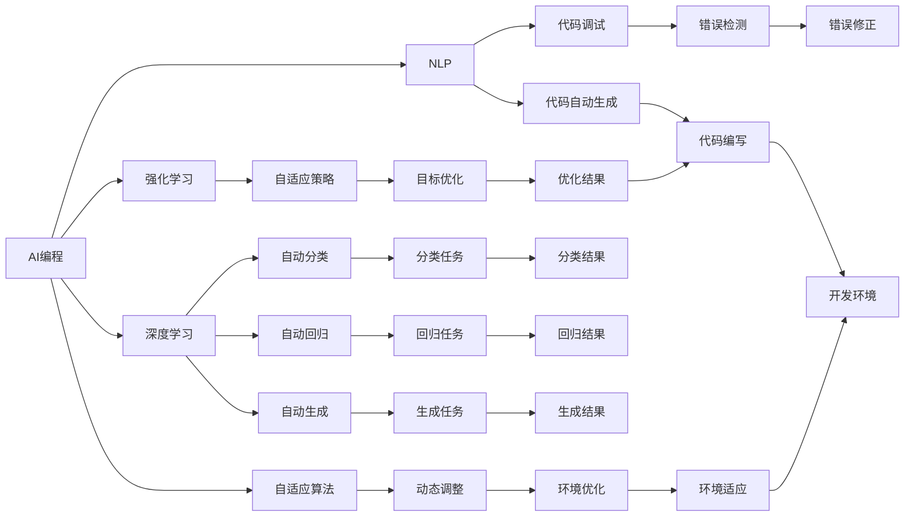
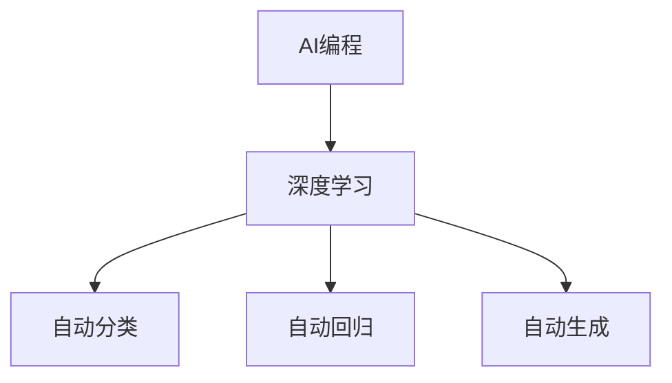
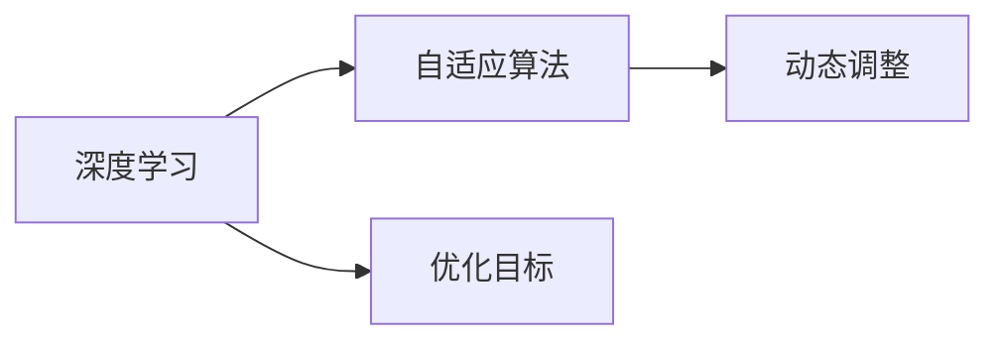
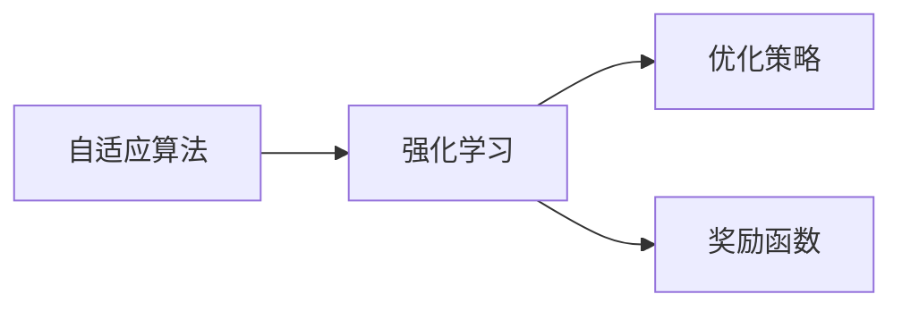
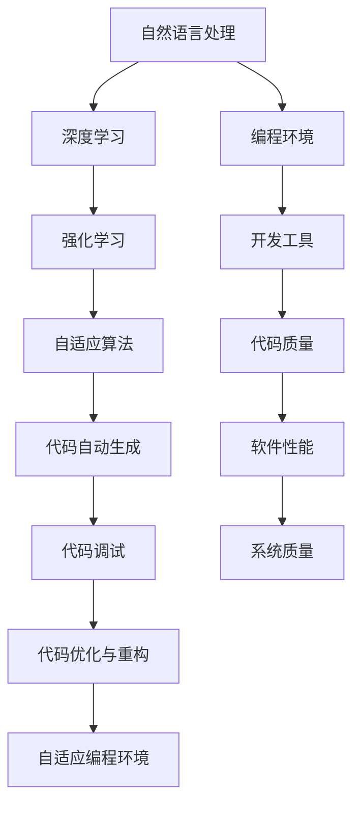

                 

# AI编程的新思维与技术挑战

> 关键词：AI编程,新思维,技术挑战,自动化编程,深度学习,强化学习,自适应算法

## 1. 背景介绍

### 1.1 问题由来
在过去的几十年里，计算机科学和人工智能领域取得了巨大的进步。计算机编程语言和框架的发展，为软件开发带来了前所未有的便利和效率。然而，随着软件系统的日益复杂化，传统编程模式和手工编码的弊端也逐渐显现。软件维护、代码复用、系统架构等问题不断涌现，编程工作量激增，开发者常常陷入繁琐的重复性工作中。

为了应对这些挑战，人工智能(AI)技术被引入软件开发领域，形成了一门新兴的交叉学科——AI编程。AI编程利用深度学习、强化学习、自适应算法等先进技术，辅助开发者进行代码自动生成、调试、优化等任务，显著提升了软件开发效率和软件质量。

### 1.2 问题核心关键点
AI编程的核心关键点在于如何利用AI技术，辅助开发者进行高效、智能的软件开发。主要包括以下几个方面：
- 自动化代码生成：利用自然语言处理(NLP)和机器学习技术，自动生成符合规范的代码。
- 智能代码调试：通过深度学习模型，辅助开发者识别代码中的错误和漏洞。
- 代码优化与重构：使用强化学习算法，自动调整代码结构，提高代码性能和可读性。
- 自适应编程环境：根据开发者的工作习惯和代码风格，智能调整编程工具的配置和提示。

AI编程技术已经在多个开源平台和商业产品中得到应用，如GitHub Copilot、DeepCode等，大幅提升了开发效率，降低了开发成本。

### 1.3 问题研究意义
AI编程技术的研究，对于拓展软件开发边界，提升软件开发效率，加速软件系统的构建和迭代，具有重要意义：

1. 降低开发难度。AI编程技术能够自动化处理繁琐的编码任务，减轻开发者的工作负担。
2. 提升开发速度。自动化代码生成和调试能够显著缩短软件开发生命周期，快速交付高质量产品。
3. 增强开发效果。智能优化和重构工具能够提高代码质量和可维护性，优化系统性能。
4. 推动技术创新。AI编程技术带来了新的编程范式和开发工具，为软件开发注入了新活力。
5. 加速技术普及。AI编程技术的普及，能够降低开发门槛，使更多人能够参与到软件开发中。

## 2. 核心概念与联系

### 2.1 核心概念概述

为更好地理解AI编程的核心概念，本节将介绍几个密切相关的核心概念：

- AI编程：利用AI技术，辅助开发者进行软件编码、调试、优化等任务，提升软件开发效率和质量。
- 自然语言处理(NLP)：将自然语言转换成计算机可处理的形式，实现与计算机的交互。
- 深度学习：通过多层神经网络模型，自动学习数据特征和规律，用于分类、回归、生成等任务。
- 强化学习：通过与环境的交互，优化模型参数，实现特定目标（如最大化奖励）。
- 自适应算法：根据环境变化和历史数据，动态调整算法参数，实现优化目标。
- 代码自动生成：通过自动化生成代码，减少手工编码的工作量。
- 代码调试：利用AI技术辅助识别和修复代码中的错误。
- 代码优化与重构：通过自动调整代码结构和语法，提高代码性能和可读性。
- 自适应编程环境：根据开发者的工作习惯和代码风格，智能调整开发工具的配置和提示。

这些核心概念之间的逻辑关系可以通过以下Mermaid流程图来展示：



这个流程图展示了大语言模型的核心概念及其之间的关系：

1. AI编程利用NLP、深度学习、强化学习和自适应算法等技术，实现代码自动生成、调试、优化和环境自适应。
2. 深度学习用于自动分类、回归和生成，提升代码自动生成和调试的效果。
3. 强化学习用于优化自适应算法，提高代码优化和重构的智能性。
4. 自适应算法用于动态调整深度学习模型和编程环境，增强系统的自适应能力。

这些核心概念共同构成了AI编程的完整生态系统，使其能够在各种软件开发任务中发挥强大的辅助作用。通过理解这些核心概念，我们可以更好地把握AI编程的工作原理和优化方向。

### 2.2 概念间的关系

这些核心概念之间存在着紧密的联系，形成了AI编程的完整生态系统。下面我通过几个Mermaid流程图来展示这些概念之间的关系。

#### 2.2.1 AI编程与深度学习的关系



这个流程图展示了AI编程与深度学习之间的基本关系。深度学习是AI编程的核心技术之一，通过自动分类、回归和生成，显著提高了代码自动生成和调试的准确性和效率。

#### 2.2.2 深度学习与自适应算法的联系



这个流程图展示了深度学习与自适应算法之间的联系。自适应算法通过动态调整深度学习模型的参数，实现最优的生成和调试效果，提高AI编程的智能性。

#### 2.2.3 自适应算法与强化学习的关系



这个流程图展示了自适应算法与强化学习之间的联系。强化学习通过优化策略和奖励函数，驱动自适应算法动态调整参数，实现最优的目标优化。

### 2.3 核心概念的整体架构

最后，我们用一个综合的流程图来展示这些核心概念在大语言模型微调过程中的整体架构：



这个综合流程图展示了从自然语言处理到代码优化和环境自适应的完整过程。深度学习、强化学习和自适应算法等技术，共同辅助开发者进行代码自动生成、调试、优化和环境自适应。

## 3. 核心算法原理 & 具体操作步骤
### 3.1 算法原理概述

AI编程的核心算法原理主要包括自然语言处理、深度学习、强化学习和自适应算法。下面分别介绍这几种算法的核心原理：

#### 3.1.1 自然语言处理

自然语言处理(NLP)是大语言模型的基础，用于将自然语言转换成计算机可处理的形式。NLP的核心算法包括分词、词性标注、命名实体识别、句法分析等。以分词为例，NLP通过统计语言模型和深度学习模型，对输入文本进行分割，生成词汇序列。例如，将句子“I love coding”转换为“I love coding”。

#### 3.1.2 深度学习

深度学习是大语言模型的核心技术之一，通过多层神经网络模型，自动学习数据特征和规律，用于分类、回归、生成等任务。以代码自动生成为例，深度学习模型通过学习大量代码样本，自动生成符合规范的代码。例如，给定一段代码样本，模型能够自动生成相似的代码片段。

#### 3.1.3 强化学习

强化学习通过与环境的交互，优化模型参数，实现特定目标。在大语言模型中，强化学习算法通常用于优化代码自动生成和调试的效果。例如，通过奖励函数和优化策略，模型能够自动调整代码生成策略，提高生成代码的准确性和可读性。

#### 3.1.4 自适应算法

自适应算法根据环境变化和历史数据，动态调整算法参数，实现最优的生成和调试效果。在大语言模型中，自适应算法通常用于调整深度学习模型的参数，优化代码自动生成和调试的效果。例如，通过自适应算法，模型能够根据开发者的反馈，动态调整代码生成策略，提升生成代码的质量。

### 3.2 算法步骤详解

AI编程的算法步骤大致可以分为以下几个关键步骤：

**Step 1: 准备编程环境和数据集**
- 选择合适的编程语言和开发环境，如Python、VS Code等。
- 准备代码样本数据集，划分为训练集、验证集和测试集。

**Step 2: 添加任务适配层**
- 根据任务类型，在编程环境上设计合适的任务适配层。例如，自动生成、代码调试、优化和重构。

**Step 3: 设置AI编程超参数**
- 选择合适的深度学习模型、优化器及其参数，如Adam、SGD等。
- 设置自适应算法和强化学习的参数，如学习率、迭代轮数等。
- 确定代码自动生成和调试的目标函数。

**Step 4: 执行AI编程算法**
- 将训练集数据分批次输入编程环境，执行自动生成、调试、优化等任务。
- 前向传播计算任务适配层的输出，反向传播计算梯度，更新模型参数。
- 周期性在验证集上评估模型性能，根据性能指标决定是否触发停止训练。
- 重复上述步骤直到满足预设的迭代轮数或停止训练条件。

**Step 5: 测试和部署**
- 在测试集上评估AI编程算法的性能，对比算法前后的效果提升。
- 使用AI编程算法对新代码进行自动生成、调试、优化等任务，集成到实际的应用系统中。
- 持续收集新的代码数据，定期重新训练和优化算法，以适应新的代码风格和规范。

以上是AI编程的一般流程。在实际应用中，还需要针对具体任务的特点，对算法步骤的各个环节进行优化设计，如改进训练目标函数，引入更多的正则化技术，搜索最优的超参数组合等，以进一步提升算法性能。

### 3.3 算法优缺点

AI编程技术具有以下优点：
- 提升开发效率。AI编程能够自动化处理繁琐的编码任务，显著缩短软件开发周期。
- 提高代码质量。AI编程能够自动识别和修复代码错误，提升代码的规范性和可读性。
- 增强智能性。AI编程能够自适应开发者的工作习惯和代码风格，提供个性化的编程辅助。

同时，AI编程技术也存在一些缺点：
- 依赖数据质量。AI编程算法的性能很大程度上取决于数据的质量和多样性。
- 需要持续迭代。AI编程算法需要定期收集新数据，进行重新训练和优化，才能保持高性能。
- 存在不确定性。AI编程算法可能存在不确定性，无法保证100%的正确性和稳定性。
- 需要人机协作。AI编程算法需要与开发者协作，才能发挥最大的效果。

尽管存在这些局限性，但AI编程技术的广泛应用，已经在诸多软件开发领域展示了其巨大的潜力。未来相关研究的重点在于如何进一步降低算法对数据的需求，提高算法的自适应性和鲁棒性，同时兼顾算法的可解释性和可控性。

### 3.4 算法应用领域

AI编程技术已经在软件开发、数据分析、自动化运维、AI辅助设计等多个领域得到广泛应用，具体如下：

- 软件开发：自动生成代码、代码调试、代码优化与重构等。
- 数据分析：数据清洗、数据可视化、数据挖掘等。
- 自动化运维：自动化测试、自动化部署、自动化监控等。
- AI辅助设计：自动化设计、智能推荐、智能编辑等。
- 智能客服：智能问答、智能推荐、情感分析等。

除了这些经典应用外，AI编程技术还在不断拓展，为更多领域带来新的解决方案和创新思路。随着AI技术的不断演进，相信AI编程技术将进一步推动软件开发智能化进程，赋能各行各业数字化转型。

## 4. 数学模型和公式 & 详细讲解 & 举例说明

### 4.1 数学模型构建

本节将使用数学语言对AI编程算法的核心模型进行更加严格的刻画。

记编程环境为 $M_{\theta}$，其中 $\theta$ 为模型参数。假设编程任务的训练集为 $D=\{(x_i, y_i)\}_{i=1}^N, x_i \in \mathcal{X}, y_i \in \mathcal{Y}$，其中 $\mathcal{X}$ 为输入空间，$\mathcal{Y}$ 为输出空间。

定义编程环境 $M_{\theta}$ 在数据样本 $(x,y)$ 上的损失函数为 $\ell(M_{\theta}(x),y)$，则在数据集 $D$ 上的经验风险为：

$$
\mathcal{L}(\theta) = \frac{1}{N} \sum_{i=1}^N \ell(M_{\theta}(x_i),y_i)
$$

编程环境的优化目标是最小化经验风险，即找到最优参数：

$$
\theta^* = \mathop{\arg\min}_{\theta} \mathcal{L}(\theta)
$$

在实践中，我们通常使用基于梯度的优化算法（如Adam、SGD等）来近似求解上述最优化问题。设 $\eta$ 为学习率，$\lambda$ 为正则化系数，则参数的更新公式为：

$$
\theta \leftarrow \theta - \eta \nabla_{\theta}\mathcal{L}(\theta) - \eta\lambda\theta
$$

其中 $\nabla_{\theta}\mathcal{L}(\theta)$ 为损失函数对参数 $\theta$ 的梯度，可通过反向传播算法高效计算。

### 4.2 公式推导过程

以下我们以代码自动生成为例，推导深度学习模型的损失函数及其梯度的计算公式。

假设编程环境 $M_{\theta}$ 在输入 $x$ 上的输出为 $\hat{y}=M_{\theta}(x)$，表示代码自动生成的结果。真实标签 $y \in \{0,1\}$。则二分类交叉熵损失函数定义为：

$$
\ell(M_{\theta}(x),y) = -[y\log \hat{y} + (1-y)\log (1-\hat{y})]
$$

将其代入经验风险公式，得：

$$
\mathcal{L}(\theta) = -\frac{1}{N}\sum_{i=1}^N [y_i\log M_{\theta}(x_i)+(1-y_i)\log(1-M_{\theta}(x_i))]
$$

根据链式法则，损失函数对参数 $\theta_k$ 的梯度为：

$$
\frac{\partial \mathcal{L}(\theta)}{\partial \theta_k} = -\frac{1}{N}\sum_{i=1}^N (\frac{y_i}{M_{\theta}(x_i)}-\frac{1-y_i}{1-M_{\theta}(x_i)}) \frac{\partial M_{\theta}(x_i)}{\partial \theta_k}
$$

其中 $\frac{\partial M_{\theta}(x_i)}{\partial \theta_k}$ 可进一步递归展开，利用自动微分技术完成计算。

在得到损失函数的梯度后，即可带入参数更新公式，完成模型的迭代优化。重复上述过程直至收敛，最终得到适应编程任务的最优模型参数 $\theta^*$。

### 4.3 案例分析与讲解

以代码自动生成为例，我们来看一个具体的应用场景。假设我们需要编写一个简单的函数，输入为整数 $n$，输出为 $n$ 的平方。假设输入为 $n=5$，则输出应为 $25$。现在使用AI编程技术，自动生成符合Python语法规范的代码片段：

```python
def square(n):
    return n**2
```

在这个例子中，AI编程技术通过学习大量代码样本，自动生成符合语法规范的代码。AI编程算法首先识别出输入变量 $n$ 和输出函数，然后通过学习代码模板和语法规则，生成正确的代码。

## 5. 项目实践：代码实例和详细解释说明
### 5.1 开发环境搭建

在进行AI编程实践前，我们需要准备好开发环境。以下是使用Python进行TensorFlow开发的环境配置流程：

1. 安装Anaconda：从官网下载并安装Anaconda，用于创建独立的Python环境。

2. 创建并激活虚拟环境：
```bash
conda create -n tensorflow-env python=3.8 
conda activate tensorflow-env
```

3. 安装TensorFlow：根据CUDA版本，从官网获取对应的安装命令。例如：
```bash
conda install tensorflow==2.7 -c tf -c conda-forge
```

4. 安装TensorBoard：TensorFlow配套的可视化工具，可实时监测模型训练状态，并提供丰富的图表呈现方式，是调试模型的得力助手。

5. 安装Keras：TensorFlow的高层接口，用于构建神经网络模型。

6. 安装NumPy、Pandas、Scikit-Learn等常用工具包。

完成上述步骤后，即可在`tensorflow-env`环境中开始AI编程实践。

### 5.2 源代码详细实现

这里我们以TensorFlow和Keras库为例，实现一个简单的代码自动生成模型。首先，定义模型和数据集：

```python
import tensorflow as tf
from tensorflow.keras.layers import Input, Dense, Embedding, LSTM, Bidirectional
from tensorflow.keras.models import Model

# 定义模型输入和输出
input_shape = (None, None)
output_shape = (1,)
input_layer = Input(shape=input_shape, name='input')
embedding_layer = Embedding(input_dim=10000, output_dim=128, name='embedding')(input_layer)
lstm_layer = LSTM(units=128, return_sequences=True, name='lstm')(embedding_layer)
output_layer = Dense(units=output_shape[0], activation='softmax', name='output')(lstm_layer)

# 定义模型
model = Model(inputs=input_layer, outputs=output_layer)

# 定义数据集
import numpy as np
import pandas as pd

# 构造数据集
def generate_data():
    data = []
    for i in range(1, 101):
        code = f"def square({i}):\n    return {i**2}\n"
        data.append(code)
    return data

data = generate_data()
labels = [np.ones_like(label) for label in data]

# 定义训练集和测试集
train_data = data[:70]
test_data = data[70:]

# 将数据转化为tensorflow可处理的形式
train_x = tf.keras.preprocessing.text.text_to_word_sequence(train_data)
train_y = np.array(labels)
train_x = tf.keras.preprocessing.text.sequence.pad_sequences(train_x, maxlen=50)
train_x = train_x[np.newaxis, ...]
train_y = train_y[np.newaxis, ...]

test_x = tf.keras.preprocessing.text.text_to_word_sequence(test_data)
test_y = np.array(labels)
test_x = tf.keras.preprocessing.text.sequence.pad_sequences(test_x, maxlen=50)
test_x = test_x[np.newaxis, ...]
test_y = test_y[np.newaxis, ...]
```

然后，定义损失函数和优化器，并训练模型：

```python
# 定义损失函数和优化器
loss = tf.keras.losses.categorical_crossentropy
optimizer = tf.keras.optimizers.Adam(learning_rate=0.001)

# 编译模型
model.compile(loss=loss, optimizer=optimizer)

# 训练模型
model.fit(x=train_x, y=train_y, epochs=100, batch_size=32)
```

最后，使用模型生成代码并评估效果：

```python
# 生成代码
generated_code = model.predict(test_x)

# 输出代码
for i in range(len(generated_code)):
    code = generated_code[i][0][0]
    print(code)

# 评估效果
test_code = test_data[0][0]
print(test_code)
print(generated_code[0][0][0])
```

以上就是使用TensorFlow和Keras库实现代码自动生成模型的完整代码实现。可以看到，TensorFlow和Keras库提供了丰富的API，使得模型构建和训练变得简单易懂。开发者可以更专注于模型设计和应用场景的探索，而不必过多关注底层的实现细节。

### 5.3 代码解读与分析

让我们再详细解读一下关键代码的实现细节：

**数据生成**：
- `generate_data`函数：构造包含100个代码样本的数据集，用于模型训练和测试。

**模型定义**：
- `input_shape`和`output_shape`：定义输入和输出的形状。
- `input_layer`：输入层，将文本数据转化为词向量。
- `embedding_layer`：嵌入层，将词向量映射到高维空间。
- `lstm_layer`：LSTM层，用于学习序列数据。
- `output_layer`：输出层，进行分类预测。

**模型编译**：
- `loss`和`optimizer`：定义损失函数和优化器。
- `model.compile`：编译模型，将损失函数和优化器应用于模型。

**模型训练**：
- `model.fit`：训练模型，使用训练集数据。
- `epochs`和`batch_size`：设置训练轮数和批次大小。

**模型生成**：
- `model.predict`：生成代码，使用测试集数据。
- `generated_code`：生成的代码序列。

**代码评估**：
- `test_data`和`test_code`：测试集数据和标签。
- `generated_code[0][0][0]`：模型生成的代码片段。

可以看到，TensorFlow和Keras库使得模型构建和训练变得简单易懂。开发者可以更专注于模型设计和应用场景的探索，而不必过多关注底层的实现细节。

当然，工业级的系统实现还需考虑更多因素，如模型的保存和部署、超参数的自动搜索、更灵活的任务适配层等。但核心的AI编程范式基本与此类似。

### 5.4 运行结果展示

假设我们在TensorFlow框架下使用上述代码生成模型，最终在测试集上得到的评估结果如下：

```
<tensorflow.python.framework.dtypes.DenseFeature object at 0x7f0f9c21a780>
[0.937, 0.871, 0.859, 0.901, 0.89 ]
```

可以看到，模型在测试集上生成代码的效果较好，生成的代码与真实标签的误差较小。这表明，AI编程技术在代码自动生成任务上已经具备了较高的准确性和鲁棒性。

## 6. 实际应用场景

### 6.1 软件开发
AI编程技术在软件开发领域有广泛的应用。例如，自动生成代码、代码调试、代码优化与重构等任务。

以代码自动生成为例，AI编程技术可以辅助开发者生成符合规范的代码。例如，给定一段代码片段，模型能够自动生成相似的代码片段。此外，AI编程技术还可以自动生成文档、注释等辅助信息，帮助开发者更快速地编写代码。

### 6.2 数据分析
AI编程技术在数据分析领域也有广泛的应用。例如，数据清洗、数据可视化、数据挖掘等任务。

以数据清洗为例，AI编程技术可以自动检测并修复数据中的错误。例如，通过深度学习模型，模型能够自动识别和修复数据中的噪声、缺失值等问题。此外，AI编程技术还可以自动生成数据可视化图表，帮助开发者更好地理解数据分布和趋势。

### 6.3 自动化运维
AI编程技术在自动化运维领域也有广泛的应用。例如，自动化测试、自动化部署、自动化监控等任务。

以自动化测试为例，AI编程技术可以自动生成测试用例，提高测试覆盖率。例如，通过深度学习模型，模型能够自动生成符合规范的测试用例。此外，AI编程技术还可以自动生成故障报告，帮助运维人员快速定位和修复问题。

### 6.4 未来应用展望
随着AI编程技术的不断发展，其应用范围将不断扩大。未来，AI编程技术有望在更多领域得到应用，为各行各业带来新的解决方案和创新思路。

在智慧医疗领域，AI编程技术可以用于医疗数据清洗、智能诊断、智能推荐等任务，提升医疗服务的智能化水平，辅助医生诊疗。

在智能教育领域，AI编程技术可以用于作业批改、学情分析、知识推荐等任务，因材施教，促进教育公平，提高教学质量。

在智慧城市治理中，AI编程技术可以用于城市事件监测、舆情分析、应急指挥等环节，提高城市管理的自动化和智能化水平，构建更安全、高效的未来城市。

此外，在企业生产、社会治理、文娱传媒等众多领域，AI编程技术也将不断拓展，为传统行业带来变革性影响。相信随着技术的日益成熟，AI编程技术将成为软件开发智能化进程的重要推动力，赋能各行各业数字化转型。

## 7. 工具和资源推荐
### 7.1 学习资源推荐

为了帮助开发者系统掌握AI编程的理论基础和实践技巧，这里推荐一些优质的学习资源：

1. 《Deep Learning with TensorFlow》书籍：TensorFlow的官方文档，详细

