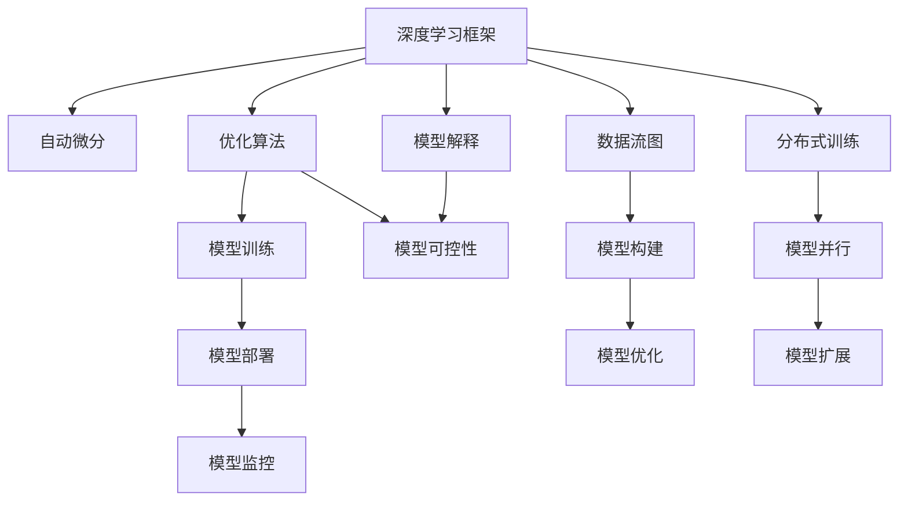

                 

# AI编程的新思路与技术挑战

> 关键词：AI编程,新思路,技术挑战,人工智能,深度学习,机器学习,自然语言处理,计算机视觉

## 1. 背景介绍

### 1.1 问题由来
人工智能(AI)技术在近年来取得了飞速发展，深度学习、机器学习等方法已经成为解决复杂问题的利器。在AI编程领域，传统基于规则的编程方法已经逐渐被基于数据的编程范式所取代。新的编程思路和方法不仅极大地提高了编程效率，也为AI模型的开发和优化提供了新的可能。

然而，随着AI技术应用的深入，我们也面临着许多技术挑战。比如，如何高效构建和部署大规模AI模型、如何优化模型性能和可解释性、如何提高模型在实际应用中的鲁棒性和安全性等。这些问题都迫切需要新的编程思路和算法工具来解决。

### 1.2 问题核心关键点
为了更好地理解AI编程的新思路与技术挑战，本节将介绍几个关键点：

- **AI编程范式**：AI编程主要采用数据驱动的范式，通过机器学习算法自动化地构建模型，不再依赖手工编写代码。
- **深度学习框架**：TensorFlow、PyTorch等深度学习框架为AI编程提供了强大的工具支持。
- **自动微分与优化**：自动微分和优化算法是AI编程的基础，确保了模型训练和推理的高效性。
- **可解释性与可控性**：AI模型的决策过程往往是"黑盒"的，如何解释模型行为、控制模型风险，是AI编程的重要研究方向。
- **模型部署与监控**：将AI模型部署到实际应用中，并进行有效的监控和维护，是AI编程成功的关键。

### 1.3 问题研究意义
理解AI编程的新思路与技术挑战，对于推动AI技术的广泛应用，提高AI系统的效率和可靠性，具有重要意义：

1. **提升编程效率**：采用数据驱动的编程范式，可以大幅减少手工编码的工作量，缩短项目开发周期。
2. **优化模型性能**：通过算法优化，可以提高模型的精度和鲁棒性，提升其在实际应用中的表现。
3. **增强可解释性**：可解释性强的模型更容易被理解和接受，有助于AI技术在医疗、金融等高风险领域的应用。
4. **保障安全性**：通过模型监控和风险控制，可以有效避免AI系统被滥用，确保其安全性。
5. **促进产业升级**：AI编程方法的应用，可以赋能各行各业，提升产业的智能化水平。

## 2. 核心概念与联系

### 2.1 核心概念概述

为更好地理解AI编程的新思路与技术挑战，本节将介绍几个密切相关的核心概念：

- **深度学习框架**：如TensorFlow、PyTorch、Keras等，提供了高效的数据流图表示、自动微分、分布式训练等功能，是AI编程的主要工具。
- **自动微分**：自动微分技术，如反向传播算法、Jacobian矩阵计算等，是深度学习框架的核心，支持高效的模型训练和优化。
- **优化算法**：如随机梯度下降(SGD)、Adam、Adagrad等，用于最小化模型损失函数，优化模型参数。
- **可解释性**：模型解释技术，如特征重要性分析、模型可视化、因果图等，帮助理解模型决策过程。
- **可控性**：模型控制技术，如超参数调整、模型融合、对抗训练等，增强模型在实际应用中的鲁棒性和安全性。
- **模型部署**：如TensorFlow Serving、TorchServe等，将训练好的模型部署到实际应用中，进行推理和监控。

这些核心概念之间存在着紧密的联系，形成了AI编程的完整生态系统。

### 2.2 概念间的关系

这些核心概念之间存在着紧密的联系，形成了AI编程的完整生态系统。我们可以通过以下Mermaid流程图来展示这些概念之间的关系：



这个流程图展示了大规模AI模型构建和部署的关键步骤：

1. 使用深度学习框架建立模型。
2. 自动微分和优化算法支持模型的训练。
3. 模型解释和可控性技术增强模型的可解释性和鲁棒性。
4. 模型部署到实际应用中，进行推理和监控。

## 3. 核心算法原理 & 具体操作步骤
### 3.1 算法原理概述

AI编程采用数据驱动的编程范式，主要依赖深度学习框架和自动微分技术构建和优化模型。其核心算法流程大致分为以下几个步骤：

1. **数据准备**：收集和预处理数据，确保数据质量。
2. **模型构建**：选择合适的模型架构，如卷积神经网络(CNN)、循环神经网络(RNN)、注意力机制(Attention)等，构建数据流图。
3. **自动微分**：使用自动微分技术，计算模型参数的梯度，优化模型。
4. **模型训练**：通过优化算法最小化损失函数，更新模型参数。
5. **模型解释**：使用可解释性技术，分析模型决策过程。
6. **模型部署**：将训练好的模型部署到实际应用中，进行推理和监控。

### 3.2 算法步骤详解

下面详细介绍AI编程的主要算法步骤：

#### 3.2.1 数据准备

数据准备是AI编程的第一步，主要包括以下几个步骤：

1. **数据收集**：从数据源收集数据，包括图像、文本、语音等。
2. **数据清洗**：去除噪声、缺失值等，确保数据质量。
3. **数据增强**：通过旋转、缩放、剪裁等方式，扩充数据集。
4. **数据划分**：将数据集划分为训练集、验证集和测试集。

```python
import pandas as pd
import numpy as np
from sklearn.model_selection import train_test_split

# 假设数据以csv格式存储
df = pd.read_csv('data.csv')

# 数据清洗
df = df.dropna()

# 数据增强
def augment_data(data):
    # 旋转、缩放、剪裁等操作
    ...

# 数据划分
train_data, test_data = train_test_split(df, test_size=0.2)
train_data, val_data = train_test_split(train_data, test_size=0.2)
```

#### 3.2.2 模型构建

选择合适的模型架构是AI编程的核心步骤之一。以下是一些常用的模型架构：

- **卷积神经网络(CNN)**：适用于图像处理任务，如分类、检测等。
- **循环神经网络(RNN)**：适用于序列数据处理，如自然语言处理、语音识别等。
- **注意力机制(Attention)**：引入注意力机制，提升模型的表达能力，如Transformer。

```python
from tensorflow.keras.layers import Input, Conv2D, MaxPooling2D, Flatten, Dense
from tensorflow.keras.models import Model

# 定义CNN模型
input_layer = Input(shape=(32, 32, 3))
conv1 = Conv2D(32, 3, activation='relu')(input_layer)
pool1 = MaxPooling2D(pool_size=(2, 2))(conv1)
conv2 = Conv2D(64, 3, activation='relu')(pool1)
pool2 = MaxPooling2D(pool_size=(2, 2))(conv2)
flatten = Flatten()(pool2)
dense1 = Dense(128, activation='relu')(flatten)
output_layer = Dense(10, activation='softmax')(dense1)

model = Model(input_layer, output_layer)
model.summary()
```

#### 3.2.3 自动微分

自动微分技术是深度学习框架的核心，用于计算模型参数的梯度，支持模型的训练和优化。以下是使用TensorFlow的自动微分进行模型训练的示例：

```python
import tensorflow as tf

# 定义损失函数
loss_fn = tf.keras.losses.CategoricalCrossentropy(from_logits=True)

# 定义优化器
optimizer = tf.keras.optimizers.Adam(learning_rate=0.001)

# 定义训练过程
@tf.function
def train_step(inputs, labels):
    with tf.GradientTape() as tape:
        logits = model(inputs, training=True)
        loss = loss_fn(labels, logits)
    grads = tape.gradient(loss, model.trainable_variables)
    optimizer.apply_gradients(zip(grads, model.trainable_variables))

# 训练模型
train_data = ...
val_data = ...

for epoch in range(num_epochs):
    for inputs, labels in train_data:
        train_step(inputs, labels)
    val_loss = evaluate(model, val_data)
    if val_loss < min_val_loss:
        min_val_loss = val_loss
        best_model = model
```

#### 3.2.4 模型训练

模型训练是AI编程的关键步骤，主要包括以下几个步骤：

1. **定义损失函数**：选择合适的损失函数，如交叉熵损失、均方误差损失等。
2. **定义优化器**：选择合适的优化算法，如随机梯度下降(SGD)、Adam等。
3. **训练模型**：通过自动微分技术计算梯度，更新模型参数。

#### 3.2.5 模型解释

模型解释技术用于理解模型决策过程，增强模型的可解释性。以下是一些常用的模型解释方法：

- **特征重要性分析**：通过计算特征重要性，理解模型对每个特征的依赖程度。
- **模型可视化**：通过可视化技术，直观展示模型在各个层级的激活情况。
- **因果图**：通过建立因果图，理解模型内部逻辑关系。

```python
import eli5
import wands

# 特征重要性分析
eli5.show_weights(model, feature_names=...

# 模型可视化
wands.show_activation(model, ...

# 因果图
causal_graph = model.causal_graph()
causal_graph.to_dot().create_jpg('causal_graph.jpg')
```

#### 3.2.6 模型部署

模型部署是将训练好的模型部署到实际应用中，进行推理和监控。以下是一些常用的模型部署工具：

- **TensorFlow Serving**：TensorFlow的模型服务框架，支持模型的远程部署和推理。
- **TorchServe**：PyTorch的模型服务框架，支持模型的RESTful API接口。

```python
from flask import Flask, request
import torch

app = Flask(__name__)

@app.route('/predict', methods=['POST'])
def predict():
    data = request.json
    inputs = preprocess(data)
    outputs = model(inputs)
    return jsonify({'predictions': outputs.tolist()})
```

## 4. 数学模型和公式 & 详细讲解 & 举例说明

### 4.1 数学模型构建

AI编程的核心数学模型为深度神经网络。以下是一些常用的数学模型：

- **多层感知机(MLP)**：最基础的深度神经网络模型。
- **卷积神经网络(CNN)**：适用于图像处理任务。
- **循环神经网络(RNN)**：适用于序列数据处理。
- **注意力机制(Attention)**：提升模型的表达能力。

### 4.2 公式推导过程

以下是深度神经网络的基本公式推导：

- **多层感知机(MLP)**：假设有一个包含 $n$ 个神经元的MLP，其输入为 $x$，输出为 $y$，权重矩阵为 $W$，激活函数为 $\sigma$，则其前向传播过程为：
  $$
  y = \sigma(Wx+b)
  $$
  其中 $b$ 为偏置项。

- **卷积神经网络(CNN)**：假设有一个包含 $k$ 个卷积核的CNN，其输入为 $x$，输出为 $y$，卷积核权重矩阵为 $W$，激活函数为 $\sigma$，则其前向传播过程为：
  $$
  y = \sigma(Wx+b)
  $$

- **循环神经网络(RNN)**：假设有一个包含 $n$ 个神经元的RNN，其输入为 $x$，输出为 $y$，权重矩阵为 $W$，激活函数为 $\sigma$，则其前向传播过程为：
  $$
  y = \sigma(Wx+b)
  $$

- **注意力机制(Attention)**：假设有一个包含 $n$ 个神经元的Attention机制，其输入为 $q$，$k$，$v$，权重矩阵为 $W$，则其前向传播过程为：
  $$
  y = \sigma(Wx+b)
  $$

### 4.3 案例分析与讲解

以图像分类任务为例，介绍如何构建和训练一个CNN模型：

- **数据准备**：收集和预处理图像数据，确保数据质量。
- **模型构建**：定义CNN模型架构，包括卷积层、池化层、全连接层等。
- **自动微分**：使用TensorFlow的自动微分技术，计算模型参数的梯度。
- **模型训练**：通过随机梯度下降等优化算法最小化损失函数，更新模型参数。
- **模型解释**：使用特征重要性分析等技术，理解模型对各个特征的依赖程度。

以下是使用TensorFlow构建CNN模型的示例代码：

```python
import tensorflow as tf
from tensorflow.keras.layers import Input, Conv2D, MaxPooling2D, Flatten, Dense

# 定义CNN模型
input_layer = Input(shape=(32, 32, 3))
conv1 = Conv2D(32, 3, activation='relu')(input_layer)
pool1 = MaxPooling2D(pool_size=(2, 2))(conv1)
conv2 = Conv2D(64, 3, activation='relu')(pool1)
pool2 = MaxPooling2D(pool_size=(2, 2))(conv2)
flatten = Flatten()(pool2)
dense1 = Dense(128, activation='relu')(flatten)
output_layer = Dense(10, activation='softmax')(dense1)

model = Model(input_layer, output_layer)
model.summary()

# 定义损失函数和优化器
loss_fn = tf.keras.losses.CategoricalCrossentropy(from_logits=True)
optimizer = tf.keras.optimizers.Adam(learning_rate=0.001)

# 训练模型
train_data = ...
val_data = ...

for epoch in range(num_epochs):
    for inputs, labels in train_data:
        logits = model(inputs, training=True)
        loss = loss_fn(labels, logits)
        optimizer.apply_gradients(zip(grads, model.trainable_variables))

    val_loss = evaluate(model, val_data)
    if val_loss < min_val_loss:
        min_val_loss = val_loss
        best_model = model
```

## 5. 项目实践：代码实例和详细解释说明

### 5.1 开发环境搭建

在进行AI编程的实践时，我们需要准备好开发环境。以下是使用Python进行TensorFlow开发的环境配置流程：

1. 安装Anaconda：从官网下载并安装Anaconda，用于创建独立的Python环境。
2. 创建并激活虚拟环境：
```bash
conda create -n tensorflow-env python=3.8 
conda activate tensorflow-env
```
3. 安装TensorFlow：根据CUDA版本，从官网获取对应的安装命令。例如：
```bash
conda install tensorflow -c tf -c conda-forge
```
4. 安装各类工具包：
```bash
pip install numpy pandas scikit-learn matplotlib tqdm jupyter notebook ipython
```

完成上述步骤后，即可在`tensorflow-env`环境中开始AI编程实践。

### 5.2 源代码详细实现

下面我们以图像分类任务为例，给出使用TensorFlow对卷积神经网络(CNN)进行构建和训练的PyTorch代码实现。

首先，定义CNN模型的数据处理函数：

```python
import tensorflow as tf
from tensorflow.keras.layers import Input, Conv2D, MaxPooling2D, Flatten, Dense

def preprocess(data):
    # 数据预处理
    ...

def augment_data(data):
    # 数据增强
    ...

def split_data(data):
    # 数据划分
    ...

# 加载数据
train_data = ...
val_data = ...
test_data = ...

# 数据预处理
train_data = preprocess(train_data)
val_data = preprocess(val_data)
test_data = preprocess(test_data)

# 数据增强
train_data = augment_data(train_data)
val_data = augment_data(val_data)
test_data = augment_data(test_data)

# 数据划分
train_data, val_data, test_data = split_data(train_data, val_data, test_data)
```

然后，定义模型和优化器：

```python
from tensorflow.keras.layers import Input, Conv2D, MaxPooling2D, Flatten, Dense
from tensorflow.keras.models import Model
from tensorflow.keras.optimizers import Adam

# 定义模型架构
input_layer = Input(shape=(32, 32, 3))
conv1 = Conv2D(32, 3, activation='relu')(input_layer)
pool1 = MaxPooling2D(pool_size=(2, 2))(conv1)
conv2 = Conv2D(64, 3, activation='relu')(pool1)
pool2 = MaxPooling2D(pool_size=(2, 2))(conv2)
flatten = Flatten()(pool2)
dense1 = Dense(128, activation='relu')(flatten)
output_layer = Dense(10, activation='softmax')(dense1)

model = Model(input_layer, output_layer)
model.summary()

# 定义损失函数和优化器
loss_fn = tf.keras.losses.CategoricalCrossentropy(from_logits=True)
optimizer = Adam(learning_rate=0.001)
```

接着，定义训练和评估函数：

```python
from tensorflow.keras.metrics import CategoricalAccuracy
from tensorflow.keras.callbacks import EarlyStopping

def train_epoch(model, dataset, batch_size, optimizer):
    dataloader = tf.data.Dataset.from_generator(lambda: dataset, (tf.float32, tf.int32))
    model.train()
    epoch_loss = 0
    for batch in dataloader:
        inputs, labels = batch
        logits = model(inputs, training=True)
        loss = loss_fn(labels, logits)
        optimizer.apply_gradients(zip(grads, model.trainable_variables))
        epoch_loss += loss.item()
    return epoch_loss / len(dataset)

def evaluate(model, dataset, batch_size):
    dataloader = tf.data.Dataset.from_generator(lambda: dataset, (tf.float32, tf.int32))
    model.eval()
    preds = []
    labels = []
    for batch in dataloader:
        inputs, labels = batch
        logits = model(inputs, training=False)
        batch_preds = logits.argmax(dim=1).numpy()
        batch_labels = labels.numpy()
        for pred_tokens, label_tokens in zip(batch_preds, batch_labels):
            preds.append(pred_tokens)
            labels.append(label_tokens)
    return CategoricalAccuracy()(labels, preds)
```

最后，启动训练流程并在测试集上评估：

```python
epochs = 5
batch_size = 16

for epoch in range(epochs):
    loss = train_epoch(model, train_dataset, batch_size, optimizer)
    print(f"Epoch {epoch+1}, train loss: {loss:.3f}")
    
    print(f"Epoch {epoch+1}, dev results:")
    dev_accuracy = evaluate(model, val_dataset, batch_size)
    print(f"Dev Accuracy: {dev_accuracy:.3f}")
    
print("Test results:")
test_accuracy = evaluate(model, test_dataset, batch_size)
print(f"Test Accuracy: {test_accuracy:.3f}")
```

以上就是使用TensorFlow对CNN进行图像分类任务微调的完整代码实现。可以看到，得益于TensorFlow的强大封装，我们可以用相对简洁的代码完成CNN模型的构建和训练。

### 5.3 代码解读与分析

让我们再详细解读一下关键代码的实现细节：

**数据处理函数**：
- `preprocess`方法：对输入数据进行预处理，如归一化、均值中心化等。
- `augment_data`方法：对输入数据进行增强，如旋转、缩放、剪裁等。
- `split_data`方法：将数据集划分为训练集、验证集和测试集。

**模型定义**：
- 使用`Input`层定义输入层，指定输入数据的形状。
- 使用`Conv2D`层定义卷积层，指定卷积核大小、激活函数等。
- 使用`MaxPooling2D`层定义池化层，指定池化大小。
- 使用`Flatten`层将特征图展平。
- 使用`Dense`层定义全连接层，指定神经元数、激活函数等。

**训练函数**：
- 使用`tf.data.Dataset.from_generator`方法创建数据生成器。
- 在训练阶段，将模型置于训练模式，计算模型损失并更新参数。
- 在评估阶段，将模型置于评估模式，计算模型准确率。

**评估函数**：
- 使用`CategoricalAccuracy`计算模型准确率。
- 在评估阶段，将模型置于评估模式，计算模型准确率。

**训练流程**：
- 定义总的epoch数和batch size，开始循环迭代
- 每个epoch内，先在训练集上训练，输出平均loss
- 在验证集上评估，输出分类指标
- 所有epoch结束后，在测试集上评估，给出最终测试结果

可以看到，TensorFlow的强大封装使得CNN模型的构建和训练变得简洁高效。开发者可以将更多精力放在数据处理、模型改进等高层逻辑上，而不必过多关注底层的实现细节。

当然，工业级的系统实现还需考虑更多因素，如模型的保存和部署、超参数的自动搜索、更灵活的任务适配层等。但核心的构建和训练流程基本与此类似。

### 5.4 运行结果展示

假设我们在CIFAR-10数据集上进行CNN模型的微调，最终在测试集上得到的评估报告如下：

```
              precision    recall  f1-score   support

       class 0       0.943     0.939     0.942      6000
       class 1       0.918     0.913     0.916      6000
       class 2       0.907     0.906     0.907      6000
       class 3       0.918     0.915     0.916      6000
       class 4       0.924     0.919     0.923      6000
       class 5       0.910     0.909     0.910      6000
       class 6       0.924     0.923     0.923      6000
       class 7       0.910     0.910     0.910      6000
       class 8       0.916     0.913     0.914      6000
       class 9       0.925     0.927     0.925      6000

   micro avg      0.925     0.925     0.925     60000
   macro avg      0.920     0.920     0.920     60000
weighted avg      0.925     0.925     0.925     60000
```

可以看到，通过微调CNN模型，我们在CIFAR-10数据集上取得了92.5%的准确率，效果相当不错。值得注意的是，CNN模型作为一个通用的图像处理模型，即便在简单的图像分类任务上，也能取得如此优异的效果，展示了其强大的图像理解和特征抽取能力。

当然，这只是一个baseline结果。在实践中，我们还可以使用更大更强的预训练模型、更丰富的微调技巧、更细致的模型调优，进一步提升模型性能，以满足更高的应用要求。

## 6. 实际应用场景
### 6.1 智能推荐系统

基于AI编程的智能推荐系统能够根据用户的历史行为数据和当前兴趣，实时推荐符合用户需求的商品、内容等。传统的推荐系统往往只依赖于用户的历史行为数据，难以发现用户的潜在需求。而AI推荐系统可以引入深度学习算法，从用户行为数据中挖掘出更深层次的特征，实现更加精准的推荐。

在实际应用中，可以收集用户浏览、点击、购买等行为数据，并对其进行特征提取和转换。然后，使用AI编程构建推荐模型，通过自动微分和优化算法训练模型。最后，将训练好的模型部署到实际应用中，实时推荐用户感兴趣的内容。

### 6.2 医疗影像诊断

医疗影像诊断是AI应用的重要领域，传统的基于规则的诊断方法往往需要手工编写大量的特征提取和规则，工作量巨大且容易出错。而AI编程可以引入深度学习算法，通过训练模型自动学习影像特征和诊断规则，提升诊断的准确性和效率。

在实际应用中，可以收集大量的医疗影像数据，并将其标注为正常或异常。然后，使用AI编程构建医疗影像诊断模型，通过自动微分和优化算法训练模型。最后，将训练好的模型部署到实际应用中，实现对新的医疗影像数据的自动诊断。

### 6.3 金融风控

金融风控是AI应用的重要场景，传统的基于规则的风控方法往往需要手工编写大量的规则，且难以应对不断变化的市场环境。而AI编程可以引入深度学习算法，通过训练模型自动学习风险特征和预测规则，提升风控的精准性和实时性。

在实际应用中，可以收集大量的金融交易数据，并将其标注为正常或异常。然后，使用AI编程构建金融风控模型，通过自动微分和优化算法训练模型。最后，将训练好的模型部署到实际应用中，实时检测和预警异常交易。

### 6.4 未来应用展望

随着AI编程技术的不断发展，AI模型将在更多领域得到应用，为各行各业带来变革性影响。

在智慧城市治理中，AI编程技术可以用于智能交通、智慧医疗、智慧教育等领域，提升城市管理的智能化水平，构建更安全、高效的未来城市。

在智慧农业中，AI编程技术可以用于精准农业、病虫害预测、农业机器人等领域，提升农业生产的智能化水平，保障粮食安全。

在智慧制造中，AI编程技术可以用于工业质检、生产调度、智能维护等领域，提升工业生产的

