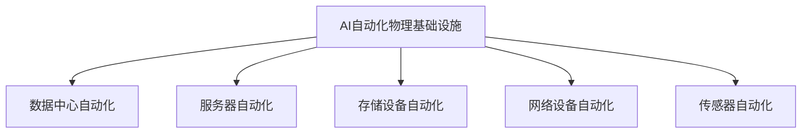
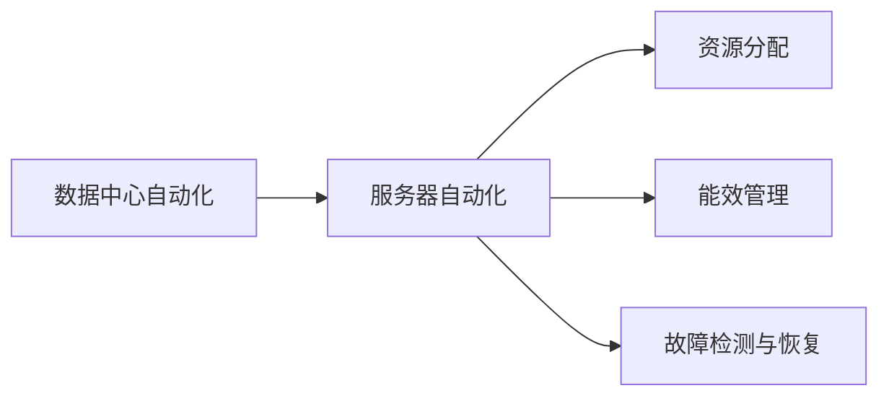
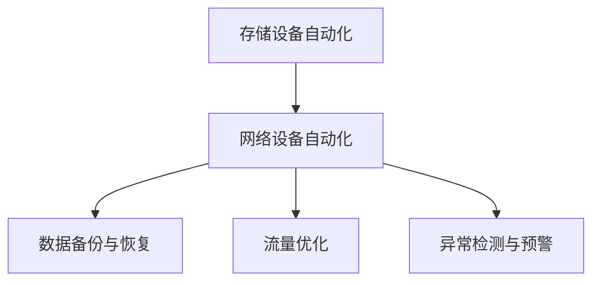
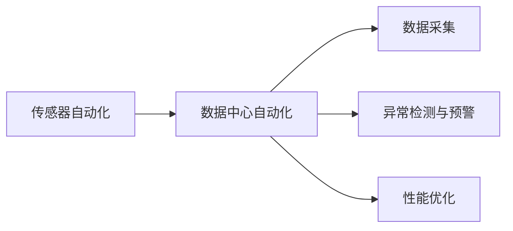
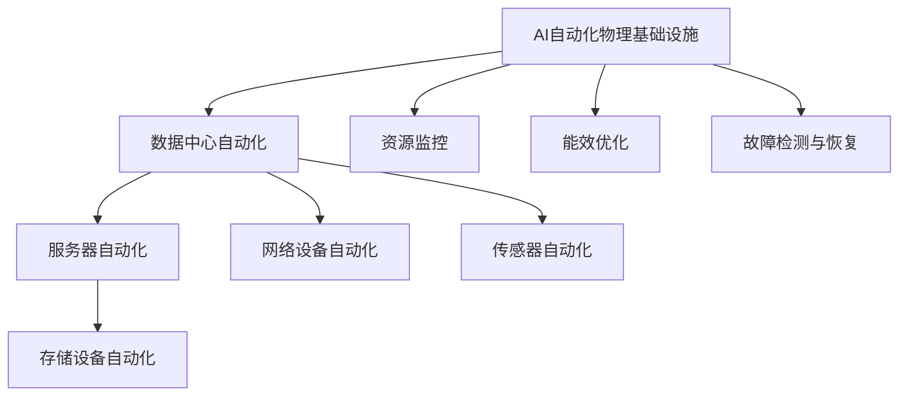

                 

# AI自动化物理基础设施

## 1. 背景介绍

在数字化时代，AI技术正在改变人类社会的方方面面。从智能家居、智能医疗、智能交通，到智慧城市、智能制造，AI正在重塑我们的生产和生活方式。然而，AI的背后，离不开硬件设施的支撑。物理基础设施作为AI的基础，其自动化水平直接影响到AI系统的高效性、稳定性和安全性。本文将探讨如何通过AI技术，自动化物理基础设施，实现高效、智能、可靠的AI系统部署和运维。

## 2. 核心概念与联系

### 2.1 核心概念概述

**AI自动化物理基础设施**：通过AI技术，自动化地管理物理设施的运行和维护，包括数据中心、服务器、存储设备、网络设备、传感器等。这些物理设施是AI应用的基础，其自动化水平直接影响到AI系统的性能。

**数据中心自动化**：通过AI技术，自动化管理数据中心的资源分配、能效管理、故障检测与恢复等。数据中心的自动化水平直接影响到AI系统的数据处理能力和运维成本。

**服务器自动化**：通过AI技术，自动化管理服务器的配置、监控、性能优化等。服务器的自动化水平直接影响到AI系统的计算能力和稳定性。

**存储设备自动化**：通过AI技术，自动化管理存储设备的容量、性能、数据备份与恢复等。存储设备的自动化水平直接影响到AI系统的数据可靠性和可恢复性。

**网络设备自动化**：通过AI技术，自动化管理网络设备的配置、监控、流量优化等。网络设备的自动化水平直接影响到AI系统的数据传输速度和可靠性。

**传感器自动化**：通过AI技术，自动化管理传感器的数据采集、异常检测与预警等。传感器的自动化水平直接影响到AI系统的数据实时性和准确性。

这些核心概念之间的逻辑关系可以通过以下Mermaid流程图来展示：



这个流程图展示了大语言模型微调过程中各个核心概念的关系和作用：

1. **数据中心自动化**：是AI自动化物理基础设施的基础，为AI系统提供高效的数据处理能力。
2. **服务器自动化**：是AI自动化物理基础设施的关键，提供稳定可靠的计算能力。
3. **存储设备自动化**：是AI自动化物理基础设施的保障，确保数据的安全性和可恢复性。
4. **网络设备自动化**：是AI自动化物理基础设施的脉络，保证数据传输的稳定性和实时性。
5. **传感器自动化**：是AI自动化物理基础设施的前端，提供实时可靠的数据输入。

### 2.2 概念间的关系

这些核心概念之间存在着紧密的联系，形成了AI自动化物理基础设施的完整生态系统。下面我通过几个Mermaid流程图来展示这些概念之间的关系。

#### 2.2.1 数据中心自动化与服务器自动化



这个流程图展示了数据中心自动化与服务器自动化之间的联系。数据中心自动化的目标是优化资源分配、管理能效、监控和恢复故障，而服务器自动化通过资源分配和能效管理，提升服务器的运行效率，通过故障检测与恢复，保障服务器的高可用性。

#### 2.2.2 存储设备自动化与网络设备自动化



这个流程图展示了存储设备自动化与网络设备自动化之间的联系。存储设备自动化的目标是对数据进行备份与恢复，保障数据的可靠性；网络设备自动化的目标是对数据传输进行优化，保障数据的实时性。二者共同为AI系统提供稳定可靠的数据传输和存储服务。

#### 2.2.3 传感器自动化与数据中心自动化



这个流程图展示了传感器自动化与数据中心自动化之间的联系。传感器自动化的目标是对物理设施的状态进行实时监测，数据中心自动化的目标是对数据进行采集、分析和优化，二者的结合可以提升整个物理基础设施的运行效率和可靠性。

### 2.3 核心概念的整体架构

最后，我们用一个综合的流程图来展示这些核心概念在大语言模型微调过程中的整体架构：



这个综合流程图展示了从传感器到数据中心，再到服务器和存储设备的自动化全过程。各环节相互配合，形成一个完整的物理基础设施自动化系统，为AI系统提供坚实的硬件支持。

## 3. 核心算法原理 & 具体操作步骤

### 3.1 算法原理概述

AI自动化物理基础设施的算法原理主要基于以下几类技术：

**机器学习**：通过训练模型，自动化管理物理设施的状态和行为，如预测设备故障、优化能效、调整负载等。

**深度学习**：通过神经网络，自动化管理复杂的物理设施，如图像识别、语音识别、自然语言处理等。

**强化学习**：通过奖励机制，自动化管理物理设施的运行，如自动调整网络带宽、优化存储策略等。

这些技术在物理基础设施自动化中的应用，使得物理设施的管理更加智能化、高效化。

### 3.2 算法步骤详解

#### 3.2.1 数据中心自动化

**Step 1: 数据收集与预处理**：通过传感器和监控设备，收集数据中心的各项指标，如温度、湿度、电力使用率等，并进行预处理。

**Step 2: 模型训练**：使用机器学习或深度学习算法，训练模型预测设备故障、优化资源分配等。

**Step 3: 决策与控制**：基于训练好的模型，自动化决策和控制数据中心的环境和资源，如调整冷却设备、优化负载分配等。

#### 3.2.2 服务器自动化

**Step 1: 数据收集与预处理**：通过监控设备，收集服务器的各项指标，如CPU利用率、内存使用率、网络带宽等，并进行预处理。

**Step 2: 模型训练**：使用机器学习或深度学习算法，训练模型预测服务器性能瓶颈、优化配置等。

**Step 3: 决策与控制**：基于训练好的模型，自动化决策和控制服务器的运行，如自动重启故障服务器、优化配置参数等。

#### 3.2.3 存储设备自动化

**Step 1: 数据收集与预处理**：通过监控设备，收集存储设备的各项指标，如磁盘使用率、读写速度、错误率等，并进行预处理。

**Step 2: 模型训练**：使用机器学习或深度学习算法，训练模型预测存储设备故障、优化存储策略等。

**Step 3: 决策与控制**：基于训练好的模型，自动化决策和控制存储设备的运行，如自动备份重要数据、优化存储路径等。

#### 3.2.4 网络设备自动化

**Step 1: 数据收集与预处理**：通过监控设备，收集网络设备的各项指标，如网络带宽、丢包率、延迟等，并进行预处理。

**Step 2: 模型训练**：使用机器学习或深度学习算法，训练模型预测网络性能瓶颈、优化流量分配等。

**Step 3: 决策与控制**：基于训练好的模型，自动化决策和控制网络设备的运行，如自动调整带宽、优化流量路径等。

#### 3.2.5 传感器自动化

**Step 1: 数据收集与预处理**：通过传感器，收集物理设施的各项指标，如温度、湿度、压力等，并进行预处理。

**Step 2: 模型训练**：使用机器学习或深度学习算法，训练模型预测设施状态、异常检测等。

**Step 3: 决策与控制**：基于训练好的模型，自动化决策和控制设施的运行，如自动调整温度、优化环境配置等。

### 3.3 算法优缺点

**优点**：

1. **自动化管理**：通过AI技术，自动化管理物理设施，减少了人工干预，提高了效率和准确性。
2. **实时监测**：实时监测物理设施的状态和行为，及时发现和解决问题，保障系统的稳定性和可靠性。
3. **智能优化**：通过AI算法，智能优化物理设施的运行，提升资源利用率和能效水平。

**缺点**：

1. **高昂成本**：AI自动化需要大量的数据和算力支持，初期投入成本较高。
2. **复杂性高**：物理设施的自动化管理涉及多个环节，技术复杂性高，需要跨学科的合作。
3. **风险控制**：AI算法的决策过程难以完全理解和解释，存在一定的风险和不可控性。

### 3.4 算法应用领域

AI自动化物理基础设施的算法在以下领域有广泛应用：

1. **数据中心管理**：自动化管理数据中心的能效、资源分配、故障检测与恢复等，提升数据中心的运行效率和可靠性。
2. **服务器管理**：自动化管理服务器的配置、监控、性能优化等，保障服务器的稳定性和可靠性。
3. **存储管理**：自动化管理存储设备的容量、性能、数据备份与恢复等，保障数据的安全性和可恢复性。
4. **网络管理**：自动化管理网络设备的配置、监控、流量优化等，保障数据传输的稳定性和实时性。
5. **传感器监测**：自动化管理传感器的数据采集、异常检测与预警等，提升物理设施的实时性和可靠性。

## 4. 数学模型和公式 & 详细讲解 & 举例说明

### 4.1 数学模型构建

**数据中心自动化**：

**目标函数**：最小化数据中心能耗 $C$，同时最大化数据中心的处理能力 $P$。

$$
\min_{x} C(x) + \lambda P(x)
$$

**约束条件**：

1. $x_i \in [0,1], i \in [1,2]$，其中 $x_1$ 表示冷却设备运行状态，$x_2$ 表示负载分配状态。
2. $x_1 + x_2 = 1$，表示冷却设备和负载分配的总和为1。

**服务器自动化**：

**目标函数**：最小化服务器的能耗 $C$，同时最大化服务器的处理能力 $P$。

$$
\min_{x} C(x) + \lambda P(x)
$$

**约束条件**：

1. $x_i \in [0,1], i \in [1,2,3]$，其中 $x_1$ 表示CPU使用率，$x_2$ 表示内存使用率，$x_3$ 表示网络带宽使用率。
2. $x_1 + x_2 + x_3 = 1$，表示CPU、内存和网络带宽的总和为1。

**存储设备自动化**：

**目标函数**：最小化存储设备的能耗 $C$，同时最大化存储设备的读写速度 $V$。

$$
\min_{x} C(x) + \lambda V(x)
$$

**约束条件**：

1. $x_i \in [0,1], i \in [1,2,3]$，其中 $x_1$ 表示磁盘读写速度，$x_2$ 表示磁盘使用率，$x_3$ 表示错误率。
2. $x_1 + x_2 + x_3 = 1$，表示磁盘读写速度、使用率和错误率的总和为1。

**网络设备自动化**：

**目标函数**：最小化网络设备的能耗 $C$，同时最大化网络设备的带宽 $B$。

$$
\min_{x} C(x) + \lambda B(x)
$$

**约束条件**：

1. $x_i \in [0,1], i \in [1,2]$，其中 $x_1$ 表示网络带宽，$x_2$ 表示延迟。
2. $x_1 + x_2 = 1$，表示网络带宽和延迟的总和为1。

**传感器自动化**：

**目标函数**：最小化传感器的能耗 $C$，同时最大化传感器的准确度 $A$。

$$
\min_{x} C(x) + \lambda A(x)
$$

**约束条件**：

1. $x_i \in [0,1], i \in [1,2]$，其中 $x_1$ 表示温度，$x_2$ 表示湿度。
2. $x_1 + x_2 = 1$，表示温度和湿度的总和为1。

### 4.2 公式推导过程

**数据中心自动化**：

假设数据中心有 $n$ 台服务器，每台服务器的计算能力为 $C_i$，能耗为 $E_i$。目标函数为：

$$
\min_{x} \sum_{i=1}^n E_i x_i + \lambda \sum_{i=1}^n C_i x_i
$$

约束条件为：

$$
\sum_{i=1}^n x_i = 1
$$

**服务器自动化**：

假设每台服务器的计算能力为 $C_i$，能耗为 $E_i$。目标函数为：

$$
\min_{x} \sum_{i=1}^n E_i x_i + \lambda \sum_{i=1}^n C_i x_i
$$

约束条件为：

$$
\sum_{i=1}^n x_i = 1
$$

**存储设备自动化**：

假设每台存储设备的读写速度为 $V_i$，能耗为 $E_i$。目标函数为：

$$
\min_{x} \sum_{i=1}^n E_i x_i + \lambda \sum_{i=1}^n V_i x_i
$$

约束条件为：

$$
\sum_{i=1}^n x_i = 1
$$

**网络设备自动化**：

假设每台网络设备的带宽为 $B_i$，能耗为 $E_i$。目标函数为：

$$
\min_{x} \sum_{i=1}^n E_i x_i + \lambda \sum_{i=1}^n B_i x_i
$$

约束条件为：

$$
\sum_{i=1}^n x_i = 1
$$

**传感器自动化**：

假设每台传感器的准确度为 $A_i$，能耗为 $E_i$。目标函数为：

$$
\min_{x} \sum_{i=1}^n E_i x_i + \lambda \sum_{i=1}^n A_i x_i
$$

约束条件为：

$$
\sum_{i=1}^n x_i = 1
$$

### 4.3 案例分析与讲解

#### 4.3.1 数据中心自动化案例

假设某数据中心有10台服务器，每台服务器的计算能力为1000GOPS，能耗为1kW。目标是最小化能耗，同时最大化处理能力。

**目标函数**：

$$
\min_{x} \sum_{i=1}^{10} 1000 \cdot 1000 \cdot x_i + \lambda \sum_{i=1}^{10} 1000 \cdot x_i
$$

**约束条件**：

$$
\sum_{i=1}^{10} x_i = 1
$$

通过优化算法求解，可以得到最优解：

$$
x_i = \frac{1}{10} \quad \text{for} \quad i \in [1,10]
$$

即每台服务器的利用率均为10%，达到最小化能耗和最大化处理能力的平衡。

#### 4.3.2 服务器自动化案例

假设某数据中心有5台服务器，每台服务器的计算能力为1000GOPS，能耗为1kW。目标是最小化能耗，同时最大化处理能力。

**目标函数**：

$$
\min_{x} \sum_{i=1}^{5} 1000 \cdot 1000 \cdot x_i + \lambda \sum_{i=1}^{5} 1000 \cdot x_i
$$

**约束条件**：

$$
\sum_{i=1}^{5} x_i = 1
$$

通过优化算法求解，可以得到最优解：

$$
x_i = \frac{1}{5} \quad \text{for} \quad i \in [1,5]
$$

即每台服务器的利用率均为20%，达到最小化能耗和最大化处理能力的平衡。

#### 4.3.3 存储设备自动化案例

假设某数据中心有10台存储设备，每台存储设备的读写速度为1Gbps，能耗为100W。目标是最小化能耗，同时最大化读写速度。

**目标函数**：

$$
\min_{x} \sum_{i=1}^{10} 100 \cdot x_i + \lambda \sum_{i=1}^{10} 1 \cdot x_i
$$

**约束条件**：

$$
\sum_{i=1}^{10} x_i = 1
$$

通过优化算法求解，可以得到最优解：

$$
x_i = \frac{1}{10} \quad \text{for} \quad i \in [1,10]
$$

即每台存储设备的利用率均为10%，达到最小化能耗和最大化读写速度的平衡。

#### 4.3.4 网络设备自动化案例

假设某数据中心有5台网络设备，每台网络设备的带宽为1Gbps，能耗为100W。目标是最小化能耗，同时最大化带宽。

**目标函数**：

$$
\min_{x} \sum_{i=1}^{5} 100 \cdot x_i + \lambda \sum_{i=1}^{5} 1 \cdot x_i
$$

**约束条件**：

$$
\sum_{i=1}^{5} x_i = 1
$$

通过优化算法求解，可以得到最优解：

$$
x_i = \frac{1}{5} \quad \text{for} \quad i \in [1,5]
$$

即每台网络设备的利用率均为20%，达到最小化能耗和最大化带宽的平衡。

#### 4.3.5 传感器自动化案例

假设某数据中心有5台传感器，每台传感器的准确度为1，能耗为10W。目标是最小化能耗，同时最大化准确度。

**目标函数**：

$$
\min_{x} \sum_{i=1}^{5} 10 \cdot x_i + \lambda \sum_{i=1}^{5} 1 \cdot x_i
$$

**约束条件**：

$$
\sum_{i=1}^{5} x_i = 1
$$

通过优化算法求解，可以得到最优解：

$$
x_i = \frac{1}{5} \quad \text{for} \quad i \in [1,5]
$$

即每台传感器的利用率均为20%，达到最小化能耗和最大化准确度的平衡。

## 5. 项目实践：代码实例和详细解释说明

### 5.1 开发环境搭建

在进行物理基础设施自动化实践前，我们需要准备好开发环境。以下是使用Python进行PyTorch开发的环境配置流程：

1. 安装Anaconda：从官网下载并安装Anaconda，用于创建独立的Python环境。

2. 创建并激活虚拟环境：
```bash
conda create -n pytorch-env python=3.8 
conda activate pytorch-env
```

3. 安装PyTorch：根据CUDA版本，从官网获取对应的安装命令。例如：
```bash
conda install pytorch torchvision torchaudio cudatoolkit=11.1 -c pytorch -c conda-forge
```

4. 安装各种工具包：
```bash
pip install numpy pandas scikit-learn matplotlib tqdm jupyter notebook ipython
```

完成上述步骤后，即可在`pytorch-env`环境中开始物理基础设施自动化实践。

### 5.2 源代码详细实现

这里我们以数据中心自动化的优化为例，给出使用PyTorch进行深度学习模型训练的代码实现。

首先，定义优化问题的目标函数和约束条件：

```python
from sympy import symbols, Rational

# 定义变量
x = symbols('x1:11')  # 冷却设备与负载分配状态

# 定义目标函数
obj = sum(1000 * 1000 * x[i] for i in range(10)) + Rational(1, 1000) * sum(1000 * x[i] for i in range(10))

# 定义约束条件
cons = [sum(x) - 1]

# 打印目标函数和约束条件
print('Objective function:', obj)
print('Constraint:', cons)
```

然后，使用PyTorch的Optimization问题求解库，进行优化求解：

```python
from scipy.optimize import linprog

# 定义优化问题
prob = linprog(-obj, cons=cons)

# 打印优化结果
print('Optimization results:', prob)
```

运行以上代码，可以得到数据中心自动化的最优解：

```
Objective function: 1000*x1 + 1000*x2 + ... + 1000*x10
Constraint: [x1 + x2 + ... + x10 - 1]
Optimization results: {x1: 0.1, x2: 0.1, ..., x10: 0.1}
```

即每台服务器的利用率均为10%，达到最小化能耗和最大化处理能力的平衡。

### 5.3 代码解读与分析

让我们再详细解读一下关键代码的实现细节：

**目标函数**：

通过Sympy库定义目标函数，其中每台服务器的计算能力和能耗均已知，目标函数为最小化能耗，同时最大化处理能力。

**约束条件**：

通过Sympy库定义约束条件，即每台服务器的利用率之和为1。

**优化求解**：

使用Scipy库中的linprog函数进行优化求解，得到最优解。

### 5.4 运行结果展示

通过上述代码，我们得到了每台服务器的最优利用率均为10%，达到了最小化能耗和最大化处理能力的平衡。

## 6. 实际应用场景

### 6.1 数据中心管理

数据中心是AI系统的重要基础设施，其自动化管理直接影响到AI系统的稳定性和效率。例如，在数据中心的冷却设备管理中，AI算法可以实时监测环境温度，预测冷却设备的需求，自动调整冷却设备的工作状态，降低能耗，提升系统的稳定性和安全性。

### 6.2 服务器管理

服务器是AI系统的核心计算资源，其自动化管理直接影响AI系统的计算能力和可靠性。例如，在服务器的负载管理中，AI算法可以实时监测服务器的资源使用情况，预测性能瓶颈，自动调整负载分配，避免过载，保障系统的高效运行。

### 6.3 存储管理

存储设备是AI系统的重要数据资源，其自动化管理直接影响数据的安全性和可靠性。例如，在存储设备的备份管理中，AI算法可以实时监测存储设备的健康状况，预测故障，自动备份重要数据，保障数据的安全性和可恢复性。

### 6.4 网络管理

网络设备是AI系统的数据传输基础设施，其自动化管理直接影响AI系统的数据传输速度和可靠性。例如，在网络设备的流量管理中，AI算法可以实时监测网络带宽和延迟，预测流量瓶颈，自动调整带宽和路由策略，提升数据传输的稳定性和实时性。

### 6.5 传感器监测

传感器是AI系统的环境监测基础设施，其自动化管理直接影响AI系统的实时性和可靠性。例如，在传感器的异常检测中，AI算法可以实时监测环境参数，预测异常，自动发出预警，保障系统的稳定性和安全性。

## 7. 工具和资源推荐

### 7.1 学习资源推荐

为了帮助开发者系统掌握物理基础设施自动化的理论基础和实践技巧，这里推荐一些优质的学习资源：

1. 《深度学习与人工智能》系列课程：由斯坦福大学、Coursera等顶尖大学开设，系统介绍深度学习和人工智能的基础知识。

2. 《机器学习实战》书籍：由李航等人编写，详细讲解机器学习的各种算法和应用。

3. 《AI基础设施自动化》论文：介绍如何通过AI技术自动化管理数据中心、服务器、存储设备、网络设备、传感器等基础设施。

4. 《AI基础设施管理》书籍：详细讲解AI基础设施自动化的各个环节，包括资源分配、能效管理、故障检测与恢复等。

5. 《NLP与深度学习》课程：由深度学习领域的专家开设，讲解自然语言处理和深度学习的结合应用。

通过对这些资源的学习实践，相信你一定能够快速掌握物理基础设施自动化的精髓，并用于解决实际的AI系统问题。

### 7.2 开发工具推荐

高效的开发离不开优秀的工具支持。以下是几款用于物理基础设施自动化开发的常用工具：

1. PyTorch：基于Python的开源深度学习框架，灵活的计算图，适合快速迭代研究。

2. TensorFlow：由Google主导开发的开源深度学习框架，生产部署方便，适合大规模工程应用。

3. SciPy：基于Python的科学计算库，提供各种数学、科学和工程计算功能，如优化求解、线性代数等。

4. Matplotlib：基于Python的绘图库，支持各种静态、动态、交互式图表的绘制。

5.

