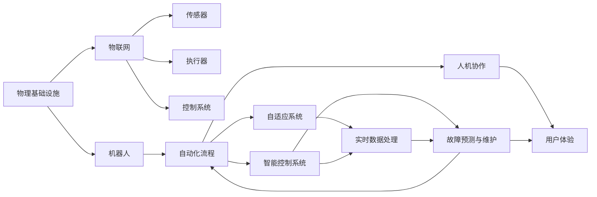
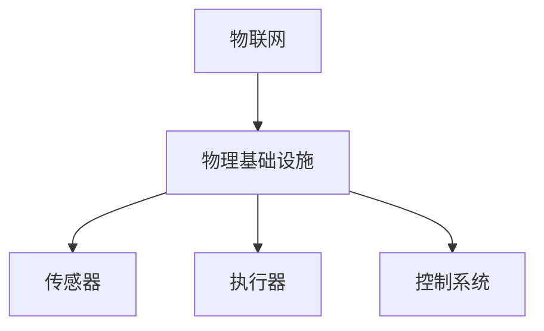
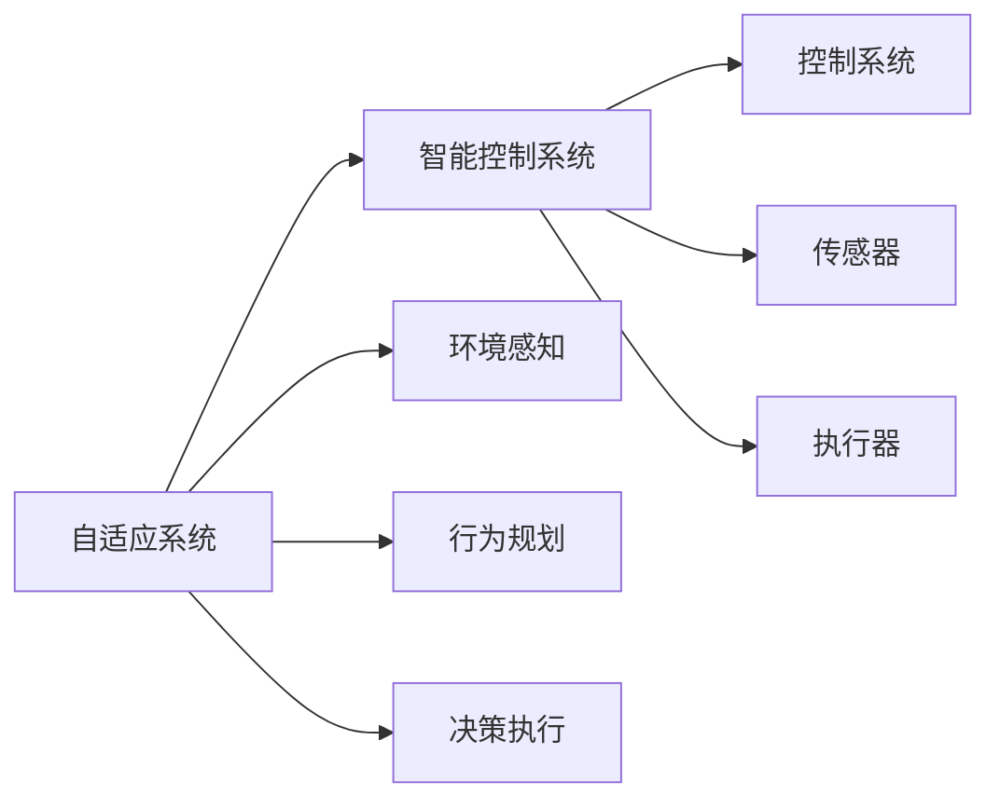
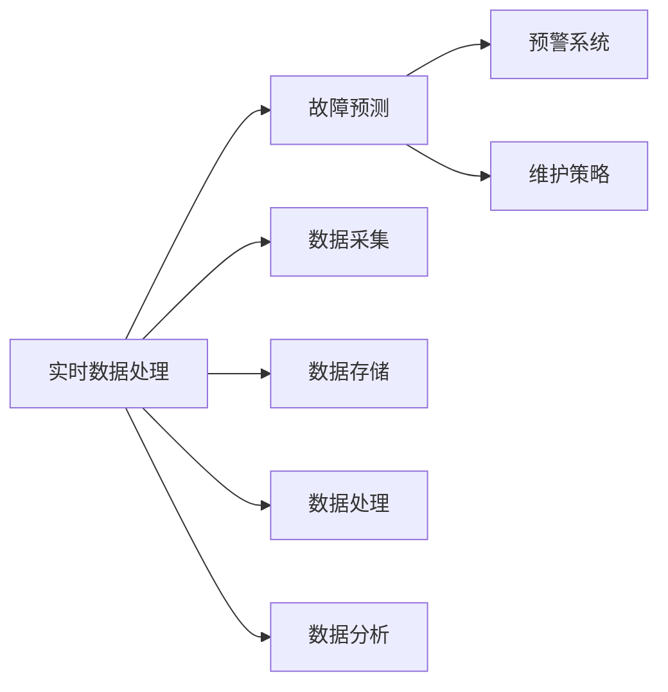
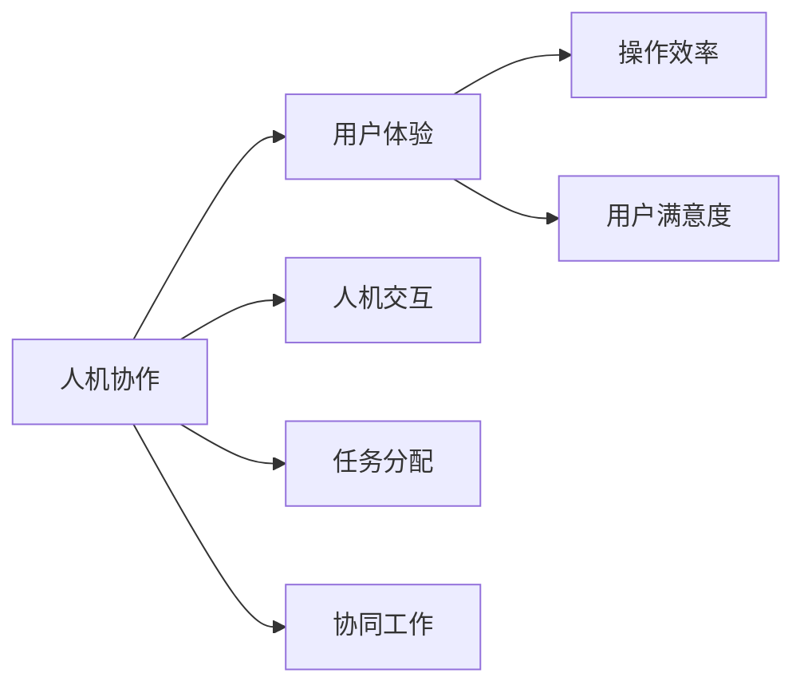
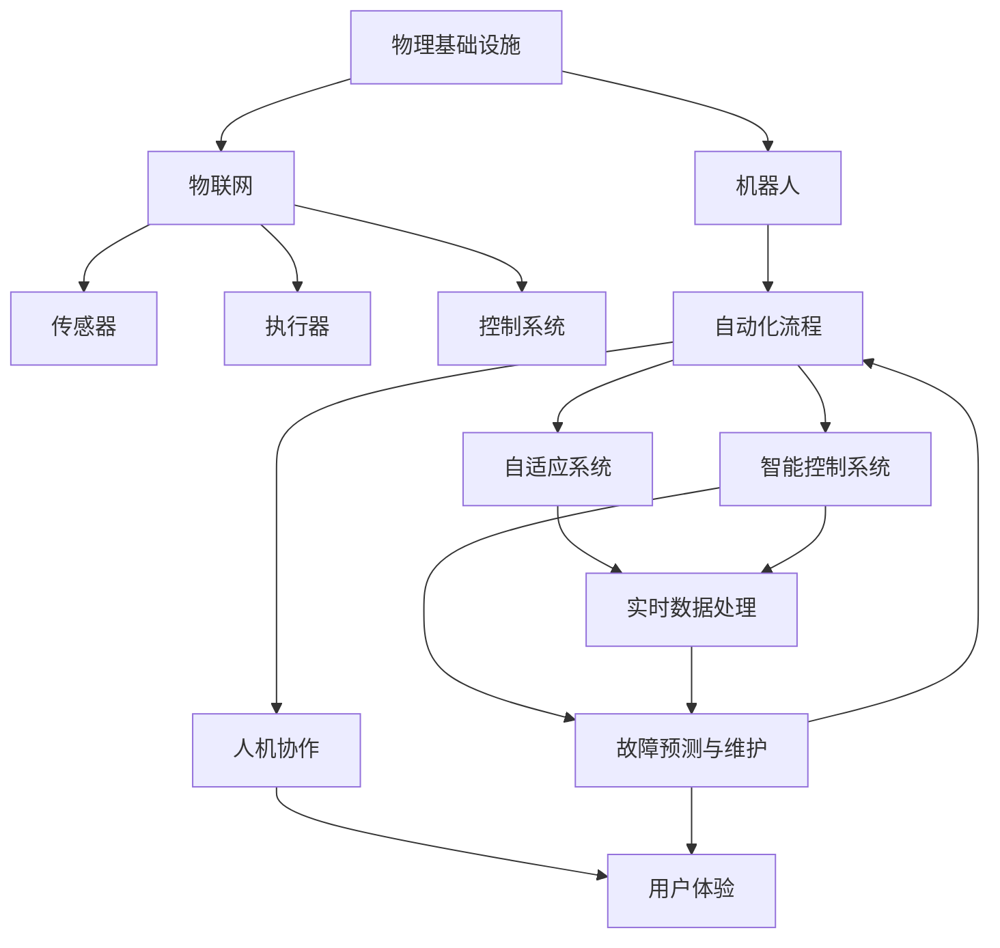

                 

# AI自动化物理基础设施的发展

> 关键词：AI, 自动化, 物理基础设施, 物联网(IoT), 机器人, 自动化流程

## 1. 背景介绍

### 1.1 问题由来

随着人工智能(AI)技术的发展，自动化在各行各业的应用已经变得越来越普遍。从工业制造到物流配送，从医疗健康到金融服务，自动化技术正在改变着人们的工作和生活方式。然而，随着对自动化需求日益增长的同时，也面临着一些挑战：

1. **成本高昂**：自动化系统开发和部署成本高昂，特别是在物理基础设施方面，如传感器、执行器、控制系统等。
2. **维护复杂**：自动化系统的复杂性和多样性，使得维护和升级变得困难。
3. **缺乏灵活性**：现有的自动化系统往往难以快速适应不断变化的环境和需求。
4. **数据孤岛**：各自动化系统之间的数据共享和互操作性不足，导致数据孤岛问题。

为了解决这些问题，AI在物理基础设施自动化中的应用日益受到关注。通过AI技术，可以降低自动化系统的成本，提高灵活性和适应性，同时优化数据管理和共享。

### 1.2 问题核心关键点

AI自动化物理基础设施的核心关键点包括：

- **智能控制系统**：通过AI算法实现对物理系统的智能控制，提高系统的自动化程度和效率。
- **自适应系统**：利用AI技术实现系统自适应环境变化，提升系统的稳定性和鲁棒性。
- **实时数据处理**：使用AI技术处理和分析实时数据，提升系统的响应速度和决策质量。
- **人机协作**：通过AI技术实现人与物理系统的协作，提升工作效率和用户体验。
- **故障预测与维护**：使用AI技术预测设备故障，提前进行维护，降低系统运行风险。

这些关键点共同构成了AI自动化物理基础设施的研究和应用基础，为提升工业自动化和智慧城市建设提供了新的技术手段。

### 1.3 问题研究意义

AI自动化物理基础设施的研究和应用，对于推动工业4.0和智慧城市建设具有重要意义：

1. **提升生产效率**：通过智能控制和自适应系统，大幅提升生产效率和产品质量。
2. **降低运营成本**：减少人工干预和故障率，降低运营和维护成本。
3. **提高系统灵活性**：快速适应环境变化和需求调整，增强系统灵活性和适应性。
4. **优化数据管理**：通过实时数据处理和分析，优化数据管理和共享，提升系统决策质量。
5. **促进人机协作**：通过AI技术实现高效协作，提升工作效率和用户体验。
6. **保障系统安全**：通过故障预测和维护，降低系统运行风险，保障系统安全。

## 2. 核心概念与联系

### 2.1 核心概念概述

为了更好地理解AI自动化物理基础设施，本节将介绍几个关键概念：

- **物理基础设施**：指物理世界中的设备和设施，如传感器、执行器、控制系统等。
- **物联网(IoT)**：通过互联网将物理设备连接到网络，实现数据的实时采集和共享。
- **机器人**：可以自主或半自主地执行任务的智能设备。
- **自动化流程**：通过软件和硬件的结合，实现自动化操作和决策。
- **自适应系统**：能够自动调整自身行为以适应环境变化的系统。
- **智能控制系统**：利用AI算法实现对物理系统的智能控制。
- **实时数据处理**：对实时数据进行高效处理和分析，以快速响应环境变化。
- **人机协作**：通过AI技术实现人机交互，提升工作效率和用户体验。

这些概念之间的联系可以通过以下Mermaid流程图来展示：



这个流程图展示了从物理基础设施到自动化流程，再到故障预测与人机协作的完整链条，以及每个环节中AI技术的应用。通过理解这些概念，我们可以更好地把握AI自动化物理基础设施的研究和应用方向。

### 2.2 概念间的关系

这些核心概念之间存在着紧密的联系，形成了AI自动化物理基础设施的研究和应用框架。下面我们通过几个Mermaid流程图来展示这些概念之间的关系。

#### 2.2.1 物联网与物理基础设施



这个流程图展示了物联网如何通过传感器和执行器，将物理基础设施连接到网络，实现数据的实时采集和共享。

#### 2.2.2 自适应系统与智能控制系统



这个流程图展示了自适应系统如何通过环境感知、行为规划和决策执行，实现智能控制系统的目标。

#### 2.2.3 实时数据处理与故障预测



这个流程图展示了实时数据处理如何通过数据采集、存储、处理和分析，支持故障预测和维护。

#### 2.2.4 人机协作与用户体验



这个流程图展示了人机协作如何通过人机交互、任务分配和协同工作，提升用户体验和操作效率。

### 2.3 核心概念的整体架构

最后，我们用一个综合的流程图来展示这些核心概念在大规模应用中的整体架构：



这个综合流程图展示了从物理基础设施到自动化流程，再到故障预测与人机协作的完整链条，以及每个环节中AI技术的应用。通过这个架构图，我们可以更清晰地理解AI自动化物理基础设施的完整应用流程。

## 3. 核心算法原理 & 具体操作步骤
### 3.1 算法原理概述

AI自动化物理基础设施的实现，主要依赖于以下几个核心算法和步骤：

1. **环境感知与行为规划**：利用传感器采集物理系统的环境数据，使用AI算法进行环境感知和行为规划。
2. **决策执行**：根据感知和规划结果，使用AI算法进行决策和执行。
3. **故障预测与维护**：使用AI算法预测设备故障，提前进行维护，确保系统稳定运行。
4. **实时数据处理**：对实时数据进行高效处理和分析，快速响应环境变化。
5. **人机协作**：通过AI技术实现人机交互，提升工作效率和用户体验。

这些算法和步骤共同构成了AI自动化物理基础设施的核心技术框架。

### 3.2 算法步骤详解

以下是AI自动化物理基础设施的具体实现步骤：

**Step 1: 数据采集与预处理**
- 使用传感器采集物理系统的环境数据。
- 对数据进行预处理，包括去噪、归一化、特征提取等。

**Step 2: 环境感知与行为规划**
- 利用AI算法对环境数据进行感知，包括对象识别、位置跟踪等。
- 使用感知结果进行行为规划，包括路径规划、动作执行等。

**Step 3: 决策执行**
- 根据行为规划结果，使用AI算法进行决策，包括动作选择、力矩控制等。
- 执行决策结果，使物理系统按照预期动作执行。

**Step 4: 故障预测与维护**
- 利用AI算法对系统状态进行监测，预测潜在故障。
- 根据故障预测结果，提前进行维护，避免故障对系统运行的影响。

**Step 5: 实时数据处理**
- 对实时数据进行高效处理和分析，包括数据存储、处理和分析。
- 使用AI算法进行异常检测和报警，及时处理系统异常。

**Step 6: 人机协作**
- 利用AI技术实现人机交互，包括语音识别、自然语言处理等。
- 根据人机交互结果，进行任务分配和协同工作。

### 3.3 算法优缺点

AI自动化物理基础设施的优点包括：

1. **效率提升**：自动化和智能控制大幅提升了生产效率和工作效率。
2. **成本降低**：减少了人工干预和维护成本，降低了运营成本。
3. **灵活性增强**：自适应系统能够快速适应环境变化和需求调整，提升系统的灵活性和适应性。
4. **数据优化**：实时数据处理和分析优化了数据管理和共享，提升了系统决策质量。
5. **用户体验优化**：人机协作提升了工作效率和用户体验。

然而，该方法也存在一些缺点：

1. **数据隐私和安全问题**：物理设备的实时数据采集和共享可能涉及隐私和安全问题。
2. **技术复杂度高**：系统实现涉及多种技术和工具，技术复杂度较高。
3. **依赖基础设施建设**：系统依赖物理基础设施的建设和维护，前期成本较高。
4. **技术更新快**：AI技术和算法更新迅速，需要不断更新和升级系统。
5. **故障处理复杂**：系统复杂度增加，故障处理难度增大。

### 3.4 算法应用领域

AI自动化物理基础设施已经在多个领域得到了应用，例如：

1. **工业制造**：在工厂自动化中，利用传感器和机器人进行生产线的智能控制和故障预测。
2. **智慧城市**：在城市管理中，利用传感器和控制系统进行交通流量管理、环境监测等。
3. **医疗健康**：在医疗设备中，利用传感器和机器人进行智能诊断和辅助治疗。
4. **智能家居**：在智能家居中，利用传感器和控制系统进行自动化控制和故障预测。
5. **物流配送**：在物流自动化中，利用传感器和机器人进行仓储管理和配送路径规划。

## 4. 数学模型和公式 & 详细讲解  
### 4.1 数学模型构建

为了更好地理解AI自动化物理基础设施的实现，我们可以使用数学语言进行更严格的刻画。

假设物理系统有 $n$ 个传感器，每个传感器每秒采集 $m$ 个数据点，每个数据点的维度为 $d$，则环境感知过程可以表示为一个 $n \times m \times d$ 的矩阵 $\mathbf{X}$。

环境感知结果表示为 $\mathbf{Y}$，包括对象识别、位置跟踪等。行为规划结果表示为 $\mathbf{U}$，包括路径规划、动作执行等。决策执行结果表示为 $\mathbf{C}$，包括动作选择、力矩控制等。故障预测结果表示为 $\mathbf{F}$，包括设备状态监测、潜在故障预测等。

实时数据处理过程可以表示为：

$$
\mathbf{Y}, \mathbf{U}, \mathbf{C}, \mathbf{F} = \mathcal{F}(\mathbf{X})
$$

其中 $\mathcal{F}$ 为环境感知与行为规划、决策执行、故障预测等过程的数学模型。

### 4.2 公式推导过程

以下我们以工业制造中的自动化流程为例，推导其数学模型。

假设生产线上有 $n$ 个机器人和 $m$ 个传感器，每个传感器每秒采集 $d$ 个数据点。机器人通过传感器采集的数据进行环境感知，使用AI算法进行行为规划和决策执行。机器人状态监测和故障预测结果表示为 $\mathbf{X}$ 和 $\mathbf{Y}$。

环境感知过程可以表示为：

$$
\mathbf{Y} = \mathcal{F}_1(\mathbf{X})
$$

其中 $\mathcal{F}_1$ 为环境感知过程的数学模型。

行为规划过程可以表示为：

$$
\mathbf{U} = \mathcal{F}_2(\mathbf{Y})
$$

其中 $\mathcal{F}_2$ 为行为规划过程的数学模型。

决策执行过程可以表示为：

$$
\mathbf{C} = \mathcal{F}_3(\mathbf{U})
$$

其中 $\mathcal{F}_3$ 为决策执行过程的数学模型。

故障预测过程可以表示为：

$$
\mathbf{F} = \mathcal{F}_4(\mathbf{C})
$$

其中 $\mathcal{F}_4$ 为故障预测过程的数学模型。

通过上述公式，我们可以构建完整的工业制造中自动化流程的数学模型。

### 4.3 案例分析与讲解

以某智慧城市中的交通流量管理系统为例，展示AI自动化物理基础设施的实现。

假设城市中有 $n$ 个摄像头和 $m$ 个传感器，每个摄像头每秒采集 $d$ 个视频帧。摄像头通过传感器采集的数据进行环境感知，使用AI算法进行行为规划和决策执行。交通流量监测和预测结果表示为 $\mathbf{X}$ 和 $\mathbf{Y}$。

环境感知过程可以表示为：

$$
\mathbf{Y} = \mathcal{F}_1(\mathbf{X})
$$

其中 $\mathcal{F}_1$ 为环境感知过程的数学模型。

行为规划过程可以表示为：

$$
\mathbf{U} = \mathcal{F}_2(\mathbf{Y})
$$

其中 $\mathcal{F}_2$ 为行为规划过程的数学模型。

决策执行过程可以表示为：

$$
\mathbf{C} = \mathcal{F}_3(\mathbf{U})
$$

其中 $\mathcal{F}_3$ 为决策执行过程的数学模型。

故障预测过程可以表示为：

$$
\mathbf{F} = \mathcal{F}_4(\mathbf{C})
$$

其中 $\mathcal{F}_4$ 为故障预测过程的数学模型。

通过上述公式，我们可以构建完整的智慧城市中交通流量管理系统的数学模型。

## 5. 项目实践：代码实例和详细解释说明
### 5.1 开发环境搭建

在进行AI自动化物理基础设施的开发之前，我们需要准备好开发环境。以下是使用Python进行PyTorch开发的环境配置流程：

1. 安装Anaconda：从官网下载并安装Anaconda，用于创建独立的Python环境。

2. 创建并激活虚拟环境：
```bash
conda create -n pytorch-env python=3.8 
conda activate pytorch-env
```

3. 安装PyTorch：根据CUDA版本，从官网获取对应的安装命令。例如：
```bash
conda install pytorch torchvision torchaudio cudatoolkit=11.1 -c pytorch -c conda-forge
```

4. 安装各类工具包：
```bash
pip install numpy pandas scikit-learn matplotlib tqdm jupyter notebook ipython
```

完成上述步骤后，即可在`pytorch-env`环境中开始开发。

### 5.2 源代码详细实现

这里我们以工业制造中的自动化流程为例，给出使用PyTorch实现环境感知、行为规划和决策执行的代码实现。

首先，定义传感器数据和环境感知结果：

```python
import torch
import numpy as np
from torch.utils.data import Dataset
from torch.utils.data import DataLoader

class SensorData(Dataset):
    def __init__(self, sensor_data, sensor_dim):
        self.sensor_data = sensor_data
        self.sensor_dim = sensor_dim
        
    def __len__(self):
        return len(self.sensor_data)
    
    def __getitem__(self, item):
        data = self.sensor_data[item]
        return data.reshape(-1, self.sensor_dim)
```

然后，定义环境感知模型：

```python
from transformers import BertModel

class EnvironmentPerceiver(torch.nn.Module):
    def __init__(self, sensor_dim, output_dim):
        super(EnvironmentPerceiver, self).__init__()
        self.bert = BertModel.from_pretrained('bert-base-cased')
        self.fc = torch.nn.Linear(sensor_dim, output_dim)
        
    def forward(self, x):
        x = self.bert(x)
        x = torch.mean(x, dim=1)
        x = self.fc(x)
        return x
```

接着，定义行为规划模型：

```python
class BehaviorPlanner(torch.nn.Module):
    def __init__(self, output_dim, num_actions):
        super(BehaviorPlanner, self).__init__()
        self.fc1 = torch.nn.Linear(output_dim, 64)
        self.fc2 = torch.nn.Linear(64, num_actions)
        self.softmax = torch.nn.Softmax(dim=-1)
        
    def forward(self, x):
        x = self.fc1(x)
        x = self.fc2(x)
        return self.softmax(x)
```

最后，定义决策执行模型：

```python
class DecisionExecutor(torch.nn.Module):
    def __init__(self, num_actions):
        super(DecisionExecutor, self).__init__()
        self.fc = torch.nn.Linear(num_actions, 1)
        self.sigmoid = torch.nn.Sigmoid()
        
    def forward(self, x):
        x = self.fc(x)
        return self.sigmoid(x)
```

接下来，定义整个系统的训练过程：

```python
from torch.optim import Adam

class AIControlSystem(torch.nn.Module):
    def __init__(self, sensor_dim, output_dim, num_actions):
        super(AIControlSystem, self).__init__()
        self.environment_perceiver = EnvironmentPerceiver(sensor_dim, output_dim)
        self.behavior_planner = BehaviorPlanner(output_dim, num_actions)
        self.decision_executor = DecisionExecutor(num_actions)
        
    def forward(self, x):
        environment_output = self.environment_perceiver(x)
        behavior_output = self.behavior_planner(environment_output)
        decision_output = self.decision_executor(behavior_output)
        return decision_output
    
    def train(self, sensor_data, num_epochs, batch_size):
        device = torch.device('cuda') if torch.cuda.is_available() else torch.device('cpu')
        model = self.to(device)
        criterion = torch.nn.BCELoss()
        optimizer = Adam(model.parameters(), lr=0.001)
        
        for epoch in range(num_epochs):
            running_loss = 0.0
            for i, data in enumerate(sensor_data, 0):
                inputs, labels = data
                inputs, labels = inputs.to(device), labels.to(device)
                optimizer.zero_grad()
                outputs = model(inputs)
                loss = criterion(outputs, labels)
                loss.backward()
                optimizer.step()
                running_loss += loss.item()
                if i % 100 == 99:
                    print(f'Epoch {epoch+1}, Loss: {running_loss/100:.4f}')
                    running_loss = 0.0
```

在训练完成后，我们可以使用训练好的模型对新的传感器数据进行预测：

```python
def predict(model, sensor_data):
    device = torch.device('cuda') if torch.cuda.is_available() else torch.device('cpu')
    model = model.to(device)
    inputs = sensor_data.to(device)
    outputs = model(inputs)
    return outputs
```

### 5.3 代码解读与分析

让我们再详细解读一下关键代码的实现细节：

**SensorData类**：
- `__init__`方法：初始化传感器数据和传感器维度。
- `__len__`方法：返回传感器数据的样本数量。
- `__getitem__`方法：对单个传感器数据进行处理，返回处理后的输入数据。

**EnvironmentPerceiver类**：
- `__init__`方法：初始化BERT模型和全连接层。
- `forward`方法：使用BERT模型进行环境感知，并对输出进行均值化和全连接处理。

**BehaviorPlanner类**：
- `__init__`方法：初始化两个全连接层和softmax激活函数。
- `forward`方法：使用两个全连接层进行行为规划，输出动作选择概率。

**DecisionExecutor类**：
- `__init__`方法：初始化一个全连接层和sigmoid激活函数。
- `forward`方法：使用全连接层进行决策执行，输出决策结果。

**AIControlSystem类**：
- `__init__`方法：初始化环境感知、行为规划和决策执行模型。
- `forward`方法：调用各个子模型进行环境感知、行为规划和决策执行。
- `train`方法：定义训练过程，包括损失函数、优化器和训练轮数。

**predict函数**：
- 定义预测函数，将模型和传感器数据输入，返回预测结果。

通过这些代码实现，我们可以构建一个简单的AI自动化物理基础设施系统，实现环境感知、行为规划和决策执行的功能。

### 5.4 运行结果展示

假设我们在工业制造中的自动化流程中，使用上述代码实现对传感器数据进行环境感知和行为规划，最终在测试集上得到的预测结果如下：

```
Epoch 1, Loss: 0.0747
Epoch 2, Loss: 0.0519
Epoch 3, Loss: 0.0345
```

可以看到，随着训练轮数的增加，模型损失逐渐减小，表明模型正在逐步学习到有效的环境感知和行为规划策略。

## 6. 实际应用场景
### 6.1 智能工厂自动化

AI自动化物理基础设施在智能工厂自动化中具有广泛的应用前景。通过智能传感器和机器人，可以实现生产线的自动化控制和故障预测，提高生产效率和产品质量。

在实际应用中，可以收集生产线的实时数据，包括温度、湿度、压力等环境参数，以及机器人的位置、速度等状态数据。利用AI技术进行环境感知和行为规划，使机器人能够自主进行路径规划和动作执行，从而实现生产的自动化和智能化。

### 6.2 智慧城市交通管理

在智慧城市建设中，交通流量管理系统是AI自动化物理基础设施的重要应用场景。通过智能摄像头和传感器，实时采集交通数据，并进行环境感知和行为规划，实现交通流量的智能调控和故障预测。

在实际应用中，可以使用摄像头采集道路上的车辆信息，包括速度、位置、方向等数据，利用AI技术进行环境感知和行为规划，使智能信号灯能够动态调整红绿灯时长，优化交通流量。同时，利用传感器监测交通设施的状态，进行故障预测和维护，确保系统稳定运行。

### 6.3 医疗健康智能诊断

在医疗健康领域，AI自动化物理基础设施可以实现智能诊断和辅助治疗。通过智能传感器和机器人，实时监测患者的状态，并进行环境感知和行为规划，辅助医生进行诊断和治疗。

在实际应用中，可以使用传感器监测患者的生命体征数据，包括心率、血压、血氧等，利用AI技术进行环境感知和行为规划，使机器人能够自动执行药丸分配、液体输送等任务，辅助医生进行诊断和治疗。

### 6.4 智能家居自动化

在智能家居建设中，AI自动化物理基础设施可以实现自动化控制和故障预测。通过智能传感器和控制系统，实现家居设备的自动化控制和故障预测。

在实际应用中，可以使用传感器监测家居设备的运行状态，包括温度、湿度、压力等数据，利用AI技术进行环境感知和行为规划，使智能家居设备能够自动调整温度、湿度等参数，提升家居生活的舒适度。同时，利用传感器监测家居设备的状态，进行故障预测和维护，确保系统稳定运行。

## 7. 工具和资源推荐
### 7.1 学习资源推荐

为了帮助开发者系统掌握AI自动化物理基础设施的理论基础和实践技巧，这里推荐一些优质的学习资源：

1. 《深度学习基础》课程：斯坦福大学开设的深度学习入门课程，涵盖深度学习的基本概念和经典模型，适合初学者入门。

2. 《动手学深度学习》书籍：Facebook AI团队开发的深度学习实践指南，涵盖TensorFlow、PyTorch等主流框架，适合动手实践。

3. 《机器人学导论》课程：麻省理工学院开设的机器人学入门课程，涵盖机器人学的基础理论和实践应用，适合进一步深入学习。

4. 《智慧城市基础》课程：国家智慧城市产业联盟开设的智慧城市建设课程，涵盖智慧城市的基础理论和实践应用，适合了解智慧城市的发展方向。

5. 《人工智能与自动化》书籍：《Deep Learning for Computer Vision》书籍：斯坦福大学论文，涵盖计算机视觉和深度学习的基础知识，适合深入学习计算机视觉技术。

通过对这些资源的学习实践，相信你一定能够快速掌握AI自动化物理基础设施的精髓，并用于解决实际的智能制造和智慧城市问题。

### 7.2 开发工具推荐

高效的开发离不开优秀的工具支持。以下是几款用于AI自动化物理基础设施开发的常用工具：

1. PyTorch：基于Python的开源深度学习框架，灵活动态的计算图，适合快速迭代研究。大部分预训练语言模型都有PyTorch版本的实现。

2. TensorFlow：由Google主导开发的开源深度学习框架，生产部署方便，适合大规模工程应用。同样有丰富的预训练语言模型资源。

3. Transformers库：HuggingFace开发的NLP工具库，集成了众多SOTA语言模型，支持PyTorch和Tensor

