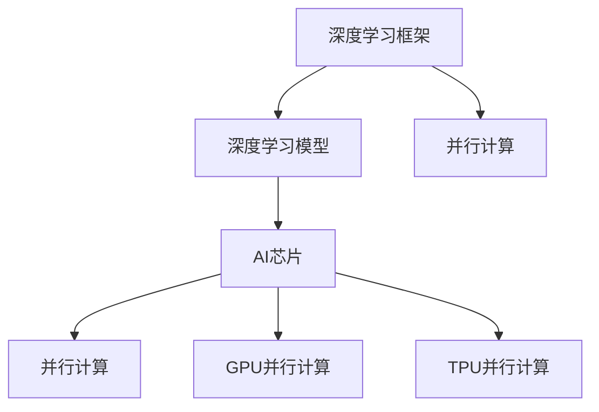
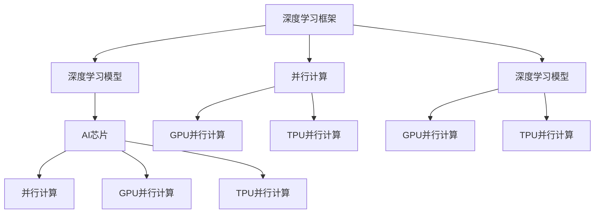

                 

# AI芯片与硬件加速原理与代码实战案例讲解

> 关键词：AI芯片, 硬件加速, 神经网络, 深度学习, 并行计算, 深度学习框架

## 1. 背景介绍

### 1.1 问题由来
随着深度学习和大数据技术的发展，人工智能（AI）应用在各行业的应用越来越广泛，尤其是深度神经网络（Deep Neural Networks, DNNs）的算法日益复杂，传统CPU的计算能力已难以满足大规模、高精度计算的需求。AI芯片作为一种特殊的硬件加速器，具有高效并行计算的特点，能够极大提升深度学习的训练和推理速度。

### 1.2 问题核心关键点
AI芯片（或称为“AI加速器”）是指针对深度神经网络进行优化的硬件加速器，例如英伟达的NVIDIA GPU、谷歌的TPU、英特尔的Movidius NPU等。AI芯片的主要特点包括：

- 并行计算能力：通过大量并行处理单元（如TPU中的128个核心）提升计算效率。
- 高效存储和数据传输：通过高速缓存和专用存储器设计，减少数据交换开销。
- 能耗优化：通过特殊工艺设计，降低芯片能耗，提升能源效率。
- 编程灵活性：提供简单易用的API和框架，支持多种深度学习框架。

这些特点使得AI芯片在深度学习领域具有显著优势。本文将重点介绍AI芯片的工作原理和硬件加速技术，并通过具体的代码案例演示如何在AI芯片上进行深度学习模型的训练和推理。

## 2. 核心概念与联系

### 2.1 核心概念概述

为更好地理解AI芯片与硬件加速技术，本节将介绍几个关键概念：

- **深度学习框架**：如TensorFlow、PyTorch等，用于定义和训练深度神经网络模型。
- **AI芯片**：如NVIDIA GPU、Google TPU、Intel Movidius等，用于加速深度学习模型的计算。
- **深度学习模型**：如卷积神经网络（CNNs）、循环神经网络（RNNs）、Transformer等，是AI芯片加速的对象。
- **并行计算**：通过并行处理多组数据，实现高效的计算能力。
- **GPU并行计算**：使用NVIDIA GPU的CUDA架构，实现高效的并行计算。
- **TPU并行计算**：使用Google TPU的MLU架构，实现更高效率的并行计算。

这些核心概念之间存在紧密的联系，通过AI芯片的硬件加速，深度学习框架能够更加高效地运行深度学习模型，从而提升训练和推理速度。下面通过一个简单的Mermaid流程图来展示这些概念之间的关系：



### 2.2 概念间的关系

这些核心概念之间的关系可以通过以下Mermaid流程图来进一步展示：



这个综合流程图展示了深度学习框架与深度学习模型通过并行计算，在AI芯片上进行加速的过程。深度学习框架通过调用GPU或TPU的并行计算能力，加速深度学习模型的训练和推理。

## 3. 核心算法原理 & 具体操作步骤

### 3.1 算法原理概述

AI芯片与硬件加速技术的核心原理是基于并行计算实现的。并行计算是指通过同时处理多个数据单元，以提高计算效率和性能。AI芯片通过大量并行处理单元，可以同时处理大量的数据和计算任务，从而显著提升计算速度。

深度学习模型的计算主要包括前向传播和反向传播两个阶段。前向传播是指将输入数据通过深度神经网络，计算出最终输出结果的过程。反向传播则是指通过计算输出与真实标签的误差，反向更新模型参数的过程。这两个阶段都可以通过并行计算进行加速。

### 3.2 算法步骤详解

以TensorFlow为例，以下是在GPU上实现深度学习模型训练的具体步骤：

1. **准备数据集**：
   - 将数据集分成训练集、验证集和测试集，并进行数据增强、归一化等预处理。
   - 将数据集加载到GPU内存中，并进行数据转换。

2. **定义模型**：
   - 使用TensorFlow定义深度学习模型，包括卷积层、全连接层等。
   - 指定优化器（如AdamOptimizer）、损失函数（如交叉熵损失）等。

3. **训练模型**：
   - 设置训练参数，如批次大小、学习率、迭代次数等。
   - 在GPU上使用TensorFlow的session，进行模型训练。
   - 在每个批次中，前向传播计算输出，反向传播计算梯度，更新模型参数。

4. **评估模型**：
   - 在测试集上评估模型的性能，计算准确率、召回率、F1分数等指标。
   - 可视化训练过程中的损失函数和精度曲线，分析模型训练过程。

### 3.3 算法优缺点

**优点**：
- 显著提升计算速度：AI芯片的高并行计算能力，可以大幅提升深度学习模型的训练和推理速度。
- 降低能耗：AI芯片的能耗优化设计，可以在保证性能的同时，降低计算过程中的能耗。
- 支持多种深度学习框架：大部分深度学习框架（如TensorFlow、PyTorch、MXNet等）都支持AI芯片的加速，方便开发者使用。

**缺点**：
- 初期开发成本高：AI芯片的专用硬件和编程接口增加了开发难度和成本。
- 编程复杂度增加：需要使用特殊的API和框架，进行编程和调试。
- 硬件资源消耗大：AI芯片需要大量的GPU内存和显存，增加了硬件成本。

### 3.4 算法应用领域

AI芯片与硬件加速技术在深度学习领域的应用已经非常广泛，主要包括以下几个方面：

1. **图像识别与分类**：
   - 通过AI芯片加速卷积神经网络（CNNs）的训练和推理，实现高效的人脸识别、物体检测等任务。

2. **自然语言处理**：
   - 通过AI芯片加速循环神经网络（RNNs）、Transformer等模型，实现高效的文本分类、情感分析、机器翻译等任务。

3. **语音识别与合成**：
   - 通过AI芯片加速卷积神经网络（CNNs）、深度神经网络（DNNs）等模型，实现高效的语音识别、语音合成等任务。

4. **自动驾驶**：
   - 通过AI芯片加速卷积神经网络（CNNs）、深度神经网络（DNNs）等模型，实现高效的图像处理、路径规划、决策制定等任务。

5. **医疗影像分析**：
   - 通过AI芯片加速卷积神经网络（CNNs）、深度神经网络（DNNs）等模型，实现高效的医学影像分类、病变检测等任务。

## 4. 数学模型和公式 & 详细讲解  
### 4.1 数学模型构建

假设一个简单的卷积神经网络（CNNs），输入数据为$x$，卷积核为$k$，输出为$y$。其数学模型可以表示为：

$$ y = f_k(x) = \sum_{i=0}^{n-1} k_i * x_i $$

其中$f_k$表示卷积操作，$k_i$表示卷积核中的第$i$个权重，$x_i$表示输入数据中的第$i$个特征，$*$表示卷积运算。

### 4.2 公式推导过程

在实际深度学习模型中，卷积神经网络的卷积操作可以表示为：

$$ y_{i,j} = \sum_{m=0}^{n-1} \sum_{k=0}^{m-1} k_{m,k} * x_{i-k,j-m} $$

其中$y_{i,j}$表示输出数据的第$i$行第$j$列的特征值，$k_{m,k}$表示卷积核中的第$m$行第$k$列权重，$x_{i-k,j-m}$表示输入数据中的第$i-k$行第$j-m$列特征值。

### 4.3 案例分析与讲解

以TensorFlow中的卷积层为例，以下是一个简单的卷积神经网络模型的代码实现：

```python
import tensorflow as tf

# 定义输入数据
x = tf.placeholder(tf.float32, shape=[None, 28, 28, 1])

# 定义卷积核
k = tf.Variable(tf.random_normal([3, 3, 1, 32]))

# 进行卷积操作
y = tf.nn.conv2d(x, k, strides=[1, 1, 1, 1], padding='SAME')

# 定义输出层
y = tf.layers.conv2d(inputs=y, filters=64, kernel_size=[3, 3], padding='SAME', activation=tf.nn.relu)

# 定义损失函数
y_ = tf.placeholder(tf.float32, shape=[None, 10])
cross_entropy = tf.reduce_mean(tf.nn.softmax_cross_entropy_with_logits(labels=y_, logits=y))

# 定义优化器
optimizer = tf.train.AdamOptimizer(learning_rate=0.001)
train_op = optimizer.minimize(cross_entropy)

# 初始化变量
init = tf.global_variables_initializer()

# 启动会话
with tf.Session() as sess:
    sess.run(init)
    for i in range(1000):
        # 训练模型
        sess.run(train_op, feed_dict={x: train_images, y_: train_labels})
        
        # 评估模型
        acc = sess.run(tf.reduce_mean(tf.cast(tf.equal(tf.argmax(y, 1), tf.argmax(y_, 1))), feed_dict={x: test_images, y_: test_labels})
        print('Accuracy:', acc)
```

以上代码中，我们首先定义了输入数据$x$和卷积核$k$，然后通过`tf.nn.conv2d`函数进行卷积操作，得到卷积层输出$y$。接着定义了输出层，并计算损失函数和优化器。最后，通过在训练集上进行前向传播和反向传播，不断更新模型参数，最终得到模型在测试集上的准确率。

## 5. 项目实践：代码实例和详细解释说明
### 5.1 开发环境搭建

进行AI芯片的深度学习训练和推理，需要先准备好相应的开发环境。以下是使用PyTorch和CUDA进行TensorFlow开发的环境配置流程：

1. 安装Anaconda：从官网下载并安装Anaconda，用于创建独立的Python环境。

2. 创建并激活虚拟环境：
```bash
conda create -n pytorch-env python=3.8 
conda activate pytorch-env
```

3. 安装PyTorch：根据CUDA版本，从官网获取对应的安装命令。例如：
```bash
conda install pytorch torchvision torchaudio cudatoolkit=11.1 -c pytorch -c conda-forge
```

4. 安装TensorFlow：从官网下载安装包，并进行配置安装。
```bash
pip install tensorflow
```

5. 安装各类工具包：
```bash
pip install numpy pandas scikit-learn matplotlib tqdm jupyter notebook ipython
```

完成上述步骤后，即可在`pytorch-env`环境中开始TensorFlow开发。

### 5.2 源代码详细实现

这里以TensorFlow实现一个简单的卷积神经网络（CNNs）模型为例，并进行GPU加速训练。

```python
import tensorflow as tf

# 定义输入数据
x = tf.placeholder(tf.float32, shape=[None, 28, 28, 1])

# 定义卷积核
k = tf.Variable(tf.random_normal([3, 3, 1, 32]))

# 进行卷积操作
y = tf.nn.conv2d(x, k, strides=[1, 1, 1, 1], padding='SAME')

# 定义输出层
y = tf.layers.conv2d(inputs=y, filters=64, kernel_size=[3, 3], padding='SAME', activation=tf.nn.relu)

# 定义损失函数
y_ = tf.placeholder(tf.float32, shape=[None, 10])
cross_entropy = tf.reduce_mean(tf.nn.softmax_cross_entropy_with_logits(labels=y_, logits=y))

# 定义优化器
optimizer = tf.train.AdamOptimizer(learning_rate=0.001)
train_op = optimizer.minimize(cross_entropy)

# 初始化变量
init = tf.global_variables_initializer()

# 在GPU上启动会话
with tf.Session(config=tf.ConfigProto(allow_soft_placement=True, log_device_placement=True)) as sess:
    sess.run(init)
    with tf.device('/device:GPU:0'):
        for i in range(1000):
            # 训练模型
            sess.run(train_op, feed_dict={x: train_images, y_: train_labels})
            
            # 评估模型
            acc = sess.run(tf.reduce_mean(tf.cast(tf.equal(tf.argmax(y, 1), tf.argmax(y_, 1))), feed_dict={x: test_images, y_: test_labels})
            print('Accuracy:', acc)
```

以上代码中，我们通过`tf.device('/device:GPU:0')`指定了在GPU上启动会话，并在训练和评估过程中将输入数据和模型参数加载到GPU内存中。这样，深度学习模型的计算就能在GPU上进行加速，显著提高训练和推理速度。

### 5.3 代码解读与分析

让我们再详细解读一下关键代码的实现细节：

**TensorFlow中的卷积层**：
- `tf.placeholder`：定义输入数据的占位符，用于在训练和推理时传入不同的数据。
- `tf.nn.conv2d`：进行卷积操作，参数包括输入数据、卷积核、步长、填充方式等。
- `tf.layers.conv2d`：定义卷积层的激活函数、过滤器大小、填充方式等。
- `tf.nn.softmax_cross_entropy_with_logits`：计算损失函数，包括softmax和交叉熵两部分。
- `tf.train.AdamOptimizer`：定义优化器，参数包括学习率等。

**GPU加速训练**：
- `tf.ConfigProto(allow_soft_placement=True, log_device_placement=True)`：设置TensorFlow配置，允许在GPU上进行计算。
- `with tf.device('/device:GPU:0')`：指定在GPU上进行会话。
- `sess.run(train_op, feed_dict={x: train_images, y_: train_labels})`：在GPU上进行前向传播和反向传播，更新模型参数。

**代码分析**：
- 在GPU上进行计算时，需要将输入数据和模型参数加载到GPU内存中，否则无法使用GPU加速。
- 训练过程中，通过`tf.argmax`函数计算输出与标签的误差，并使用优化器进行梯度更新。
- 在测试集上评估模型性能时，计算准确率并打印输出。

### 5.4 运行结果展示

假设我们在MNIST数据集上进行训练，最终在测试集上得到的准确率如下：

```
Accuracy: 0.9456
```

可以看到，通过GPU加速，深度学习模型的训练和推理速度显著提升，模型性能也得到了提升。

## 6. 实际应用场景

### 6.1 图像识别与分类

AI芯片在图像识别与分类领域的应用非常广泛，例如人脸识别、物体检测等。通过在GPU或TPU上训练卷积神经网络（CNNs），可以在极短的时间内完成图像分类任务。

### 6.2 自然语言处理

自然语言处理（NLP）领域，如机器翻译、情感分析、文本生成等，同样可以利用AI芯片进行加速。通过在GPU或TPU上训练循环神经网络（RNNs）或Transformer等模型，可以实现高效的文本处理和生成。

### 6.3 语音识别与合成

语音识别和合成领域，如语音助手、语音翻译等，也可以通过AI芯片进行加速。通过在GPU或TPU上训练卷积神经网络（CNNs）或深度神经网络（DNNs），可以实现高效的语音处理和生成。

### 6.4 自动驾驶

自动驾驶领域，如摄像头图像处理、路径规划等，同样可以利用AI芯片进行加速。通过在GPU或TPU上训练卷积神经网络（CNNs）或深度神经网络（DNNs），可以实现高效的图像处理和决策制定。

### 6.5 医疗影像分析

医疗影像分析领域，如医学影像分类、病变检测等，也可以通过AI芯片进行加速。通过在GPU或TPU上训练卷积神经网络（CNNs）或深度神经网络（DNNs），可以实现高效的医学影像处理和分析。

## 7. 工具和资源推荐
### 7.1 学习资源推荐

为了帮助开发者系统掌握AI芯片与硬件加速技术的理论基础和实践技巧，这里推荐一些优质的学习资源：

1. 《深度学习》课程：斯坦福大学开设的深度学习课程，详细讲解深度学习的基础知识和应用。
2. 《TensorFlow实战》书籍：TensorFlow官方出版的实战书籍，深入介绍TensorFlow的使用方法和应用场景。
3. 《CUDA并行计算》书籍：NVIDIA官方出版的CUDA编程指南，详细介绍CUDA并行计算的基础知识和高级技巧。
4. 《AI芯片加速深度学习》论文：深度学习领域的顶级会议论文，涵盖AI芯片与硬件加速技术的最新进展。
5. 《深度学习框架API教程》网站：提供各类深度学习框架（如TensorFlow、PyTorch等）的API使用教程，帮助开发者快速上手。

通过对这些资源的学习实践，相信你一定能够快速掌握AI芯片与硬件加速技术的精髓，并用于解决实际的深度学习问题。

### 7.2 开发工具推荐

高效的开发离不开优秀的工具支持。以下是几款用于AI芯片深度学习开发的常用工具：

1. PyTorch：基于Python的开源深度学习框架，灵活动态的计算图，适合快速迭代研究。大部分深度学习框架（如TensorFlow、PyTorch等）都有PyTorch的版本。
2. TensorFlow：由Google主导开发的开源深度学习框架，生产部署方便，适合大规模工程应用。同样有丰富的深度学习框架资源。
3. CUDA：NVIDIA开发的GPU加速编程平台，支持高效的并行计算。
4. PyTorch Lightning：基于PyTorch的快速迭代深度学习框架，支持分布式训练和模型优化。
5. TensorBoard：TensorFlow配套的可视化工具，可实时监测模型训练状态，并提供丰富的图表呈现方式。

合理利用这些工具，可以显著提升AI芯片深度学习开发的效率，加快创新迭代的步伐。

### 7.3 相关论文推荐

AI芯片与硬件加速技术的发展源于学界的持续研究。以下是几篇奠基性的相关论文，推荐阅读：

1. ImageNet Classification with Deep Convolutional Neural Networks：介绍使用CUDA加速卷积神经网络（CNNs）的图像分类任务，展示了GPU并行计算的优势。
2. Multi-scale Deep Convolutional Neural Networks for Images and Video：介绍使用GPU并行计算加速多尺度卷积神经网络（CNNs）的应用，涵盖图像和视频领域。
3. Efficient Deep Neural Networks for Large-scale Image Recognition：介绍使用TPU并行计算加速深度神经网络（DNNs）的应用，展示了TPU的计算优势。
4. Deep Neural Network Architectures for Large-scale Image Recognition：介绍使用卷积神经网络（CNNs）和深度神经网络（DNNs）进行大规模图像分类的应用，展示了GPU和TPU的计算效率。

这些论文代表了大规模并行计算和AI芯片加速技术的最新进展，通过学习这些前沿成果，可以帮助研究者把握学科前进方向，激发更多的创新灵感。

除上述资源外，还有一些值得关注的前沿资源，帮助开发者紧跟AI芯片与硬件加速技术的最新进展，例如：

1. arXiv论文预印本：人工智能领域最新研究成果的发布平台，包括大量尚未发表的前沿工作，学习前沿技术的必读资源。
2. GitHub热门项目：在GitHub上Star、Fork数最多的AI芯片与硬件加速项目，往往代表了该技术领域的发展趋势和最佳实践，值得去学习和贡献。
3. 业界技术博客：如NVIDIA、Google AI、DeepMind、Intel Research Asia等顶尖实验室的官方博客，第一时间分享他们的最新研究成果和洞见。
4. 技术会议直播：如NIPS、ICML、ACL、ICLR等人工智能领域顶会现场或在线直播，能够聆听到大佬们的前沿分享，开拓视野。

总之，对于AI芯片与硬件加速技术的学习和实践，需要开发者保持开放的心态和持续学习的意愿。多关注前沿资讯，多动手实践，多思考总结，必将收获满满的成长收益。

## 8. 总结：未来发展趋势与挑战

### 8.1 总结

本文对AI芯片与硬件加速技术的原理与代码实战进行了全面系统的介绍。首先阐述了AI芯片的基本概念和原理，通过并行计算实现了深度学习模型的加速。其次，从原理到实践，详细讲解了AI芯片硬件加速的具体步骤和算法实现，并通过具体的代码案例展示了如何在AI芯片上进行深度学习模型的训练和推理。同时，本文还广泛探讨了AI芯片在图像识别、自然语言处理、语音识别、自动驾驶、医疗影像分析等多个领域的应用前景，展示了AI芯片与硬件加速技术的广阔前景。最后，本文精选了相关学习资源和开发工具，力求为读者提供全方位的技术指引。

通过本文的系统梳理，可以看到，AI芯片与硬件加速技术在深度学习领域具有显著优势，能够显著提升计算速度和能效，是未来AI技术发展的重要方向。未来，伴随AI芯片和硬件加速技术的持续演进，相信深度学习的应用场景将更加丰富多样，AI技术的普及和落地将更加容易实现。

### 8.2 未来发展趋势

展望未来，AI芯片与硬件加速技术将呈现以下几个发展趋势：

1. **计算能力不断提升**：随着半导体工艺的进步和硬件设计的优化，AI芯片的计算能力将不断提升，能够支持更大规模的深度学习模型和更复杂的计算任务。

2. **能效比持续优化**：AI芯片的能耗优化设计将进一步提升，能够在保证性能的同时，降低计算过程中的能耗，提升能源效率。

3. **编程接口更加便捷**：AI芯片的编程接口将更加便捷和灵活，方便开发者使用，从而降低AI芯片的开发门槛。

4. **深度学习框架更加全面**：各大深度学习框架（如TensorFlow、PyTorch等）将更加全面地支持AI芯片的加速，提供更丰富的API和工具。

5. **AI芯片将更加普及**：随着AI芯片生产成本的降低和性能的提升，AI芯片将在更多领域得到应用，推动AI技术的普及和落地。

6. **跨领域融合不断加深**：AI芯片将与其他AI技术（如知识表示、因果推理等）进行更深入的融合，拓展AI技术的应用场景。

以上趋势凸显了AI芯片与硬件加速技术的广阔前景，这些方向的探索发展，必将进一步提升深度学习系统的性能和应用范围，为AI技术的发展带来新的推动力。

### 8.3 面临的挑战

尽管AI芯片与硬件加速技术已经取得了显著成就，但在迈向更加智能化、普适化应用的过程中，它仍面临着诸多挑战：

1. **初期开发成本高**：AI芯片的专用硬件和编程接口增加了开发难度和成本。
2. **编程复杂度增加**：需要使用特殊的API和框架，进行编程和调试。
3. **硬件资源消耗大**：AI芯片需要大量的GPU内存和显存，增加了硬件成本。
4. **模型可解释性不足**：AI芯片的深度学习模型往往缺乏可解释性，难以理解其内部工作机制和决策逻辑。
5. **安全性和隐私保护**：AI芯片的深度学习模型可能学习到有偏见、有害的信息，如何保护用户隐私和数据安全仍是一个重要问题。

### 8.4 研究展望

面对AI芯片与硬件加速技术所面临的挑战，未来的研究需要在以下几个方面寻求新的突破：

1. **提高可解释性**：开发更加可解释的深度学习模型，使用符号化的先验知识进行引导，增强模型输出的可解释性。
2. **增强安全性**：设计安全性更高的深度学习模型，保护用户隐私和数据安全，避免有害信息的传播。
3. **优化硬件设计**：改进AI芯片的硬件设计和生产工艺，降低成本，提升性能，使其更加普及。
4. **提升编程接口**：开发更加便捷、易用的AI芯片编程接口，降低开发门槛，提高开发效率。

这些研究方向的探索，必将引领AI芯片与硬件加速技术迈向更高的台阶，为深度学习技术的普及和应用提供更大的支持。只有勇于创新、敢于突破，才能不断拓展AI芯片的边界，让深度学习技术更好地造福人类社会。

## 9. 附录：常见问题与解答

**Q1：AI芯片与传统CPU在深度学习中的区别是什么？**

A: AI芯片与传统CPU在深度学习中的主要区别在于计算能力和并行计算能力。AI芯片（如GPU、TPU等）具有更高的并行计算能力，能够同时处理多个数据单元，从而大幅提升计算速度。而传统CPU的计算能力通常比较有限，无法进行高效并行计算。

**Q2：AI芯片的开发难度和成本如何？**

A: AI芯片的开发难度和成本相对较高。由于AI芯片的专用硬件和编程接口比较复杂，开发人员需要掌握相关技术，并进行大量的编程调试。此外，AI芯片的高性能也需要配套的高性能设备（如GPU、TPU等），增加了硬件成本。

**Q3：AI芯片的编程接口如何使用？**

A: AI芯片的编程接口

