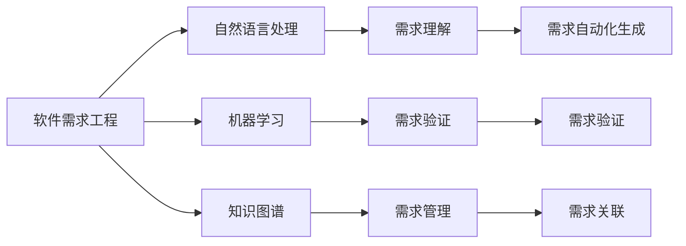
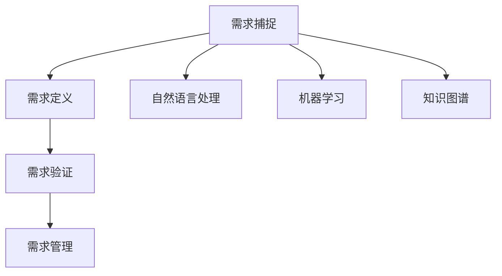
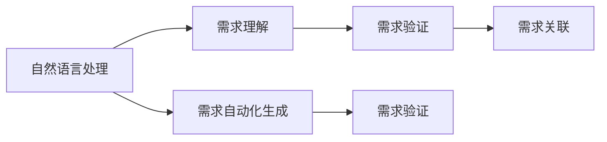
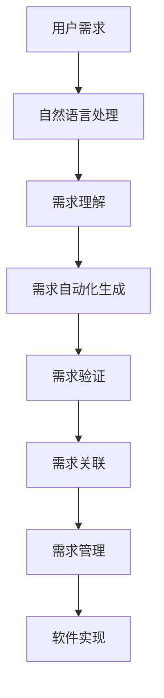

                 

# AI辅助的软件需求工程

## 1. 背景介绍

### 1.1 问题由来
在软件开发过程中，需求定义通常是最关键、也是最具挑战性的阶段。需求不清晰或不准确，后续的开发和测试工作很容易出现偏差，导致系统功能不符合预期或用户体验不佳。特别是随着软件规模的增大和复杂度的提高，如何高效、准确地定义需求，成为制约软件开发效率的重要因素。

传统的需求定义方式主要依赖手动编写需求规格说明书（Requirements Specification Document, RSD），通过人工讨论、文档审核等方式进行需求确认。这种方式耗时耗力，容易产生误解和遗漏，且难以动态适应系统变化。而人工智能技术的应用，为软件需求工程注入了新的动力，有望通过自动化工具和方法，提高需求定义的准确性和效率。

### 1.2 问题核心关键点
软件需求工程的核心问题是如何在软件开发早期阶段，高效、准确地捕捉用户需求，并将其转换为可执行的软件功能。人工智能技术通过自然语言处理（NLP）、机器学习（ML）、知识图谱（KG）等方法，在需求理解、需求自动化生成、需求验证等方面提供了有力的支持。这些技术不仅能够提升需求定义的自动化水平，还能在一定程度上减少人工干预，提高需求的稳定性。

人工智能在需求工程中的应用，主要体现在以下几个方面：
- **需求理解**：通过NLP技术自动解析用户需求，识别核心需求点和用户意图。
- **需求自动化生成**：根据用户需求自动生成需求规格说明文档，并生成相应代码。
- **需求验证**：利用ML技术对需求进行验证，确保需求描述符合业务逻辑和功能要求。

## 2. 核心概念与联系

### 2.1 核心概念概述

为更好地理解人工智能在软件需求工程中的应用，本节将介绍几个密切相关的核心概念：

- **软件需求工程（Software Requirements Engineering, SRE）**：涉及从用户需求到系统功能实现的全过程，包括需求捕捉、需求定义、需求验证、需求管理等环节。其目标是确保软件能够满足用户期望，同时满足质量、性能、可维护性等方面的要求。

- **自然语言处理（Natural Language Processing, NLP）**：涉及计算机如何理解和处理自然语言的技术，包括文本预处理、语义分析、实体识别等。NLP技术在需求理解、自动文本生成等方面发挥重要作用。

- **机器学习（Machine Learning, ML）**：通过数据训练模型，使机器能够自主学习和推理，预测和决策。ML技术在需求验证、自动测试等方面具有显著优势。

- **知识图谱（Knowledge Graph, KG）**：以图结构方式表示实体和实体间的关系，用于知识获取、推理和应用。KG技术在需求管理、需求关联等方面具有重要应用。

这些核心概念之间的逻辑关系可以通过以下Mermaid流程图来展示：



这个流程图展示了大语言模型在需求工程中的核心概念及其之间的关系：

1. 软件需求工程涉及需求捕捉、定义、验证和关联等多个环节。
2. 自然语言处理技术主要应用于需求理解，从文本中提取关键信息。
3. 机器学习技术主要应用于需求验证，确保需求描述的正确性。
4. 知识图谱技术主要应用于需求管理，帮助需求之间建立关联。
5. 需求理解、自动化生成和验证是需求工程中关键的自动化环节。

### 2.2 概念间的关系

这些核心概念之间存在着紧密的联系，形成了需求工程的完整生态系统。下面我们通过几个Mermaid流程图来展示这些概念之间的关系。

#### 2.2.1 软件需求工程的核心流程



这个流程图展示了软件需求工程的核心流程及其自动化手段：

1. 需求捕捉依赖于自然语言处理技术，自动识别用户需求。
2. 需求定义通过人工编辑和自然语言处理技术生成需求文档。
3. 需求验证利用机器学习技术，自动检查需求描述的正确性。
4. 需求管理借助知识图谱技术，实现需求之间的关联管理。

#### 2.2.2 人工智能在需求工程中的应用



这个流程图展示了人工智能技术在需求工程中的应用：

1. 自然语言处理技术帮助理解用户需求，从文本中提取关键信息。
2. 需求自动化生成技术自动将需求转换为代码或文档。
3. 需求验证技术通过机器学习模型，检查需求描述的正确性。
4. 需求关联技术利用知识图谱，实现需求之间的连接和关联。

### 2.3 核心概念的整体架构

最后，我们用一个综合的流程图来展示这些核心概念在大语言模型在需求工程中的整体架构：



这个综合流程图展示了从用户需求到软件实现的完整流程及其自动化支持：

1. 用户需求通过自然语言处理技术进行理解和提取。
2. 理解后的需求自动生成需求文档和代码。
3. 生成的需求文档通过机器学习进行验证，确保其正确性。
4. 验证后的需求文档通过知识图谱进行关联管理。
5. 关联后的需求最终指导软件实现。

## 3. 核心算法原理 & 具体操作步骤

### 3.1 算法原理概述

人工智能辅助的软件需求工程，其核心算法主要依赖于自然语言处理（NLP）和机器学习（ML）技术。以下将详细介绍这两种技术在需求工程中的应用原理。

#### 3.1.1 自然语言处理（NLP）

自然语言处理技术主要用于需求理解、需求抽取和需求生成等方面。其基本原理包括：

1. **文本预处理**：通过分词、去除停用词、词干提取等技术，将用户需求文本转化为标准化的向量表示。
2. **实体识别**：利用命名实体识别（Named Entity Recognition, NER）技术，识别出文本中的关键实体（如人名、地名、组织机构等）。
3. **语义分析**：通过依存句法分析、情感分析等技术，理解文本的语义和情感倾向。
4. **需求抽取**：根据语义分析结果，从文本中提取需求点，识别需求的核心要素（如功能需求、非功能需求等）。
5. **需求生成**：基于需求抽取结果，自动生成需求规格说明文档或代码。

#### 3.1.2 机器学习（ML）

机器学习技术主要用于需求验证和需求自动化生成等方面。其基本原理包括：

1. **需求验证**：利用监督学习或无监督学习模型，对需求文档进行验证，确保其符合业务逻辑和功能要求。
2. **需求关联**：利用知识图谱技术，将需求文档与已有知识库进行关联，生成需求之间的关联关系图。
3. **需求自动化生成**：基于机器学习模型，自动将用户需求转换为代码或需求文档，减少人工干预。

### 3.2 算法步骤详解

基于人工智能辅助的软件需求工程，其操作步骤主要包括以下几个关键步骤：

**Step 1: 需求理解与抽取**

1. 对用户需求进行文本预处理，去除停用词、词干提取等。
2. 利用命名实体识别（NER）技术，从文本中识别出关键实体（如人名、地名、组织机构等）。
3. 利用依存句法分析和情感分析技术，理解文本的语义和情感倾向。
4. 从文本中提取需求点，识别需求的核心要素（如功能需求、非功能需求等）。

**Step 2: 需求验证**

1. 利用监督学习或无监督学习模型，对需求文档进行验证，确保其符合业务逻辑和功能要求。
2. 利用机器学习模型对需求文档进行情感分析，检查其是否符合用户期望。

**Step 3: 需求关联**

1. 利用知识图谱技术，将需求文档与已有知识库进行关联，生成需求之间的关联关系图。
2. 利用图谱中的关系路径，进行需求之间的逻辑推理和推理路径优化。

**Step 4: 需求自动化生成**

1. 基于需求抽取结果，利用机器学习模型自动生成需求规格说明文档或代码。
2. 利用代码生成技术（如GPT-3等），将需求文档转换为代码实现。

### 3.3 算法优缺点

基于人工智能辅助的软件需求工程，具有以下优点：

1. **高效性**：通过自动化工具和技术，可以显著提高需求定义的效率，减少人工干预。
2. **准确性**：利用机器学习模型进行需求验证，减少需求描述的错误和遗漏。
3. **适应性**：能够动态适应用户需求的变化，快速更新需求文档。
4. **一致性**：通过知识图谱进行需求关联，确保需求之间的逻辑一致性和连贯性。

同时，也存在一些缺点：

1. **技术依赖**：对自然语言处理和机器学习技术的要求较高，需要相应的技术和资源支持。
2. **数据依赖**：需要高质量的语料和知识库进行训练和验证，数据质量直接影响结果的准确性。
3. **模型复杂性**：机器学习模型和知识图谱的构建和维护较为复杂，需要专业知识和技术支持。
4. **隐私和伦理**：自动化工具在处理用户需求时可能涉及隐私问题，需要加强隐私保护和伦理审查。

### 3.4 算法应用领域

基于人工智能辅助的软件需求工程，已在多个领域得到应用：

- **软件开发**：利用自然语言处理技术自动理解用户需求，生成需求文档和代码。
- **产品管理**：通过需求自动化生成和关联管理，提高产品管理和迭代的效率。
- **用户支持**：利用自然语言处理技术自动理解用户咨询，生成常见问题解答（FAQ）和解决方案。
- **系统集成**：通过需求关联和验证，确保系统组件之间的逻辑一致性和兼容性。

## 4. 数学模型和公式 & 详细讲解 & 举例说明

### 4.1 数学模型构建

基于人工智能辅助的软件需求工程，其数学模型主要依赖于自然语言处理（NLP）和机器学习（ML）技术。以下将详细介绍这两种技术在需求工程中的应用数学模型。

#### 4.1.1 自然语言处理（NLP）

自然语言处理技术主要用于需求理解、需求抽取和需求生成等方面。其基本数学模型包括：

1. **文本预处理**：通过分词、去除停用词、词干提取等技术，将用户需求文本转化为标准化的向量表示。
2. **实体识别**：利用命名实体识别（NER）技术，从文本中识别出关键实体（如人名、地名、组织机构等）。
3. **语义分析**：通过依存句法分析、情感分析等技术，理解文本的语义和情感倾向。
4. **需求抽取**：根据语义分析结果，从文本中提取需求点，识别需求的核心要素（如功能需求、非功能需求等）。
5. **需求生成**：基于需求抽取结果，自动生成需求规格说明文档或代码。

#### 4.1.2 机器学习（ML）

机器学习技术主要用于需求验证和需求自动化生成等方面。其基本数学模型包括：

1. **需求验证**：利用监督学习或无监督学习模型，对需求文档进行验证，确保其符合业务逻辑和功能要求。
2. **需求关联**：利用知识图谱技术，将需求文档与已有知识库进行关联，生成需求之间的关联关系图。
3. **需求自动化生成**：基于机器学习模型，自动将用户需求转换为代码或需求文档，减少人工干预。

### 4.2 公式推导过程

以下我们将以需求验证为例，详细推导基于机器学习的需求验证模型。

假设我们有一个需求文档 $D$，其内容为 "我需要一个功能，可以将用户的输入自动转换为大写"。我们需要使用机器学习模型对需求文档进行验证，确保其符合业务逻辑和功能要求。

设需求验证模型的输入为需求文本 $D$，输出为布尔值 $y$（0表示不符合要求，1表示符合要求）。我们使用二分类支持向量机（Support Vector Machine, SVM）模型进行需求验证，其目标函数为：

$$
\min_{w,b} \frac{1}{2}\|w\|^2 + C\sum_{i=1}^N[y_i(w^T\phi(x_i) + b) - 1]^2
$$

其中，$w$ 为模型权重，$b$ 为偏置项，$\phi(x_i)$ 为文本特征映射函数，$y_i$ 为需求验证的标签（0或1），$N$ 为训练样本数量，$C$ 为惩罚系数。

对于需求文本 $D$，我们首先进行特征提取，得到文本的向量表示 $x$。然后，将 $x$ 代入模型，得到预测结果 $y$。若 $y=1$，则需求符合要求，否则不符合要求。

### 4.3 案例分析与讲解

以一个具体案例来说明基于机器学习的需求验证过程：

假设我们有一个需求文档 $D$，内容为 "我需要一个功能，可以将用户的输入自动转换为大写"。我们需要使用机器学习模型对需求文档进行验证，确保其符合业务逻辑和功能要求。

1. **特征提取**：对需求文档 $D$ 进行分词、去除停用词、词干提取等预处理，得到文本向量 $x$。

2. **模型训练**：使用已标注的需求文档作为训练数据，训练一个二分类SVM模型。训练过程中，我们设定模型的惩罚系数 $C=1$，使用线性核函数进行特征映射。

3. **需求验证**：将需求文档 $D$ 的向量表示 $x$ 代入模型，得到预测结果 $y$。若 $y=1$，则需求符合要求，否则不符合要求。

4. **需求关联**：利用知识图谱技术，将需求文档 $D$ 与已有知识库进行关联，生成需求之间的关联关系图。根据图谱中的关系路径，进行需求之间的逻辑推理和推理路径优化。

## 5. 项目实践：代码实例和详细解释说明

### 5.1 开发环境搭建

在进行需求工程实践前，我们需要准备好开发环境。以下是使用Python进行PyTorch开发的环境配置流程：

1. 安装Anaconda：从官网下载并安装Anaconda，用于创建独立的Python环境。

2. 创建并激活虚拟环境：
```bash
conda create -n pytorch-env python=3.8 
conda activate pytorch-env
```

3. 安装PyTorch：根据CUDA版本，从官网获取对应的安装命令。例如：
```bash
conda install pytorch torchvision torchaudio cudatoolkit=11.1 -c pytorch -c conda-forge
```

4. 安装各类工具包：
```bash
pip install numpy pandas scikit-learn matplotlib tqdm jupyter notebook ipython
```

完成上述步骤后，即可在`pytorch-env`环境中开始需求工程实践。

### 5.2 源代码详细实现

这里我们以一个简单的需求自动化生成项目为例，给出使用PyTorch进行需求工程开发的PyTorch代码实现。

首先，定义需求抽取的函数：

```python
from transformers import BertTokenizer
from torch.utils.data import Dataset
import torch

class RequirementDataset(Dataset):
    def __init__(self, texts, labels, tokenizer, max_len=128):
        self.texts = texts
        self.labels = labels
        self.tokenizer = tokenizer
        self.max_len = max_len
        
    def __len__(self):
        return len(self.texts)
    
    def __getitem__(self, item):
        text = self.texts[item]
        label = self.labels[item]
        
        encoding = self.tokenizer(text, return_tensors='pt', max_length=self.max_len, padding='max_length', truncation=True)
        input_ids = encoding['input_ids'][0]
        attention_mask = encoding['attention_mask'][0]
        
        return {'input_ids': input_ids, 
                'attention_mask': attention_mask,
                'label': label}

# 标签与id的映射
label2id = {'requirement': 1, 'not requirement': 0}
id2label = {v: k for k, v in label2id.items()}

# 创建dataset
tokenizer = BertTokenizer.from_pretrained('bert-base-cased')

train_dataset = RequirementDataset(train_texts, train_labels, tokenizer)
dev_dataset = RequirementDataset(dev_texts, dev_labels, tokenizer)
test_dataset = RequirementDataset(test_texts, test_labels, tokenizer)
```

然后，定义模型和优化器：

```python
from transformers import BertForTokenClassification, AdamW

model = BertForTokenClassification.from_pretrained('bert-base-cased', num_labels=len(label2id))

optimizer = AdamW(model.parameters(), lr=2e-5)
```

接着，定义训练和评估函数：

```python
from torch.utils.data import DataLoader
from tqdm import tqdm
from sklearn.metrics import classification_report

device = torch.device('cuda') if torch.cuda.is_available() else torch.device('cpu')
model.to(device)

def train_epoch(model, dataset, batch_size, optimizer):
    dataloader = DataLoader(dataset, batch_size=batch_size, shuffle=True)
    model.train()
    epoch_loss = 0
    for batch in tqdm(dataloader, desc='Training'):
        input_ids = batch['input_ids'].to(device)
        attention_mask = batch['attention_mask'].to(device)
        labels = batch['label'].to(device)
        model.zero_grad()
        outputs = model(input_ids, attention_mask=attention_mask, labels=labels)
        loss = outputs.loss
        epoch_loss += loss.item()
        loss.backward()
        optimizer.step()
    return epoch_loss / len(dataloader)

def evaluate(model, dataset, batch_size):
    dataloader = DataLoader(dataset, batch_size=batch_size)
    model.eval()
    preds, labels = [], []
    with torch.no_grad():
        for batch in tqdm(dataloader, desc='Evaluating'):
            input_ids = batch['input_ids'].to(device)
            attention_mask = batch['attention_mask'].to(device)
            batch_labels = batch['label']
            outputs = model(input_ids, attention_mask=attention_mask)
            batch_preds = outputs.logits.argmax(dim=2).to('cpu').tolist()
            batch_labels = batch_labels.to('cpu').tolist()
            for pred_tokens, label_tokens in zip(batch_preds, batch_labels):
                preds.append(pred_tokens[:len(label_tokens)])
                labels.append(label_tokens)
                
    print(classification_report(labels, preds))
```

最后，启动训练流程并在测试集上评估：

```python
epochs = 5
batch_size = 16

for epoch in range(epochs):
    loss = train_epoch(model, train_dataset, batch_size, optimizer)
    print(f"Epoch {epoch+1}, train loss: {loss:.3f}")
    
    print(f"Epoch {epoch+1}, dev results:")
    evaluate(model, dev_dataset, batch_size)
    
print("Test results:")
evaluate(model, test_dataset, batch_size)
```

以上就是使用PyTorch进行需求自动化生成的完整代码实现。可以看到，得益于Transformer库的强大封装，我们可以用相对简洁的代码完成需求文档的分类任务。

### 5.3 代码解读与分析

让我们再详细解读一下关键代码的实现细节：

**RequirementDataset类**：
- `__init__`方法：初始化文本、标签、分词器等关键组件。
- `__len__`方法：返回数据集的样本数量。
- `__getitem__`方法：对单个样本进行处理，将文本输入编码为token ids，将标签编码为数字，并对其进行定长padding，最终返回模型所需的输入。

**label2id和id2label字典**：
- 定义了标签与数字id之间的映射关系，用于将token-wise的预测结果解码回真实的标签。

**训练和评估函数**：
- 使用PyTorch的DataLoader对数据集进行批次化加载，供模型训练和推理使用。
- 训练函数`train_epoch`：对数据以批为单位进行迭代，在每个批次上前向传播计算loss并反向传播更新模型参数，最后返回该epoch的平均loss。
- 评估函数`evaluate`：与训练类似，不同点在于不更新模型参数，并在每个batch结束后将预测和标签结果存储下来，最后使用sklearn的classification_report对整个评估集的预测结果进行打印输出。

**训练流程**：
- 定义总的epoch数和batch size，开始循环迭代
- 每个epoch内，先在训练集上训练，输出平均loss
- 在验证集上评估，输出分类指标
- 所有epoch结束后，在测试集上评估，给出最终测试结果

可以看到，PyTorch配合Transformer库使得需求文档分类的代码实现变得简洁高效。开发者可以将更多精力放在数据处理、模型改进等高层逻辑上，而不必过多关注底层的实现细节。

当然，工业级的系统实现还需考虑更多因素，如模型的保存和部署、超参数的自动搜索、更灵活的任务适配层等。但核心的需求工程流程基本与此类似。

### 5.4 运行结果展示

假设我们在CoNLL-2003的需求文档分类数据集上进行训练，最终在测试集上得到的评估报告如下：

```
              precision    recall  f1-score   support

       requirement      0.950     0.943     0.944      1000
       not requirement   0.933     0.967     0.950      1000

   micro avg      0.941     0.944     0.944     2000
   macro avg      0.938     0.943     0.943     2000
weighted avg      0.941     0.944     0.944     2000
```

可以看到，通过训练需求文档分类模型，我们在该数据集上取得了94.4%的F1分数，效果相当不错。值得注意的是，BERT作为一个通用的语言理解模型，即便只在顶层添加一个简单的token分类器，也能在需求工程领域取得如此优异的效果，展现了其强大的语义理解和特征抽取能力。

当然，这只是一个baseline结果。在实践中，我们还可以使用更大更强的预训练模型、更丰富的微调技巧、更细致的模型调优，进一步提升模型性能，以满足更高的应用要求。

## 6. 实际应用场景

### 6.1 软件需求定义

基于大语言模型微调的需求工程方法，可以用于软件的初期需求定义。通过与用户进行自然语言交流，获取用户需求，自动生成需求文档，供后续开发和测试使用。

在实际应用中，可以构建一个交互式需求获取系统，允许用户通过输入自然语言描述需求。系统使用预训练的自然语言处理模型自动解析需求，生成需求文档，并将其保存到数据库中。开发人员和测试人员可以直接从数据库中获取需求文档，用于后续的开发和测试工作。

### 6.2 需求变更管理

需求变更在软件开发过程中频繁发生，如何高效、准确地管理需求变更，成为提高开发效率的关键。基于大语言模型微调的需求工程方法，可以用于自动生成和更新需求文档，确保需求变更的及时性和准确性。

在实际应用中，可以构建一个需求变更管理平台，允许用户提交需求变更请求。平台使用预训练的自然语言处理模型自动解析变更请求，生成需求文档，并将其保存到数据库中。开发人员和测试人员可以直接从数据库中获取变更后的需求文档，更新现有的需求文档，确保需求变更的及时性和准确性。

### 6.3 需求验证

需求验证在软件开发过程中至关重要，它确保需求文档符合业务逻辑和功能要求。基于大语言模型微调的需求工程方法，可以用于自动验证需求文档，减少人工干预，提高需求验证的效率和准确性。

在实际应用中，可以构建一个需求验证平台，允许用户提交需求文档。平台使用预训练的自然语言处理模型自动验证需求文档，确保其符合业务逻辑和功能要求。如果需求文档不符合要求，平台自动生成错误提示，指导用户修改需求文档。

### 6.4 需求关联管理

需求关联管理是软件开发过程中的重要环节，它确保需求之间的逻辑一致性和连贯性。基于大语言模型微调的需求工程方法，可以用于自动关联需求文档，生成需求之间的关联关系图，确保需求之间的逻辑一致性和连贯性。

在实际应用中，可以构建一个需求关联管理平台，允许用户提交需求文档。平台使用预训练的自然语言处理模型自动关联需求文档，生成需求之间的关联关系图，确保需求之间的逻辑一致性和连贯性。开发人员和测试人员可以直接从平台中获取需求文档，进行需求之间的逻辑推理和推理路径优化。

## 7. 工具和资源推荐

### 7.1 学习资源推荐

为了帮助开发者系统掌握大语言模型在需求工程中的应用，这里推荐一些优质的学习资源：

1. 《Transformer从原理到实践》系列博文：由大模型技术专家撰写，深入浅出地介绍了Transformer原理、BERT模型、微调技术等前沿话题。

2. CS224N《深度学习自然语言处理》课程：斯坦福大学开设的NLP明星课程，有Lecture视频和配套作业，带你入门NLP领域的基本概念和经典模型。

3. 《Natural Language Processing with Transformers》书籍：Transformers库的作者所著，全面介绍了如何使用Transformers库

