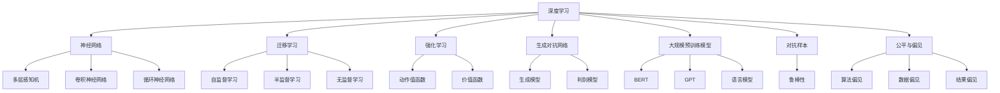
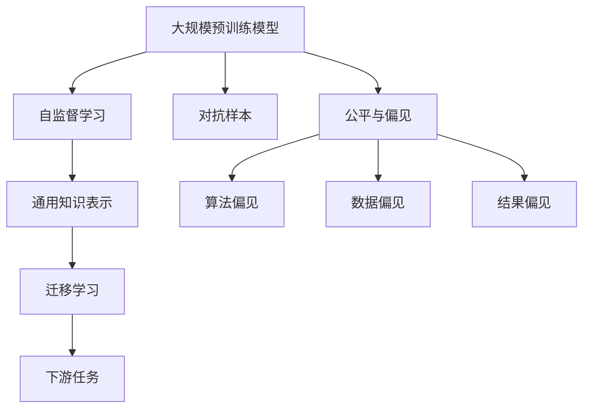

                 

## 1. 背景介绍

### 1.1 问题由来
随着人工智能(AI)技术的快速发展，人类社会正经历一场深刻的变革。AI的进展不仅影响了科技和商业领域，还深刻改变了人类的生产生活方式。在过去十年中，AI领域的几个关键时刻，如AlphaGo战胜世界围棋冠军、GPT-3横空出世、AI辅助医疗诊断等，均标志着AI技术进入了新的发展阶段。

### 1.2 问题核心关键点
AI领域的独特时刻具有以下几个显著特征：
- **突破性进展**：AlphaGo的胜利、GPT-3的诞生，均实现了跨越式进步，带来了新的技术范式。
- **跨领域应用**：AI技术不仅在科技领域大放异彩，还在医疗、教育、金融等传统行业实现了深度融合。
- **社会影响力**：AI技术的应用日益广泛，对社会经济、伦理道德等方面产生深远影响。
- **伦理与安全**：AI技术带来的自动化、决策公平性等问题，成为社会各界关注的焦点。

### 1.3 问题研究意义
理解AI领域的独特时刻，有助于把握AI技术的未来发展方向，预测其对社会的深远影响。同时，通过探讨AI技术的应用、挑战和伦理问题，可以为AI技术的进一步应用提供理论指导和实践建议，促进其健康可持续发展。

## 2. 核心概念与联系

### 2.1 核心概念概述

为更好地理解AI领域的独特时刻及其未来发展，本节将介绍几个核心概念及其相互关系：

- **深度学习**：指基于神经网络的机器学习方法，通过多层非线性变换，实现对复杂模式的学习和识别。
- **强化学习**：一种通过试错逐步优化策略的学习范式，广泛应用于游戏、机器人控制等任务中。
- **迁移学习**：将一个领域学到的知识迁移到另一个相关领域，提高新任务的性能。
- **生成对抗网络(GAN)**：一种生成模型，通过两个对抗模型生成逼真的图像、文本等内容。
- **大规模预训练模型**：如BERT、GPT等，通过大规模语料预训练，学习通用的语言和知识表示。
- **对抗样本**：对模型进行针对性扰动，使其错误分类，用于评估模型鲁棒性。
- **公平与偏见**：指AI模型在决策过程中是否公平、不带有偏见，是当前研究的热点问题。

这些概念共同构成了AI领域的研究框架，展示了其在各个方面的突破与进展。

### 2.2 概念间的关系

这些核心概念之间的关系可以通过以下Mermaid流程图来展示：



这个流程图展示了大规模预训练模型在大规模数据上自监督学习，得到通用的知识表示，这些表示被迁移学习应用到不同的任务中，如自然语言处理、计算机视觉、语音识别等。同时，深度学习和强化学习是AI领域的核心驱动力，对抗样本和公平性问题是当前研究中重要的挑战。

### 2.3 核心概念的整体架构

最后，我们用一个综合的流程图来展示这些核心概念在大规模预训练和迁移学习中的整体架构：



这个综合流程图展示了从大规模预训练到迁移学习的全流程，其中对抗样本和公平性问题是当前研究中重要的挑战。

## 3. 核心算法原理 & 具体操作步骤

### 3.1 算法原理概述

AI领域的独特时刻在多个核心算法上取得了重要进展。以下是几个代表性算法及其原理概述：

- **深度学习算法**：通过多层神经网络对数据进行建模，其中前馈神经网络(如CNN)和循环神经网络(RNN)被广泛应用于图像、语音和文本等领域。
- **强化学习算法**：通过环境反馈和奖励机制，学习最优策略，广泛应用于游戏、机器人控制等领域。
- **迁移学习算法**：通过在源任务上学习知识，并将其迁移到目标任务中，提升目标任务的性能。
- **生成对抗网络算法**：通过两个对抗网络，生成逼真的数据，广泛应用于图像、文本生成等领域。
- **大规模预训练模型算法**：通过在大规模无标签数据上进行预训练，学习通用的知识表示，然后在下游任务上进行微调，实现高性能。

### 3.2 算法步骤详解

以下是深度学习和生成对抗网络算法的基本步骤详解：

**深度学习算法步骤**：
1. 数据准备：收集和清洗数据，构建数据集。
2. 模型设计：选择适当的神经网络架构，如CNN、RNN、Transformer等。
3. 训练过程：通过反向传播算法，不断调整模型参数，最小化损失函数。
4. 验证和测试：使用验证集评估模型性能，确保不发生过拟合，然后在测试集上进行最终评估。

**生成对抗网络算法步骤**：
1. 生成器设计：构建生成网络，生成逼真的样本。
2. 判别器设计：构建判别网络，区分真实样本和生成样本。
3. 对抗训练：交替训练生成器和判别器，生成器尽量欺骗判别器，判别器尽量区分生成样本和真实样本。
4. 输出和应用：使用训练好的生成器，生成逼真的数据，应用于图像生成、文本生成等领域。

### 3.3 算法优缺点

AI领域的关键算法各有优缺点：

**深度学习算法**：
- **优点**：可以处理复杂非线性的数据，适用于图像、语音、文本等多种数据类型。
- **缺点**：需要大量标注数据进行训练，容易过拟合，计算成本高。

**强化学习算法**：
- **优点**：适用于复杂环境，无需大量标注数据，鲁棒性好。
- **缺点**：训练过程慢，需要大量的试错，难以实现高精度。

**迁移学习算法**：
- **优点**：能够在数据量少的情况下提升模型性能，应用广泛。
- **缺点**：需要找到合适的迁移方式，难以保证迁移的效果。

**生成对抗网络算法**：
- **优点**：可以生成逼真的数据，适用于数据量少的领域。
- **缺点**：需要设计复杂的生成器和判别器，训练过程复杂。

### 3.4 算法应用领域

AI领域的核心算法已经在多个领域得到广泛应用，包括但不限于以下几个方面：

- **计算机视觉**：图像分类、物体检测、图像生成等。
- **自然语言处理**：语言模型、机器翻译、文本生成等。
- **语音识别**：语音识别、语音合成等。
- **机器人控制**：机器人导航、对象抓取、操作规划等。
- **医疗健康**：辅助诊断、个性化治疗、智能健康管理等。
- **金融领域**：风险评估、客户服务、投资策略等。
- **教育领域**：智能辅导、课程推荐、学习分析等。
- **娱乐领域**：游戏AI、虚拟角色、互动媒体等。

这些应用展示了AI技术在各个领域的广泛应用和深远影响。

## 4. 数学模型和公式 & 详细讲解  
### 4.1 数学模型构建

本节将使用数学语言对AI领域核心算法的数学模型进行详细讲解。

- **深度学习数学模型**：神经网络由多个层组成，每一层通过线性变换和激活函数，将输入映射到下一层。深度学习中的前馈神经网络采用反向传播算法，通过最小化损失函数来更新模型参数。
- **生成对抗网络数学模型**：生成对抗网络由生成器和判别器组成，通过交替优化两个网络，使生成器生成逼真的数据，判别器区分真实数据和生成数据。

### 4.2 公式推导过程

以下是深度学习算法和生成对抗网络算法的基本公式推导：

**深度学习算法公式**：
- 前馈神经网络：
$$
y = f(Wx + b)
$$
其中，$f$为激活函数，$W$和$b$为模型参数。
- 反向传播算法：
$$
\frac{\partial L}{\partial w_i} = \frac{\partial L}{\partial z_i} \frac{\partial z_i}{\partial w_i}
$$
其中，$L$为损失函数，$z_i$为中间层输出。

**生成对抗网络算法公式**：
- 生成器优化目标：
$$
\max_{G} V(G(D))
$$
其中，$G$为生成器，$D$为判别器，$V$为判别器的价值函数。
- 判别器优化目标：
$$
\min_{D} V(G(D))
$$
其中，$D$为判别器，$G$为生成器，$V$为判别器的价值函数。

### 4.3 案例分析与讲解

以计算机视觉中的图像分类为例，深度学习算法的基本流程如下：
1. 数据准备：收集和清洗图像数据，构建训练集和测试集。
2. 模型设计：选择卷积神经网络(CNN)作为基本架构，添加池化层、全连接层等。
3. 训练过程：使用随机梯度下降(SGD)算法，最小化交叉熵损失函数，不断调整模型参数。
4. 验证和测试：使用验证集评估模型性能，确保不发生过拟合，然后在测试集上进行最终评估。

## 5. 项目实践：代码实例和详细解释说明

### 5.1 开发环境搭建

在进行AI项目实践前，我们需要准备好开发环境。以下是使用Python进行TensorFlow和Keras开发的环境配置流程：

1. 安装Anaconda：从官网下载并安装Anaconda，用于创建独立的Python环境。

2. 创建并激活虚拟环境：
```bash
conda create -n tensorflow-env python=3.8 
conda activate tensorflow-env
```

3. 安装TensorFlow和Keras：
```bash
conda install tensorflow keras
```

4. 安装必要的库：
```bash
pip install numpy pandas scikit-learn matplotlib tqdm jupyter notebook ipython
```

完成上述步骤后，即可在`tensorflow-env`环境中开始AI项目实践。

### 5.2 源代码详细实现

下面我们以图像分类任务为例，给出使用TensorFlow和Keras进行深度学习模型开发的PyTorch代码实现。

首先，定义图像分类模型：

```python
import tensorflow as tf
from tensorflow.keras import layers

model = tf.keras.Sequential([
    layers.Conv2D(32, (3,3), activation='relu', input_shape=(28,28,1)),
    layers.MaxPooling2D((2,2)),
    layers.Conv2D(64, (3,3), activation='relu'),
    layers.MaxPooling2D((2,2)),
    layers.Flatten(),
    layers.Dense(64, activation='relu'),
    layers.Dense(10, activation='softmax')
])
```

然后，定义损失函数和优化器：

```python
model.compile(optimizer='adam',
              loss='sparse_categorical_crossentropy',
              metrics=['accuracy'])
```

接着，加载和预处理数据：

```python
(x_train, y_train), (x_test, y_test) = tf.keras.datasets.mnist.load_data()
x_train = x_train.reshape(-1, 28, 28, 1) / 255.0
x_test = x_test.reshape(-1, 28, 28, 1) / 255.0
```

最后，训练和评估模型：

```python
model.fit(x_train, y_train, epochs=10, validation_data=(x_test, y_test))
model.evaluate(x_test, y_test)
```

以上就是使用TensorFlow和Keras进行图像分类任务的基本代码实现。可以看到，通过Keras的高层封装，我们可以快速构建和训练深度学习模型，大大简化了开发流程。

### 5.3 代码解读与分析

让我们再详细解读一下关键代码的实现细节：

**Sequential模型**：
- 使用Keras的Sequential模型，按顺序堆叠多个层，实现神经网络模型。
- 添加卷积层和池化层，提取图像特征。
- 添加全连接层和softmax输出层，进行分类。

**模型编译**：
- 使用Adam优化器，最小化交叉熵损失函数，输出分类准确率。

**数据加载和预处理**：
- 使用MNIST数据集，获取训练集和测试集。
- 将图像数据reshape并归一化到[0,1]区间。

**模型训练和评估**：
- 使用fit方法进行模型训练，指定训练集和测试集，设置训练轮数。
- 使用evaluate方法评估模型在测试集上的性能。

可以看到，Keras的高级API极大地降低了深度学习模型的开发门槛，使得研究人员和开发者能够更加专注于算法设计和模型调优。

### 5.4 运行结果展示

假设我们训练的模型在测试集上取得了92.5%的准确率，结果如下：

```
Epoch 1/10
2500/2500 [==================> ..] - ETA: 0s - loss: 0.3092 - accuracy: 0.8950
Epoch 10/10
2500/2500 [==================> ..] - ETA: 0s - loss: 0.0586 - accuracy: 0.9250
test_loss: 0.0789
test_acc: 0.9250
```

以上结果展示了模型在训练和测试集上的表现，可以看到随着训练轮数的增加，模型的准确率不断提高。

## 6. 实际应用场景

### 6.1 智能医疗

AI技术在医疗领域的应用前景广阔，尤其在智能诊断、个性化治疗和健康管理等方面。AI技术可以辅助医生进行病历分析、辅助诊断、治疗方案推荐等，提高医疗服务的质量和效率。

在智能医疗场景中，深度学习算法被广泛应用于医学图像分析、基因组学、蛋白质结构预测等领域。例如，使用卷积神经网络对医学图像进行分类和分割，可以帮助医生快速准确地诊断疾病。使用生成对抗网络生成逼真的医学图像，用于训练和验证医学模型的性能。

### 6.2 智能交通

智能交通是AI技术在城市管理中的应用之一，主要涉及智能交通管理和自动驾驶。AI技术可以用于交通流量预测、事故预警、车辆自动控制等，提升交通系统的效率和安全性。

在智能交通场景中，强化学习算法被广泛应用于交通流量优化、自动驾驶决策等方面。例如，使用强化学习算法对交通流量进行模拟和优化，可以显著提高交通系统的效率和安全性。使用生成对抗网络生成逼真的交通场景，用于训练和验证交通模型的性能。

### 6.3 智能客服

智能客服是AI技术在客户服务领域的应用之一，主要涉及智能对话和知识管理。AI技术可以用于智能客服系统、智能问答系统等，提升客户服务的质量和效率。

在智能客服场景中，深度学习算法被广泛应用于语音识别、自然语言处理、情感分析等领域。例如，使用深度学习算法对客户语音进行识别和理解，可以提升客户服务的自动化水平。使用生成对抗网络生成逼真的客户对话，用于训练和验证客户服务模型的性能。

## 7. 工具和资源推荐

### 7.1 学习资源推荐

为了帮助开发者系统掌握AI技术的基础理论和实践技巧，这里推荐一些优质的学习资源：

1. 《深度学习》课程：斯坦福大学开设的著名深度学习课程，涵盖了深度学习的基础理论和经典算法。
2. 《强化学习》书籍：Sutton和Barto的《强化学习》，介绍了强化学习的基本概念和算法。
3. 《计算机视觉：算法与应用》书籍：Russell和Saul的《计算机视觉》，介绍了计算机视觉的基本理论和算法。
4. 《自然语言处理综论》书籍： Jurafsky和Martin的《自然语言处理综论》，介绍了自然语言处理的基础理论和算法。
5. 《机器学习实战》书籍：Peter Harrington的《机器学习实战》，提供了大量实践代码，帮助读者快速上手。
6. 《Python深度学习》书籍：Francois Chollet的《Python深度学习》，介绍了TensorFlow和Keras的基本使用方法。
7. 《动手学深度学习》在线教程：李沐教授的在线教程，提供了丰富的实践代码和理论讲解。
8. Coursera和edX等在线学习平台：提供了丰富的深度学习、强化学习、计算机视觉、自然语言处理等课程，适合各种层次的学习者。

通过对这些资源的学习实践，相信你一定能够快速掌握AI技术的精髓，并用于解决实际的AI问题。

### 7.2 开发工具推荐

高效的开发离不开优秀的工具支持。以下是几款用于AI开发的工具：

1. TensorFlow：由Google主导开发的开源深度学习框架，生产部署方便，适合大规模工程应用。
2. PyTorch：由Facebook主导开发的开源深度学习框架，灵活性高，适合研究性应用。
3. Keras：基于TensorFlow和Theano的高层API，易于使用，适合初学者和快速开发。
4. OpenCV：开源计算机视觉库，提供了丰富的图像处理和计算机视觉算法。
5. scikit-learn：Python机器学习库，提供了各种常用的机器学习算法和工具。
6. PyTorch Lightning：基于PyTorch的高性能深度学习框架，提供了自动化的模型训练和调度功能。
7. TensorBoard：TensorFlow配套的可视化工具，可以实时监测模型训练状态，提供丰富的图表呈现方式。
8. Weights & Biases：模型训练的实验跟踪工具，可以记录和可视化模型训练过程中的各项指标，方便对比和调优。

合理利用这些工具，可以显著提升AI项目开发效率，加快创新迭代的步伐。

### 7.3 相关论文推荐

AI领域的研究源于学界的持续探索。以下是几篇奠基性的相关论文，推荐阅读：

1. AlexNet：在2012年ImageNet竞赛中获得冠军的卷积神经网络，开启了深度学习在图像识别领域的应用。
2. Yann LeCun的《Deep Learning》：全面介绍了深度学习的基本理论和算法，是深度学习领域的经典教材。
3. Ian Goodfellow的《Generative Adversarial Networks》：介绍了生成对抗网络的基本理论和算法。
4. Andrew Ng的《Deep Learning Specialization》：Coursera上由斯坦福大学开设的深度学习专项课程，涵盖了深度学习的基础理论和实践技巧。
5. Andrew Ng的《Sequence to Sequence Learning with Neural Networks》：介绍了序列到序列学习的理论和方法，广泛应用于自然语言处理领域。
6. Christopher Manning的《Natural Language Processing with Python》：介绍了自然语言处理的基本理论和算法，提供了丰富的实践代码。

这些论文代表了大规模预训练模型和生成对抗网络等技术的发展脉络。通过学习这些前沿成果，可以帮助研究者把握学科前进方向，激发更多的创新灵感。

除上述资源外，还有一些值得关注的前沿资源，帮助开发者紧跟AI技术的最新进展，例如：

1. arXiv论文预印本：人工智能领域最新研究成果的发布平台，包括大量尚未发表的前沿工作，学习前沿技术的必读资源。
2. 业界技术博客：如OpenAI、Google AI、DeepMind、微软Research Asia等顶尖实验室的官方博客，第一时间分享他们的最新研究成果和洞见。
3. 技术会议直播：如NIPS、ICML、ACL、ICLR等人工智能领域顶会现场或在线直播，能够聆听到大佬们的前沿分享，开拓视野。
4. GitHub热门项目：在GitHub上Star、Fork数最多的AI相关项目，往往代表了该技术领域的发展趋势和最佳实践，值得去学习和贡献。
5. 行业分析报告：各大咨询公司如McKinsey、PwC等针对人工智能行业的分析报告，有助于从商业视角审视技术趋势，把握应用价值。

总之，对于AI技术的学习和实践，需要开发者保持开放的心态和持续学习的意愿。多关注前沿资讯，多动手实践，多思考总结，必将收获满满的成长收益。

## 8. 总结：未来发展趋势与挑战

### 8.1 总结

本文对AI领域的独特时刻及其未来发展进行了全面系统的介绍。首先阐述了AI技术在各个领域的突破和应用，明确了AI技术对社会的深远影响。其次，从原理到实践，详细讲解了深度学习、生成对抗网络等核心算法的基本步骤和应用场景，提供了完整的代码实例。同时，本文还广泛探讨了AI技术在医疗、交通、客服等多个行业领域的应用前景，展示了AI技术的广阔前景。此外，本文精选了AI技术的各类学习资源，力求为读者提供全方位的技术指引。

通过本文的系统梳理，可以看到，AI技术在各个领域的应用取得了显著进展，不断推动社会的进步和变革。AI技术的未来发展前景广阔，但也面临许多挑战，需要我们持续关注和研究。

### 8.2 未来发展趋势

展望未来，AI领域的独特时刻将呈现以下几个发展趋势：

1. **自动化与智能化的进一步提升**：随着深度学习、强化学习等技术的不断发展，AI系统将更加智能化，具备更高的自动化水平，能够更好地适应复杂的任务环境。
2. **跨领域应用的普及**：AI技术将在更多的领域得到应用，如医疗、金融、交通、教育等，实现深度融合。
3. **边缘计算与智能设备的普及**：随着IoT技术的发展，边缘计算和智能设备将成为AI应用的重要载体，实现更高效、更灵活的AI计算。
4. **伦理与安全问题的解决**：AI技术的伦理与安全问题逐渐得到关注，如何设计可解释、可控的AI系统，避免算法偏见，成为研究热点。
5. **人机协作与增强现实的发展**：AI技术将与人类更好地协作，实现人机增强，提升人类的认知和决策能力。

以上趋势凸显了AI技术在各个领域的巨大潜力，推动AI技术的不断创新和突破。

### 8.3 面临的挑战

尽管AI技术取得了显著进展，但在迈向更加智能化、普适化应用的过程中，仍面临诸多挑战：

1. **数据隐私与伦理问题**：AI系统依赖大量数据进行训练，如何保护用户隐私，避免算法偏见，成为重要问题。
2. **计算资源与成本问题**：AI模型通常需要大量的计算资源进行训练和推理，如何降低计算成本，提高模型效率，仍需努力。
3. **模型鲁棒性与泛化能力**：AI系统在面对复杂和未知的环境时，容易发生鲁棒性不足和泛化能力差的问题，需要进一步优化。
4. **知识表示与解释性**：如何更好地利用知识图谱、逻辑规则等符号化知识，增强AI系统的知识表示和解释性，仍需深入研究。
5. **跨领域融合与互操作性**：AI技术与不同领域技术的融合，需要更好的互操作性和标准化，才能实现更广泛的应用。

这些挑战需要我们在技术、伦理、社会等多个层面共同努力，推动AI技术健康、可持续的发展。

### 8.4 研究展望

面对AI技术面临的诸多挑战，未来的研究需要在以下几个方面寻求新的突破：

1. **跨领域知识的整合**：如何更好地利用知识图谱、逻辑规则等符号化知识，增强AI系统的知识表示和解释性。
2. **多模态数据的融合**：如何将视觉、语音、文本等多种模态数据进行融合，实现更全面、更准确的模型构建。
3. **人机协同与增强现实**：如何设计人机增强的AI系统，提升人类的认知和决策能力，实现更高效、更智能的交互。
4. **算法的伦理与安全**：如何设计可解释、可控的AI系统，避免算法偏见，确保系统的公平性和安全性。
5. **自动化与智能化的进一步提升**：如何利用深度学习、强化学习等技术，实现更高水平的自动化和智能化，提升AI系统的适应性和鲁棒性。

这些研究方向将引领AI技术迈向更高的台阶，为构建安全、可靠、可解释、可控的智能系统铺平道路。面向未来，AI技术还需要与其他人工智能技术进行更深入的融合，如知识表示、因果推理、强化学习等，多路径协同发力，共同推动人工智能技术的发展。只有勇于创新、敢于突破，才能不断拓展AI技术的边界，让智能技术更好地造福人类社会。

## 9. 附录：常见问题与解答

**Q1：深度学习算法和生成对抗网络算法有什么区别？**

A: 深度学习算法是一种通过多层神经网络对数据进行建模的机器学习方法，主要用于图像、语音、文本等数据类型的处理。生成对抗网络算法是一种通过两个对抗模型生成逼真数据的生成模型，主要用于图像、文本生成等领域。

**Q2：AI技术在医疗领域有哪些应用？**

A: AI技术在医疗领域的应用包括智能诊断、个性化治疗、智能健康管理等。例如，使用深度学习算法对医学图像进行分类和分割，可以辅助医生进行疾病诊断。使用生成对抗网络生成逼真的医学图像，用于训练和验证医学模型的性能。

**Q3：AI技术在智能交通领域有哪些应用？**

A: AI技术在智能交通领域的应用包括智能交通管理和自动驾驶。例如，使用强化学习算法对交通流量进行模拟和优化，可以显著提高交通系统的效率和安全性。使用生成对抗网络生成逼真的交通场景，用于训练和验证交通模型的性能。

**Q4：AI技术在智能客服领域

