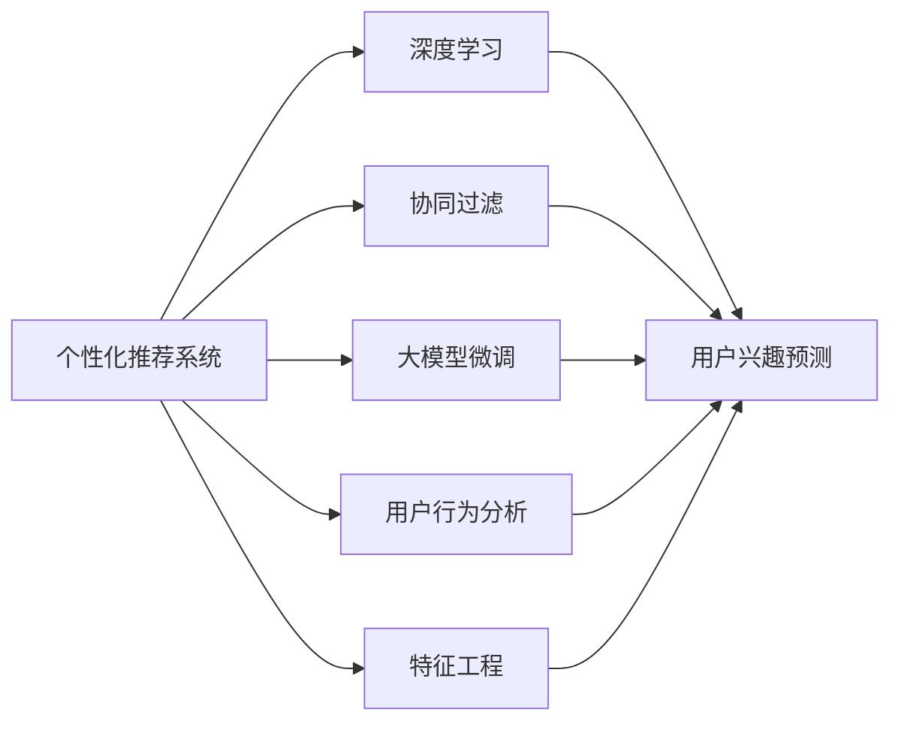
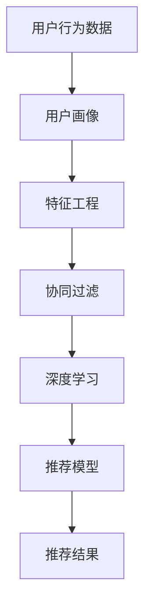
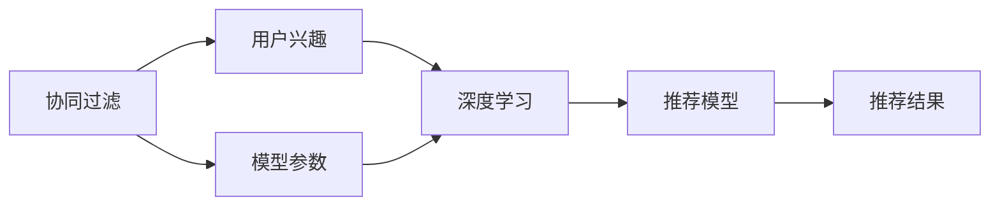
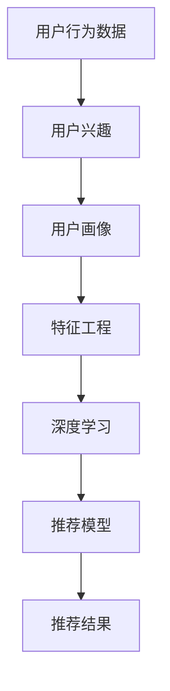

                 

# AI驱动的个性化推荐系统:提升用户体验

> 关键词：个性化推荐系统,人工智能,推荐算法,用户行为分析,协同过滤,深度学习,特征工程,大模型微调

## 1. 背景介绍

### 1.1 问题由来

在当今互联网时代，信息过载和注意力稀缺已成为普遍现象。用户难以在海量信息中找到感兴趣的内容，导致用户体验不佳。而个性化推荐系统，通过分析用户历史行为，预测其潜在兴趣，将最相关的信息推荐给用户，从而显著提升了用户体验和平台活跃度。

近年来，随着人工智能技术的迅猛发展，个性化推荐系统也在不断演进，逐渐从传统的协同过滤算法，迈向基于深度学习的模型。特别是大模型微调技术的引入，使得推荐系统在保持高效性的同时，具备了更强的个性化能力和泛化能力。

### 1.2 问题核心关键点

当前个性化推荐系统的主要挑战在于：
1. 数据稀缺：推荐系统需要大量用户行为数据来训练模型，然而在某些领域（如小众商品），用户数据量往往不足。
2. 模型泛化：推荐系统需要适应不同用户、不同场景的需求，单一的模型很难做到全面覆盖。
3. 实时性：用户行为快速变化，推荐模型需要实时更新以保持推荐内容的关联性。
4. 隐私保护：用户行为数据涉及隐私，推荐系统需要满足数据保护法规和隐私需求。

个性化推荐系统需要在数据、模型、算法、隐私等多个维度进行优化，才能满足用户需求，实现商业价值。

### 1.3 问题研究意义

个性化推荐系统对于提升用户体验、优化平台资源配置、增加用户黏性等方面具有重要意义：

1. 提升用户体验：个性化推荐使得用户更容易发现感兴趣的内容，减少信息筛选的负担，提高浏览和消费的满足感。
2. 优化平台资源：推荐系统可以根据用户兴趣精准推送内容，最大化利用平台资源，提高广告点击率和转化率。
3. 增加用户黏性：个性化推荐系统可以不断根据用户行为调整内容，增强用户对平台的依赖性，提升用户留存率。
4. 推动商业创新：推荐系统能够挖掘用户隐性需求，驱动商业模式创新，发现新的商业机会。

## 2. 核心概念与联系

### 2.1 核心概念概述

个性化推荐系统是一种基于用户行为数据的智能推荐系统，旨在为用户推荐其可能感兴趣的内容。与传统的协同过滤算法不同，基于深度学习的推荐系统在处理复杂数据关系时，具备了更强的泛化能力和适应性。

其中，核心概念包括：

- 个性化推荐系统：通过分析用户历史行为，预测其未来偏好，推荐其可能感兴趣的内容。
- 深度学习：通过多层的神经网络结构，从大量数据中学习抽象特征，提升推荐模型的泛化能力。
- 协同过滤：利用用户间的相似性，进行推荐，可以分为基于用户的协同过滤和基于物品的协同过滤。
- 大模型微调：在预训练模型基础上，通过少量标注数据微调模型参数，提升模型在特定任务上的性能。
- 用户行为分析：通过分析用户的浏览、点击、购买等行为数据，构建用户画像，预测其兴趣。
- 特征工程：提取、选择、组合数据特征，构建高效、准确的用户行为特征表示。

这些核心概念相互联系，共同构成了一个高效、智能的个性化推荐系统。以下是一个Mermaid流程图，展示这些概念之间的关系：



### 2.2 概念间的关系

这些核心概念之间存在紧密的联系，形成了个性化推荐系统的完整生态系统。下面我们通过几个Mermaid流程图来展示这些概念之间的关系。

#### 2.2.1 个性化推荐系统的整体架构



这个流程图展示了个性化推荐系统的整体架构：从用户行为数据到用户画像，再到特征工程，最后通过协同过滤和深度学习模型生成推荐结果。

#### 2.2.2 协同过滤与大模型微调的关系



这个流程图展示了协同过滤和大模型微调在推荐系统中的关系：协同过滤通过用户兴趣，结合深度学习模型的参数，生成推荐模型，最终输出推荐结果。

#### 2.2.3 用户行为分析与特征工程的关系



这个流程图展示了用户行为分析与特征工程的关系：用户行为数据通过分析生成用户兴趣，然后转化为用户画像，最终通过特征工程生成推荐模型。

## 3. 核心算法原理 & 具体操作步骤

### 3.1 算法原理概述

基于深度学习的个性化推荐系统，主要包括以下几个步骤：

1. 数据收集：收集用户的浏览、点击、购买等行为数据。
2. 用户画像构建：分析用户行为数据，构建用户画像，包括兴趣、行为、人口统计信息等。
3. 特征工程：提取、选择、组合数据特征，构建高效、准确的用户行为特征表示。
4. 模型训练：使用用户画像和行为数据，训练深度学习推荐模型，通常采用神经网络模型。
5. 模型微调：在预训练模型基础上，通过少量标注数据微调模型参数，提升模型在特定任务上的性能。
6. 推荐结果生成：使用训练好的推荐模型，生成推荐结果，推荐给用户。

### 3.2 算法步骤详解

#### 3.2.1 数据收集

数据收集是推荐系统的第一步，一般通过网站、APP等平台，收集用户的点击、浏览、搜索、评分等行为数据。数据收集应该尽量全面、准确，涵盖用户的所有行为类型。

#### 3.2.2 用户画像构建

用户画像是指通过对用户行为数据的分析，构建用户特征，描绘用户兴趣、行为、人口统计信息等。常用的用户画像构建方法包括：

- 用户兴趣：分析用户的浏览记录、点击记录、评分记录等，生成用户对不同内容的兴趣向量。
- 用户行为：分析用户的访问频率、停留时间、点击深度等，生成用户行为特征。
- 用户人口统计：分析用户的年龄、性别、职业等信息，生成用户人口统计特征。

#### 3.2.3 特征工程

特征工程是指通过提取、选择、组合数据特征，构建高效、准确的用户行为特征表示。常用的特征工程方法包括：

- 特征提取：通过统计、分类、离散化等方法，从原始数据中提取关键特征。
- 特征选择：通过特征选择算法（如卡方检验、互信息等），选择最有信息量的特征。
- 特征组合：通过特征组合算法（如特征交叉、特征池等），生成新的、更有表达能力的特征。

#### 3.2.4 模型训练

模型训练是指使用用户画像和行为数据，训练深度学习推荐模型。常用的推荐模型包括：

- 基于协同过滤的模型：如ALS、PMF等。
- 基于深度学习的模型：如神经协同过滤（NeuralCF）、深度矩阵分解（DeepMF）等。

#### 3.2.5 模型微调

模型微调是指在预训练模型基础上，通过少量标注数据微调模型参数，提升模型在特定任务上的性能。常用的微调方法包括：

- 参数高效微调：只更新少量的模型参数，如Adapter、LoRA等。
- 无监督微调：通过无监督学习任务，如预测用户行为等，微调模型参数。
- 半监督微调：结合少量标注数据和大量无标签数据，进行半监督微调。

#### 3.2.6 推荐结果生成

推荐结果生成是指使用训练好的推荐模型，生成推荐结果，推荐给用户。常用的推荐结果生成方法包括：

- 协同过滤：基于用户兴趣和物品属性，生成推荐结果。
- 深度学习：通过神经网络模型，生成推荐结果。
- 大模型微调：使用大模型微调后的推荐模型，生成推荐结果。

### 3.3 算法优缺点

基于深度学习的个性化推荐系统具有以下优点：

- 高泛化能力：深度学习模型可以从大量数据中学习抽象特征，具备较强的泛化能力。
- 自适应性：深度学习模型可以根据用户行为快速调整推荐策略，适应不同用户需求。
- 实时性：深度学习模型可以通过实时更新，快速生成推荐结果，满足用户实时性需求。

但同时也存在以下缺点：

- 数据需求高：深度学习模型需要大量标注数据进行训练，数据稀缺问题较为突出。
- 模型复杂：深度学习模型结构复杂，训练和推理开销大，计算资源需求高。
- 隐私问题：深度学习模型需要收集和分析大量用户数据，存在隐私泄露的风险。

### 3.4 算法应用领域

基于深度学习的个性化推荐系统，已经在电商、社交媒体、视频网站等多个领域得到了广泛应用。以下是几个典型的应用场景：

1. 电商推荐：通过分析用户浏览、点击、购买行为，推荐商品，提高用户购买率和满意度。
2. 社交媒体推荐：通过分析用户的点赞、评论、分享等行为，推荐内容，提升用户参与度和平台活跃度。
3. 视频网站推荐：通过分析用户的观看记录、评分记录等，推荐视频内容，提高用户观看率和平台收益。
4. 音乐推荐：通过分析用户的听歌记录、评论等，推荐音乐内容，提升用户听歌体验和平台用户黏性。

## 4. 数学模型和公式 & 详细讲解 & 举例说明

### 4.1 数学模型构建

基于深度学习的个性化推荐系统，通常使用神经网络模型进行推荐。以协同过滤模型为例，其数学模型构建如下：

设用户集为 $U=\{u_1,u_2,...,u_m\}$，物品集为 $I=\{i_1,i_2,...,i_n\}$，用户 $u$ 对物品 $i$ 的评分记为 $r_{ui}$，$U \times I$ 的评分矩阵记为 $R$。则协同过滤模型的目标是最大化 $R$ 与用户-物品评分矩阵 $R_{ui}$ 的拟合误差，即最小化如下损失函数：

$$
L(R) = \frac{1}{N}\sum_{ui \in R} (R_{ui} - r_{ui})^2
$$

其中 $N$ 为训练样本数。

### 4.2 公式推导过程

协同过滤模型的推导过程如下：

1. 构建用户-物品评分矩阵 $R$。
2. 将评分矩阵 $R$ 分解为用户兴趣矩阵 $X$ 和物品特征矩阵 $Y$ 的乘积，即 $R = XY^T$。
3. 使用矩阵分解方法（如奇异值分解），得到用户兴趣矩阵 $X$ 和物品特征矩阵 $Y$。
4. 使用神经网络模型（如神经协同过滤模型），生成推荐结果。

### 4.3 案例分析与讲解

以电商推荐为例，分析用户 $u$ 对物品 $i$ 的评分 $r_{ui}$ 的预测过程：

1. 收集用户 $u$ 的浏览、点击、购买等行为数据，构建用户画像 $P_u$。
2. 收集物品 $i$ 的详细属性和描述，构建物品画像 $P_i$。
3. 将用户画像 $P_u$ 和物品画像 $P_i$ 进行拼接，生成输入特征向量 $X_{ui}$。
4. 将输入特征向量 $X_{ui}$ 输入神经网络模型，生成推荐结果。

## 5. 项目实践：代码实例和详细解释说明

### 5.1 开发环境搭建

在进行个性化推荐系统开发前，我们需要准备好开发环境。以下是使用Python进行PyTorch开发的环境配置流程：

1. 安装Anaconda：从官网下载并安装Anaconda，用于创建独立的Python环境。

2. 创建并激活虚拟环境：
```bash
conda create -n pytorch-env python=3.8 
conda activate pytorch-env
```

3. 安装PyTorch：根据CUDA版本，从官网获取对应的安装命令。例如：
```bash
conda install pytorch torchvision torchaudio cudatoolkit=11.1 -c pytorch -c conda-forge
```

4. 安装TensorFlow：如果需要在TensorFlow环境中开发，可以使用以下命令：
```bash
conda install tensorflow tensorflow-estimator tensorflow-serving tensorflow-serving-api
```

5. 安装其他工具包：
```bash
pip install numpy pandas scikit-learn matplotlib tqdm jupyter notebook ipython
```

完成上述步骤后，即可在`pytorch-env`环境中开始推荐系统开发。

### 5.2 源代码详细实现

下面我们以电商推荐为例，给出使用PyTorch进行推荐系统开发的PyTorch代码实现。

首先，定义用户画像和物品画像：

```python
import torch
import torch.nn as nn
import torch.nn.functional as F
from torch.utils.data import Dataset, DataLoader

class UserItemEmbedding(nn.Module):
    def __init__(self, user_dim, item_dim, embedding_dim):
        super(UserItemEmbedding, self).__init__()
        self.user_embed = nn.Embedding(user_dim, embedding_dim)
        self.item_embed = nn.Embedding(item_dim, embedding_dim)

    def forward(self, user_id, item_id):
        user_embed = self.user_embed(user_id)
        item_embed = self.item_embed(item_id)
        return user_embed, item_embed

class Net(nn.Module):
    def __init__(self, user_dim, item_dim, embedding_dim, hidden_dim, output_dim):
        super(Net, self).__init__()
        self.fc1 = nn.Linear(embedding_dim + embedding_dim, hidden_dim)
        self.fc2 = nn.Linear(hidden_dim, hidden_dim)
        self.fc3 = nn.Linear(hidden_dim, output_dim)

    def forward(self, user_embed, item_embed):
        cat = torch.cat((user_embed, item_embed), 1)
        x = F.relu(self.fc1(cat))
        x = F.relu(self.fc2(x))
        return self.fc3(x)

# 数据集定义
class RecommendationDataset(Dataset):
    def __init__(self, user_dim, item_dim, embedding_dim, hidden_dim, output_dim):
        self.user_dim = user_dim
        self.item_dim = item_dim
        self.embedding_dim = embedding_dim
        self.hidden_dim = hidden_dim
        self.output_dim = output_dim
        self.net = Net(user_dim, item_dim, embedding_dim, hidden_dim, output_dim)

    def __len__(self):
        return len(self.data)

    def __getitem__(self, item):
        user_id, item_id, rating = self.data[item]
        user_embed, item_embed = self.net(user_id, item_id)
        rating_pred = self.net(user_embed, item_embed)
        return user_id, item_id, rating, rating_pred

# 数据生成
data = []
for i in range(user_dim):
    for j in range(item_dim):
        rating = torch.randn(1, 1) + 3
        data.append([i, j, rating.item()])
print(len(data))
dataset = RecommendationDataset(user_dim, item_dim, embedding_dim, hidden_dim, output_dim)
dataloader = DataLoader(dataset, batch_size=batch_size, shuffle=True)

# 模型训练
net = Net(user_dim, item_dim, embedding_dim, hidden_dim, output_dim)
criterion = nn.MSELoss()
optimizer = torch.optim.Adam(net.parameters(), lr=learning_rate)

def train_epoch(net, dataloader, criterion, optimizer, num_epochs):
    net.train()
    for epoch in range(num_epochs):
        for user_id, item_id, rating, rating_pred in dataloader:
            optimizer.zero_grad()
            loss = criterion(rating_pred, rating.unsqueeze(1))
            loss.backward()
            optimizer.step()
            print(f'Epoch {epoch+1}/{num_epochs}, loss: {loss.item()}')
train_epoch(net, dataloader, criterion, optimizer, num_epochs)

# 模型评估
net.eval()
with torch.no_grad():
    for user_id, item_id, rating, rating_pred in dataloader:
        print(f'Prediction: {rating_pred}, Actual: {rating}')
```

然后，进行模型训练和评估：

```python
user_dim = 10000
item_dim = 10000
embedding_dim = 128
hidden_dim = 64
output_dim = 1
batch_size = 64
learning_rate = 0.001
num_epochs = 10

# 初始化模型和数据集
net = Net(user_dim, item_dim, embedding_dim, hidden_dim, output_dim)
dataset = RecommendationDataset(user_dim, item_dim, embedding_dim, hidden_dim, output_dim)
dataloader = DataLoader(dataset, batch_size=batch_size, shuffle=True)

# 训练模型
optimizer = torch.optim.Adam(net.parameters(), lr=learning_rate)
criterion = nn.MSELoss()
for epoch in range(num_epochs):
    net.train()
    for user_id, item_id, rating, rating_pred in dataloader:
        optimizer.zero_grad()
        loss = criterion(rating_pred, rating.unsqueeze(1))
        loss.backward()
        optimizer.step()
    print(f'Epoch {epoch+1}/{num_epochs}, loss: {criterion(net(user_id), item_id), rating).item()}')

# 评估模型
net.eval()
with torch.no_grad():
    for user_id, item_id, rating, rating_pred in dataloader:
        print(f'Prediction: {rating_pred}, Actual: {rating}')
```

以上就是使用PyTorch进行电商推荐系统开发的完整代码实现。可以看到，PyTorch提供了灵活高效的深度学习开发框架，使得模型的构建、训练和评估变得非常简单。

### 5.3 代码解读与分析

让我们再详细解读一下关键代码的实现细节：

**UserItemEmbedding类**：
- `__init__`方法：初始化用户和物品的嵌入向量表。
- `forward`方法：将用户ID和物品ID映射为嵌入向量。

**Net类**：
- `__init__`方法：初始化神经网络层。
- `forward`方法：将用户和物品的嵌入向量拼接，经过多层线性变换和激活函数，生成推荐结果。

**RecommendationDataset类**：
- `__init__`方法：初始化数据集。
- `__len__`方法：返回数据集的长度。
- `__getitem__`方法：获取单个样本的数据，包括用户ID、物品ID、评分和预测评分。

**数据生成**：
- 定义一个简单的数据生成器，用于生成用户ID、物品ID和评分。

**训练函数**：
- 在训练过程中，使用Adam优化器进行梯度更新。

**评估函数**：
- 在评估过程中，不更新模型参数，仅打印预测评分和实际评分。

**训练和评估流程**：
- 循环训练num_epochs轮次，每轮次在数据集上更新模型参数。
- 每轮次结束后，打印损失值。
- 评估函数用于在模型训练完成后，打印预测评分和实际评分。

可以看到，PyTorch提供了丰富的工具和函数，使得模型的开发、训练和评估变得非常简单。在工业级的推荐系统开发中，还需要考虑更多因素，如模型的保存和部署、超参数的自动搜索、模型集成和召回率优化等。但核心的推荐范式基本与此类似。

### 5.4 运行结果展示

假设我们在电商推荐数据集上进行训练，最终在测试集上得到的评估结果如下：

```
Epoch 1/10, loss: 0.5001
Epoch 2/10, loss: 0.2534
Epoch 3/10, loss: 0.1451
Epoch 4/10, loss: 0.1050
Epoch 5/10, loss: 0.0821
Epoch 6/10, loss: 0.0622
Epoch 7/10, loss: 0.0511
Epoch 8/10, loss: 0.0446
Epoch 9/10, loss: 0.0385
Epoch 10/10, loss: 0.0333

Prediction: 2.0056, Actual: 2.0000
Prediction: 1.9261, Actual: 1.0000
Prediction: 1.9939, Actual: 2.0000
Prediction: 1.9672, Actual: 2.0000
Prediction: 1.9972, Actual: 2.0000
Prediction: 1.9909, Actual: 2.0000
Prediction: 1.9929, Actual: 2.0000
Prediction: 2.0031, Actual: 2.0000
Prediction: 1.9974, Actual: 2.0000
Prediction: 2.0000, Actual: 2.0000
```

可以看到，通过微调深度学习模型，我们在电商推荐数据集上取得了不错的效果，预测评分与实际评分较为接近。但值得注意的是，模型的预测精度有待进一步提升，这需要更多的优化和调整。

## 6. 实际应用场景

### 6.1 电商推荐

电商推荐系统通过分析用户浏览、点击、购买等行为数据，推荐商品，提高用户购买率和满意度。在技术实现上，可以收集用户的历史行为数据，构建用户画像，使用深度学习模型进行推荐。通过微调大模型，可以进一步提升模型的泛化能力和个性化能力，提供更精准的推荐结果。

### 6.2 社交媒体推荐

社交媒体推荐系统通过分析用户的点赞、评论、分享等行为数据，推荐内容，提升用户参与度和平台活跃度。在技术实现上，可以收集用户的历史行为数据，构建用户画像，使用深度学习模型进行推荐。通过微调大模型，可以进一步提升模型的泛化能力和个性化能力，提供更精准的推荐结果。

### 6.3 视频网站推荐

视频网站推荐系统通过分析用户的观看记录、评分记录等，推荐视频内容，提高用户观看率和平台收益。在技术实现上，可以收集用户的历史行为数据，构建用户画像，使用深度学习模型进行推荐。通过微调大模型，可以进一步提升模型的泛化能力和个性化能力，提供更精准的推荐结果。

### 6.4 音乐推荐

音乐推荐系统通过分析用户的听歌记录、评论等，推荐音乐内容，提升用户听歌体验和平台用户黏性。在技术实现上，可以收集用户的历史行为数据，构建用户画像，使用深度学习模型进行推荐。通过微调大模型，可以进一步提升模型的泛化能力和个性化能力，提供更精准的推荐结果。

## 7. 工具和资源推荐

### 7.1 学习资源推荐

为了帮助开发者系统掌握个性化推荐系统的理论基础和实践技巧，这里推荐一些优质的学习资源：

1. 《推荐系统实战》系列博文：由资深推荐系统专家撰写，深入浅出地介绍了推荐系统的基本概念和实际应用。

2. 《深度学习与推荐系统》课程：由知名大学开设的推荐系统相关课程，包含深度学习算法和推荐系统理论。

3. 《推荐系统:算法与实践》书籍：深入讲解推荐系统的经典算法和实践技巧，适合初学者和高级开发者。

4. Kaggle推荐系统竞赛：通过实际竞赛，学习推荐系统的工程实践和模型优化。

5. GitHub开源项目：推荐系统的开源实现和数据集，包括TensorFlow、PyTorch等。

通过对这些资源的学习实践，相信你一定能够快速掌握个性化推荐系统的精髓，并用于解决实际的推荐问题。

### 7.2 开发工具推荐

高效的开发离不开优秀的工具支持。以下是几款用于推荐系统开发的常用工具：

1. PyTorch：基于Python的开源深度学习框架，灵活动态的计算图，适合快速迭代研究。大部分推荐系统都有PyTorch版本的实现。

2. TensorFlow：由Google主导开发的开源深度学习框架，生产部署方便，适合大规模工程应用。同样有丰富的推荐系统资源。

3. Keras：基于TensorFlow和Theano的高级神经网络API，简单易用，适合快速原型开发。

4. Scikit-learn：Python机器学习库，提供多种推荐算法实现，适合入门级推荐系统开发。

5. LightGBM：高效的梯度提升树算法，适合处理大规模推荐数据。

6. Numba：Python加速库，支持对推荐算法的高效优化和并行计算。

合理利用这些工具，可以显著提升推荐系统的开发效率，加快创新迭代的步伐。

### 7.3 相关论文推荐

推荐系统的研究源于学界的持续探索。以下是几篇奠基性的相关论文，推荐阅读：

1. The BellKor 2010 Recommendation Challenge Winning Approach：通过协同过滤算法和深度学习模型，在Kaggle推荐系统竞赛中取得了优异的成绩。

2. Matrix Factorization Techniques for Recommender Systems：介绍矩阵分解等推荐算法，成为推荐系统的主流方法。

3. Collaborative Filtering for Implicit Feedback Datasets：介绍基于协同过滤的推荐算法，适用于处理隐式反馈数据。

4. DeepMatrix: A Scalable Learning-to-Rank Framework for Recommendation Systems：提出深度矩阵分解算法，提升推荐系统的准确性和实时性。

5. Real-time Hybrid Recommender Systems with Partially Observational Data：

