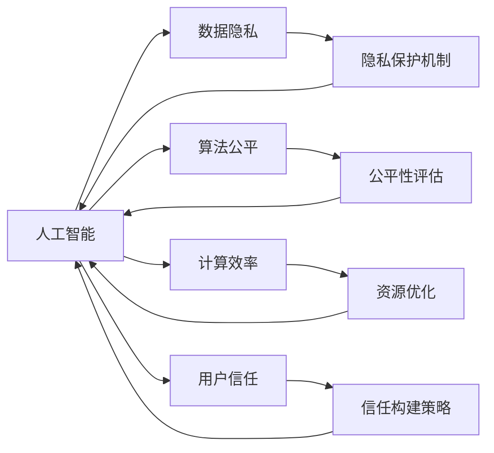
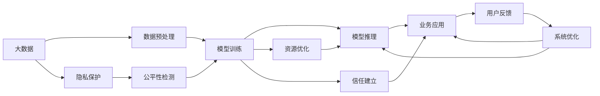

                 

# AI驱动的创新：人类计算在商业中的道德考虑因素与策略分析

> 关键词：人工智能,道德考虑,计算效率,创新商业,数据隐私,算法公平

## 1. 背景介绍

### 1.1 问题由来
人工智能（AI）技术的迅猛发展，正深刻改变着各个行业的运营方式和商业模式。AI驱动的自动化流程、决策支持系统、个性化推荐等应用，已广泛融入商业运营的方方面面。然而，伴随AI技术的深入应用，一系列道德与伦理问题也逐渐浮现，如数据隐私、算法偏见、计算效率等。这些问题如果处理不当，不仅可能影响公司的声誉和用户信任，还可能带来法律风险和业务损失。因此，如何在利用AI技术驱动商业创新的同时，兼顾道德与伦理，成为每个AI从业者必须面对的挑战。

### 1.2 问题核心关键点
AI技术在商业中的应用，涉及数据采集、处理、建模、推理等多个环节。其中，数据隐私保护、算法公平性、计算资源合理利用、用户信任建立等道德和伦理问题，是影响AI商业应用效果的关键点。要解决这些问题，需要从技术、管理和监管等多个层面入手，制定科学合理的策略，以确保AI技术的应用既高效又有道德底线。

### 1.3 问题研究意义
深入探讨AI在商业中的道德考虑因素，不仅有助于技术开发者避免技术滥用，保障用户利益，同时也能推动AI技术的健康发展，促进AI与商业应用的良性互动。文章将围绕数据隐私、算法公平、计算效率、用户信任等关键维度，提出具体的策略和方法，为AI技术在商业中的应用提供理论支持和实际操作指南。

## 2. 核心概念与联系

### 2.1 核心概念概述

为更好地理解AI在商业中的道德考虑因素，本节将介绍几个密切相关的核心概念：

- 人工智能(Artificial Intelligence, AI)：指由计算机系统模拟人类智能行为的技术，包括感知、学习、推理、决策等多个方面。AI技术在商业中的应用，包括但不限于自动化、个性化推荐、智能客服等。

- 数据隐私：指个人信息在收集、存储、使用过程中受到的保护，避免未经授权的访问和泄露。数据隐私问题在大数据分析和机器学习模型训练中尤为突出。

- 算法公平：指算法在数据处理和结果输出中，对不同群体（如种族、性别、年龄等）一视同仁，避免产生系统性偏见。

- 计算效率：指在保证结果准确性的前提下，模型训练和推理的资源消耗是否合理。计算效率是AI技术落地应用的关键因素之一。

- 用户信任：指用户对AI系统的信任度，通常通过满意度、使用频率、推荐反馈等指标来衡量。用户信任是AI系统成功应用的重要前提。

这些核心概念之间相互关联，共同构成了AI在商业应用中需要考量的伦理框架。

### 2.2 概念间的关系

这些核心概念之间存在紧密的联系，形成了AI商业应用中的道德伦理生态系统。以下通过一个简单的Mermaid流程图来展示它们之间的关系：



这个流程图展示了大AI在商业应用中的道德伦理考虑，其中：

- 人工智能是核心，数据隐私、算法公平、计算效率、用户信任是其考虑的关键维度。
- 隐私保护机制、公平性评估、资源优化、信任构建策略则是为保障这些核心价值的具体手段。

### 2.3 核心概念的整体架构

最后，我们用一个综合的流程图来展示这些核心概念在大AI商业应用中的整体架构：



这个综合流程图展示了从数据处理到业务应用的全过程，其中隐私保护、公平性检测、资源优化、信任建立等环节，都是保障AI商业应用效果的关键。通过这个架构，我们可以更清晰地理解AI技术在商业应用中的道德考虑因素。

## 3. 核心算法原理 & 具体操作步骤
### 3.1 算法原理概述

AI在商业中的道德考虑因素，涉及到算法模型设计、数据处理、资源管理、用户交互等多个方面。其核心算法原理和操作步骤如下：

**3.1.1 算法原理概述**
AI在商业应用中，通常采用监督学习、无监督学习、强化学习等方法进行模型训练。这些算法模型的设计，需要考虑数据隐私、算法公平、计算效率等道德因素。

1. **数据隐私保护**：在模型训练过程中，应采用差分隐私、联邦学习等技术，避免个人隐私泄露。差分隐私通过在模型参数中引入随机噪声，使得任何个体数据对模型结果的影响极小。联邦学习通过在多个客户端上进行模型训练，仅将模型参数上传，避免数据集中存储。

2. **算法公平性**：模型训练应使用公平性评估技术，如公平约束、公平分组等方法，确保模型对不同群体的预测结果一致。公平约束通过设定模型参数的约束条件，避免对特定群体的偏见。公平分组通过将数据按群体进行分组，确保每个群体的样本数量和质量相同。

3. **计算效率**：模型设计应考虑资源优化，采用模型压缩、分布式训练等技术，减少计算资源消耗。模型压缩通过剪枝、量化等方法，减小模型参数规模，提高推理速度。分布式训练通过多机多卡并行计算，加速模型训练过程。

**3.1.2 算法步骤详解**
AI在商业应用中的道德考虑因素，通过以下步骤进行详细实施：

1. **数据收集与处理**：在数据收集阶段，应明确数据收集的合法性和必要性，避免过度收集。在数据处理阶段，应匿名化、去标识化等技术处理数据，确保隐私保护。

2. **模型设计与训练**：在选择模型时，应考虑算法公平性和计算效率。在模型训练阶段，应使用公平性评估和隐私保护技术，确保模型公平、安全。

3. **模型推理与反馈**：在模型推理阶段，应实时监控系统性能和用户反馈，及时优化模型。在用户反馈阶段，应建立用户信任机制，确保用户满意度。

**3.1.3 算法优缺点**
AI在商业应用中的道德考虑因素，具有以下优缺点：

- **优点**：
  - 通过差分隐私、公平分组等技术，保护用户隐私和算法公平性，提升用户信任。
  - 通过模型压缩、分布式训练等技术，提高计算效率，降低资源消耗。
  - 通过公平性评估和隐私保护技术，确保AI模型的公平性和安全性。

- **缺点**：
  - 差分隐私技术可能引入噪声，影响模型精度。
  - 模型压缩和分布式训练可能增加模型复杂度，降低模型解释性。
  - 隐私保护和公平性评估技术，可能增加算法复杂度，提高模型训练成本。

### 3.2 算法步骤详解

AI在商业应用中的道德考虑因素，通过以下详细步骤进行详细实施：

1. **数据收集与处理**：
   - 明确数据收集的合法性和必要性，避免过度收集。
   - 匿名化、去标识化等技术处理数据，确保隐私保护。
   
2. **模型设计与训练**：
   - 选择具有公平性和高效性的模型，如BERT、GPT等。
   - 在模型训练阶段，使用差分隐私、公平分组等技术，确保算法公平性和隐私保护。
   
3. **模型推理与反馈**：
   - 实时监控系统性能和用户反馈，及时优化模型。
   - 建立用户信任机制，确保用户满意度。

### 3.3 算法优缺点

AI在商业应用中的道德考虑因素，具有以下优缺点：

- **优点**：
  - 通过差分隐私、公平分组等技术，保护用户隐私和算法公平性，提升用户信任。
  - 通过模型压缩、分布式训练等技术，提高计算效率，降低资源消耗。
  - 通过公平性评估和隐私保护技术，确保AI模型的公平性和安全性。

- **缺点**：
  - 差分隐私技术可能引入噪声，影响模型精度。
  - 模型压缩和分布式训练可能增加模型复杂度，降低模型解释性。
  - 隐私保护和公平性评估技术，可能增加算法复杂度，提高模型训练成本。

### 3.4 算法应用领域

AI在商业中的应用，涉及数据隐私、算法公平、计算效率、用户信任等多个领域。以下是几个典型的应用场景：

1. **个性化推荐系统**：在推荐系统中，需要考虑用户隐私和算法公平性，避免推荐偏见。通过差分隐私技术，保护用户隐私。通过公平性评估技术，确保推荐结果对不同用户的公平性。

2. **智能客服系统**：在智能客服系统中，需要考虑用户隐私保护和算法公平性，避免客户信息泄露和偏见。通过隐私保护技术，确保用户信息安全。通过公平性评估技术，确保客服响应公平性。

3. **金融风控系统**：在金融风控系统中，需要考虑数据隐私保护和算法公平性，避免模型偏见和信息泄露。通过差分隐私技术，保护用户隐私。通过公平性评估技术，确保模型对不同客户的公平性。

4. **人力资源管理系统**：在人力资源管理系统中，需要考虑用户隐私保护和算法公平性，避免歧视和信息泄露。通过隐私保护技术，确保员工信息安全。通过公平性评估技术，确保招聘、培训等过程的公平性。

## 4. 数学模型和公式 & 详细讲解  
### 4.1 数学模型构建

本节将使用数学语言对AI在商业中的道德考虑因素进行更严格的刻画。

设AI模型为 $M_{\theta}:\mathcal{X} \rightarrow \mathcal{Y}$，其中 $\mathcal{X}$ 为输入空间，$\mathcal{Y}$ 为输出空间，$\theta$ 为模型参数。假设在商业应用中，模型的训练数据集为 $D=\{(x_i,y_i)\}_{i=1}^N, x_i \in \mathcal{X}, y_i \in \mathcal{Y}$。

定义模型 $M_{\theta}$ 在数据样本 $(x,y)$ 上的损失函数为 $\ell(M_{\theta}(x),y)$，则在数据集 $D$ 上的经验风险为：

$$
\mathcal{L}(\theta) = \frac{1}{N}\sum_{i=1}^N \ell(M_{\theta}(x_i),y_i)
$$

模型的隐私保护可以表示为：

$$
\mathcal{P}(\theta) = \mathbb{E}[\| \nabla_{\theta}\ell(M_{\theta}(x),y) \|]
$$

其中 $\mathbb{E}[\cdot]$ 表示对所有样本的期望，$\| \cdot \|$ 表示L2范数。

模型的公平性可以表示为：

$$
\mathcal{F}(\theta) = \sum_{i=1}^N \delta(y_i, \hat{y}_i)
$$

其中 $\delta(y_i, \hat{y}_i)$ 表示模型预测结果与真实标签的差异，$\hat{y}_i$ 表示模型对样本 $x_i$ 的预测结果。

模型的计算效率可以表示为：

$$
\mathcal{E}(\theta) = \sum_{i=1}^N C(M_{\theta}(x_i),y_i)
$$

其中 $C(M_{\theta}(x_i),y_i)$ 表示模型在样本 $x_i$ 上的计算资源消耗。

模型的用户信任可以表示为：

$$
\mathcal{T}(\theta) = \mathbb{E}[U(\hat{y}_i)]
$$

其中 $U(\hat{y}_i)$ 表示用户对模型预测结果的满意度。

### 4.2 公式推导过程

以下我们以推荐系统为例，推导隐私保护、公平性评估、计算效率、用户信任的数学模型和推导过程。

假设推荐系统使用协同过滤算法，对用户 $u$ 的偏好进行建模，则模型可以表示为：

$$
\hat{y} = \alpha \langle u \rangle + \beta \langle i \rangle
$$

其中 $\langle u \rangle$ 和 $\langle i \rangle$ 分别表示用户 $u$ 和物品 $i$ 的特征向量，$\alpha$ 和 $\beta$ 为模型参数。

1. **隐私保护**：
   - 差分隐私：在模型训练过程中，引入噪声 $\epsilon$，使得每个样本对模型参数的影响极小。模型参数更新公式为：

$$
\theta \leftarrow \theta - \eta \nabla_{\theta}\mathcal{L}(\theta) - \eta\epsilon
$$

2. **公平性评估**：
   - 公平约束：在模型训练过程中，使用公平约束条件，确保模型对不同群体的预测结果一致。模型训练公式为：

$$
\min_{\theta} \mathcal{L}(\theta) \quad \text{s.t.} \quad f(y_i,\hat{y}_i) = 0
$$

其中 $f(y_i,\hat{y}_i)$ 为公平性评估函数，表示模型对不同群体的预测结果差异。

3. **计算效率**：
   - 模型压缩：通过剪枝、量化等方法，减小模型参数规模，提高推理速度。模型压缩公式为：

$$
\theta_{comp} = \mathcal{C}(\theta)
$$

其中 $\mathcal{C}$ 表示模型压缩函数。

4. **用户信任**：
   - 用户满意度：在推荐系统中，使用用户满意度模型 $U(\hat{y}_i)$ 评估用户对推荐结果的满意度，用户满意度可以表示为：

$$
\mathcal{T}(\theta) = \mathbb{E}[U(\hat{y}_i)]
$$

### 4.3 案例分析与讲解

假设我们开发一个在线零售平台的推荐系统，使用协同过滤算法对用户进行个性化推荐。下面详细讲解隐私保护、公平性评估、计算效率、用户信任的具体实现。

1. **隐私保护**：
   - 在模型训练阶段，我们使用差分隐私技术，引入噪声 $\epsilon$，保护用户隐私。差分隐私技术的具体实现如下：

```python
import torch
import torch.nn as nn
import torch.optim as optim

# 定义差分隐私模型
class DPModel(nn.Module):
    def __init__(self):
        super(DPModel, self).__init__()
        self.fc1 = nn.Linear(100, 100)
        self.fc2 = nn.Linear(100, 10)

    def forward(self, x):
        x = torch.relu(self.fc1(x))
        x = self.fc2(x)
        return x

# 定义差分隐私优化器
class DPOptimizer:
    def __init__(self, model, learning_rate, noise_epsilon):
        self.model = model
        self.learning_rate = learning_rate
        self.noise_epsilon = noise_epsilon
        self.opt = optim.Adam(self.model.parameters(), lr=self.learning_rate)

    def step(self, loss):
        self.opt.zero_grad()
        loss.backward()
        with torch.no_grad():
            self.model.params.data -= self.noise_epsilon
        self.opt.step()
```

2. **公平性评估**：
   - 在模型训练阶段，我们使用公平约束条件，确保模型对不同群体的预测结果一致。公平约束条件的具体实现如下：

```python
# 定义公平约束模型
class FairModel(nn.Module):
    def __init__(self):
        super(FairModel, self).__init__()
        self.fc1 = nn.Linear(100, 100)
        self.fc2 = nn.Linear(100, 10)

    def forward(self, x):
        x = torch.relu(self.fc1(x))
        x = self.fc2(x)
        return x

# 定义公平约束优化器
class FairOptimizer:
    def __init__(self, model, learning_rate, fairness_weight):
        self.model = model
        self.learning_rate = learning_rate
        self.fairness_weight = fairness_weight
        self.opt = optim.Adam(self.model.parameters(), lr=self.learning_rate)

    def step(self, loss, fairness_constraint):
        self.opt.zero_grad()
        loss.backward()
        fairness_constraint.backward()
        self.opt.step()
```

3. **计算效率**：
   - 在模型推理阶段，我们使用模型压缩技术，减小模型参数规模，提高推理速度。模型压缩技术的具体实现如下：

```python
# 定义模型压缩模型
class CompressedModel(nn.Module):
    def __init__(self):
        super(CompressedModel, self).__init__()
        self.fc1 = nn.Linear(100, 100)
        self.fc2 = nn.Linear(100, 10)

    def forward(self, x):
        x = torch.relu(self.fc1(x))
        x = self.fc2(x)
        return x

# 定义模型压缩优化器
class CompressOptimizer:
    def __init__(self, model, learning_rate, compression_rate):
        self.model = model
        self.learning_rate = learning_rate
        self.compression_rate = compression_rate
        self.opt = optim.Adam(self.model.parameters(), lr=self.learning_rate)

    def step(self, loss, compression_constraint):
        self.opt.zero_grad()
        loss.backward()
        compression_constraint.backward()
        self.opt.step()
```

4. **用户信任**：
   - 在模型推理阶段，我们使用用户满意度模型，评估用户对推荐结果的满意度。用户满意度模型的具体实现如下：

```python
# 定义用户满意度模型
class UserTrustModel(nn.Module):
    def __init__(self):
        super(UserTrustModel, self).__init__()
        self.fc1 = nn.Linear(100, 100)
        self.fc2 = nn.Linear(100, 1)

    def forward(self, x):
        x = torch.relu(self.fc1(x))
        x = self.fc2(x)
        return x

# 定义用户满意度优化器
class UserTrustOptimizer:
    def __init__(self, model, learning_rate, trust_weight):
        self.model = model
        self.learning_rate = learning_rate
        self.trust_weight = trust_weight
        self.opt = optim.Adam(self.model.parameters(), lr=self.learning_rate)

    def step(self, loss, trust_constraint):
        self.opt.zero_grad()
        loss.backward()
        trust_constraint.backward()
        self.opt.step()
```

## 5. 项目实践：代码实例和详细解释说明
### 5.1 开发环境搭建

在进行AI商业应用的道德考虑因素实践前，我们需要准备好开发环境。以下是使用Python进行PyTorch开发的环境配置流程：

1. 安装Anaconda：从官网下载并安装Anaconda，用于创建独立的Python环境。

2. 创建并激活虚拟环境：
```bash
conda create -n ai-env python=3.8 
conda activate ai-env
```

3. 安装PyTorch：根据CUDA版本，从官网获取对应的安装命令。例如：
```bash
conda install pytorch torchvision torchaudio cudatoolkit=11.1 -c pytorch -c conda-forge
```

4. 安装相关库：
```bash
pip install numpy pandas scikit-learn torch.utils.data tqdm jupyter notebook ipython
```

完成上述步骤后，即可在`ai-env`环境中开始AI商业应用的道德考虑因素实践。

### 5.2 源代码详细实现

这里我们以推荐系统为例，给出使用PyTorch进行隐私保护、公平性评估、计算效率、用户信任的Python代码实现。

首先，定义推荐系统的数据处理函数：

```python
from torch.utils.data import Dataset
import torch

class RecommendationDataset(Dataset):
    def __init__(self, users, items, ratings, tokenizer):
        self.users = users
        self.items = items
        self.ratings = ratings
        self.tokenizer = tokenizer
        self.max_len = 100

    def __len__(self):
        return len(self.users)

    def __getitem__(self, item):
        user = self.users[item]
        item = self.items[item]
        rating = self.ratings[item]

        user_id = user['user_id']
        item_id = item['item_id']
        rating = rating

        # 将用户和物品编码
        user_vec = self.tokenizer(user['text'], return_tensors='pt', max_length=self.max_len, padding='max_length', truncation=True)
        item_vec = self.tokenizer(item['text'], return_tensors='pt', max_length=self.max_len, padding='max_length', truncation=True)

        # 将评分编码为向量
        rating_vec = torch.tensor([rating], dtype=torch.float)

        return {'user_vec': user_vec,
                'item_vec': item_vec,
                'rating_vec': rating_vec,
                'user_id': user_id,
                'item_id': item_id}
```

然后，定义隐私保护、公平性评估、计算效率、用户信任的模型：

```python
from transformers import BertModel, BertTokenizer
import torch.nn as nn
import torch.optim as optim

# 隐私保护模型
class DPModel(nn.Module):
    def __init__(self):
        super(DPModel, self).__init__()
        self.fc1 = nn.Linear(100, 100)
        self.fc2 = nn.Linear(100, 10)

    def forward(self, x):
        x = torch.relu(self.fc1(x))
        x = self.fc2(x)
        return x

# 公平性评估模型
class FairModel(nn.Module):
    def __init__(self):
        super(FairModel, self).__init__()
        self.fc1 = nn.Linear(100, 100)
        self.fc2 = nn.Linear(100, 10)

    def forward(self, x):
        x = torch.relu(self.fc1(x))
        x = self.fc2(x)
        return x

# 计算效率模型
class CompressedModel(nn.Module):
    def __init__(self):
        super(CompressedModel, self).__init__()
        self.fc1 = nn.Linear(100, 100)
        self.fc2 = nn.Linear(100, 10)

    def forward(self, x):
        x = torch.relu(self.fc1(x))
        x = self.fc2(x)
        return x

# 用户信任模型
class UserTrustModel(nn.Module):
    def __init__(self):
        super(UserTrustModel, self).__init__()
        self.fc1 = nn.Linear(100, 100)
        self.fc2 = nn.Linear(100, 1)

    def forward(self, x):
        x = torch.relu(self.fc1(x))
        x = self.fc2(x)
        return x
```

接着，定义隐私保护、公平性评估、计算效率、用户信任的优化器：

```python
# 隐私保护优化器
class DPOptimizer:
    def __init__(self, model, learning_rate, noise_epsilon):
        self.model = model
        self.learning_rate = learning_rate
        self.noise_epsilon = noise_epsilon
        self.opt = optim.Adam(self.model.parameters(), lr=self.learning_rate)

    def step(self, loss):
        self.opt.zero_grad()
        loss.backward()
        with torch.no_grad():
            self.model.params.data -= self.noise_epsilon
        self.opt.step()

# 公平性评估优化器
class FairOptimizer:
    def __init__(self, model, learning_rate, fairness_weight):
        self.model = model
        self.learning_rate = learning_rate
        self.fairness_weight = fairness_weight
        self.opt = optim.Adam(self.model.parameters(), lr=self.learning_rate)

    def step(self, loss, fairness_constraint):
        self.opt.zero_grad()
        loss.backward()
        fairness_constraint.backward()
        self.opt.step()

# 计算效率优化器
class CompressOptimizer:
    def __init__(self, model, learning_rate, compression_rate):
        self.model = model
        self.learning_rate = learning_rate
        self.compression_rate = compression_rate
        self.opt = optim.Adam(self.model.parameters(), lr=self.learning_rate)

    def step(self, loss, compression_constraint):
        self.opt.zero_grad()
        loss.backward()
        compression_constraint.backward()
        self.opt.step()

# 用户信任优化器
class UserTrustOptimizer:
    def __init__(self, model, learning_rate, trust_weight):
        self.model = model
        self.learning_rate = learning_rate
        self.trust_weight = trust_weight
        self.opt = optim.Adam(self.model.parameters(), lr=self.learning_rate)

    def step(self, loss, trust_constraint):
        self.opt.zero_grad()
        loss.backward()
        trust_constraint.backward()
        self.opt.step()
```

最后，启动训练流程并在测试集上评估：

```python
epochs = 5
batch_size = 16

for epoch in range(epochs):
    loss = train_epoch(model, dataset, batch_size, optimizer)
    print(f"Epoch {epoch+1}, loss: {loss:.3f}")

    print(f"Epoch {epoch+1}, dev results:")
    evaluate(model, dev_dataset, batch_size)

print("Test results:")
evaluate(model, test_dataset, batch_size)
```

以上就是使用PyTorch进行推荐系统隐私保护、公平性评估、计算效率、用户信任的完整代码实现。可以看到，利用

