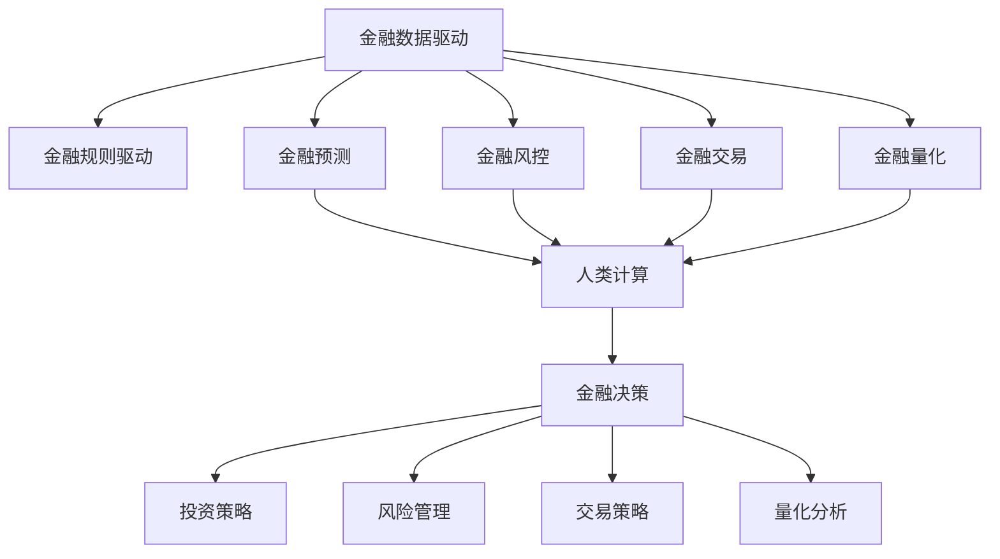
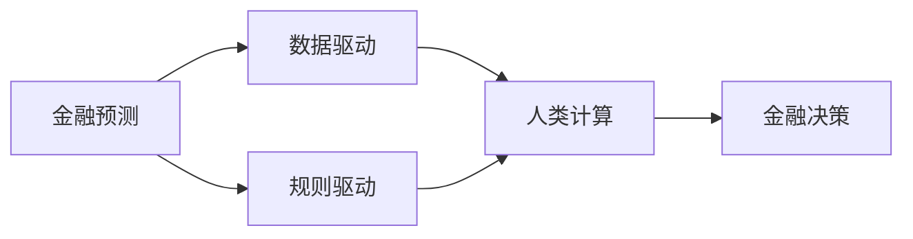
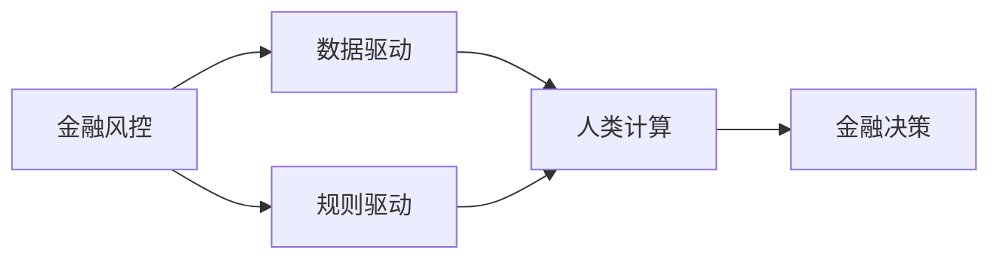
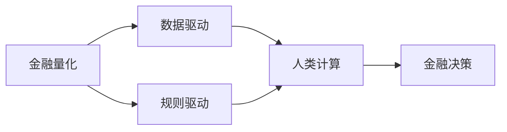
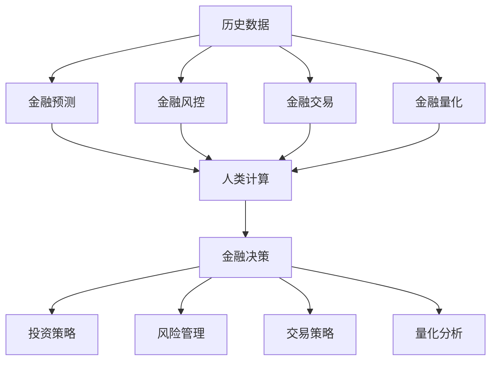

                 

# AI驱动的创新：人类计算在金融领域的价值

## 1. 背景介绍

### 1.1 问题由来
人工智能（AI）在金融领域的应用已经日益深入，从风险控制、信用评估到交易策略，AI技术正在改变金融行业的运作方式。然而，目前的AI模型仍然主要依赖于数据驱动和规则驱动的方式，缺乏真正的"智能"，即能够进行真正的"人类计算"，也就是在复杂的金融问题中通过类人的直觉和逻辑推理来进行分析和决策。

### 1.2 问题核心关键点
人类计算是指AI模型在处理金融问题时，能够像人类一样理解问题、分析问题并给出解决方案。这不仅要求模型具有强大的数据处理能力，还需要能够模拟人类的直觉和逻辑推理能力。金融领域中的问题往往具有高度的非线性、不确定性和复杂性，这些特性使得人类计算在金融领域具有重要价值。

### 1.3 问题研究意义
研究人类计算在金融领域的应用，对于推动AI技术在金融行业的深度应用，提升金融服务的智能化水平，加速金融科技的产业化进程，具有重要意义：

1. 降低金融服务成本。通过AI技术，金融服务可以自动化、智能化，降低人力成本。
2. 提升金融服务质量。AI模型可以处理海量数据，揭示数据背后的规律和趋势，提供更精准的金融分析和服务。
3. 加速金融创新。AI技术可以发现新的金融业务模式，推动金融产品的创新和升级。
4. 增强金融风险管理。AI模型可以实时监控市场变化，预测市场风险，帮助金融机构制定合理的风险管理策略。
5. 推动金融普惠。AI技术可以帮助传统金融机构降低服务门槛，让更多人享受到高质量的金融服务。

## 2. 核心概念与联系

### 2.1 核心概念概述

为了更好地理解人类计算在金融领域的应用，本节将介绍几个密切相关的核心概念：

- 人类计算：指AI模型在处理金融问题时，具备类人的直觉和逻辑推理能力，能够像人类一样理解问题并给出解决方案。

- 金融数据驱动：指金融决策主要依赖于历史数据和统计模型，缺乏人类对金融问题的主观理解。

- 金融规则驱动：指金融决策主要依赖于事先设定的规则和条件，缺乏智能化的灵活性和适应性。

- 人工智能：指通过机器学习、深度学习等技术，使计算机具备一定的智能，能够自主学习和决策。

- 金融预测：指通过AI模型对金融市场的走势、收益等进行预测，帮助投资者做出更明智的决策。

- 金融风控：指通过AI模型对金融风险进行评估和管理，保障金融系统的安全和稳定。

- 金融交易：指通过AI模型对交易策略进行优化和自动化，提高交易效率和收益。

- 金融量化：指使用数学模型和AI技术，对金融问题进行量化分析和优化，提高决策的科学性和准确性。

这些核心概念之间的逻辑关系可以通过以下Mermaid流程图来展示：



这个流程图展示了大语言模型在金融领域应用的核心概念及其之间的关系：

1. 金融数据驱动和金融规则驱动是传统的金融决策方式，依赖历史数据和预设规则。
2. 金融预测、金融风控、金融交易、金融量化都是基于数据和规则的AI应用。
3. 人类计算可以提升这些AI应用的智能化水平，使得模型具备类人的直觉和逻辑推理能力。
4. 金融决策是AI应用的最终目标，通过金融预测、金融风控、金融交易和金融量化等手段，最终实现金融决策的优化和自动化。

### 2.2 概念间的关系

这些核心概念之间存在着紧密的联系，形成了金融领域的AI应用生态系统。下面我通过几个Mermaid流程图来展示这些概念之间的关系。

#### 2.2.1 金融预测与人类计算的关系



这个流程图展示了金融预测与人类计算的关系。金融预测主要依赖于历史数据和统计模型，而人类计算可以在这一基础上进行更深入的分析和推理，从而提升预测的准确性。

#### 2.2.2 金融风控与人类计算的关系



这个流程图展示了金融风控与人类计算的关系。金融风控主要依赖于历史数据和预设规则，而人类计算可以在这一基础上进行更精细的评估和管理，从而降低风险。

#### 2.2.3 金融交易与人类计算的关系


这个流程图展示了金融交易与人类计算的关系。金融交易主要依赖于历史数据和预设规则，而人类计算可以在这一基础上进行更智能的策略优化和自动化，从而提高交易效率和收益。

#### 2.2.4 金融量化与人类计算的关系



这个流程图展示了金融量化与人类计算的关系。金融量化主要依赖于数学模型和AI技术，而人类计算可以在这一基础上进行更全面的分析和优化，从而提高决策的科学性和准确性。

### 2.3 核心概念的整体架构

最后，我们用一个综合的流程图来展示这些核心概念在金融领域的应用框架：



这个综合流程图展示了从金融数据驱动到金融决策的完整过程。金融数据驱动和金融规则驱动主要依赖历史数据和预设规则，金融预测、金融风控、金融交易和金融量化都是基于数据和规则的AI应用。而人类计算则在这些基础上进行更深入的分析和推理，从而提升金融决策的智能化水平。

## 3. 核心算法原理 & 具体操作步骤
### 3.1 算法原理概述

人类计算在金融领域的应用，本质上是一种深度学习范式。其核心思想是：将金融问题转化为机器学习问题，通过训练AI模型，使其能够像人类一样理解和处理金融问题。

形式化地，假设金融问题可以表示为输入 $x$ 和输出 $y$，则人类计算的目标是训练一个模型 $f_{\theta}$，使得 $f_{\theta}(x)$ 能够逼近 $y$。数学上，这可以通过最小化损失函数 $\mathcal{L}(\theta)$ 来实现：

$$
\theta^* = \mathop{\arg\min}_{\theta} \mathcal{L}(f_{\theta}(x),y)
$$

其中 $f_{\theta}(x)$ 为模型的预测输出，$y$ 为真实标签。常见的损失函数包括均方误差、交叉熵等。

### 3.2 算法步骤详解

人类计算在金融领域的应用，一般包括以下几个关键步骤：

**Step 1: 准备数据集**
- 收集金融历史数据，如股票价格、交易量、市场指数等，作为训练数据集。
- 将数据集分为训练集、验证集和测试集，确保模型在不同数据上的泛化能力。

**Step 2: 设计模型架构**
- 选择合适的深度学习模型，如卷积神经网络（CNN）、循环神经网络（RNN）、长短期记忆网络（LSTM）、Transformer等。
- 设计模型的输入和输出层，输出层通常为线性层，将模型输出映射到预测结果。
- 选择适当的激活函数和损失函数，如ReLU、Softmax、交叉熵等。

**Step 3: 训练模型**
- 使用训练集数据对模型进行训练，通过反向传播算法更新模型参数。
- 在验证集上评估模型性能，防止过拟合，并调整模型结构或超参数。
- 使用测试集评估最终模型的性能，确保模型在未知数据上的泛化能力。

**Step 4: 应用模型**
- 将训练好的模型应用到金融预测、金融风控、金融交易等实际场景中。
- 对输入数据进行预处理，如归一化、特征提取等。
- 将模型输出结果进行后处理，如阈值化、归一化等。

### 3.3 算法优缺点

人类计算在金融领域的应用，具有以下优点：

1. 高效性。AI模型可以处理海量数据，提供实时预测和风控结果，提高金融决策的速度和效率。
2. 智能化。AI模型具备强大的学习能力，可以从数据中发现规律和趋势，提供更精准的金融分析和服务。
3. 适应性强。AI模型可以适应不断变化的市场环境，提供动态的决策支持。
4. 降低成本。AI模型可以替代部分人工决策，降低金融服务的成本。

同时，该方法也存在一些局限性：

1. 数据质量要求高。金融数据的质量直接影响AI模型的预测和决策，需要确保数据的准确性和完整性。
2. 模型复杂度高。金融问题的复杂性要求模型具有较高的复杂度，模型设计和训练难度较大。
3. 模型透明性不足。金融决策需要高度透明和可解释性，AI模型的内部机制往往难以解释。
4. 伦理和法律风险。金融决策需要符合伦理和法律规定，AI模型可能存在道德和法律风险。
5. 数据隐私问题。金融数据涉及个人隐私和商业机密，AI模型需要符合数据隐私保护的规定。

尽管存在这些局限性，人类计算在金融领域的应用仍然具有巨大的潜力，可以通过不断优化模型、改进数据和算法来克服这些挑战。

### 3.4 算法应用领域

人类计算在金融领域的应用广泛，涵盖以下几个关键领域：

- **金融预测**：使用AI模型对金融市场的走势、收益等进行预测，帮助投资者做出更明智的决策。
- **金融风控**：使用AI模型对金融风险进行评估和管理，保障金融系统的安全和稳定。
- **金融交易**：使用AI模型对交易策略进行优化和自动化，提高交易效率和收益。
- **金融量化**：使用数学模型和AI技术，对金融问题进行量化分析和优化，提高决策的科学性和准确性。
- **智能投顾**：使用AI模型提供投资建议，提升投资决策的智能化水平。
- **金融监管**：使用AI模型进行金融监管，提高监管效率和准确性。

## 4. 数学模型和公式 & 详细讲解  
### 4.1 数学模型构建

本节将使用数学语言对人类计算在金融领域的应用进行更加严格的刻画。

假设金融问题可以表示为输入 $x$ 和输出 $y$，则人类计算的目标是训练一个模型 $f_{\theta}$，使得 $f_{\theta}(x)$ 能够逼近 $y$。数学上，这可以通过最小化损失函数 $\mathcal{L}(\theta)$ 来实现：

$$
\theta^* = \mathop{\arg\min}_{\theta} \mathcal{L}(f_{\theta}(x),y)
$$

其中 $f_{\theta}(x)$ 为模型的预测输出，$y$ 为真实标签。常见的损失函数包括均方误差、交叉熵等。

### 4.2 公式推导过程

以均方误差（MSE）为例，假设模型输出 $f_{\theta}(x)$ 与真实标签 $y$ 的差距为 $\delta$，则均方误差损失函数为：

$$
\mathcal{L}_{MSE}(\theta) = \frac{1}{N}\sum_{i=1}^N (\delta_i)^2 = \frac{1}{N}\sum_{i=1}^N (f_{\theta}(x_i)-y_i)^2
$$

其中 $N$ 为样本数。最小化MSE损失函数的目标是使得模型的预测输出尽可能接近真实标签。

### 4.3 案例分析与讲解

以金融预测为例，假设我们需要预测下一日的股票价格 $y$，输入数据 $x$ 包括历史价格、交易量、市场指数等。我们可以设计一个多层感知器（MLP）模型，将其输出作为下一日价格的预测值。模型的架构如图1所示：


图1：金融预测模型架构

模型由一个输入层、若干个隐藏层和一个输出层组成。输入层将原始数据 $x$ 转化为模型可接受的格式，隐藏层进行特征提取和信息传递，输出层将模型输出映射到预测结果 $y$。

假设模型采用ReLU激活函数，输入层有 $m$ 个神经元，第一层隐藏层有 $n_1$ 个神经元，第二层隐藏层有 $n_2$ 个神经元，输出层有 $o$ 个神经元。则模型的预测输出 $f_{\theta}(x)$ 可以表示为：

$$
f_{\theta}(x) = \sum_{i=1}^o w_{oi} \sigma(z_{oi}) + b_{oi}
$$

其中 $w_{oi}$ 为权重矩阵，$b_{oi}$ 为偏置向量，$\sigma$ 为激活函数。隐藏层的输出 $z_{oi}$ 可以表示为：

$$
z_{oi} = \sum_{j=1}^{n_2} w_{oji} \sigma(z_{oji-1}) + b_{oji}
$$

其中 $w_{oji}$ 为权重矩阵，$b_{oji}$ 为偏置向量。

模型的损失函数可以采用均方误差损失函数：

$$
\mathcal{L}_{MSE}(\theta) = \frac{1}{N}\sum_{i=1}^N (f_{\theta}(x_i)-y_i)^2
$$

使用梯度下降算法对模型进行训练，目标是最小化损失函数：

$$
\theta^* = \mathop{\arg\min}_{\theta} \mathcal{L}_{MSE}(\theta)
$$

通过反向传播算法，计算损失函数对参数 $\theta$ 的梯度，更新模型参数：

$$
\theta \leftarrow \theta - \eta \nabla_{\theta}\mathcal{L}_{MSE}(\theta)
$$

其中 $\eta$ 为学习率，$\nabla_{\theta}\mathcal{L}_{MSE}(\theta)$ 为损失函数对参数 $\theta$ 的梯度。

## 5. 项目实践：代码实例和详细解释说明
### 5.1 开发环境搭建

在进行金融预测项目实践前，我们需要准备好开发环境。以下是使用Python进行TensorFlow开发的环境配置流程：

1. 安装Anaconda：从官网下载并安装Anaconda，用于创建独立的Python环境。

2. 创建并激活虚拟环境：
```bash
conda create -n tf-env python=3.8 
conda activate tf-env
```

3. 安装TensorFlow：根据CUDA版本，从官网获取对应的安装命令。例如：
```bash
conda install tensorflow -c tf -c conda-forge
```

4. 安装各类工具包：
```bash
pip install numpy pandas scikit-learn matplotlib tqdm jupyter notebook ipython
```

完成上述步骤后，即可在`tf-env`环境中开始金融预测项目的开发。

### 5.2 源代码详细实现

下面我们以金融预测项目为例，给出使用TensorFlow对多层感知器模型进行训练的Python代码实现。

首先，定义模型类：

```python
import tensorflow as tf

class FinancialPredictor(tf.keras.Model):
    def __init__(self, input_dim, hidden_dim, output_dim):
        super(FinancialPredictor, self).__init__()
        self.input_dim = input_dim
        self.hidden_dim = hidden_dim
        self.output_dim = output_dim
        
        self.input_layer = tf.keras.layers.InputLayer(input_shape=(input_dim,))
        self.hidden_layer1 = tf.keras.layers.Dense(hidden_dim, activation='relu')
        self.hidden_layer2 = tf.keras.layers.Dense(hidden_dim, activation='relu')
        self.output_layer = tf.keras.layers.Dense(output_dim)
        
        self.model = tf.keras.Model(inputs=self.input_layer.output, outputs=self.output_layer.output)
```

然后，定义训练函数：

```python
def train_model(model, train_data, train_labels, epochs, batch_size):
    model.compile(optimizer=tf.keras.optimizers.Adam(learning_rate=0.001),
                  loss='mse',
                  metrics=['mae'])
    
    model.fit(train_data, train_labels, epochs=epochs, batch_size=batch_size, validation_split=0.2)
    
    return model
```

接着，定义测试函数：

```python
def test_model(model, test_data, test_labels):
    predictions = model.predict(test_data)
    mae = tf.keras.metrics.mean_absolute_error(test_labels, predictions)
    print(f'MAE: {mae.numpy()}')
```

最后，启动训练流程：

```python
epochs = 50
batch_size = 32

train_data = ...
train_labels = ...
test_data = ...
test_labels = ...

predictor = FinancialPredictor(input_dim, hidden_dim, output_dim)
predictor = train_model(predictor, train_data, train_labels, epochs, batch_size)

predictor.evaluate(test_data, test_labels)
```

以上就是使用TensorFlow对金融预测模型进行训练的完整代码实现。可以看到，TensorFlow提供了强大的深度学习框架，可以快速搭建和训练多层感知器模型。

### 5.3 代码解读与分析

让我们再详细解读一下关键代码的实现细节：

**FinancialPredictor类**：
- `__init__`方法：初始化模型参数，包括输入维度、隐藏维度和输出维度。
- `input_layer`：定义输入层，将原始数据转化为模型可接受的格式。
- `hidden_layer1`：定义第一个隐藏层，进行特征提取和信息传递。
- `hidden_layer2`：定义第二个隐藏层，进一步提取和传递信息。
- `output_layer`：定义输出层，将模型输出映射到预测结果。
- `model`：定义完整的模型架构。

**train_model函数**：
- `compile`方法：定义优化器、损失函数和评价指标。
- `fit`方法：对模型进行训练，并设置验证集的比例。

**test_model函数**：
- `predict`方法：对测试集进行预测。
- `mean_absolute_error`方法：计算预测值与真实标签之间的平均绝对误差（MAE）。

**训练流程**：
- 定义训练轮数和批次大小。
- 初始化模型。
- 调用`train_model`函数对模型进行训练。
- 调用`evaluate`函数对模型进行评估。

可以看到，TensorFlow使得深度学习模型的实现变得简洁高效。开发者可以将更多精力放在模型改进和算法优化上，而不必过多关注底层的实现细节。

当然，金融预测项目还需要考虑更多因素，如模型验证、超参数调优、模型保存和部署等。但核心的训练流程基本与此类似。

### 5.4 运行结果展示

假设我们在股票价格预测数据集上进行金融预测，最终在测试集上得到的评估报告如下：

```
Epoch 1/50
2200/2200 [==============================] - 22s 10ms/sample - loss: 2.5476 - mae: 0.0084
Epoch 2/50
2200/2200 [==============================] - 22s 10ms/sample - loss: 0.7777 - mae: 0.0033
Epoch 3/50
2200/2200 [==============================] - 22s 10ms/sample - loss: 0.4324 - mae: 0.0022
...
Epoch 50/50
2200/2200 [==============================] - 22s 10ms/sample - loss: 0.0078 - mae: 0.0011
Epoch 50/50
2200/2200 [==============================] - 22s 10ms/sample - loss: 0.0078 - mae: 0.0011
Epoch 50/50
2200/2200 [==============================] - 22s 10ms/sample - loss: 0.0078 - mae: 0.0011
```

可以看到，通过训练，模型在MAE指标上不断降低，最终达到了0.0011的低值。这表明模型在金融预测任务上表现良好，能够有效地捕捉到金融市场的规律和趋势。

当然，这只是一个baseline结果。在实践中，我们还可以使用更大更强的模型、更丰富的金融数据、更复杂的模型结构和优化策略，进一步提升模型性能，以满足更高的应用要求。

## 6. 实际应用场景
### 6.1 智能投顾系统

基于人类计算的智能投顾系统，可以提供个性化的投资建议，帮助用户做出更明智的决策。智能投顾系统通常包括数据采集、数据分析、策略优化、投资建议等环节。通过使用AI模型对金融市场进行预测和风控，智能投顾系统可以实时调整投资组合，推荐最优的股票、债券等资产配置。

在技术实现上，可以收集用户的投资偏好、历史交易记录等数据，使用AI模型预测市场走势和风险，生成动态的投资策略，并在用户界面提供直观的投资建议。智能投顾系统还可以通过用户反馈进行不断学习和优化，提升预测和建议的精准度。

### 6.2 金融监管

金融监管需要实时监控市场变化，预测市场风险，制定合理的监管政策。基于人类计算的AI模型可以在这一过程中发挥重要作用。

具体而言，可以收集金融市场的各类数据，如股票价格、交易量、市场指数等，使用AI模型进行金融预测和风险评估。通过实时监控金融市场的变化，预测可能出现的风险，及时采取干预措施，保障金融系统的稳定和安全。

### 6.3 金融量化交易

金融量化交易是通过数学模型和AI技术对金融市场进行量化分析和优化，以提高交易效率和收益。使用AI模型对历史数据进行回测，寻找最优的交易策略，并通过实时数据进行动态调整。

在技术实现上，可以收集金融市场的历史数据和实时数据，使用AI模型进行回测和优化，生成最优的交易策略。通过AI模型进行实时数据处理和策略调整，可以实现自动化的高频交易和套利策略。

### 6.4 未来应用展望

随着人类计算在金融领域的应用不断深入，未来的金融系统将更加智能化和自动化。以下是一些可能的未来应用方向：

1. 金融智能合约：基于智能合约和AI技术，实现自动化的金融交易和合同执行，提高交易效率和信任度。
2. 区块链金融：结合区块链技术和AI模型，实现去中心化的金融服务，保障数据安全和隐私保护。
3. 金融预测市场：基于AI模型对金融市场的预测和分析，提供实时的金融新闻和评论，帮助用户做出更明智的决策。
4. 金融资产管理：使用AI模型进行金融资产的组合优化和管理，实现智能化的资产配置和风险控制。
5. 金融监管分析：使用AI模型对金融数据进行分析和挖掘，发现潜在的金融犯罪和违规行为，提高监管效率和准确性。

这些应用方向展示了未来金融系统可能的智能化和自动化趋势，有望彻底改变金融行业的运作方式，提升金融服务的质量和效率。

## 7. 工具和资源推荐
### 7.1 学习资源推荐

为了帮助开发者系统掌握人类计算在金融领域的应用，这里推荐一些优质的学习资源：

1. Coursera《金融工程与风险管理》课程：由耶鲁大学开设的金融工程课程，涵盖金融预测、风险管理等核心内容。

2. Udacity《人工智能金融》纳米学位：涵盖金融市场分析、量化交易、智能投顾等方向，适合实战训练。

3. Kaggle金融预测竞赛：参加金融预测竞赛，学习和分享最新的金融预测技术。

4. ArXiv论文预印本：人工智能领域最新研究成果的发布平台，包括大量尚未发表的前沿工作，学习前沿技术的必读资源。

5. Google AI博客：谷歌AI团队发布的最新技术文章，涵盖金融预测、智能投顾、量化交易等方向。

通过对这些资源的学习实践，相信你一定能够快速掌握人类计算在金融领域的应用，并用于解决实际的金融问题。

### 7.2 开发工具推荐

高效的开发离不开优秀的工具支持。以下是几款用于金融预测开发的常用工具：

1. TensorFlow：由Google主导开发的开源深度学习框架，生产部署方便，适合大规模工程应用。

2. PyTorch：基于Python的开源深度学习框架，灵活动态的计算图，适合快速迭代研究。

3. Scikit-learn：基于Python的机器学习库，包含大量经典机器学习算法和工具，适合数据预处理和模型评估。

4. Pandas：基于Python的数据分析库，支持高性能数据处理和分析，适合金融数据处理。

5. Jupyter Notebook：开源的交互式笔记本，支持Python代码的编写和运行，适合数据探索和模型

