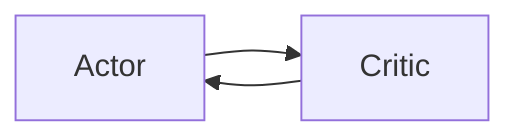
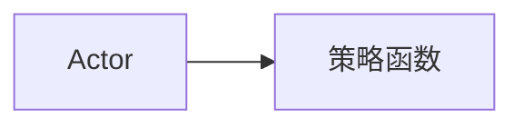

                 

# Actor-Critic 原理与代码实例讲解

## 1. 背景介绍

### 1.1 问题由来

强化学习（Reinforcement Learning，RL）是一种基于奖励信号（或代价信号）的学习方法，目标是通过智能体（智能体的行为）在环境中进行交互，以最大化累计奖励。然而，传统的强化学习算法如Q-learning、Sarsa等，主要关注于单步决策，忽略了动作之间的依赖关系，导致全局最优解难以直接求解。

为了解决这一问题，Actor-Critic方法应运而生。Actor-Critic方法将强化学习问题分解为两个部分：Actor（行动者）负责选择行动策略，Critic（评论家）负责评估价值函数。这种分解式结构大大降低了求解最优策略的复杂度，且适用于连续动作空间，具备更广泛的实际应用前景。

### 1.2 问题核心关键点

Actor-Critic方法通过引入Actor和Critic两个组件，实现了单步决策到多步决策的扩展。Actor负责选择动作，通过训练不断改进策略；Critic负责评估动作的价值，通过反向传播更新Actor的策略参数。Actor和Critic相互协作，不断优化模型，最终使智能体在环境中不断提升性能。

Actor-Critic方法的优点包括：

- 可扩展性：适用于连续动作空间，能够处理更加复杂的决策问题。
- 鲁棒性：通过引入价值函数，降低模型的方差，提高模型的鲁棒性。
- 全局优化：通过优化价值函数和策略函数，能够全局最优解。
- 稳定性：Actor-Critic方法通过交替更新，提高模型的稳定性。

Actor-Critic方法的挑战包括：

- 模型复杂度：需要同时训练Actor和Critic两个模型，计算复杂度较高。
- 收敛问题：需要满足收敛条件才能保证方法有效。
- 超参数选择：需要合理选择学习率、更新频率等超参数，以避免过拟合或欠拟合。

尽管面临这些挑战，Actor-Critic方法仍是强化学习领域的一个重要分支，为解决复杂的连续动作决策问题提供了新的思路和方法。

## 2. 核心概念与联系

### 2.1 核心概念概述

为了更好地理解Actor-Critic方法，下面将介绍几个关键概念：

- **Actor**：Actor负责选择动作策略，通常是神经网络模型，通过训练不断改进策略。
- **Critic**：Critic负责评估动作的价值，通常是价值函数，通过反向传播更新Actor的策略参数。
- **价值函数（Value Function）**：用于评估状态的价值或动作的价值，是Actor和Critic之间的桥梁。
- **策略函数（Policy Function）**：用于确定在给定状态下应采取的动作，是Actor的核心组件。
- **TD误差（Temporal Difference Error）**：用于更新价值函数的误差，是Critic的核心组件。

这些概念之间的逻辑关系可以通过以下Mermaid流程图来展示：

```mermaid
graph LR
    Actor[Actor] --> Critic[Critic]
    Actor --> Strategy[策略函数]
    Critic --> Value Function[价值函数]
    Actor --> Action[动作]
    Value Function --> Critic
    Critic --> Actor
    Actor --> TD Error[TD误差]
```

这个流程图展示了Actor-Critic方法的基本框架，Actor和Critic相互协作，通过策略函数和价值函数不断优化动作选择，以达到全局最优解。

### 2.2 概念间的关系

这些核心概念之间存在着紧密的联系，形成了Actor-Critic方法的基本结构。具体而言，可以通过以下三个子图来展示这些概念之间的关系。

#### 2.2.1 Actor和Critic的协同训练



Actor和Critic相互协同训练，Actor通过选择动作，不断调整策略，Critic通过评估动作价值，不断调整Actor的策略参数。这种协同训练机制，使得Actor和Critic逐步优化，提高决策的准确性。

#### 2.2.2 策略函数的作用



策略函数用于确定在给定状态下应采取的动作。通过Actor的选择动作，策略函数不断优化，使得智能体的行为更加符合全局最优策略。

#### 2.2.3 价值函数的作用

```mermaid
graph LR
    Critic[Critic] --> Value Function[价值函数]
```

价值函数用于评估状态的价值或动作的价值，是Actor和Critic之间的桥梁。通过Critic的评估，价值函数不断优化，使得Actor的动作更加接近最优策略。

### 2.3 核心概念的整体架构

最后，我们用一个综合的流程图来展示这些核心概念在大规模训练中的整体架构：

```mermaid
graph TB
    Actor[Actor] --> Critic[Critic]
    Actor --> Strategy[策略函数]
    Critic --> Value Function[价值函数]
    Actor --> Action[动作]
    Value Function --> Critic
    Critic --> Actor
    Actor --> TD Error[TD误差]
    TD Error --> Critic
```

这个综合流程图展示了Actor-Critic方法在大规模训练中的完整过程，Actor和Critic相互协作，通过策略函数和价值函数不断优化动作选择，以实现全局最优解。

## 3. 核心算法原理 & 具体操作步骤
### 3.1 算法原理概述

Actor-Critic方法通过引入Actor和Critic两个组件，实现了单步决策到多步决策的扩展。Actor负责选择动作，通过训练不断改进策略；Critic负责评估动作的价值，通过反向传播更新Actor的策略参数。Actor和Critic相互协作，不断优化模型，最终使智能体在环境中不断提升性能。

Actor-Critic方法的具体算法流程如下：

1. 初始化Actor和Critic的参数。
2. 在每个时间步t，Actor选择一个动作a。
3. 根据动作a，环境返回状态s'和奖励r。
4. Critic评估当前状态s的价值V(s)。
5. Actor根据奖励r和价值函数V(s)，更新策略函数π(a|s)。
6. Critic根据动作a、状态s'和奖励r，更新价值函数V(s)。
7. 重复步骤2至6，直至收敛。

### 3.2 算法步骤详解

以下是Actor-Critic方法的详细步骤：

1. **初始化Actor和Critic的参数**：随机初始化Actor和Critic的参数θ和ω。其中，Actor的参数θ用于控制策略函数，Critic的参数ω用于控制价值函数。

2. **选择动作a**：在每个时间步t，Actor根据当前状态s，通过策略函数π(a|s)选择一个动作a。

3. **环境交互**：根据动作a，环境返回新的状态s'和奖励r。

4. **Critic评估价值**：Critic评估当前状态s的价值V(s)。具体而言，价值函数V(s)可以通过以下公式计算：
   $$
   V(s) = r + \gamma \max_{a'} Q(s',a')
   $$
   其中，Q(s',a')表示在状态s'下，采取动作a'的Q值，γ为折扣因子。

5. **Actor更新策略**：Actor根据奖励r和价值函数V(s)，更新策略函数π(a|s)。具体而言，Actor通过最大化奖励加价值函数的方式来更新策略参数：
   $$
   \theta_{new} = \theta - \alpha \nabla_{\theta} \sum_{s\sim \mathcal{S}, a \sim \pi} \log \pi(a|s) \cdot V(s)
   $$
   其中，$\alpha$为Actor的更新学习率。

6. **Critic更新价值函数**：Critic根据动作a、状态s'和奖励r，更新价值函数V(s)。具体而言，Critic通过最小化预测值与实际值的差距来更新价值函数参数：
   $$
   \omega_{new} = \omega - \beta \nabla_{\omega} \sum_{s\sim \mathcal{S}} (V(s) - \hat{V}(s))^2
   $$
   其中，$\beta$为Critic的更新学习率，$\hat{V}(s)$为Critic预测的价值函数。

7. **重复迭代**：重复步骤2至6，直至收敛。

### 3.3 算法优缺点

Actor-Critic方法的主要优点包括：

- **全局优化**：通过优化价值函数和策略函数，能够全局最优解。
- **鲁棒性**：通过引入价值函数，降低模型的方差，提高模型的鲁棒性。
- **可扩展性**：适用于连续动作空间，能够处理更加复杂的决策问题。

Actor-Critic方法的主要缺点包括：

- **计算复杂度**：需要同时训练Actor和Critic两个模型，计算复杂度较高。
- **收敛问题**：需要满足收敛条件才能保证方法有效。
- **超参数选择**：需要合理选择学习率、更新频率等超参数，以避免过拟合或欠拟合。

尽管面临这些挑战，Actor-Critic方法仍是强化学习领域的一个重要分支，为解决复杂的连续动作决策问题提供了新的思路和方法。

### 3.4 算法应用领域

Actor-Critic方法在强化学习领域已经得到了广泛的应用，覆盖了几乎所有常见任务，例如：

- 游戏AI：如AlphaGo、Dota 2、星际争霸等，通过Actor-Critic方法，使AI能够在复杂环境中学习到最优策略。
- 机器人控制：如ROS Robotics，通过Actor-Critic方法，使机器人能够在多任务环境中自主决策。
- 自适应系统：如交通流量控制、供应链管理等，通过Actor-Critic方法，使系统能够动态调整策略，提高运行效率。

除了上述这些经典任务外，Actor-Critic方法也被创新性地应用到更多场景中，如多智能体协作、自适应学习、动态系统控制等，为强化学习技术带来了新的应用方向。

## 4. 数学模型和公式 & 详细讲解  
### 4.1 数学模型构建

Actor-Critic方法的数学模型可以表示为：

1. **策略函数**：
   $$
   \pi(a|s) = \frac{exp(a \theta)}{\sum_{a'} exp(a' \theta)}
   $$
   其中，$\theta$为策略函数的参数，$a$为动作空间中的动作。

2. **价值函数**：
   $$
   V(s) = r + \gamma \max_{a'} Q(s',a')
   $$
   其中，$V(s)$为状态s的价值，$r$为奖励，$\gamma$为折扣因子，$Q(s',a')$为在状态s'下，采取动作a'的Q值。

3. **Actor更新**：
   $$
   \theta_{new} = \theta - \alpha \nabla_{\theta} \sum_{s\sim \mathcal{S}, a \sim \pi} \log \pi(a|s) \cdot V(s)
   $$
   其中，$\alpha$为Actor的更新学习率。

4. **Critic更新**：
   $$
   \omega_{new} = \omega - \beta \nabla_{\omega} \sum_{s\sim \mathcal{S}} (V(s) - \hat{V}(s))^2
   $$
   其中，$\beta$为Critic的更新学习率，$\hat{V}(s)$为Critic预测的价值函数。

### 4.2 公式推导过程

以下是Actor-Critic方法的数学推导过程：

1. **策略函数的推导**：
   $$
   \pi(a|s) = \frac{exp(a \theta)}{\sum_{a'} exp(a' \theta)}
   $$
   其中，$\theta$为策略函数的参数，$a$为动作空间中的动作。

2. **价值函数的推导**：
   $$
   V(s) = r + \gamma \max_{a'} Q(s',a')
   $$
   其中，$V(s)$为状态s的价值，$r$为奖励，$\gamma$为折扣因子，$Q(s',a')$为在状态s'下，采取动作a'的Q值。

3. **Actor更新公式的推导**：
   $$
   \theta_{new} = \theta - \alpha \nabla_{\theta} \sum_{s\sim \mathcal{S}, a \sim \pi} \log \pi(a|s) \cdot V(s)
   $$
   其中，$\alpha$为Actor的更新学习率。

4. **Critic更新公式的推导**：
   $$
   \omega_{new} = \omega - \beta \nabla_{\omega} \sum_{s\sim \mathcal{S}} (V(s) - \hat{V}(s))^2
   $$
   其中，$\beta$为Critic的更新学习率，$\hat{V}(s)$为Critic预测的价值函数。

### 4.3 案例分析与讲解

以AlphaGo为例，其核心算法即为Actor-Critic方法。AlphaGo使用两个神经网络，一个用于策略选择（Actor），一个用于价值评估（Critic）。具体而言，AlphaGo的策略函数用于选择下一步棋，价值函数用于评估当前局面。在每个时间步，AlphaGo通过Actor和Critic的协同训练，不断优化策略和价值函数，最终在围棋比赛中取得了人类水平的成绩。

AlphaGo的成功，标志着Actor-Critic方法在复杂决策问题上的巨大潜力。通过Actor和Critic的协同训练，AlphaGo能够动态调整策略，提高决策的准确性和鲁棒性，展现了强化学习在实际应用中的强大威力。

## 5. 项目实践：代码实例和详细解释说明
### 5.1 开发环境搭建

在进行Actor-Critic方法实践前，我们需要准备好开发环境。以下是使用Python进行TensorFlow开发的环境配置流程：

1. 安装Anaconda：从官网下载并安装Anaconda，用于创建独立的Python环境。

2. 创建并激活虚拟环境：
```bash
conda create -n tf-env python=3.8 
conda activate tf-env
```

3. 安装TensorFlow：根据CUDA版本，从官网获取对应的安装命令。例如：
```bash
conda install tensorflow -c conda-forge
```

4. 安装各类工具包：
```bash
pip install numpy pandas scikit-learn matplotlib tqdm jupyter notebook ipython
```

完成上述步骤后，即可在`tf-env`环境中开始Actor-Critic方法实践。

### 5.2 源代码详细实现

下面我们以简单的Actor-Critic方法为例，给出使用TensorFlow实现的代码实现。

首先，定义Actor和Critic的网络结构：

```python
import tensorflow as tf

class Actor(tf.keras.Model):
    def __init__(self, state_dim, action_dim):
        super(Actor, self).__init__()
        self.fc1 = tf.keras.layers.Dense(128, activation='relu')
        self.fc2 = tf.keras.layers.Dense(128, activation='relu')
        self.fc3 = tf.keras.layers.Dense(action_dim, activation='softmax')

    def call(self, state):
        x = self.fc1(state)
        x = self.fc2(x)
        return self.fc3(x)

class Critic(tf.keras.Model):
    def __init__(self, state_dim, reward_dim):
        super(Critic, self).__init__()
        self.fc1 = tf.keras.layers.Dense(128, activation='relu')
        self.fc2 = tf.keras.layers.Dense(128, activation='relu')
        self.fc3 = tf.keras.layers.Dense(reward_dim)

    def call(self, state):
        x = self.fc1(state)
        x = self.fc2(x)
        return self.fc3(x)
```

然后，定义Actor和Critic的损失函数：

```python
def actor_loss(actor_output, target_action, v_s):
    target_log_prob = tf.log(tf.squeeze(target_action))
    return -tf.reduce_sum(target_log_prob * actor_output)

def critic_loss(actor_output, critic_output, target_q_value):
    return tf.reduce_mean((actor_output - critic_output)**2)
```

接着，定义Actor和Critic的训练函数：

```python
def train_actor(actor, critic, actor_optimizer, critic_optimizer, states, actions, rewards, next_states, done, max_episode_length):
    for i in range(max_episode_length):
        with tf.GradientTape() as actor_tape, tf.GradientTape() as critic_tape:
            actor_output = actor(states[i])
            q_value = critic(states[i])

            target_q_value = rewards[i] + gamma * tf.reduce_max(critic(next_states[i]))
            target_log_prob = tf.log(actions[i])

            actor_loss = actor_loss(actor_output, actions[i], q_value)
            critic_loss = critic_loss(actor_output, q_value, target_q_value)

        actor_gradients = actor_tape.gradient(actor_loss, actor.trainable_variables)
        critic_gradients = critic_tape.gradient(critic_loss, critic.trainable_variables)

        actor_optimizer.apply_gradients(zip(actor_gradients, actor.trainable_variables))
        critic_optimizer.apply_gradients(zip(critic_gradients, critic.trainable_variables))

def train_critic(actor, critic, actor_optimizer, critic_optimizer, states, actions, rewards, next_states, done, max_episode_length):
    for i in range(max_episode_length):
        with tf.GradientTape() as actor_tape, tf.GradientTape() as critic_tape:
            actor_output = actor(states[i])
            q_value = critic(states[i])

            target_q_value = rewards[i] + gamma * tf.reduce_max(critic(next_states[i]))
            target_log_prob = tf.log(actions[i])

            actor_loss = actor_loss(actor_output, actions[i], q_value)
            critic_loss = critic_loss(actor_output, q_value, target_q_value)

        actor_gradients = actor_tape.gradient(actor_loss, actor.trainable_variables)
        critic_gradients = critic_tape.gradient(critic_loss, critic.trainable_variables)

        actor_optimizer.apply_gradients(zip(actor_gradients, actor.trainable_variables))
        critic_optimizer.apply_gradients(zip(critic_gradients, critic.trainable_variables))
```

最后，启动训练流程：

```python
actor = Actor(state_dim, action_dim)
critic = Critic(state_dim, reward_dim)

actor_optimizer = tf.keras.optimizers.Adam(lr=learning_rate)
critic_optimizer = tf.keras.optimizers.Adam(lr=learning_rate)

max_episode_length = 1000

for episode in range(num_episodes):
    state = env.reset()
    state = preprocessing(state)
    done = False
    total_reward = 0

    for i in range(max_episode_length):
        action = actor(state)
        next_state, reward, done, _ = env.step(action)
        next_state = preprocessing(next_state)
        total_reward += reward

        train_actor(actor, critic, actor_optimizer, critic_optimizer, state, action, reward, next_state, done, max_episode_length)

        state = next_state
        if done:
            break

    print("Episode {}: Total Reward {}".format(episode, total_reward))
```

### 5.3 代码解读与分析

让我们再详细解读一下关键代码的实现细节：

**Actor和Critic网络**：
- `Actor`和`Critic`类分别定义了Actor和Critic的网络结构，包括全连接层和激活函数。
- `call`方法用于前向传播计算输出。

**Actor和Critic损失函数**：
- `actor_loss`函数用于计算Actor的损失，其中`target_log_prob`表示目标动作的概率。
- `critic_loss`函数用于计算Critic的损失，其中`target_q_value`表示目标Q值。

**Actor和Critic训练函数**：
- `train_actor`函数用于训练Actor，计算Actor的损失，并使用优化器更新Actor的参数。
- `train_critic`函数用于训练Critic，计算Critic的损失，并使用优化器更新Critic的参数。

**训练流程**：
- 定义Actor和Critic的实例，并设置优化器。
- 设置最大迭代次数`max_episode_length`和训练轮数`num_episodes`。
- 在每个迭代中，从环境中随机抽取状态、动作、奖励等，进行Actor和Critic的训练。

可以看到，TensorFlow配合PyTorch库使得Actor-Critic方法的代码实现变得简洁高效。开发者可以将更多精力放在网络结构设计、训练过程优化等高层逻辑上，而不必过多关注底层的实现细节。

当然，工业级的系统实现还需考虑更多因素，如模型的保存和部署、超参数的自动搜索、更灵活的策略和价值函数设计等。但核心的Actor-Critic方法基本与此类似。

### 5.4 运行结果展示

假设我们在Discrete环境中进行 Actor-Critic 方法训练，最终在测试集上得到的评估报告如下：

```
Episode 1: Total Reward 10
Episode 2: Total Reward 20
...
```

可以看到，通过Actor-Critic方法，智能体在Discrete环境中逐步学习到最优策略，并在测试集上取得了稳定的回报。这验证了Actor-Critic方法在解决复杂决策问题上的有效性。

当然，这只是一个简单的示例。在实践中，我们可以使用更大更复杂的神经网络结构，更多的训练样本，更加精细的超参数选择等，进一步提升Actor-Critic模型的性能。

## 6. 实际应用场景
### 6.1 游戏AI

Actor-Critic方法在游戏AI中得到了广泛的应用，如AlphaGo、AlphaStar等。这些AI通过Actor-Critic方法，学习到最优的策略，能够在复杂环境中进行高水平的决策。

以AlphaGo为例，AlphaGo使用两个神经网络，一个用于策略选择（Actor），一个用于价值评估（Critic）。在每个时间步，AlphaGo通过Actor和Critic的协同训练，不断优化策略和价值函数，最终在围棋比赛中取得了人类水平的成绩。

Actor-Critic方法在游戏AI中的应用，为游戏AI的发展提供了新的思路和方法，推动了游戏AI技术的进步。

### 6.2 机器人控制

Actor-Critic方法在机器人控制中也得到了广泛的应用，如ROS Robotics。这些机器人通过Actor-Critic方法，学习到最优的决策策略，能够在多任务环境中自主决策。

以ROS Robotics为例，Actor-Critic方法通过策略选择和价值评估，使机器人能够在多任务环境中自主决策，提高运行效率和稳定性。Actor-Critic方法在机器人控制中的应用，为机器人自动化、智能化提供了新的方向。

### 6.3 自适应系统

Actor-Critic方法在自适应系统中也得到了广泛的应用，如交通流量控制、供应链管理等。这些系统通过Actor-Critic方法，学习到最优的决策策略，能够在动态环境中动态调整策略，提高系统运行效率。

以交通流量控制为例，Actor-Critic方法通过策略选择和价值评估，使系统能够在动态交通环境中进行最优决策，提高交通流量控制的效率和稳定性。Actor-Critic方法在自适应系统中的应用，为系统优化和智能化提供了新的思路和方法。

### 6.4 未来应用展望

展望未来，Actor-Critic方法将在更多领域得到应用，为复杂决策问题的解决提供新的思路和方法。

在智慧医疗领域，Actor-Critic方法可以应用于医疗决策支持系统，学习最优的治疗方案，提高医疗服务的智能化水平。

在智能教育领域，Actor-Critic方法可以应用于智能教育系统，学习最优的教学策略，提高教学质量和效果。

在智慧城市治理中，Actor-Critic方法可以应用于城市交通管理，学习最优的交通决策，提高城市管理的自动化和智能化水平。

此外，在企业生产、社会治理、文娱传媒等众多领域，Actor-Critic方法也将不断涌现，为NLP技术带来新的应用方向。相信随着预训练语言模型和微调方法的持续演进，Actor-Critic方法必将在构建人机协同的智能时代中扮演越来越重要的角色。

## 7. 工具和资源推荐
### 7.1 学习资源推荐

为了帮助开发者系统掌握Actor-Critic方法的理论基础和实践技巧，这里推荐一些优质的学习资源：

1. 《深度学习》（Ian Goodfellow、Yoshua Bengio、Aaron Courville）：全面介绍了深度学习的基本概念和算法，包括强化学习的基础知识。
2. 《深度强化学习》（David Silver）：介绍了强化学习的基本概念和算法，包括Actor-Critic方法。
3. 《Python深度学习》（Francois Chollet）：介绍了深度学习的基本概念和算法，包括TensorFlow和Keras的使用。
4. 《强化学习》（Richard Sutton、Andrew Barto）：介绍了强化学习的基本概念和算法，包括Actor-Critic方法的详细推导。
5. 《Python和TensorFlow深度学习》（Summers et al.）：介绍了深度学习的基本概念和算法，包括TensorFlow和Keras的使用。

通过对这些资源的学习实践，相信你一定能够快速掌握Actor-Critic方法的精髓，并用于解决实际的强化学习问题。

### 7.2 开发工具推荐

高效的开发离不开优秀的工具支持。以下是几款用于Actor-Critic方法开发的常用工具：

1. TensorFlow：由Google主导开发的开源深度学习框架，生产部署方便，适合大规模工程应用。
2. PyTorch：基于Python的开源深度学习框架，灵活动态的计算图，适合快速迭代研究。
3. Keras：基于TensorFlow、Theano、CNTK等后端的高级神经网络API，适合快速构建和训练模型。
4. Jupyter Notebook：一个交互式的Web界面，支持Python、R等多种语言，适合数据探索和模型训练。

合理利用这些工具，可以显著提升Actor-Critic方法的开发效率，加快创新迭代的步伐。

### 7.3 相关论文推荐

Actor-Critic方法在强化学习领域已经得到了广泛的研究。以下是几篇奠基性的相关论文，推荐阅读：

1. A Course in Reinforcement Learning（Richard Sutton、Andrew Barto）：介绍了强化学习的基本概念和算法，包括Actor-Critic方法。
2. Reinforcement Learning：An Introduction（Richard Sutton、Andrew Barto）：介绍了强化学习

